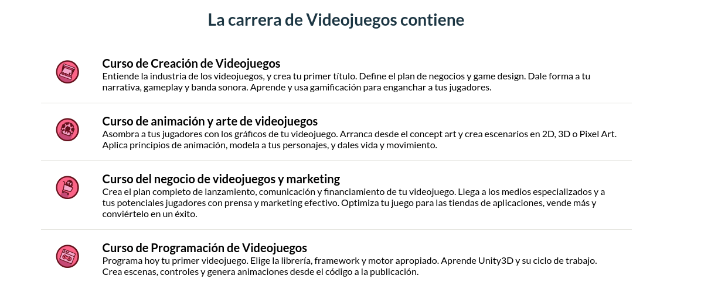
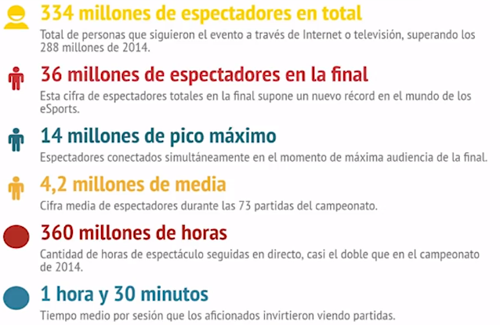
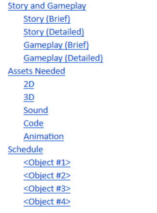
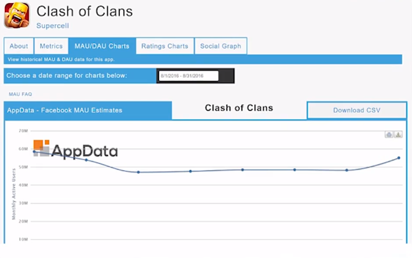
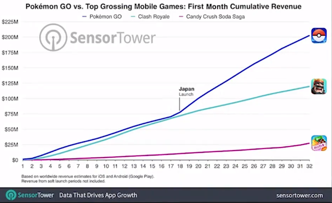
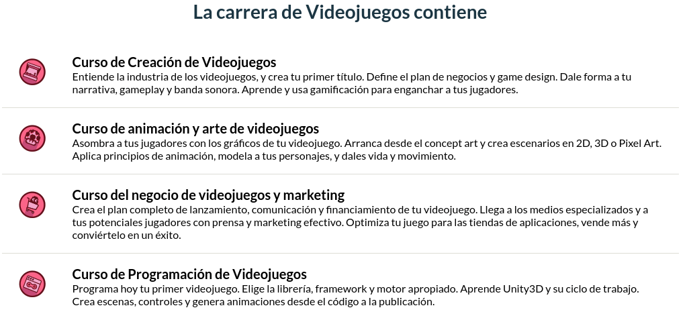
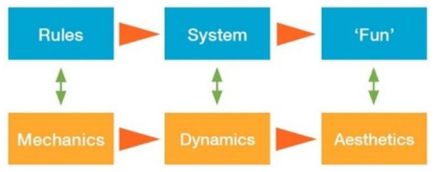
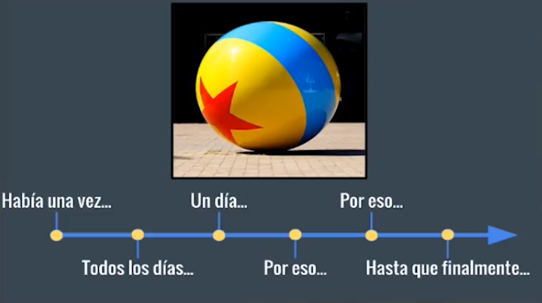
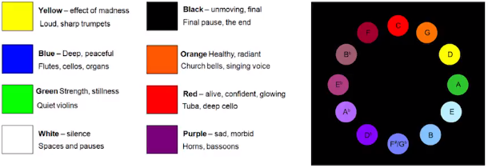

# Curso de Creación de Videojuegos
## Modulo 1. Introducción a la Industria
### Clase 1 *Bienvenidos al curso*

Su profesor será Alberto Pérez-Bermejo, cofundador de Video Game Army, quien, en conjunto con Platzi, creo una carrera donde conoceremos todo el flujo de trabajo desde la creación hasta la distribución de un videojuego.

### Clase 2 *Historia personal*

Alberto te cuenta su historia en la industria de los videojuegos.

### Clase 3 *El principio*

De la década de los 90' a la época actual, existe unos mil de diferencias.

Las computadoras profesionales, usadas para los trabajos y creación en 3D, de esa épocas usaban monitores de 14'', 32MB de RAM, 3.2GB de disco duro y 4MB de tarjeta gráfica. La internet tenía una velocidad de 56KBPS, considerado lo más veloz.

**Buscadores de internet**
- 1994 , Yahoo!
- 1994, Lycos
- 1995, altavista
- 1998, Google! Beta

Los buscadores antiguos enlistaban como un directorio todos los contenidos. Existía un botón de *'agregar una URL'* o *'promocionar una URL'* en donde la gente decía cuál era la página que habías visto y te interesaba, y a los días un operador de esa compañía lo indexaba en sus listados de base de datos.

A diferencia de los buscadores actuales, no tenían sistemas automáticos como bots o arañas que van revisando enlaces y los va rutinando.

Era difícil formarse independientemente, encontrar información o tener tutoriales, y no existían carreras o plataformas que ayudaran a educar sobre las creaciones de videojuegos.

### Clase 4 *Evolución a entornos gráficos*

A finales del 97' y principios del 98' salió a la venta un paquete integrado para desarrollar videojuegos llamado DIV Game Studio.

Este paquete contaba con un editor de videojuegos, editor de código para programar, editor de sprite para animar y trabajar con pixel para hacer escenarios y personajes, también contaba con una serie de videojuegos de diferentes temáticas que venían con su código y gráficos abiertos para ser editados para hacer tus propios mods o modificaciones de videojuegos facilito la entrada a nuevos programadores a la industria.

Para finales del 98' llega Windows 98 a las computadores, esto supone un salto en la forma de trabajo y en cómo se consumían los software y videojuegos desterrando casi por completo los videojuegos MS-DOS que cada vez era menos querido.

Muchas veces se empieza un videojuego como una pequeña aventura con un grupo de amigos o un grupo de conocidos ya sean en la universidad, en la escuela o en el trabajo y no pensamos un poco en el cuadro organizativo de que perfiles debería tener un videojuego profesional.

Probablemente se deja el sonido para el final, empiezan sin un game desingner, tampoco existe un productor que vele por el proyecto y, es casi seguro, que los miembros del equipo cumplan 2 o más funciones totalmente diferentes.

Ilusionados, pensamos que con esto seremos capaces de sacar todo delante sin saber que el desarrollo de un videojuego es un trabajo muy largo y conlleva mucho tiempo. A medida que se avanza puede haber cambios en el equipo, en el desarrollo del juego o en el concepto de la idea ya sea porque quieren introducir nuevos elementos, jugaron otros videojuegos y desean unir diferentes piezas, y es en este momento que más hace falta la figura de un productor que vele para que el proyecto llegue a tiempo y calidad al jugador.

### Clase 5 *¿Cuándo termina la creación de un videojuego?*

Hoy en día no es solo hacer un videojuego y llevarlo al mercado, hay que saber las técnicas para que ese juego  tenga visibilidad y llegue con la máxima calidad al mercado con los contenido, la jugabilidad, la diversión y el mensaje que deseas hacerle llegar al jugador.

Sin el seguimiento del juego, morirá y pasara desapercibido por el usuario. El trabajo no acaba cuando se termina un videojuego, hay una postproducción en la continuamente se debe vigilar las métricas y haciendo actualizaciones, y corrigiendo errores.

### Clase 6 *La edad social*

Los videojuegos están muy presentes en nuestra vida, ya sea que camines por las calles o vas en autobús, siempre encuentra a alguien que este jugando desde su smartphone o, cada vez menos, una consola portátil. Esto que nos parece normal, años atrás era considerado ciencia ficción.

No existían las consolas portátiles, las consolas domesticas eran muy nuevos y lo habitual era encontrar los juegos en Arcade. La introducción de los teléfonos móviles, smartphone y consolas portátiles han ido desplazando los arcade a un lugar más de coleccionismo, hoy en día es más común encontrarlo en una casa que en un establecimiento.

No es de extrañar, por tanto, que lo que antes se veía como una gran amenaza por nuestro padres, ahora se vea como una gran oportunidad para nuestros hijos. Tal como fue dicho por Tomás Merlo, promotor y músico de Retro Band Systems;

***Ya no me llaman viciado, ahora soy Gamer.***

Aunque aún se puedan encontrar casos de ataques contra los videojuegos, todos ellos incluido los violentos es entendido como una forma de expresión o arte, ya no causa alarma ni es perseguido.

### Clase 7 *Los inicios de la industria*

Los historiadores dicen que conocer el pasado nos ayudaran a entender el presente y a poder prepararnos para nuestro futuro. En el caso de los videojuegos, conocer su historia nos dará una ventaja competitiva frente a los estudios de nuestros nivel, una ventaja que puede influir en nuestro éxito o fracaso en esta industria.

Los videojuego son una industria muy joven, nos encontramos que quienes vienen a estudiarla muchas veces no conocen el pasado, no conocen los autores de los videojuegos más famosos y, en la mayoría de los casos, solo jugaron juegos actuales. En otras ramas, como el cine o la música, sería impensable ver un estudiante que no sepa quién es Coppola o Spielberg, quien es Beethoven o Mozart, autores que no son de su tiempo, pero que conocerlos claramente te da una ventaja competitiva.

Inicio de los videojuegos.
- 1947, dispositivos de entretenimiento de tubos de rayos catódicos
- 1950, 1951, programa de ajedrez
- 1951, NIM
- 1952, OXO / Ceros y Cruces (tres en rayas, gato, Tatetí, Triqui, juego del gato)
- 1958, Tennis for Two (Tenis para Dos)
- 1961, Spacewar!
- 1966, Odyssey
- 1971, Computer Space
- 1972, Pong

Para conocer la historia de los videojuegos no es necesario volver 3000 años atrás, con medio siglo es suficiente, pero igualmente no queda claro cuál es el origen. Es difícil determinar cuál fue el primer videojuego, esto se debe el término 'videojuego' tiene muchos significados y no muchos están de acuerdo en cuál es el adecuado. En función a cual definición de videojuego aceptemos, decidimos que el primer puede ser uno u otro.

Una de las definiciones con la que nos solemos quedar es que 'videojuego' consta de la palabra 'video' y 'juego' entendemos por tanto que es un juego de video. En esta definición no encajaría los juegos tradicionales como el ajedrez o los juegos electrónicos, aunque estos constas de leds probablemente no puedan ser llamados videojuegos.

La definición con la que podríamos empezar a trabajar seria:

  ***Aplicación interactiva orientada al entretenimiento que, a través de interfaces o controles, permite simular experiencias en la pantalla de un televisor, computadora u otro dispositivo electrónico.***

Como veremos más adelante, en la parte de videojuego serio, no es necesario que entretenga. Hoy en día se pueden hacer videojuegos educativos, videojuegos personales o videojuegos históricos que quieran transmitir una serie de emociones más avanzadas, y no por ello se dejan de considerar videojuegos.

Partiendo de esta definición, los videojuegos más aceptados serían OXO de Alexander S. Douglas, estudiante de la universidad de Cabridge, y Tennis For Two de William Higinbotham, un ingeniero norteamericano que participo en el proyecto Manhattan.

Los videojuegos en sus inicios, como podemos deducir, estaban muy ligados al desarrollo tecnológico y estos a su vez estaban ligados al desarrollo armamentístico. El ejército estadounidense y, posteriormente, el británico y el ruso invertían mucho dinero en tener equipos potentes que pudiesen predecir con inteligencia artificial el movimiento de misiles. Esto marco muchos a esos primeros ingenieros que desarrollaron estos videojuegos primitivos

### Clase 8 *El videojuego como negocio*

En 1961 se lanza Spacewar que, aunque es considerado el primer videojuegos de disparo, nunca llegaría a comercializarse. Fue desarrollada por una asociación de estudiantes liderada por Steve Russell dentro del MIT.

Spacewar, para moverse, necesitaba una maquina valorada por 100.000 dólares, es por esto que no se vio como un producto comercial y solo se distribuyó en centros de investigación, estos estaban muy ligados a la milicia y a cuerpos militares. Posteriormente Steve Russell dejaría ese grupo de trabajo para unirse como programador a la empresa de Nolan Bushnell. Esta empresa fue pionera y posteriormente transformada en Atari, pero antes de que Atari apareciera hubo tiempo para otro visionario más.

Ralph Baer que había escapado de la Alemania nazi, justo antes del holocausto y que también había participado en la Segunda Guerra Mundial, lanzo en 1968 el Brown Box y venia con el videojuego Chase Game.

Dos años más tarde, en 1970, la empresa Magnavox saco una versión más avanzada del Brown Box llamada Magnavox Odissey y fue lanzada con 12 videojuegos que eran conectadas a una televisión cualquiera.

Este primer prototipo de consolas fue lanzada en diversas ferias, posteriormente se demostró que Nolan Bushnell (fundado de Atari) participo en una de esas ferias como asistente y de ahí quito la idea para crear su Pong. Este hecho fue determinante para darle la razón a Ralph Baer en la disputa contra Nolan Bushnell por los derechos de una maquina conectada a un televisor. Ralph Baer tenía la patente de la consola con dos mandos, Nolan tuvo que ceder y pagarle a Baer 400.000 dólares en concepto de indemnización.

En 1973 se crea Atari, fue la primera empresa en tomarse en serio los videojuegos y pensar en ellos como un producto comercial. Se podría decir que Atari fue la empresa que creo la industria, una industria que hoy en día supera en ingresos a las productoras cinematográficas de Hollywood o a las discográficas.

**¿Quién era Nolan Bushnell?**

Nolan era un ingeniero estadounidense de 28 años que se inspiró en uno de los juegos más legendarios de Japón, el Go. Al igual que el ajedrez, cuando vas hacer jaque mate se le avisa al contrincante con la palabra 'Atari' a modo de cortesía.

Nolan hizo la oferta de mil euros a otro ingeniero, Allan Alcorn, a quien convenció y dio falsa seguridad asegurando que tenían un contrato con la General Electric. En aquel momento, Estados Unidos estaba en plena guerra con Vietnam por lo cual los jóvenes estaban muy influenciados y tenían un sentimiento de rebeldía, esto impulso a Allan Alcron a dejar su trabajo y lanzarse a esta aventura, en este ambiento como primer producto lanzaron Pong.

Pong constaba de una caja de madera y una cajetilla para echar monedas, por dentro instalaron la tecnología necesaria para hacer correr el juego. Esto fue instalado en el bar más cercano, siempre se cuenta que al día siguiente llamaron a los ingenieros para decirles que su máquina no había resistido ni un día, que ya estaba estropeada. Posteriormente ellos acudieron al bar y vieron que la maquina ya estaba llena de monedas.

Con esto, ellos ya tenían su MVP (mínimo producto viable), demostraron que tenían un negocio y ahora solo debían apostar fuerte. Decididos, alquilaron una pista de patinaje para tener unas grandes oficinas y empezaron a contratar a gente desempleada, al cabo de 6 semanas ya eran capaces de producir cien maquinas al día, y unos días después recibieron un millón de dólares de inversión.

Si podían llegar a los bares y establecimiento… ¿Por qué no llegar a los hogares?

Nolan planeo empaquetarlo y venderlo a las jugueteras, pero ninguna juguetera estaba dispuesta a hacerse cargo del producto. Esta negativa los llevo a contactar con el departamento de deporte de los almacenes Sears, no era de extrañar pues al final Pong era una simulación simplificada del tenis y a Sears les encanto tanto que encargo 150.000 unidades para producirlas antes de las navidades de 1975. En este caso Sears dispuso de los videojuegos en todos sus almacenes para que estuvieran disponibles para comprarlos y, además, emitió un anuncio en televisión con el que vendieron todas las unidades.

Atari desato la fiebre, los salones de juego recorrían todo el mundo y, en la misma Atari, llego a trabajar de programador Steve Jobs, en donde creo un juego llamado Breakout que constaba de romper unos bloques.

Steve Jobs dejo Atari para fundar Apple en 1976, tan solo un año después, e incluso con la amistad que había hecho con Nolan Bushnell llego a ofrecerle un tercio de las acciones por 50.000 dólares, algo de lo que Nolan reconoce haberse arrepentido alguna vez.

Para no centrarnos únicamente en el mercado de las consolas y en su evolución, pensemos que en estos momentos se estaba vendiendo Apple II, hasta entonces el Apple I era vendido mano a mano a los aficionados de informática, nunca se había vendido en masa y los ordenadores de entonces carecían de sistema operativo. Apple II incorporo los teclados que conocemos como teclado QWERTY y, además, dos unidades de disquete, esto posibilito a los desarrolladores compartir videojuegos.

Nuevamente los ingenieros del MIT fueron los primeros en lanzar una aventura grafica de modo texto que tuvo como nombre 'Zork'. Su éxito se debía que fue de los primeros que se podía jugar en diferentes plataformas. La ventaja de Apple II era que no desentonaba con otro electrodoméstico de la familia, no era una maquina rara, se podría fácilmente quitarle la tapa trasera de plástico y extenderle hasta 48KB de memoria a través de sus ocho slots. Se cuenta que tuvo más de 180 clones conocidos.

### Clase 9 *Los grandes de la industria*

Con el lanzamiento en 1977 de la Atari 1600 se da por inaugurada la segunda generación de consolas, en 1979 se le une Intellivision de la juguetera MATTEL, en 1982 la Atari 5200, y en 1982 la ColecoVision de Colecho.

Era 1976, Atari seguía creciendo y si antes decíamos que Steve Jobs, cuando estuvo en Atari, se inspiró en Pong para lanzar Breakout, a la japonesa Taito le ocurrió lo mismo para lanzar Space Invaders en 1978. Taito aseguro que su inspiración se basó en el Breakout de Steve Jobs y en las películas de ciencia ficción de la época, como Guerra de los Mundos, Star Trek o Star Wars.

Era el momento justo para lanzar un juego de invasión espacial y Space Invaders tuvo tanto éxito en Japón que acabo produciendo una escasez de monedas de 100 yen. Había salido del mercado japones sin ningún tipo de copyright y se llenó de clones hasta que 1978 Atari se hizo con sus derechos después de una larga disputa.

Atari se había convertido en la empresa que más rápido había crecido en la historia de Estados Unidos y llamo la atención de la productora Warner, quien la adquirido por 28 millones de euros.

Como curiosidad, Taito seguiría lanzando videojuegos; en 1986 lanzo Bubble Bubble y, posteriormente, en 2005 seria comprada por la poderosa Square Enix.

Volviendo a 1981, con la aparición de un sistema operativo unificado la venta de los ordenadores personales se disparó, tan solo en ese año se vendió más que en los cinco años anteriores. Un año después, en 1982, casi duplica esa cifra. Este fue un momento muy importante en la industria de los ordenadores personales, MS-DOS aparecía a partir de QDOS (Quick and Dirty Operating System o Sistema Operativo Rápido y Sucio), Microsoft compro ese sistema operativo para vendérselo a IBM cuando le dijo que ya tenía uno.

En ese mismo año, 1981, iba aparecer otra figura mítica en el desarrollo de los videojuegos; la nipona Nintendo.

Nintendo ya tenía más de 100 años de historia como empresa de ocio. Anteriormente lanzaba barajas de cartas y no fue hasta 1981 cuando decidieron lanzar Donkey Kong para los salones recreativos.

Donkey Kong fue el primer encargo para el creativo japones, Shigeru Miyamoto, hoy en día considerado un genio de los videojuegos.

En 1980, Toru Iwatani lanzo Pac-Man en la compañía Namco. Hasta entonces los videojuegos estaban muy centrados en la guerra, naves espaciales, disparos y violencia, Toru Iwatani quería crear un nuevo concepto. Cuando estaba reunido con unos amigos comiendo una pizza se dio cuenta que podía hacer un juego basado en comer, ahí es cuando se da la forma al protagonista, Pac-Man. El nombre proviene de la onomatopeya japonesa paku, sonido que se produce al abrir y cerrar la boca, romanizado queda Puck-Man en Japón; puck se pronuncia pac en español. Midway, una empresa estadounidense desarrolladora de videojuegos, lo modificó a Pac-Man para el mercado estadounidense (y posteriormente a otros mercados occidentales) debido a que la gente podría cambiar la 'P' de Puck-Man, por una 'F'.

Dejamos 1982 con récords históricos de ventas para Atari, pero una serie de malas decisiones tan solo un año después fueron los causantes de lo conocido como la crisis de 1983. Los nuevos gerentes de Warner habían cambiado completamente los rumbos de la empresa, se dice que no eran conscientes de lo que tenían entre manos ni el esfuerzo que llevo construir Atari, choques con la directiva acabaron con la expulsión de Nolan Bushnell de la empresa. Nolan aseguro en declaraciones que se habían olvidado que los ingenieros eran las verdaderas estrellas y eran tratados ya como peones de una fábrica.

Todo el mundo quería trabajar en videojuegos, la demanda se había disparado y Warner pensó que era un buen momento para ajustar el sueldo de los trabajadores. Los trabajadores entonces cobraban 50 o 60 mil euros más un porcentaje en las ventas, esto a Warner le parecía totalmente desproporcionado y empezaron a bajar los sueldos. Cuatro de los empleados; Alan Miller, Larry Kaplan, David Crane y Bob Whitehead, se dieron cuenta de que entre ellos solo producían el 60% de los videojuegos de la empresa, y no tardaron en dejar Atari y fundar Activision lanzando su primer éxito Pitfall. Con Activision, estos cuatros ingenieros pasaron a facturar 50 millones de euros en tan solo año y medio.

En 1983 el mercado estaba totalmente saturado de los clones de juegos exitosos, la prensa no dejaba de decir las cifras asombrosas que se podían ganar en el mundo de los videojuegos y eso desemboco en que muchas empresas amateur se lanzaran a hacer juegos, juegos y juegos con una calidad bastante mediocre. El mercado estaba saturado y los consumidores cada vez veían juegos de peor calidad, el propio juego de Toru Iwatami salió con una calidad malísima en la Atari 2600 con respecto a lo que se había mostrado en las versiones de arcade.

En ese momento de saturación y duda llega E.T.

***Nota curiosa: En España, el juego de Pac-Man es coloquialmente conocido como Comecocos debido a que fue anunciada de esta manera en televisión su versión para Atari 2600, aunque el nombre oficial seguía siendo el mismo.***

### Clase 10 *La crisis del 83*

Continuamos con Atari en 1982 que iba ser precursor del 83'.

Atari venia de haber hecho un gran año con juegos, como Space Invader y Pac-Man, que habían dejado muchos beneficios y estaba liderado la segunda generación de consolas. Por tanto, gozaba de 'muy buena salud' y estaba dejando videojuegos que serían franquicias en las posteriores generaciones, fue entonces que llego E.T, el juego basado en la película de Steven Spielberg del mismo nombre. Existe un documental llamado Atari: Game Over, donde cuentan como este videojuego tuvo un fracaso comercial que termino llevando a Atari sepultar millones de cartuchos en un vertedero de Nuevo México.

La historia va más allá, se cuenta que Atari, al tener que lidiar con una propiedad intelectual tan complicada como lo era una película de Steve Spielberg que había tenido mucho éxito, tuvo meses de pelea con los abogados para ganar la licencia y poder desarrollar el videojuego. Esta pelea dejo muy poco tiempo para que Atari desarrollara el videojuego y les quedaron únicamente 6 semanas para que lo puedan lanzar en la campaña de navidad, así Atari decidió recurrir a uno de sus desarrolladores estrellas, Howard Scott Warshaw, que había desarrollado grandes videojuegos para la Atari 2600. Howard se encargó solo de crear completamente todo el juego, si bien esto llevo a que incumpliera todas las leyes de desarrollo de videojuegos, no llego a ser un gran Game Desing. Al principio comenzó como una idea maravilla de un cubo en el que se encontraba E.T, podía avanzar por todas las dimensiones e iba buscando piezas de su teléfono para poderlo juntar y regresar a casa, esto sería un juego con componentes narrativos, se hablaría con personajes de la película que irían dando pistas para poderlos juntar.

El juego contaba con una mecánica complicada, tenía agujeros extraños que no permitían avanzar, el juego quedaba reseteado y era sabido que ese juego no tuvo una etapa de prueba antes de que llegue al usuario, y con las prisas se lanzó directamente al completarse.

Al Alcron, otro de los ingenieros de Atari que fue quien creo Pong junto con Nolan Bushnell en la primera etapa, dice que cuando vio resultado final del videojuego se echó a llorar. Esto nos una pista de porque el juego de E.T es considerado el peor juego de la historia.

Sin embargo, es injusto echarle toda la culpa a E.T sobre las pérdidas que había presentado Atari, que en ese año fueron por encima de los 250 mil euros y en el descenso de la saturación que se redujo un 90% con respecto al año pasado. Pero la realidad era que la industria empezaba a retroceder y este juego fue la punta.

Atari fue comprada en 1976 por Warner, fue posteriormente vendida un año después de la crisis, en el 84', en dos partes. Una parte, la del hardware y ordenadores personales, fue vendida a su rival Commodore, un año después en 1985-1986 la parte de Atari Games fue vendida a la compañía de videojuegos Namco.

Atari Games permaneció a manos de Namco durante un año, aunque posteriormente fue comprado por un grupo de trabajadores que la renombraron Midway. Como Midway, estuvo una década produciendo videojuegos hasta que paro la producción y la volvió a comprar Warner. Como Midway, estuvo una década produciendo videojuegos hasta que paro la producción y la volvió a comprar Warner

La vida de la marca Atari fue muy activa, perdiendo valor en cada cambio y llego a pasar incluso por Hasbro en 1998, quien finalmente la entrego GT Interactive que fue renombrada como Infogrames y es la actual propietaria de la marca.

Infogrames era una compañía francesa que tuvo bastante éxito con el lanzamiento de Alone in the Dark, un videojuego para PC, y posteriormente con las adaptaciones de los comics franceses como Asterix y Obelix o el mismo Tintín, y desarrollando videojuegos basados en series de animación de la propia casa de Warner. En los últimos años, Infogrames volvió a publicar videojuegos con la marca de Atari sobre todo en Estados Unidos.

Hasta aquí llega la historia de Atari, quienes fueron pioneros y levantaron el mercado de donde no había nada, los primeros que vieron al videojuego como un producto, un negocio del que poder vivir y el hueco que dejo fue rápidamente cubierto por otras marcas de ordenadores personales y consolas.

Entre 1983 y 1992 fue una época conocida como la Edad de oro del software español durante la cual España llegó a ser, detrás del Reino Unido, uno de los mayores productores europeos de software de entretenimiento para máquinas de 8 bits. Estaba especialmente centrado en el Sinclair ZX Spectrum, un ordenador de 8 bits bastante limitado con dos configuraciones de RAM (32 kB o 64 kB), una paleta de colores reducido que en realidad era 7 colores, con dos tonalidades de brillo y el negro.

En la misma época (1982-1983) hacia entrada en escena Commodore 64 para rivalizar con el ZX Spectrum que tenía capacidades técnicas parecidas, contaba con una RAM de 64 kB y una paleta limitada a 16 colores, pero que no fue un impedimento para que se convirtiera en un auténtico éxito de ventas con más de 10 millones de unidades que para esa época era mucha.

### Clase 11 *Los primeros PC Gaming*

En 1983 se quería introducir al mercado lanzando un computadora personal más potente, Apple LISA, que tomo el nombre de la hija no reconocida de Steve Jobs. Aunque Steve Jobs en la etapa final no participo en el lanzamiento, porque ya se había divido Apple en dos departamentos y él dirigía la parte de Macintosh.

La computadora personal fue creada por el japones Kazuhiko Nishi, quien además mantenía una amistad con Bill Gates (fundador de Microsoft) y, que por esas conversaciones, termina agregando el lenguaje BASIC como lenguaje para agregar los videojuegos y aplicaciones en esta plataforma. En la MSX fueron creadas varias sagas míticas que perduraron en las generaciones posteriores.

Por aquella época hablar de Konami era sinónimo para Hideo Kojima, quien fue importante para el desarrollo de los videojuegos de MSX. Hideo Kojima es un diseñador de videojuegos japones que lanzo su primer videojuego a los 23 años, Penguin Adventure, pero con lo que se hizo realmente popular fueron con las míticas sagas de Castlevenia y Metal Gear. Castlevenia por esos momentos se llamaba Vampire Killer.

Hideo Kojima ha estado últimamente muy expuesto a los medios debido a su polémica salida de Konami, de la cual ha habido líneas y líneas de rumores sobre los motivos de su salida precipitada de la compañía, pero que tuvo tiempo de lanzar los últimos juegos de la saga apoyándose en un estudio de Madrid, MercurySteam, y en el E3 del 2016 dio un vistazo a su nuevo proyecto en solitario, Death Stranding.

Volviendo a la evolución de los ordenadores personales el Amstrad CPC 464 era lanzado en 1984, subiendo la memoria RAM base a los 512 KB y la paleta de colores a 27, lo cual era casi el doble de lo que tenían ZX Spectrum o el anterior Commodore 64.

Pero, 3 años más tardes, Commodore iba atacar con la Commodore Amiga 500 que rivalizo durante la época de los 16 bits, esa cuarta generación de consolas, porque ya alcanzaba una paleta de 32 colores llevaba desde los 512 KB de RAM iniciales hasta 8 MB, una resolución que iba desde los 320x200 pixeles hasta el doble, 640x400 pixeles, y contaba con el famoso microprocesador Motorola 68000, que se ha estado estudiando por décadas en las escuelas de videojuegos o en las universidades de informática.

### Clase 12 *Los genios de la época*

Armin Gessert y Manfred Trenz fueron dos alemanes que vivían en dos ciudades pequeñas de la frontera de Francia con Alemania que en 1987 lanzaron su primer videojuego, una especie de clon de Super Mario Bros llamado The Great Giana Sisters en el que la estética, los sonidos y la jugabilidad junto con los personajes y las mecánicas fue demasiado influenciado y basado en el juego de Miyamoto, tanto es así que la propia Nintendo les emitió una demanda, y tuvieron que retirarlo de las estanterías meses después,

Armin Gessert por su parte continuo su carrera en la industria creando la compañía Spellbound y lanzando la saga Desperados. La primera versión, distribuida por Infogrames, y la segunda ya con el sello de Atari, que recordemos sigue siendo propiedad de Infogrames.

El juego de The Great Giana Sisters, a pesar de ser retirado por parte de Nintendo, ya estaba en la memoria de los aficionados y le rindieron un homenaje en 2007 a la banda sonora en el concierto Play! A Video Game Symphony. Dos años después, en el 2009, Armin Gessert tuvo tiempo de lanzar un remake de Giana Sisters y poco meses después nos dejó debido a un ataque al corazón que sufrió con la temprana edad de 46 años. Detrás de esa triste noticia su legado perduro, extrabajadores de Spellbound fundaron posteriormente la compañía Black Forest Games y desarrollaron dos versiones de Giana Sisters del cual poseían las licencias, propiedad intelectual heredada de Spellbound, y fue lanzado en las plataformas de Android primero con una estética un poco más cartoon y posteriormente en Steam con una estética 3D, mucho más cuidada y mejores mecánicas, el juego es entre varios mundos y ya parece mucho más original.

El otro 50% del The Great Giana Sisters original era Manfred Trenz, quien por entonces era ilustrador, y realmente estuvo desarrollando con un primitivo editor grafico llamado KoalaPainter todos los gráficos del juego hasta que posteriormente dio el salto a programador, realizo un videojuego llamado Katakis que era un clon del R-Type, el parecido jue suficiente para que el equipo de R-Type llamara a su puerta y, en lugar de denunciarlo, fue para contratarlo. Le encargaron que tradujera el código recreativo de R-Type a ensamblador para poder publicarlo en Commodore 64, esto se debía a que no encontraban programadores con la calidad de Trenz para desarrollarlo.

Manfred Trenz se había convertido en un gran programador, respetado en la industria sobre todo por su trabajo con la saga Turrican que lo saco para diversas plataformas, pasando de Commodore 64, Amiga 500, Amstrad, en las primeras consolas de 8 bits posteriormente a la Super Nintendo de 16 bits y luego finalizo queriendo sacar unos remake de sus antiguos juegos, Kataki 3D y Turrican 3D, pero la compañía con la que trabajaba entonces se dice que le ponían presión con las fechas, no estaba demasiado a gusto, Trenz era alguien acostumbrado a trabajar solo y tomarse su tiempo en pulir detalles, por lo que acabo rechazando los dos proyectos.

Cuando se habla de alguien que exprime las maquinas por las que pasa, que tiene gusto por la máxima calidad y que desarrolla sus propios motores siempre nos viene a la cabeza el estudio id Software, montada por unos jóvenes John Carmack y John Romero, fueron programador y diseñador de juegos respectivamente, primero de Wolfenstein 3D y posteriormente del mítico Doom.

Wolfenstein 3D, creado en 1992, presentaba un motor propio revolucionario. Son considerado los creadores del género First-person Shooters (FPS) que ha llegado hoy a ser uno de los géneros más demandados de la industria.

Seguido de Wolfenstein, un año después sacaron Doom que fue un poco la evolución del motor y la conservación del id Software como equipo de desarrollo. John Carmack gozo de mucha prensa y popularidad desde entonces hasta la actualidad, conocido y respetado como un programador de alto nivel, y que ha sido reclutado por Facebook para encargarse de la división de Oculus Rift, unas gafas de realidad virtual que adquirieron recientemente y en las que John Carmack desempeñara un papel como líder de la tecnología.

La otra mitad, John Romero, también tuvo proyecto propios, un poco controvertidos por los retrasos continuos y la falta de calidad que tuvieron después de generar mucho hit.

Como curiosidad, id Software tuvo un tercer fundador llamado Adrian Carmack, que no tiene ninguna relación con John Carmack, pero que fue diseñador gráfico durante 12 años pero termino siendo expulsado del equipo fundador, un poco por la espalda, dándole 10 millones de euros como indemnización.

No podemos dejar el apartado de la industria de los PC Gaming sin hablar de LucasArts.

LucasArts fue una compañía subsidiaria a Lucasfilms de George Lucas que nos dio a conocer auténticos magos de la creación de historias y aventuras graficas conversacional como Monkey Island, Indiana Jones and the Fate of Atlantis, Day of the Tentacle, Sam & Max, etc. De los empleados más conocidos, salen Tim Schafer y Ron Gilbert.

Tim Schafer hizo escena nuevamente en el 2013 cuando participo en una plataforma de crowdfunded, Kickstarter, famoso por su éxito en donde solicitaba 400 mil para desarrollar una nueva aventura gráfica y consiguió recaudar casi 4 millones. Tanto fue así que el mismo se lo tomaba a broma y empezó a sacar unas series de imágenes en que mostraba como 'trabajaba duramente' con el dinero que había recaudado.

Ron Gilbert también se lanzó en la aventura de Kickstarter con un remake de sus aventuras gráficas, esta vez con una estética más de corte clásico que se llamó Thimbleweed Park y que no tuvo tanto éxito como Tim Schafer, pero recaudo unos 600 mil dólares que sin duda le permitirá lanzarlo y hacer la post producción con cierta calidad.

### Clase 13 *3ª Generación - Los 8 bits*

Vamos a dejar de lado un poco la industria del ordenador personal y vamos a centrarnos en la industria de las consolas, en la 3ra y 4ta generación donde tienen el foco especialmente en Japón dejando un poco de lado Estados Unidos, estamos hablando de esa franja temporal de 10-13 años desde el 1983 al 1993 o 1996 cuando dimos por terminada la época de Atari y vimos el resurgir de otras compañías que querían quedarse con ese hueco; en el caso de los ordenadores personales ya hemos visto que hubo una guerra bastante emocionante, y no fue menos emocionantes en el caso de las consolas.

En el 83' el protagonista del videojuego, Donkey Kong, que por aquel entonces era un carpintero que aparecía con un martillo y dabas salto vestido de rojo al que originalmente se llamaba Jumpman («hombre saltarín» en inglés) que acabo convirtiéndose en Mario y salió con su hermano, Luigi, en la consola de Atari 2600 justo antes de su declive. Desde ese momento, decir Mario Bros es decir Nintendo, paso a ser una imagen insignia de la marca y con la que se proyecta al mundo, y su creador, Shigeru Miyamoto, pasa a ser considerado del mayor creador de la historia desde Walt Disney.

Miyamoto tiene una visión especial con respecto a otros autores que van buscando más la narrativa y acercarse más a lo que es una película interactiva, mientras que Miyamoto se centraba casi exclusivamente en las mecánicas de las que quería que tuviesen una jugabilidad muy detallada, muy original y divertidas, y a partir de que tuviera las mecánicas del juego claro pasaba a crear las historias subyacentes con ese universo que creo tanto para su videojuego Mario como para Zelda o Pikmin.

En la segunda versión de Super Mario Bros, Super Mario Bros 2, fue lanzado en Japón, pero el Nintendo América no les pareció muy convincente. El videojuego era Super Mario Bros, que se había visto antes, con una nueva serie de niveles que eran de una dificultad endiablada, posteriormente ese videojuego en Estados Unidos se llamó Super Mario Bros The Lost Levels, pero no llego a salir en Estados Unidos como Super Mario Bros 2. Para crear un Super Mario Bros 2 en poco tiempo se recurrió a otro videojuego de Nintendo, Doki Doki Panic, que trataba sobre una familia árabe que se metían en un cuento de hadas e intentaban buscar a los dos hijos pequeños. No era de extrañar entonces que vimos esas mecánicas que no tenían tanto parecido que habíamos visto en otros juegos de la saga de Miyamoto. A pesar de todo, muchos personajes que se crearon para este videojuego haciendo un rediseño de Sprite sobre el videojuego original, sí que fueron incorporados a la historia y a los mundos de Miyamoto años después.

Recientemente, Mario Bros ha vuelto a ser noticia en Japón con la presentación de los Juegos Olímpicos 2020 en la que se ha visto al primer ministro, Shinzo Abe, vestido como el protagonista Mario y subido en una de las clásicas tuberías verdes para presentar el evento.

Pero comencemos a echar un vistazo a las consolas que nos dio esta tercera generación de 8 bits.

Tenemos a Nintendo Famicom en el 1983, fue llamada así en Japón y posteriormente, en 1985, renombrada como Nintendo Entertainment System (abreviado NES) en Europa y Estados Unidos. En 1986 tenemos a Atari que lanzo la Atari 2600 Jr., en el mismo año Sega lanzo el Master System y posteriormente, siguiendo en el mismo año, volvimos a ver Master System II y Atari 7600.

De la Nintendo de 8 bits podemos ver a Super Mario Bros, Metroid, Megaman (que al final fue siendo una saga), Kirby, Castlevenia y Contra que también fue llamado Probotector. Algunos de los creadores de esa época como el de la saga Megaman, Keiji Inafune, ha vuelto a salir en nuestro días también con una campaña de Kickstarter exitosa en la que recaudo casi 4 millones de dólares para desarrollar lo que él llamaba el resurgimiento de Megaman.

Sega Master System nos dejó con viejas glorias conocidas que han pasado a la historia y hoy seguimos viendo siguientes partes de esas sagas. Tenemos a Alex Kidd, Wonder Boy, Sonic (la verdadera imagen insignia de Sega), también hay que destacar al Mickey Castle of Illusion que tenía una animación muy cuidada y el OutRun que revoluciono el género de los juegos de conducción. No podemos olvidarnos del lanzamiento en el 85' para el Master System, por parte de Yu Suzuki, de Space Harrier.

Atari también se metió en el mundo de las portátiles, en el 89' lanzo una consola bastante buena con gráficos a color y juegos como Paperboy, Pac-Land, Lemmings, Toki, Shinobi, pero nada pudo hacer ante el tirón mediático que tuvo la consola portátil de Nintendo, Game Boy, que se lanzó en el mismo año con el juego Tetris.

Tetris es un juego creado por Alexey Pajitnov, un desarrollador ruso que había basado su Game Design en el juego de mesa Pentaminós, y que posteriormente consiguió hacerse con los derechos de la licencia y, hasta el día de hoy, Tetris ostenta el puesto del juego mayor vendido en la historia si sumamos el conjunto de plataformas.

### Clase 14 *4ª Generación - Los 16 bits*

De los 8 bits pasamos a los 16 bits con la cuarta generación de consolas.

Por parte de Nintendo tenemos a la Super Famicom en 1990, la evolución de la consola de 8 bits. En Japón, la Super Famicom fue lanzada con otro diseño, otra estética y otro nombre, un año después, en 1991, aparece en Estados Unidos con el nombre de Super Nintendo. Lo mismo sucedió con Sega Mega Drive, que aparece en 1986, que en Europa fue llamado Sega Genesis. De la SNK, en 1990, tuvimos el Neo Geo. SNK es una empresa fabricante de aparatos recreativos y desarrolladora de importantes sagas de videojuegos de lucha como Fatal Fury, Art of Fighting, Samurai Shodown. Y de la NEC, en 1987, tuvimos el PC-Engine que fue llamado en Europa TurboGrafx.

De esta Sega de 16 bits destacan los videojuegos; Alex Kidd in the Enchanted Castle, Altered Beast, Comix Zone, Aladdin, Earthworm Jim (creado por David Perry) y Sonic, que se convirtió en la imagen de SEGA.

David Perry es un irlandés que a los 15 años ya escribía sus propios libros de programación de videojuegos que, aun sin tener cuenta bancaria, ya tuvo suficiente éxito como para salir en la BBC y ganara un premio. Pero que a los 17 años decide trasladarse a Londres a trabajar ya en empresas grandes del sector como Elite Systems, Mirrorsoft y Virgin Games lanzando juegos importantes de esa época como The Teenage Mutant Ninja Turtles o The Terminator. A los 24 años, en 1991, ya se traslada a la división estadounidense de Virgin Games donde lidera equipos en el desarrollo de varios productos premiados, incluyendo Disney's Aladdin, 7 - UP's Cool Spot, y McDonald's Global Gladiators.

David Perry no tardo en montar su propio estudio de desarrollo de videojuegos llamado Shiny Entertainment con el que lanzo juegos en tres dimensiones muy atractivo y rompedores para la época en cuanto a calidad gráfica y tecnología como el MDK y el Messhiah. Más tarde, en el 2002, su compañía es comprada por Atari por 47 millones de dólares y trabajan para los hermanos Wachowski lanzando los videojuegos de la saga de Matrix.

David Perry además pertenece a la junta consultiva de Game Developers Conference, es un ponente habitual así como moderador y suele vérsele junto a Tommy Tallarico, que recorren el mundo tocando canciones de videojuegos como anfitrión.

Saltamos de la SEGA de 16 bits y nos vamos a Nintendo con la Super Famicom, llamado en Europa Super Nintendo, se lanzó con el F-Zero, el Super Mario World, Legend of Zelda, Street Fighter, Mario Kart y Donkey Kong Country. El juego de Donkey Kong Country fue un juego desarrollado por Rare, compañía que posteriormente desarrollo Killer Instinct, y que presentaba gráficos en tres dimensiones renderizados que no habían sido vistos antes. Tanto Mario World como Mario Kart, Zelda, Donkey Kong, Street Fighter e incluso F-Zero corresponden a la misma persona, Shigeru Miyamoto, razón por la que mucha dice que la plataforma de Nintendo tiene muchas dificultades para trabajar con otros porque los juegos, especialmente de Miyamoto, eclipsan las ventas

### Clase 15 *5ª y 6ª Generación*

¿Por qué hay que saber las diferencias entre las empresas Americanas y Japonesas?

Bueno, para ver que la mayoría ha participado en el desarrollo de los videojuegos y, en algunos casos, han intentado lanzarse en la industria con sus propias máquinas, como vimos en las generaciones anteriores con el MSX y posteriormente en la 5ta y 6ta generación hicieron intentos de desarrollo en máquinas propias. La primera de estas compañías que se lanzó a por el mercado de los videojuegos fue Phillips con su CD-i 450 en 1991 y conto con juegos como Legend of Zelda, con una estética tan diferente a la que solemos ver, y Hotel Mario, que nada tuvo que ver con la estética habitual que acostumbra Nintendo y precisamente no tuvo que ver en su desarrollo, simplemente se debe a un acuerdo que tenían Phillips y Nintendo, en la que Phillips iba a ayudarles a desarrollar el CD para la Super Nintendo a cambio Nintendo le cedería las licencias de las propiedades intelectuales de sus marcas para que puedan desarrollar sus propias historias en su consola. Justo con la Phillips CD-i fueron lanzadas otras marcas como Magnavox, que era una marca ya perteneciente a Phillips), y fue la primera creadora del Odyssey.

En 1994 salió una especie de hibrido PC-consola llamado NEC PC-FX. Panasonic no se quiso quedar atrás y con LG también lanzo una consola, la 3D0.

En 1996 tuvimos a Bandai Apple Pippin, el resultado de la unión entre el fabricante japones de juguetes Bandai y las computadoras Apple. Ese año tuvimos el resurgir de Atari, la Atari Jaguar, una potente máquina de 64 bits de cartucho que lanzaron con la franquicia de Doom.

Luego tenemos a Microsoft Xbox en 2001, la única que resistió el tiro, mientas que todas las demás, ya sea por el precio, las limitaciones o por adelantarse al mercado, quedaron relegadas al olvido, pese a tener una campaña importantes de marketing.

La Xbox fue, por primera vez, lanzada durante la GDC (Game Developer Conference) de 2010 y se lanzó con los juegos; Halo, Ninja Gaiden Black y Fable, este último fue creado por Peter Molyneux.

Peter Molyneux es considerado un genio de los juegos simulación de Dios. Lanzo en 1998 el videojuego Populous, un videojuego en el que simulabas ser un dios en el podías manipular las condiciones meteorológicas, podías crear tus planetas, influir sobre el agua o sobre los habitantes, y posteriormente tuvo evoluciones con Black & White tanto la versión I como la II en donde podías crear monstruos mitológicos, criaturas, ser bueno o malo (de ahí el título) y en la actualidad termino lanzando el videojuego Godus con una campaña de Kickstarter en la que recaudo 700 mil dólares y en la que también, como un modo dios, podías crear tus cavilaciones y tus mapas.

Para seguir con la 5ta generación de consolas es turno de Sega, quien lanzo Mega CD (1992) y 32X (1994) dos complementos para su consola ya establecida, la Sega Genesis, y eran más bien ampliaciones de la consola. Teníamos la Game Gear (1990-1992) una consola al estilo de la Atari Lynx también en color y quería rivalizar con la Game Boy. Estaba Saturn que fue lanzada en 1996, y finalmente en 1998 se lanzó Dreamcast. Sin embargo, ninguna de estas consolas tuvo un verdadero éxito en la industria. De Sega Saturn sacamos Tomb Raider, que es asociada a la Sony PlayStation, en realidad la Saturn fue la primera consola que tuvo Tomb Raider y fue diseñado para esa consola. Un dato curioso es que el personaje Lara Croft se iba a llamar inicialmente Laura Cruz porque el juego tenía escenario en Nuevo México, pasando luego a Perú. El nombre no ha sido el único cambio del personaje, su apariencia, anteriormente tan desproporcionada que fueron tan polémicos, hasta el diseño mucho más cuidado de Square Enix que tomó las riendas de la historia y nos muestra una Lara mucho más humana, con un diseño más cuidado y más personal. De Sega Dreamcast nos quedamos con Virtua Tennis, también tuvimos el Space Channel Five y Shenmue de Yu Suzuki.

De Sega saltamos a Nintendo en donde vemos que en la 5ta y 6ta generación nos trajo la Nintendo 64 en el 96' y la Game Cube en 2001. La Nintendo 64 se vio arrastrada por el cartucho que encarecía mucho al producto, en Game Cube siguieron un formato propio quizás para evitar la piratería. De los juegos podemos destacar Super Mario 64 (1997), la primera vez que se veía la plataforma de Mario en tres dimensiones, tenemos Super Mario Kart 64 (1997) y tan solo un año después, en 1998, vemos otro personaje insignia como es Link en Zelda: Ocarina of Time. Los tres más destacados vuelven a ser de Shigeru Miyamoto, pero los juegos desarrollados por terceros ganaron fuerza, al menos en la Game Cube, con juegos como Prince of Persia: Arenas del Tiempo (2004), posteriormente se vio Metal Gear Twin Snakes (2004), un remake con nuevos doblajes y una serie de mejoras gráficas, y Super Mario Sun Shine (2002) que incorporo a Yoshi por primera vez y Mini Browser. En 2003 tuvimos Paper Mario y la puerta milenaria, un videojuego con estética de papel bastante atractiva, y luego vimos como la saga de Zelda tomaba dos caminos; Zelda Wind Waker, con una estética más cartoon y aniñada pensada para un público más infantil o femenino, intentando aislarlo de la violencia y la estética que puede gustarle más a un público masculino en donde se intentó darle un aspecto más oscuro y maduro.

Para finalizar introducimos a un nuevo combatiente, Sony llega en 1996 con su PlayStation, después en 2000-2004 con la PlayStation 2 con la PlayStation Portable (PSP) en diciembre del 2004. No podemos empezar a hablar de juegos que no sea Final Fantasy VII y en 1998 fue año para otro juego de Kojima, el Metal Gear Solid. De otros juegos destacados tenemos a Resident Evil, Silent Hill, Tomb Raider II, Tekken, MediEvil  y Gran Turismo. Pasando al PlayStation 2 podemos destacar la saga de Devil May Cry, Okami, Kingdom Hearts, Shadow of the Colossus, Grand Theft Auto III y San Andreas, Deus Ex, y God of War.

Finalmente cerramos esta generación con el creativo Fumito Ueda que creo Ico y Shadow of the Colossus, y del que se tiene esperanzas para la nueva aventura de The Last Guardian.

### Clase 16 *EEUU vs Japón*

En cuanto a videojuegos existen marcadas diferencias entre Japón y Estados Unidos.

Estados Unidos siempre se ha tendido un poco más hacia el aspecto realista, con videojuegos que cuenten algo un poco más cercano. Mientras que Japón están un poco más acostumbrados a la fantasía, tal vez por esa influencia de anime y manga que los ha hecho tan conocido.

También, el hecho de que en Estados Unidos o en Japón pueda salir antes un videojuego viene, un poco por nuestra diversidad de idiomas y culturas en las que muchas veces hay que hacer pequeñas actualizaciones, pero a veces es más grande que otras. En el caso de Europa se debe al código PEGI (Pan European Game Information) que clasifican el contenido de los videojuegos y otro tipo de software de entretenimiento; violencia, lenguaje obsceno, drogas. Esta serie de códigos han hecho que algunos videojuegos como Mortal Kombat hayan salido con sangre verde en Alemania. Las diferencias también se veían en las portadas de los cartuchos que eran diferentes para el mercado estadounidense o para el mercado asiático.

Para entender un poco más las diferencias intrínsecas al mercado. Cuando queremos enfocarnos en un mercado es importante tener en cuenta cuales son las particularidades de cada uno, por ejemplo el mercado asiático es muy atractivo pero los desarrolladores dicen que es muy difícil entrar en él. En el caso de Estados Unidos, lidera en la rama de informática con empresas como Apple, Cisco, IBM, Microsoft, Oracle, Intel, etc. Justo lo contrario en el mercado de la electrónica ya sea la electrónica doméstica, pantalla, televisores, todo básicamente pertenece al mercado asiático lideradas por Samsung, Hitachi, Panasonic, Toshiba, Huawei, Canon, etc.

### Clase 17 *La era social*

En la actualidad, estos son los actores que están cambiando la industria:

Con la creación de comunidades que permiten la comunicación entre jugadores y compartir cosas, las transmisiones en vivo y los fabricantes de tecnología que han hecho mucho porque esa evolución de los videojuegos estén presentes en nuestros días. Si imagináramos una vida sin estas tecnologías y servicios, y aunque varias cosas cambiarían, la verdad es que este mundo existe y es World of Warcraft de Blizzard, un videojuego de rol multijugador lanzado en el 2004.

WoW tuvo un crecimiento rapidísimo llegando hasta los 13 o 15 millones de usuarios con cuentas de pago activo, y habilito el fenómeno 'Auction House' en el que muchos trabajaban evolucionando personajes, iban en turnos y dormían en literas de casa pequeñas en las que nadie paraba de jugar con ordenadores calientes, ganando personajes de niveles altos que luego vendían en el mercado negro a jugadores con mayor poder adquisitivo que no querían pasar por todo el 'trabajo duro' y preferían comprar un jugador ya formado para poder acceder a la segunda etapa del juego donde se reúne el jugador con sus amigos e iban en un grupo de 20 o 30 amigos organizados a destruir con una estrategia común a un monstruo final. El caso es que, aunque vemos un descenso en sus millones de usuarios, como Blizzard mismo decía: ***alguien nos sustituirá, esperemos que seamos nosotros***.

Y llego League of Legends, o simplemente LoL, un videojuego del género multijugador de arena de batalla en línea y deporte electrónico desarrollado por Riot Games lanzado en el 2009. LoL cuenta con mecánicas de captura la bandera, defender la torre y una zona estratégica. En octubre del 2012 contaba con 70 millones de jugadores registrados, y​ para marzo del 2013 se registró 5 millones de jugadores conectados al mismo tiempo en todo el mundo.

Actualmente cuenta con multitud de ligas y torneos, algunos organizados por Riot Games, otros por terceros con respaldo oficial, y otros independientes. Los torneos cuentan con equipos y sus propias estrellas mediáticas, algunos siendo narrados por profesionales como si fuera MMA o un deporte de masas.

Estos torneos son transmitidos en streaming en línea por medios como Twitch y YouTube. Esta son algunas de sus cifras:

**Steam**

Es una plataforma de distribución de videojuegos desarrollada por Valve y lanzada en septiembre del 2003, aunque no fue hasta el 2007 que se creó SteamCommunity.

En enero de 2016, Steam contaba con más de 7300 juegos disponibles, de los cuales más de 2700 son compatibles con OS X y más de 1700 con Linux. Además contaba con cerca de 142 millones de cuentas de usuario activas.​ El 27 de noviembre de 2017 batió el récord de jugadores simultáneos, con 17 millones de jugadores simultáneos.

**Comunidad**

Hoy en día es tan importante cuidar de la comunidad como tener una buena campaña de medios. Sin medios estas muerto, pero si probablemente cuentas con una mala comunidad y una buena campaña de medios, tu juego seguirá viéndose mediocre y eso se verá reflejado y de igual forma morirás.

Debes cumplir con lo mínimo de calidad, y es verdad que siempre se ha dicho que una buena creatividad o un buen arte gráfico sirve para una primera impresión, para ese amor a primera vista que engancha al usuario y lo insta a probar, pero si existen fallos de programáticos, ese usuario no volverá. Los puntos negativos vienen precisamente por la programación que decimos que no se ve, pero efectivamente a nivel negativo si se ve y finalmente el game design, esa historia que envuelve todo y es lo que hace que el juego tenga un fin y un atractivo, es lo que hace que el jugador se quede. Entonces, sino cumples ese ciclo de calidad completo eso se verá reflejado en los comentarios de la comunidad, la gente es muy sincera de cara a criticar lo que no le gusta y lo que sí ellos lo van a poner.

**Metacritic**

Es un sitio que recopila reseñas, pero también es una herramienta básica en el día a día para descubrir videojuegos y ver cual merece la pena su compra o no.

**Redes sociales**

Otro factor que ha cambiado para siempre la industria. La popularidad de Facebook y posteriormente las plataformas como iOS o Android que han posibilitado que esa conjunción haga que estés permanentemente conectado e interconectado con otros jugadores, y han posibilitado la aparición de nuevos consumidores y también nuevas empresas para dar servicios a estos nuevos consumidores. Por eso tenemos una lista de empresas:

Se debe destacar también la socialpoint que ya cuenta con 250 empleados y 100 millones de dólares de facturación anual. Es una empresa que tiene ya más de 40 millones de dólares en inversión, incluso con capital de riesgo.

También podemos guiarnos por las cifras que dicen los medios especializados como AppData, que recolecta cuantos millones de usuarios a día tiene cada aplicación.

Si nos basáramos en las cifras de SensorTower nos encontramos que el trono de los videojuegos masivos-sociales que pertenecía anteriormente a King con Candy Crush y Soda Saga, y posteriormente a Supercell con Clash of Clans y Clash Royale es actualmente ocupado por Pokémon Go que ha llegado a doblarlo con 200 millones de benefició en el primer mes.

### Clase 18 *Industria indie y realidad virtual*

Dejando de lado los juegos sociales masivos en los que uno cree que es muy fácil entrar porque ven que son juegos bastantes sencillos y pueden desarrollarse por equipos muy pequeños, pero luego la realidad es que, para entrar en ese top 10 o 30 que verdaderamente ganan dinero, es muy difícil competir con las inversiones astronómicas de marketing que hacen estas mismas marcas para que nadie pueda entrar a arrebatarle su puesto. La realidad es que los jugadores se adicionan a uno o tres juegos, no pueden estar jugando 24 horas o todos sus tiempos libres a muchos juegos, llevan en tu cabeza un top de 2 o 4 juegos en los que van a ir gastando dinero mes tras mes, y las marcas esto lo saben entonces tumban todas las demás hacen unas inversiones muy grandes, y es casi imposible para una empresa pequeña lograr acceder a este mercado. Como alternativa, tenemos los juegos indie que son creados por individuos o grupos pequeños, sin apoyo financiero de distribuidores.

Unos que han conseguido grandes éxitos y son referentes en la revolución indie son:

- Mattis Delerud
- Jordi de Paco con Gods Will Be Watching, perteneciente al género de aventura gráfica
- Johannes Vourinen con Badland, un videojuego móvil
- Kevin Cerdà con Nihilumbra, un videojuego de plataformas estándar

Pero si hablamos de indie también hablamos de Rami Ismail, un desarrollador de videojuegos cuyos trabajos incluyen Ridiculous Fishing y Nuclear Throne, y, a través de Vlambeer, lideró el desarrollo de presskit() y distribute(), herramientas en línea gratuitas para desarrolladores independientes para preparar y distribuir kits de prensa y materiales de marketing, copias listas para demostraciones de juegos y otros materiales a los miembros de la prensa. Continuamos con tres indies famosos a escala mundial, como son:

- Jonathan Blow con Braid
- Phill Fiz con Fez
- Edmund McMillen con Super Meat Boy

Sin salirnos del mundo indie tenemos a Markus Persson, fundador de la compañía Mojang y creador del videojuego Minecaft, que posteriormente fue vendido a Microsoft por muchísimo dinero 2.500 millones de dólares. Los propios compañeros de Markus recibieron 200 mil dólares cada uno como bono o compensación por mantenerse en la empresa 6 meses posterior a su venta.

Siguiendo con Microsoft, hemos visto que han utilizado Minecraft uniéndola a los Hololens, unos lentes de realidad aumentada que es un hibrido con el que puedes directamente escanear la habitación en la que estas para determinar los planos y posteriormente colocar modelos en 3D que se solapen o no dentro de esa estructura ficticia que se ha creado a partir de la realidad, es lo que se llama una realidad aumentada hibrida. Esto precisamente nos lleva a ver ampliaciones de hardware, no tanto en Xbox One S pero sí en la Xbox X (inicialmente conocida como Project Scorpio) que cuenta con 6 teraflops de rendimiento gráfico, resolución de 4K y veremos mayor potencial para mover ese tipo de modelos 3D y estos escenarios.

En el otro extremo tenemos a Sega que desplazo totalmente a Microsoft en el lado del hardware, ocupando directamente ese lugar, y ahora Sega se dedica a hacer lanzamientos de reconvenciones tanto para iOS como para Android, este mercado de plataformas móviles que al final facturan más que las consolas portátiles ha abierto las puertas para que se reactualice estas antiguas compañías y puedan tener visibilidad en otros sitios. También lanzara Sonic Mania como motivo por el 25º aniversario celebrado por Sega. No creemos que se metan en la realidad virtual porque ya tuvieron sus inicios con Sega Lock-On, que simplemente eran unas pistolas de infrarrojos en la que tapabas directamente el infrarrojo y no te podían disparar, muy caras aunque en realidad eran solo un juguete. También lanzo Sega Activator, otro sistemas de infrarrojos en el que según la posición de lo que te estuviesen capturando hacías una serie de movimientos u otros, era una especie de octógono que se colocaba en el suelo.

Llegamos a Nintendo que salto esta generación con una serie de noticias tristes como fue el fallecimiento de Hiroshi Yamauchi en 2013, el tercer CEO de Nintendo y uno de los que fue verdaderamente el impulsor para que esa empresa familiar dejara las barajas y se dedicaran a los videojuegos, y del cuatro CEO, Satoru Iwata, en 2015 quien impulso mucho el lanzamiento de la Wii, sin salirnos de Nintendo en marzo del 2016 tuvimos otra noticia trágica con la muerte de Eric Medalle, el principal diseñador gráfico de Pokémon. Pero la vida sigue y Nintendo lanzo la Wii que fue una auténtica revolución y un éxito de ventas con 101 millones de consola, posteriormente lanzo la Wii U con 15 millones de consolas. En la realidad virtual, Nintendo también tuvo un papel en el pasado con el lanzamiento del extraño Power Glove en 1989 y Virtual Boy en 1995 que no tenía color, pero sí una estética muy extraña pero resultó ser un auténtico fracaso. El presidente de Nintendo América, Reggie Fils-Aimé, que dijo ***'la realidad virtual aún no es mainstream'***, y ellos no van a entrar en un mercado que no está maduro. Para terminar nos encontramos en el 2017 con un lanzamiento del Nintendo Switch, conocida durante el desarrollo por su nombre código «NX», y es una consola hibrida que se puede utilizar como consola de sobremesa y conectar al televisor, y alternativamente puede ser extraída de la base y utilizar de forma similar a una tableta.

Para dar concluida esta parte tenemos como última compañía a Sony con su PlayStation 3 que fue lanzada en marzo del 2007 y cuenta 90 millones de consolas vendidas, posteriormente vuelve a tener un éxito con la PlayStation 4 en el 2013 con 45 millones de consolas y en el 2016 con la PlayStation 4 Pro con vista a unirlo a la PlayStation VR, conocido por su nombre clave Morpheus, el cual será la apuesta de Sony en el mundo virtual.

También tenemos a Nvidia y AMD en una carrera por los teraflops no solo en las consolas, también en el mercado del PC doméstico, nos quedamos con que esas tecnologías y nuevas graficas son necesarias precisamente para esta realidad virtual. Tenemos Oculus Rift, compañía que ha sido comprada por Facebook que lanzo un kickstarter de éxito con 1.100 millones de recaudación que ya tuvo 3 interacciones. Su primer competidor va a ser HTC VIVE de Valve, finalmente tenemos a NeuroDigital con Glove One que levanto 160.000 en kickstarter, para terminar nos encontramos con The Void, una plataforma orientada a esos desarrolles de realidad virtual que es más como un parque temático en la que se puede programáticamente modificar su estructura y cargarle textura que se verán a través de los cascos de realidad virtual para tener una realidad hibrida en la que yo toque algo y realmente sienta que eso exista ahí, pero este viendo en mi pantalla algo mucho más bonito, más creativo y con historias más creíbles.

### Clase 19 *Proyecto*

Crear un videojuego no es fácil y requiere el trabajo conjunto de varias disciplinas, por esto en Platzi no hemos querido traerte solo un curso de videojuegos, hemos creado una carrera completa, donde aprenderás todo el proceso de construcción, creación y distribución.

Como  parte de la carrera estaremos construyendo un videojuego llamado "The Day Of The Danza", en este primer curso nos centraremos en entender la historia que se contará, los diferentes enfoques que podríamos tener y crear la música correcta.

## Modulo 2. Game Design
### Clase 20 *Presentación*

Luis Díaz, fundador Alpixel nos enseñara sobre ser un game design.

**¿Qué NO es un game designer?**

- Quién piensa en la idea de un videojuego
- La dirección creativa del juego
 
**¿Qué es un game designer?**

Aquel que domina el lenguaje de los videojuegos, cuando tiene claro aquello que se quiere recrear, da directrices sobre cómo se llevara el proyecto.

¿Dónde y cómo se colocan? - Diseño de nivel

¿Cómo funcionan? - Diseño de mecánicas

¿Cómo se relacionan con el trasfondo? - Diseño Narrativo

**Herramientas y habilidades de un game designer**

- Cualquier pedazo de información sobre cualquier tema es una buena herramienta para un diseñador.
- La comunicación, la habilidad de transmitir ideas es crucial.
- Pensamiento lógico, permite crear una comunicación más fluida con el programador.
- Referencias, habrá otros que hayan resuelto problemas que podrías encontrar.
- Empatía, los juegos van a ser disfrutados por personas externas, debemos poder colocarnos en su posición.
- Pero siempre recuerda, no existen reglas de oro.

### Clase 21 *El nacimiento del concepto*

Algo que va totalmente ligado al concepto del origen son los prototipos; algo poco pulido, no muy profundo y al que fue dedicado poco tiempo de desarrollo, pero que muestra el espíritu de lo que queremos conseguir.

**¿Por qué es importante crear prototipos?**

La creación de un videojuego es una inversión muy alta, lógicamente siempre existen riesgos, pero una forma en que podemos asegurarnos un poco de no hacer una locura es con un prototipo. La mayoría de los prototipos se pueden hacer en días o semanas, como mucho un mes, y es algo muy útil para reducir el riesgo en la medida posible.

La cosa está en que hacer prototipos no es tan fácil como parece, como muchas otras cosas. La clave más importante de un prototipo es que responda una pregunta, siempre tiene un objetivo, no hacemos un prototipo por gusto, nosotros buscamos con los prototipos despejar nuestras dudas; ¿Trasmite lo que quiero? ¿Es coherente? ¿Es viable? ¿Es divertido? ¿Resulta confuso?.

Muchas veces asociamos el prototipo únicamente al principio del desarrollo, pero la verdad es que durante toda la producción de un videojuego se deberían hacer prototipos. Es muy común que a mitad del desarrollo existan modificaciones, el diseño es evolutivo y no siempre podemos prever todo de entrada, igual deseamos cambiar alguna interacción o mecánica, por eso es bueno hacer prototipos que nos ahorren tiempo en el futuro.

Es importante tanto las preguntas que respondas como las técnicas que aplicamos para crear un prototipo, pero también es importante el sentido común. No siempre hay que robarle tiempo al programador para probar una idea, también se pueden usar ideas simples como lápiz y papel o programas para ver si la idea funcionara o no.

**Un videojuego NO es una película**

Algo que se debe tener muy en cuenta, pero por lo general es olvidado. El videojuego no es una consumición pasiva, el usuario no se sienta delante y ve como pasa todo. El usuario interactúa con el juego, se expresa dentro y lo hace suyo. Durante la construcción el juego es completamente de los desarrolladores, pero tan pronto como es lanzado y otra persona lo obtiene pasa a ser mitad del desarrollador mitad del jugador, son ambos que están creando la experiencia. De tal modo que casi puede mantener una conversación con nosotros, el diseñador o el equipo de desarrollo lanza cuestiones, propone retos, crean un poblado pero también recibe el input del jugador y evoluciona en consecuencia, entonces, cuando hablamos de expresión de jugador lo ideal es que exista un interacción entre ambos.

**Expresión del jugador**

Un concepto usado para que el jugador plasme su personalidad, sus ideas e intereses dentro de un juego.

La expresión del jugador no es necesariamente compleja, cosas como desplazarse por la pantalla y saltar como en Super Mario son medios por los que un jugador se expresa dejando que elija como la velocidad con la que se desplaza o el momento en que da el salto. En otros juegos, como Minecraft, son más fáciles de ver la expresión del jugador, pues pueden cambiar el mundo a su gusto.

Hoy en día vivimos en el amanecer de los juegos narrativos que son muy lineales, basados en una historia dada y donde ver la expresión del jugador no es tan natural dado que no permiten demasiada libertad para alterar el argumento, pero incluso así en estos juegos sigue habiendo lugar para la expresión del jugador. Un ejemplo es Kentucky Router Zero, un juego independiente que tiene una historia sentada, los jugadores no son los grandes héroes que deciden el destino del mundo y en este caso la herramienta de interacción con el mundo son los diálogos, diálogos cerrados no diálogos en los que podemos escribir cualquier cosa, se nos presenta una a cinco o seis opciones y elegimos lo que queremos que nuestro personaje diga. Es así de simple, por muy tonto que suene, las opciones que elijas no altera nada, ni tu interacción con los personajes o el desenlace dentro del juego, no va a cambiar ninguna línea más dentro de la narrativa del juego, pero ese eres tú y así es como te sientes. Es una técnica muy simple que hace que el jugador sienta que está diciendo lo que quiere, no es necesario que sea el más poderoso ni que cambie todo el argumento para que sienta que su decisión tenga peso.

Muchos juegos modernos, sobre todo RPG, plantean un problema y le presentan al jugador un sinfín de soluciones. Es por eso que videojuegos modernos como Deux Ex hacen mucho énfasis en la publicidad (puedes completar una misión en modo sigilo, puedes ser un héroe de acción), el jugador tiene la libertad de ser el protagonista y expresarlas dentro del mundo del juego mediante diferentes formas; mecánicas, movimientos, disparos, e incluso las más sencillas como elegir un diálogo deja un espacio a que el jugador diga ***'este soy yo, parte de la experiencia es mía y esto es lo que quiero decir o pensar'***.

**Espacio de elección**

Un concepto que puede parecer un poco más diferente y complejo que la expresión del jugador, básicamente el espacio de elección es el conjunto de acciones que el jugador puede realizar dentro del juego. Dependiendo del género, el espacio de elección suele cambiar mucho, pero el concepto es el mismo.

En juegos de point & click como Monkey Island donde solo teníamos una serie de verbos, acciones como agarrar, abrir, hablar, mirar, y una serie de objetos en el inventario, nuestra interacción se basaba en elegir una acción y aplicarla a un objeto o un objeto a otro objeto. En un juego con mayor libertad, como un shooter, el espacio de elección se suele abrir bastante.

Este concepto es abordado porque habitualmente en un principio, cuando estamos empezando a hacer juegos, creamos un con espacios de elección muy reducidos. Un programa recomendado es PuzzleGraph, un software gratuito muy sencillo en el que básicamente donde nosotros vamos dibujando un puzzle con las herramientas que nos dan, no es necesario programar nada, y a un lado nos va sacando el grafo de elección, lo que podemos hacer, es una forma muy visual en la que podemos representar este concepto que, por lo menos entrada, no es demasiado intuitivo.

Cuando se comienza a trabajar en juegos en general se piensa en un concepto meramente narrativo, por eso es muy fácil que mientras estamos construyendo nuestros conceptos nos imaginamos juegos con espacio de elección muy pequeñas. Entonces conviene revisar el concepto, jugar con el software para empezar a darnos cuentas que tipo de interacción provocan un tipo de respuestas al usuario.

La gestión del concepto, la prueba del prototipo, el espacio de elección y la experiencia del jugador son importantes en las primeras etapas del proyecto. Pero existen otros puntos también importantes como la comunicación, algo que siempre se repite y se debe recordar es que desde el primer momento debe haber una comunicación abierta con el equipo, el videojuego es un trabajo que se realiza entre todos. Comunicarnos con los demás miembros del equipo siempre es enriquecedora y nos va ayudar a encontrar problemas antes de que ocurra.

También es importante saber que cuando trabajamos en videojuegos, trabajamos con unas limitaciones en recursos, no podemos dejar volar la imaginación, siempre trabajamos teniendo en cuenta nuestras limitaciones. Por ejemplo, si solo tenemos un programador, hacemos que el peso del proyecto recaiga en otras zonas.

Otra razón por la que es muy importante involucrar a otros miembros del equipo desde los primeros pasos es porque sus referencias se unen a las nuestras, pongamos el caso de Bound, un juego que está muy basado en los movimientos de ballet, el diseñador no tenía que ser un experto en ballet ni conocer todo, igual no sabía nada, lo lógico que hicieron primero es involucrar a gente del ballet para ver cómo iba a ser el proceso de animación, temas que pueden ser usadas a niveles de mecánica o a nivel narrativo, e involucrar a este tipo de gente un poco más externa siempre nos ayuda

### Clase 22 *El core de un juego*

Una vez que ya hemos sentado nuestro concepto a un nivel básico, es hora de darle más detalle.

**Mecánica**

Un concepto básico con los que trabajan los diseñadores en el día a día son las mecánicas de juego, las distintas normas que le dan sentido a lo que estamos haciendo.

En juegos como Pac-Man la mecánica son en las bolas de color repartidas que nos dan puntos o mecánicas enemigas de los fantasmas que si nos toca nos quita la vida, las estrellas que nos hacen invencibles y nos permite comernos a los enemigos. La mecánica es un poco las enumeraciones de reglas que son tan importante como para ser incluido en el manual. También debemos recordar que el diseño es evolutivo, va cambiando durante el desarrollo, y aparecen nuevas mecánicas, nuevas cosas, pero siempre es importante centrar las bases. Se supone que la mecánica sea la espina dorsal, es importante definir cuál será la mecánica core, las más centrales y que tengan más impacto para desarrollar el concepto que nos interesa.

En esta primera fase es fundamental que todo apunte a la misma dirección, a que nos referimos con esto, pues si creamos un juego arcade frenético no conviene que la música sea tranquila. Un ejemplo que cumple perfectamente con todo es Journey, un juego indie exitoso y aclamado por las críticas, tanto su música como su guion, diseño y arte apunta a la misma dirección. Incoherencias como un juego violento y sangriento con música infantil o un juego móvil de arte muy detallado que te dan ganas de quedarte mirando, esas cosas que no pegan las unas con las otras y provoca que la ilusión se rompa, para evitarlo es bueno que el equipo tenga claro desde el principio los sentimientos que uno quiere plasmar ya sea en la música, el guion, el game design, el arte, etc., trata de que todo vaya acorde.

**Referencias**

Es una de las herramientas más importantes para un game design. En ocasiones se dice que es mejor buscar en aquello que es bastante malo porque muchas veces se puede aprender lo mismo de gente que lo hizo bien como de quienes lo hicieron mal, algunas veces cuando un proyecto es muy malo resulta más sencillo ver las fallas y analizar los errores que cometieron. Si a estos fallos le damos la vuelta, será una herramienta más que incorporaremos a nuestro cinturón. Eso no quiere decir que debamos tomar piezas y trozos interesantes de varios juegos y juntarlos para crear un extraño monstruo.

Tomemos como ejemplo GTA V, una de las sagas de videojuegos más conocidas, cuenta con un espacio abierto y cientos de personajes que dan vueltas por las calles, el problema recae en que uno no puede interactuar con ellos, podemos pegarle y esté te devolverá el golpe, pero no son como otros personajes que están vinculados a historias y con quienes puedes hablar, tienen un trasfondo y son interesantes. Los personajes de la calles no tienen nombre ni apellido y a nadie le importa, esto provoca una ruptura para el jugador porque el juego le está diciendo cuales son los interesantes y cuáles no, y el jugador no entiende, para él esa persona que va caminando es tan interesante como cualquiera.

**Dudas**

Parece antinatural, pero es normal que cuando se empieza a plantear un concepto aparezcan muchas dudas. Sea cual sea el género, sea cual sea el juego, en muchos sistemas e interacciones entre mecánicas aparecerán cosas que no hemos previsto, entonces, es muy normal que cuando estamos definiendo el concepto surjan pequeños vacíos a rellenar. Un sistema bastante popular para analizar el game design de un videojuego, aunque este bastante en desuso, es el MDA.

El MDA básicamente trata de romper un concepto en tres partes; mecánica - normas más simples, dinámicas - sistemas que interactúan unas con otras y la estética - sentimientos que se desea provocar al jugador. Es un modelo no muy actual pero aun así se sigue utilizando y sigue siendo útil para ilustrar un poco el desglose cuando estamos empezando a crear un juego.

Apliquemos esto a DOOM (2016), los desarrolladores tenían claro un concepto que para ellos era divertido y todo el juego gira entorno a esa diversión. Pensaron en un juego que trataba de ir corriendo directo al enemigo, sin cubrirse, solamente agarrar un arma de corto alcance y disparar, pegarle, puro frenetismo, una vez clara el concepto comenzaron a romperlo, lo que hicieron fue; cuando vemos un enemigo brillar, es posible acercarse y ejecutar una muerte espectacular que da más punto, si complicamos el juego y lo volvemos más difícil quitando vidas, hacemos que con esas muertas las recuperemos. No es algo azaroso, aquí encontraron algo al que querían llegar, una determinada estética que querían inspirar al jugador y construyeron unas mecánicas que se convirtieron en un sistema acorde.

Algo similar paso con Bloodborne, los creadores querían evitar los últimos combate cuales eran muy lentos. En los últimos combates, los jugadores llevaban escudos y se protegían a cada rato creando un sistema de combate muy lento, y los desarrolladores querían cambiar eso, para hacerlo, por un lado quitaron los escudos y por el otro hicieron que si realizabas ataques muy rápidos recuperabas vida, similar a lo sucedido con DOOM. El objetivo de los desarrolladores estaba en crear un sistema de combate más agresivo por parte del jugador y para lograrlo rompieron el sistema que luego los llevo a las mecánicas.

Básicamente es un poco decidir un objetivo dado que quiero plasmar, una forma en que quiero que el jugador entienda el juego, que quiero que haga y luego veo como eso lo desgloso en pequeños objetivos en pequeñas normas de los juegos para que se mantenga. Esto es un poco tenemos claro el objetivo y lo desglosamos en mecánicas que podamos producir, es como si tuviéramos una meta que parece muy difícil, más alejada de toda la historia, y agarramos esa meta que parece un poco lejana, inalcanzable, y lo rompemos en mecánicas más sencillas y más fáciles de entender.

**Todo debe encajar**

Es algo que debemos recordar y a lo que volvemos siempre. El desarrollo de juegos es algo muy disciplinar, de alta complejidad intervienen diseñadores programadores, músicos, artistas, etc., y si todo no se compenetra bien al final parece que estamos jugando algo incoherente que no termina de cuajar.

Tomemos como ejemplo Bioshock conocida, entre otras cosas a nivel de desarrolladores, por un conflicto bastante grave que se crea entre mecánicas y narrativas. El diseñador narrativo crea un dilema ético, en un punto de la historia nos encontramos con unas niñas pequeñas y debemos decidirnos entre salvarlas o matarlas, es una decisión muy importante y con mucho significado. El dilema existe a un nivel narrativo, luego cuando los diseñadores de mecánicas llegaron a esa parte no sabían cómo continuar, debían crear un juego que sea igual de justo para ambas decisiones; si el jugador decide matarlas se vuelve más poderoso, pero si decide hacer lo correcto las niñas se salvan. Para solucionarlo decidieron dar recompensas en ambas decisiones, entonces, a nivel narrativo lo que te están diciendo es que la decisión importa bastante, pero a nivel de mecánicas lo que están transmitiendo es en realidad no importa mucho lo que hagas, el juego te dará una recompensa tomes una decisión u otra. Son dos partes del juego que no cuadran, cada uno te está diciendo una cosa y se crea esa ruptura de golpe se rompe esa ilusión de la narrativa y del juego.

Un ejemplo contrario es Proteus, un juego indie es bastante coherente, básicamente trata de que cada vez que juegas se genera una isla de forma aleatoria y no hay un gran objetivo a cumplir, es un juego que va de explorar y perseguir cualquier detalle que te llame la atención. Un juego más orientado a una experiencia zen de meditación, y todo en el juego, por simple que sea, va acorde a ello, se basa en crear un mundo interesante, lleno de movimiento, la música te lleva te invita a explorar pero también a pararte todo es bastante bonito y no hay nada que te lleve al estrés o a querer correr, todo en armonía puede que el sentimiento sea más simple pero al final no importa la complejidad de tu tarea, importa si la estas cumpliendo o no.

En muchos juegos de aventuras clásicos existía la movilidad pausada de elegir objetos, elegir acciones y al mismo tiempo nos planteaban situaciones narrativas. Por ejemplo, nos están apuntando con un arma, pero la pausa en el juego te indicaba que podías calmarte y pensar en tu siguiente movimiento, y eso también provoca un poco de ruptura. Por un lado, la narración está inspirando frenetismo dando una situación de vida o muerte en la que deberías pensar rápido y darte prisa, por el otro lado, las mecánicas nos están dando tiempo para pararnos y  ver que hago, incluso nos permite fallar. Esto da la impresión de que cada parte del juego, cada componente nos está inspirando algo totalmente distinto, la coherencia se rompe y esto, cuando estamos jugando, normalmente son estos los pequeños detalles que de golpe nuestra cabeza hace clic, salimos del estado de flow, ya no estamos metidos en el juego y nos preguntamos porque hace esto.

Otro ejemplo bastante coherente es Braid, uno de los juegos indie que inicio el boom del desarrollo independiente y es un juego de plataforma y puzzle que tiene su parte de narrativa añadida, y lo que es interesante es que la mayor parte de los juegos de este estilo no meten narrativa porque normalmente es algo que se desprecia, mientras que Braid le mete una narrativa que afecta a las mecánicas. Es algo curioso que hasta en plataformas donde la narrativa pasa a un segundo plano, hasta en ese caso se compenetran bastante bien trabajan en la inmediación quieren expresar lo mismo

### Clase 23 *Comunicación*

**Pitch**

El pitch es algo más de comunicación, marketing, relaciones públicas pero vinculado al diseño en sí por dos razones:

1. Como hemos dicho anteriormente, en equipos pequeños, el diseñador se encarga de estas funciones.
2. Su vinculación al diseño ayuda bastante.

Es básicamente es una explicación del concepto y del porque debería interesarnos, normalmente es breve, directo al grano y no se anda por las ramas. Se aplica el 'menos es más', es mejor tener una explicación corta y directa que hablar una hora sobre la idea del juego. Relevante al diseño porque nos orienta, impide que el equipo se haga un lio y mantengan verdaderamente claro lo que están haciendo, algo que normal que ocurre es perder la perspectiva cuando se pasa tantas horas trabajando aunque deberíamos ser capaces de decir o explicar con facilidad que estamos haciendo.

¿Qué estás haciendo?, cuando nos hagan esa pregunta tendríamos que dar una explicación sin entrar en tantos detalles como en la manera que se juega, pero apuntando a una dirección. Aunque parezca tonto es importante, recordemos que todas las piezas (programación, arte, diseño, música, etc.) tienen que ir a la misma dirección, y un pitch o resumen del concepto es una buena forma de asegurarnos de que todos estamos en el mismo camino.

Aunque parezca tonto que alguien pueda equivocarse sobre el concepto y pensamos que nadie cometería ese tipo de error, en realidad es algo que se comete con bastante frecuencia, por eso es esencial que nos aseguremos que todos estemos en lo mismo. Es tan sencillo como aislar a cada miembro del equipo y preguntar que está haciendo, cómo describiría el juego de la forma más breve posible y comprobar que todos tengan una solución bastante similar, o si no estaremos trabajando en direcciones distintas y no llegaremos a ningún punto.

**Elevator Pitch**

El concepto supone que subes a un ascensor donde solo esta otra persona y de golpe notas que es "la persona", esa que necesitar para que invierta o sea parte de tu equipo, y tienes lo que dura el viaje para engancharlo. En resumen, Elevator Pitch es el resumen muy breve que normalmente es diferentes e invita a las preguntas, cambia según la persona; si hablo con alguien que sepa de videojuegos utilizo los términos para agilizar la conversación, lo contrario sería si hablara con alguien menos acostumbrado a los videojuegos y no tan acostumbrado a términos tan concretos.

Un buen sitio para ensayar sería un evento donde tengamos mucha gente, igualmente también podrían ser amigos y familiares, cada vez que hablamos con alguien lanzamos un pitch y lógicamente cuando hablamos del proyecto se debe notar nuestra pasión, no podemos repetir como robots hay que contagiar un poco de ese granito de ilusión que tengamos.

Antes de terminar la sección del pitch debemos recordar que es muy interesante para un diseñador hacer este ejercicio de comunicación y tener presentes que debemos concretar el concepto, saber lo que estamos haciendo nos ayuda a orientarnos y a dejar de lados los detalles secundarios, algo que debemos cuidar si formamos parte de un equipo con pocos recursos.

**Game Design Document o Documento de diseño (GDD)**

Es como la "biblia", es muy recomendado para cualquiera que empieza con el diseño de videojuegos hacer un documento. El documento de diseño es lo más importante de todo, lo que define el proyecto. Si uno es miembro de un equipo con 100 o más miembros no se va correteando un lado para otro, lo que se hace es escribir un documento y se lo pasa a los demás.

Normalmente cuando no sabemos nada vamos a buscar en Google como hacer un documento y encontramos esta de lo que debería tener un documento de diseño:

Vemos que pide historia, personajes, personalidades, el mundo, etc. Y muchas veces eso no ayuda en juegos como puzzles o demás, así que volvemos a lo mismo de siempre: sentido común.

Cada cosa que hacemos tiene una función, no busquemos fórmulas mágicas que funcionen en todos los casos, el diseño de videojuego es demasiado amplio como sentar metodologías o estructuras de trabajo que funcionen siempre. Tenemos que pensar en el proyecto que estamos trabajando, el equipo y las necesidades, un documento de diseño cumple la función de ser guía de lo que vamos hacer, y en función de las necesidades del juego y del equipo puede cobrar muchas formas. En un juego con bastante carga narrativa tendremos muchos pesos en la descripción de personajes, background y demás, y menor peso en mecánicas, sin embargo, en un proyecto más reducido o que no tiene tanta carga narrativa seguramente queramos hacer algo de una página que una de 100 o 200 páginas.

Si un documento de diseño tiene únicamente una página y una persona del equipo le da un vistazo y al momento sabe lo que tiene que hacer y en lo que está trabajando, ese documento cumple su función y es un éxito. No es necesario muchas páginas, es un documento destinado a transmitir información de la forma más fácil posible, puedes agregar dibujos o gráficos o meter pequeños chistes en forma de indicaciones para hacer la lectura más amena. También puedes adjuntar un prototipo porque piensas que se transmite todo mejor jugando 5 segundos que leyendo 5 párrafos, aquí lo que se intenta hacer es comunicar la intención, las mecánicas y el sentido del juego al resto del equipo la forma que le demos a eso dependerá de muchas variables, nunca conviene tener una llave y luego hacer la cerradura acorde, si tenemos un problema debemos transmitir esto de la forma más óptima para todo.

**Constante cambio**

El diseño no es estático, a menos que hagas un clon o algo que este muy fijado que no haya espacio para prueba y error, por mucha experiencia que se tenga siempre que se empieza a trabajar en pantalla se verá algo muy distinto a lo que se tiene originalmente, durante el desarrollo van a surgir ideas o de golpe algunas cosas dejan de tener sentido, hagas lo que hagas en el documento se va a estar cambiando constantemente. No es algo que hagas el primer día y es olvidado, al contrario, el documento de diseño es algo con lo que se tendrá que ir trabajando y siempre haciendo actualizado para que el resto de las personas del equipo puedan acceder a ella.

Un diseñador está en el día a día trabajando con el resto. Por ejemplo, el diseño niveles, estos no se generan de forma azarosa ni los programadores lo meten, es algo que el diseñador crea y tampoco es que se pueda hacer un boceto y termina, normalmente se diseña, se juega y se analiza para hacer ver si hacemos cambios o no, es algo que requiere muchas pruebas. Todo este contenido, niveles o narrativas también todo lo hace un diseñador y es un trabajo constante, si estas escribiendo un diálogo debes ver cómo es percibida desde el punto de vista del jugador (recordamos la necesidad de ser empáticos, ponernos en el punto de vista de alguien que ve esto por primera vez), si notas que algo es confuso o que un personaje da idea errónea debes dar marchar atrás y refinarlo, todo eso no es algo que se hace en el día.

Hay veces que no se está creando contenido, pero si balanceando números y estadísticas, si tenemos un grupo  de testeo de 10 personas probando el videojuego debemos analizar las opiniones y realizar cambios, o en juegos de rol modificar zonas o elevar el nivel de dificultad tras la caída del jefe, son algunos de los roles que cumple el diseñador en el día a día.

Para el trabajo de un diseñador lo más importante es que se entienda el lenguaje de los videojuegos y se creen cosas con coherencia, que se comunique con el resto del equipo y que sepa transmitir bien sus ideas, y recuerden que la mejor arma de un diseñador a parte de la comunicación es la experiencia, nunca intenten hacer de golpe el videojuego soñado, ese juego enorme que se les ocurre, debemos empezar por juegos pequeños y ampliar el cinturón de herramientas todo lo posible, y poco a poco ir trabajando en juegos más complejos.

### Clase 24 *Game Design*

**¿Quién es un game designer?**

Debido a la complejidad y amplio del trabajo de game design definir esta posición, resulta complicado, pero vamos a ver realmente cual es su rol dentro de un equipo.

**¿Qué NO es un game designer?**

- Quién piensa en la idea de un videojuego
- La dirección creativa del juego

**¿Qué es un game designer?**

Es aquel quien domina el lenguaje de los videojuegos, cuando tiene claro aquello que se quiere recrear, da directrices sobre como se llevará el proyecto.

Liz England game designer en Ubisoft ha escrito un post aclarando su rol como game designer con lo que ha llamado “el problema de la puerta”

De esta manera definir:

¿Dónde y cómo se colocan? - Diseño de nivel
¿Cómo funcionan? - Diseño de mecánicas
¿Cómo se relacionan con el trasfondo? - Diseño Narrativo

**Habilidades y herramientas**

La pieza clave para el trabajo de un game designer es cualquier pedazo de información sobre cualquier tema, debido a ser un trabajo creativo cada pieza de información se vuelve valiosa.

- **La comunicación**, la habilidad de transmitir ideas es crucial.
- **Pensamiento lógico**, permite crear una comunicación más fluida con el programador
- **Referencias**, habrá otros que hayan resuelto problemas que podrías encontrar
- **Empatía**, los juegos van a ser disfrutados por personas externas, debemos poder colocarnos en su posición

**Prototipos**

El origen de la idea está ligada a los prototipos, estos muestran el espíritu de lo que queremos conseguir, es importante porque la inversión de un proyecto es alta, pero con un prototipo podemos probar nuestra idea.

La clave de los prototipos, es que estos siempre tienen un objetivo y deben suceder durante todo el proceso de creación del videojuego.

Es importante las técnicas que usamos para estos prototipos pero es importante el sentido común.

**Conceptos**

**Espacio de elección**, el conjunto de acciones que el jugador puede realizar dentro del juego.

**Las mecánicas de juego**, son las normas que dan sentido a lo que estamos haciendo, es importante sentar las bases, definiendo las mecánicas core o centrales.

 **Modelo MDA**, intenta definir el diseño en tres partes

- Mecánicas, normas más simples

- Dinámicas, las mecánicas relacionándose unas con otras.

- Estética, los sentimientos que se provocan en el jugador

**Comunicación**

 Pitch, una descripción breve y concisa, nos orienta sobre el objetivo del juego

Elevator pitch, tienes lo que dura un viaje de ascensor para enganchar a alguien hablándole del juego. se caracteriza por ser breve, diferente, invita a preguntar, cambia según la persona, transmite.

GDD, es el documento que define el proyecto, guía de lo que vamos a hacer, en función de las necesidades del juego y el equipo.

**Recuerda:**

- Es importante mantener la coherencia entre los diferentes elementos del juego.

- En muchos equipos pequeños los diseñadores se encargan de estas funciones.

- Todo debe apuntar a la misma dirección, es importante que todo el equipo tenga claro el sentimiento que se quiere plasmar, en el proceso van a surgir dudas, cuando definamos ciertas interacciones, están deben ser resueltas.

- Deberíamos ser capaces de explicar con facilidad de que estamos haciendo.

## Modulo 3. Narrativa
### Clase 25 *Presentación*

Nuestro profesor será Antonio Serón, guionista, y nos mostrara como crear historias increíbles para los videojuegos.

Él nos hablara de los tres actos, la estructura más tradicional para contar historias.

Hay un déficit de historias bien desarrolladas y esto debe a que los guionistas de videojuegos no están acostumbrados a un modo literario y cinematográfico, es decir, hacen mal uso de la estructura de los tres actos y al final queda una historia irregular.

**¿Qué es exactamente una historia?**

Un conjunto de elementos relacionados que forman un evento mayor, o sea, un todo que puede dividirse en fragmentos pequeños.

### Clase 26 *Los 3 actos: El método más tradicional de contar una historia*

**¿Qué es el método de los 3 actos?**

Es una teoría que asegura que todas las historias tienen un comienzo, un nudo y un desenlace. O sea, cualquier historia se puede dividir en tres partes.

La idea es contar una historia en la que todo esté relacionado de un modo orgánico, en la que se cree un conjunto ordenado.

Lo tenemos tan interiorizado que con el tiempo se ha convertido en el modo usual de contar historias, está prácticamente en cualquier formato. Existe en casi todo lo que tiene una intención comunicativa (teatro, novelas, cuentos, videojuegos, comic, etc.) e incluso cosas como redacción, articulo o contrato cuenta con este formato. Se usa por todo aquel que cuenta una historia, si nos remontamos muchos los neandertales lo utilizaban para contar sus cacerías, los egipcios para narrar el viaje de sus muertos y nosotros lo usamos para contar como un fontanero rescata a una princesa.

**¿Por qué los 3 actos son útiles para un videojuego?**

Es útil para casi todo.

Los videojuegos tienen historias desde sus comienzos, pero hasta hace poco no ha habido una reflexión sobre el mejor modo de narrar, en la última década el nivel ha subido mucho pero sigue habiendo esa carencia de buenas historias bien desarrolladas.

Conocer la estructura es muy sencillo, pero dominarla y mezclarla con la jugabilidad es lo difícil. Aprender la estructura garantiza un primer paso firme en el guion de nuestro juego, el resto depende de nuestro talento.

**¿De dónde salen los 3 actos?**

Si tuviéramos que empezar de un lado, seria con Aristóteles.

Aristóteles fue un filósofo griego del siglo IV a.C., discípulo de Platón y maestro de Alejandro Magno. Sus historias han tenido mucha influencia en el desarrollo de la cultura occidental, ha ampliado muchos campos de conocimientos como pueden ser; la lógica, la ética, la ciencia, la política, la física, la astronomía, etc., y entre ellos está la narratología. Mientras daba clases en Atenas, Aristóteles exhibió una obra llamada «La Poética», en este libro plantea una reflexión estética y una descripción de la tragedia, a través de esta descripción surge el análisis de los 3 actos. Evidentemente, los 3 actos ya se utilizaban antes de Aristóteles, pero este es el primer estudio pormenorizado que se conservar del tema, aquí Aristóteles desarrolla la teoría básica del modelo: el principio, el medio y el fin. La historia necesita un primer acto con un protagonista que inicie un conflicto, un segundo acto en el que él conflicto se desarrolle y un tercer acto cierre el conflicto. Es sencillo y complejo a la vez, aunque el análisis se centra en la tragedia griega, en realidad el modelo sirve para todos los géneros y formatos.

La teoría se ha vuelto mucho más sofisticada, pero la base no ha cambiado ni un poco.

### Clase 27 *¿Qué es el StoryTelling? Las 20/22 reglas de Pixar*

**¿Cómo funcionan los 3 actos en la actualidad?**

En realidad casi no han cambiado, como prueba esta Pixar.

Pixar es un estudio cinematográfico de animación por computadora y, hace unos años, una dibujante de storyboard llamada Emma Coast colgó en Twitter las 22 reglas del Storytelling que el estudio sigue para crear sus películas. La número 4 está dedicada a la estructura, sus guiones siguen paso a paso la tragedia de Aristóteles.

Esta estructura se divide en tres actos:

1. «Había una vez»: es el primer acto con el que empezamos. Se nos presenta la situación inicial y los personajes de la historia.
2. «Todos los días»: nos muestra la normalidad del personaje, su vida en un presente en donde nada fuera lo común ocurre para él. Es decir, el personaje contextualizado en su presente, en un día estándar.
3. «Un día»: es el primer paso importante. Un día algo anormal le ocurre al personaje, algo hace que se le presente un problema y se crea un conflicto, el protagonista entonces debe romper su normalidad y hacer frente al problema. Este paso con que inicia su viaje es con el que comienza el segundo acto.
4. «Por eso»: consiste en que debido al problema, el personaje da una serie de pasos para resolver su conflicto. Este paso cubre todo el segundo acto y se pueden alargar todo lo que sea necesario, continua hasta donde nuestra historia lo necesite.
5. «Hasta que finalmente»: es el último paso. Este paso es el tercer acto y es donde el personaje cierra el conflicto.

Todos los pasos forman la historia principal.

### Clase 28 *Primer acto: protagonista*

El primer acto es expositivo lo que significa que está destinado a transmitir información, todo lo que debe contarse para entender la historia se debe contar aquí. Hay muchos tipos de historias y cada uno deberá presentar cosas distintas, pero hay una serie de elementos comunes que existen en todas que son; el protagonista, el detonante, el antagonista y el primer punto de giro (este último siendo polémico porque esta entre el final del primer acto y el comienzo del segundo).

**Protagonista**

Todas las historias necesitan algo que los lleve adelante, ese es el papel del protagonista. Puede ser cualquier cosa, una persona, un objeto, un monstruo e incluso figuras geométricas, no importa mientras transporte al jugador a través de la historia. Si la historia es una carretera, entonces el protagonista es el vehículo que la recorre.

En un principio un personaje secundario también puede impulsar la historia, pero no suele ocurrir por mucho tiempo ya que el protagonismo recae sobre quien más tiempo lleva delante de la historia. Esto nos lleva a una regla de oro:

- **Debe desear algo:** los personajes realizan acciones por un motivo, nadie persigue algo que no le interesa o le trae sin cuidado. Si queremos que el personaje actúe con lógica entonces debe tener un motivo por el que avance, puede ser algo tan extraordinario como vencer a un villano o algo tan común como lo es trabajar para mantener a tu familia. Su deseo puede ser incluso secreto, pero siempre debe de existir.
- **Debe perseguir su objetivo activamente:** en los juegos y en la vida cualquier objetivo que tengamos está condicionado por una motivación básica y personal, para los personajes es igual. Pensemos en nuestra propia vida, los momentos de mayor desmotivación suelen venir cuando no tenemos objetivos, cuando no tenemos una dirección clara, la motivación nos trae objetivos y los objetivos nos hacen avanzar nos dan un propósito. Los pasivos no persiguen sus objetivos por lo que sus historias están detenidas, como en un limbo a la espera de empezar. Las historias de protagonistas novelista son maravillosas en literatura, pero prohibitivas en videojuegos debido a que el propio medio necesita acciones activa para hacer avanzar al jugador. Para que la historia avance, el vehículo que es el protagonista debe seguir adelante.

**Tipos de protagonistas**

- **Individual:** es un personaje único con un objetivo, también es el modelo más clásico. Un ejemplo sería Link de The Legend of Zelda, es el representante más habitual del héroe, en todas las sagas su objetivo es el mismo, aunque con ligeras variaciones, proteger Hyrule con el poder la trifuerza. La motivación de Link es la justicia y, como héroe que es, persigue su objetivo activamente.
- **Plural:** en este modelo dos personajes comparten un objetivo. Muchos juegos comparten protagonismo plural buscando explorar diferentes puntos de vistas o distintos sistemas de control, es algo muy habitual. En esta categoría hasta los personajes antagónicos también pueden ser protagonistas plurales.

  Como ejemplo tenemos a Brother que cuenta la historia de dos hermanos que entrar en un bosque peligroso para buscar un remedio para la enfermedad de su padre. Brother tiene un sistema de juegos bastante ingenioso, el jugador controla a los dos personajes a la vez y con eso se acentúa la pluralidad de los mismo, sus diferencias y sobre todo sus dependencias, un hermano necesita al otro para avanzar, eso está integrado en la historia de modo muy claro, cuando llegamos al final descubrimos que en realidad la historia trata de la maduración del hermano pequeño y la propia idea no solo afecta el guion sino que también al control que cambia con esta relación. De este modo consigue transmitir el conflicto del personaje al control físicamente.

  Por otro lado, en Starcraft II tenemos a los Terran, Protoss y Zerg que representan las tres caras del conflicto, y esa diferencia no está solo en el argumento, también está en los personajes, la atmosfera, los diálogos y en sus historias independientes. Cada uno quiere una cosa; los Zerg quieren dominar el universo, los Terran quieren sobrevivir a la guerra y los Protoss buscan un ideal simbólico. Sin embargo, cada uno representa una parte del argumento y solo tenemos la visión general a conocer los tres puntos de vista, a pesar de sus diferencias, los tres protagonistas están unidos por un objetivo común y es ganar la guerra.

- **Múltiple:** es el modelo que tiene a personajes independientes con distintos objetivos, se parece al anterior pero tiene esa diferencia importante. En este caso los protagonistas no tienen ninguna vinculación y lo que persiguen no tienen por qué estar relacionado se suele usar para dar protagonismo a un lugar o a una situación particular, a algo que va más allá de los personajes. Forbidden Siren tiene diez personajes jugables con distintas motivaciones y objetivos que a la vez están unidos a un pueblo fantasma a través de tres días cada personaje transmite una parte del conjunto, pero en la mayoría de los casos con historias independientes.

- **Abierto:** este personaje es exclusivo de los videojuegos y de algunos experimentos literarios como los de "elige tu propia aventura". El personaje es una carcasa vacía en la que el jugador puede proyectarse y moldea a su gusto, la trama siempre es exterior al personaje para que cualquier construcción pueda entrar bien en ella, a veces el jugador puede moldear también la historia en base a sus decisiones. Este modelo es el que tiene más potencial en cuanto a posibilidades, pero a la vez también es el más difícil básicamente debido a lo mismo cuanto más libertad le das al jugador más difícil es escribir la historia. Es el modelo con el que se está experimentado más actualmente.

### Clase 29 *Primer acto: el detonante*

El siguiente elemento del primer acto es el detonante, como la propia palabra lo indica es muy sencillo de explicar, es el evento que inicia los acontecimientos que van a construir la historia, es decir, lo que conduce al protagonista al problema que va a enfrentarse. El detonante saca al personaje de su rutina y lo introduce a terreno desconocido, aunque las historias suelen empezar en mundo ordenados, el que se trastoca no tiene por qué ser siempre así, el statu quo inicial es el que siempre se rompe por más anormal que sea. Tomemos como ejemplo a Super Mario Bros, el statu quo de Mario es vivir en el Reino Champiñón en el que nada ocurre hasta que Bowser rapta a la princesa. Bowser ha roto el statu quo.

Cuanto más salga el personaje de su rutina más impactante será el arranque, pero lo más importante del detonante es que es el momento donde el personaje adquiere motivación y objetivo. Se puede considerar que antes de esto, el personaje vivía en un estado de inacción e inmovilidad, antes de que el personaje adquiera motivación y objetivo no había historia solo normalidad. Cuanto se presenta objetivo y motivación, el personaje adquiere motivo de ser y arranca la historia.

**Tipos de detonante**

- **Según su naturaleza:** se refiere a su naturaleza casual o causal.

  - **Detonante casual:** responde a la aparición de eventos inesperados e incontrolables. Un ejemplo seria Resident Evil 2, Claire Redfield va a visitar a su hermano en Raccoon City y de pronto se ve atrapada en una ciudad infestada de zombie.
  - **Detonante causal:** es consecuencia de una serie de eventos que el protagonista activa. Generalmente, el protagonista inicial un hecho que desencadena otros más peligrosos que no podría haber previsto. El ejemplo perfecto es Monkey Island, el protagonista aparece y su primera frase es «Mi nombre es Guybrush Threepwood, y quiero ser un pirata», la decisión de Guybrush es la causa de que toda la historia arranque y él de un modo activo va a introducirse al peligro. Si Guybrush hubiera decidido no ser un pirata, nada hubiera pasado y tendríamos historia.

- **Según su valor:** se refiere a su asociación a un estado emocional (positivo o negativo). Es más común ver un detonante negativo, porque los detonantes suelen empezar siendo un problema para el protagonista, pero no todos son así.

  - **Detonante positivo:** basado en valores positivo, se suele considerar que conlleva felicidad o beneficio. Como ejemplo tenemos a Pokémon, el personaje inicia el viaje con un cambio vital que es positivo; al alcanzar cierta edad el protagonista consigue su primer pokémon y recorre el mundo creciendo como entrenador. Aquí el detonante es sinónimo de maduración y libertad, el conflicto no llegara hasta más tarde.
  - **Detonante negativo:** basado en valores positivo, se suele considerar que lo positivo conlleva infelicidad o perdida. Ni no Kuni tiene el ejemplo perfecto, Oliver es un niño que vive una vida apacible con su madre hasta que está muere repentinamente. La pérdida es uno de los detonantes negativos más clásicos y posiciona al personaje ante un problema que tiene una solución difícil o imposible.

Hay que tener en cuenta que el papel del detonante no es solo comenzar una historia, sino suscitar interés. Un detonante aparentemente resoluble en principio es más proclive a generar interés que otros más suaves o mundanos, en este sentido la muerte se podría considerar el detonante negativo estándar. Un detonante negativo de impacto es el lugar más seguro para empezar una historia.

**Elementos**

- **Objetivo:** se refiere a la meta inmediata del protagonista, el mismo puede cambiar al fin y al cabo un objetivo no responde más que a otro objetivo mayor. En la vida real, nuestros objetivos también cambian sin parar. Recordar, el objetivo es lo que el personaje quiere en el presente y puede cambiar con el tiempo mientras su objetivo principal, el mayor que los engloba a todos, no cambie.
- **Motivación:** es la raíz del objetivo, es lo que nos hace levantar por la mañana, enfrentar retos y llegar al día siguiente. Son sentimientos universales que nos unen. Dos individuos pueden tener objetivos totalmente distintos, movidos por la misma motivación.

**Importancia de la motivación**

Cuando un personaje tiene una motivación potente se genera empatía. Esto es muy importante y a menudo ignorado en los videojuegos, la empatía consiste en la capacidad de reflejo que tengamos con la emoción del personaje, cada emoción de un personaje tiene una reacción en la persona que lo observa. La empatía consiste en entender la emoción de la otra persona y sentirla como propia. Gracias a la empatía, las motivaciones universales pueden ser historias universales.

**Ejemplos de motivación**

- **Venganza:** es una de las motivaciones más clásicas, básicamente existen desde que los videojuegos existen, porque le daban al jugador una buena excusa para matar a todo lo que se pusiera por delante sin tener ningún tipo de debate moral. Un ejemplo sería la vida de Max Payne, un policía de New York, que es destrozada cuando su esposa y su hija son asesinadas por tres yonkis que son adictos a una nueva droga de diseño llamada Valkyr, tiempo después Max descubre lo que se esconde detrás de este crimen y se dispone a tomar venganza propia. La venganza es una de las pocas emociones oscuras que dejan un desquicio moral interesante, también es muy efectiva porque todos entendemos el ojo por ojo, de nuevo, sentimos empatía.
- **Justicia:** otra motivación clásica. En este caso tenemos a Phoenix Wright que es un buen representante, ya que lleva el concepto a algo más literal moviéndolo directamente a una sala de juicios. Phoenix es un abogado defensor integro que lucha por su cliente solo  por el afán de hacer lo correcto, el guion enlaza muy inteligentemente la trama principal con una reflexión ligera sobre el relativismo de la justicia cuando esta encadenada a un entramado burocrático.
- **Amor:** probablemente la motivación más universal de la historia. Con algunas excepciones, los videojuegos en realidad la han utilizado poco y no ha empezado a usarse de modo activo hasta hace pocos años, no obstante, el amor se vuelve mucho más interesante cuando genera conflictos morales. En Pandora's Tower, Aeron y Helena son una pareja que viven este conflicto. Un día, Helena recibe una marca que la va convirtiendo progresivamente en un monstruo, solo hay un modo de evitarlo y es dándole de comer carne de 12 bestias legendarias que custodian 12 torres, Aeron desde ese momento matara por amor, generando una interesante relación entre los dos.
- **Sed de aventuras:** era una motivación muy habitual en los juegos RPG clásicos y poco a poco fue entrando en desuso, hoy en día está ocupada sobre todo por la narrativa emergente en los juegos de exploración y de supervivencia, aunque casi nunca tiene vinculación argumental. La sed de aventuras retrotrae a algo tan básico como la curiosidad y el afán de conocimiento. Grandia tiene uno de los mejores ejemplos; Justin es un chico cuya gran ambición es ser aventurero, el argumento le lleva muy lejos, mucho más de lo que podía esperar, y se centra en el proceso de maduración que conlleva el viaje.
- **Supervivencia:** aunque está motivación siempre ha estado presente, se ha revalorizado con la creación y el asentamiento de los juegos de terror, la práctica totalidad de los mismos se basa en esta emoción primaria. Incluso un juego con un argumento tan limitado como Slender: The eight pages, que no tiene ni siquiera un protagonista, puede igual genera esa motivación que nos engancha a todos.

**Motivaciones y objetivos cambiantes**

Los juegos que utilizan más argumentos tienen una narrativa más compleja y al final lo disimulan más, pero está sigue la motivación base. La supervivencia es de las motivaciones más primarias, por lo que la empatía que provocan siempre es directa y clara, todos huimos o luchamos contra situaciones de tensión, lo mismo hacen los personajes. Pero si algo hace madurar una historia es el cambio, cuando una motivación y un objetivo evolucionan a la vez consiguen acercarse a la complejidad de la realidad, por supuesto este proceso no es fácil, pero cuando se consigue la historia de ser algo anecdótico, un fondo para el juego, a convertirse en algo verdaderamente valioso.

Tomemos como ejemplo The Last of Us, su protagonista Joel empieza la historia perdiendo a su hija y teniendo que adaptarse a un entorno salvaje en el que un virus ha acabado con todo en la tierra, su única motivación es la supervivencia y para ello hace lo que sea necesario: se esconde, roba, mata y pierde todo lo que le definía como ser humano. En este momento de la historia, Joel es poco más que una bestia sin objetivo, pero entonces, aparece Ellie. Joel es contratado para custodiar a la niña hasta el capitolio de Boston debido a que ella puede tener en su interior la clave para fabricar la vacuna contra el virus. En principio es un trabajo más para Joel, pero poco a poco se va encariñando de ella, ya que sin duda le recuerda a su hija, sus sentimientos empiezan a volver y Ellie comienza a hacérsele indispensable, Joel acaba entendiendo que, en ese mundo de locos, recuperar su humanidad depende de preservar la vida y la inocencia de Ellie. A lo largo del viaje Joel experimenta un potente cambio de motivación, pero entonces llega al final de la historia, en el que Joel entiende que para conseguir la vacuna los médicos deben matar a Ellie, entonces Joel elimina a los cirujanos y a todo aquel que se le ponga por delante para poder escapar con la niña. La motivación de Joel cambia en un último estado muy interesante por el dilema moral que provoca, Joel actúa tanto por amor como por egoísmo; ama tanto a Ellie que está dispuesto a sacrificar el bien de todos por el de ella, pero a la vez Joel antepone su felicidad al futuro de toda la humanidad, y eso consigue convertir el acto más humano en el más deshumanizado. La ambivalencia del esto es lo que consigue que la historia tenga un enorme interés. El viaje habría sido imposible sin una motivación y un objetivo cambiante.

Pero si hablamos de objetivos y motivaciones cambiantes, lo que mejor lo representa es Final Fantasy VII. Cloud, el protagonista, cambia de estado emocional cinco veces, consiguiendo una integración perfecta con la trama.

La historia comienza con un Cloud niño cuya gran ambición es ser tan famoso como Sephiroth, el mejor miembro de SOLDADO, su motivación es la gloria, la fama y el reconocimiento, con el tiempo entendemos que Cloud fue un niño ignorado y solitario, por lo que está motivación pasa de ser frívola a generar una gran empatía. Persiguiendo su sueño, Cloud abandona su pueblo y a su amiga de la infancia, Tifa. Años después, Tifa y Cloud vuelven a encontrarse, aparentemente Cloud ha conseguido su sueño, pero una tragedia del pasado ha hecho que abandone el ejército, y Cloud se ha convertido en un mercenario materialista, orgulloso y muy distante que rehúye del contacto emocional con los demás, Tifa incluida. La soledad se ha convertido en la motivación de Cloud, cuyo objetivo es hacer su trabajo y no involucrarse con nada, pero la trama avanza y a Cloud le ocurren dos cosas; conoce a Aeris, la florista de la que acaba enamorándose, y la trama trae de vuelta a Sephiroth, antiguo héroe de Cloud y antiguo compañero del ejército. Cloud se ve inmerso en un conflicto ya que, según sus palabras, tiene una cuenta pendiente con Sephiroth, descubrimos entonces el acontecimiento trágico responsable de su cambio de conducta anterior; hace años Sephiroth y Cloud acudieron a una misión en Nibelheim, el pueblo infancia de Cloud, allí Sephiroth descubre que es descendiente de los Cetra, una antigua raza de sabios que fueron sacrificados en una catástrofe de la que culpa a los humanos, así que enloquecido, Sephiroth quema todo el pueblo y mata a todos los conocidos de Cloud, excepto a Tifa. Más adelante la ira de Cloud se incrementa cuando lo peor que le puede ocurrir le ocurre, Sephiroth mata a Aeris, la venganza es todo lo que le queda a Cloud que además empieza a dudar sobre sus propios pasados y sus recuerdos. Pero más adelante, Cloud acaba cayendo en una trampa de Sephiroth y lo ayuda a invocar un meteorito que va a destruir la tierra, además, para colmo de males, Cloud queda en un estado vegetativo debido a una sobreexposición de Mako, la energía del planeta. Poco después con ayuda de Tifa, Cloud logra reconstruir sus recuerdos reales en su cabeza descubre que fue sujeto de experimentos de Shinra y que debido a ellos olvido casi todo su pasado, sus recuerdos auténticos revelan que Cloud tiene un enorme trauma que nunca ha superado, nunca consiguió entrar en SOLDADO y nunca se atrevió a admitirlo, todo lo que Cloud creía real eran las vivencias de un soldado de élite en el que él proyecto su propia vida, sí que estuvo en la misión de Nibelheim, pero como soldado de escolta. El descubrimiento hace que la motivación de Cloud cambie a la aceptación de sí mismo y de sus fracasos, sale del estado catatónico fortalecido y más sabio. De esta forma, Cloud llega al final de la historia convertido en una persona totalmente distinta, se convierte en un líder que valora la vida y se enfrenta a Sephiroth superando la venganza. Cloud ha pasado de ser individualista y materialista a un héroe cuya principal motivación es la camaradería, una persona que ha pasado de evitar sus traumas a superarlos y luchar por un bien mayor, alguien que ha llegado a conocerse y valorar a los que lo rodearon, incluso al propio planeta.

### Clase 30 *Primer acto: el antagonista*

Llegamos al siguiente elemento, el antagonista. Al igual que el protagonista, puede ser cualquier cosa: humano, criatura, sentimiento, escenario, etc., no importa mientras se oponga al avance del protagonista. Dificultar el avance sin llegar a parar nunca al protagonista, ese es el único trabajo básico del antagonista. El antagonista acorrala al protagonista en dilemas que parezcan que no tienen solución, pero que al final sin la tenga.

Es importante recordar que el antagonista no es solo el villano principal, cualquier cosa que dificulte el avance del protagonista es el antagonista, desde Bowser al Goomba más debilucho. Una buena historia tiene antagonistas con distintos niveles de peligro y los va alternando de forma que siempre haya variedad y amenazas.

**Tipos de antagonistas**

- **Interno:** se produce cuando el antagonismo proviene de dentro del personaje, es decir, cuando los conflictos se producen dentro de las emociones internas. Un ejemplo seria el protagonista de Shenmue, Ryo Hazuki, un joven japones que viaja en busca del asesino de su padre. Ryo parte con atributos heroicos como la bondad, el valor y la fuerza de voluntad, pero su enorme inmadurez es la principal antagonista, su inexperiencia y torpeza le dificultan el camino a menudo. Ryo es otra personificación de una de las mayores problematicas de la sociedad japonesa, la socialización, el guion retrata con delicadeza su proceso de maduración y su lucha interna. Cuenta el camino que va desde la adolescencia impulsiva a la sabiduría zen, gracias a su desarrollo ambicioso, Shenmue consigue retratar el proceso de maduración más detallado y profundo de la historia de los videojuegos.
- **Social:** se produce cuando el antagonismo proviene del círculo íntimo del protagonista, es decir, de los que le rodean. En Gome Home tenemos un gran ejemplo, esta historia además es un caso interésate pues narra la historia de modo omitido, una chica llega a casa de vacaciones y se la encuentra vacía, algo parece haber ocurrido ahí dentro, aunque al principio todo parece señalar a algo esotérico la verdad acaba siendo algo mucho más cercana, en su ausencia su hermana a descubierto su homosexualidad y se ha encontrado con la intolerancia de su propia familia debido a ello la hermana se ha visto obligada a huir.
- **Externo:** se produce cuando el antagonismo proviene fuera del círculo íntimo del protagonista, es decir, cuando viene del mundo exterior. Es el más común y su eficacia depende de lo complejo que sea el villano. Los gemelos Ashford son los antagonistas de Resident Evil Code: Veronica, al principio no parecen tener relación con Umbrella, pero poco a poco se les va vinculando en la trama, no solo eso, sino que el antagonismo va pasando de uno a otros además tienen una trama secundaria propia, tienen desarrollo, tienen una inversión de roles y tienen un giro digno del mejor engaño.

**No tiene que ser personificado**

Es importante recordar esto, un ejemplo sería Papers, Please donde encarnamos a un agente de fronteras que decide quien entra y quien no entra al país. En este juego el antagonista es el régimen totalitario y el hambre que pasa nuestra familia. En otros juegos, conceptos tan abstractos como un cronometro llevan siendo antagonistas desde los principios de la historia de los videojuegos.

**A la altura del protagonista**

Otra nota para recordar es que el antagonista siempre debe estar a la altura del protagonista. Esto es lógico dado que el antagonista general es el revés oscuro del protagonista mismo. Por ejemplo, Claire Redfield es sobria y racional, y lucha contra los gemelos Ashford, que son de mentes y operísticos. También tenemos un ejemplo muy claro en Link, que representa la luz, y en Ganondorf, que representa la oscuridad.

Pero que ocurre cuando el protagonista es abierto, como en un juego de rol masivo o en un shooter, es decir, como puede el villano estar a la altura de un protagonista que es hueco. La respuesta es, dándole al antagonista los elementos del protagonista, de este modo el antagonista se convierte en el protagonista y cuenta él la historia. Por ejemplo, GLaDOS en Portal 2.

GLaDOS tiene detonante, objetivo, motivación, dos antagonista, desarrollo y hasta pasado, es decir, GLaDOS tiene todo lo que permite formar una personalidad. Siempre debe haber alguien con los elementos del protagonista haciendo avanzar la historia a veces, irónicamente, puede ser el antagonista.

**Los antagonismos pueden coexistir**

En la mezcla está el interés. Las personas lidiamos con los tres tipos de antagonismos todo el tiempo, y si los personajes hacen lo mismo ganaran en profundidad y en verdad.

Repasemos Final Fantasy VII para poner el ejemplo. El juego explora el pasado misterioso de Cloud gracias a un conflicto interno que se basa que se basa en la culpa y en la vergüenza, Cloud vive una mentira de fortaleza y egoísmo que le permiten huir de su realidad que están llenas de inseguridades, la exploración de este conflicto dentro de su cabeza es uno de los mejores momentos del guion. Mientras tanto eso se mezcla con varios antagonismos sociales, el más intenso es el de Sephiroth, la relación de Cloud y él que tuvieron en el pasado convierte su rivalidad en algo personal. Y por último tenemos el antagonismo externo, que en este caso está representado por Shinra y meteoro, en estos casos el antagonismo suele funcionar como marco para el resto de antagonismos y como contraste con los mismos, si los otros antagonismo son íntimos y cercanos, el externo es gigantesco y tiene una gran proyección tanto que acaba afectando a todo el planeta. La unión de los tres antagonismos consigue un todo en el que el conflicto y el objetivo se entrelazan, y crean un solo conjunto.

Otra variante interesante seria cuando se utiliza al antagonismo externo como metáfora social o personal, es decir, cuando el antagonismo externo representa a otro antagonismo cercano, ambos coexisten a la vez y representan lo interno de un modo externo. En Papo y yo tenemos un ejemplo hermoso en lo conceptual, un niño debe cruzar una serie de laberintos acompañando a un monstruo que es a la vez una representación de su padre alcohólico, cada interacción que el niño tiene con el monstruo se carga de significado extra además el final es absolutamente triste adquiere una connotación que es tanto externa como familiar e íntima.

Pero si un juego mezcla bien antagonismo es, sin duda, Silent Hill 2. La historia comienza con James Sunderland, un viudo que recibe la carta de su esposa muerte invitándole a venir a Silent Hill y encontrarse con ella. El antagonismo externo esta personificado sobre todo en Pyramid Head, un monstruo que persigue a James todo el tiempo. Mientras James huye, el pueblo se va llenando cada vez más de una imaginaria angustiosa y sexual llena de sufrimiento, cuando el argumento se cierra descubrimos que el propio James mato a su mujer al ser incapaz de soportar el monstruo en que su cáncer la estaba convirtiendo. Es decir, James estaba inmerso en un viaje de tortura y auto redención que se personifica en Pyramid Head y en los monstruos del pueblo al final todo el conjunto forma una pesadilla que está llena de simbolismo y subtexto muy rico

### Clase 31 *Primer punto de giro*

El primer punto de giro es un giro como otro cualquiera, por ejemplo como el detonante, la diferencia es que este es definitivo. A diferencia del detonante, donde el protagonista reacciona con el mínimo esfuerzo necesario, en el primer punto de giro es el primer momento donde el protagonista se hace consciente de que las cosas no van a salir como esperaba. En ese momento el conflicto se recrudece y el peligro aumenta, esto obliga al protagonista a esforzarse más y aumenta el interés del jugador.

El primer punto de giro coincide con el final del primer acto y el comienzo del segundo. A partir de aquí, con el protagonista completamente metido en el problema, comienza el segundo acto. Este es el primer punto en el que no hay marcha atrás, con el protagonista completamente metido en el problema.

Por ejemplo, en Grim Fandango, Manny Calavera es un vendedor de paquetes de viajes que un día decide robarle a sus compañeros (detonante), sin embargo, el sistema informático obliga a Manny a vender un paquetes de viaje muy barato a una clienta que no lo merecía. Manny es descubierto por su jefe y despedido, este hecho lo lleva a descubrir la gran corrupción que hay detrás de la compañía, y a contraer una deuda de honor con la clienta. Este es el punto en el que Manny ya no puede dar marcha atrás, no lo queda lugar al que volver, su única solución es continuar el viaje.

El método más tradicional es que sea el antagonista quien genere el primer punto de giro.

Como ejemplo está Zelda: Ocarina of Time; el árbol Deku envía a Link al castillo para que hable con Zelda (detonante), allí la princesa le manda recoger tres piedras espirituales para poder acceder al templo del tiempo antes que Ganondorf. Cuando Link vuelve con las piedras, encuentra a Zelda huyendo de Ganondorf. Zelda le arroja la Ocarina del Tiempo, y Link accede al Templo del Tiempo y todo resulta ser una trampa de Ganondorf que se apodera de la trifuerza. Tiempo después, Link despierta siete años más tarde en una Hyrule destruida, Ganondorf genera el acontecimiento a partir del cual Link ya no puede volver atrás.

### Clase 32 *Segundo acto: conflicto*

La función del segundo acto es el desarrollo de la historia, o sea, seguir aumentado los problemas a los que se enfrenta el protagonista. Todo lo que se haya plantado en el primer acto, tiene que progresar en el segundo.

El segundo acto consta de tres elementos; conflicto, complicación progresiva, y segundo punto de giro y crisis.

**Conflicto**

Es un problema a resolver por el protagonista y eso, en el fondo, son todas las historias: problemas. La vida de los personajes consiste en enfrentarse a los conflictos.

El conflicto está muy unido al antagonista, ya que siempre es él quien lo provoca, aunque se planta en el primer acto, es en el segundo cuando se desarrolla. La literatura y el cine siempre han conocido la importancia del conflicto, pero los videojuegos han comenzado a conocerla hace poco. A menudo, la calidad de todo el guion puede medirse por como desarrolla el conflicto, hasta ese punto es importante. Hay que recordar que el protagonista es el vehículo que mueve la historia y, una vez resulto su problema principal, se acabó la historia, el conflicto es su primera y última razón para vivir.

**Tipos de conflicto**

- **Interno:** es el que responde a las emociones, es decir, los conflicto que proceden de nuestros sentimientos. Psychonauts tiene uno de los conflictos internos más comunes; el sentimiento de inferioridad hacia una figura paterna.
- **Social:** es el que proviene de nuestro circulo interno, o sea, de las personas con las que nos relacionamos. En Danganronpa un grupo de alumnos de elite recibe la invitación para acudir a la prestigiosa Hope's Peak Academy, de pronto la academia se aísla del exterior y se les informa que solo podrán abandonarla matando a sus compañeros y superando un juicio posterior.
- **Externo:** engloba todos los problemas que provengan fuera del círculo de protagonista, es el tipo de conflicto más clásico y casi siempre implica peligro físico. Xenoblade Chronicles X tiene uno de los mayores conflictos a nivel de escala; nos invaden los extraterrestres y la humanidad ha sido obligada a huir de la tierra, el conflicto es tan externo que el problema ni siquiera viene de nuestro planeta.

**Los conflictos pueden mezclarse**

A menudo, los personajes que se enfrentan a varios conflictos resultan más redondos a representar la complejidad de la realidad.

En Catherine, Vincent Brooks tiene 32 años y vive atrapado entre su compromiso con su novia y su deseo de vivir sin responsabilidades. Ambos deseos son representados por dos mujeres muy distintas. Vincent casi tiene un complejo de Peter Pan, es incapaz de decidir entre una vida ordenada y responsable o una libre y despreocupada, un conflicto muy poco explotado en los videojuegos. Catherine sitúa el conflicto interno en un primer plano y le da tanta importancia que incluso le plantea al jugador preguntas personales que influyen en el desarrollo de la historia. Así mismo, en paralelo, se desarrolla un conflicto social; Vincent debe elegir entre una de las dos chicas, su inmadurez genera un montón de situaciones comprometidas que están llenas de tensión y de humor negro, este conflicto explora el típico triángulo amoroso desde una perspectiva muy particular, de esta forma la inmadurez se convierte en el eslabón que une ambos conflictos. Y por último está el conflicto externo; Vincent es atraído a un mundo de pesadillas en el que debe escalar un laberinto junto a un montón de ovejas, perder en este mundo significa la muerte en el mundo real. En principio podría ser la clásica historia bisagra que enmarca a los dos conflictos, pero Catherine da un paso más y al final consigue enlazar los tres; Vincent acaba descubriendo que una de las dos chicas es un súcubo enviado por un demonio que busca pecadores, la personalidad inmadura de Vincent lo hacia un perfecto candidato, de ese modo el conflicto externo resulta ser consecuencia del conflicto interno y los tres conflictos resultan ser uno solo que funcionan en tres direcciones distintas.

**Sin historia puede haber conflicto**

Hay que añadir que un juego no necesita historia para tener un conflicto, esto es un punto habitual de discusión. La narrativa emergente de juegos, como Los Sims, permite la aparición de múltiples conflictos libres, esto permite contar historias abiertas a la improvisación y al desarrollo aleatorio.

Todos los juegos tienen una problemática a la que enfrentarse, eso es algo universal, pero no es vital un argumento cerrado. La propia gravedad de Tetris es un conflicto, hasta ese punto es importante para las historias.

### Clase 33 *Segundo acto: complicación progresiva*

La complicación progresiva es el conjunto de problemas a los que se enfrenta el protagonista. Cubre todo el segundo acto y se consigue diseminando el conflicto en eventos separados, de este modo el protagonista pasara por varios segmentos de dificultad creciente mientas se acerca a su objetivo, una descripción muy sencilla seria; Mario llega al final de la fortaleza, pero la princesa está en otro castillo.

PERO es la palabra clave de la complicación progresiva. El protagonista siempre debe estar cerca de su objetivo, pero algo ocurre que lo aleja del mismo y dificulta la progresión.

Las complicaciones conducen a nuevos acontecimientos narrativos y más puntos de giro, las opciones son ilimitadas y dependen de cada historia; revelación, traición, engaño, muerte, cambio de roles, cualquier giro que pille por sorpresa al jugador y gire a la historia en otra dirección. El orden de los eventos debe provocar una sensación de in crescendo, o sea, una sensación de que el peligro aumenta sin parar. Un buen modo de visualizarlo es imaginar una línea ascendente con picos.

Esta línea simboliza el interés del jugadores durante toda la historia. La línea debe subir alternando entre tensión y  relajación, nunca repitiendo.

Los puntos verdes representan los acontecimientos narrativos (una historia es un conjunto de acontecimientos relacionados que forman un evento mayor), lo ideal sería que cada acontecimiento crezca en intensidad hasta llegar a su cumbre, ese momento es el punto rojo, el punto de giro (momento en donde la historia gira en otra dirección). En resumen, una historia no es más que acontecimientos narrativos que culminan en una cubre de interés y de repente gira en otra dirección, tras los puntos rojos hay unas ligeras pendientes que suelen ser momentos tranquilos en donde el personaje se introduce en el próximo acontecimiento narrativo.

**¿Por qué no hacer una línea ascendente?**

Tal vez parezca extraño hacer descender el interés y no hacer una línea que siempre ascienda, pero la respuesta a eso es la 'Ley de la Recompensa Decreciente'.

La ley de la recompensa decreciente es clásica de la naturaleza humana y asegura que mientras más experimentamos algo, menos efecto produce. Esto se debe a que nos acostumbramos a cualquier hecho y nuestra capacidad de sorpresa se ve muy reducida. Las bajadas proporcionan una distancia justa entre un evento y el siguiente, de modo que ninguna se pise y el jugador pueda prepararse para el siguiente evento, no obstante, debe ser una bajada breve, una bajada larga sacaría al jugador demasiado y entonces no retendría el interés.

**Complicaciones y jugabilidad**

Una de las mejores características de los videojuegos que nos permiten unir la jugabilidad a la complicación argumental. Esto es algo muy característico de este género y no se puede conseguir en ningún otro, los que lo han conseguido han creado una complejidad emocional que solo es posible en los videojuegos.

Final Fantasy VII es el ejemplo más mediático. Con la muerte de Aeris, todo el tiempo que el jugador ha dedicado al personaje era literalmente desperdiciado, este es uno de los puntos de giro más famosos de la industria y no solo por su valor argumental, muchos jugadores sintieron una enorme sensación de vacío y de perdida, una inversión de tiempo y esfuerzo que nada les devolvería, se toparon con una metáfora dolorosa y literal de la muerte. Con esta arriesgada decisión, Final Fantasy VII dio un paso gigante en la narrativa de los videojuegos.

Eternal Darkness también consiguió implementar la complicación progresiva con mucho ingenio. La historia trata de una serie de individuos que a lo largo de la historia son unidos por el tomo de la oscuridad, un libro con el poder de invocar a tres dioses oscuros. Los personajes pueden ir enloqueciendo a medida que avanza la historia y son consumidos por el mal, esta complicación se implementa en el juego a través de sustos que cruzan la cuarta pared, es decir, sustos que van estrictamente dirigidos al jugador, uno de ellos incluso simula borrar las partidas guardadas dando a cualquier un verdadero susto de muerte, de esta forma Eternal Darkness construye momentos que solo son posibles en la narrativa del videojuego.

**Trama Secundaria**

Están dentro del segundo acto y todas las reglas que hemos visto también se aplican a ella, la única diferencia es que la historias son más pequeñas y van paralelo a la principal, aunque no suelen utilizarse en juegos pequeños pueden ser muy útiles.

El principal papel de las tramas secundarias es complementar la historia principal con otras historias, suelen ser datos valiosos para el conjunto pero no vitales. Por ejemplo, las historias de los personajes secundarios o el trasfondo del mundo, de hecho, a veces una historia tiene tanta información que no es posible transmitirla toda.

Por otra parte, las tramas secundarias también pueden actuar como fuerza antagonista, es decir, como un modo de justificar la historia. Elementos que serían simples antagonismos que se complementan con antagonismos principales, suelen ser historias muy pequeñas y desvinculadas del argumento en el que hay un jefe al que enfrentarse.

**Tipos de tramas secundarias**

- **Externas:** son las que narran sucesos que provengan del mundo del juego, cualquier historia desvinculada del argumento aunque estén unidas por el mundo y personajes, hay que recordar que el juego en resumen solo cuenta una historia y que esa es la historia principal. Cualquiera que no haga avanzar el argumento es una trama secundaria.

  En The Witcher 3, Geralt de Rivia debe buscar a su aprendiz Ciri mientras se enfrenta a la cacería salvaje. Fuera de ese argumento, el guion plantea infinitas tramas secundarias unidas para el trasfondo de la historia y las condiciones de ese mundo, estas historias desarrollan elementos no prioritarios para el argumento y crean un trasfondo complejo y profundo, de esta forma se desarrolla personajes secundarios, se habla del pasado y la personalidad del protagonista, y se transmiten caracteres a cientos de NPCs que pueblan el mundo. El conjunto consigue que el mundo sea una representación en miniatura de nuestro mundo, de modo que Geralt sea solo una pieza de una sociedad que está viva e interconectada.
  Las tramas secundarias externas también pueden tener un desarrollo indirecto, esto significa que no tienen que ser vividas por el protagonista ni suceder en el presente. Los videojuegos llevan años utilizando el formato literario para narrar acontecimientos del argumento, sobre todo del pasado, esto puede hacerse bajo muchos formatos pero al final la idea es la misma: narrar historias que complementan la trama principal.

	Project Zero y sus secuelas utilizan el mismo planteamiento; una serie de personajes investigan misteriosos mitos del folclore japones mientras se enfrentan a fantasmas con una cámara que retrata espíritus. El argumento solo narra hechos del presente, es decir, las peripecias del personaje intentando terminar el rito, pero hay un enorme fondo detrás que incluye historias de otros personajes de varias líneas de tiempo temporales, todo se narra de manera indirecta, a partir de documentos, archivos de voz y visiones aisladas, este modo de narrar evidencia mucho la separación entre la historia principal y la secundaria, pero permite contar mucho con medios muy limitados y no saturar al jugador con muchos eventos directos.
- **Internas:** son las que narran sucesos que provengan del interior del personaje, por supuesto secundarios, transmiten la idea de que los personajes que rodean al protagonista no son herramientas sino que son seres vivos con una motivación, que tienen una vida real con objetivos que cumplir y un fondo que justifica sus personalidades.

	En Silent Hill 2, James se cruza un par de ocasiones con Eddie Dombrowski, un hombre extremadamente inseguro que odia su apariencia física y ha sufrido abusos toda la vida. Eddie llega a Silent Hill después de dispararle a uno de sus abusones y de matar a un perro, poco a poco Eddie va cediendo a sus conflictos internos de asco, culpa y violencia, al final de la historia Eddie pasa de ser una víctima de la sociedad a un sociópata y se convierte en una amenaza. El desarrollo tiene peso por sí mismo y está unido temáticamente al argumento, Eddie es víctima de la culpa, como James, su historia aporta trasfondo al mundo y complementa de manera indirecta la historia principal.

### Clase 34 *Segundo acto: Segundo punto de giro: crisis*

El segundo punto de giro no es más que el último giro de la historia, es el momento en que el conflicto ha escalado tanto que ya no puede llegar más arriba y ha alcanzado su máximo grado de complicación. Idealmente debería ser el momento más emocionante después del final, este momento marca el final del segundo acto.

La crisis es un extra del segundo punto de giro, no es obligatoria, pero su importancia es muy alta ya que marca el momento más bajo del personaje, ocurre cuando el mismo se ve abrumando y pierde la motivación y el objetivo. De nuevo la empatía juega un papel importante, el personaje se muestra vulnerable e imperfecto, y el jugador ser ve reflejado en él. Todos hemos fracasado alguna vez y conocemos ese sentimiento, pero por supuesto la historia no debe detenerse aquí, así que el personaje recupera la motivación y continua el viaje con el doble de fuerza.

Cuando este proceso está bien escrito, la implicación emotiva que genera es muy poderosa. El jugador siente la esperanza como suya y entiende que la idea subyacente: ***no importa lo fuerte que te golpea la vida, si puedes levantarte, el viaje continua***. El jugador se introducirá en el tercer acto con el pico de interés al máximo porque ya no estará jugando, estará viviendo una historia de superación propia.

Hay muchos juegos que utilizan este momento, pero nadie lo ha hecho con tanta sensibilidad como Final Fantasy VI:

Tras un dramático giro del argumento, el planeta acaba resquebrajado y los protagonistas separados. Un año después de este suceso, Celes despierta de un coma en una isla desierta junto a Cid, un anciano que la ha criado como si fuera su nieta. Cid le cuenta que el mundo se ha hundido bajo las aguas y que ellos pueden ser los únicos sobrevivientes, se deciden a pasar lo que les queda de vida en paz, pero Cid está muy enfermo y cansado, Celes se desvive por cuidarle pero Cid acaba muriendo. Celes se hunde y totalmente sola pierde la esperanza, así que solo existe una salida: se acerca a un desfiladero y se arroja al vacío dispuesta a morir, pero en esos momentos ve una gaviota con la bandana de uno de sus compañeros. Celes deduce que siguen ahí fuera luchando, que hay más vida fuera de la isla, la esperanza vuelve a ella y entonces encuentra una carta que Cid le había dejado. En la carta, Cid la insta a marcharse y a seguir viviendo sea como sea, Celes abandona la isla en un bote aferrándose a la vida con desesperación.

En estos escasos diez minutos de argumento se nos presenta una premisa increíblemente adulta para la época y un melodrama que supera cualquier barrera técnica, probablemente sea la mejor representación de la esperanza que se ha hecho nunca en un videojuego. Cuando Celes sale de la isla, renacida y llena de fuerzas, el jugador hace el mismo viaje con ella.

### Clase 35 *Tercer acto: clímax*

Finalmente llegamos al tercer acto cuya función es resolutiva, eso quiere decir que debe cerrar todo lo que se haya plantado y desarrollado. En principio lo mejor que se puede decir del tercer acto es que entre más acorde y más emocionante mejor, un tercer acto ideal es sintético y contiene una mezcla de explosión y emoción.

El tercer acto consta de tres elementos; clímax, resolución y epílogo.

**Clímax**

Es la famosa última batalla en la que el conflicto se resuelve y la historia se termina, por supuesto lo de batalla no tiene que literalmente entenderse, puede que la lucha sea interna o puede que ni siquiera haya una lucha. El clímax debería ser el momento más emocionante de la historia y el enfrentamiento con el antagonista debería llegar a la cumbre, es un cambio de valor absoluto e irreversible, porque el conflicto ya no llegara más lejos. El cambio de valor puede ser de positivo a negativo o viceversa, dependiendo de la historia que se cuenta y de la emoción que se desea transmitir.

Idealmente el clímax consiste en un único momento, también le afecta la ley de la recompensa decreciente así que mientras más largo, más nos acostumbramos y menos efecto produce. Un buen ejemplo está en el clímax de Portal 2; en la batalla final, la protagonista utiliza la pistola de portales sobre la luna, consiguiendo que Wheatley salga proyectado al espacio, todo esto sucede con el tiempo justo y con la consiguiente subida en intensidad y escala. Portal además consigue darle un toque distintivo al momento, acelerando el ritmo en un juego que, por lo demás, ha sido muy contenido. Con ingenio y estilo, el guion consigue saltarse el camino que se daba por hecho en un momento emocionante y sorprendente, y que no detiene la historia.

La otra característica que define al clímax es que debe ser una mezcla de espectáculo y verdad, es decir, la historia debe alcanzar su punto máximo de emoción mientras revela la verdad que desea contar. Los juegos que consiguen esto logran los mejores finales, al menos desde el punto de vista del guion, como ejemplo tenemos a Journey; su clímax no solo termina literalmente en la cubre de la montaña, sino que expone el final del proceso vital, es decir, el final de nuestras vidas, cuando dos figuran se tambalean, se van apagando, ralentiza y finalmente caen. Es la muerte, clara y simplemente. El final de Journey es consecuente con su premisa y se preocupa de que el momento tenga la carga dramática y simbólica que necesita.

### Clase 36 *Tercer acto: resolución*

La resolución es el último paso en nuestro viaje, es el momento en que todos los conflictos se cierras y en el que se transmite la conclusión final. Incluso si se decide dejar algún conflicto abierto, el final debe ser emocionalmente concluyente, la mayoría de los jugadores retendrán este momento como un resumen de todo lo que han sentido durante la historia, si el final es débil se llevara por delante todo el trabajo anterior por más bueno que haya sido.

El final además puede llevar otro elemento que Aristóteles analizo en su Poética, la Anagnórisis o revelación que se refiere al descubrimiento de un dato relevador que altera al personaje de la trama de un modo absoluto, el famoso giro final. Bien usado, redondea la historia e incluso puede darle una nueva lectura enriquecedora, mal usado estropea la historia por completo.

Un ejemplo de mal uso la tenemos en Heavy Rain, su conclusión tiene tantos agujeros que evidencia los defectos de toda la historia, cuando se descubre quien es el asesino, es efectivamente una sorpresa, pero lo es porque el guion ha tenido que romper su lógica interna y su coherencia buscando provocar un impacto.

Un ejemplo de buena anagnórisis la tenemos en Silent Hill II, su final no solo relanza la historia bajo otra perspectiva valiosa sino que es el centro de su discurso y tiene carga emocional.

**Tipos de resolución**

- **Cerrados:** son los más clásicos, en ellos la historia concluye con todos los cabos atados.

  Por ejemplo, en Final Fantasy X termina con el viaje de Tidus y el descubrimiento de que realmente era el viaje de Yuna, quien ha pasado por un proceso de maduración. El juego concluye con Yuna aceptando la marcha de Tidus y responsabilizándose de su posición de líder.
- **Ambiguos:** son aquellos que resultan crípticos, dejan cabos sueltos o están abiertos a interpretación. Estos finales tienen un gran potencial en interpretaciones metafóricas, siempre y cuando haya ideas poderosas detrás.

  Limbo tiene uno de los finales abiertos más comentados de los últimos años. Un niño llega en una barca a un entorno decadente y mortuorio, realiza un viaje y acaba cruzando una barrera luminosa, así llega al último escenario que tiene enormes reminiscencias con el comienzo del viaje, allí una niña al pie del árbol con una cabaña parece fijarse de algo en el suelo. Repentinamente, la niña siente la presencia del niño y entonces el juego termina abruptamente. Si el final funciona o no es totalmente subjetivo, la idea que subyace detrás es tiene un simbolismo muy sugerente, pero estos finales siempre son un viaje interno que llega o no llega.

**Características de la resolución**

- **Imprevisible:** es el que se adelanta a cualquier expectativa que el jugador pudiera tener. Estos finales suelen ser muy polémicos, porque condicionan la historia a un único momento que encorseta todo el desarrollo, sin embargo, cuando funcionan garantizan una emoción visceral en el jugador.

  El final de Monkey Island 2 aún rige en la polémica. Tras el enfrentamiento final de Guybrush contra LeChuck, resulta que todo lo vivido durante dos juegos eran las fantasías de un niño en un parque de atracciones. Un giro que rompe la lógica interna y la coherencia, y sorprendentemente funciona por su carácter bromista y autoconsciente, incluso consigue revestir toda la historia en un tono tierno y evocador, por supuesto después se deja la puerta abierta a que todo sea por una maldición de LeChuck, pero la ambigüedad ya estaba plantada. Su importancia se vio además aumentada por la hipotética continuación que Ron Gilbert escribió, pero no pudo realizar.
- **Irremediable:** es el que empuja tanto la situación que no puede acabar de otro modo, es decir, la historia termina en la dirección más lógica y con el máximo grado de conflicto que se le presupone.

	Mafia es la mejor representación de esto. Tommy Angelo es un mafioso que rememora su vida cuando decide entregar a su jefe a la policía, décadas después, la historia de Tommy recibe el final más lógico y máximo que habría de esperar: dos mafiosos lo ejecutan por soplón. Lo atractivo de estos finales es que no importa que el jugador se adelante a lo que ocurra, porque lo imprevisible está en como ocurre, ahí es donde lo lógico y lo máximo acompañan a la sorpresa.
- **Sorprendente:** son finales raros, pero muy valiosos, consisten en finales que han cerrado todos sus conflictos y aun así entregan algo inesperado que hacen crecer la importancia de todo. El efecto es el de la sorpresa final, pero sin formar parte indivisible de la historia.

  Un gran ejemplo está en Panzer Dragoon Saga. Edge es un muchacho que lucha contra un imperio que quiere hacerse con el control de una torre milenaria. El chico viaja sobre un dragón que se supone es el visitante divino destinado a salvar la humanidad, pero el final revela una última sorpresa: el visitante divino no es el dragón ni tampoco es Edge, es el propio jugador, el mismo que ha estado guiando a Edge por todo el juego y ha salvado a la humanidad. Esta sorpresa mete una capa de metaficción a la historia y posiciona al juego un paso más allá de lo que podíamos esperar, sin embargo, el argumento funcionaria igual sin el mismo

**Finales con los 3 elementos**

Shadow of the Colossus consigue un final de altura gracias a combinar los tres elementos.

Wander, un héroe enigmático, se adentra en una tierra prohibida y acaba con una serie de colosos para resucitar a una doncella llamada Mono. Tras acabar con todos, Wander es poseído por el espíritu de los colosos y reaparece junto a Mono, allí encuentra a un grupo de visitantes del mundo exterior, los mismo la acusan de haber invocado un hechizo prohibido y le asesinan, pero Wander renace bajo la forma de Dormin, el coloso original. Entonces, los visitantes huyen y sellan al coloso con un hechizo de contención, el puente de acceso a la tierra se derrumba asegurando que nadie vuelva a pisar jamás la tierra prohibida. Un desenlace que se aleja de las sensaciones iniciales que parecían indicar que no habría interferencia exterior, que Wander era un héroe de corazón puro y que no acabaría poseído por un coloso.

Pero, entonces ocurre lo inevitable, Mono despierta y evidencia que la misión de Wander, a pesar de todo, ha sido un éxito. Mono se encuentra sola en esa basta tierra con la única compañía de Agro, el caballo de Wander. Por su lado, Wander enfrenta el destino trágico que él mismo se ha ido forjando a lo largo de la historia. El final alcanza las conclusiones lógicas y máximas a las que apuntaba el desarrollo del argumento.

Finalmente da una sorpresa más, Mono encuentra un bebé con cuernos donde Wander ha sido absorbido por el hechizo. Todo parece indicar que es Wander resucitado y maldito, Mono lo acuna maternalmente dando a entender que acabaran juntos en la tierra prohibida para siempre. Un final sorprendente queda lo que se esperaba, pero de un modo retorcido y nada complaciente, el guion además da un paso más complejo con las preguntas que genera y no contesta; ¿Cuál es la historia de Wander y Mono? ¿Wander es un villano? ¿Todo el proceso de una maldición cíclica es incluso una precuela de Ico? El guion no contestara estas preguntas porque ahí está su poesía, en el misterio

### Clase 37 *Tercer acto: epílogo*

Llegamos al epílogo, la última parte de nuestro viaje.

El epílogo es el último detalle de la resolución y su función es hacer de coda, es decir, es muy breve y cierra cualquier detalle que la resolución haya pasado por alto. Se suele utilizar cuando se quiere separar la emoción de la historia principal de un detalle pequeño y aislado.

En Ico, tras la derrota de la Bruja y el agridulce final, el guion nos regala el único momento dulce para el protagonista y Yorda; ambos comiendo una sandía en una orilla. Es un momento enigmático que da al jugador una última sensación de optimismo.

La otra función del epílogo es abrir un nuevo capítulo tras haber cerrado la historia completa, se utiliza básicamente como pieza de unión para la siguiente historia.

En Metal Gear Solid tenemos uno de los primeros epílogos de los videojuegos y un modelo de como generar expectativa dramática. El juego termina con la enigmática frase: ***Adiós, Señor Presidente.***

### Clase 38 *Lecciones aprendidas del StoryTelling*

Intenta interiorizar esto pero intenta tomarlos como principios, no como leyes.

Siempre habla desde dentro, transmitiendo verdad en tus historias.

### Clase 39 *Cierre*

Aquí termina el modulo de Narrativa.

### Clase 40 *Método de los tres actos*

**Método de los 3 actos**

Este método sostiene que toda historia se divide en un comienzo, un nudo y un desenlace. En casi todo lo que tiene una intención comunicativa podríamos encontrar estas partes.

Aristóteles en su obra "la poética", sentó las bases teóricas de los 3 actos y hoy lo conocemos cómo narratología.

**¿Por qué es útil para un videojuego?**

Existe una carencia de buenas historias en lo videojuegos, debido a que conocer la estructura es sencillo, pero unirla con jugabilidad es la parte compleja.

**¿Cómo funcionan los 3 actos en la actualidad?**

Las 22 reglas del storytelling que sigue Pixar para crear sus historias, la regla 4 se refiere a la estructura, en ella se sigue la estructura que plantea Aristóteles.

**Primer acto:**

- **Había una vez**, nos presenta la situación inicial
- **Todos los días**, la normalidad del personaje, nada fuera de lo común ocurre
- **Un día, algo anormal sucede al personaje**, problema que genera un conflicto

**Segundo acto:**

- **Por eso**, debido al problema el personaje da una serie de pasos para resolver el conflicto.

**Tercer acto:**

- **Hasta que finalmente**, cierra el conflicto.

**Actos**

**Primer acto**

El acto donde se nos introduce la historia, los personajes y sucede el giro donde el protagonista conoce el problema.

Existen elementos comunes en todas las historias:

**Protagonista:** el vehículo que avanza la historia, este debe desear algo y perseguir su objetivo.

**Tipos de protagonista:**

- Individual, un personaje con un objetivo.
- Plural, varios personajes con un objetivo común.
- Múltiple, personajes independientes con distintos objetivos.
- Abierto, el protagonista eres tú.

**Antagonista:** puede ser cualquier cosa que dificulte el avance del protagonista, debe estar a la altura del protagonista.

**Tipos de antagonista:**

- Interno: proviene desde dentro del personaje
- Social: proviene desde las personas que lo rodean
- Externo: proviene desde el mundo exterior del protagonista

**Detonante:** el evento que inicia los acontecimientos que va a conducir la historia, saca al personaje de la rutina adquiriendo motivación y objetivo.

**Tipos de detonante:**

- Según su naturaleza:

  - Casual: responde a la aparición de eventos inesperados
  - Causal: es consecuencia de una serie de eventos que el personaje activa.

- Según su valor:

  - Positivo: conlleva felicidad y beneficio
  - Negativo: conlleva infelicidad y pérdida

**Elementos del detonante:**

- Objetivo, es lo que el personaje quiere en el momento, pero busca uno global.
- Motivación, cuando se tiene una potente provoca empatía, alguna de las motivaciones más frecuentes son: venganza, justicia, amor, sed de aventuras, supervivencia.

**Primer punto de giro:** es un giro definitivo, el momento cuando el protagonista se hace consciente que las cosas no van a salir como esperaba, esto coincide con el final del primer acto.

Lo habitual es que el antagonista genere el primer giro.

**El segundo acto**

Desarrolló la historia, aumentando los problemas que enfrenta el protagonista

**Conflicto:** un problema a resolver por el personaje.

**Tipos de conflicto**

- Interno, conflictos que proceden de nuestro interior
- Social, proviene de nuestro círculo interno como amigos, familia, amantes, etc.
- Externo, engloba todos los problemas fuera del círculo del protagonista

**Complicación progresiva:** pasos hacia una dificultad creciente, el protagonista debe estar cerca del objetivo pero algo debe suceder que lo aleje de el.

El orden de los eventos debe ir creciendo la dificultad.

**Tramas secundarias:** complementan la historia principal con otras historias, son datos valiosos para el conjunto, existen dos tipos de tramas secundarias.

- Externas, narran sucesos que provienen del mundo del juego, no tienen que ser vividas por el protagonista o en el presente.
- Internas, narran sucesos que provienen del interior del personaje.

**Segundo punto de giro y crisis:** el conflicto ha alcanzado su máximo punto de dificultad, debería ser el momento más emocionante.

La crisis no es obligatoria, esta marca el momento más bajo del personaje.

**Tercer acto**

Debe cerrar todo lo que se haya planteado, un tercer acto ideal contiene una mezcla de explicación y emoción

**Elementos:**

- Clímax, última batalla, el momento más emocionante de la historia siendo una mezcla de espectáculo y verdad
- Resolución: es el último paso de nuestro viaje, debe ser emocionalmente concluyente, existen tipos y características de resoluciones

**Características**

- Imprevisible, en contra de lo esperable.
- Irremediable, no puede acabar de otro modo debido a la situación.
- Sorprendente, la sorpresa final.

**Epílogo:** Es el último detalle, es breve y cuenta los detalles no contados en la resolución o da pie a continuación.

## Modulo 4. Videojuego Ampliado
### Clase 41 *Historia social del videojuego*

El profesor que nos guiara por esté modulo será Carlos Gonzáles.

**¿Por qué se llama videojuego ampliado?**

El videojuego ha llegado en un punto en que ya se ha separado de la idea de solo ser ocio.

**Historia Social**

El videojuego fue el primer instrumento tecnológico que fue democratizado de forma amplia. Ya no era solo un objeto informático y tecnológico en el cual hacía falta una inversión muy fuerte, sino que fue el primer objeto informático que fue plenamente del usuario, sin necesidad de invertir ya que el usuario iba y jugaba en el arcade. Se convirtió en una herramienta digital muy barata, porque solo necesitabas echar monedas.

El siguiente paso, para hacerlo más atractivo y menos agresivo hacia la población, era dar la idea de que era un juguete. Esto ayudo, porque entro bajo el radar de todo lo que tenía que ver con todos los productos tecnológicos, del que siempre hubo una cierta reticencia, por lo que impacto de forma directa con la cultura adolescente y sobre todo la cultura infantil. Los juegos eran muy coloridos y de esa forma se empezó a crear, lo que es en el fondo y realmente, la cultura digital como tal y sobre todo las primeras generaciones digitales, que no es cuando existía internet sino cuando se empezaron a jugar los videojuegos.

Esto llevo a que, con el aumento de la edad de los jugadores, se pedían otro tipo de videojuegos; juegos más maduros, complejos y con temáticas más de esa época. Por lo tanto también empezó los problemas por si los videojuegos eran buenos o malos por el tema principal de la violencia, el caso más es Mortal Kombat. Con Mortal Kombat hubo lugares que llegaron a prohibir el uso de ese videojuego para menores y prohibir la entrada de menores a salones recreativos, eso llevo a manifestaciones por parte de los adolescentes ya que consideraban que los videojuegos eran su espacio y, por tanto, las máquinas recreativas y todo lo que tenía que ver con ellos era el espacio en el que se podían desarrollar y el ser independientes del mundo adulto. Aquí es cuando se inicia la brecha digital, cuando el mundo adulto no entiende el videojuego y el videojuego es solo del mundo adolescente y de los jóvenes.

El paso siguiente fue cuando esa brecha digital empieza a cerrarse, llega más o menos el año 2000 cuando se da cuenta la población general que los videojuegos van más allá, también empiezan a ver grandes datos de la industria de los videojuegos y empieza a verse como podría ser una salida laboral importante. El videojuego además se empieza a alejar del mercado adolescente y ahora va a por otros sectores; las mujeres solían jugar, pero llegaba normalmente a la edad de 12 a 14 años que lo dejaban mientras que los hombres ya empezaban a ser jugadores adultos. El jugador adulto era muy interesante, sobre todo porque tenía la capacidad económica. Entonces se empezaron a crear una serie de productos, siendo el ejemplo de más claro Los Sims. Los Sims es un videojuego creado para las mujeres, creado como una especie de casa de muñecas, pero se consiguió que el jugador en vez de interesarse en el concepto de casa de muñecas se interesaban en el concepto de diseño de casa de muñecas. El jugador lo convirtió en una actividad seria en el cual lo que hacía era diseñar casas y mansiones, de ahí viene que todas las siguientes ampliaciones de este juego son de objetos de textura, no tienen tanto que ver con el simulador sino más con la capacidad de diseño.

Con la llegada de las mujeres al ámbito de los videojuegos, sobre todo a las mujeres adultas, también se llega al siguiente paso que es cuando se empieza a cerrar lentamente la brecha digital se crean una serie de dispositivos que son para que puedan acceder todo el mundo, sobre todo la tercera edad. ¿Por qué es importante la tercera edad? Porque es un mercado muy grande y cada vez mayor, además de que tiene dinero y además de que normalmente no piratea porque no entra dentro de sus patrones, y son los grandes compradores de los adolescentes y niños por tanto era importante romper la reticencia que tenían de los videojuegos para poderlos integrar.

Y, cuando ya teníamos a toda la sociedad más o menos conforme y utilizando los videojuegos de forma normal llego lo que tenía que ver con el reconocimiento institucional. Las instituciones se dieron cuenta de que era una industria gigantesca, además era una posible salida laboral en un sector estratégico y tenía la población a favor, por lo tanto empezó a haber una serie de movimientos que aceptaban al videojuego como un objeto cultural y que está protegido.

### Clase 42 *Tipos de videojuego serios*

Un videojuego serio tiene las mismas características antes vista en cualquier otro videojuego, sin embargo, es principalmente diseñado para un propósito distinto a la pura diversión. Normalmente el adjetivo "serio" pretender referirse a productos utilizados por industria como la de defensa, educación, exploración científica, sanidad, religión, política, etc.

**Edutainment**

El edutainment, o entretenimiento educativo, se refiere a todo aquel contenido educativo combinado con elementos lúdicos para entretener.

Lejos de ser un descubrimiento del siglo XXI, el término edutainment se utiliza desde hace mucho tiempo. Concretamente, su nacimiento se remonta al año 1948, cuando la compañía Walt Disney lo utilizó para describir su producción True Life Adventures, una serie de documentales que tenían componentes lúdicos para que los niños aprendieran a la vez que se divertían. Desde su nacimiento hasta la actualidad, son muchos los actores y entidades que han utilizado y aplicado esta metodología de aprendizaje. Incluso los gobiernos la han adoptado como una forma para concienciar a la población sobre temas como la seguridad vial o el consumo de alcohol.

La finalidad del edutainment es que el alumno se sienta motivado durante el proceso de aprendizaje, ofreciéndole elementos entretenidos pero educativos con los que divertirse a la vez que aprende. Esta metodología de aprendizaje muestra que cualquier conocimiento, por complicado que sea, puede ser divertido si se ofrece de una forma entretenida. Con el edutainment, cualquier tema puede ser entendible para el alumno, ya que se le ofrece en un lenguaje y en un código con el que se siente cómodo y motivado, como es el del juego.

Está demostrado que aprender mediante el juego facilita el proceso de aprendizaje y ayuda a asimilar mejor los conceptos. Los principales beneficios que aporta el edutainment son los siguientes:

- Motiva al alumno.
- Agiliza los procesos de aprendizaje.
- Mejora la retención de la información.
- Desarrolla la capacidad crítica y reflexiva.
- Incentiva el aprendizaje colectivo.
- Personaliza el aprendizaje.
- Incentiva a seguir aprendiendo.

**Training game**

Pretende entrenar al jugador en una serie de hábitos, tanto en conductas como en conceptos, pero sobre todo que sean muy prácticos. Una de las principales ventajas del videojuego respecto a cualquier otra forma de educación es que es procesual, es decir, cuando juegas lo que haces es aprender y enseñar una serie de procesos, por eso entrenar procesos complejos se puede hacer de una forma muy buena a través de los videojuegos.

**Newsgame**

Los newsgames forman parte de un nuevo género de videojuegos que propone un periodismo de corte interactivo. Aunque responden a un concepto teórico débil, se han realizado diferentes aproximaciones a este fenómeno. Por un lado, se ha definido como un nuevo experimento que propone utilizar plataformas lúdicas para la práctica del periodismo. En concreto, este género pretende mostrar aspectos más específicos de la información periodística del día a día y crear una conciencia sobre el tema a los receptores del contenido. Suponen así un nuevo diseño, tanto de videojuego como de periodismo, que ofrece la oportunidad de ver las noticias desde el punto de vista del entretenimiento, de la Web 2.0 y de las nuevas tecnologías. Por ello, también se deben entender los newsgames como un intento de mostrar un punto de vista: el punto de vista informativo.

Este género de juego se basa, por lo general, en conceptos, problemas e historias reales. Los juegos también se muestran como una representación híbrida de la investigación original, ofreciendo a los jugadores una experiencia de ficción basada en las fuentes de la vida real. Pueden ser considerados como videojuegos equivalentes a la caricaturización de la política. Miquel Sicart​ los describe como los juegos que "utilizan el medio con la intención de participar en el debate público".

El diseñador de juegos uruguayo Gonzalo Frasca,​ uno de los pioneros en el trabajo y la investigación con newsgames, asocia este género de videojuegos a los dibujos animados y tales caricaturas políticas, buscando transmitir una opinión y hacer que los jugadores analicen un hecho determinado, noticias o eventos, desde una visión dada por la mecánica y los objetivos del juego. Este proceso es llamado por Ian Bogost como retórica procesal.

**Advergaming**

El advergaming es una disciplina publicitaria que consiste en la utilización del juego como base central de la publicidad de una marca o empresa. Es decir, se trata de que los consumidores jueguen mientras adquieren conocimiento de marca de una organización. Por tanto, para una empresa es sumamente interesante porque representa una forma no intrusiva de publicidad que fomenta la empatía y el engagement.

El término «advergame» fue acuñado por Anthony Giallourakis en enero de 2000 y luego mencionado en la columna «Jargon Watch» de la revista Wired en 2001. El advergaming surgió a principios de los años 80, incrementando su desarrollo como consecuencia del crecimiento de la industria de los videojuegos. En sus comienzos, lo más habitual era crear videojuegos como estrategia para promocionar una película.

Hay determinados aspectos de los videojuegos que se deben tener en cuenta en el advergaming, ya que influyen en el modo de inserción de la publicidad y determinarán cómo, dónde, cuándo y en qué forma aparecerá el mensaje publicitario en el juego:

- **Interactividad:** Se trata de un elemento imprescindible, que permite tener un contacto entre el usuario y el producto. El usuario no sólo verá la marca, sino que podrá interactuar con el producto de forma directa o indirecta.
- **Conectividad:** La experiencia del jugador es muy distinta si se trata de un juego online. Un juego que ha llegado a su desarrollo final, tendrá implementada una publicidad que no se puede cambiar, y será menos eficaz que la publicidad que se puede emplear en un juego en línea, que siempre puede ir actualizándose.
- **Perspectiva del jugador:** Este es un punto importante, puesto que la visualización de la publicidad en un formato u otro, varía si el jugador está jugando en 1ª persona (como un FPS) o en 3ª persona (como un juego de Rol).
- **Libertad en movimiento:** La publicidad puede ser mucho más interesante si se trata de un juego con mundo abierto como GTA V o si es un juego lineal, donde el jugador sólo puede acceder a ciertas áreas del mapa en el juego o con limitadas acciones en la jugabilidad. Además, hay empresas que aprovechan los llamados "Easter eggs" (contenido oculto), para introducir publicidad.
- **Género:** Además de la clasificación por edades, los juegos también se clasifican por temática.

### Clase 43 *Niveles de objetivos en los videojuegos serios*

El nivel del objetivo es muy importante dentro de los videojuegos serios, sobre todo porque mientras los videojuegos normales o 'lúdicos' el objetivo es la diversión y que el desarrollador gane dinero, en el videojuego serio hay un objetivo más profundo y oculto que debe ser definido muy bien.

Lo primero a tener en cuenta es porque lo vamos hacer, para que lo vamos hacer y como lo vamos hacer. En el caso de los videojuegos serios lo mejor, a la hora de definir, es encontrar algo que sea un problema o una oportunidad, cuando lo encontramos a partir de ahí podemos construir nuestro juego, no es buscar mecánicas o estéticas sino buscar algo que podamos corregir (problema) o explotar (oportunidad). Una vez encontrado ese tema, objeto o idea, pasamos al objetivo. El objetivo es aquello que queremos conseguir y eso siempre se puede contestar como si o no.

Lo último son las metas, es decir, para llegar a ese objetivo que pasos o fases debemos seguir para conseguir llegar hasta ahí. Las metas son importantes porque son los retos y esto va a ser lo que defina la mecánica del juego nunca debemos olvidar cual es nuestro objetivo, uno de los principales problemas del game design es que te quedas en la parte estética, en la parte mecánica o dinámica y se te olvida para que lo estás haciendo, mientras que en los videojuegos serios nunca se te puede olvidar porque entonces tu cliente y tu objetivo desaparece.

**Niveles de objetivo**

- Objetivo del Cliente
- Objetivo del Desarrollador
- Objetivo del Videojuego
- Objetivo del Usuario

### Clase 44 *Efectos psicosociales del videojuego de entretenimiento y serio*

**¿Por qué es importante el videojuego?**

Es importante entender que cuando juegas, siendo una situación interactivo, eres tú quien modifica lo que pasa en la pantalla y al mismo tiempo te modifica a ti mismo. Por eso con los videojuegos podemos enseñar, lanzar noticias, dar campañas de marketing o entregar a la gente a través del videojuego.

**¿Por qué usamos el videojuego para cosas serias?**

Los videojuegos activan partes muy importantes del cerebro.

Se ha descubierto los videojuegos mejoran el estado, sobre todo emocional, de las personas con Alzheimer y Parkinson ya que los hace sentir importantes y válidos. Los videojuegos están creados para que la gente se sienta bien, es algo que se debe tener siempre muy en cuenta.

Otro efecto psicosocial es que los cirujanos que juegan a los videojuegos cometen un tercio menos de errores. El cirujano mejora su coordinación oculomotora tanto que lo lleva a ser mejor profesional.

Más ejemplo es la aplicación de videojuegos para mejorar la hiperactividad, para mejorar la depresión, para unidades de quemados están utilizando videojuegos que los llevan a mundos virtuales que son de hielo y eso les baja el dolor, también se ha usado para que los niños con cáncer entiendan como es su enfermedad, y todo esto los lleva a una mejora significativa en su estado porque los hace sentir bien. En otros ámbitos, a nivel de entrenamiento se usan para el ejército, pero también para entrenar a la gente en riesgos laborales demostrando mejoras en habilidades para bomberos y otros.

Todo esto ha mostrado que es muy factible el uso de los videojuegos, por eso es algo que tener en cuenta porque si el videojuego puede mejorar la vida de las personas, es un plus que nadie nos puede quitar.

### Clase 45 *¿Cómo repensar un videojuego de entretenimiento para que sea serio?*

Te retamos a repensar "The day of the danza" para ser un juego serio.

### Clase 46 *Tipos de gamificación de videojuegos*

La Gamificación es una técnica de aprendizaje que traslada la mecánica de los juegos al ámbito educativo-profesional con el fin de conseguir mejores resultados, ya sea para absorber mejor algunos conocimientos, mejorar alguna habilidad, o bien recompensar acciones concretas, entre otros muchos objetivos.

Este tipo de aprendizaje gana terreno en las metodologías de formación debido a su carácter lúdico, que facilita la interiorización de conocimientos de una forma más divertida, generando una experiencia positiva en el usuario.

El modelo de juego realmente funciona porque consigue motivar a los alumnos, desarrollando un mayor compromiso de las personas, e incentivando el ánimo de superación. Se utilizan una serie de técnicas mecánicas y dinámicas extrapoladas de los juegos.

**Tipos de jugadores**

- **Triunfador:** Se centra en el jugador cuya finalidad es la consecución de logros y retos.
- **Social:** Tipo de jugador al que le encanta interactuar y socializarse con el resto de compañeros.
- **Explorador:** Alumno que tiene una clara tendencia a descubrir aquello desconocido.
- **Competidor:** Su finalidad primera y última es demostrar su superioridad frente a los demás.

**Categorías o tipos de Gamificación**

Werbach & Hunter proponen tres tipos de gamificación:

- **Interna:** Para mejorar la motivación dentro de una organización.
- **Externa:** Cuando se busca involucrar a los clientes mejorando las relaciones entre éstos y la empresa.
- **Cambio de comportamiento:** Busca generar nuevos hábitos en la población, desde conseguir que escojan opciones más sanas a rediseñar la clase y conseguir que se aprenda más mientras se disfruta.

### Clase 47 *Reglas y retos para gestionar el flujo de actividad y la dificultad*

**Reglas**

No hay que confundir con los juegos serios los cuales son juegos en toda regla desarrollados para alcanzar los mismos objetivos. Hay que entender las diferencias entre juego y jugar pues el primero implica un sistema explícito de reglas que guían a los usuarios hacia metas discretas y resultados, es por lo tanto algo cerrado con una estructura. El juego se encuentra dentro de un círculo separado del mundo real, el objetivo de la gamificación es intentar meter al sujeto dentro de ese círculo, involucrándole. Por otro lado jugar es libertad pero dentro unos límites (círculo), se basa en el hecho de disfrutar de la propia acción, de divertirse.

- **Reglas estructurales:** fijar los límites de escenario.
- **Reglas de flujo de acción:** que sucede cuando un usuario hace.

***RECUERDA: Deben ser reglas muy claras que no choquen entre sí.***

**Retos**

Sacando a los usuarios de un ambiente de confort para introducirlos en la mecánica del juego. Deben ser claros y precisos,
normalmente se construyen bajo un sistema basado en puntos y están enfocados en la motivación de los usuarios de finalizar tareas más complicadas.

Ojo con no frustrar a los participantes.

### Clase 48 *Refuerzos y castigos para la motivación intrínseca y extrínseca al usuario*

Los refuerzos y castigos son muy importantes, tanto en los videojuegos como en la gamificación, porque es el feedback más básico que tenemos con el usuario. Por cada interacción que el usuario tenga recibe un feedback en forma de castigo o refuerzo. No debemos entender el castigo como algo negativo.

**Castigo**

Busca reducir o eliminar conductas. Te castigo por algo que estás haciendo mal.

- **Castigo positivo:** le doy algo malo a la persona que no le gusta.
- **Castigo negativo:** le quito algo bueno que le gusta.

**Refuerzo**

Busca reforzar una conducta, es decir, lo haremos cuando queramos promocionar o mantener conductas que ya existen.

- **Refuerzo positivo:** te doy algo a la persona que le guste como premio.
- **Refuerzo negativo:** le quito algo que no le gusta como premio también.

**Principales formas de reforzar y castigar**

- Puntos / Moneda Virtual
- Objetos / Insignias
- Vidas / Exclusiones
- Marcadores / Rankings

### Clase 49 *Potencialidad de la gamificación*

Una de las cosas que suele ocurrir cuando se desarrolla un videojuego, ya sea individual o colectivo, es que se pierda la motivación y por eso existen tantos videojuegos que se han quedado inacabados.

**RETO**

Ingresar en la aplicación [Chore Wars](http://www.chorewars.com/ "Chore Wars"), totalmente abierta y gratuita, para crear nuestra propia estructura de gamificación, para tratar de acabar y continuar nuestro proyecto.

### Clase 50 *Cierre*

Aquí termina el modulo de Videojuego Ampliado.

## Modulo 5. Audio en Videojuegos
### Clase 51 *Consideraciones previas y características de las bandas sonoras para videojuegos*

Isabel Royán, compositora y sound design, te guiará a través del módulo de música en el videojuego.

- **Fin lúdico:** Desde sus inicios, la música para videojuegos persigue un fin lúdico. Aunque los juegos para los que compongamos no siempre estén orientados al entretenimiento (Serious Games o eSports) generalmente será lúdica, fragmentada en partes para no dotar de un peso excesivo en los videojuegos.
- **Composición no lineal:** Es una característica muy peculiar ya que, a diferencia de una pieza de música clásica o de película, la música de los debe adaptarse a las emociones del jugador y se ven afectadas por las acciones del jugador lo cual requerirá una manera de organizar las piezas a menudo por capas que entran y salen del juego, esto enriquece el labor del compositor y al mismo tiempo la complica en cierta medida.
- **Duraciones:** Generalmente la banda sonora para videojuegos están fragmentadas en piezas muy breves y sencillas, pero también las bandas sonoras a menudo cuando las escuchamos son bastante extensas cuando se realizan únicamente para oírlas. En este caso, se hacen versiones específicas para juegos, en ese tema el compositor debe pensar un poco en el trabajo de las duraciones. El efecto bucle es uno de los más llamativos y característicos de la música para juegos, precisamente por la necesidad de la adaptabilidad.
- **Descriptibilidad:** La música debe colaborar en todo momento a reforzar lo que estemos describiendo a través del arte o a través de otros efectos sonoros. Un elemento narrativo habla de por sí cuando así lo requiera y describe entorno, aporta mucha información sobre todo lo que está sucediendo y debemos explotar al máximo esa característica.
- **Función de ambientación:** Tomada prestada de la música para cine, se utiliza para simplemente evitar el silencio mientras estamos jugando. Es lo que se denomina música incidental generalmente es una música que no es muy enrevesada, no muy espesa y pretende molestar lo menos posible al jugador.
- **Función de ubicación espacial:** Nos ubica en un país concreto, si por ejemplo escucháramos música de tintes árabes o tintes orientales o música en un idioma determinado.
- **Función de ubicación cronológica:** Similar a la anterior, nos ubica en una etapa concreta, si escucháramos por ejemplo instrumentos renacentistas o si escuchamos instrumentos que tengamos asociados a una etapa futurista.
- **Función de ubicación social:** Nos ubica en un ambiente social, ya sea en un contexto criminal, aburguesado, etc.
- **Función narrativa:** Nos permite, a través de diversos recursos, ubicarnos dentro de la historia en general, la música va hacernos una llamada de atención cuando haya un momento importante, va a recordarnos momentos importantes dentro de la historia y en definitiva a orientar al jugador.
- **Función emocional:** Es la que más se apela, pero no siempre debe ser la que más usemos. Si bien la música puede movernos desde la tristeza hasta la alegra, de la indiferencia a la tranquilidad a través de técnicas compositivas, no es la única.
- **Función referencial:** Rescatar cualquier cosa, pertenezca al juego o no, también pueden hacer referencia a elementos externos al juego.
- **Refuerzo de la interactividad:** Si está el jugador participando en ese momento de manera activa en el juego la banda sonora debe, de alguna manera, recogerlo o no eso ya depende de nuestra elección.

La música siempre va apostar un valor añadido, siempre va a enriquecer artísticamente el producto que supone el videojuego. Existen tantas variantes de música como tipos de videojuegos que nos aventuremos a abarcar, tenemos música para juegos de aventura, lucha, música específica para juegos musicales y, en general, siempre que el juego tenga un género concreto y sea un tipo concreto la música tendera a reforzarlo. Como características relacionadas con las bandas sonoras, sobre todo en los últimos tiempos, la figura entre compositor y programador ya se encuentra separada lo que ha conllevado a una evolución enorme en la calidad de la banda sonora.

Hay que recalcar también que el principal referente siempre va a ser la música de cine, los compositores de videojuego siempre utilizan técnicas empleadas en el cine, han venido desde muchos años de esa fuente y eso sigue presente. Si bien puede absorber todo los géneros que deseemos (clásica, electrónica, ligera, cartoon) también ha podido crear un género propio a partir de precisamente la música que se realizaba de los videojuegos; el sonido de los 16 bits.

La función emocional de la música puede ser bien neutro, no provocar ninguna emoción al jugador, puede ser empática, puede ir acompañando a la emoción que estamos viendo en pantalla, pero también se puede usar el recurso de la música anempática. En el caso de la música anempática, utilizaremos una banda sonora totalmente contrario a la emoción que estamos viendo en pantalla de manera que el resultado sea reforzar lo que estamos viendo en pantalla. Un ejemplo es la música Mad World de Gears of War; contrario al mundo de caos apocalíptico de la pantalla, la música es tranquila (anempática) pero al mismo tiempo la letra hace referencia a lo que nos muestra (empática).

### Clase 52 *Crear un banda sonora: pasos del proceso y técnicas*

Pasos en la creación de una banda sonora para videojuegos así como las técnicas compositivas que se emplean para ello.

**Inspiración**

En primer lugar, el compositor debe buscar una serie de puntos de inspiración que comienzan a gestar la banda sonora.

Puntos indispensables:

- La temática del juego y el objetivo final son fundamentales para que podamos programar una banda sonora adecuada asociada a lo que el game design desea. A menudo es un punto que no suele variar, se decide al comienzo y que no suele moverse en el tiempo puesto que movería todos los demás aspectos del juego, es un buen pilar de partida y a partir de ahí normalmente se obtiene el resto de decisiones.
- El flujo y la mecánica del juego. A menudo, aunque en la guía general del juego se entrega bastante perfilado suele cambiar a lo largo del desarrollo, pero una idea inicial nos permitirá realizar una planificación aproximada.
- Buscar inspiración, si es que hay, en la historia. La ubicación, si existe una trama, subtramas, puntos de giros, clímax, posibles desenlaces, anticlímax o final inesperado, esos puntos sin indispensables a la hora de planificar una banda sonora puesto que influirá directamente en cómo vamos a utilizar los materiales, como vamos a dosificar todo el arsenal de recursos que disponemos, entre otros aspectos.
- Tenemos en cuenta los personajes. El perfil que tengan externamente, como estarán caracterizados físicamente, y por supuesto su perfil interno, es un aspecto que no solamente se detalla en las guías generales para el departamento artístico sino también para el músico.
- También tenemos en cuenta elementos del decorado, colores y materiales que vayan apareciendo en distintos niveles o en todo el videojuego, materiales recurrentes y la convivencia de la ambientación con el sonido (ambiente, efectos, diálogos).

**Colores**

Uno de los elementos de inspiración es la paleta de colores. En este sentido, existe múltiples referencias que relacionan sonidos directamente con colores o, de una manera más general e interesante, colores con emociones que es lo que nosotros asociaremos con nuestras piezas o recursos.

**Organización**

Llega después de la inspiración y es fundamental para el compositor dentro del trabajo tanto de banda sonora como de sound effects e implementación, cualquiera de los aspectos que tengan que ver con el audio.

Pasos propuestos:

- Búsqueda de materiales musicales básicos. Es la etapa de toma de decisiones estéticas; que estilo de música vamos a realizar, que materiales nos interesan e incluso que instrumentos emplearemos.
- Esquema formales y duraciones. Este es un aspecto delicado porque a menudo no está cerrado hasta que el juego está en una fase bastante avanzada, pero nos dará una idea de con que dimensiones de música vamos a trabajar, con que cantidades y, en este sentido, dosificar los recursos.
- Inserción de eventos musicales. Vemos si va haber interactividad, si no la va a ver, si vamos a utilizar mayor o menor número de efectos sonoros, etc.
- Composición, secuenciación y grabación. Es donde realizamos el trabajo musical en sí y en donde podemos, en cierta medida, desvincularnos del juego si todos los puntos anteriores están bien fijados.
- Tanto la fase de mezcla como la inclusión de SFX y los diálogos es quizás el punto más delicado de una banda sonora para videojuegos, porque es donde todo el esfuerzo anterior se vuelve en un formato de audio que es, a fin de cuentas, lo que va a llegar al equipo para el que trabajamos y al jugador.
- Implementación del audio en el juego. Esta implementación puede llevarse a cabo en fases bastante finales si son aspectos que no van a moverse o bien no cerrarla hasta que prácticamente esté terminada el videojuego.

**Técnicas Compositivas**

Son las herramientas puramente musicales con la que daremos vida a la banda sonora. Existen cuatro esenciales, además de otras de suma importancia.

- **Técnica motívica:** Consiste en emplear fragmentos que pueden ser melódicos o electrónicos, pero que tienen una identidad propia. Estos fragmentos o ideas musicales van ayudarnos a dar coherencia a toda la banda sonora a través de la repetición, de la reiteración, también de sus variaciones. También, gracias a que utilizamos uno u otro material, daremos variedad.
- **Técnica armónica:** Hace referencia a que sucede en la música verticalmente, es decir, cuanta tensión se acumula y cómo podemos manejar esa tensión con elementos musicales. Es un recurso de primer orden y se atiende a como se distribuye a lo largo del juego o el nivel en que se trabaja.
- **Técnica tímbrica:** Referencia a los instrumentos o "colores" con que vamos a trabajar; si queremos un piano solo, una orquesta completa o una sección de metales, sí simplemente son unidades de tipo atmosfera.
- **Técnica formal:** Es la estructura que le damos a la banda sonora a gran escala y a pequeña escala, como dosificamos los elementos y lo insertamos dentro de un esqueleto que es la forma.
- **Otras técnicas:** Son la elección del ritmo a usar, la textura que queremos, dinámicas suaves o fuerte, la articulación o si emplearemos texto, etc.

### Clase 53 *De la composición al audio*

Hoy nos centraremos en uno de los pasos más importantes dentro del proceso de composición de la banda sonora para videojuegos, es justo el proceso en el que transformamos todo lo que hemos compuestos, todas nuestras ideas estéticas, todas las decisiones tímbricas, formales o armónicas en un archivo de audio que es el que finalmente va a ir a parar al programador. En este sentido, atenderemos al proceso de grabación, posibles arreglos y las ediciones.

**Grabación**

No siempre es necesario pues que muchas de las bandas sonoras se realizan exclusivamente a través de librerías virtuales o controladora y no es un instrumentista o voz real. Sin embargo, siempre que se realicen bandas sonoras que requieran el factor humano vamos a contar con este importante paso, en este sentido la opción de Home Studio o Grabación en conjunto.

Home Studio

Es la opción más utilizada. Existen varias ventajas de realizar la grabación en el estudio del propio compositor, como:

- **Independencia:** Puede trabajar con sus propias herramientas, en su espacio habitual
- **Inmediatez:** Al no tener que programar con un estudio externo las horas de grabación
- **Costo y calidad:** Si bien el costo es mucho menor, tenemos el hándicap de la calidad. Siempre, por muy preparado que este el Home Studio, no disponen con la inversión que realizan los estudios profesionales y, en general, la calidad de la grabación siempre será un poco menor.

Grabación de conjuntos, orquesta, coros

En este caso la organización será fundamental, no solamente de los ensayos que realizaremos con los músicos, los conjuntos, etc., sino de la propia sesión de grabación en sí. En este sentido, facilitaremos al técnico de sonido con antelación la base que vamos a emplear, referencias para el coro, claquetas que se usan de referencia, etc. En la sesiones de grabación podremos también realizar la grabación, no solo de música, sino también de los efectos de sonido como respiraciones, llaves, pasos, etc.

El principal hándicap que contamos no es solo la organización sino que conlleva unos plazos mayores por lo cual nuestra composición debe estar terminada antes que si la realizamos la grabación en un Home Studio, el costo es mayor pero por supuesto la calidad es indiscutiblemente superior.

**Audio Final**

Está formado por varios ingredientes que a menudo el resto del equipo implicado en el videojuego no suele tener en cuenta, pero que el compositor debe articular de manera inteligente sobre todo de cara a los plazos a cumplir.

**Secuenciación**

Se realiza únicamente de ser necesario. Consiste en utilizar bien una controladora, escritura musical, y en definitiva un lenguaje MIDI que posteriormente llama a una serie de librerías que si contienen un audio real y que nos van a proporcionar un audio final que no ha sido grabado con instrumentistas reales.

- **Software:** Tenemos Lofic, Kontakt, entre otros.
- **Librerías:** Contamos con una enorme variedad y calidad. Existen librerías que graban al detalle, pero tienen el inconveniente de la aparatosidad, si no manejamos con solvencia estas librerías serán un problema por tener tanta diversificación y tanta posibilidades.
- **Efectos:** También es donde lo incluimos si queremos que una voz lleve reverberación, si queremos ubicar los instrumentos a la izquierda o la derecha al frente, la comprensión, etc.

**Mezcla**

Es el siguiente paso. La mezcla consiste en tomar todos los elementos que tenemos grabaciones de instrumentos reales, instrumentos virtuales, etc., y mezclarlo en un audio único.

- **Equilibrio:** Es fundamental que exista un equilibrio entre los elementos. Debemos tener en cuenta que este audio final debe estar equilibrado tanto con los efectos de sonido como los diálogos, si es que se incluyen. En este punto se recomienda que la mezcla no la haga el compositor, sino que siempre cuente con otro par de oídos, también en la grabación es bueno pero en la mezcla es totalmente indispensable nuestro oído como compositor está totalmente viciado después de haber compuesto una pieza musical de una banda sonora entonces siempre es recomendable que para el audio final contemos con otro musico y con el técnico de sonido que balance los elementos con lo que estamos trabajando.

**Versión para juegos / Versión para escucha**

Es importante destacar que a menudo tendremos que realizar un audio de versión para el juego, probablemente este audio este compuesto por capas este articulado con fragmentos más breves, y una versión para escucha que se nos pide como producto independiente a lo que es el juego y que el usuario pueda descargar y escuchar en casa, no va a contar con los cortes o eventos que cuenta el game play, pero puede simplemente incluir una versión de estos u otros recursos en cualquier caso es un trabajo doble que a menudo no se ve.

**Producción Propia vs Producción Profesional**

La producción propia, cuando nos requiera o no cuente con una gran inversión, es perfecto para cuando tengamos que cumplir con plazos más rápidos. En cuanto a los plazos más largos, productos más elaborados y algo de mayor inversión se recomienda una producción profesional.

### Clase 54 *Escogiendo música para mi juego*

Nos detenemos en un punto muy importante para los game design que es el momento de escoger la música para sus juegos. Algunas características de los principales recursos que suelen emplearse son:

- **Música Original:** Son músicas encargadas a un compositor completamente realizadas desde cero o en combinación en algún momento de algunos recursos que ya existen.
- **Música Emuladora:** Básicamente consiste en músicas que copian a otras músicas bajo petición del diseñador del juego.
- **Música Preexistente:** Es la posibilidad de obtener, mediante diversos medios, alguna música que ya este compuesta y que pensamos que pueda funcionar tal y como está para el juego.

Los pros y contras de una u otra son a tener en cuenta por parte del director de proyecto.

**Música Original**

La opción de música original o banda sonora creada desde cero a menudo parece la más atractiva, pero no siempre la más adecuada.

Nos permite controlar el producto desde cero, por ellos permite al compositor crear un producto complejo, con toda la riqueza y calidad que se desea. Permite una flexibilidad absoluta, la música está hecha a medida para el juego y todo lo que suceda en él, también para la escucha, concierto, lo que se desea realizar con ella. El inconveniente principal es que requiere un plazo de tiempo más extenso, debemos tener en cuenta que todos los procedimientos anteriormente hablado (toma de decisión, estética, contratar músicos, grabación, etc.) conlleva plazos que no pueden ser saltado y pueden atrasar la obtención de la banda sonora.

Un plus indiscutible de la realización de una banda sonora original es el gancho que tiene el trabajar con músicos reales, siempre que se pueda, o con librerías, y el gancho de la original. Es a originalidad es lo que constituye el valor añadido más importante y un valor de rentabilidad, podemos explotar esa música y enganchar al jugador a través de esa música, y podemos extender el juego más allá de la partida a lo que es la escucha ya sea en un contexto con más gente, en soledad, etc., en definitiva enriquecer y ampliar la experiencia del juego. Otro hándicap que tiene como contraparte es que requiere una mayor inversión, tendremos que pagarle no solo al compositor sino también a los músicos, grabación, librerías, etc. Una ventaja enorme es la implementación que podemos realizar a demanda.

**Música Emuladora**

Consiste básicamente en tomar loops preexistentes, aunque se pueden realizar composiciones originales encima de estos loops o imitar música que ya existe. La complejidad de este tipo de música es limitada, no se puede tocar a detalle si se está trabajando con elementos ya hechos o imitados, por tanto la flexibilidad también es limitada por tanto.

La ventaja sobre todo está en la rapidez que nos ofrece los loops, librerías, preset, todo estos tipos de recursos siempre van a generar un audio mucho antes. La originalidad por supuesto está limitado, los loops que utilizamos no fueron hechos por nosotros y si usamos librerías no es exclusivo para nuestra banda sonora, y eso el oyente lo percibe, aunque piense que no lo nota, especialmente lo escucha fuera del juego. Otra ventaja indiscutible es que requiere una menor inversión, podemos utilizar banco de sonidos, y la implementación puede estar de cierto modo limitada, si estamos loops que duran cuatro segundos la implementación va a estar limitada a que ese loop no se corte antes.

**Música Preexistente**

Si bien es cierto que tendrá poca o ninguna flexibilidad, pero tiene un valor enorme que es el referencial. A través de una música preexistente, si utilizamos un tema que ha estado de moda o una canción sacado por un cantante famoso, estamos tirando de una serie de información que está metida en el colectivo cultural y que puede ser enormemente poderosa para añadir emociones, recuerdos e incluso preparar acciones futuras dentro del juego por lo cual no debemos desestimarlo en absoluto. Además el valor comercial es muy interesante cuando empleamos esta música preexistente usamos instrumentistas o grupos que en ese momentos estén en primera plana, la originalidad es bastante relativa y la inversión depende a veces puede resultar más caro pagar los derechos de una música existente que pagarle a un compositor para que nos realice una banda sonora a medida. Sin embargo, existen juego que han preferido la utilización de música preexistente sobre por el valor comercial.

### Clase 55 *Los efectos de sonido*

Una vez dejado atrás todo lo relacionado con la composición de la banda sonora, nos centraremos en los sound FX. Es quizás uno de los apartados menos tomado en cuenta a priori, pero cuya calidad es indispensable para que el juego realmente funcione.

En los videojuegos trabajamos con distintos tipos de sound FX y su importancia es variable, tendremos efectos directamente relacionados con los movimientos del jugador sea del tipo que sea; movimientos propios si son en primera persona o simplemente movimientos que el jugador asocia como propios. Tenemos también sound effects de ambiente; lluvia, coche de caballos, ruidos callejeros, etc. Y podremos tener también otro sound effects que parecen estar en un espacio intermedio que no existen que vienen del propio juego en sí y que el jugador asume con naturalidad durante la partida.

**Tipo e importancia**

- **Creación de efectos:** Siempre es recomendable que lo realice un sound design, una persona que se preocupe específicamente de ello y contaremos con efectos que puedan ser acústicos (grabados directamente de la fuente), electroacústicos (sound effects generados a partir de un sonido real, pero posteriormente fue tratado digitalmente) y electrónicos (directamente creado desde cero digitalmente y diseñado por el compositor). Procuraremos que los sound FX estén adecuados temporalmente (que vayan con el movimiento o el ambiente que se desea recrear), espacialmente (colocar los sonidos acorde al espacio donde se encuentra) y estéticamente (los sonidos deben adecuarse al ambiente que deseamos generar).
- **Banco de sonidos:** La realización del sound FX puede verse suplida con la utilización de bancos de sonido, podemos usar sonidos preexistentes de Creative Commons, Royalty Free. Algunos bancos de sonidos interesante con Freesound, Elongsound, Designingsound, Sound Ideas, Hollywood Edge, algunos de ellos son muy extenso, podemos encontrar prácticamente de todo y todo grabado en una muy buena calidad.

### Clase 56 **
### Clase 57 **
### Clase 58 **
### Clase 59 **
### Clase 60 **
