# Introducción a la Terminal y Línea de Comandos
## Modulo 1. Introducción
### Clase 1 *Expert Session: Diseño para Programadores*
### Clase 2 *Bienvenida*

Tu profesora será Samanta Martínez, es ingeniera front end y diseñadora web. Ha participado en proyectos con Disney, Google, Renault, ESPN, por mencionar algunos.

## Modulo 2. Entender los Fundamentos del diseño
### Clase 3 *El proceso creativo*

Cuantas veces has escuchado programadores o incluso tú mismo decir esta frase: Me gustaría diseñar pero no tengo creatividad.

Pues la verdad no es así, el proceso creativo, al igual que cualquier otro proceso técnico, costa de algunos pasos y aunque lo hagamos de una manera inconsciente siempre lo aplicamos para resolver distintos problemas

Pasos del proceso creativo
- **Preparación:** investigar, recopilar
- **Incubación:** experimentar, sintetizar
- **Iluminación:** idear, imaginar
- **Evaluación:** criticar, replantear
- **Implementación:** construir, trabajar

En que consiste todos esos pasos, pues:
1. En la ***preparación*** es donde recopilamos e investigamos toda la información relativa a un problema o a una cosa que deseamos solucionar.
2. En la ***incubación*** en esta etapa lo que hacemos es experimentar y buscar diferentes soluciones, mirar como otras personas solucionaron los problemas.
3. En la ***iluminación*** es donde se nos ocurre la idea, entonces, es en esta etapa en donde se nos permite idear e imaginar soluciones
4. En la ***evaluación*** aquí evaluamos si las soluciones son practicas o viales, y las criticamos. Si es necesario la volvemos a replantear.
5. En la ***implementación*** es donde ya con construimos nuestra idea, trabajamos en ella y conseguimos un producto final.

Este proceso no se aplica únicamente en diseño o para crear soluciones, sino que lo aplicamos todos los días para solucionar problemas de la vida cotidiana.

***El proceso creativo es necesario para saber que la creatividad no es un talento o algo con lo que se nace, sino que es algo que todos podemos ir desarrollando.***

### Clase 4 *Conceptos básicos de diseño*

- **Balance:** se refiere a la estructura y estabilidad de una composición en donde la posición de cada elemento es dada por su peso visual. Pueden ser simétricos o asimétricos.
- **Contraste:** lo podemos utilizar para señalar un concepto marcado por la diferencia entre dos elementos distintos.
- **Alineación:** nos permite crear una ruta visual entre diferentes elementos que queremos señalarle al usuario.
- **Proximidad:** nos permite agrupar diferentes elementos. No necesariamente debe ser física, sino que podemos agrupar por colores o elementos
- **Repetición:** es muy utilizada para generar concepto de marca.
- **Espacio:** permite aprovechar el espacio proporcionado de manera eficiente.

### Clase 5 *Diseño responsivo*

Responsive Desing es una metodología de diseño que nos permite crear diferentes diseños que sean adaptables a diferentes tamaños de pantalla.

Como sabemos que nuestro diseño es Responsive Desing:
1. Lo primero es empezar por los dispositivos móviles. Esto nos garantiza que partimos del contenido básico hasta el contenido más complejo.
2. Separar las capas de contenido y funcionalidad. Esto nos sirve para garantizarle al usuario todo el acceso al contenido de nuestra página sin tener que ejecutar screem, de realizar alguna acción ni de ejecutar animaciones complejas.
3. Utilizar sistemas de grillas y columnas. Las columnas son una referencia para dividir el total de la página, de esta manera será más sencillo adaptar los contenidos como imágenes, texto o videos.

Hay distintas maneras de hacer Responsive Desing:
- **Mejora progresiva (Progressive enhancement):** consiste en partir de una base sólida en donde tenemos los elementos esenciales y básicos, y luego le vamos añadiendo capas de complejidad. Es la más recomendada pues con esto podemos garantizar que los usuarios con baja memoria o con un dispositivo muy pequeño puedan acceder al contenido, y los usuarios con mejores dispositivos o pantallas más grandes puedan acceder a la misma experiencia pero de una manera más enriquecedora como con animaciones y otras funcionalidades.
- **Degradación agraciada (Graceful degradation):** es todo lo contrario a la mejora progresiva. Aquí se parte de la versión full y completa en donde tenemos todas las animaciones, contenido e imágenes, y vamos quitando capas de complejidad para que se adapten a dispositivos más pequeños o más lentos. La degradación agraciada es recomendada para escenarios específicos, como cuando deseamos adaptar una página ya existente.

Esta metodología no solo es aplicable a diseños, sino también puede utilizarse en códigos como vemos a continuación:

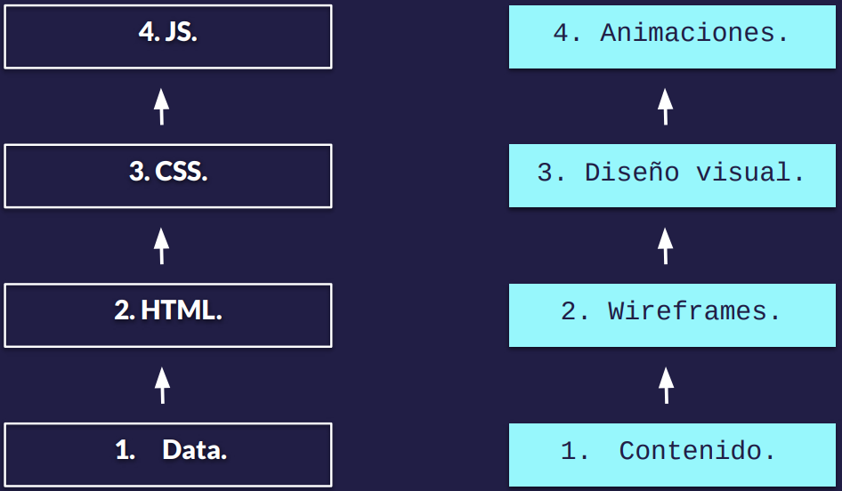

1. Primero partimos del dato
2. Después hacemos la maquetación con HTML
3. A continuación le añadimos estilo con CSS
4. Y por último el JS

***ERROR: si iniciamos una aplicación con JS, esta estará basada en script y no en web semántica la cual es el ideal.***

### Clase 6 *Accesibilidad y diseño*

Un componente importante que se debe añadir a una página web es la accesibilidad. Hoy en día es importante que nuestras aplicaciones y páginas sean accesibles, la web es un derecho para todas las personas incluidas las personas que tienen discapacidades físicas, motoras, visuales o auditivas.

Dicho por el director de la W3C, Tim Berners-Lee:

***El poder de la web está en su universalidad. El acceso de todas las personas independientemente de la discapacidad es un aspecto esencial.***

**¿Cómo podemos hacer que nuestras páginas sean más accesibles?**

Existen algunos tips básicos

- Utiliza los encabezados de manera ordenada para organizar la estructura del contenido.
- Utiliza tamaños de fuente accesibles.
- Utiliza colores que tengan un contraste adecuado.
- Garantiza que el código de color no sea la única forma de relacionar contenido
- Diseña teniendo en cuenta los estados 'focus' y 'active' de los componentes.
- Añade etiquetas y textos descriptivos a campos de formulario.
- Escribe contenido descriptivo que pueda reemplazar videos e imágenes.
- Garantiza que las animaciones no bloqueen el acceso del contenido

### Clase 7 *Brief y requerimientos técnicos*

Brief es un documento donde vamos a consignar todos los objetivos y datos relevantes para nuestra aplicación. Es la hoja de ruta para empezar a diseñar.

**Contenido del brief**

Algunos contenidos más comunes son:

- Objetivos
- Identidad de marca
- Público objetivo
- Audiencia al que va dirigido nuestro producto
- La competencia
- Referencias de paginas
- Canal de distribución
- Cronograma

El ejemplo de un brief para un restaurant de comida rapida es: [Steam Burger](http://https://github.com/mssroboto/diseno-para-programadores/blob/master/1-brief/Brief..pdf "steam burger")

## Modulo 3. Aprender sobre Diseño Experiencia de usuario
### Clase 8 *Definición de diseño UX*
El diseño UX o diseño de experiencia de usuario es un diseño que se centra en los usuarios y en la usabilidad como lo dice esta frase de Alan Cooper, diseñador de software y programador:

***Si queremos que a nuestros usuarios les guste nuestro software, deberíamos diseñarlo para que se comporte como una buena persona: respetuoso, generoso y colaborador.***

Muchas veces entramos a páginas en la que hacer una tarea es muy difícil, ya sea que vamos a subir un recibo o pagar un banco, errores que no son claros, se cierran las sesiones, todo esto problemas son porque no se hizo un buen diseño UX.

**Etapas del diseño UX**

- **Investigación**
En esta etapa se recopilan datos de cómo se comportan los usuarios y en cómo se manejan en otras aplicaciones ya existentes. Esto sirve para que podamos crear un producto que de verdad le vaya a funcionar a los usuarios finales.
- **Análisis**
Esta etapa consiste en clasificar y agrupar la información para definir unos objetivos a nivel de usuario.
- **Diseño**
En este curso nos enforcaremos en esta etapa. Aquí crearemos unos prototipos, unos flujos de usuarios y más que nos permitirá saber cuáles son las mejores prácticas para nuestros usuarios finales.
- **Pruebas de usuarios**
Finalmente se realizan diferentes pruebas, por lo general con prototipos en papel o con prototipos interactivos, pero no con el producto final. Esta etapa nos permitirá hacer ajustes de diseño antes de pasar por una etapa de desarrollo y otras cosas más complejas.

### Clase 9 *Diagramas de flujo*

El primer paso del diseño UX son diagramas de flujos.

**Requerimientos:**
- **Objetivos**
	- Dar a conocer sus productos.
	- Aumentar la presencia en línea.
	- Hacer pedidos online.
	- Dar a conocer su marca.
- **Requerimiento**
	- Menú y promociones.
	- Redes sociales.
	- Pedidos.
	- Contacto y sucursales.

Un diagrama de flujo básico, muy sencillo, es el **Site Map** que nos permite ver un mapa de todas las secciones del sitio que nombramos anteriormente:

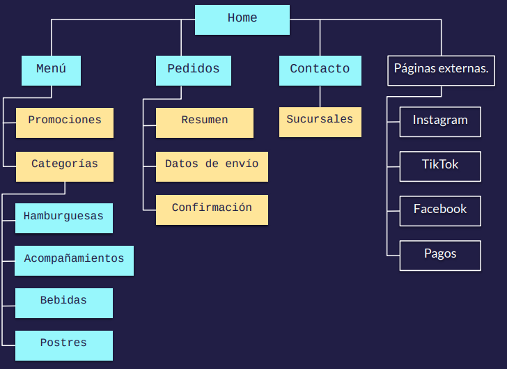

Este tipo de diagrama nos permite ver cuáles son las secciones principales, cuáles son las secundarias y cuáles son las externas, las que solamente serán un link desde nuestra página.

Otro tipo de diagrama, más complejo, son los **User Flow**:

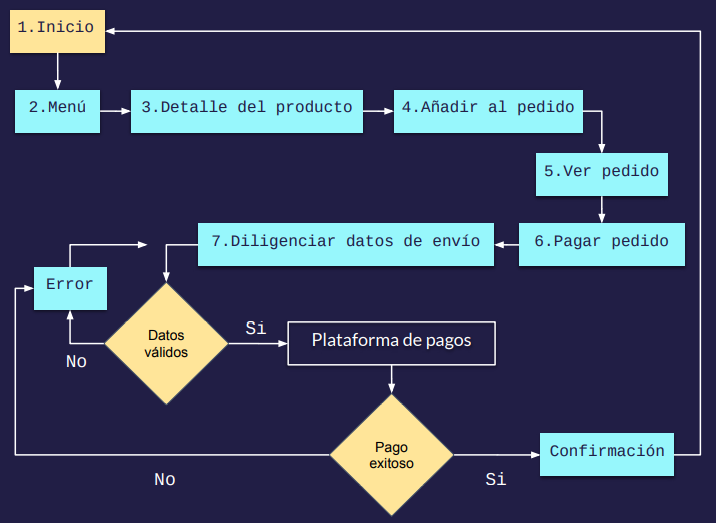

Este nos permite ver el flujo general que debe completar un usuario para hacer su pedido.

### Clase 10 *Wireframes y componentes*

Wireframes es como el plano de la aplicación. Aquí se hacen bocetos y bosquejos de todos los componentes que va a tener la aplicación y las pantallas que salieron anteriormente en los diagramas de flujos.

**RECOMENDAMIENTO:** hacer los dibujos a mano, no hay necesidad de complicarse con programas de diseño, lo importante es tener un inventario y volar la imaginación en cuanto a las soluciones que le vamos a dar a los distintos componentes.

Los wireframes hechos a mano y en papel se le conoce comowireframes de baja calidad o de baja fidelidad. Pueden servir para tener una idea general o incluso para hacer prueba de usuarios.

También hay wireframes hechos ya en cualquier programa de diseño, incluso en Google Docs, PowerPoint o Paint, estos son llamados wireframes de alta calidad.

Ejemplo de [wireframes](https://github.com/mssroboto/diseno-para-programadores/tree/master/3-wireframes..pdf "wireframes") para desktop y móvil.

**¿Cómo podemos hacer pruebas de usuarios con wireframes?**

Podemos hacerlo de mucha manera, como grabarle a una persona interactuando con los papeles.

**Importancia del wireframes**

Hacer wireframes no solo es muy importante para diseño, sino que también lo es para desarrollo, y es importante incluir al equipo de desarrollo en esta etapa porque comienzan a saber que tamaño tendrá la aplicación. También es importante negociar esta etapa con el cliente y así se va haciendo a la idea de que secciones tendrá su producto.

## Modulo 4. Aprender sobre Diseño de interfaz de usuario

### Clase 11 *Definición de diseño UI*

El Diseño UI o diseño de interfaz de usuario es el diseño que se enfoca en crear la capa de estilos visuales y los estilos que van por encima de la estructura de contenido.

**¿En qué se diferencia del diseño UX?**

El diseño UX se enfoca en la investigación, prototipado y en la arquitectura de información.

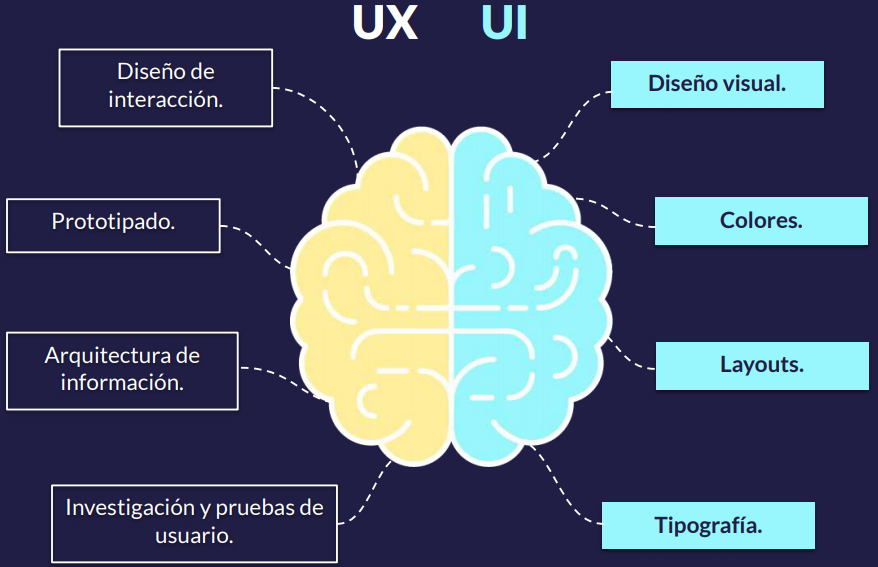

- **Diseño UX:** crea la base sobre la que vamos a trabajar.
- **Diseño UI:** crea el diseño visual.

Cuando trabajamos con el diseño UX y el diseño UI de la mano podemos garantizar que nuestro será bonito, estéticamente agradable y funcional para todos nuestros usuarios.

### Clase 12 *Moodboard y línea gráfica*

Moodboard es un documento o un tablero en el que empezamos a recopilar referencia visuales de estilos, colores y todo lo que nos parezca atractivo y llamativo que podamos añadirle a nuestra aplicación.

No hay reglas con el Moodboard, puedes usar recortes o aplicaciones como [Pinterest](https://www.pinterest.es/..pdf "Pinterest").

Si te gusta un color, una fuente, un estilo de fotografía o un estilo de ilustración, todo esto lo puedes guardar en tu Moodboard.

### Clase 13 *Teoría del color*

Ya seleccionaste en tu Moodboard los colores y los estilos gráficos que te llaman la atención, pero como sabemos que esos colores son funcionales y te ayudaran a transmitir el concepto que deseas, para eso es necesario aplicar la teoría del color y para esto necesitamos saber sobre la psicología del color.

**Psicología del color:** es un área de estudio que se dedica a investigar la forma en la que el cerebro percibe los colores y los asocia con diferentes colores.

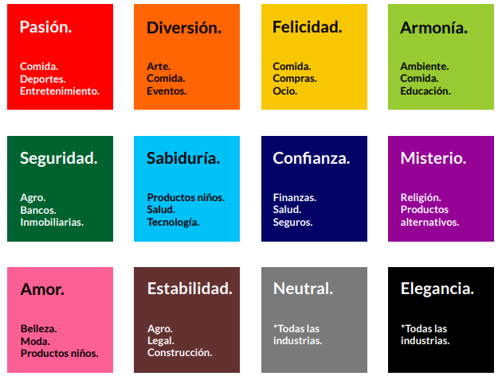

Muchas marcas utilizan la psicología de los colores para posicionarse en el mercado.

**Tips para seleccionar colores para web**

- Utiliza color RGB y hexadecimales.
- Crea un código de color consistente.
- Menos es más. El exceso de color hace que los usuarios no se puedan enfocar en una acción a la vez.
- Asegúrate de que tu elección de color sea accesible.
- Define una paleta de color.

### Clase 14 *Paletas de color*

Para construir una paleta de color hay que tener en claro los tipos de colores que existen.

- **Color primario:** son los colores amarillo, rojo y azul.
- **Color secundario:** son los colores resultantes de la mezcla de los colores primarios.
- **Color terciario:** son los colores que se encuentran entre un color primario y un color secundario. Ellos resultan de la combinación de un color primario y uno secundario.

Ya teniendo en claro estos conceptos podemos ver que tipos de paletas de colores queremos usar.

**Tipos de paletas**

- **Combinación monocromática:** consiste en tener un color y cambiarle los niveles de opacidad.

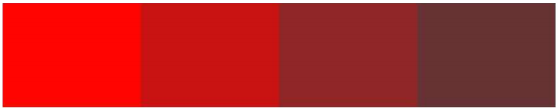

- **Combinación análoga:** consiste en combinar un color primario, uno terciario y uno secundario que estén seguidos en nuestro circulo cromático.

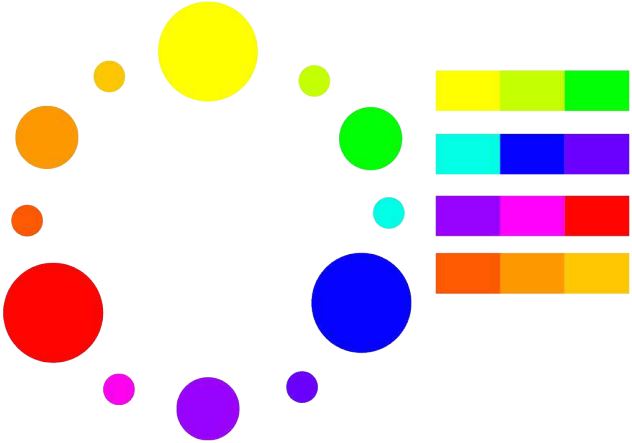

- **Combinación complementaria:** consiste en combinar un color primario y uno secundario, estos colores están opuestos en el circulo cromático y lo puedes encontrar en cualquier grafica de circulo cromático.

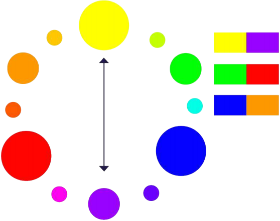

- **Combinación triádica:** consiste en crear un triángulo en la mitad del circulo cromático, a medida que lo vas girando notas que las puntas del triángulo apunta a un color.

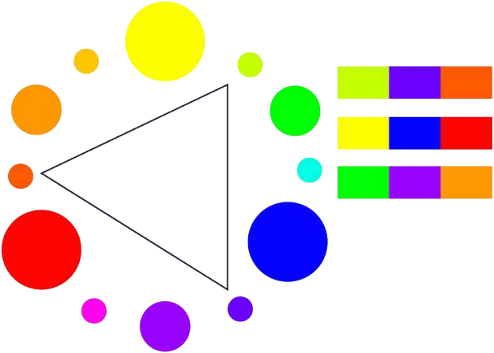

- **Combinación tétrada:** consiste en crear un rectángulo en medio del circulo cromático para combinar cuatro colores, dos primarios y dos secundarios.

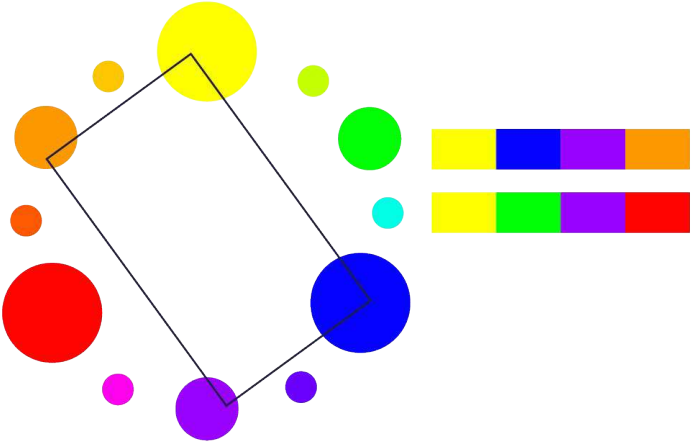

También existen páginas que te pueden ayudar a crear paletas de colores, como [Adobe Color](https://color.adobe.com/es/explore..pdf "Adobe Color").

### Clase 15 *Tipografía*

Otros de los elementos esenciales en una página web o aplicación es la tipografía.

**Tips para el uso eficiente de tipografías**

- Mantén el número de fuentes al mínimo.
- Trata de usar fuentes estándar.
- Limita la cantidad de texto.
- Elige tipografías que sean legibles en diferentes tamaños.
- Mantén altos de línea espaciados.
- Asegúrate de tener suficiente contraste.
- Evita usar animaciones intermitentes.

Algunos tipos de fuentes que podemos usar son:

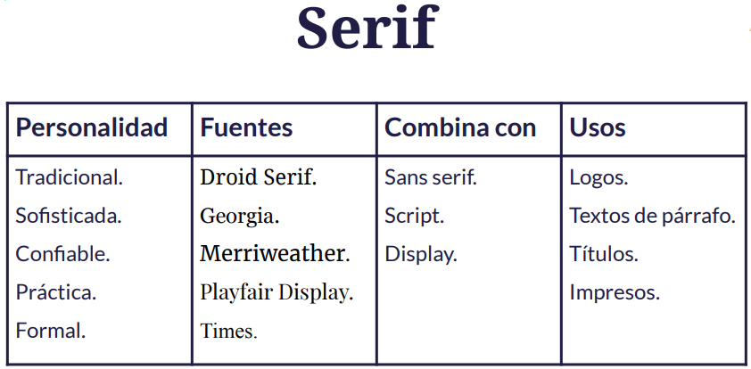

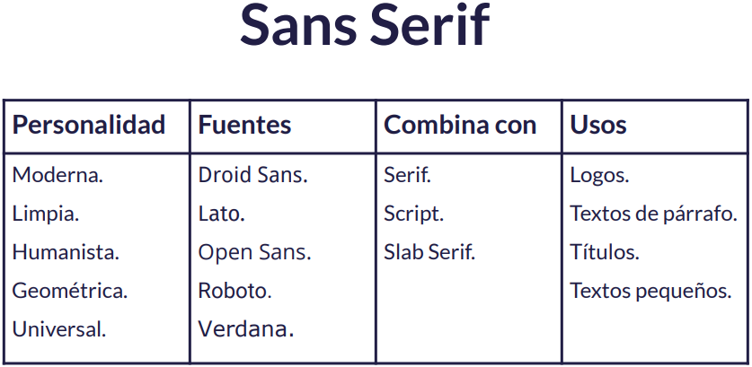

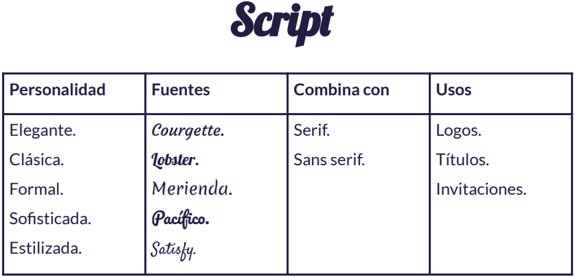

Existen páginas que te pueden ayudar a la hora de elegir una tipografía, como [Google Fonts](https://fonts.google.com/..pdf "Google Fonts").

### Clase 16 *Layout y sistemas de grillas*

Grilla es un sistema de columnas creado por nosotros de acuerdo a nuestras necesidades en donde se van ajustar nuestro elementos y componentes.

### Clase 17 *Sistemas de componentes UI*

Otra metodología importante a aplicar en la construcción de una aplicación o página web es el de separar nuestra funcionalidades por componentes.

Un sistema de componentes es un conjunto de componentes que vamos a utilizar para construir nuestra aplicación o nuestra página. Estos componentes funcionan como una librería.

### Clase 18 *Themes y customizaciones*

Themes es una capa de color y estilo que se añade por encima de nuestra aplicación y nos permite tener distintas variaciones sin hacer cambios drásticos en nuestro código.

Un ejemplo claro del Themes es el modo nocturno en las páginas o aplicaciones.

### Clase 19 *Imágenes para web*

Ya tienes los elementos esenciales para tu aplicación, pero ahora vamos añadir los elementos decorativos y que nos ayuden a reforzar el mensaje que queremos transmitir. Uno de estos elementos son las imágenes para web.

**¿Cómo podemos seleccionar imágenes adecuadas para la web?**

Lo primero que tenemos que tener en claro son los formatos que podemos usar.

**Formatos de imágenes para web**

- **JPG:** indicado para fotografías o imágenes con degradados.
- **PNG:** indicado para imágenes decorativas que requieran un fondo transparente.
- **SVG:** indicado para iconos y animaciones de baja complejidad. Es vectorial y permite editar sus propiedades con CSS.
- **GIF:** no recomendado para animaciones de larga duración debido a su peso.

**Elegir imágenes para mi diseño**

- Elige imágenes que aporten al contenido.
- Utiliza imágenes en las que tu público objetivo se vea reflejado.
- Elije imágenes consistentes con tu paleta de colores.
- Cuidado con las licencias.

**Rendimientos y accesibilidad**

- Evita exportar imágenes con teto incrustado.
- Exporta las imágenes al tamaño del contenedor final.
- Considera el uso de estrategias como 'lazy loading'.
- Asegúrate de añadir 'alt text' a las imágenes que tengan un fin comunicativo.

### Clase 20 *Gráficos en movimiento para web*

Al igual que las imágenes, existen diferentes formatos para seleccionar o animar contenido en nuestra página web.

**Formatos de gráficos en movimiento**

- **CSS animado:** indicado para animaciones sencillas y transiciones. No es un formato de video como tal, sino que es una animación que puedes crear utilizando propiedades de CSS. Útil para animaciones cortas, decorativas o para animar iconos.

- **SVG animado:** indicado para animaciones de elementos vectores. No es un formato de video, es un formato para hacer ilustraciones que es un formato para hacer ilustraciones que podemos animar con propiedades de CSS o de SVG. Lo interesante es que podamos añadirle etiquetas y opciones que podemos animarlos usando JS con Canvas.

- **JS (Canvas, WebGL):** indicado para animaciones complejas como animaciones de datos o 3D. Útil para animar estadísticas, mapas y datos dinámicos.

- **Videos:** indicados para filmaciones y animaciones de alta complejidad y corta duración. Usado en páginas dedicadas a subir videos, lo recomendado es mantenerlo cortos y concisos para que no aumente el peso de carga de la página.

**¿Cómo elegir gráficos en movimiento?**

Al igual que con las imágenes tenemos que tener en cuenta ciertos criterios para poder elegir videos que nos funcionen.

- Elige animaciones que aporten al contenido.
- Procura que no se reproduzca automáticamente y si lo hacen, que no tengan sonido.
- Evita que tus animaciones tengan flashes.
- Si tus animaciones aportan al contenido, añade subtítulos o transcripciones.
- Evita que las animaciones bloqueen la lectura básica del contenido.

Recuerda que las animaciones y video afectan al rendimiento de tu página.

### Clase 21 *Resultado final*

Fin del curso, [aquí](https://github.com/mssroboto/diseno-para-programadores/tree/master/4-app..pdf "aquí") podemos ver el resultado final del Steam Burger y su código.
