# Fundamentos de JavaScript
## Modulo 1. Introducción al curso
### Clase 1 *Bienvenidos al Curso de Fundamentos de JavaScript*

Nuestro profesor será Sacha Lifszyc y es desarrollador Full Stack desde hace varios años, hoy en día trabaja en Restorando un startup dedicado a hacer reservas para restaurantes.

A lo largo del curso aprenderemos las bases sólidas para dominar el lenguaje JavaScript. Veremos desde lo más básico como: variables, tipos de datos y operadores, e iremos avanzando con los condicionales y las estructuras de control. Luego veremos los conceptos relacionados con asincronismo, uno de los aspectos fundamentales de JavaScript, usando callbacks, promesas y async await. Y finalmente crearemos un juego de Simón dice en el que pondremos en práctica todo lo aprendido.

### Clase 2 *Repositorio del curso*

Bienvenidos de nuevo al curso.

En este material van a encontrar el enlace directo al repositorio que el profesor va a estar mencionando y utilizando a lo largo de todo el curso: https://github.com/platzi/FundamentosJSCurso

Están todos los archivos de los que se hará mención. En caso de que tengan alguna duda, usen el sistema de discusiones y estaremos respondiendo a la brevedad

Recuerden compartir sus proyectos con la comunidad.

¡Comencemos!

## Modulo 2. Primeros pasos en JavaScript
### Clase 3 *Variables*
A lo largo de todo el curso estaremos utilizando las siguientes herramientas:

- **Navegador:** Durante el curso se utiliza el navegador Chrome, aunque no hay preferencias y puede usar cualquiera. La razón por la se seleccionó Chrome se debe a que está disponible en todos los sistemas operativos y va a permitir que todos el mismo código, además ya incorporo mucho de las nuevas funcionales que trae el nuevo lenguaje de JavaScript.
- **Editor de texto:** Nuevamente no hay preferencias, pueden usar cualquier editor (Atom, Bloc de Nota, Sublime Text, Visual Studio Code).

**Primeros pasos**

Creamos un archivo de tipo html (que nos permitirá visualizar todo) y otro archivo de tipo javascript (que es donde trabajaremos).

Si abrimos el archivo Clase1.html en el navegador:

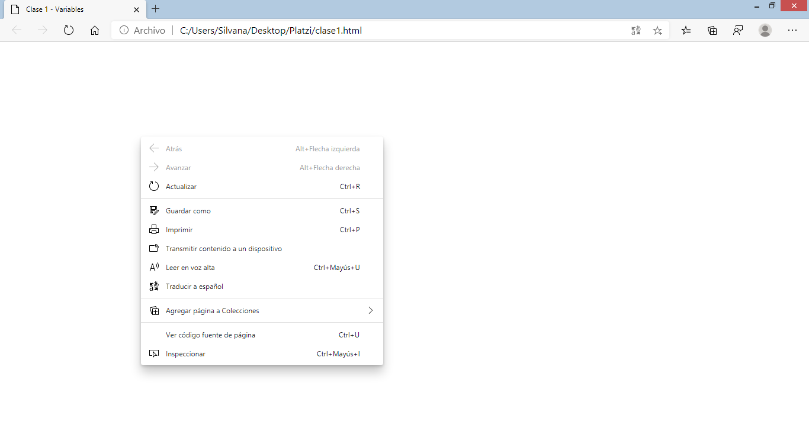

Y damos inspeccionar nos permitirá interactuar con el html:

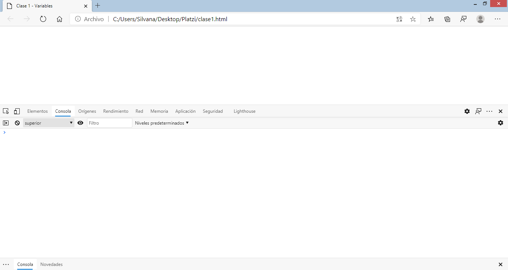

Vamos a nuestro editor de texto, el archivo html creamos un esqueleto básico:

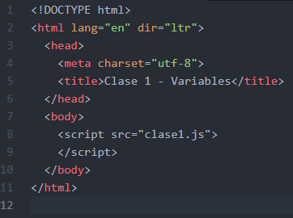

En el cuerpo (body) escribimos script que nos permitirá incluir o llamar nuestro código de tipo JavaScript.

**Hola mundo**

Para imprimir algo en la consola, es decir, darle un mensaje 'secreto' al usuario usamos el comando: ***console.log()***

Siempre que empezamos en un nuevo lenguaje o un framework nuevo es bueno hacer un 'hola mundo' como práctica, en JavaScript es de la siguiente manera:

***console.log('Hola mundo')***

Al guardar y cargar nuevamente la página html, podemos ver el resultado en la consola:

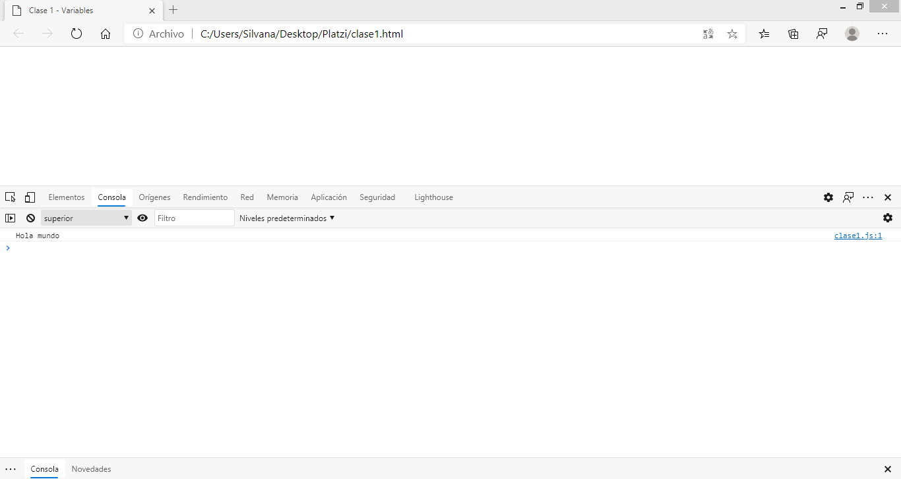

**Definir una variable**

Una de las manera de declarar y asignar una variable en JavaScript es la siguiente:

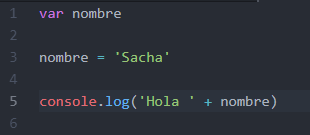

Esto nos imprimirá un 'Hola nombre'.

Otra manera también es:

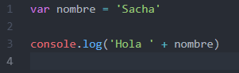

Concatenamos el texto con el signo + (más).

Si por ejemplo deseamos concatenar dos variables y decir 'Hola nombre apellido', es:

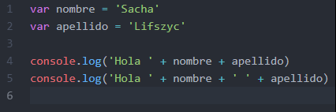

- De la primera forma nos queda pegado el nombre y el apellido.
- De la segunda forma ponemos un espacio en blanco entre el nombre y el apellido.

También podemos declarar y asignar todo en una misma línea:

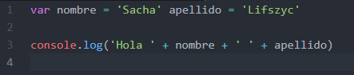

**Débilmente tipado**

JavaScript es un lenguaje débilmente tipado, es decir, no hay nada que me diga que la variable nombre tiene que ser texto y solo acepta valores de tipo string.

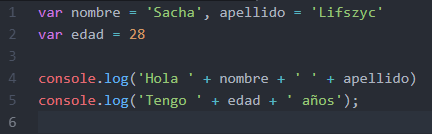

Esto nos imprimirá un 'Hola Sacha Lifszyc' y un 'Tengo 28 años'.

Pero si hacemos lo siguiente:

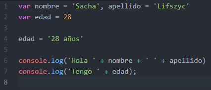

Aunque nos imprime lo mismo, podemos ver como nuestra edad empieza como un número y termina siendo un string. Esto es algo que no debemos perder de vista a la hora de desarrollar en JavaScript.

**NOTA**

- El string puede ser con comilla doble o simple, es totalmente indistinto pero por convicción el más usado es la comilla simple.
- Se puede ver que no se ha escrito el punto y coma al final de cada sentencia o línea del programa. Se podría incluir y el programa seguirá funcionando correctamente. En JavaScript el punto y coma es algo visual o una convección el si deseamos escribirlo o no, si bien hay algunos casos en donde no funciona pero son casos muy puntuales.

### Clase 4 *Variables: Strings*
Los strings son cadenas de texto. Para indicar que estamos usando una cadena de texto debemos de colocar las comillas simples o dobles.

**Convertir una cadena en mayúscula**

El método toUpperCase devuelve el valor de la cadena convertida a mayúsculas. No afecta al valor de la cadena en sí mismo.

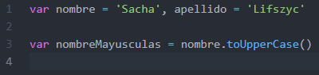

**Convertir una cadena en minúscula**

El método toLowerCase devuelve el valor de la cadena convertida a minúsculas. No afecta al valor de la cadena en sí misma.

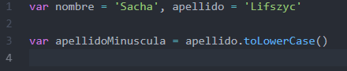

**Imprimir un único carácter de la cadena**

Los caracteres de una cadena se indexan de izquierda a derecha. El índice del primer carácter es 0, y el índice del último carácter en una cadena llamada nombreCadena es nombreCadena.length - 1. Si el índice que usted proporciona está fuera del rango, JavaScript devuelve una cadena vacía.

Un índice es un entero entre 0 y 1 menos que la longitud de la cadena. Si no se proporciona ningún índice charAt() utilizará 0.

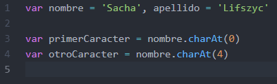

Sacha está compuesto de la siguiente forma:

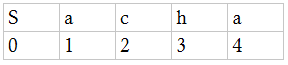

Por tanto:

- 0, imprime el primer carácter.
- 4, imprime el último carácter.

**Cantidad caracteres en una cadena**

Esta propiedad devuelve el número de caracteres de una cadena. UTF-16, el formato usado por JavaScript, usa 16 bits para representar los caracteres más comunes, pero necesita usar dos caracteres para otros menos usados, así que es posible que el valor devuelto por length no corresponda al número de caracteres de la cadena.

Para una cadena vacía, length es 0.

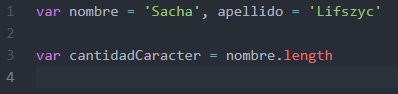

**Concatenar cadenas**

Ya sabemos que podemos concatenar dos cadenas de la siguiente forma:

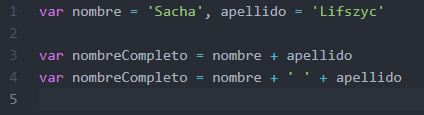

Hay otra forma de concatenar string que es un más nueva y mejor porque es un poco más clara:

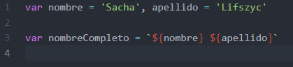

Se llama interpolación de cadenas y utilizan las comillas invertidas o backticks para delimitar sus contenidos, en vez de las tradicionales comillas simples o dobles de las cadenas de texto normales. La interpolación permite utilizar cualquier expresión válida de JavaScript (como por ejemplo la suma de dos variables) dentro de una cadena y obtener como resultado la cadena completa con la expresión evaluada.

Las partes variables se denominan placeholders y utilizan la sintaxis ${ } para diferenciarse del resto de la cadena. Como dentro de las partes variables de la cadena se puede incluir cualquier expresión válida de JavaScript, en la práctica sirven para mucho más que mostrar el contenido de una variable.

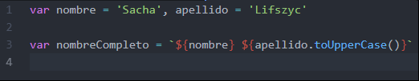

**Substring**

Para conseguir los caracteres de una cadena que comienzan en una localización especificada y de acuerdo al número de caracteres que se especifiquen, podemos hacerlo de dos maneras.

Por ejemplo, si queremos conseguir la segunda y la tercera letra del nombre podemos hacerlo de la siguiente manera:

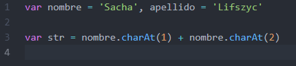

Pero tenemos el método ***substr()***:

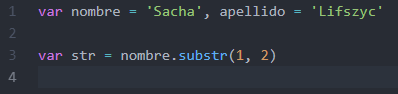

***substr()*** tiene dos parámetros, uno para el carácter de inicio y otro para el último carácter de la longitud deseada.

**RETO: Encuentra la última letra del nombre.**

### Clase 5 *Variables: Números*
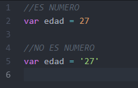

Los tipos de número pueden ser enteros, decimales o dobles

**Adición**

La operación adición se produce mediante la suma de número:

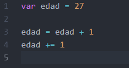

**Resta**

La operación de resta se produce cuando se sustraen el resultado de los operadores, produciendo su diferencia:

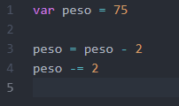

**Ejemplo 1**

Tenemos una variable peso con un valor de 75, a peso le restamos 2, por otra parte tenemos una variable sandwich con el valor 1. Ahora a la variable peso sumamos el peso actual más el valor del sandwich para obtener el resultado:

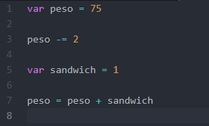

**Ejemplo 2**

Al ejemplo anterior le agregamos una nueva variable llamada jugarFutbol con un valor de 3 y a nuestra variable peso le restamos el valor de jugarFutbol:

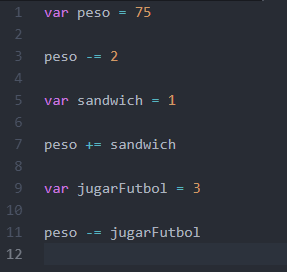

**Producto**

El operador multiplicación produce el producto de la multiplicación de los operandos:

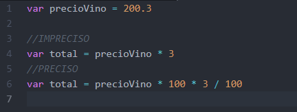

***RECUERDA: Al hacer una operación con decimales debemos realizar operaciones adicionales para conseguir un resultado preciso:***

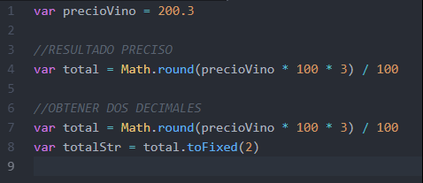

- **Math.roud:** Devuelve el valor del número dado redondeado al entero más cercano.
  - Si la porción fraccionaría del número es 0.5 o mayor, el argumento es redondeado al siguiente número entero superior.
  - Si la porción de la fracción del número es menor a 0.5, el argumento es redondeado al siguiente número entero inferior.

- **toFixed():** Es un método que formatea un número usando notación de punto fijo.
  - toFixed() devuelve una representación de cadena que no usa notación exponencial y tiene exactamente X dígitos después del decimal. El número se redondea si es necesario, y la parte fraccional se rellena con ceros si es necesario para que tenga la longitud especificada.

Para regresar la cadena nuevamente a un número:

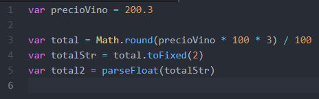

- **parseFloat():** Toma una cadena y la convierte en número de punto flotante.
  - Si encuentra un carácter diferente al signo (+ o -), numerales (0-9), un punto decimal o un exponente, devuelve el valor hasta ese punto e ignora ese carácter y todos los correctos siguientes. Se permiten espacios anteriores y posteriores.
  - Si el primer carácter no se puede convertir a número, parseFloat devuelve NaN.

**División**

El operador división se produce el cociente de la operación donde el operando izquierdo es el dividendo y el operando derecho es el divisor:

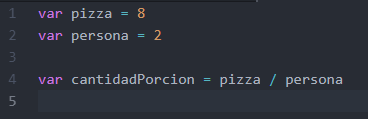

### Clase 6 *Funciones*
### Clase 7 *El alcance de las funciones*
### Clase 8 *Objetos*
### Clase 9 *Desestructurar objetos*
### Clase 10 *Parámetros como referencia o como valor*
### Clase 11 *Comparaciones en JavaScript*

## Modulo 3. Estructuras de Control y Funciones
### Clase 12 **
