# Fundamentos de JavaScript
## Modulo 1. Introducción al curso
### Clase 1 *Bienvenidos al Curso de Fundamentos de JavaScript*

Nuestro profesor será Sacha Lifszyc y es desarrollador Full Stack desde hace varios años, hoy en día trabaja en Restorando un startup dedicado a hacer reservas para restaurantes.

A lo largo del curso aprenderemos las bases sólidas para dominar el lenguaje JavaScript. Veremos desde lo más básico como: variables, tipos de datos y operadores, e iremos avanzando con los condicionales y las estructuras de control. Luego veremos los conceptos relacionados con asincronismo, uno de los aspectos fundamentales de JavaScript, usando callbacks, promesas y async await. Y finalmente crearemos un juego de Simón dice en el que pondremos en práctica todo lo aprendido.

### Clase 2 *Repositorio del curso*

Bienvenidos de nuevo al curso.

En este material van a encontrar el enlace directo al repositorio que el profesor va a estar mencionando y utilizando a lo largo de todo el curso: https://github.com/platzi/FundamentosJSCurso

Están todos los archivos de los que se hará mención. En caso de que tengan alguna duda, usen el sistema de discusiones y estaremos respondiendo a la brevedad

Recuerden compartir sus proyectos con la comunidad.

¡Comencemos!

## Modulo 2. Primeros pasos en JavaScript
### Clase 3 *Variables*
A lo largo de todo el curso estaremos utilizando las siguientes herramientas:

- **Navegador:** Durante el curso se utiliza el navegador Chrome, aunque no hay preferencias y puede usar cualquiera. La razón por la se seleccionó Chrome se debe a que está disponible en todos los sistemas operativos y va a permitir que todos el mismo código, además ya incorporo mucho de las nuevas funcionales que trae el nuevo lenguaje de JavaScript.
- **Editor de texto:** Nuevamente no hay preferencias, pueden usar cualquier editor (Atom, Bloc de Nota, Sublime Text, Visual Studio Code).

**Primeros pasos**

Creamos un archivo de tipo html (que nos permitirá visualizar todo) y otro archivo de tipo javascript (que es donde trabajaremos).

Si abrimos el archivo Clase1.html en el navegador:

Y damos inspeccionar nos permitirá interactuar con el html:

Vamos a nuestro editor de texto, el archivo html creamos un esqueleto básico:

En el cuerpo (body) escribimos script que nos permitirá incluir o llamar nuestro código de tipo JavaScript.

**Hola mundo**

Para imprimir algo en la consola, es decir, darle un mensaje 'secreto' al usuario usamos el comando: ***console.log()***

Siempre que empezamos en un nuevo lenguaje o un framework nuevo es bueno hacer un 'hola mundo' como práctica, en JavaScript es de la siguiente manera:

***console.log('Hola mundo')***

Al guardar y cargar nuevamente la página html, podemos ver el resultado en la consola:

**Definir una variable**

Una de las manera de declarar y asignar una variable en JavaScript es la siguiente:

Esto nos imprimirá un 'Hola nombre'.

Otra manera también es:

Concatenamos el texto con el signo + (más).

Si por ejemplo deseamos concatenar dos variables y decir 'Hola nombre apellido', es:

- De la primera forma nos queda pegado el nombre y el apellido.
- De la segunda forma ponemos un espacio en blanco entre el nombre y el apellido.

También podemos declarar y asignar todo en una misma línea:

**Débilmente tipado**

JavaScript es un lenguaje débilmente tipado, es decir, no hay nada que me diga que la variable nombre tiene que ser texto y solo acepta valores de tipo string.

Esto nos imprimirá un 'Hola Sacha Lifszyc' y un 'Tengo 28 años'.

Pero si hacemos lo siguiente:

Aunque nos imprime lo mismo, podemos ver como nuestra edad empieza como un número y termina siendo un string. Esto es algo que no debemos perder de vista a la hora de desarrollar en JavaScript.

**NOTA**

- El string puede ser con comilla doble o simple, es totalmente indistinto pero por convicción el más usado es la comilla simple.
- Se puede ver que no se ha escrito el punto y coma al final de cada sentencia o línea del programa. Se podría incluir y el programa seguirá funcionando correctamente. En JavaScript el punto y coma es algo visual o una convección el si deseamos escribirlo o no, si bien hay algunos casos en donde no funciona pero son casos muy puntuales.

### Clase 4 *Variables: Strings*
Los strings son cadenas de texto. Para indicar que estamos usando una cadena de texto debemos de colocar las comillas simples o dobles.

**Convertir una cadena en mayúscula**

El método toUpperCase devuelve el valor de la cadena convertida a mayúsculas. No afecta al valor de la cadena en sí mismo.

**Convertir una cadena en minúscula**

El método toLowerCase devuelve el valor de la cadena convertida a minúsculas. No afecta al valor de la cadena en sí misma.

**Imprimir un único carácter de la cadena**

Los caracteres de una cadena se indexan de izquierda a derecha. El índice del primer carácter es 0, y el índice del último carácter en una cadena llamada nombreCadena es nombreCadena.length - 1. Si el índice que usted proporciona está fuera del rango, JavaScript devuelve una cadena vacía.

Un índice es un entero entre 0 y 1 menos que la longitud de la cadena. Si no se proporciona ningún índice charAt() utilizará 0.

Sacha está compuesto de la siguiente forma:

Por tanto:

- 0, imprime el primer carácter.
- 4, imprime el último carácter.

**Cantidad caracteres en una cadena**

Esta propiedad devuelve el número de caracteres de una cadena. UTF-16, el formato usado por JavaScript, usa 16 bits para representar los caracteres más comunes, pero necesita usar dos caracteres para otros menos usados, así que es posible que el valor devuelto por length no corresponda al número de caracteres de la cadena.

Para una cadena vacía, length es 0.

**Concatenar cadenas**

Ya sabemos que podemos concatenar dos cadenas de la siguiente forma:

Hay otra forma de concatenar string que es un más nueva y mejor porque es un poco más clara:

Se llama interpolación de cadenas y utilizan las comillas invertidas o backticks para delimitar sus contenidos, en vez de las tradicionales comillas simples o dobles de las cadenas de texto normales. La interpolación permite utilizar cualquier expresión válida de JavaScript (como por ejemplo la suma de dos variables) dentro de una cadena y obtener como resultado la cadena completa con la expresión evaluada.

Las partes variables se denominan placeholders y utilizan la sintaxis ${ } para diferenciarse del resto de la cadena. Como dentro de las partes variables de la cadena se puede incluir cualquier expresión válida de JavaScript, en la práctica sirven para mucho más que mostrar el contenido de una variable.

**Substring**

Para conseguir los caracteres de una cadena que comienzan en una localización especificada y de acuerdo al número de caracteres que se especifiquen, podemos hacerlo de dos maneras.

Por ejemplo, si queremos conseguir la segunda y la tercera letra del nombre podemos hacerlo de la siguiente manera:

Pero tenemos el método ***substr()***:

***substr()*** tiene dos parámetros, uno para el carácter de inicio y otro para el último carácter de la longitud deseada.

**RETO: Encuentra la última letra del nombre.**

### Clase 5 *Variables: Números*

Los tipos de número pueden ser enteros, decimales o dobles

**Adición**

La operación adición se produce mediante la suma de número:

**Resta**

La operación de resta se produce cuando se sustraen el resultado de los operadores, produciendo su diferencia:

**Ejemplo 1**

Tenemos una variable peso con un valor de 75, a peso le restamos 2, por otra parte tenemos una variable sandwich con el valor 1. Ahora a la variable peso sumamos el peso actual más el valor del sandwich para obtener el resultado:

**Ejemplo 2**

Al ejemplo anterior le agregamos una nueva variable llamada jugarFutbol con un valor de 3 y a nuestra variable peso le restamos el valor de jugarFutbol:

**Producto**

El operador multiplicación produce el producto de la multiplicación de los operandos:

***RECUERDA: Al hacer una operación con decimales debemos realizar operaciones adicionales para conseguir un resultado preciso:***

- **Math.roud:** Devuelve el valor del número dado redondeado al entero más cercano.
  - Si la porción fraccionaría del número es 0.5 o mayor, el argumento es redondeado al siguiente número entero superior.
  - Si la porción de la fracción del número es menor a 0.5, el argumento es redondeado al siguiente número entero inferior.

- **toFixed():** Es un método que formatea un número usando notación de punto fijo.
  - toFixed() devuelve una representación de cadena que no usa notación exponencial y tiene exactamente X dígitos después del decimal. El número se redondea si es necesario, y la parte fraccional se rellena con ceros si es necesario para que tenga la longitud especificada.

Para regresar la cadena nuevamente a un número:

- **parseFloat():** Toma una cadena y la convierte en número de punto flotante.
  - Si encuentra un carácter diferente al signo (+ o -), numerales (0-9), un punto decimal o un exponente, devuelve el valor hasta ese punto e ignora ese carácter y todos los correctos siguientes. Se permiten espacios anteriores y posteriores.
  - Si el primer carácter no se puede convertir a número, parseFloat devuelve NaN.

**División**

El operador división se produce el cociente de la operación donde el operando izquierdo es el dividendo y el operando derecho es el divisor:

### Clase 6 *Funciones*

Las funciones son fracciones de código reutilizable. En términos generales, una función es un "subprograma" que puede ser llamado por código externo (o interno en caso de recursión) a la función. Al igual que el programa en sí mismo, una función se compone de una secuencia de declaraciones, que conforman el llamado cuerpo de la función. Se pueden pasar valores a una función, y la función puede devolver un valor.

**FUNCTION**

La función está compuesta por:

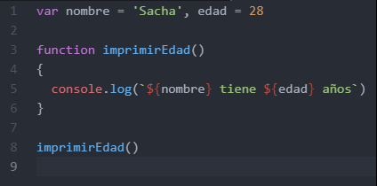

- **function:** Palabra reservada que crea un nuevo objeto function.
- **imprimirEdad:** Es el nombre la función.
- **():** El nombre de un argumento que se pasará a la función. Una función puede tener hasta 255 argumentos.
- **{ instrucciones }:** Las instrucciones que forman el cuerpo de la función.

**Sin parámetro vs Con parámetro**

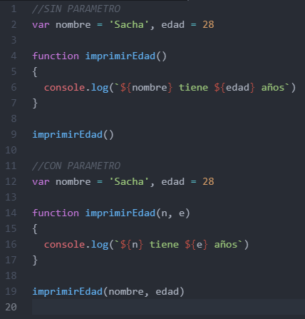

Si bien ambos códigos son aceptados y pueden ser ejecutados, es a la hora de reutilizar el código cuando se puede notar la diferencia entre ambos. Por ejemplo, deseamos que el nombre ahora sea 'Vicky' y la edad 24, si ponemos otro imprimirEdad('Vicky', 24) debajo de cada uno veremos que el primer código nos seguirá imprimiendo con el nombre Sacha y la edad 28, pero el segundo SI cambiara tanto el nombre como la edad.

**Reutilizar código**

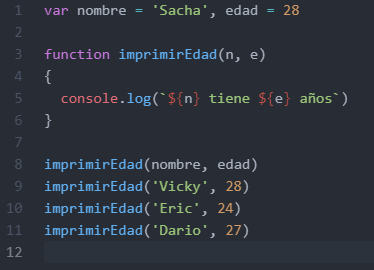

Como se ha dicho, Function nos permite reutilizar el código enviado diferentes valores mediante los parámetros.

**Débilmente tipado**

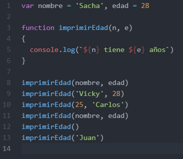

Recordemos que JavaScript es un lenguaje débilmente tipado, es decir, que sin importar si los parámetros que le pasemos a la función estén invertidos o incluso incompletos él intentara ejecutar el código.

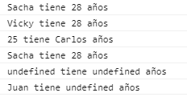

**¿Qué son las palabras reservadas?**

Son palabras que no pueden ser utilizadas como variables, funciones, métodos o identificadores de objetos. Nosotros NO podemos escribir algo como ***var var = 15*** o ***var function = 'Sacha'***.

### Clase 7 *El alcance de las funciones*
Una variable que no está definida dentro del cuerpo de una función es una variable global:

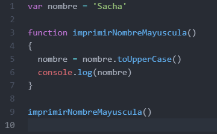

Por el contrario, una variable definida dentro de una función es una variable local:

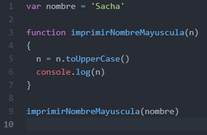

Para que la ejecución de una función no modifique una variable global usamos parámetros en lugar de pasar directamente la variable.

También es posible utilizar el mismo nombre para una variable global y para el parámetro de una función con un alcance local:

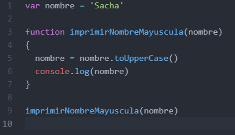

**window**

El objeto window representa la ventana que contiene un documento DOM.

Tomemos en cuenta el primer ejemplo:

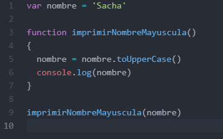

Si escribimos nombre en la consola nos aparece 'Sacha' sin mayúscula, pero al escribir window.nombre nos imprime 'SACHA':

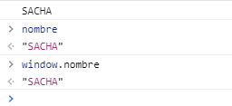

### Clase 8 *Objetos*
Un objeto es una colección de propiedades, y una propiedad es una asociación entre un nombre (o clave) y un valor. El valor de una propiedad puede ser una función, en cuyo caso la propiedad es conocida como un método. Además de los objetos que están predefinidos en el navegador, puedes definir tus propios objetos.

Por ejemplo, si deseamos tener un nombre con el valor 'Sacha' y otro con el valor 'Dario', esto:

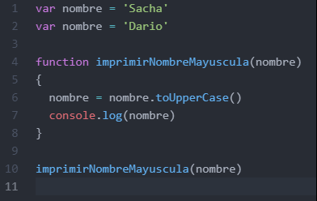

No podemos ponerlo de esta forma, porque estaríamos pisando la variable.

Una opción sería:

Pero si deseáramos más nombre entonces estaríamos creando nuevas variables como ***nombrePepito***, ***nombreVicky*** y llamando nuevamente a la función.

Un objeto siendo un entidad independiente con propiedades y tipos, está construida de esta forma:

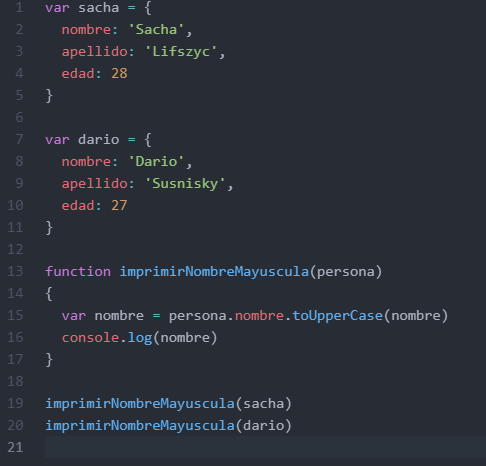

- **var:** Declara la variable.
- **sacha, dario:** Los nombres del objeto.
- **{ clave: valor }:** Los objetos son delimitados por llaves, compuesto por una clave y un valor que se separan entre sí por dos puntos.

Un objeto puede tener todos los atributos que sean necesarios. En el ejemplo creamos un objeto 'sacha' y otro objeto 'dario', ambos con nombres, apellidos y edad. También, escribir el nombre de un objeto separado por un punto del nombre de un atributo, nos permite acceder al valor de dicho atributo para ese objeto.

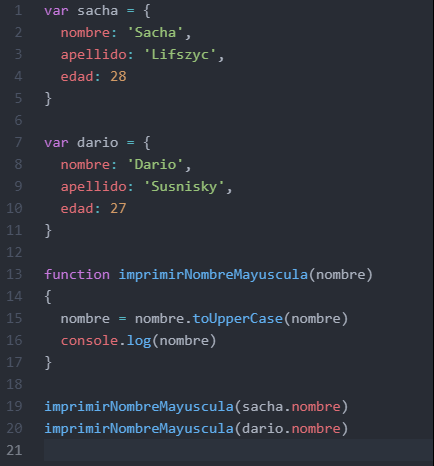

También podemos ingresar directamente dentro del console.log sin la necesidad de la variable nombre:

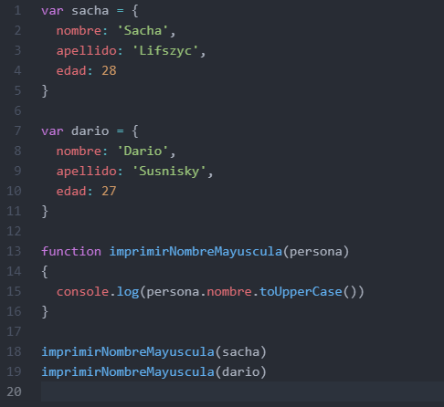

Las últimas versiones de JavaScript nos permiten desglosar el objeto para acceder únicamente al atributo que nos interesa. Esto se consigue encerrando el nombre del atributo entre llaves { }:

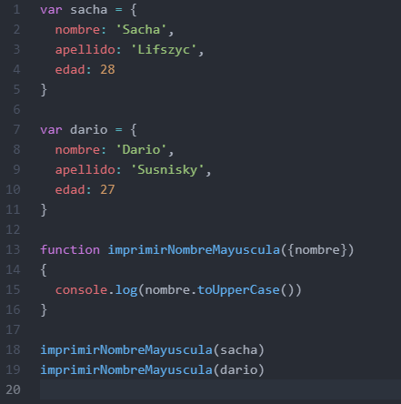

Podemos llamar a la función sin hacer referencia a una variable, creando un nuevo objeto dentro:

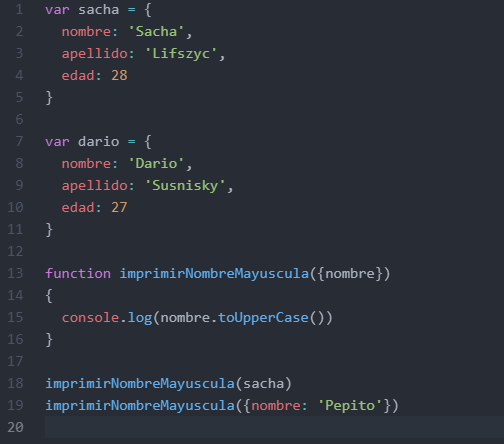

Debemos tener cuidado cuando hacemos esto porque si enviamos una función sin enviar nada o creamos un nuevo objeto sin nombre nos puede salir error, porque JavaScript intentara acceder al atributo nombre de algo que no se lo estamos pasando:

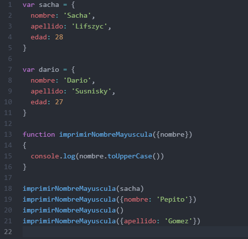

### Clase 9 *Desestructurar objetos*
La desestructuración de objetos es una expresión de JavaScript que permite desempacar valores de arreglos o propiedades de objetos en distintas variables, es decir, para no duplicar las variables introducir el nombre de la variable como parámetro de la segunda variable.

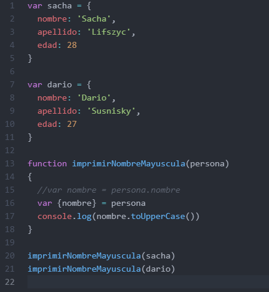

**RETO: Crear una función que imprima el nombre y la edad de la siguiente forma; Hola, me llamo nombre y tengo edad años**

### Clase 10 *Parámetros como referencia o como valor*
JavaScript se comporta de manera distinta cuando le pasamos un objeto como parámetro. Cuando los objetos se pasan como una referencia:

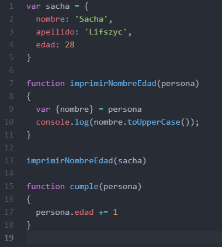

Estos se modifican fuera de la función:

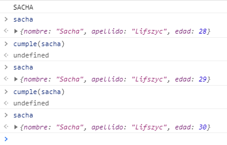

Si por ejemplo hacemos esto:

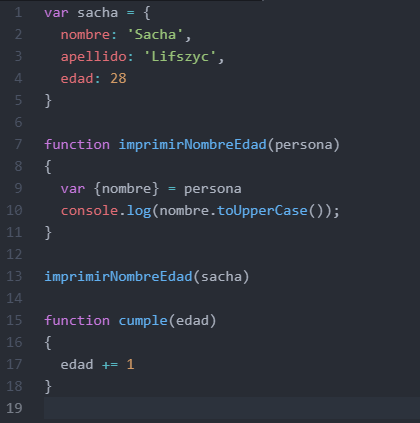

El valor no cambia:

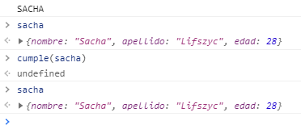

Para solucionar esto se puede crear un objeto diferente. Esto lo podemos hacer colocando tres puntos antes del nombre:

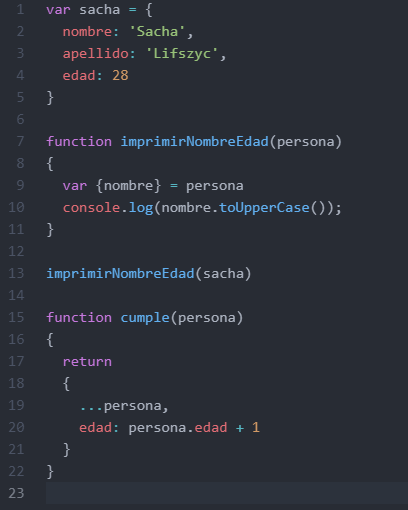

Creamos otra variable, sachaMasViejo, y ahora tenemos tanto la edad original (28) como la nueva edad (29):

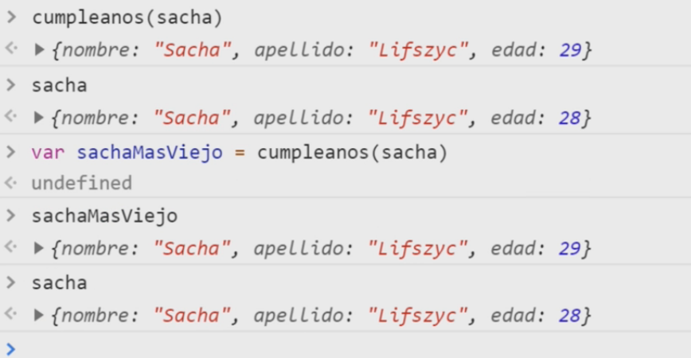

### Clase 11 *Comparaciones en JavaScript*
Existen varias maneras de comparar variables u objetos dentro de JavaScript. En el primer ejemplo le asignamos a 'x' un valor numérico y a 'y' un string:

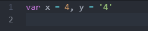

JavaScript tiene comparaciones estrictas y abstractas.

Una comparación estricta (por ejemplo, ===) solo es verdadera si los operandos son del mismo tipo y los contenidos coinciden. La comparación abstracta más comúnmente utilizada (por ejemplo, ==) convierte los operandos al mismo tipo antes de hacer la comparación.

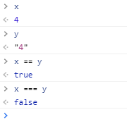

En el ejemplo podemos ver como '==' nos da true o verdadero pues ambos son cuatro, mientras que '===' nos imprime false o falso debido a que los dos son de distintos tipos.

***RECUERDA: Se recomienda que cada vez que deseamos hacer una comparación hacer uso de '===', esto para evitar que JavaScript compare dos variables que son distintos tipos.***

**Comparando objetos**

Tenemos dos objetos, ambos tienen un atributo nombre con el mismo valor:

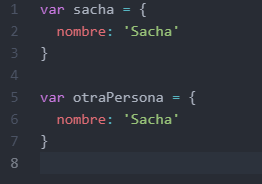

Pero al realizar la comparación:

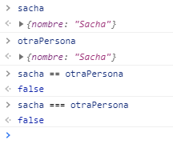

Nos resulta falso en ambos casos, esto se debe a que, a pesar de que tanto 'sacha' como 'otraPersona' son del tipo Objeto, ambos referencian a diferentes objetos.

**¿Cómo hacer que dos objetos sean iguales?**

Tenga en cuenta que un objeto se convierte en una primitiva si, y solo si, su comparando es una primitiva. Si ambos operandos son objetos, se comparan como objetos, y la prueba de igualdad es verdadera solo si ambos refieren el mismo objeto.

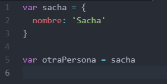

Si realizamos la comparación:

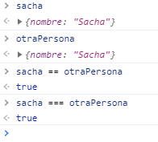

Si desglosamos el objeto en otro:

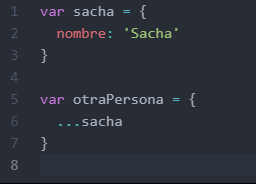

Nos dará falso, porque al desestructurar el objeto estamos creando un nuevo objeto.

Si regresamos al ejemplo de objetos iguales, le cambiamos el nombre al objeto otraPersona y realizamos la comparación:

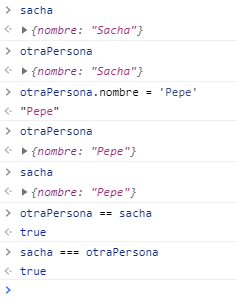

Nos dará true (verdadero) porque ambos referencia al mismo objeto sin importar que el valor del atributo nombre sea diferentes.

Lo mismo sucede con el objeto 'sacha' y el objeto 'otraPersona' cuyo atributo nombre contenga el mismo valor, al realizar la comparación:

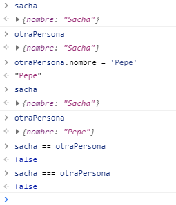

Seguirá imprimiendo false (falso) porque ambos referencian a objetos distintos.

**Datos primitivos**

En JavaScript, un primitive (valor primitivo, tipo de dato primitivo) son datos que no son un objeto y no tienen métodos. Hay 6 tipos de datos primitivos: string, number, bigint, boolean, undefined y symbol. También hay null, que aparentemente es primitivo, pero de hecho es un caso especial para cada Object.

La mayoría de las veces, un valor primitivo se representa directamente en el nivel más bajo de la implementación del lenguaje. Todos los primitivos son inmutables, es decir, no se pueden modificar. Es importante no confundir un primitivo en sí mismo con un valor primitivo asignado a una variable. Se puede reasignar un nuevo valor a la variable, pero el valor existente no se puede cambiar de la misma forma en que se pueden modificar los objetos, los arreglos y las funciones.

- **String:** Se utiliza para representar datos textuales. Es un conjunto de "elementos" de valores enteros sin signo de 16 bits. Cada elemento ocupa una posición en la cadena. El primer elemento está en el índice 0, el siguiente en el índice 1, y así sucesivamente. La longitud de una cadena es el número de elementos que contiene.
- **Number:** Es un primitivo de tipo numérico que no tiene específico para los números enteros y de coma flotante.
- **Bigint:** Es un primitivo numérico en JavaScript que puede representar números enteros con precisión arbitraria. Puede almacenar y operar de forma segura en números enteros grandes incluso más allá del límite seguro de enteros para Number.
- **Boolean:** Representa una entidad lógica y puede tener dos valores: true y false. 
- **Undefined:** Es una variable a la que no se le ha asignado valor, o no se ha declarado en absoluto (no se declara, no existe).
- **Symbol:** Es un valor primitivo único e inmutable y se puede utilizar como clave de una propiedad de objeto (ve más abajo). En algunos lenguajes de programación, los símbolos se denominan "átomos".
- **Null:** Es un literal de Javascript que representa intencionalmente un valor nulo o "vacío".

## Modulo 3. Estructuras de Control y Funciones
### Clase 12 *Condicionales*
Los condicionales nos permiten decidir el flujo de nuestro código. Mediante un condicional decidiremos si se ejecuta una parte de nuestro código cuando se cumpla o no cierta condición.

En el ejemplo tenemos a Sacha con una serie de profesiones con valor de verdadero o falso:

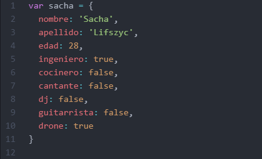

Con las condicionales podemos hacer que nos imprima 'Sacha es: ' y el nombre de la profesión si es verdadera (true):

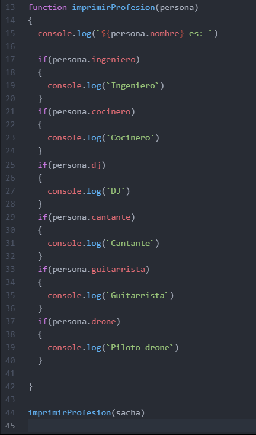

La condicional if también tiene otra parte que suele acompañarlo, else:

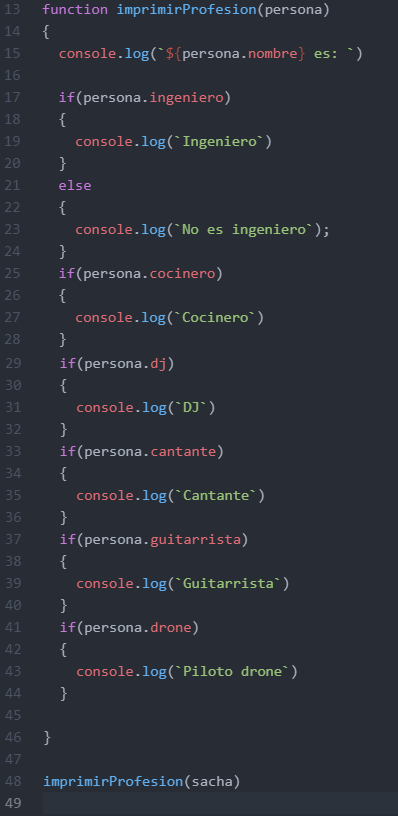

**Condicional if… else**

Ejecuta una sentencia si una condición especificada es evaluada como verdadera (en el ejemplo evalúa si la profesión es verdadera). Si la condición es evaluada como falsa, otra sentencia puede ser ejecutada.

***RETO: Crea una función que contenga una condicional e imprima 'Sacha es mayor de edad' o 'Sacha es menor de edad' teniendo en cuenta su edad.***

### Clase 13 *Funciones que retornan valores*
Tomemos como ejemplo nuestro reto anterior de mayor o menor de edad y agreguemos otra persona:

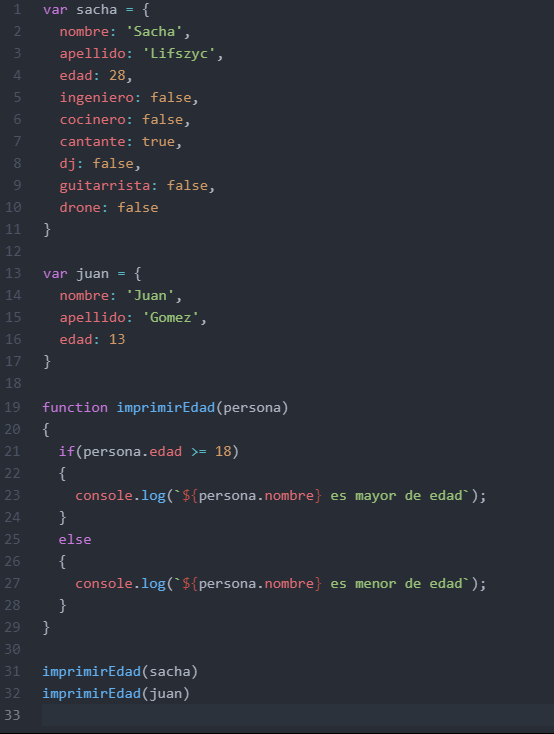

Para hacer más legible este programa podemos desglosar las funciones en funciones más pequeñas que retornen un valor:

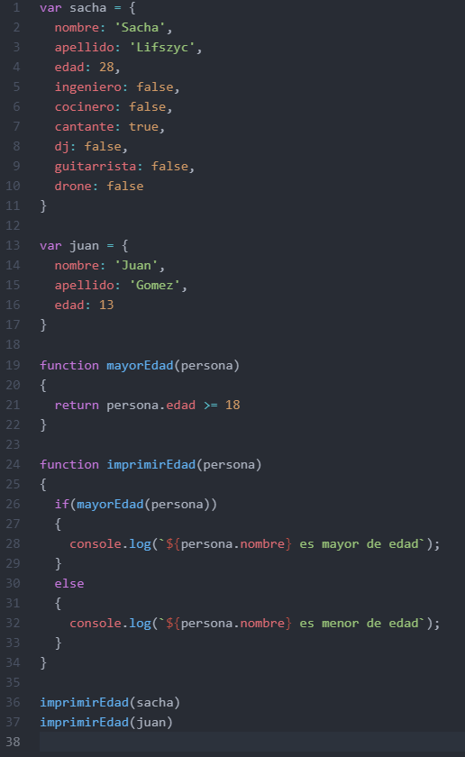

Debemos tener en cuenta que, para incluir el 18 en el rango de edad, se utiliza el símbolo >= (mayor o igual que) y no el símbolo > (mayor que).

**Magic Number:** Son números dispersos en los bloques de código que crean dos grandes problemas, la poca semántica (información sobre su uso) y la posibilidad de que ese número se propague N filas, lo que significa N cambios en diferentes lugares.

Para evitar estos problemas convertirnos nuestro 18 en una variable:

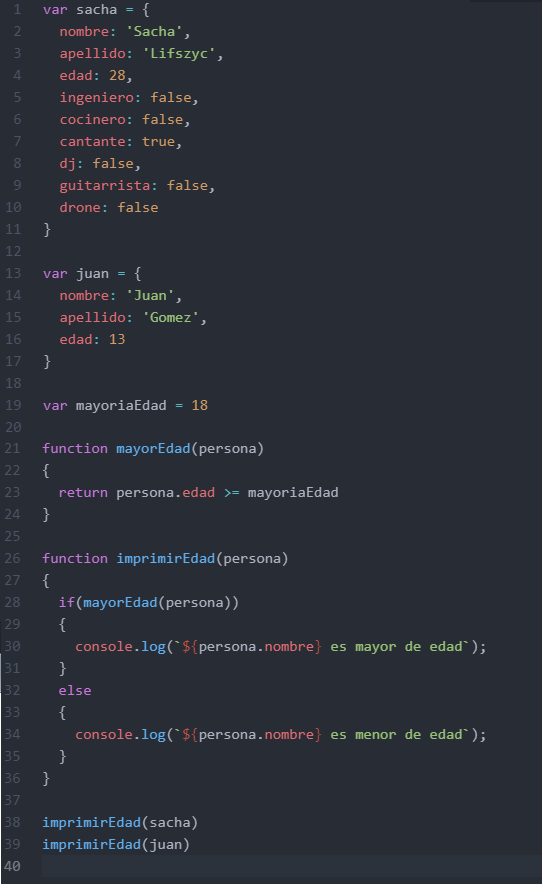

Pero nosotros deseamos que no se cambie, que no deseamos que su valor cambie a través de la reasignación así que lo convertirnos en una constante (const), por buena práctica se utiliza mayúscula para escribir el nombre separado por guiones bajos (_):

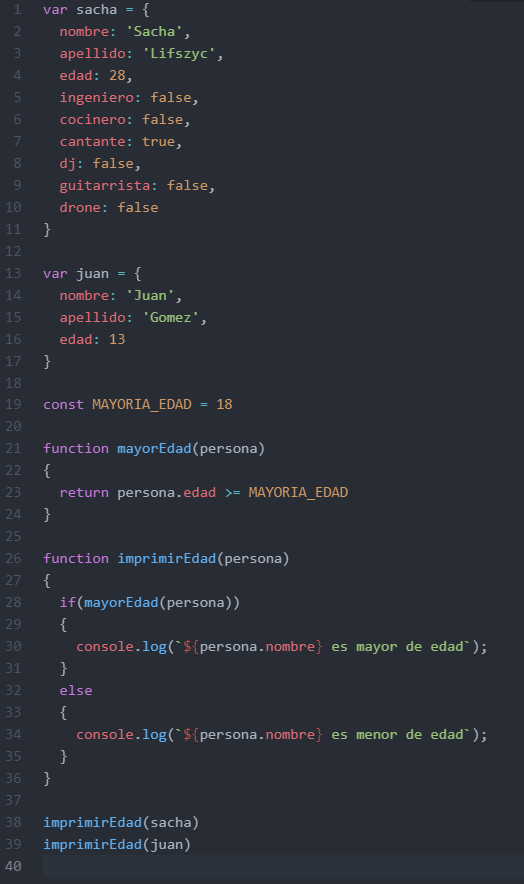

### Clase 14 *Arrow functions*
Arrow Functions (Función Flecha) es una alternativa compacta a una expresión de función tradicional, pero es limitada y no se puede utilizar en todas las situaciones.

Una de las formas de definir una función sin nombre es asignándola una la variable:

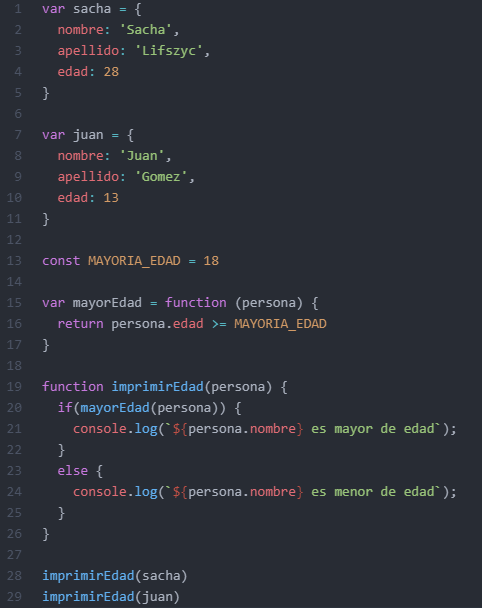

Cuando se declara una función con variable es recomendado hacerlo con un const para que no sea redeclarado.

Con el Arrow Function se elimina la palabra 'function' del código y colocamos una flecha entre el argumento y el corchete de apertura:

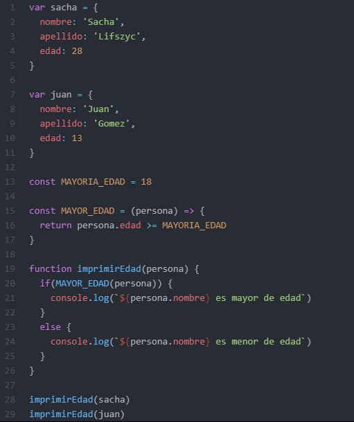

Si el argumento es solamente uno, podemos quitar los paréntesis, suprimir los corchetes y eliminar la palabra 'return' ya que queda implícito:

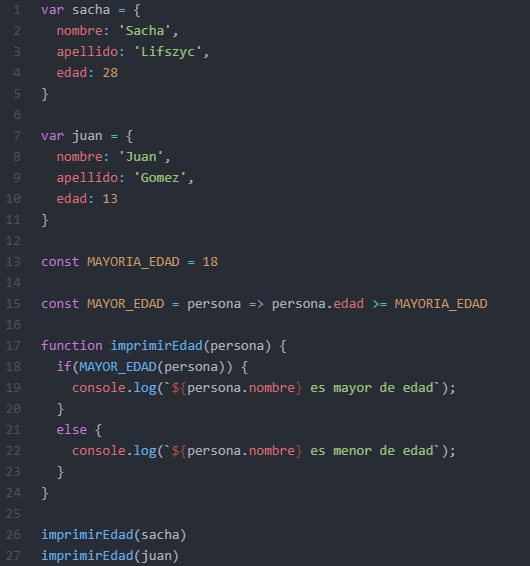

Si desglosamos el objeto para acceder al atributo que deseamos debemos volver a poner nuevamente los paréntesis:

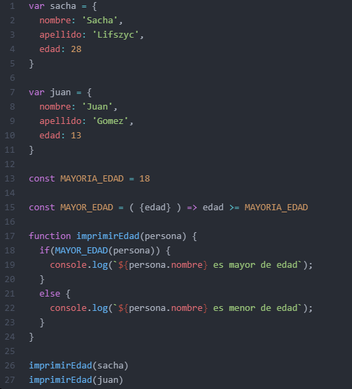

Otro ejemplo seria si quisiéramos hacer una función que permita o niegue un acceso según la edad, para eso  llamamos a la función MAYOR_EDAD y ponemos un símbolo de exclamación (!) que negara la condición que siga:

***RETO: Escribir la función imprimirEdad con Arrow Functions y completar la función permitirAcceso para que nos imprima si tenemos un acceso denegado  o permitido.***

### Clase 15 *Estructuras repetitivas: for*
El bucle for se utiliza para repetir una o más instrucciones un determinado número de veces. Consiste en tres expresiones opcionales, encerradas en paréntesis y separadas por puntos y comas, seguidas de una sentencia ejecutada en un bucle.

**Sintaxis:**

***for ([expresión-inicial]; [condición]; [expresión-final]) {***

  ***sentencia***

***}***

En el ejemplo tenemos a una persona (Sacha) que baja o sube de peso durante un año (365 días):

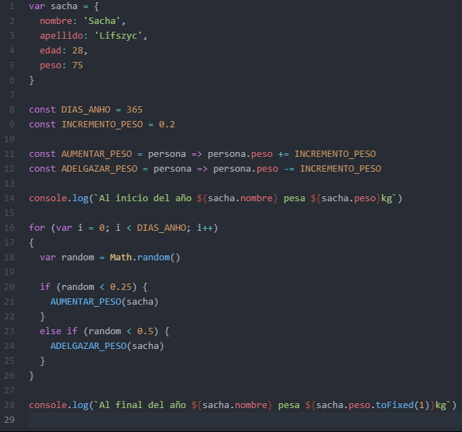

**Math.random()**

Una función que retorna un punto flotante, un número pseudoaleatorio dentro del rango [0, 1). Esto quiere decir, desde el 0 (incluido) hasta el 1 pero sin incluirlo (excluido), el cual se puede escalar hasta el rango deseado. La implementación selecciona la semilla inicial hasta el algoritmo que genera el número aleatorio; este no puede ser elegido o cambiado por el usuario.

### Clase 16 *Estructuras repetitivas: while*
While crea un bucle que ejecuta una sentencia especificada mientras cierta condición se evalúe como verdadera. Dicha condición es evaluada antes de ejecutar la sentencia

**Sintaxis:**

***while (condición) {***

  ***sentencia***

***}***

En el ejemplo tenemos nuestra persona (Sacha) que debe adelgazar 3kg y vamos contando los días hasta que esa condición se cumpla:

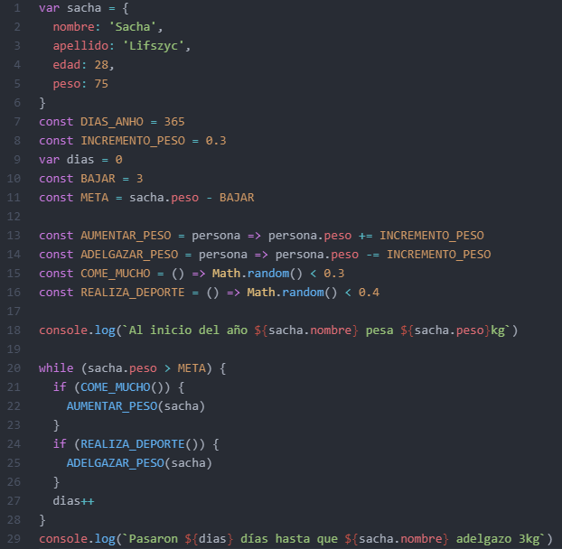

En ocasiones nuestro código puede fallar por errores de sintaxis o errores lógicos. En caso de que quieras verificar tu código, debes utilizar un debugger, el código se detiene cada vez que lee esta palabra.

**Incrementar**

El operador Incremento ( ++ ) incrementa su operando en uno.

- Si se utiliza como un postfix, entonces devuelve el valor antes de incrementar.
- Si se usa como un prefijo, entonces devuelve el valor después de incrementar.

**POSTFIX**

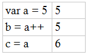

En este caso, a se incrementa después de configurar b . Entonces, b será 5, y c será 6.

**PREFIX**

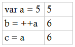

En este caso, a se incrementa antes de configurar b . Entonces, b será 6, y c será 6.

### Clase 17 *Estructuras repetitivas: do-while*
La sentencia do-while (hacer mientras) crea un bucle que ejecuta una sentencia especificada, hasta que la condición de comprobación se evalúa como falsa. La condición se evalúa después de ejecutar la sentencia, dando como resultado que la sentencia especificada se ejecute al menos una vez.

**Sintaxis:**

***do {***

  ***sentencia***

***} while (condición)***

En el ejemplo tenemos un contador que suma la cantidad de veces que fuimos a ver si llovía:

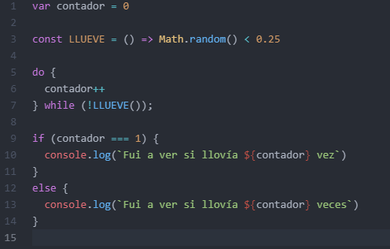

### Clase 18 *Condicional múltiple: switch*
La declaración switch evalúa una expresión, comparando el valor de esa expresión con una instancia case, y ejecuta declaraciones asociadas a ese case, así como las declaraciones en los case que siguen.

**Sintaxis:**

***switch (expresión) {***

  ***case valor_1:***

  ***Sentencia ejecutada cuando el resultado de expresión coincide con el valor_1***

  ***break;***

  ***case valor_2:***

  ***Sentencia ejecutada cuando el resultado de expresión coincide con el valor_2***

  ***break;***

  ***...***

  ***case valor_N:***

  ***Sentencia ejecutada cuando el resultado de expresión coincide con el valor_N***

  ***break;***

  ***default:***

  ***Sentencia ejecutada cuando ninguno de los valores coincide con el valor de la expresión***

  ***break;***

***}***

También vimos **prompt** que muestra un diálogo con mensaje opcional que solicita al usuario que introduzca un texto.

En el ejemplo tenemos un prompt que solicita un signo zodiacal para imprimir el horóscopo del día:

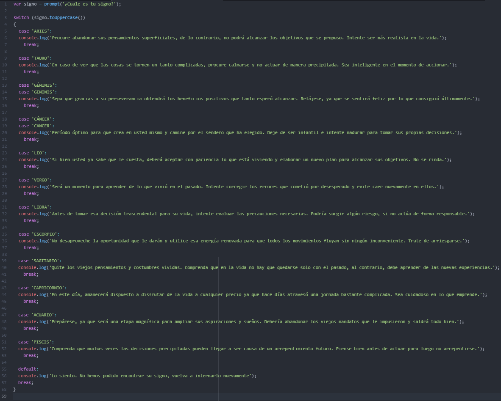

## Modulo 4. Arrays
### Clase 19 *Introducción a arrays*
Los arrays son estructuras que nos permiten organizar elementos dentro de una colección. Estos elementos pueden ser números, strings, booleanos, objetos, etc.

Por ejemplo tenemos un grupo de personas con nombre, apellido y altura:

Si quisiéramos, podemos guardar a estas personas en una misma colección:

Si consultamos en la consola nos aparece de la siguiente forma:

El número nos dice que es una colección de X elementos, en este caso 6, y entre llaves nos marca cada objeto.

Si queremos acceder al primer elemento escribimos, ***nombre_array[número]***:

Si lo que queremos es acceder a los atributos de los objetos son de dos formas, ***nombre_array[número].atributo*** o ***nombre_array[número]['atributo']***, los dos completamente equivalentes:

También podemos recorrer el array e ir imprimiendo la altura de cada uno de la siguiente forma:

- **length:** Representa la longitud del array.
- **i:** Es el índice del array.

### Clase 20 *Filtrar un array*
En esta clase aprenderemos como filtrar los arrays y para hacerlo utilizaremos el método filter() que nos permite filtrar solo los elementos que deseamos (según ciertos criterios) y devolverlos en un nuevo array.

En este ejemplo seguiremos usando nuestra colección persona de la clase anterior y filtraremos a las personas cuya altura sea mayor de 1.80mts:

Tenemos:

- El array 'personas'.
- Una variable que guarda nuestra filtración de las personas altas (altura mayor a 1.80).
- La función ES_ALTA que recibe como parámetro a 'persona' y retorna a aquellas que cumplan la condición de altura mayor 1.80.

Cuando buscas en la red códigos con filtros puede que te encuentres con esto que es prácticamente:

También, si deseas hacer más prolijo tu código puedes escribirlo de la siguiente forma:

***RECUERDA: Si no hay elementos que pasen la prueba, filter() devuelve un array vacío.***

***RETO: Escribe el filtrado de personas bajas.***

### Clase 21 *Transformar un array*
El método map() crea un nuevo array con los resultados de la llamada a la función indicada aplicados a cada uno de sus elementos.

Siguiendo con nuestra colección personas, pasaremos la altura de metros a centímetros, pero si lo escribimos de esta forma:

Estaremos modificando nuestro array personas:

Para evitar eso debemos crear un nuevo objeto de la siguiente manera:

De esta forma no tocamos las alturas de nuestros objetos:

También, si queremos hacer más prolijo nuestro código, podemos modificar la nomenclatura de nuestro Arrow Functions. Dado que simplemente devuelve un objeto debemos poner paréntesis seguido de llaves y lo que deseamos retornar:

### Clase 22 *Reducir un array a un valor*
El método reduce() nos permite reducir, mediante una función que se aplica a cada uno de los elemento del array, todos los elementos de dicho array, a un valor único.

En nuestra colección 'personas' ponemos la cantidad de libros que tiene cada uno:

Si nosotros queremos contar la cantidad total de libros podemos hacer lo siguiente:

Es totalmente valido y funciona, pero también podemos hacerlo lo mismo con un código más prolijo de la siguiente forma:

Tenemos:

- Un array 'personas'.
- La función 'REDUCER' que recibe como dos parámetros y las suma.
- La variable 'totalLibro' que guarda la totalidad de la cantidad de libros.

El reduce() tiene dos argumentos; la función y el valor inicial del acumulador. Mientras que la función REDUCER recibe el acumulador y cada uno de los elementos (persona), y retorna la suma de la suma del acumulador y la cantidad de libros de cada persona.

Este código también podemos recudirlo un poco más y escribirlo así:

## Modulo 5. Programación Orientada a Objetos en JavaScript
### Clase 23 *Cómo funcionan las clases en JavaScript*

Cuando se empieza a programar en un lenguaje como JavaScript (es decir, permisivo hasta no poder más) dar los primeros pasos puede resultar realmente complicado. El enfoque que da JavaScript a las clases es ligeramente distinto a lo que cabe esperar, ya que en este lenguaje todo son objetos, y cuando digo todo quiero decir que los números son objetos, las funciones también son objetos y las "clases" que crearán objetos también son objetos.

**Crear clases en JavaScript**

Tenemos:

- Clase: Es un lenguaje basado en prototipos que no contiene ninguna declaración de clase, como se encuentra, por ejemplo, en C + + o Java. Esto es a veces confuso para los programadores acostumbrados a los lenguajes con una declaración de clase. En su lugar, JavaScript utiliza funciones como clases. Definir una clase es tan fácil como definir una función. En el ejemplo tenemos una clase 'Persona.
- Constructor: Se usa para establecer las propiedades del objeto o para llamar a los métodos para preparar el objeto para su uso. En el ejemplo tenemos un console.log que nos muestra el mensaje de 'Me ejecutaron'.
- Objeto: Es la instancia de la clase. Para crear un objeto obj utilizamos la declaración new obj, asignando el resultado (que es de tipo obj) a una variable para tener acceso más tarde. En el ejemplo tenemos una instancia 'sacha'.

**Propiedad (atributo del objeto)**

Las propiedades son variables contenidas en la clase, cada instancia del objeto tiene dichas propiedades. Las propiedades deben establecerse a la propiedad prototipo de la clase (función), para que la herencia funcione correctamente.

Para trabajar con propiedades dentro de la clase se utiliza la palabra reservada this, que se refiere al objeto actual. El acceso (lectura o escritura) a una propiedad desde fuera de la clase se hace con la sintaxis: Nombre_de_la_instancia.Propiedad. Es la misma sintaxis utilizada por C++, Java y algunos lenguajes más. (Desde dentro de la clase la sintaxis es this.Propiedad que se utiliza para obtener o establecer el valor de la propiedad).

En el siguiente ejemplo definimos las propiedades nombre y apellido de la clase Persona y la definimos en la creación de la instancia.

**Métodos**

Los métodos siguen la misma lógica que las propiedades, la diferencia es que son funciones y se definen como funciones. Llamar a un método es similar a acceder a una propiedad, pero se agrega () al final del nombre del método, posiblemente con argumentos.

En el siguiente ejemplo se define y utiliza el método saludar() para la clase Persona.

***RETO: Agrega el atributo altura y la función soyAlto.***

### Clase 24 *Modificando un prototipo*

Tenemos nuestro reto de la clase anterior:

**¿Qué pasa si ponemos el método después de la instancia?**

Tendremos un error de 'is not function', es decir, se ha intentado llamar a un elemento o valor como si fuera una función, pero no lo era. El código esperaba que hubiera una función implementada, pero no la ha encontrado.

Por eso es muy importante donde colocamos las funciones que van a tener el prototipo.

**¿Qué pasa si las funciones las convertimos en Arrow Function?**

Nos da todo falso (false). ¿Por qué? Lo veremos en la siguiente clase.

### Clase 25 *El contexto de las funciones: quién es this*

En la clase anterior nos quedamos con este ejemplo de Arrow Function con error:

**"this" y funciones flecha**

Una de las razones por las que se introdujeron las funciones flecha fue para eliminar complejidades del ámbito (this) y hacer que la ejecución de funciones sea mucho más intuitiva.

Para resumir, this se refiere a la instancia. Las instancias se crean cuando se invoca la palabra clave new. De lo contrario, this se establecerá —de forma predeterminada— en el ámbito o alcance de window.

En las funciones tradicionales de manera predeterminada this está en el ámbito de window. Mientras que las funciones flecha no predeterminan this al ámbito o alcance de window.

La función flecha no tiene su propio this. Se utiliza el valor this del ámbito léxico adjunto; las funciones flecha siguen las reglas normales de búsqueda de variables. Entonces, mientras busca this que no está presente en el ámbito actual, una función flecha termina encontrando el this de su ámbito adjunto.

**Funciones flecha utilizadas como métodos**

Como se indicó anteriormente, las expresiones de función flecha son más adecuadas para funciones que no son métodos.

***RECUERDA: Dentro de la Arrow Function, this está haciendo referencia al espacio global, a windows.***

### Clase 26 *La verdad oculta sobre las clases en JavaScript*

Los objetos en JavaScript son "contenedores" dinámicos de propiedades (referidas como sus propiedades particulares).  Los objetos en JavaScript poseen un enlace a un objeto prototipo. Cuando intentamos acceder a una propiedad de un objeto, la propiedad no sólo se busca en el propio objeto sino también en el prototipo del objeto, en el prototipo del prototipo, y así sucesivamente hasta que se encuentre una propiedad que coincida con el nombre o se alcance el final de la cadena de prototipos.

**Heredando 'métodos'**

JavaScript no tiene "métodos" en la forma que los lenguajes basados en clases los define. En JavaScript, cualquier función puede añadirse a un objeto como una propiedad. Una función heredada se comporta como cualquier otra propiedad, viéndose afectada por el solapamiento de propiedades como se muestra anteriormente (siendo, en este caso, una especie de redefinición de métodos).

Cuando una función heredada se ejecuta, el valor de this apunta al objeto que hereda, no al prototipo en el que la función es una propiedad.

**Usando prototipos en JavaScript**

Veamos lo que sucede detrás de escena detalladamente.

En JavaScript, como se mencionó anteriormente, las funciones pueden tener propiedades. Todas las funciones tienen una propiedad especial llamada prototype.

Tenemos una nueva clase 'Desarrollador' que hereda de nuestra clase 'Persona':

Si creamos una instancia de Persona y otra de Desarrollado, y llamamos al método saludar():

Nos da respuesta diferentes aunque el nombre del método sea similar, eso es porque el saludar() de la clase Desarrollador pisa sobre el método saludar() de la clase Persona.

Si en la consola usamos el método prototype podemos ver un objeto que nos dice que métodos entiende y que atributos tiene, y cuál es el constructor:

Tenemos un atributo _proto_ que apunta al prototipo que 'tiene' el objeto, en el caso de Persona apunta a Object mientras que Desarrollador apunta a Persona y dentro tiene otro _proto_ que finalmente apunta a Object.

### Clase 27 *Clases en JavaScript*

A partir del 2015 el lenguaje de JavaScript se ha ido actualizando, es por eso que vamos a encontrar distintas versiones con los nombres ECMAScript 2015, ECMAScript 2016, ECMAScript 2017, ECMAScript 2018 y ECMAScript 2019.

**¿Qué es ECMAScript?**

ECMAScript específicamente es el estándar que a partir del año 2015 a la actualidad se encarga de regir como debe ser interpretado y funcionar el lenguaje JavaScript, siendo este (JS – JavaScript) interpretado y procesado por multitud de plataformas, entre las que se encuentran los navegadores web, NodeJS u otros ambientes como el desarrollo de aplicaciones para los distintos sistemas operativos que actualmente existen en el mercado. Los responsables de dichos navegadores y JavaScript deben encargarse de interpretar el lenguaje tal como lo fija ECMAScript.

Esta nueva actualización lo que trae es una facilidad para lograr lo mismo que estábamos haciendo acá, pero de una manera mucho más sencilla. Lo que no tenemos que olvidarnos es que siguen siendo todos prototipos.

- Class: Recordemos que las clases son de hecho 'funciones especiales', y al igual que se pueden definir expresiones de función y declaraciones de función, la sintaxis de clase tiene dos componentes: expresiones de clase y declaraciones de clase.
- Constructor: Es un método especial para crear e inicializar un objeto creado con una clase. Solo puede haber un método especial con el nombre 'constructor' en una clase. Si esta contiene más de una ocurrencia del método constructor, se arrojará un error. Un constructor puede usar la palabra reservada super para llamar al constructor de una superclase
- Extends: Es una palabra clave usada en la declaración o expresión de clases, para crear una clase hija de otra.

## Modulo 6. Asincronismo
### Clase 28 *Funciones como parámetros*

JavaScript nos permite crear una función que se pasa a otra función como un argumento, que luego se invoca dentro de la función externa para completar algún tipo de rutina o acción.

En nuestro ejemplo tendremos una función responder Saludo() que nos hará algún tipo de acción dependiendo de si la instancia es de la clase Persona o la clase Desarrollador:

Tiene tres argumentos:

- Nombre
- Apellido
- esDev: Este estará dentro de un if, si la condición se cumple (es decir, es de la clase Desarrollador) se imprimirá la sentencia, sino solamente nos imprimirá el 'Buen día'.

Creamos nuestras instancias y al momento de llamar al método saludar() es cuando pasamos nuestra función responderSaludo():

Dentro de la clase Persona, en el método saludar() podemos el argumento que recibirá, en este casi 'fn', con una condición; si fn es verdadero, es decir, se nos fue enviado la función entonces llamaremos a la función fn que es la función responderSaludo() y enviaremos dos argumentos que son nombre y apellido:

Lo mismo sucede en la clase Desarrollador:

**¿Qué diferencias hay entre Persona y Desarrollador?**

Vemos que en la clase Persona no enviamos un tercer argumento, mientras que en la clase Desarrollador enviamos true, pues tiene una explicación.

Hay valores llamados Boolean que no debemos confundir con los Boolean primitivos (true y false).

Si es necesario, un valor pasado como parámetro se convierte en un valor booleano. Si el valor se omite o es 0, -0, null, false, NaN, undefined, o la cadena vacía (""), el objeto tiene un valor inicial de false. Todos los demás valores, incluido cualquier objeto, un arreglo vacío ([]), llaves vacías ({}) o la cadena "false", crean un objeto con un valor inicial de true.

***RECUERDA: Cualquier objeto cuyo valor no sea undefined, o null, incluido un objeto Boolean cuyo valor es false, se evalúa como true cuando se pasa a una declaración condicional.***

En el ejemplo en la clase Persona no enviamos un valor por parámetros por lo que directamente es false y la condición no se cumplirá, mientras que en la clase Desarrollador si enviamos un valor true para que la condición se cumpla.

**Diferentes respuestas**

En el ejemplo Sacha no envió ningún valor mientras que Erika y Arthur sí, esto dio como resultado tres diferentes respuestas.

Como Sacha, de la clase Persona, no cumplió la condición de recibir la función solo imprime el 'Hola, me llamo …', en cambio a Erika (que es de la misma clase Persona) quien envió la función y pudo cumplir la condición. Finalmente, Arthur es de una clase diferente (Desarrollador) que cumple ambas condiciones, es decir, envió la función responderSaludo() y en esDev tiene true.

**NOTA:**

Una mejor manera de escribir en las funciones sin necesidad de usar this, es la siguiente:

Ambas son completamente equivalentes.

### Clase 29 *Cómo funciona el asincronismo en JavaScript*

Resulta que JavaScript es un lenguaje de programación asíncrono. Lo que quiere decir esto es que al ejecutar código JavaScript el hilo de ejecución continuará a pesar de encontrarse en situaciones en las que no obtenga un resultado inmediatamente. Por ejemplo, cuando hacemos el pedido de información a un servidor, la respuesta posiblemente demore un poco. Sin embargo, el hilo de ejecución de JavaScript continuará con las demás tareas que hay en el código.

Un ejemplo práctico de esto sería una aplicación web que necesita llenar una tabla de datos, así que el código hará un pedido al servidor de los datos que necesita llenar. Pero el hilo de ejecución no se detiene así que ejecutará el código que pinta la tabla en el navegador. Esto se convierte en un problema ya que los datos del servidor llegan después de que la tabla se haya pintado en pantalla, una tabla sin todos obviamente. Así que trabajar con código asíncrono puede tener muchas ventajas pero en casos como este presenta un gran problema.

Pues bien, para solucionar esto algunas funciones de JavaScript tienen como parámetro algo que se conoce como callback. Un callback es simplemente una función que se pasa como parámetro a otra función.

Para tener un cierto control en el código asíncrono de JavaScript existen las promesas. Las promesas llegan a JavaScript en la versión 6 de ECMAScript. Una promesa es el objeto que representa un valor que estará disponible ahora, en el futuro o quizá nunca.

### Clase 30 *Cómo funciona el tiempo en JavaScript*

En principio, cualquier tarea que se haya delegado al navegador a través de un callback, deberá esperar hasta que todas las instrucciones del programa principal se hayan ejecutado. Por esta razón el tiempo de espera definido en funciones como setTimeout, no garantizan que el callback se ejecute en ese tiempo exactamente, sino en cualquier momento a partir de allí, sólo cuando la cola de tareas se haya vaciado.

El método setTimeout() se establece un temporizador que ejecuta una función o una porción de código después de que transcurre un tiempo establecido.

**Sintaxis:**

***setTimeout(función_a_ejecutar, tiempo_en_milisegundos)***

En el ejemplo imprimiremos a tres letras (a, b y c):

Al ejecutar podemos ver que nos aparece en pantalla en el siguiente orden; a, c y b. Esto se debe a que setTimeout() pone en 'espera' o en 'cola' el código a ejecutar dentro de la función.

También podemos escribir las funciones como un Arrow Function y seguirá ejecutando el código de la misma manera:

**¿En qué orden aparecen las letras si escribimos 0 milisegundos?**

- Primera opción: A, B, C
- Segunda opción: A, C, B

Pues la segunda opción es la correcta. Incluso si el tiempo es de cero milisegundos, como se ha dicho, setTimeout() deja en espera el código y ejecuta todos los códigos principales primero, cuando el código principal termina es cuando empieza a ver los códigos en espera para que sean ejecutados.

Esto es más entendible con el siguiente código:

Tenemos un for que no ejecuta nada y un setTimeout() que nos imprimirá una letra 'd' en 2 segundos.

Cuando ejecutamos el código el tiempo que tarde puede ser un poco variante, en general se mantiene entre 2 a 4 segundos, y ya después de que el for termine JavaScript ejecuta nuestro setTimeout().

### Clase 31 *¿Qué pasó con swapi.co?*

**SWAPI.co ha desaparecido**

Desafortunadamente, swapi.co ya no se mantiene y el servicio está actualmente inactivo. El autor del proyecto, Paul Hallett, quien creó y le dio mantenimiento ha desactivado desde hace tiempo esta API que muchos utilizamos en nuestros proyectos de JavaScript para aprender a integrar un backend a un frontend.

**SWAPI.dev, una nueva solución**

Juriy Bura, junto a otros desarrolladores, han publicado una versión idéntica a la API utilizada por Swapi.io, la cual está disponible desde el dominio swapi.dev. Por lo tanto, de ahora en adelante, para continuar el curso sin problemas solo debes reemplazar swapi.io, la URL obliterada (la que ya no funciona), por la nueva versión que sí está disponible: swapi.dev.
Este proyecto es mantenido por la comunidad y gracias a la filosofía del código libre es posible tener una nueva versión de la API para nuestros proyectos.

**Crea tu propia API de Star Wars**

**¿Quieres tener tu propia versión de SWAPI?**

El código fuente del proyecto está disponible en GitHub, lo que te permite crear tu propia versión con solo realizar un Fork y subirlo a un servidor o consumirla en tu localhost.

Este es el repositorio del proyecto original: https://github.com/phalt/swapi.

¡Compártenos en los comentarios en link a tu repositorio fork de la API de Star Wars y qué cambios hiciste o planeas hacer en tu versión de este proyecto!

### Clase 32 *Callbacks*

En esta clase vamos aprender que son los callbacks, como utilizarlos y vamos a poner en práctica todo lo aprendido sobre asincronismo en JavaScript. Para eso vamos hacer varias cosas; vamos a utilizar una librería externa llamada JQuery para realizar request y obtener datos de una API externa, esa API externa será de Star Wars llamada Star Wars API o SWAPI que nos va a permitir acceder a todos los datos que aparecen en las películas de Star Wars (personajes, planetas, películas en sí) todo a través del código que estaremos escribiendo en JavaScript.

Para empezar lo que haremos es dirigirnos a la página de JQuery (https://jquery.com/) y daremos click en Download jQuery:

Y buscamos donde se utiliza con un CDN:

Básicamente nos dice que si damos click en el link vamos a poder encontrar la versión de jQuery desde un CDN.

***CDN (Content Delivery Network o Red de Distribución de Contenido) es básicamente un conjunto de servidores ubicados en diferentes puntos de una red que contienen copias locales de ciertos contenidos (vídeos, imágenes, música, documentos, webs, etc.) que están almacenados en otros servidores generalmente alejados geográficamente, de forma que sea posible servir dichos contenidos de manera más eficiente.***

***Esta mejora en la eficiencia se logra con un mejor balanceo de la carga a la que están sometidos tanto los servidores que alojan los contenidos como los enlaces que interconectan las distintas secciones de la red, eliminando posibles cuellos de botella y sirviendo los datos en función de la cercanía geográfica del usuario final.***

Al acceder al CDN vemos que tenemos varias versiones de la librería, nosotros utilizaremos la versión 3, damos click en 'minified':

Nos abrirá una ventana de la que copiaremos el código de integración:

El código lo pegamos en nuestro archivo HTML, esto es muy importante, ANTES de llamar a nuestro archivo JavaScript:

Con esto ya tenemos jQuery a nuestra disposición.

Nosotros estaremos realizando un request, es decir, solicitar una respuesta en este caso a la página de SWAPI (https://swapi.dev/):

***API (Application Programming Interface o Interfaz de Programación de Aplicaciones) es una «interfaz», es decir, es la forma en que dos aplicaciones o servicios se comunicar entre sí. Lo hacen exponiendo al resto de aplicaciones el conjunto de servicios disponibles en cada una y cómo se deben acceder.***

***A la serie de estos servicios, se le denomina API. Por eso, las API sirven para que una aplicación pueda interactuar con otra.***

En el archivo JavaScript escribimos el siguiente código:

Como lo que deseamos es acceder a los datos de SWAPI para hacer con ellos lo que queramos, tenemos que hacer el request:

- API_URL: Es la url del SWAPI.
- PEOPLE_URL: Es la url de personas (people), el id es el número de la consulta que deseamos realizar (por ejemplo, Luke Skywalker es 1 y Darth Vader es 4).
- LUKE_URL: Es la url a la que queremos acceder (en este caso es la unión completa de API_URL y PEOPLE_URL).

  - Con el método replace() cambiamos el ':id' por el número que deseamos.

- OPTS: Indica al jQuery que el request se hará hacia otra página.
- ON_PEOPLE_RESPONSE: Es el callback, una función que se pasa a otra función como un argumento. Esta función se invoca, después, dentro de la función externa para completar alguna acción.
- $.get: Este método nos permite hacer el request y acepta varios parámetros.

### Clase 33 *Haciendo múltiples requests*

En esta clase accederemos a múltiples datos al mismo tiempo.

Creamos una función que llamada obtenerPersonajes() al que pasaremos el número del personaje que deseamos:

***¿Qué pasa cuando llamamos a múltiples personajes?***

En el ejemplo llamamos al personaje con los id 1, 2 y 3. Pero llamarlo en ese orden no significa que precisamente vengan en ese mismo orden, con esto podemos ver el asincronismo de JavaScript en su máximo esplendor, básicamente no sabemos en qué orden nos van a llegar las respuestas.

### Clase 34 *Manejando el Orden y el Asincronismo en JavaScript*

Una manera de asegurar que se respete la secuencia en que hemos realizado múltiples tareas es utilizando callbacks, con lo que se ejecutará luego, en cada llamada. Lo importante es que el llamado al callback se haga a través de una función anónima. Sin embargo, al hacerlo de esta manera generamos una situación poco deseada llamada CallbackHell.

**¿Qué es Callback Hell?**

El Callback Hell o Pirámide de Doom es un anti-patrón visto en el código de programadores que son nuevos. En grandes proyectos es muy común la necesidad de validar, buscar, procesar y almacenar información de forma asíncrona y si no estamos acostumbrados a trabajar con código asíncrono corremos el riesgo de tropezar con el Callback Hell sin siquiera notarlo.

Los Callback Hell consiste en múltiples callbacks anidados que provocan que el código se vuelva difícil de leer y 'debuggear'; ésta es la principal razón por la cual se debe evitar. Es entendible que un aprendiz padawan caiga en el Callback Hell mientras lidia con lógica asíncrona.

**¿Por qué no ponemos function?**

En el ejemplo ponemos el parámetro separados con comas, pero al hacerlo inmediatamente se estarán invocando, incluso antes del obtenerPersonajes(1), y al refrescar el navegador veremos que siempre se llamara el id 2.

### Clase 35 *Manejo de errores con callbacks*

En esta clase solucionaremos el problema de quedarnos sin conexión, u otro error similar, en medio de una sucesión de callbacks utilizamos el método fail().

Para este ejemplo iremos al navegador, ingresamos en Red (Network) dando click en 'deshabilitar la memoria caché' y recargamos la página con CTRL + SHIFT + R (este tipo de carga ignora el caché de la página almacenado en el navegador y carga todos los recursos directamente desde el servidor de la web otra vez), tan pronto como cargue damos en click en 'Sin Conexión' o 'Offliner' para que corte la recarga:

Tras hacer eso podemos ver como el método fail() actúa lanzando un mensaje:

Como no se pudo obtener el personaje del id 2, los demás tampoco han podido cargarse.

### Clase 36 *Promesas*

El objeto Promise (Promesa) es usado para computaciones asíncronas. Una promesa representa un valor que puede estar disponible ahora, en el futuro, o nunca

Una Promesa es un proxy para un valor no necesariamente conocido en el momento que es creada la promesa. Permite asociar manejadores que actuarán asincrónicamente sobre un eventual valor en caso de éxito, o la razón de falla en caso de una falla. Esto permite que métodos asíncronos devuelvan valores como si fueran síncronos: en vez de inmediatamente retornar el valor final, el método asíncrono devuelve una promesa de suministrar el valor en algún momento en el futuro.

Una Promesa se encuentra en uno de los siguientes estados:

- Pendiente (pending): estado inicial, no cumplida o rechazada.
- Cumplida (fulfilled): significa que la operación se completó satisfactoriamente.
- Rechazada (rejected): significa que la operación falló.

Una promesa pendiente puede ser cumplida con un valor, o rechazada con una razón (error). Cuando cualquiera de estas dos opciones sucede, los métodos asociados, encolados por el método then de la promesa, son llamados. (Si la promesa ya ha sido cumplida o rechazada en el momento que es anexado su correspondiente manejador, el manejador será llamado, de tal manera que no exista una condición de carrera entre la operación asíncrona siendo completada y los manejadores siendo anexados).

Como los métodos then() y catch() retornan promesas, éstas pueden ser encadenadas.

- El método then() retorna una Promesa. Recibe dos argumentos: funciones callback  para los casos de éxito y fallo de Promise.
- El método catch() puede ser muy útil para el manejo de errores en tu código con promesas.

***No confundir con:***

  ***Varios lenguajes tienen mecanismos para evaluar perezosamente y postergar una computación, a los que también les llaman "promesas" (ejemplo, Scheme). Las promesas en JavaScript representan procesos que ya están sucediendo, y pueden ser encadenados con funciones callback. Si lo que se busca es evaluar perezosamente una expresión, se debe considerar el Arrow Function sin argumentos: f = () => expresión para crear la expresión evaluada perezosamente, y f () para evaluar.***

***Nota:***

  ***Una promesa se dice que está determinada si se ha cumplido o si se ha rechazado, pero no está pendiente. Con promesas también se usa el término resuelta — esto significa que la promesa está determinada, o que se encuentra bloqueada dentro de una cadena de promesas.***

Tenemos el siguiente ejemplo para ver cómo funciona la promesa:

**Sintaxis:**

***new Promise( /* ejecutor */ function(resolver, rechazar) { ... } );***

Una función con los argumentos resolver y rechazar. La función ejecutor es ejecutada inmediatamente por la implementación de la Promesa, pasándole las funciones resolver y rechazar (el ejecutor es llamado incluso antes de que el constructor de la Promesa devuelva el objeto creado). Las funciones resolver y rechazar, al ser llamadas, resuelven o rechazan la promesa, respectivamente. Normalmente el ejecutor inicia un trabajo asíncrono, y luego, una vez que es completado, llama a la función resolver para resolver la promesa o la rechaza si ha ocurrido un error.

Si un error es lanzado en la función ejecutor, la promesa es rechazada y el valor de retorno del ejecutor es rechazado.

### Clase 37 *Promesas Encadenadas*

Una necesidad común es el ejecutar dos o más operaciones asíncronas seguidas, donde cada operación posterior se inicia cuando la operación previa tiene éxito, con el resultado del paso previo. Logramos esto creando una cadena de objetos promises.

A diferencia de los callbacks en el Callback Hell, que terminan estando anidados unos dentro de otros, cuando se usan Promesas la ejecución de las llamadas no se hacen de manera anidada sino de manera encadenada, al mismo nivel una debajo de la otra, lo que hace que el código sea mucho más legible y mantenible.

Tenemos el siguiente ejemplo de Promesas Encadenadas:

**¿Cómo funciona?**

Muy sencillo. El método then() recibe como primer argumento una Promesa para el personaje 1, esta función devuelve otro valor para la Promesa del personaje 2. Si a este primer then() le concatenamos otro then(), la función que pasemos como argumento a este último then() recibirá lo que devolvimos en el primero, pudiendo repetir el proceso tantas veces como quieran.

Toda esta concatenación es posible gracias a que promise.then devuelve una Promise , de modo que podemos adjuntarle otro nuevo then().

### Clase 38 *Múltiples promesas en paralelo*

Para hacer el llamado a múltiples promesas usaremos el método estático Promise.all() que acepta una promesa de promesas y devuelve una nueva promesa, que se resuelve cuando todas las promesas en la iterable se han resuelto, o se rechazan si al menos una de las promesas en la iterable se ha rechazado.

Promise.all  se cumple cuando todas las promesas del iterable  (por ejemplo, una array) dado se han cumplido, o es rechazada si alguna promesa no se cumple.

Si alguna de las promesas pasadas en el argumento iterable falla, la promesa all() es rechazada inmediatamente con el valor de la promesa que fue rechazada, descartando todas las demás promesas hayan sido o no cumplidas. Si se pasa un array vacío a all(), la promesa se cumple inmediatamente.

Ejemplo de múltiples promesas en paralelo:

**Sintaxis**

***Promise.all(iterable);***

**¿Qué sucede?**

Nos apoyamos en un array de ids con el que luego construimos otro arreglo de Promesas, que pasaremos como parámetro a Promise.all, es decir, al arreglo de promesas con las promesas podemos encadenar llamadas en paralelo, algo que no es posible usando callbacks.

### Clase 39 *Async-await: lo último en asincronismo*

Async-await es la manera más simple y clara de realizar tareas asíncronas.

- Async: La declaración de función async define una función asíncrona, la cual devuelve un objeto Async Function. Un objeto Async Function, que representa una función asíncrona que ejecuta el código contenido dentro de la función.

  - Cuando se llama a una función async, esta devuelve un elemento Promise. Cuando la función async devuelve un valor, Promise se resolverá con el valor devuelto. Si la función async genera una excepción o algún valor, Promise se rechazará con el valor generado.

  - Una función async puede contener una expresión await, la cual pausa la ejecución de la función asíncrona y espera la resolución de la Promise pasada y, a continuación, reanuda la ejecución de la función async y devuelve el valor resuelto.

  - La finalidad de las funciones async/await es simplificar el comportamiento del uso síncrono de promesas y realizar algún comportamiento específico en un grupo de Promises. Del mismo modo que las Promises son semejantes a las devoluciones de llamadas estructuradas, async/await se asemejan a una combinación de generadores y promesas.

- Await: El operador await es usado para esperar a una Promesa. Sólo puede ser usado dentro de una función async function.

	- La expresión await provoca que la ejecución de una función async sea pausada hasta que una Promise sea terminada o rechazada, y regresa a la ejecución de la función async después del término. Al regreso de la ejecución, el valor de la expresión await es la regresada por una promesa terminada.
  
    - Si la Promise es rechazada, el valor de la expresión await tendrá el valor de rechazo.

    - Si el valor de la expresión seguida del operador await  no es una promesa, será convertido a una resolved Promise.

**Sintaxis de Async**

***async function name( [param [, param [, ... param ] ] ] ) {***

   ***statements***

***}***

Donde:

- name es el nombre de la función.
- param el nombre de un argumento que se debe pasar a la función.
- statements son las declaraciones que conforman el cuerpo de la función.

**Sintaxis de Await**

***[rv] = await expression;***

Donde:

- expression es una Promesa o cualquier otro valor por el cual haya que esperar.
- rv regresa el valor terminado de la promesa o solamente un valor si no es una Promesa.

En nuestro ejemplo de Async-Await, para que funcione exactamente igual, encerramos el llamado a Promises.all() dentro de un bloque try … catch.

***NOTA:***

***La declaración try...catch señala un bloque de instrucciones a intentar (try), y especifica una respuesta si se produce una excepción (catch).***

***Consiste en un bloque try que contiene una o más sentencias. Las llaves {} se deben utilizar siempre, incluso para una bloques de una sola sentencia. Al menos un bloque catch o un bloque finally debe estar presente. Esto nos da tres formas posibles para la sentencia try:***

  ***try...catch***

  ***try...finally***

  ***try...catch...finally***

***Un bloque catch contiene sentencias que especifican que hacer si una excepción es lanzada en el bloque try. Si cualquier sentencia dentro del bloque try (o en una función llamada desde dentro del bloque try) lanza una excepción, el control cambia inmediatamente al bloque catch . Si no se lanza ninguna excepción en el bloque try, el bloque catch se omite.***

***La bloque finally se ejecuta después del bloque try y el/los bloque(s) catch hayan finalizado su ejecución. Éste bloque siempre se ejecuta, independientemente de si una excepción fue lanzada o capturada.***

***Puede anidar una o más sentencias try. Si una sentencia try interna no tiene una bloque catch, se ejecuta el bloque catch de la sentencia try que la encierra.***

***Usted también puede usar la declaración try para manejar excepciones de JavaScript.***
