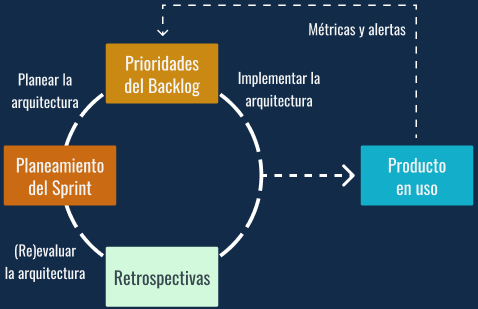

# Curso de Fundamentos de Arquitectura de Software
## Modulo 1. El proceso de desarrollo de software
### Clase 1 *Introducción al curso de Fundamentos de Arquitectura de Software*

El profesor que nos estará guiando durante todo el curso será Guido Contreras Woda, a quien podemos encontrarlo en Twitter como **@GuiWoda**.

**¿Qué es la Arquitectura de Software?**
En el mundo del desarrollo nos enfrentamos a sistemas complejos. Si bien es cierto que no todo el software tiene por qué ser realmente complejo, es necesario establecer unas bases sólidas para facilitar su mantenimiento y su crecimiento en el futuro.

El mantenimiento es esencial, porque aunque un software se pueda desarrollar en unas pocas semanas o meses, lo más probable es que se mantenga durante años, añadiendo nuevas funcionalidades requeridas, o corrigiendo problemas existentes. El crecimiento también es fundamental, porque todo software cuya funcionalidad no se amplíe o se modifique, tiende a ser inservible en un relativamente corto espacio de tiempo.

A medida que el software comienza a crecer y a hacerse más complejo, es importante que tenga una forma bien definida, de modo que seamos capaces de entenderlo como un todo. De no ser así, al examinar cada una de sus partes por separado, lo más normal es que seamos incapaces de interpretar correctamente el funcionamiento y el motivo de su existencia.

Es conveniente definir el concepto ya que hoy en día el término de arquitectura se usa para referirse a varios aspectos relacionados con las TI. De acuerdo al **Software Engineering Institute** (*SEI*), la Arquitectura de Software se refiere a:

***Las estructuras de un sistema, compuestas de elementos con propiedades visibles de forma externa y las relaciones que existen entre ellos.***

El término "elementos" dentro de la definición del SEI es vago a propósito, pues puede referirse a distintas entidades relacionadas con el sistema. Los elementos pueden ser entidades que existen en tiempo de ejecución (objetos, hilos), entidades lógicas que existen en tiempo de desarrollo (clases, componentes) y entidades físicas (nodos, directorios). Por otro lado, las relaciones entre elementos dependen de propiedades visibles (o públicas) de los elementos, quedando ocultos los detalles de implementación. Finalmente, cada conjunto de elementos relacionados de un tipo particular corresponde a una estructura distinta, de ahí que la arquitectura está compuesta por distintas estructuras.

En la Arquitectura de Software se habla de:
- Estructuras
- Modelos con diagramas
- La comunicación entre diferentes sistemas e incluso entre diferentes módulos del sistema

En este curso vamos atravesar todo este camino entendiendo sobre que es el proceso de desarrollo y como la arquitectura está involucrada en cada uno de los pasos de un proceso de desarrollo de software. A su vez vamos a entender el rol del arquitecto y como el arquitecto puede ayudar al éxito o fracaso de un sistema.

Puntualmente en el Curso de Fundamentos de Arquitectura de Software va a ser evidente decisiones que a veces son implícitas y te van a ayudar a ser consciente de cuando estamos tomando una decisión arquitectónica en el sistema y cómo hacer para tomar la mejor decisión posible en ese momento.

### Clase 2 *Etapas del proceso de desarrollo de software*

Para que podamos entender el rol del arquitecto de software y que significa arquitectura de software, necesitamos entender las **etapas del proceso de desarrollo de software**.

Las etapas del desarrollo de software tradicional están bien marcadas para seguir un flujo lineal en donde cada etapa tenía una entrada, un proceso donde se toman decisiones y ciertos roles estaban involucrados, y finalmente una salida que también funciona como una entrada para la etapa siguiente.

De esta forma,  la primera etapa que es el Análisis de Requerimiento también funciona como entrada para el Diseño de la Solución, luego esto pasa a Desarrollo que es la tercera etapa y se conecta con Despliegue, para finalmente terminar en Mantenimiento y empezar nuevamente el ciclo.

**Etapas del Desarrollo de Software**

Para comprender mejor que sucede en cada etapa, iremos una por una.

- **Análisis del Requerimiento**
	
    

	Todo nace de un disparador (una idea, un problema a resolver o algún análisis de mercado que nos disparó la necesidad de crear un artefacto de software). Aquí necesitaremos entender cuál es el problema que queremos resolver, descubrir los requerimientos, y a medida que entremos en la etapa de Análisis de Requerimientos nos encontraremos con que tenemos requerimientos de negocio, requerimientos de usuarios, requerimientos funcionales y requerimientos no funcionales.
	
	Con esto estaremos entendiendo que es el artefacto de software que estaremos construyendo.
	
- **Diseño de Solución**
	
	

	En esta etapa tendremos un análisis profundo de los problemas y plantearemos posibles soluciones. Aquí un analista de negocios, un arquitecto o un equipo de desarrollo pueden trabajar en conjunto para plantear cuales son las posibles soluciones del problema y el resultado de esto debe ser el detalle de la solución a través de modelado, documentación o diferentes alternativas, ya sea productos open source o framework.
	
	***RECUERDEN: Esta es una metodología tradicional, lo que significa que este paso es muy importante para encontrar cuales son los problemas que luego serán difíciles de resolver. Sin embargo, siendo esta una etapa que involucra mucho diseño, a la hora de desarrollar tendremos limitadas nuestras opciones.***
	
- **Desarrollo y Evolución**
	
    

	Aquí es donde naturalmente el programador va implementar la solución, evaluando y ejecutando pruebas automatizadas para garantizar que se está construyendo lo que se espera. Una conexión importante entre la etapa anterior y esta son los criterios de aceptación de la solución, es decir, cual es el set de requerimientos necesarios para poder construir esta solución y como hacemos para evaluar, una vez terminada esta etapa tendremos un artefacto de software.
	
- **Despliegue**
	
    

	En esta etapa utilizaremos nuestro artefacto de software anteriormente obtenido.
	
	Aquí vamos a necesitar la infraestructura y de roles de operación para poder poner el artefacto a disponibilidad. Por ejemplo, si tenemos una aplicación web probablemente necesitaremos de servidores en donde alojar nuestro código, necesitaremos una infraestructura que soporte balanceo de carga, escalabilidad y practicas muy comunes en la aplicación de desarrollo web. Por otro lado, en aplicaciones móviles como Android o iOS probablemente solo nos encarguemos de poner nuestra aplicación en el Store para que el usuario pueda descargarlo.
	
- **Mantenimiento y Evaluación**
	
    

	Esta es una etapa en realidad compuesta por Desarrollo, Despliegue y Mantenimiento.
	
	En esta etapa estaremos atentos a posibles mejoras y a cualquier tipo de nueva funcionalidad que necesitemos desarrollar para poder cambiar nuestro software, y volver a ponerlo nuevamente a disponibilidad del usuario. Es aquí donde el software se mantiene hasta que en algún momento decidamos que el software ya no es más necesario, una vez que esto sucede decimos que el ciclo de vida del software termino y el sistema esta deprecado.

### Clase 3 *Dificultades en el desarrollo de software*

Como vimos en la clase anterior, en la etapa de Diseño y Desarrollo nos concentrados en encontrar cuales son los problemas a resolver para luego implementarlo. Según el artículo de Frederick Brooks, *No Silver Bullet*, podemos dividir los problemas en dos tipos:

- **Problemas Esenciales:** Se trata de entender el concepto de lo que vamos a solucionar, entender el diseño que vamos a crear.
- **Problemas Accidentales:** Se trata más de la plataforma que vamos a implementar, la tecnología que usaremos, los lenguajes, frameworks, integraciones, etc. Los problemas accidentales suelen ser los problemas con la que más a menudo nos encontramos y frustramos, como por ejemplo si trabajamos en una tecnología y no nos deja hacer ciertas cosas que nos gustaría.

**Dificultades Esenciales**

Hablaremos primero de los problemas esenciales, y lo podemos estar dividiendo en cuatro:

- **Complejidad:** Es cuando un lo que tenemos que resolver es complejo en sí mismo. Por ejemplo, calcular la mejor ruta de transporte entre ciudades, es un problema que puede ser complejo, requerir mucho tiempo de cálculo y optimización de ruta, a esto podremos ir agregando cosas como "si el conductor no puede manejar entre cierta horas" o "debe parar entre cierto tiempos", entre diferentes ejemplos más que pueden ir complejizando el especio del problema que queremos resolver.
- **Conformidad:** Trata del software, en el contexto que se va usar y como tiene que adecuarse a ese contexto que quizás no es perfecto. Por ejemplo, si tendremos disponibilidad de internet en todo momento, la calidad de la internet y como modelamos con respecto a eso, también si por ejemplo tendremos comunicación entre diferentes piezas del software y si esa comunicación existe más allá de que sea o no a través de internet.
- **Tolerancia al cambio:** Se refiere a que, una vez terminado de hacer el software, puede cambiarse o será algo difícil de cambiar. Los problemas esenciales de la tolerancia al cambio no tienen que ver tanto con la tecnología y su implementación, si no más con lo que sería en cuanto cambia el problema que estamos resolviendo y que tanto podemos adaptarnos a esos cambios. Algo muy típico de los problemas esenciales de tolerancia al cambio son las leyes de facturación o impuestos, en general tenemos leyes arbitrarias que no nos permiten hacer cálculos matemático simples, además de que debemos considerar, por ejemplo, si en algún momento las leyes cambiaron y para ese contexto de tiempo exacto debamos hacer un cálculo diferente.
- **Invisibilidad:** Trabajar con software es muy difícil, porque no es tangible y esto provoca que se nos dificulte entender su forma en todo momento. Que el software sea invisible no significa que no tenga forma, sino que su forma esta plasmada en código, infraestructura, e ideas que pueden haber quedado en documentos o no. Todo es invisible al momento de usar un software ya que en general lo único que veremos será el interfaz de usuario.
	
**Dificultades Accidentales**

Cuando hablamos de problemas accidentales podemos estarlo dividiendo en tres:

- **Lenguajes de alto nivel:** El problema típico accidental es la programación en sí, el lenguaje que debemos usar. Como sabemos, las máquinas entienden lenguajes muy acotados, es decir, 0's y 1's, y luego se fueron construyendo lenguajes de alto nivel para poder acercar el lenguaje humano, facilitarle a una persona el leer ese programa y entender lo que hace, más allá de que la máquina lo pueda ejecutar. El crecimiento de los lenguajes de alto nivel hace que trabajemos mejor, pero esto resuelve un problema accidental, el problema que la máquina lea solo 0 y 1, si las máquinas entendieran español o ingles no necesitaríamos trabajar sobre lenguajes de alto nivel.
- **Multiprocesamiento:** Resuelve el problema del feedback. El feedback es la acción de ofrecer información a una persona sobre un resultado. Hace un tiempo se tenía que programar y esperar que esté disponible el hilo de ejecución, que el sistema operativo responda y no esté haciendo otra cosa, e incluso se dejaba ejecutando algo y se volvía después de un rato para ver que había sucedido, con el multiprocesamiento y las herramientas nuevas de desarrollo en tecnología tenemos la capacidad de desarrollar mejor feedback, las respuestas son más rápidas e incluso podemos hacer sistemas más óptimos utilizando la capacidad de multiprocesamientos. Sin embargo, esto nuevamente es accidental, es un estado especifico de la tecnología que evoluciono, pero sigue sin resolver los problemas esenciales del software.
- **Entornos de programación:** De tarjetas perforadas y las primeras formas de programa hasta lo que hoy sería abrir un IDE que inteligentemente pueda decirnos funciones, objetivos disponibles y métodos que necesitarían dichos objetivos. Esto facilita mucho el desarrollo de software, pero tiene que ver mucho con el lenguaje que usamos, las librerías y la capacidad de ejecutar dicho código compilado, y todo esto es accidental a contexto actual nuestro. Ya sea que usemos librerías open source, que bajemos compilados o utilicemos API's de sistemas externos, que un IDE nos facilite obtener esa información nos pone en ventaja por sobre los programadores del pasado que no lo tenían.

Frederick Brooks dijo en su artículo:

Si lo complejo del desarrollo de software es lo conceptual, lo esencial, y no lo accidental, entonces esas ganancias de magnitudes en las que se hizo mucho más simple o productivo el desarrollo de software no existe más, es decir, ***no hay ninguna bala de plata que solucione el problema esencial del desarrollo de software***.

Esto es importante, porque cada vez que nos pongamos a investigar o leer sobre tecnología, tenemos que tener en cuenta que está resolviendo. ¿Qué está resolviendo esta librería nueva o este framework? Si resuelven un problema accidental o un problema esencial, porque si resuelven problemas accidentales nos traerá beneficios, pero no creamos que eso resuelve cada uno de los problemas de nuestros futuros software a aquí al futuro. Son problemas accidentales que pueden ser resueltas hoy por una librería, y quizás mañana la evolucionen o la utilicen como parte de una solución mayor, y sigue resolviendo un nuevo problema accidental, pero de nuevo siempre en el contexto del desarrollo y la tecnología actual.

**¿Como resolvemos las dificultades esenciales?**

Frederick Brooks planteo cuatro forma de resolver las dificultades esenciales:

	
- **No desarrollar:** Cuando tengamos un problema complejo, la mejor solución quizás no es hacer un sistema. La solución puede ser utilizar algún sistema ya existente y no tener que desarrollar uno nuevo para no tener que lidiar con todo esto que quizás uno otro ya ha liado, quizás otro se tomó el trabajo de desmenuzarlo en problemas más pequeños y resolverlos. Otra forma de no desarrollar es aprovechar el open source, las librerías que tenemos, y si, quizás desarrollamos algo pequeño, pero no desarrollar toda la solución, simplemente desarrollar integraciones de pequeñas soluciones o utilizar programas que ya están disponibles y conectarlos con una solución más pequeña que nos solucione solo una parte del problema.
- **Prototipados rápidos:** La evolución de este pensamiento son las metodologías agiles. En las metodologías agiles, por ende también en el prototipado rápido, la idea es obtener feedback lo antes posible de si estamos resolviendo el problema correcto, para eso vamos evolucionando nuestro sistema a pasos muy pequeños y siempre tratando de obtener feedback del usuario; es lo que necesitabas, que es lo que necesitas que haga ahora, necesitas que evolucione por sobre esa funcionalidad o necesitas que cree funcionalidades nuevas. El feedback es la herramienta más importante del desarrollo del software moderno y por eso es que son tan peligrosas las metodologías tradicionales que no obtenían feedback hasta muy tarde en el proceso.
- **Desarrollo evolutivo:** Esta más alineado a lo que es la creación y acumulación de sistemas, es decir, podemos desarrollar iterativamente, pero no hacer una evolución, si no ir cada vez cambiando el sistema. El desarrollo evolutivo plantea que tratemos de obtener resultados más pequeños y luego vayas evolucionando eso, también muy alineado con las metodologías agiles.
- **Grandes diseñadores:** Los grandes diseñadores no son programadores que simplemente saben usar una tecnología, son ingenieros que saben abstraerse del problema puntual y entender un problema más general, que sepan diseñar una solución que sea elegante y a la vez simple, que sepan diseñar un sistema que resuelva de la mejor forma el problema y que a la vez tenga los mejores atributos de calidad, es decir, la mejor calidad en las partes que lo necesita este problema.

Así entonces, a través de estas cuatro máximas de cómo resolver las dificultades esenciales podemos guiar nuestras practicas del día a día y encontrar cuales son las cosas que más van a optimizar más nuestra carrera profesional y el software que estamos utilizando.

### Clase 4 *Roles en metodologías tradicionales y ágiles*

Ahora hablaremos de los roles involucrados durante el proceso del desarrollo de software. Hay que tener en cuenta que anteriormente describimos un proceso de desarrollo de software tradicional, por lo que los roles estarán más relacionados a ese proceso, sin embargo, también listaremos roles definidos en una metodología ágil. Las metodologías agiles redefinieron los roles involucrados en el proceso de desarrollo para acomodarlos a su filosofía de trabajo.

***IMPORANTE: No debemos confundir roles con puestos de trabajos. En muchas empresas, especialmente las empresas pequeñas que no cuentan todavía con mucho personal, los roles pueden ser desarrollados por diferentes puestos de trabajo. Por ejemplo, un programador puede estar cumpliendo el rol de arquitecto o analista. Entonces es importante no conectar directamente los roles con los puestos de trabajo.***

**Roles en el proceso de Desarrollo de Software**

Un Rol se define como una **"Función que alguien o algo cumple"** (*Abstracta Academy, 2016*).

Cada uno de los roles aportará al grupo parte del total necesario para tener éxito en el desarrollo. Los roles son necesarios para cubrir todas las especificaciones necesarias para cumplir un proceso ya que no todos tenemos las mismas cualidades y experiencias. Además al asignar roles, se definen objetivos y actividades para cada uno; lo anterior evitando que alguna actividad no sea asignada o que dos personas realicen el mismo trabajo.

**Descripción de roles en el Proceso de Desarrollo de Software**

El software se construye en equipo y hay muchas metodologías diferentes. Los roles se asignan de acuerdo a las capacidades de cada persona, así como también su especialización, experiencia e interés. Los roles más comunes son:

- **Experto del dominio | Partes interesadas (stakeholders)**

	En una metodología tradicional, el Experto de dominio era la persona la cual se acudía para resolver las necesidades del requerimiento, es decir, para saber qué es lo que el usuario o negocio necesitaba. Esta persona era el referente cuando se hacía análisis y se necesitaba preguntar lo que era requerido por el software.
	
	En metodologías agiles, el Experto de dominio suelen ser las Partes interesadas o Stakeholders de nuestro software. Luego veremos que el rol de Dueño de producto va a acudir a estos Stakeholders para poder saber qué es lo que tiene que resolver su producto en cada momento.
	
- **Analista | Cliente / Dueño de producto**
  
	El analista, ya sea funcional o de negocio, es la persona que indaga en lo que debemos resolver. Es el responsable de llegar a definir un problema y los requerimientos que van a llevar al software a un buen puerto.
	
	En una metodología ágil, la persona que define los requerimientos es el Dueño de producto o, también llamado en algunos casos, el Cliente. El Dueño de producto tiene el rol de poder armar las historias (en metodologías agiles, historias de usuario) que van definiendo y priorizándose para construir el software a medida que el dueño de producto encuentra que es lo que necesita resolver.
	
	Algunos procesos agiles hacen un desarrollo fuerte sobre las historias antes de empezar y otros empiezan con, quizás, un 40% desarrollado y luego van agregando historias a medida que las encuentran. Esto es muy diferente al rol del analista en la metodología tradicional, ya que ahí el análisis necesitaba ser muy completo y detallado para luego poder entrar en una etapa de desarrollo con toda la especificación de que es lo que debemos hacer.
	
- **Administrador de Sistemas | DevOps / SRE**

	En la metodología tradicional, luego de hacer el despliegue de la aplicación, había roles de administradores de sistemas (o, en inglés, SisAdmin) que se encargaban de todo lo relacionado con la operación del sistema, es decir, se encargaban de mantener el servidor, de actualizar las librerías del sistema operativo, de encontrar errores en los logs y dar ese feedback a los equipos de desarrollo, etc.
	
	En las metodologías agiles, el rol de DevOps (acrónimo inglés de *development* -desarrollo- y *operations* -operaciones-) viene a cumplir con el rol de ser la persona responsable de entender la infraestructura a la que va a ir nuestra aplicación y de entender los requerimientos de ese lado del mundo. Además, también se habla del rol de SRE (*Site Reliability Engineer* o, en español, ingeniería de confianza del sitio) es un rol más cercano al administrador de sistemas, pero también tratando de conectar el mundo de sistemas o el mundo de la infraestructura con el día a día del desarrollo de la aplicación.
	
	Ambos roles (DevOps y SRE) son importantes dentro del equipo de desarrollo y es algo que por lo general se ve ausente. Por más de que la empresa este implementado metodologías agiles, la infraestructura todavía se ve desconectada del mundo del desarrollo, pero las mejores empresas, las empresas que realmente abrazan la metodología ágil, tienen a su equipo de desarrollo junto a los DevOps y los SRE trabajando, entendiendo constantemente cómo evoluciona el software.
	
- **Equipo de Desarrollo**
	
	El equipo de desarrollo anteriormente estaba compuesto por diferentes roles y estos roles tenían alguna participación en otros procesos más allá del desarrollo. Por ejemplo, el equipo de QA o el equipo de Testing se encargaban estrictamente de la evaluación del software, es decir, si lo que se estaba desarrollando era lo que debíamos hacer y si funciona como debe funcionar. Había equipo de QA manual y equipo de QA automatizado, pero siempre el objetivo era el mismo; a través de pruebas poder comprobar que en lo que se estaba trabajando es lo que se espera. Luego teníamos a los Desarrolladores, quienes estaban muy involucrados en la etapa de desarrollo e implementación, y por último al Arquitecto, que es un rol mucho más cuantificado en las metodologías tradicionales, porque tiene que ver con el diseño de la solución y con el análisis de requerimientos, especialmente con los requerimientos no funcionales y los arquitectónicamente relevantes.
	
	En las metodologías agiles, todos son partes del equipo de desarrollo. Muchas veces incluso una empresa que implemente la metodología ágil no tienen puestos de trabajo para QA, para Tester, para desarrolladores e incluso no tienen puestos de trabajos para arquitectos, sino que se espera que el equipo completo se encarga de tomar las decisiones arquitectónicas y luego dejar que la arquitectura, como dice el manifiesto ágil, emerja de un equipo autogestionado.
	
- **Gestor de Proyecto | Facilitador**
	
	En la metodología tradicional, el gestor de proyecto se encargaba de todo lo que relacionado al ciclo de vida del proyecto; las entregas, el cumplir con el plan, etc.
	
	Ese rol, mientras que todavía existe y muchas empresas lo siguen nombrando gestor de proyecto, en metodologías agiles, se lo conocen como Facilitadores. En Scrum, particularmente los Scrum Master, vienen a ser el rol de facilitador y tratan de llevar al equipo a través del ciclo de desarrollo, iterativo e incrementarla a través del sprint, y entender todo el tiempo que pasa con el equipo, que es lo que los traba, esto a través de las retrospectivas y del plan de que se va hacer en el siguiente sprint. Todo esto sigue siendo la misma responsabilidad dicha en el gestor de proyecto, sin embargo, en un contexto mucho más dinámico en donde no hay una especificación completa de que es lo que se va hacer, sino que se construye iterativamente y va cambiando todo el tiempo. Eso es el corazón de las metodologías agiles.

## Modulo 2. Introducción a la arquitectura de software
### Clase 5 *¿Qué es arquitectura de software?*

En este módulo vamos a entender que es la **arquitectura de software** a través de diferentes definiciones y ejemplos, también vamos a ver que es un **arquitecto de software**, que se espera de un arquitecto, como se desenvuelve en diferentes organizaciones y como estas organizaciones afectan al arquitecto y a la arquitectura resultante del sistema, y por último veremos que es arquitectar, cuáles son los objetivos del arquitecto y como esos objetivos varían dependiendo de la metodología de trabajo.

**¿Qué es arquitectura de software?**

Siempre que hablamos de arquitectura de software solemos hablar de algo así:

Un modelo o diagrama en donde tenemos conexiones entre cajas y líneas. La arquitectura de software está muy sesgada por los modelos y por el diseño de una solución a través de un modelado, pero esto no es esencialmente la arquitectura. La arquitectura llega a modelos y plantea modelos haciendo análisis fuertes sobre qué es lo que hay que construir, que son los requerimientos que hay que tomar y como es que ese sistema los va a resolver.

Por ejemplo, tomemos la definición del libro **«Software Architecture in Practice»**

La arquitectura o la estructura de un sistema está compuesta por elementos y sus propiedades. Es decir, la arquitectura es algo más estructurado, por ejemplo agrupado en módulos o en diferentes objetos, ocultando propiedades y dando un API públicas de esos objetos, etc. El libro de Software Architecture in Practice se centra mucho en la estructura del software para definir la arquitectura.

En el libro **«Software Architecture: Foundations, Theory and Practice»**

Se nos habla sobre el conjunto de decisiones. Ya no tanto sobre la estructura en sí mismo, si no sobre que decisiones importantes de diseños hay que tomar para llegar a buen puerto con este sistema. Las decisiones van a tener que ver con los requerimientos, la calidad que se espera tener de este sistema y van a ser llevadas a través del arquitecto a la implementación del software.

En un caso más moderno, en el libro **«Patterns of Enterprise Application Architecture»**

Fowler dice que la arquitectura, al fin y al cabo, se reduce a cualquier cosa importante. Es decir, cualquier actividad de diseño o implementación incluso también que sea importante para este sistema va a ser una actividad arquitectura. El planteo de Fowler viene bien arraigado a las metodologías agiles y en la creencia de que la arquitectura emerge de un equipo autogestionado, entonces no hay necesidad de hacer arquitectura por fuera del equipo de desarrollo, si no que sea una actividad que sea constante y que tiene que ver siempre con las decisiones importantes, cualquier que ella sea.

**Ejemplos sobre arquitectura de software**

Para tener una noción de que es lo que solemos ver cuando hablamos de arquitectura de software (diagramas, modelados, etc.), veremos algunos ejemplos:

- **Twitter**
	
	
	
	En la arquitectura de Twitter, específicamente la arquitectura de escritura en Twitter o la Write API, tenemos el diagrama que nos explica lo que sucede cuando nosotros damos enviar en su página web.
	
	Lo primero que sucede es que el pedido se envía a una API, diferenciada como un módulo, y ese módulo se comunica con otros para distribuir la información a diferentes clientes o partes interesadas. Una de las partes interesadas se va a encargar de procesar la información para luego armar diferentes consultas que tienen que ver con esta información (por ejemplo, si nosotros buscamos algún hashtag o mención, estos son los servicios que se encargan de conectar el mensaje que acabamos de escribir con ese mismo hashtag o mención), por otro lado tiene un servicio que se encarga de ubicar este mensaje en todas las timeline que sean correspondientes, entonces este servicio procesa este mensaje y al autor de este mensaje y lo conecta con todas las personas que lo siguen para así armar la Timeline especifica de cada una de esas personas y la puedan ver en el momento que lo necesiten. Pero si estuviéramos conectado a Twitter ya sea con tweetdeck o con algún cliente móvil también hay un servicio que se encarga de hacer push de este mensaje si nos interesa tenerlo. Entonces, a través de este diagrama Twitter nos explica como resolvió estos problemas que eran importantes para lograr que un mensaje cuando lo escribe un autor le llegue a todas las personas que le interesen ese mensaje.
	
- **Amazon**
	
	

	Amazon es otro gran exponente de arquitecturas.
	
	Al ser un proveedor de servicios de infraestructuras y servicios de plataformas provee a sus usuarios de diferentes alternativas de arquitectura para aprovechar al máximo el despliegue de una aplicación. Si nos fijamos en el diagrama ya no habla tanto de los módulos específicos de una aplicación, si no de un sistema de despliegue en donde la aplicación va a vivir en un servidor que quizás es auto escalable y puede estar alojado en un container de Amazon, por ejemplo. Y la base de datos también puede que viva en otro servidor, en otra instancia del container de Amazon o puede que tengamos un servicio de base de datos o un servicio de cache, etc. Amazon se preocupa mucho por la vista arquitectónica que tiene que ver con el despliegue de la aplicación.
	
- **Flux**
	
	

	Nuestro último ejemplo es un diagrama arquitectónico muy pequeño, porque es un diagrama de arquitectura de aplicación, particularmente de la aplicación Flux, la arquitectura de aplicación Frontierd de ReactJS.
	
	En este diagrama podemos ver como Flux se concentra en mostrar el flujo de datos, es decir, cuál va a ser la conexión entre diferentes módulos y como los datos van a viajar de un módulo a otro en una sola dirección.
	
Todos estos diagramas hablan de alguna forma de un sistema de software y lo particular es que cada uno de estos diagramas muestran una vista diferente, arquitectónicamente relevante, pero diferente a la hora de evaluar los criterios o atributos de calidad del software, por ejemplo en Flux vemos que es importante el flujo de datos, mientras que para Amazon es importante la disponibilidad y cómo hacer para distribuir la carga de tu aplicación. Todo eso va a ser super importante a la hora de decidir una arquitectura.

### Clase 6 *La importancia de la comunicación - Ley de Conway*

Cuando empezamos un proyecto en general tenemos un primer momento en donde entendemos la arquitectura de lo que vamos a hacer y luego armamos un equipo de trabajo para poder empezar a implementar ese proyecto.

Por ejemplo, tenemos al dueño del proyecto y a nuestro arquitecto.

Alrededor de esto iremos armando un equipo de trabajo.

Este equipo de trabajo junto con el arquitecto van a implementar un sistema. Este sistema va a tener una estructura que facilita la comunicación de estas piezas, es importante tener en cuenta que este equipo se va a comunicar entre sí y cada una de estas piezas va a tener comunicación directa con la siguiente, por ende el resultado (la implementación de software) va a tener probablemente esa miasma estructura de comunicación. No habrá problemas en hacer una pieza de software y que este se comunique con otro, entonces así también el dueño de producto puede acceder a ese sistema de la misma forma.

A medida que el producto veremos que necesitamos más equipo de trabajo, así que iremos agregando piezas.

Si nos fijamos, se vuelve muy difícil hacer encajar todas las piezas y la cantidad de comunicación que existe ahora se vuelve mucho más grande. También puede pasar que empiecen a aparecer otros roles de liderazgo, entonces, a medida que estos van apareciendo también lo harán otras necesidades de comunicación.

Cuando esto sucede, lo que generalmente se hace es separar en equipos. Entonces, si separamos los equipos y tuviéramos que mantenernos dentro de esa estructura de aplicación, se vuelve difícil encontrar el borde de cuando empieza un equipo y cuando termina el otro.

Cuando esto sucede lo que haremos es mover el equipo entero, que tiene otra responsabilidad, y hacer que se comuniquen solamente entre ellos.

Ahora tenemos una estructura de comunicación un poco más clara en donde tenemos dos equipos, los lideres o gestores de proyecto y al dueño del producto. Estos dos equipos se pueden comunicar cada uno entre ellos y generar una vía formal de comunicación entre sí. Esta estructura de comunicación también va a ser la estructura de la aplicación. La aplicación inicial y luego una nueva aplicación que cumple una nueva funcionalidad, y a mediad que se agregan nuevas aplicaciones se irán formando equipos nuevos.

Así iremos pasando de una estructura de comunicación monolítica a una estructura de comunicación distribuida en donde nuestra aplicación puede recibir nuevos productos y generar vías de comunicación entre los equipos que van a imitar las vías de comunicación entre la aplicación.

Esto es lo que se conoce como la **Ley de Conway**, que nos dice que una empresa u organización va a poder generar estructuras que imiten las vías de comunicación de su propia organización. Es decir, podemos tener un equipo que estén todos juntos (como al inicio) y que trabajen en conjunto, comunicándose entre todos generando un sistema monolítico, o podemos también separar los equipos (ya sea artificial u organizacionalmente) y lograr una aplicación distribuida en donde cada equipo sea dueño de su aplicación y luego se comuniquen de una forma más clara.

### Clase 7 *Objetivos del arquitecto*

Para entender los objetivos que tiene un arquitecto es importante recordar que el arquitecto tendrá diferentes partes interesadas o stakeholders. El arquitecto conectara a los stakeholders y sus requerimientos con la implementación del sistema.

Entre los stakeholders podemos encontrar al ***Cliente***, al ***Dev o Desarrollador***, al ***Gestor o Manager***, al ***QA o Tester*** y finalmente al ***Usuario***. Estos roles tendrán diferentes requerimientos y estos requerimientos afectarán de forma diferente al sistema.

**Roles y objetivos**

- **Cliente:** Tendrá como requerimiento que el sistema este dentro del presupuesto y sea entregado a tiempo, esto tendrá mucho que ver con encontrar cuales son los riegos más altos y como evitar que esos riesgos afecten de alguna forma al desarrollo del sistema.
- **Manager:** Mientras que también tendrá en mente el presupuesto y el tiempo, porque está muy asociado a los requerimientos del cliente, también tendrá como requerimiento desarrollar el software de forma independiente, es decir, poder armar equipos que puedan autogestionarse y puedan atacar diferentes partes del sistema. Esto le hablara al arquitecto de la modularización y flexibilidad del sistema que se está desarrollando.
- **Desarrollador:** El requerimiento del Desarrollador es que el sistema sea fácil de implementar y mantener, esto es algo muy importante porque el software no es solamente lo que implementamos la primera vez, sino que es todo el proceso de mantenimiento y evolución. Esto tendrá que ver tanto con la flexibilidad así como con la mantenibilidad y la capacidad de cambio del software.
- **Usuario:** Querrá que el sistema sea confiable y poder usarlo cuando quiera. El usuario requerirá un sistema que, cuando lo busque, este ahí y no falle. Esto tendrá que ver con la disponibilidad del sistema y su confiabilidad, también ayudará a que el arquitecto pueda decir estrategias para atacar esos requerimientos puntuales.
- **QA:** Tendrá como requerimiento un sistema que sea fácil de probar. Es decir, un sistema que cumple ciertos atributos de calidad relacionados a la comprobación; que el sistema pueda estimularse y responder, y que la respuesta sea siempre de forma consistente, que el sistema pueda ser modularizado y que esos módulos puedan ser probados independientemente. Todo esto guiara al arquitecto en decisiones que tengan que ver con la modularización y la capacidad de pruebas.

La unión de todos estos requerimientos, que algunos van a ser requerimientos funcionales y otros van a ser requerimientos no funcionales, llevarán al arquitecto a tomar decisiones de diseño que impacten sobre el sistema a desarrollar.

### Clase 8 *Arquitectura y metodologías*

Ya vimos los objetivos y roles involucrados en el desarrollo del software, y como el arquitecto trabaja con ellos para llegar a cumplir sus objetivos, en esta clase entenderemos el contexto de trabajo del  arquitecto y como la arquitectura cambia si la metodología es tradicional o ágil.

Recordemos que la arquitectura como practica nace en **metodologías tradicionales** en donde el objetivo era principalmente encontrar los problemas y diseñar una solución a gran escala que ataquen esos problemas esenciales o de alto riesgo del desarrollo que se iba hacer. Por otro lado, las **metodologías agiles** plantean que la arquitectura emerge de un equipo autogestionado y por ende ven al diseño de una solución como algo evolutivo y que se va dando sprint a sprint.

**Diferencias entre la metodología tradicional y la metodología ágil**

En las metodologías tradicionales tenemos la etapa de diseño:

En la etapa de diseño están los requerimientos, la definición del problema, las restricciones y los riegos, todos estos son agentes que ayudaran al arquitecto a tomar decisiones. El arquitecto contará con herramientas de diseño para poder tomar esto como entrada y obtener un modelo de la arquitectura y la documentación para poder implementarlo. Como recordaremos, la etapa de diseño no implementa software todavía si no que le da a la etapa de desarrollo las herramientas para implementar lo analizado en esta etapa.

Algo que falta en el modelo tradicional es el feedback. El arquitecto no tiene todavía nociones de que es lo que sistema ya hace y como el usuario esta interactuando con ese sistema. Hasta no hace toda la solución y está sea implementa y desplegada, no tenemos feedback de como esas decisiones son tomadas, si son buenas decisiones o tendríamos que mejorar algunos aspectos en esta decisión, etc. Esto es lo que diferencia fuertemente de las metodologías agiles incluso en el rol de la arquitectura.

Si vemos una arquitectura en la metodología ágil, todo se trata de momentos en donde podemos evaluar o revaluar nuestras decisiones:

Por ejemplo, cuando hacemos el planeamiento del sprint nosotros planeamos los momentos arquitectónicos importantes, hay una frase en las metodologías agiles que es «el último momento responsable». Este último momento responsable significa que no te adelantes a una decisión que puede ser postergada a menos que este sea el último momento en el que ya tienes que tomar esa decisión. Es decir, una vez que planeado el sprint y definido que es lo que tenemos que decidir arquitectónicamente, ejecutamos, hacemos el sprint en base a las prioridades que tenemos y luego eso se lo llevamos al usuario, hacemos el despliegue y obtenemos el feedback.

**¿Como obtenemos feedback?**

A través de métricas y alertas que se disparan con esas métricas.

Por ejemplo, si queremos arquitectónicamente garantizar la disponibilidad de un sistema, tenemos que poder medir, poder saber cuánto estuvo disponible ese sistema o, más fácilmente, cuanto no estuvo disponible. Y luego, en base a eso, tener una métrica en cuanto si la arquitectura está garantizando o no esa disponibilidad, cuando tengamos esas métricas y hago una retrospectiva de que es lo que está pasando podemos revaluar esas decisiones de arquitectura y luego volver a poner en el backlog esas decisiones que hay que volver a tomar. Por ejemplo, volver a darle énfasis a la disponibilidad y evaluar que solamente las decisiones que tomamos no fueron suficientes.

Otra cosa importante en el desarrollo ágil es que podemos hacer **esqueletos de solución**, es decir, en vez de plantear ya la solución finalizada y que creemos va a garantizar cierto atributo de calidad podemos plantear una prueba o un esqueleto donde decimos que esta estructura arquitectónica va ayudarnos. Por ejemplo, la flexibilidad de nuestro sistema; implementamos el esqueleto en nuestro sprint, la medimos y la hacemos evolucionar a través del feedback y de nuevas decisiones.

Este esqueleto (en inglés, *tracer bullet*) sirve para hacer arquitectura interactivamente que es algo que se cree no se puede hacer porque la arquitectura es algo muy grande que tiene que ser muy específico, todo esto porque la arquitectura nace en metodologías tradicionales que esperaban que sea así.

**¿Cómo hacemos para ser arquitectos agiles?**

Lo más importantes para ser agiles en general es el feedback, es decir, midamos nuestra arquitectura, volvamos a evaluarla y siempre tengamos en cuenta que es el estado actual de que tenemos y como lo podemos mejorar.
