# Fundamentos de Base de Datos
## Modulo 1. Bienvenida conceptos básicos y contexto histórico de las Bases de Datos
### Clase 1 *Bienvenida conceptos básicos y contexto histórico de las Bases de Datos*

Tu profesor será Israel Vázquez, senior web developer en San Francisco, seminarista de bases de datos y entusiasta data engineering.

**Historia de la persistencia de la información**

Históricamente la información se pasaba de boca en boca, pero eso distorsionaba la información de manera rápida. Desde la antigüedad se empezaron a dar cuenta que era necesario guardar la información de forma que no cambiara y persistiera más allá del tiempo de vida del ser humano, es por esto que se inventaron los sistemas de escrituras primitivos.

Una de las primeras escrituras encontradas, arqueológicamente, es la Escritura Cuneiforme que, aunque sea primitiva, es compleja en su estructura y la guardaban básicamente tallándolas en piedras o tablas de arcillas, pero tenían varias desventajas como no eran transportables o que las tabillas de arcillas se rompían fácilmente. Entonces se dio un salto y apareció el papiro o pergamino, eran más portátiles y ligeros, pero con la desventaja de que fueron basados en materia animal o vegetal y, por ello, se descomponían con facilidad o era fácil que fueran anidados por hongos. Fueron los chinos quienes revolucionaron el papel, contaba con la ventaja de ser transportable y no fácilmente destruible.

Pasaron varios siglos antes del siguiente salto, en el siglo XX tenemos el Microfilme, fue una tecnología que almacenaba datos de manera virtualmente infinita, la desventaja estaba en que guardar la información, leerla o modificarla requería maquinas muy especializadas que no eran fáciles de conseguir y no era muy fácil el proceso. La siguiente gran revolución son los medios digitales; discos duros, discos de estado sólido, discos compactos, en estos se guarda la información en formato de 1 y 0. Después de eso existió un periodo de recesión en los que no hubo grandes cambios hasta la aparición de la nube.

La nube tiene un gran pro comparada con los otros métodos de almacenamiento ya que es accesible desde cualquier parte del mundo, es centralizada y puede ser usada por varias personas al mismo tiempo.

**¿Qué son las bases de datos?**

Las bases de datos entran cuando hacemos la transición a medios digitales y, ahora, en la nube. Nos servían para complementar la arquitectura de Von Neumann, que es la arquitectura de computación clásica que incluyen una CPU, memoria y elementos de entrada y salida.

**Tipos de bases de datos**

- **Relacionales:** es un tipo de base de datos que almacena y proporciona acceso a puntos de datos relacionados entre sí. Se basan en el modelo relacional, una forma intuitiva y directa de representar datos en tablas. En una base de datos relacional, cada fila de la tabla es un registro con un ID único llamado clave. Las columnas de la tabla contienen atributos de los datos, y cada registro generalmente tiene un valor para cada atributo, lo que facilita el establecimiento de las relaciones entre los puntos de datos. Algunos ejemplos son; SQL Server, Oracle, MariaDB.

- **No relacionales:** conocidas como NoSQL, están diseñadas específicamente para modelos de datos específicos y tienen esquemas flexibles para crear aplicaciones modernas. Las bases de datos NoSQL son ampliamente reconocidas porque son fáciles de desarrollar, por su funcionalidad y el rendimiento a escala. Algunos ejemplos son; MongoDB, Cassandra, neo4j.

**Servicios**

- **Auto administrado:** es la base de datos que tú instalas en tu computadora o tu servidor y te encargas de las actualizaciones, mantenimiento, etc.
- **Administrado:** son servicios que ofrecen las nubes modernas, tú la utilizas pero no debes instalarla u ocuparte del mantenimiento o actualizaciones.

## Modulo 2. Introducción a las bases de datos relacionales
### Clase 2 *Historia de las RDB*

Las bases de datos surgen de la necesidad de conservar la información más allá de lo que existe en la memoria RAM.

En el esquema de arquitectura de Von Neumann básicamente se contempla la memoria principal, que es lo que conocemos como RAM, y se contempla el procesamiento de datos, pero irónicamente no se contempla el guardado de datos persistentes. Cuando tuvimos la necesidad de guardar y extraer fácilmente se empezaron formas inteligentes de hacer esto.

La primera fue la base de datos basadas en archivos, que no es lo mismo a la base de datos basadas en documentos, básicamente guardar los datos en un archivo de texto plano, fáciles de guardar pero muy difíciles de traer nuevamente en una forma ordenada o de realizar consultas más complejas. Ante la necesidad de algo un poco más estructurado nacen las bases de datos relacionales, el inventor es Edgar Codd que dejó 12 reglas o mandamientos para asegurar de que toda la filosofía de las bases de datos no se pierdan en el boca a boca o con prácticas un poco diferentes. Codd se aseguró de que el estándar fuera más consistente, más sólido.

**12 reglas de Codd**

- **Regla 0:** *Regla de fundación.* Cualquier sistema que se proclame como relacional, debe ser capaz de gestionar sus bases de datos enteramente mediante sus capacidades relacionales.
- **Regla 1:** *Regla de la información.* Toda la información en la base de datos es representada unidireccionalmente por valores en posiciones de las columnas dentro de filas de tablas. Toda la información en una base de datos relacional se representa explícitamente en el nivel Lógico exactamente de una manera: con valores en tablas.
- **Regla 2:** *Regla del acceso garantizado.* Todos los datos deben ser accesibles sin ambigüedad. Esta regla es esencialmente una nueva exposición del requisito fundamental para las llaves primarias. Dice que cada valor escalar individual en la base de datos debe ser lógicamente direccionable especificando el nombre de la tabla, la columna que lo contiene y la llave primaria.
- **Regla 3:** *Regla del tratamiento sistemático de valores nulos.* El sistema de gestión de base de datos debe permitir que haya campos nulos. Debe tener una representación de la "información que falta y de la información inaplicable" que sea sistemática y distinta de todos los valores regulares.
- **Regla 4:** *Catálogo dinámico en línea basado en el modelo relacional.* El sistema debe soportar un catálogo en línea, el catálogo relacional, que da acceso a la estructura de la base de datos y que debe ser accesible a los usuarios autorizados.
- **Regla 5:** *Regla comprensiva del sublenguaje de los datos.* El sistema debe soportar por lo menos un lenguaje relacional que:
1. Tenga una sintaxis lineal.
2. Puede ser utilizado de manera interactiva.
3. Tenga soporte de operaciones de definición de datos, operaciones de manipulación de datos (actualización así como la recuperación), de control de la seguridad e integridad y operaciones de administración de transacciones.
- **Regla 6:** *Regla de actualización de vistas.* Todas las vistas que son teóricamente actualizables deben poder ser actualizadas por el sistema.
- **Regla 7:** *Alto nivel de inserción, actualización y borrado.* El sistema debe permitir la manipulación de alto nivel en los datos, es decir, sobre conjuntos de tuplas. Esto significa que los datos no solo se pueden recuperar de una base de datos relacional a partir de filas múltiples y/o de tablas múltiples, sino que también pueden realizarse inserciones, actualización y borrados sobre varias tuplas y/o tablas al mismo tiempo y no solo sobre registros individuales.
- **Regla 8:** *Independencia física de los datos.* Los programas de aplicación y actividades del terminal permanecen inalterados a nivel lógico aunque realicen cambios en las representaciones de almacenamiento o métodos de acceso.
- **Regla 9:** *Independencia lógicas de los datos.* Los programas de aplicación y actividades del terminal permanecen inalterados a nivel lógico aunque se realicen cambios a las tablas base que preserven la información. La independencia de datos lógica es más difícil de lograr que la independencia física de datos.
- **Regla 10:** *Independencia de la integridad.* Las restricciones de integridad se deben especificar por separado de los programas de aplicación y almacenarse en la base de datos. Debe ser posible cambiar esas restricciones sin afectar innecesariamente a las aplicaciones existentes.
- **Regla 11:** *Independencia de la distribución.* La distribución de porciones de base de datos en distintas localizaciones debe ser invisible a los usuarios de la base de datos. Los usos existentes deben continuar funcionando con éxito:
1. Cuando una versión distribuida del SGBD se carga por primera vez
2. Cuando los datos existentes se redistribuyen en el sistema.
- **Regla 12:** *La regla de la no subversión.* Si el sistema proporciona una interfaz de bajo nivel de registro, aparte de una interfaz relacional, esa interfaz de bajo nivel no debe permitir su utilización para subvertir el sistema. Por ejemplo para sortear las reglas de seguridad relacional o las restricciones de integridad. Esto es debido a que a algunos sistemas no relacionales previamente existentes se les añadió una interfaz relacional pero, al mantener la interfaz nativa, seguía existiendo la posibilidad de trabajar no relacionalmente.

**Álgebra relacional**

Es un conjunto de operaciones que describen paso a paso cómo computar una respuesta sobre las relaciones, tal y como éstas son definidas en el modelo relacional. Denominada de tipo procedimental, a diferencia del Cálculo relacional que es de tipo declarativo.

Describe el aspecto de la manipulación de datos. Estas operaciones se usan como una representación intermedia de una consulta a una base de datos y, debido a sus propiedades algebraicas, sirven para obtener una versión más optimizada y eficiente de dicha consulta.

### Clase 3 *Entidades y atributos*

Principales elementos que vamos a manejar en el día a día a la hora de construir base de datos:

**Entidad**

Una entidad es algo similar a un objeto (programación orientada a objetos) que representa algo en el mundo real, incluso algo abstracto, que se le pueden extraer propiedades o atributos.

**Atributo**

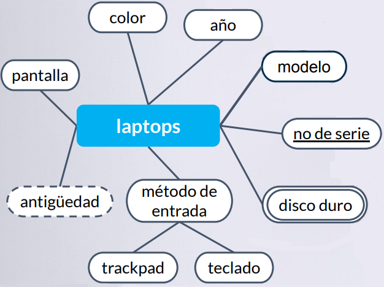

Los atributos son las características o propiedades de una entidad. Cada uno de los elementos de la entidad poseen los mismos atributos y a cada atributo se le asigna un valor único por cada elemento.

**Tipos de atributos**

- **Atributos compuestos:** es un atributo que se puede subdividir en otros.
- **Atributos simples:** es aquel atributo que no se puede subdividir.
- **Atributos de un solo valor:** son los que pueden tener un único valor.
- **Atributos multivaluados:** son aquellos que pueden tener muchos valores.
- **Atributo derivado:** es aquel que se puede deducir de otro/s atributos/s mediante un algoritmo. Puesto que se puede calcular, no se guarda en la base de datos.
- **Dominio de un atributo:** es el conjunto de los posibles valores que ese atributo puede poseer.
- **Valor nulo de los atributos:** los atributos de una entidad-instancia pueden no tener ningún valor para algún atributo concreto. En estos casos, también se dice que el atributo tiene valor nulo.

**Atributos llaves**

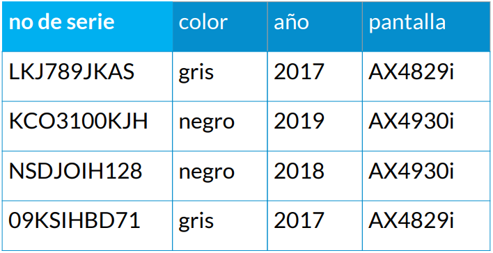

Es un campo o una combinación de campos que identifica de forma única a cada fila de una tabla. Pueden ser:

- **Naturales:** son inherentes al objeto como el número de serie
- **Artificiales:** no es inherente al objeto y se asigna de manera arbitraria.

**Entidades Fuetes vs Entidades Débiles**

Una entidad fuerte es aquella que no necesita de otra entidad débil para existir. Una entidad débil es aquella que sí que necesita de otra para existir.

Por ejemplo, en una librería lo que realmente vende a los clientes no son libro, sino los ejemplares de ese libro que tiene la librería adquiridas. Las entidades débiles se representan mediante un doble rectángulo; es decir, un rectángulo con doble línea.

Existen dos tipos de dependencias en las entidades débiles:

- **Dependencia por existencia**

  Las ocurrencias de la entidad débil pueden identificarse mediante un atributo identificador clave sin necesidad de identificar la entidad fuerte relacionada.

  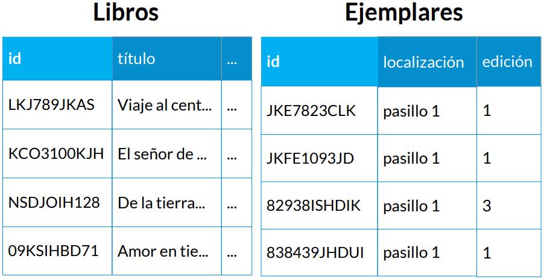

- **Dependencia por identidad**

  La entidad débil no puede ser identificada sin la entidad fuerte relacionada.

  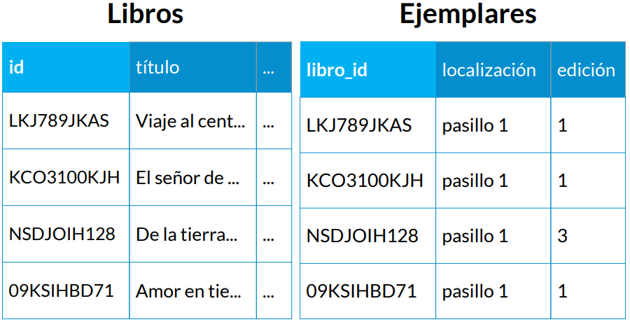

### Clase 4 *Entidades de Platzi Blog*

Empezamos nuestro proyecto, el cual será un manejador de Blogpost.

**¿Por qué un manejador de Blogpost?**

En primer lugar porque la mayoría de nosotros estamos familiarizados con todos los conceptos y con el funcionamiento de un sistema de blogs. Y en segundo lugar, porque este sistema también nos provee de una serie de retos interesantes que vamos a tener que resolver en el curso y que seguramente te vas a encontrar en tu proyecto también, de esta manera vamos a ir poco a poco librando estos obstáculos y llegando a un resultado final coherente para que tú lo puedas hacer de igual manera con tu proyecto.

**Primer paso**

Debemos identificar las entidades.

- Posts
- Usuarios
- Comentarios
- Categorías

**Segundo paso**

Debemos pensar en los atributos. De hecho es inseparable pensar en los atributos y las entidades debido a que cuando se piensa en un objeto generalmente se nos viene a la cabeza lo que lo hace diferente o lo que lo hace un objeto.

- Posts:
  - Id
  - Título
  - Fecha de publicación
  - Contenido
  - Estatus
  - Etiquetas

- Usuarios
	- Id
	- Login
	- Password
	- Nickname
	- Email

- Comentarios
	- Id
	- Cuerpo del comentario

- Categorías
	- Id
	- Nombre de la categoría

### Clase 5 *Relaciones*

Las relaciones es la manera en que empezamos a ligar las diferentes entidades u objetos. Se representan mediante rombos y, por convención, se definen a través de verbos.

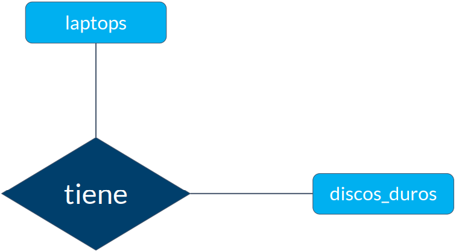

**Cardinalidad**

La cardinalidad es una restricción en una relación que especifica el número de instancias de entidad que una entidad específica puede estar relacionada a través de la relación

**Tipos de cardinalidad**

- **Cardinalidad: 1 a 1**

  En una relación de uno a uno, un registro de una tabla se asocia a uno y solo un registro de otra tabla. Por ejemplo, una persona solo puede tener un dato de contacto y un dato de contacto solo puede pertenecerle a una persona.

  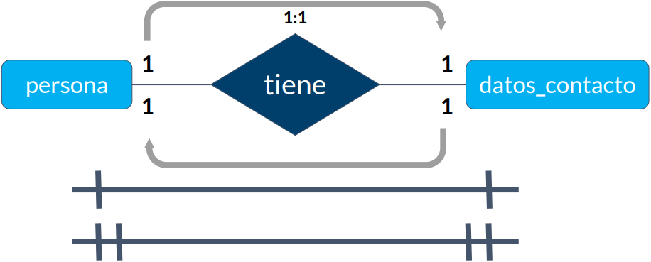

- **Cardinalidad: 0 a 1**

  Es una relación un opcional a uno, un registro de una tabla puede estar asociado a un solo registro de otra tabla. Por ejemplo, una sesión actual tiene un usuario pero un usuario no necesariamente puede estar en una sesión.

  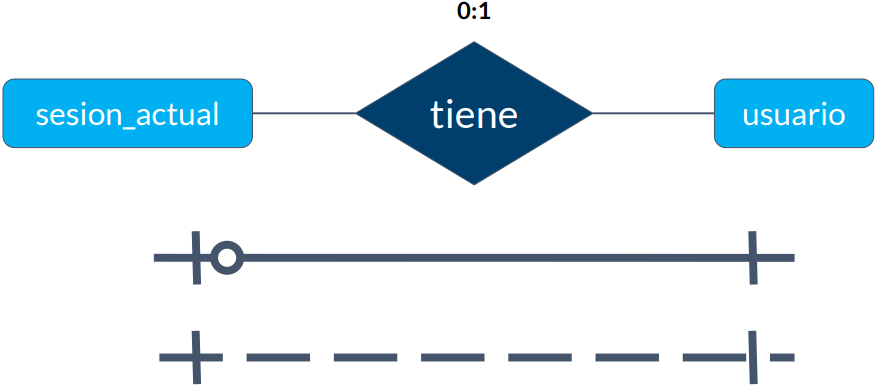

- **Cardinalidad: 1 a N**

  En una relación de uno a muchos, un registro de una tabla se puede asociar a uno o varios registros de otra tabla. Por ejemplo, una persona puede tener varios automóviles pero el automóvil solo le pertenece a una sola persona.

  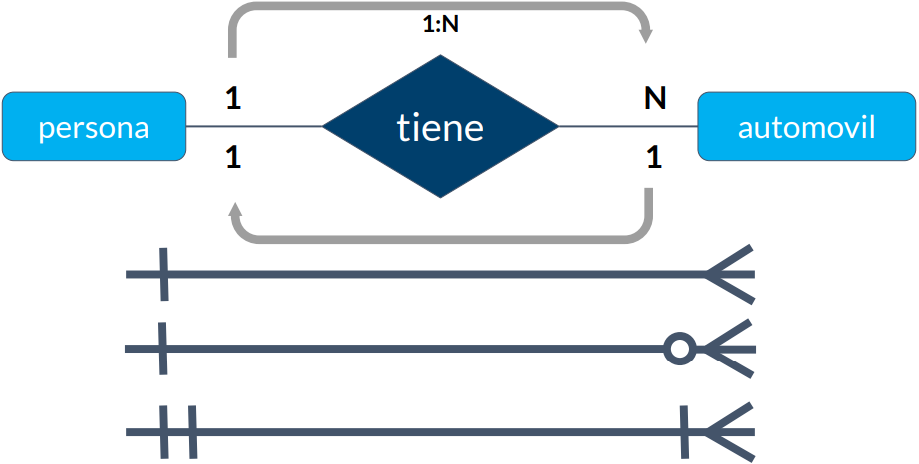

- **Cardinalidad: 0 a N**

  Es una relación un opcional a muchos, varios registros de una tabla puede estar asociado a uno o varios registros de otra tabla. Por ejemplo, un paciente pertenece a una habitación pero una habitación puede estar vacía o tener varios pacientes.

  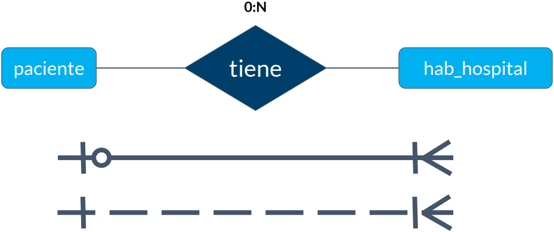

- **Cardinalidad: N a N**

  Esta relación la estaremos viendo en la siguiente clase.

### Clase 6 *Múltiples muchos*

Una relación de muchos a muchos se produce cuando varios registros de una tabla se asocian a varios registros de otra tabla. Por ejemplo, existe una relación de muchos a muchos entre los alumnos y las clases: los alumnos pueden pertenecer a varias clases y las clases pueden pertenecer a varios alumnos.

Por lo general, los sistemas de bases de datos relacionales no permiten implementar una relación directa de muchos a muchos entre dos tablas. Tenga en cuenta el ejemplo de seguimiento de facturas. Si había muchas facturas con el mismo número de factura y uno de sus clientes preguntó acerca de ese número de factura, no sabría a qué número se refería. Este es el motivo por el que se debe asignar un valor exclusivo a cada factura.

Para evitar este problema, puede dividir la relación de muchos a muchos en dos relaciones de uno a muchos mediante el uso de una tercera tabla denominada tabla de unión. Cada registro de una tabla de unión incluye un campo de coincidencia que contiene el valor de las claves principales de las dos tablas que se unen. En la tabla de unión, estos campos de coincidencia son claves externas. Estos campos de clave externa se rellenan con datos, ya que los registros de la tabla de unión se crean desde cualquiera de las tablas que se unen.

Siguiendo con el ejemplo de alumnos y clases, se incluye una tabla Alumnos, que contiene un registro para cada estudiante, y una tabla Clases, que contiene un registro para cada clase. Una tabla de unión, Matrículas, crea una relación de uno a muchos, una entre cada una de las dos tablas.

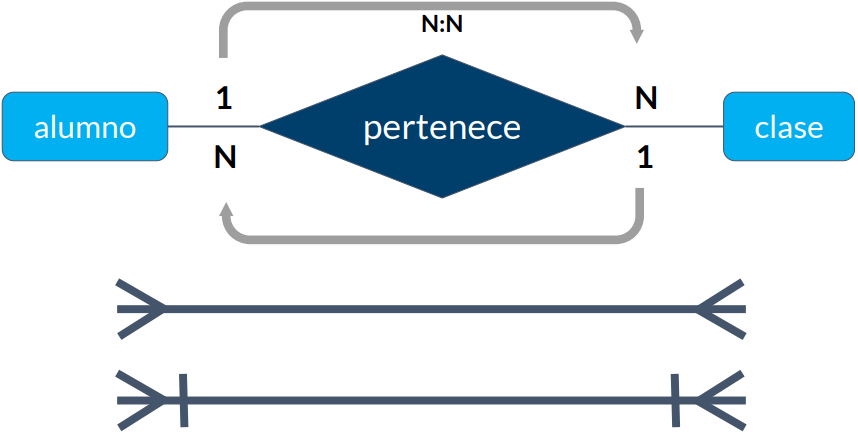

### Clase 7 *Diagrama ER*

Un diagrama entidad-relación es una herramienta para el modelado de datos que permite representar las entidades relevantes de un sistema de información así como sus interrelaciones y propiedades. Este modelo representa a la realidad a través de un esquema gráfico que ilustra cómo las entidades se relacionan entre sí dentro de un sistema. Son un reflejo de la estructura gramatical y emplean entidades como sustantivos y relaciones como verbos.

### Clase 8 *Diagrama Físico: tipos de datos y constraints*

Antes de llevar todo a la práctica debemos convertir nuestro diagrama a uno físico.

El diagrama físico representa como se construirá el modelo en la base de datos. Un modelo de base de datos física muestra todas las estructuras de tabla, incluidos el nombre de columna, el tipo de datos de columna, las restricciones de columna, la clave principal, la clave externa y las relaciones entre las tablas.

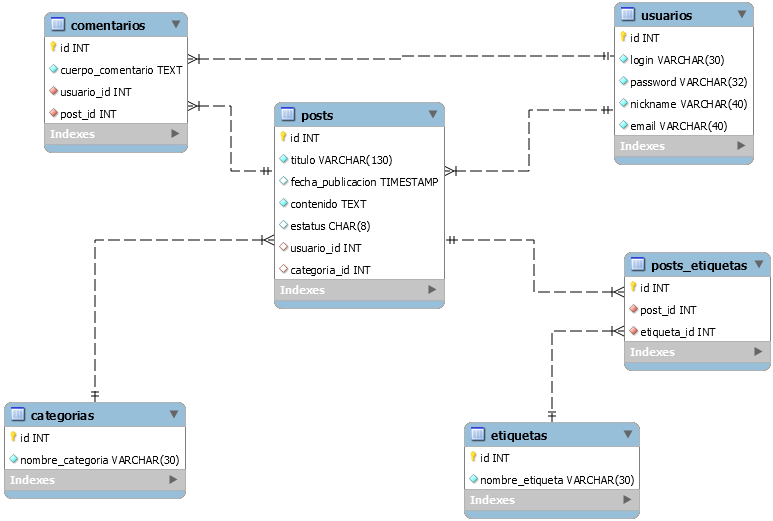

**Tipos de datos**

- **Texto**
  - **CHAR(n):** almacena datos de carácter en un campo de longitud fija. Los datos pueden ser una serie de letras, números y otros caracteres de un solo byte o varios bytes que pueden ser utilizados por el juego de códigos del entorno local de la base de datos.
  - **VARCHAR(n):** almacena series de caracteres de hasta 255 bytes en un campo de longitud variable. Los datos pueden consistir en letras, números y símbolos. CHARACTER VARYING se maneja exactamente igual que el tipo de datos VARCHAR.
  - **TEXT:** almacena cualquier clase de datos de texto. Las columnas TEXT suelen almacenar memorándums, capítulos de manuales, documentos comerciales, archivos de origen de programas y otros tipos de información de texto.
- **Número**
  - **INT o INTERGER:** almacena números enteros grandes. Un entero grande es un entero binario con una precisión de 31 bits. El rango oscila entre -2147483648 y +2147483647.
  - **BIGINT:** enteros muy grandes. Un entero muy grande es un entero binario con una precisión de 63 bits. El rango de los enteros muy grandes oscila entre -9223372036854775808 y +9223372036854775807.
  - **SMALLINT:** enteros pequeños. Un entero pequeño es un entero binario con una precisión de 15 bits. El rango oscila entre -32768 y +32767.
  - **DECIMAL(n, s):** permite almacenar números decimales empaquetados con una coma decimal implícita. La posición de la coma decimal la determinan la precisión y la escala del número. La escala, que es el número de dígitos en la parte de la fracción del número, no puede ser negativa ni mayor que la precisión. La precisión máxima es de 31 dígitos.
  - **NUMERIC(n, s):** sinónimo de decimal.
- **Fecha/hora**
	- **DATE:** almacena fechas, un valor de tres partes que representa un año, mes y día.
	- **TIME:** almacena horas, un valor de tres partes que representa las horas, minutos y segundos.
	- **DATETIME:** almacena una fecha del calendario combinada con las horas del día.
	- **TIMESTAMP:** una indicación de fecha y hora es un valor de siete partes que representa una fecha y hora mediante año, mes, día, hora, minuto, segundo y microsegundo.
- **Lógicos**
	- **BOOLEAN:** un campo puede almacenar true, false y null. El tipo de dato booleano no es SQL estándar.

**Constraints (Restricciones)**

- **NOT NULL:** Se asegura que la columna no tenga valores nulos.
- **UNIQUE:** Se asegura que cada valor en la columna no se repita.
- **PRIMARY KEY:** Es una combinación de NOT NULL y UNIQUE.
- **FOREIGN KEY:** Identifica de manera única una tupla en otra tabla.
- **CHECK:** Se asegura que el valor en la columna cumpla una condición dada.
- **DEFAULT:** Coloca un valor por defecto cuando no hay un valor especificado.
- **INDEX:** Se crea por columna para permitir búsquedas más rápidas.

### Clase 9 *Diagrama Físico: normalización*

El proceso de normalización de una base de datos relacional consiste en aplicar una serie de reglas para evitar a futuro realizar queries, o consultas innecesariamente complejas. En otras palabras están enfocadas en eliminar redundancias e inconsistencias de dependencia en el diseño de las tablas.

Las bases de datos se normalizan para:

- Evitar la redundancia de datos
- Proteger la integridad de los datos
- Evitar problemas de actualización de los datos en las tablas

Para poder decir que nuestra base de datos está normalizada deben respetarse 4 niveles de normalización.

Suponiendo que tenemos esta tabla que deseamos normalizar:

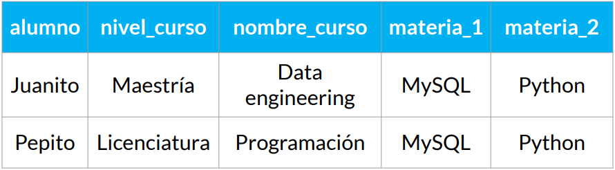

**Primera Forma Norma (1FN)**

Atributos atómicos, es decir, sin campos repetidos.

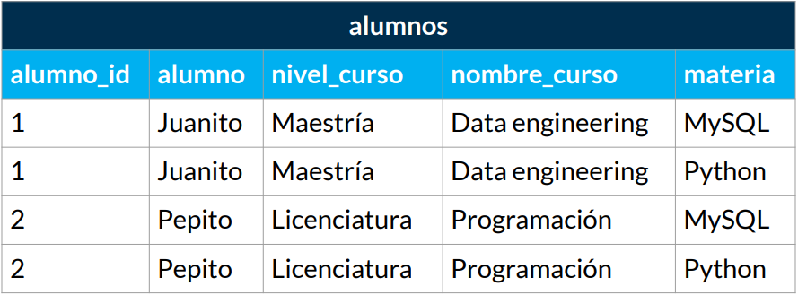

**Segunda forma normal (2FN)**

Cumple 1FN y cada campo de la tabla debe depender de una clave única.

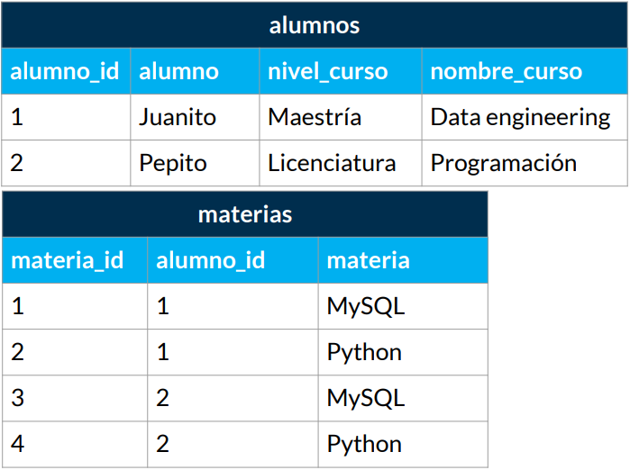

**Tercera forma normal (3FN)**

Cumple con 1FN y 2FN, y los campos que NO son claves NO deben tener dependencias.

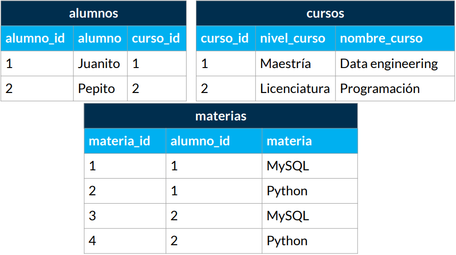

**Cuarta forma normal (4FN)**

Cumple 1FN, 2FN, 3FN, y los campos multivaluados se identifican por una clave única.

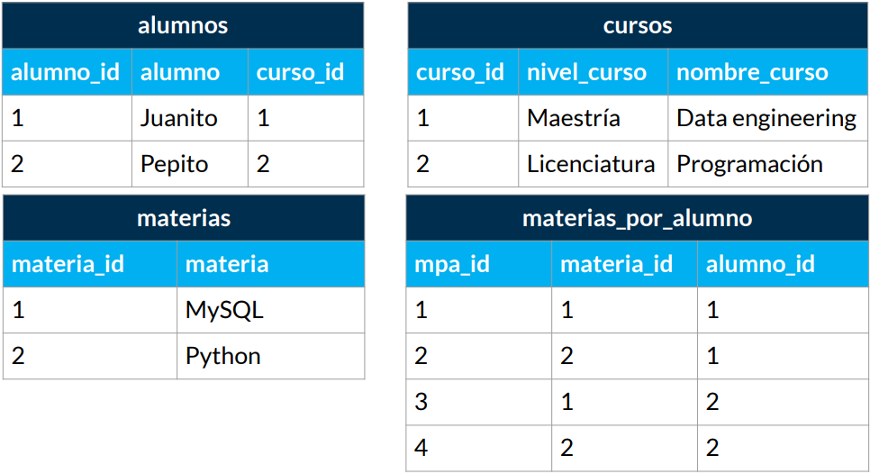

### Clase 10 *Diagrama Físico: normalizando Platziblog*

Ya que aprendimos a normalizar es hora de que lo apliquemos en nuestro proyecto de Platziblog.

**Diagrama Lógico**

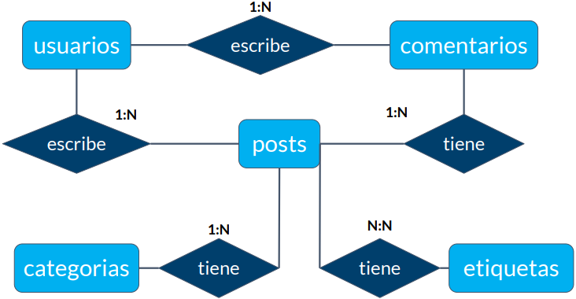

**Diagrama Físico**

1. Generamos los campos de las diferentes entidades e identificamos las claves primarias y secundarias

  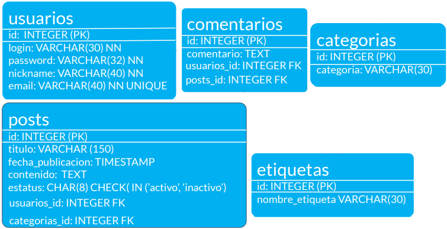

2. Relacionamos las entidades

  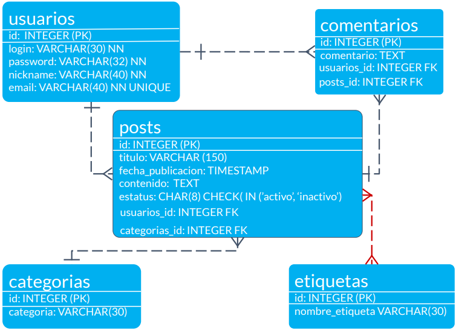

3. Si tenemos una relación muchos a muchos, como posts con etiquetas, debemos romper la relación y poner una tabla intermedia con las claves de unión entre ambas entidades.

  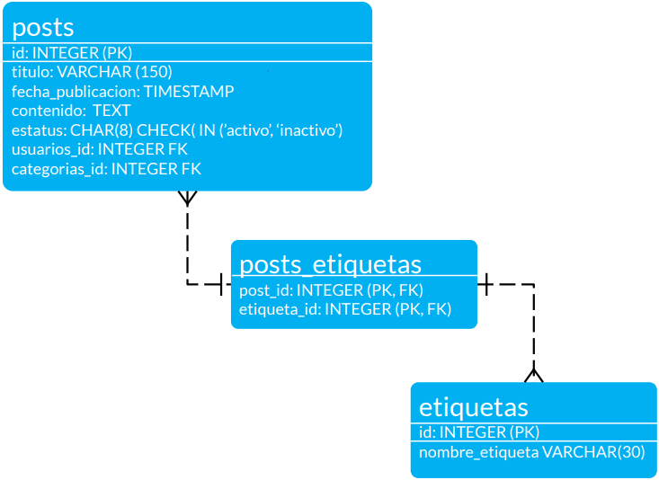

### Clase 11 *Formas normales en DB relacionales*

La normalización en las bases de datos relacionales es uno de esos temas que, por un lado es sumamente importante y por el otro suena algo esotérico. Vamos a tratar de entender las formas normales (FN) de una manera simple para que puedas aplicarlas en tus proyectos profesionales.

**Primera Forma Normal (1FN)**

Esta FN nos ayuda a eliminar los valores repetidos y no atómicos dentro de una base de datos.

Formalmente, una tabla está en primera forma normal si:

- Todos los atributos son atómicos. Un atributo es atómico si los elementos del dominio son simples e indivisibles.
- No debe existir variación en el número de columnas.
- Los campos no clave deben identificarse por la clave (dependencia funcional).
- Debe existir una independencia del orden tanto de las filas como de las columnas; es decir, si los datos cambian de orden no deben cambiar sus significados.

Se traduce básicamente a que si tenemos campos compuestos como por ejemplo “nombre_completo” que en realidad contiene varios datos distintos, en este caso podría ser “nombre”, “apellido_paterno”, “apellido_materno”, etc.

También debemos asegurarnos que las columnas son las mismas para todos los registros, que no haya registros con columnas de más o de menos.

Todos los campos que no se consideran clave deben depender de manera única por el o los campos que si son clave.

Los campos deben ser tales que si reordenamos los registros o reordenamos las columnas, cada dato no pierda el significado.

**Segunda Forma Normal (2FN)**

Esta FN nos ayuda a diferenciar los datos en diversas entidades.

Formalmente, una tabla está en segunda forma normal si:

- Está en 1FN
- Sí los atributos que no forman parte de ninguna clave dependen de forma completa de la clave principal. Es decir, que no existen dependencias parciales.
- Todos los atributos que no son clave principal deben depender únicamente de la clave principal.

Lo anterior quiere decir que sí tenemos datos que pertenecen a diversas entidades, cada entidad debe tener un campo clave separado. Por ejemplo:

En la tabla anterior tenemos por lo menos dos entidades que debemos separar para que cada uno dependa de manera única de su campo llave o ID. En este caso las entidades son alumnos por un lado y materias por el otro. En el ejemplo anterior, quedaría de la siguiente manera:

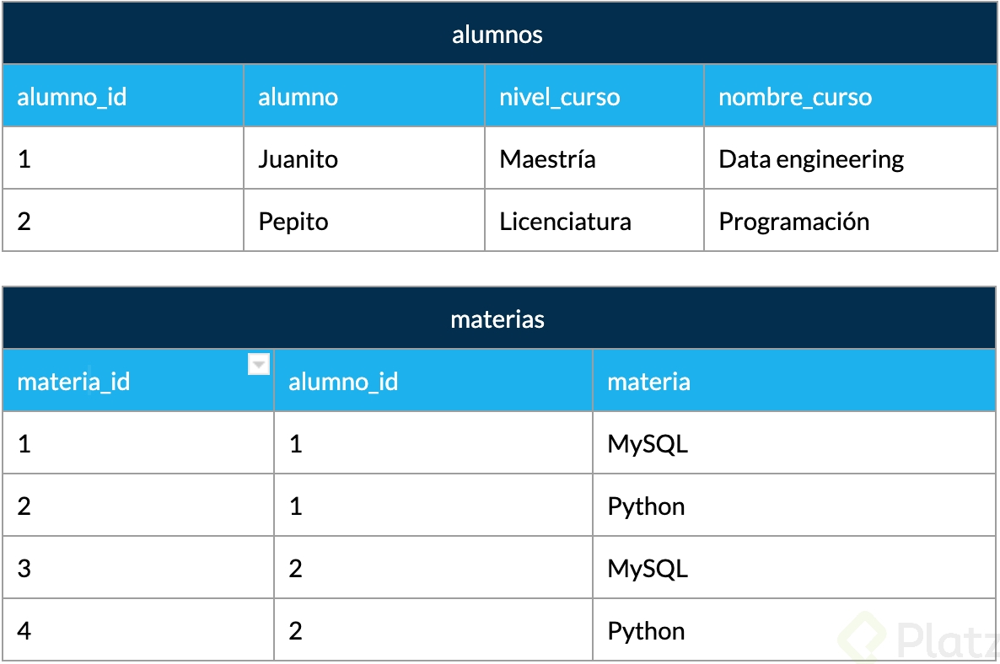

**Tercera Forma Normal (3FN)**

Esta FN nos ayuda a separar conceptualmente las entidades que no son dependientes.

Formalmente, una tabla está en tercera forma normal si:

- Se encuentra en 2FN
- No existe ninguna dependencia funcional transitiva en los atributos que no son clave

Esta FN se traduce en que aquellos datos que no pertenecen a la entidad deben tener una independencia de las demás y debe tener un campo clave propio. Continuando con el ejemplo anterior, al aplicar la 3FN separamos la tabla alumnos ya que contiene datos de los cursos en ella quedando de la siguiente manera.

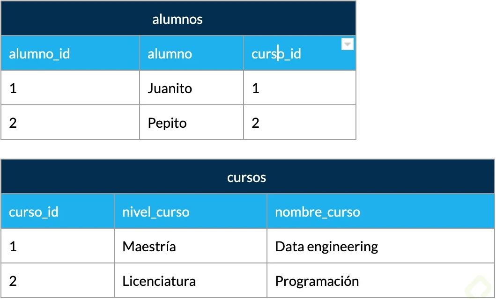

**Cuarta Forma Normal (4FN)**

Esta FN nos trata de atomizar los datos multivaluados de manera que no tengamos datos repetidos entre rows.

Formalmente, una tabla está en cuarta forma normal si:

- Se encuentra en 3FN
- Los campos multivaluados se identifican por una clave única

Esta FN trata de eliminar registros duplicados en una entidad, es decir que cada registro tenga un contenido único y de necesitar repetir la data en los resultados se realiza a través de claves foráneas.

Aplicado al ejemplo anterior la tabla materia se independiza y se relaciona con el alumno a través de una tabla transitiva o pivote, de tal manera que si cambiamos el nombre de la materia solamente hay que cambiarla una vez y se propagara a cualquier referencia que haya de ella.

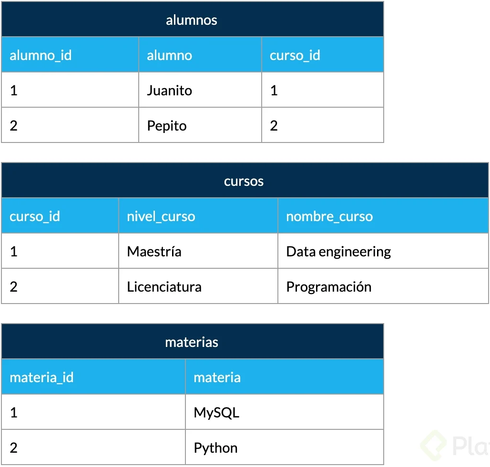

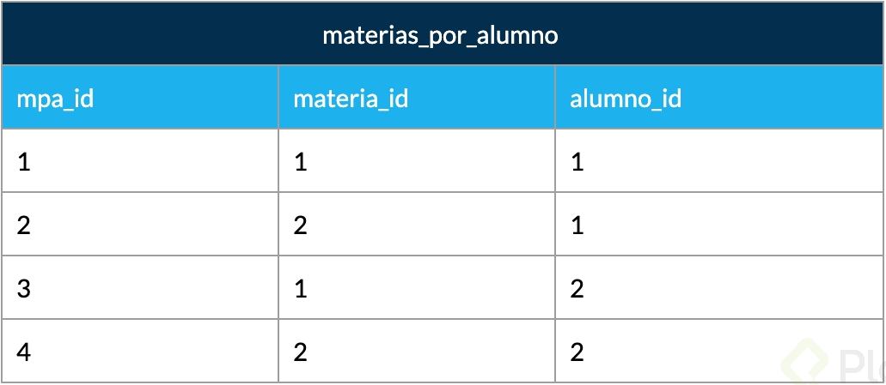

De esta manera, aunque parezca que la información se multiplicó, en realidad la descompusimos o normalizamos de manera que a un sistema le sea fácil de reconocer y mantener la consistencia de los datos.

Algunos autores precisan una 5FN que hace referencia a que después de realizar esta normalización a través de uniones (JOIN) permita regresar a la data original de la cual partió.

## Modulo 3. RDBMS (MySQL) o cómo hacer lo anterior de manera práctica
### Clase 12 *RDB ¿Qué?*

RDBMS (Relational Database Management System o Sistema Gestor de Bases de Datos Relacionales) se trata de software capaz de producir, manipular y gestionar bases de datos de tipo relacional. Es un software que se antepone a los datos de una base de datos, de modo que cualquier acceso a los datos pasa por una petición al RDBMS que éste gestiona a fin de realizar la operación más conveniente sobre esa petición. Los sistemas de base de datos relacionales son aquellos que almacenan y administran de manera lógica los datos en forma de tablas.

Hay diferentes tipos de manejadores de base de datos relaciones como Oracle, MySQL o PostgreSQL. Todos son muy parecidas, porque internamente manejan el mismo lenguaje, pero cada una tiene un estilo diferente.

### Clase 13 *Instalación local de un RDBMS (Windows)*

Hay dos maneras de acceder a manejadores de bases de datos:
- Instalar en máquina local un administrador de bases relacional (recomendada si comienzas a experimentar y hacer ejercicios).
- Tener ambientes de desarrollo especiales o servicios cloud (usada en empresas).

En este curso usaremos MySQL porque tiene un impacto histórico siendo muy utilizado y además es software libre y gratuito. La versión 5.6.43 es compatible con la mayoría de aplicaciones y frameworks.
- Root es el usuario principal que tendrá todos los permisos y por lo tanto en ambientes de producción hay que tener mucho cuidado al configurarlo.

**Instalación**

Primero vamos a la página de descargas: https://dev.mysql.com/downloads/windows/installer/5.6.html

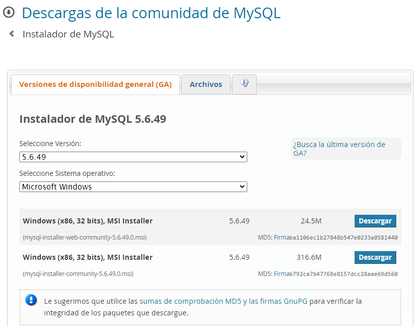

Es un instalador que tiene varias herramientas que nos ayudaran a hacer más visual las operaciones con la base de datos, como los conectores.

Tenemos un panel en la que podemos seleccionar la versión de la base de datos (nosotros elegimos la 5.6), otro panel en donde elegimos el sistema operativo (Microsoft Windows) y tenemos dos opciones de instaladores: uno es el instalador de versión web y otro el instalador completo. El instalador web nos baja un instalador muy pequeño y cada que queramos instalar algo va nuevamente a la web para instalarlo, y el instalador completo trae todo para ahorrarnos la parte tediosa de descargar e instalar.

Damos click a Download y nos envía a otra página. Pequeño tic: MySQL busca que te registres, no te cobra nada pero sirve para pertenecer a la comunidad por lo que primero que te resaltan son los botones de Login y Sign Up, pero hasta abajo esta un pequeño link de 'no gracias, solo quiero la descarga', damos click y nos descarga.

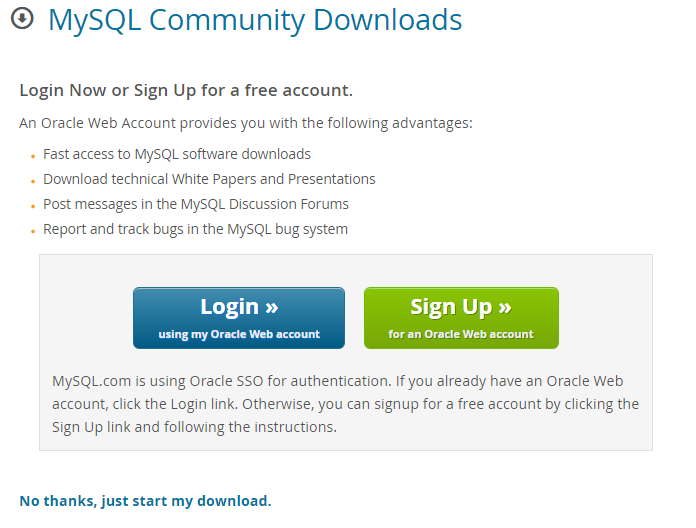

Vamos a la carpeta donde está el instalador descargado, damos doble click o click derecho y ejecutar como administrador para que comience la instalación. El programa nos va a pedir algunos permisos, probablemente porque va hacer cambios al sistema operativo y va a usar recursos de sistema entonces nos pide acceso a permisos especiales:

Decimos si y se instala los componentes:

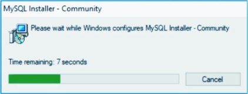

Para continuar nos pide nuevamente permisos, aceptamos, y luego nos abre la ventana del instalador. La primera ventana, como es costumbre, es la licencia bajo el cual se distribuye el programa. Damos click en Aceptar y después Next para continuar:

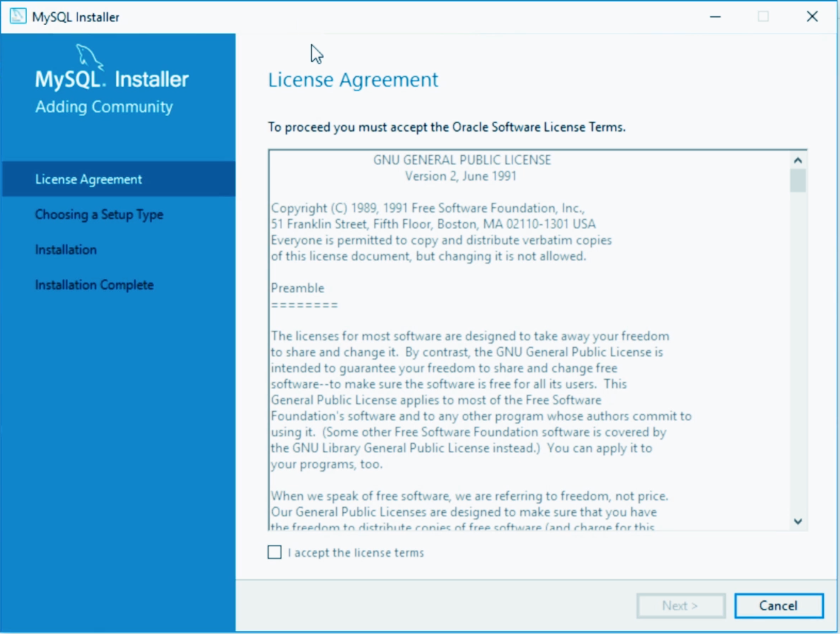

Ahora se nos presenta diferentes tipos de instalación. El primero es una instalación para desarrolladores, el segundo solamente para servidor, el tercero solamente para clientes, el cuarto es completa y el quinto es para hacer nosotros mismos la configuración. Es el último el cual aceptamos porque dentro del paquete existe muchos componentes que no vamos a utilizar, seleccionamos y damos click en Next:

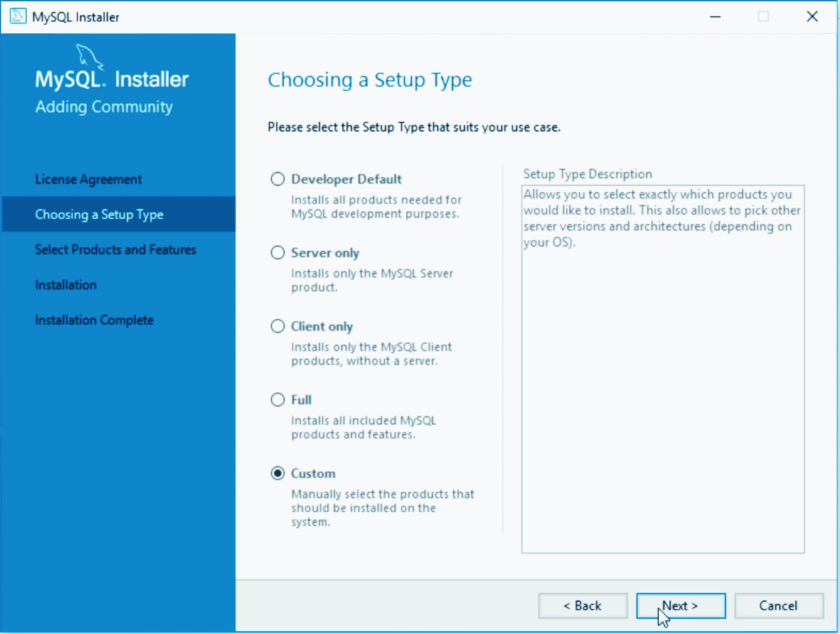

Posteriormente nos apareces las opciones de lo que podemos instalar, tenemos el servidor de MySQL, aplicaciones, conectores que nos ayudara cuando desarrollemos una aplicación para que el lenguaje se comunique con la base de datos, ejemplos y documentación. Lo que instalaremos serán MySQL Server y MySQL Workbrench, seleccionamos y damos click a Next:

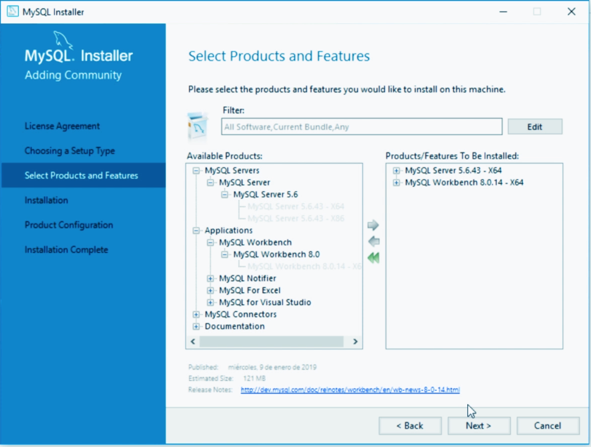

Nos muestra una ventana que nos dice que los dos componentes están listos para la instalación, algunas veces pueden pedir dependencias adicionales sobre todo del framework de Windows para Visual Studio no pasa siempre, pero llega a pedir. En este momento nos indica que está listo para instalar, así que damos click en Ejecutar:

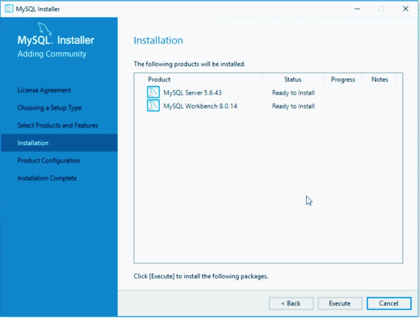

Ya terminado de instalar ambos programas, damos click al botón Next y nos sale una ventaja que notifica que el servidor ya está listo para configurar. Nuevamente damos click en Next:

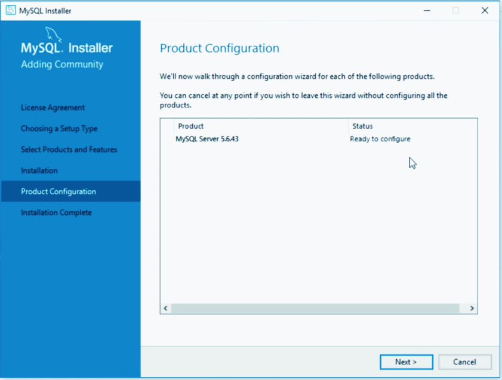

Y nos sale una ventana que nos da la configuración inicial del servidor, esto es una configuración bastante sencilla y lo único que nos pide es saber el tipo de configuración que deseamos (desarrollo, servidor o solamente dedicada a la base de datos). Elegimos una computadora para desarrollo que nos permite hacer experimentos sin ninguna consecuencia, nos indica el puerto en donde será instalado, damos click a Next con las opciones default tenemos suficiente:

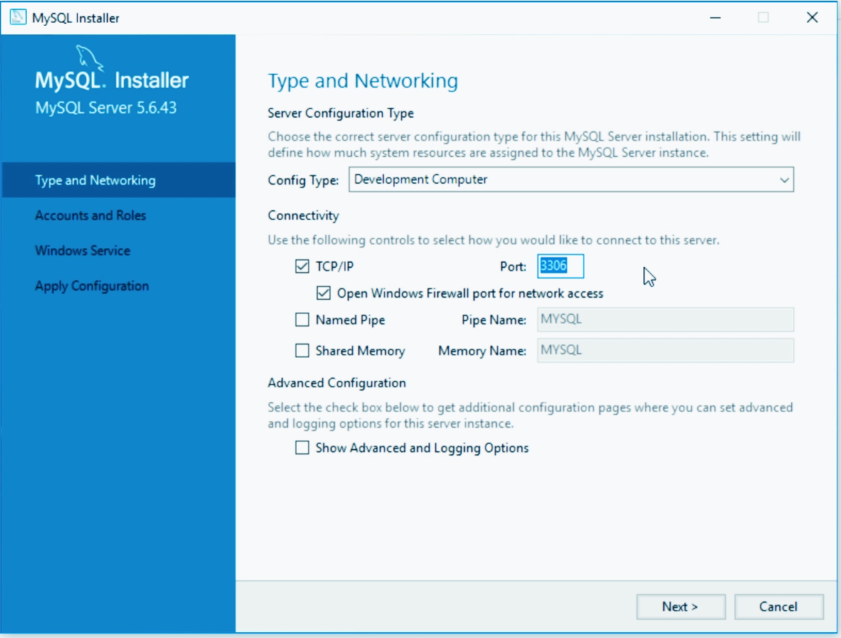

La siguiente ventana nos pide la cuenta o roles. Damos click a la contraseña de Root (root es nuestro usuario principal y tiene todos los permisos, es por el que tenemos que tener más cuidado. En un ambiente de prueba no es nada, pero si en un ambiente de producción porque si alguien hackea este usuario va a tener accesos a todos los datos), ponemos una contraseña -no te olvides porque lo usaran en todo momento-, damos click en Next:

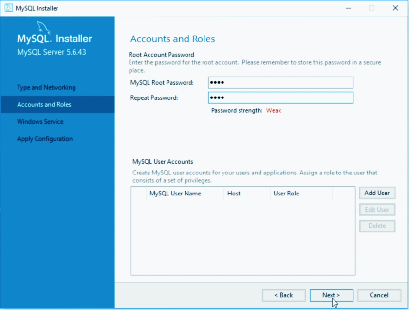

En la siguiente ventana nos pregunta si queremos configurarlo como servicio para que corra en segundo plano dentro de Windows y si deseamos que inicie cada vez que iniciemos la computadora. Elige como lo deseas:

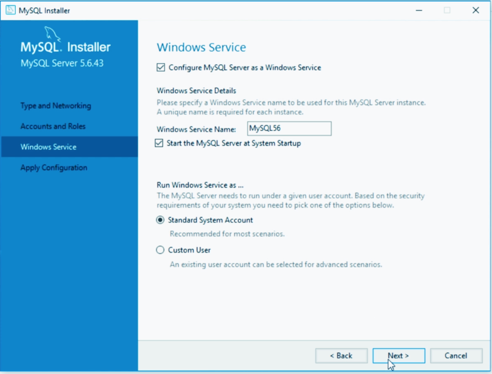

En la proxima ventana tenemos un check list, una lista que nos corre una vez que demos ejecutar para ver los pasos del instalador:

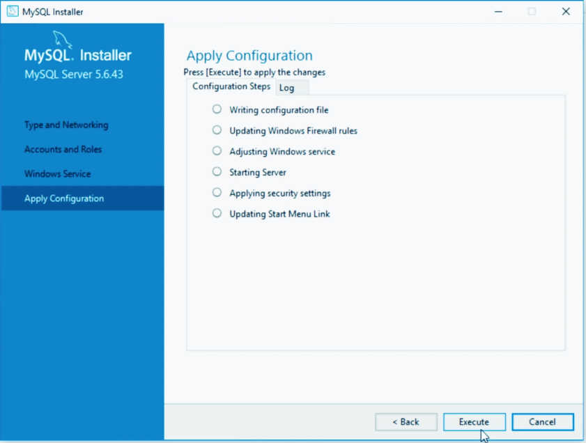

Una vez finalizada, si existio algun error podemos ir a Log y ver lo que debemos corregir. En este caso todo salio bien y damos en Finish:

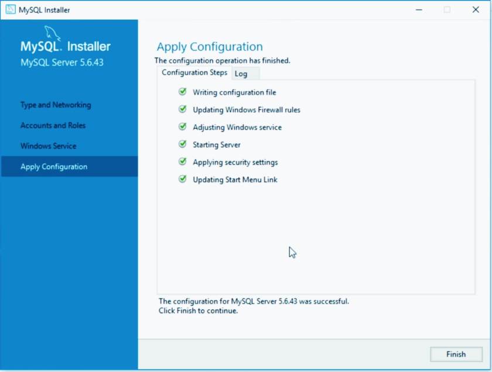

Con la configuración completa volvemos a esta ventana. Damos click en Next:

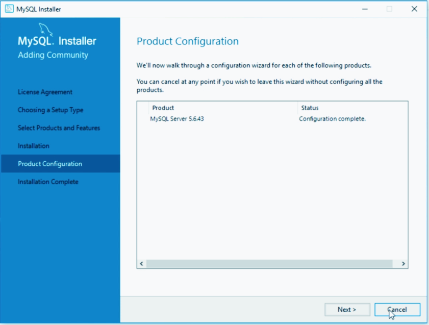

Y nos sale una ventana que nos dice que toda la instalación (tanto servidor como cliente visual) ya está completa. Con esto la instalación finaliza:

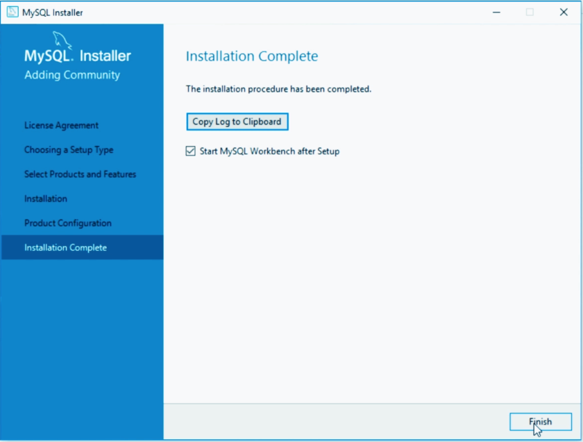

### Clase 14 *Instalación local de un RDBMS (Mac)*

**Instalación de un RDBMS en Mac OS**

Vamos a la página para descargar el servidor de comunidad de MySQL: https://dev.mysql.com/downloads/mysql/5.7.html

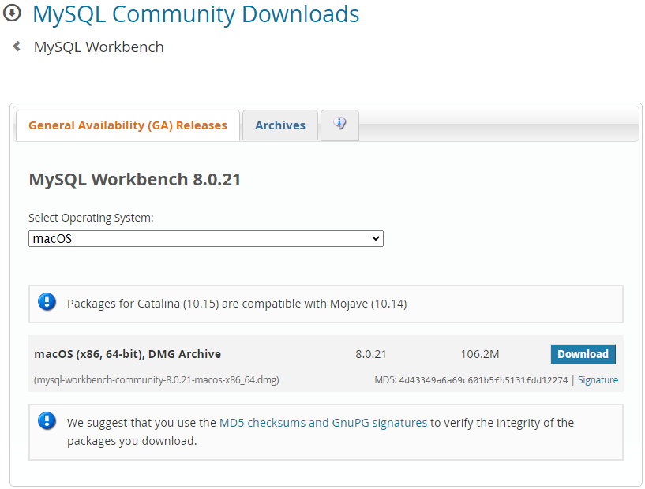

Al igual que la instalación de Windows, nos pide que seamos parte de la comunidad. Damos click en 'no gracias, solo quiero la descarga':

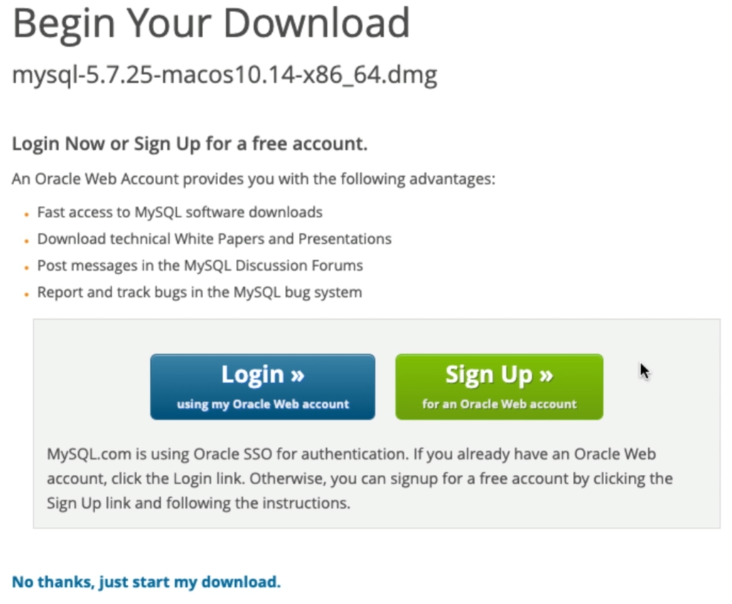

Una vez que termino de descargarse, nos dirigimos a nuestra carpeta de descarga y damos doble click al archivo DMG para iniciar la instalación. Click al archivo pkg y nos abre la pantalla de bienvenida en donde nos da las gracias por escogerlo y nos explica un poco lo que vamos a instalar, damos click al botón continuar:

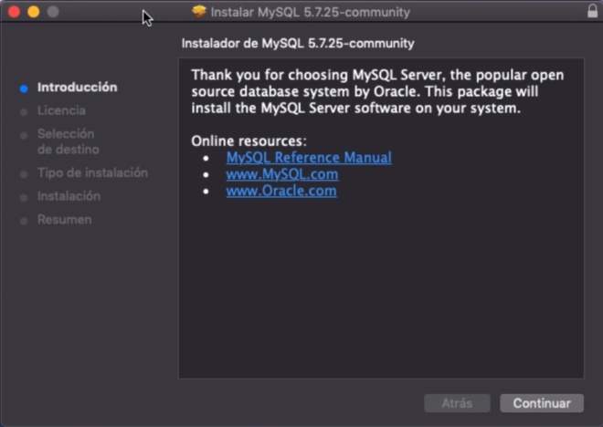

Se nos presenta la licencia. Es una licencia GNU o GPL que es precisamente para código abierto, damos click en continuar:

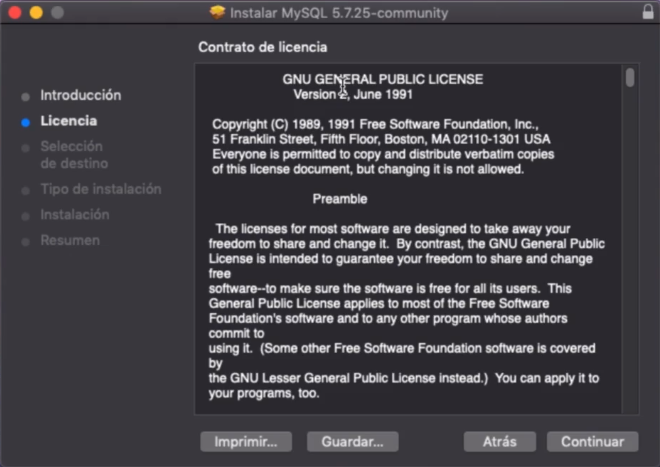

Nos salta una ventana en donde nos pregunta si estamos aceptando la licencia, damos click en acepto:

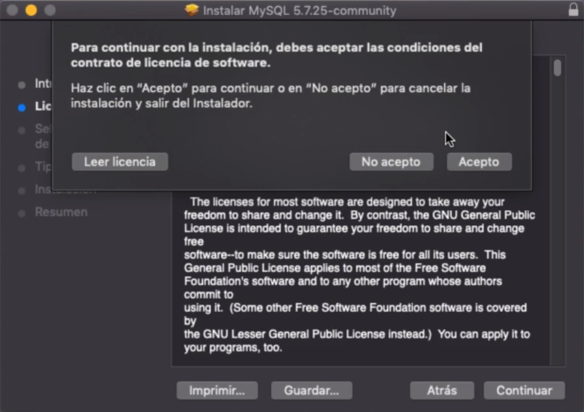

Esta ventana nos indica el espacio que va ocupar y si deseamos cambiar la ubicación de la instalación, en este caso no hacemos nada, y damos continuar:

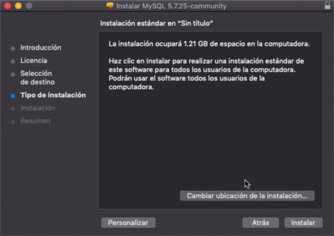

Nos sale una ventana que nos pide la clave de acceso al administrador, si seguiste los pasos del tutorial correctamente no deberías tener ninguna aprensión, este es normalmente el proceso y es un software legítimo. Una vez ingresada la clave del administrador, damos click en instalar software:

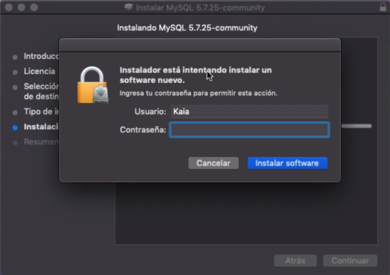

Se empieza a hacer la instalación como tal:

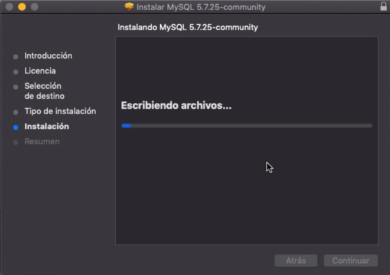

Nuevamente nos pide permiso del sistema, algo de esperarse pues utilizara el disco duro y algunos otros recursos, así que damos click en ok:

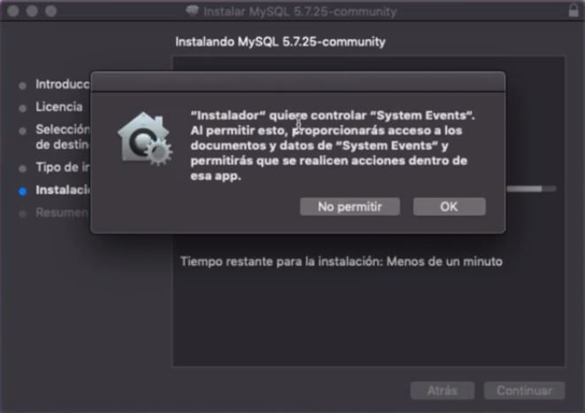

La instalación finaliza con una ventana que nos muestra la contraseña y usuario root, también nos indica que podemos cambiar la contraseña después. Puedes copiar la contraseña para que después puedas acceder a la base de datos, y damos click en ok:

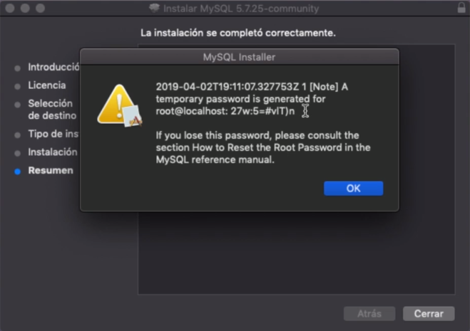

Con esto terminamos de instalar el servidor de MySQL y termina el instalador. Damos click en cerrar:

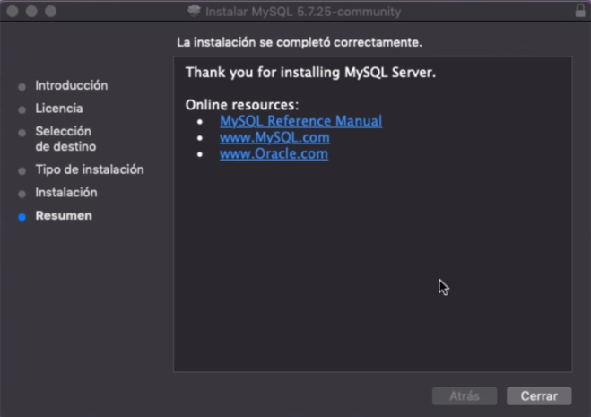

Una última ventana nos pregunta si deseamos conservar el archivo de instalación o directamente lo envias al basurero, das click al que desees realizar:

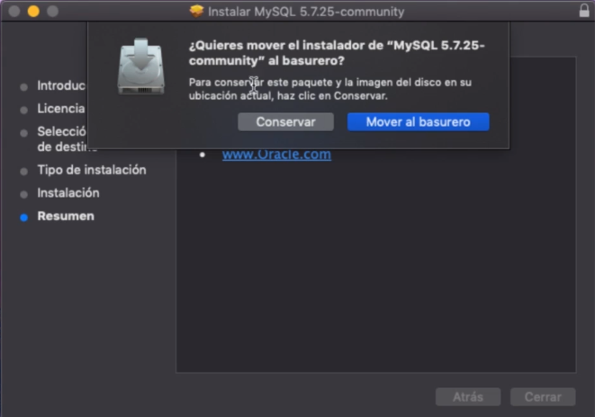

**MySQL Workbench**

Como parte de la instalación, ya tenemos el servidor pero necesitamos algo que se conecte a él y nos permita administrar la base de datos de una forma más visual. Para esto, la misma gente de MySQL que son Oracle nos presenta la herramienta Workbench (en Windows viene todo junto, pero en Mac es diferente) así que bajamos esta herramienta por separado.

Vemos una página muy similar a la anterior, elegimos el sistema operativo y damos click en descargar: https://dev.mysql.com/downloads/workbench/

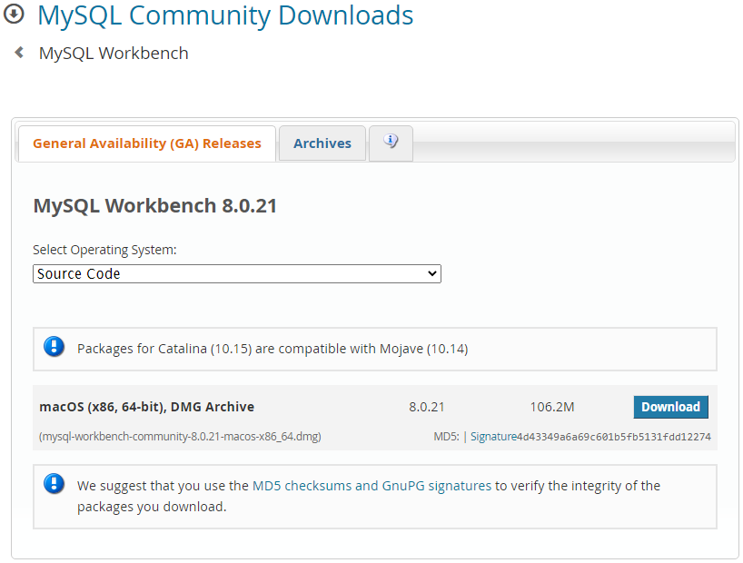

Nos presenta la misma página para registrarnos o iniciar sesión, damos click en 'no gracias, solo quiero la descarga'. Nuevamente nos vamos a la carpeta y damos doble click al instalador, y nos muestra esta ventana de avance que instala todos los componentes del Workbench:

Una vez finalizada nos sale una pantalla en donde lo unico que debemos hacer es dar click al icono del MySQL Workbench y arrastar hasta la carpeta:

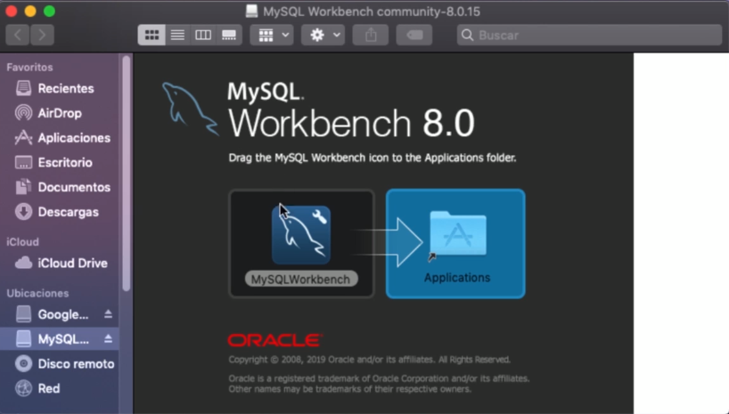

Una vez arrastrado nos sale una pantalla que nos muestra el progreso de copiar la aplicación:

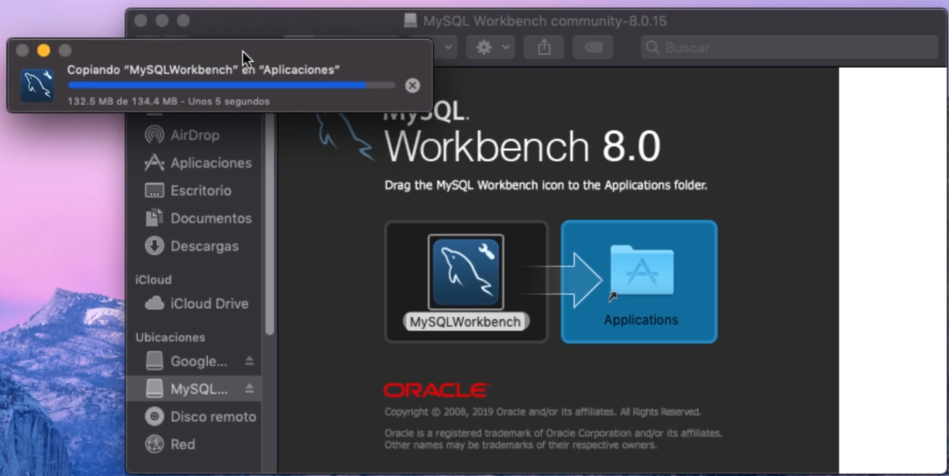

Una vez finalizada, cerramos todo y ya está. Tenemos instalado MySQL en Mac.

**Nota: Es importante guardar la información que te da al instalar el servidor (usuario y contraseña) porque lo ocupamos más adelante cuando deseamos configurar Workbench para conectarse a nuestro servidor de base de datos.**

### Clase 15 *Instalación local de un RDBMS (Ubuntu)*

Visita la dirección de descarga de la versión de comunidad de MySql: https://dev.mysql.com/downloads/mysql/5.7.html#downloads

Dirígete a la sección de selección de descargas y selecciona tu distribución de Linux. En nuestro caso Ubuntu y selecciona posteriormente la versión que estás utilizando actualmente, en nuestro caso 18.04 de 64 bits.

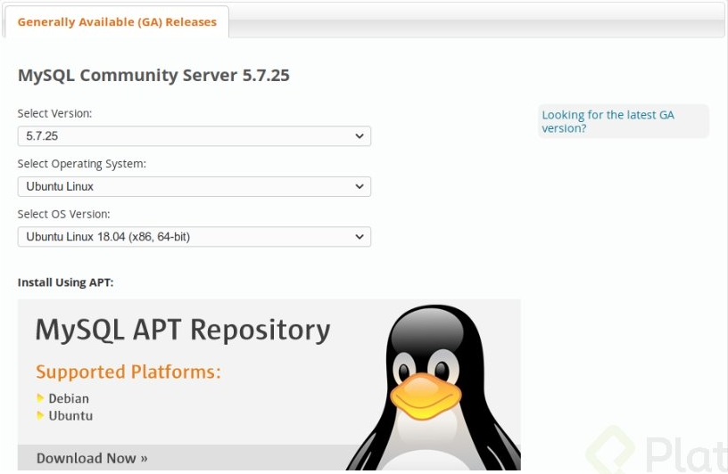

Más abajo encontrarás las diferentes opciones de descarga existen diversos paquetes dependiendo tus necesidades. En el caso del ejemplo usaremos la versión deb bundle. Da click en el botón Download seleccionado.

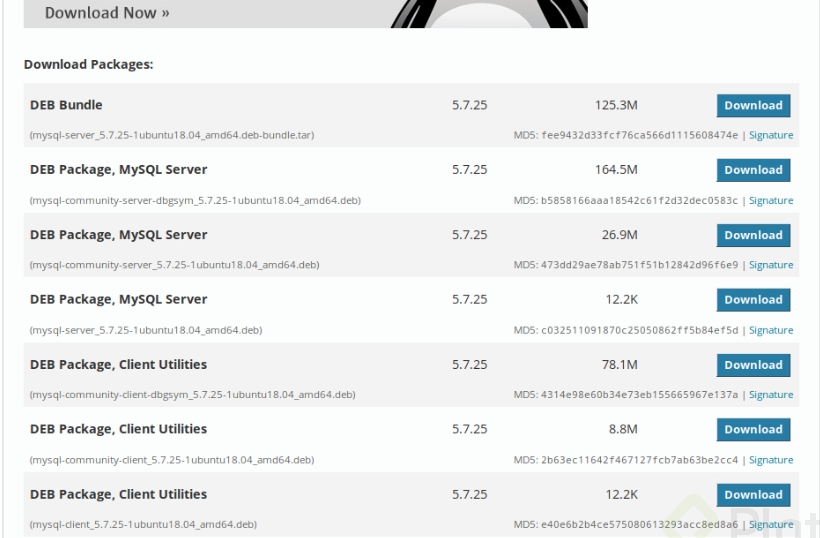

En la siguiente pantalla nos piden que nos registremos o iniciemos sesión, pero ya que solo queremos la descarga daremos click en el link que se encuentre en la parte de abajo.

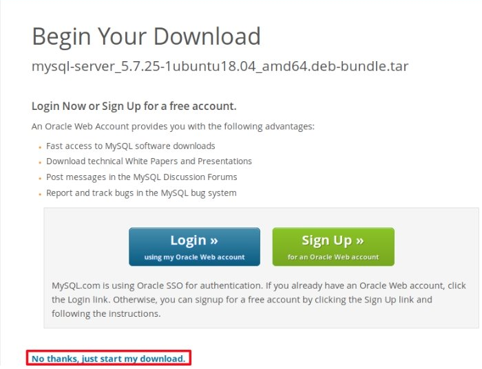

Espera a que la descarga concluya.

Al terminar abre el archivo .tar con el desempaquetador de tu preferencia.

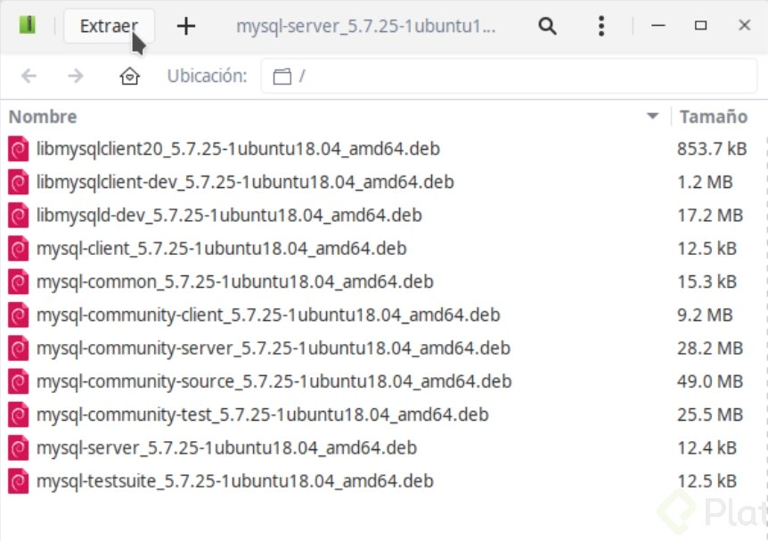

Extrae el contenido en la carpeta de tu preferencia.

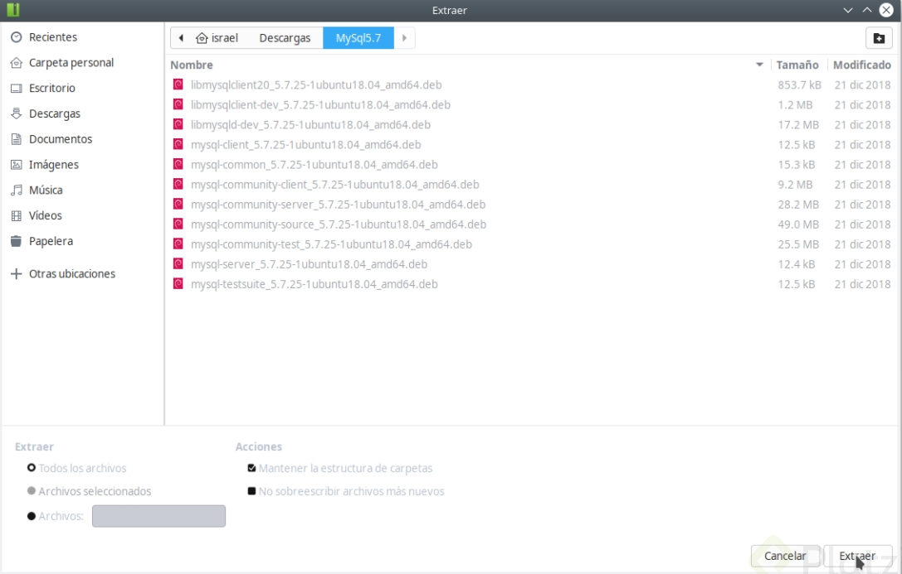

Selecciona el archivo de servidor de comunidad y ábrelo con tu manejador de paquetes instalado.

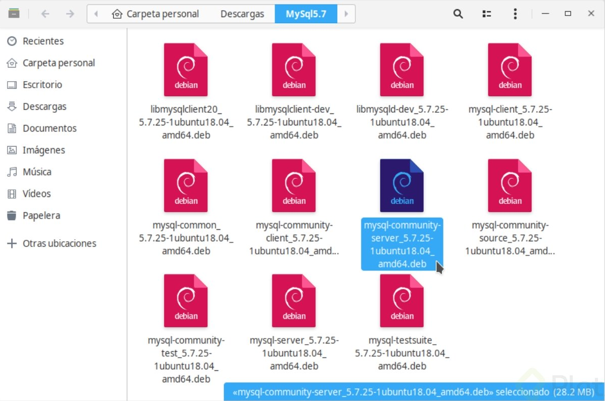

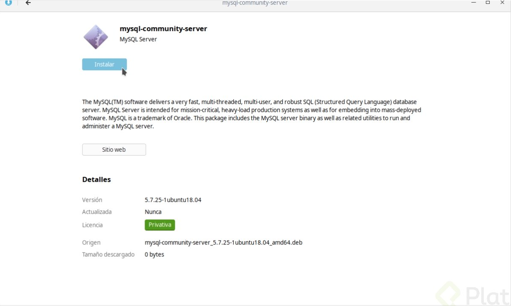

Da click en instalar.

Finalmente puedes ir a la consola o terminal de Ubuntu y escribir el siguiente comando: ***sudo mysql***

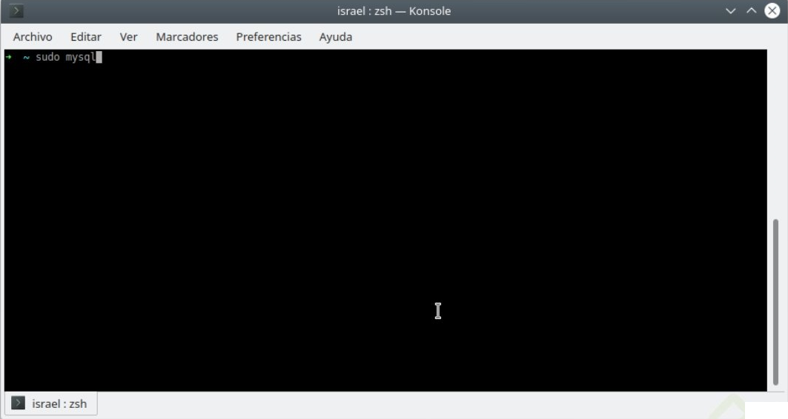

A continuación deberá aparecer una ventana con el prompt de mysql donde ya puedes comenzar a ejecutar los comandos de las lecciones.

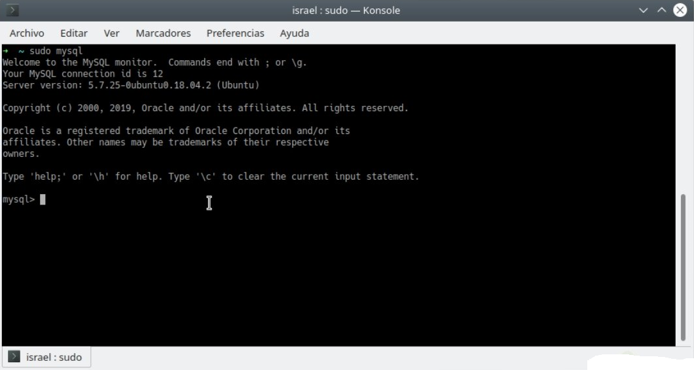

***Nota***

***- Recuerda estar seguro que las dependencias para el paquete se cumplen para instalar.***

***- Muchas veces las distribuciones ya cuentan con paquetes en su repositorio, en ese caso también puedes ejecutar el comando: sudo apt-get install mysql-server***

### Clase 16 *Clientes gráficos*

Como parte de las herramientas que nos da MySQL como desarrolladores tenemos algunas herramientas bastante interesantes, como MySQL Workbench.

**¿Qué es MySQL Workbench?**

Básicamente es un tipo de herramienta llamada «cliente gráfico», el cual es una forma muy gráfica de representar y de ver cómo funciona nuestra base de datos internamente. Y es que la forma de abstraer los datos de base de datos y que nosotros lo podamos entender de una manera más simple.

Este tipo de herramienta nos permite visualizar y modificar los datos, y jugar un poco con la configuración de la base de datos de una forma bastante más amigable.

Existen varias opciones para clientes gráficos y hay algunas, dependiendo del manejador de base de datos que utilices, hay diversas más famosas.

**MySQL Workbench**

Abrimos el programa y nos sale esta pantalla de bienvenida, entre las conexiones tenemos una por default (Local instance MySQL80):

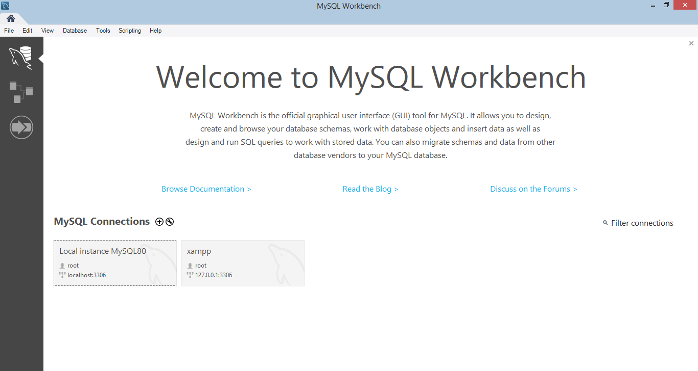

Si queremos agregar una nueva conexión a la base de datos con la configuración que tienes, simplemente das click en el botón de más y nos sale una ventana que nos pide los datos para la conexión:

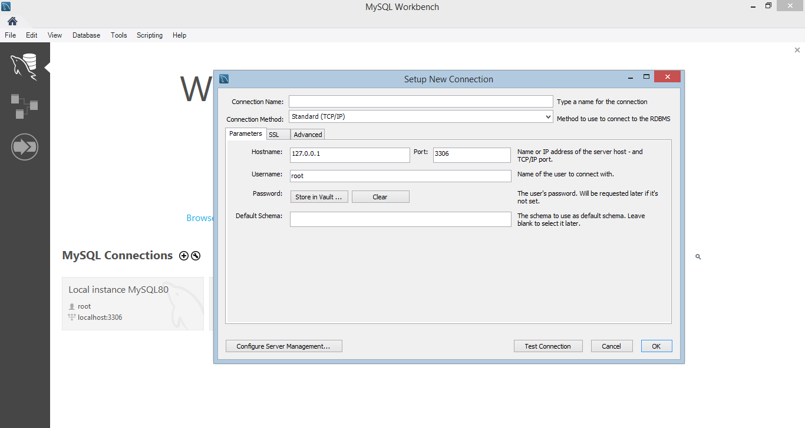

Damos doble click sobre la instancia local para usar el editor visual, antes de poder usarlo nos sale una pantalla que pide la contraseña configurada anteriormente durante la instalación:

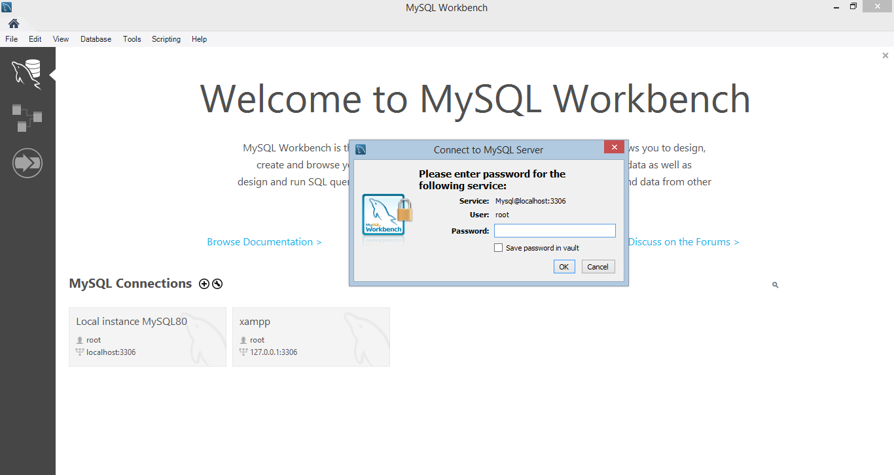

Editor visual

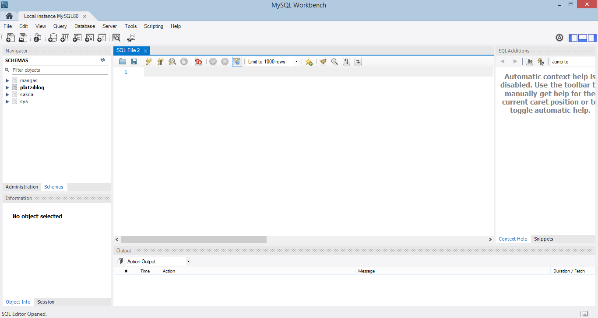

### Clase 17 *Servicios administrados*

Hoy en día muchas empresas ya no tienen instalados en sus servidores los RDBMS sino que los contratan a otras personas. Estos servicios administrados cloud te permiten concentrarte en la base de datos y no en su administración y actualización.

Los servicios vienen en una variedad de sabores, algunos muy famosos como AWS de Amazon, Google Cloud Platform de Google o Azure de Microsoft.

## Modulo 4. SQL hasta en la sopa
### Clase 18 *Historia de SQL*

SQL (Structured Query Language o Lenguaje de Consultas Estructurada) es un lenguaje de programación diseñado para almacenar, manipular y recuperar datos almacenados en bases de datos relacionales.

La primera encarnación de SQL apareció en 1974, cuando un grupo de IBM desarrolló el primer prototipo de una base de datos relacional. Se trataba de hacer consultar a los datos, pero no existía una forma realmente estandarizada de hacerlo, entonces, SQL aparece con el objetivo hacer un solo lenguaje de consulta sin importar que manejador de base datos es utilizada, trata de unificarlo todo y se vuelve un gran estándar.

Fue Relational Software (luego se convirtió en Oracle) quien lanzó la primera base de datos relacional comercial.

Existen estándares para SQL. Sin embargo, el SQL que puede utilizarse en cada uno de las principales RDBMS actuales viene en distintas formas. Esto se debe a dos razones:

1. El estándar SQL es bastante complejo, y no es práctico implementar el estándar completo
2. Cada proveedor de base de datos necesita una forma de diferenciar su producto de otros.

La función para unificar todo se debe a que antes se trataba de consultar archivos de texto y cada compañía tenía su RDBMS, pero no sabía comunicarse entre ellos y el tratar de programarlo llegaba a ser tedioso y desgastante, entonces, se crea el SQL como una manera de manejar mejor esa situación.

Su nombre Structured Query Language se debe a que está estructurado y eso es una de las características más importantes de SQL es su estructura clara y fija.

**NoSQL**

Ahora existen algo llamado NoSQL y mucha gente cree que se refiere a no utilizar SQL, pero no es así.

NoSQL (No only SQL o No solo SQL) está diseñada específicamente para modelos de datos específicos y tienen esquemas flexibles para crear aplicaciones modernas. Las bases de datos NoSQL son ampliamente reconocidas porque son fáciles de desarrollar, por su funcionalidad y el rendimiento a escala.

Algunas de las base de datos NoSQL más reconocidas son:

- MongoDB
- Cassandra
- Neo4j
- BigQuery

### Clase 19 *DDL create*

SQL tiene dos grandes sub lenguajes, el que veremos ahora será:

DDL (Data Definition Language o Lenguaje de Definición de Datos) es un lenguaje proporcionado por el sistema de gestión de base de datos que permite a los programadores de la misma llevar a cabo las tareas de definición de las estructuras que almacenarán los datos así como de los procedimientos o funciones que permitan consultarlos.

Un DDL es un lenguaje de programación para definir una estructura de datos. El término DDL fue introducido por primera vez en relación con el modelo de base de datos CODASYL, donde el esquema de la base de datos ha sido escrito en un lenguaje de descripción de datos que describe los registros, los campos, y "conjuntos" que conforman el usuario modelo de datos. Más tarde fue usado para referirse a un subconjunto de SQL, pero ahora se utiliza en un sentido genérico para referirse a cualquier lenguaje formal para describir datos o estructuras de información, como los esquemas XML.

A diferencia de muchos lenguajes de descripción de datos, SQL utiliza una acción de versos imperativo cuyo efecto es modificar el esquema de la base de datos, añadiendo, cambiando o eliminando las declaraciones se pueden mezclar libremente con otras sentencias SQL, por lo que el DDL no es realmente una lengua independiente. La declaración más común es CREATE TABLE. El lenguaje de consulta SQL, el más difundido entre los gestores de bases de datos, admite las siguientes sentencias de definición: CREATE, DROP y ALTER, cada una de las cuales se puede aplicar a las tablas, vistas, procedimientos almacenados y triggers de la base de datos.

**CREATE**

Sirve para crear una nueva base de datos, tabla, vista, índice, etc.

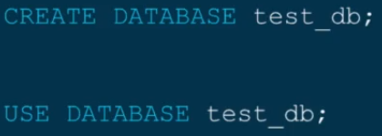

Un comando CREATE común es la de CREATE TABLE (Crear Tabla)

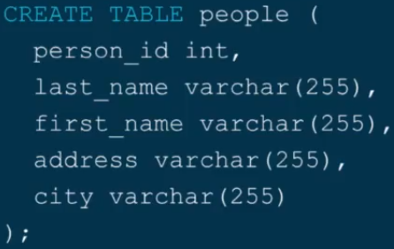

### Clase 20 *CREATE VIEW y DDL ALTER*

**CREATE VIEW**

Un vista es una consulta que se presenta como una tabla (virtual) a partir de un conjunto de tablas en una base de datos relacional.

Las vistas tienen la misma estructura que una tabla: filas y columnas. La única diferencia es que sólo se almacena de ellas la definición, no los datos. Los datos que se recuperan mediante una consulta a una vista se presentarán igual que los de una tabla. De hecho, si no se sabe que se está trabajando con una vista, nada hace suponer que es así. Al igual que sucede con una tabla, se pueden insertar, actualizar, borrar y seleccionar datos en una vista. Aunque siempre es posible seleccionar datos de una vista, en algunas condiciones existen restricciones para realizar el resto de las operaciones sobre vistas.

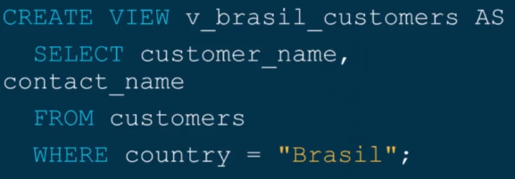

**ALTER**

La sentencia ALTER TABLE es usada para agregar, borrar o modificar columnas en una tabla existente.

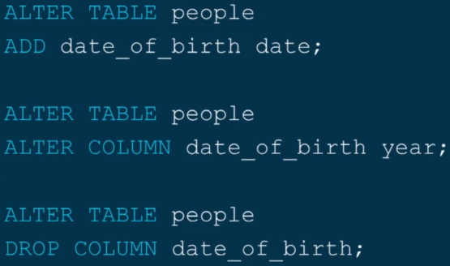

### Clase 21 *DDL drop*

**DROP**

Sirve para borrar en forma sencilla distintos objetos dentro de la base de datos como por ejemplo base de datos, tablas, índices.

Para eliminar una tabla de una base de datos tenemos la sentencia DROP TABLE. Con ella quitamos una o varias definiciones de tabla y todos los datos, índices, desencadenadores, restricciones y especificaciones de permisos que tengan esas tablas. Las vistas o procedimientos almacenados que hagan referencia a la tabla quitada se deben quitar explícitamente con DROP VIEW o DROP PROCEDURE.

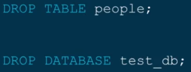

### Clase 22 *DML*

DML (Data Manipulation Language o Lenguaje de Manipulación de Datos) es un lenguaje proporcionado por los sistemas gestores de bases de datos que permite a los usuarios de la misma llevar a cabo las tareas de consulta o modificación de los datos contenidos en las bases de datos.

El lenguaje de manipulación de datos más popular hoy en día es SQL, usado para recuperar y manipular datos en una base de datos relacional. Otros ejemplos de DML son los usados por bases de datos IMS/DL1, CODASYL u otras.

**Sentencias**

- INSERT

	La estructura básica para la sentencia insert utilizando el estándar de SQL es la siguiente:

  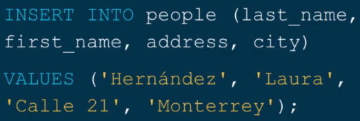

	Tomando como ejemplo si se tuviera una tabla llamada 'people' con los campos de tipo cadena de caracteres (last_name, first_name, address, city), donde se inserta los valores que se encuentran en después de la palabra values, los valores se insertan en el orden correspondiente a como se hizo la llamada de los campos, los valores van separados por comas, las comillas dobles indican que se está insertando datos de tipo cadena de caracteres.

- UPDATE

	Para modificar uno o varios datos de uno o varios registros utilizamos "update" (actualizar).

	Por ejemplo, en nuestra tabla people, queremos cambiar los valores del campo last_name por el valor 'Chávez' y del campo city por 'Mérida', utilizamos la condición "where" para que afecte solamente a ese registro:

  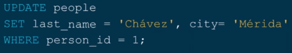

	Utilizamos "update" junto al nombre de la tabla y "set" junto con el campo a modificar y su nuevo valor.

	Otro ejemplo sería:

  

	Esto nos dice que de nuestra tabla people todos los valores del campo first_name serán cambiados a 'Juan', con la condición "where" señalamos a que afecte únicamente a aquellos de la ciudad de Mérida.

	Para que el cambio afecte a todos son registros sin discriminar usamos:

  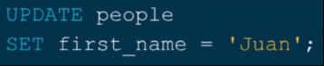

- DELETE

	Para eliminar los registros de una tabla usamos el comando "delete":

  

	La ejecución del comando indicado en la línea anterior borra TODOS los registros de la tabla.

	Si queremos eliminar uno o varios registros debemos indicar cuál o cuáles, para ello utilizamos el comando "delete" junto con la cláusula "where" con la cual establecemos la condición que deben cumplir los registros a borrar. Por ejemplo, queremos eliminar aquel registro cuyo id sea 1:

  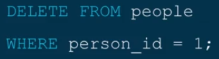

	Si solicitamos el borrado de un registro que no existe, es decir, ningún registro cumple con la condición especificada, no se borrarán registros, pues no encontró registros con ese dato.

- SELECT

	La sintaxis básica de select es la siguiente utilizando el estándar de SQL:

  

	Donde en SELECT ponemos primero las columnas que deseamos consultar y en FROM ponemos el nombre de la tabla que contiene el campo mencionado.

	Si deseamos traer TODOS los registros de una tabla usamos: ***SELECT * FROM people;***

### Clase 23 *¿Qué tan standard es SQL?*

La utilidad más grande de SQL fue unificar la forma en la que pensamos y hacemos preguntas a un repositorio de datos. Ahora que nacen nuevas bases de datos igualmente siguen tomando elementos de SQL.

### Clase 24 *Creando Platziblog: tablas independientes*

1. Creamos la base de datos platziblog
2. Creamos las tablas sin llave foránea:
  - Categoría
  - Etiquetas
  - Usuarios

**Recomendaciones:**

- Una buena práctica es comenzar creando las entidades que no tienen una llave foránea.
- Generalmente en los nombres de bases de datos se evita usar eñes o acentos para evitar problemas en los manejadores de las bases de datos.

### Clase 25 *Creando Platziblog: tablas dependientes*

Ya que creamos nuevas tablas independientes es hora de crear el resto de base de datos, pero debemos tener cuidado en el orden en que son creadas.

1. Creamos la tabla posts
2. La unimos a las tablas categorías y usuarios.

**Nota:**
- El comando "cascade" sirve para que cada que se haga un update en la tabla principal, se refleje también en la tabla en la que estamos creando la relación.

### Clase 26 *Creando Platziblog: tablas transitivas*

1. Creamos la tabla comentarios.
2. Unimos la tabla comentarios con usuario.
3. Creamos la tabla transitiva posts_etiquetas.
4. Unimos la tabla posts_etiquetas con las tablas posts y etiquetas.
5. Hacemos el Reverse Engineer.

**Nota:**

- Las tablas transitivas sirven como puente para unir dos tablas. No tienen contenido semántico.
- Reverse Engineer nos reproduce el esquema del cual nos basamos para crear nuestras tablas. Es útil cuando llegas a un nuevo trabajo y quieres entender cuál fue la mentalidad que tuvieron al momento de crear las bases de datos.

## Modulo 5. Consultas a una base de datos
### Clase 27 *¿Por qué las consultas son tan importantes?*

Las consultas o queries a una base de datos son una parte fundamental ya que esto podría salvar un negocio o empresa.

Alrededor de las consultas a las bases de datos se han creado varias especialidades como ETL o transformación de datos, business intelligence e incluso machine learning.

### Clase 28 *Estructura básica de un Query*

Los queries son la forma en la que estructuramos las preguntas que le vamos hacer a la base de datos. Nos ayuda a transformar una pregunta o duda en sintaxis para sea entendida por la base de datos.

La estructura de un querie puede ser tan simple como quieran y tan compleja como se pueda, hay muchas formas de hacer queries pero vamos a empezar por la estructura más básica y poco a poco subiremos la escala, viendo todas las opciones que tenemos para hacer preguntas cada vez más complejas.

**Estructura Básica**

El query tiene básicamente 2 partes, la sentencia SELECT y la sentencia FROM, en la mayoría de las veces también puedes encontrar una tercera sentencia, WHERE.

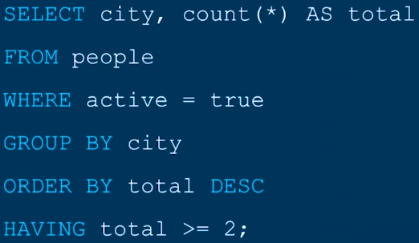

- SELECT: Campos que deseamos obtener.
- FROM: Tabla de donde se extraerá los datos.
- WHERE: Condición que debe cumplir los registros de la tabla seleccionada.
- GROUP BY: Agrupa los campos que tienen el mismo valor.
- ORDER BY: Especifica la orden en que se desea recuperar los datos.
- HAVIGN: Condición que debe cumplir un grupo de registros.

**Ejemplos**

Selecciona todos los campos de la tabla posts:

> SELECT *
>
> FROM posts;

Selecciona todos los campos de la tabla posts, pero únicamente si fueron publicados después del 2024:

> SELECT *
>
> FROM posts
>
> WHERE fecha_publicacion > '2024';

Selecciona todos los campos de la tabla posts, pero únicamente si fueron publicados antes del 2024:

> SELECT *
>
> FROM posts
>
> WHERE fecha_publicacion < '2024';

**NOTA:** El asterisco (*) funciona para seleccionar todos los campos de una tabla.

### Clase 29 *SELECT*

La primera parte de la estructura que necesitamos tener para generar preguntas a una base de datos es la sentencia SELECT.

SELECT se utiliza para recuperar información de la base de datos, y puede proyectar las columnas seleccionadas, es decir, realizar un filtro sobre la tabla o tablas originales y recuperar solamente datos de las columnas filtradas. También puede seleccionar, es decir, filtrar los registros según varios criterios, o realizar uniones, que recopilan datos de diferentes tablas a través de una relación entre ellas.

**Ejemplo**

Trae todos los campos de la tabla posts:

> SELECT *
>
> FROM posts;

Trae los campos seleccionados (título, fecha de publicación y estatus) de la tabla posts:

> SELECT titulo, fecha_publicacion, estatus
>
> FROM posts;

Para renombrar la cabecera de una columna usamos AS:

> SELECT titulo AS encabezado, fecha_publicacion AS publicado_en, estatus AS estado
>
> FROM posts;

Si deseamos saber el número de filas, es decir, la cantidad de registros que tiene una tabla usamos COUNT:

> SELECT COUNT (*)
>
> FROM posts;

También puede ser renombrado por la función AS:

> SELECT COUNT (*) AS numero_posts
>
> FROM posts;

### Clase 30 *FROM*

La segunda parte de la estructura que necesitamos tener para generar preguntas a una base de datos es la sentencia FROM.

**¿Por qué es importante?**

Es una de las sentencias más interesantes y poderosas a la hora de hacer un query, y esto tiene que ver con que FROM indica de donde debemos que traer los datos.

Hasta ahora hemos seleccionado todos los campos de una tabla X, pero la parte interesante viene cuando deseamos unir tablas. En normalización vimos como la información de nuestra base de datos fueron distribuidos en diferentes tablas, pero a la hora de presentar un informe o traer datos que sea valiosa nosotros requerimos volver a juntar nuevamente esa información, como compañero de FROM tenemos a la sentencia JOIN que quiere decir justamente unir o juntar tablas.

**Diagramas de Venn**

Son círculos que se tocan en algún punto para ver dónde está la intersección de conjuntos. Ayudan mucho para poder formular la sentencia JOIN de la manera adecuada dependiendo del query que se quiere hacer.

**Ejemplo:** Supongamos que deseamos extraer ciertos datos de la tabla A y la tabla B, para eso usamos JOIN

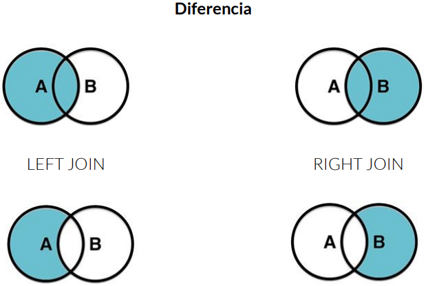

- LEFT JOIN: Si deseamos saber los datos de la tabla A, sin importar que estén o no en la tabla B.
- LEFT JOIN (con condición): Deseamos saber los datos que están únicamente en la tabla A (excluimos a la tabla B).
- RIGHT JOIN: Si deseamos saber los datos de la tabla B, sin importar que estén o no en la tabla A.
- RIGHT JOIN (con condición): Deseamos saber los datos que están únicamente en la tabla B (excluimos a la tabla A).

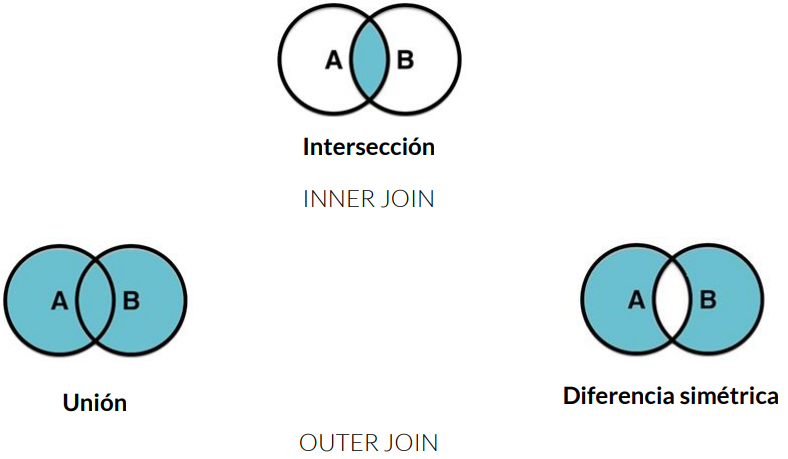

- INNER JOIN: Si deseamos saber únicamente los datos que estén en ambas tablas.
- OUTER JOIN: Si deseamos traer los datos de ambas tablas, sin excepciones.
- OUTER JOIN (con condición): Si deseamos traer los datos que estén en la tabla A o en la tabla B, pero que no compartan relación la una con la otra.

### Clase 31 *Utilizando la sentencia FROM*
1. **LEFT JOIN**

	Trae todos los usuarios sin importar que tengan o no posts asociados, y después vemos los posts asociados a ese usuario.

	> SELECT *
  >
  > FROM usuarios
  >
  >  LEFT JOIN posts ON usuarios.id = posts.usuario_id;

2. **LEFT JOIN (con condición)**

	Trae todos los usuarios que NO tengan posts asociados.

  > SELECT *
  >
  > FROM usuarios
  >
  > LEFT JOIN posts ON usuarios.id = posts.usuario_id
  >
  > WHERE posts.usuario_id IS NULL;

3. **RIGHT JOIN**

	Trae todos los posts sin importar que tengan o no usuarios asociados, y después vemos los usuarios asociados a ese posts.

  > SELECT *
  >
  > FROM usuarios
  >
  > RIGHT JOIN posts ON usuarios.id = posts.usuario_id;

4. **RIGHT JOIN (con condición)**

  Trae los posts que no están relacionados a un usuario.

  > SELECT *
  >
  > FROM usuarios
  >
  > RIGHT JOIN posts ON usuarios.id = posts.usuario_id
  >
  > WHERE posts.usuario_id IS NULL;

5. **INNER JOIN**

  Trae los que tienen dependencia de ambos lados, o sea que deja de lados los usuarios que no tengan posts asociados o los posts que quedaron huérfanos.

  > SELECT *
  >
	> FROM usuarios
  >
  > INNER JOIN posts ON usuarios.id = posts.usuario_id;

6. **OTHER JOIN**

  Usada para traer el total de la unión de ambas tablas, tanto con los usuarios sin posts y con los posts sin usuarios. Pero existe un dato interesante y es que tiene dos formas, la primera no está incorporada por todos los manejadores de base de datos y es:

  > SELECT *
  >
  > FROM usuarios
  >
  > FULL OTER JOIN posts ON usuarios.id = posts.usuario_id;

	La segunda es la otra forma estándar que si funciona en todos los manejadores de base de datos.

	> SELECT *
  >
  > FROM usuarios
  >
  > LEFT JOIN posts ON usuarios.id = posts.usuario_id
  >
  > UNION
  >
  > SELECT *
  >
  > FROM usuarios
  >
  > RIGHT JOIN posts ON usuarios.id = posts.usuario_id;

7. **OTHER JOIN (con condición)**

  Trae todos los usuarios sin posts asociados y los posts huérfanos que no tienen usuarios relacionados.

  > SELECT *
  >
  > FROM usuarios
  >
  > LEFT JOIN posts ON usuarios.id = posts.usuario_id
  >
  > WHERE posts.usuario_id IS NULL
  >
  > UNION
  >
  > SELECT *
  >
  > FROM usuarios
  >
  > RIGHT JOIN posts ON usuarios.id = posts.usuario_id
  >
  > WHERE posts.usuario_id IS NULL;

### Clase 32 *WHERE*

WHERE es la sentencia que nos ayuda a filtrar tuplas o registros, permite filtrar los datos que queremos mostrar dependiendo de las características que elegimos. Empezaremos a filtrar los datos que nos interesa, no en sentido de que campo mostramos pero si de acuerdo a criterios como una fecha o cantidad.

**Ejemplo**

Trae todos los posts cuyo id sea menor a 50 (sin incluirlo)

> SELECT *
>
> FROM posts
>
> WHERE id < 50;

Trae todos los posts cuyo id sea menor o igual a 50

> SELECT *
>
> FROM posts
>
> WHERE id <= 50;

Trae todos los posts cuyo id sea mayor o igual a 50

> SELECT *
>
> FROM posts
>
> WHERE id >= 50;

Trae todos los posts cuyo id sea mayor a 50 (sin incluirlo)

> SELECT *
>
> FROM posts
>
> WHERE id > 50;

Trae todos los posts cuyo estatus sea igual a activo. OBS.: Esto solo funciona con campos que tengan datos precisos, como estatus que solo tiene activo o inactivo

> SELECT *
>
> FROM posts
>
> WHERE estatus = 'activo';

Trae todos los posts cuyo estatus sea inactivo

> SELECT *
>
> FROM posts
>
> WHERE estatus = 'activo';

Trae todos los posts cuyo estatus NO sea igual a activo

> SELECT *
>
> FROM posts
>
> WHERE estatus != 'activo';

Trae todos los posts cuyo id NO sea igual a 50

> SELECT *
>
> FROM posts
>
> WHERE id != 50;

Trae todos los posts que contenga la palabra escándalo

> SELECT *
>
> FROM posts
>
> WHERE titulo LIKE '%escandalo%';

Trae todos los posts que empiezan con la palabra escándalo

> SELECT *
>
> FROM posts
>
> WHERE titulo LIKE 'escandalo%';

Trae todos los posts que terminan con la palabra escándalo

> SELECT *
>
> FROM posts
>
> WHERE titulo LIKE '%escandalo';

Trae todos los posts que terminan con la palabra roja

> SELECT *
>
> FROM posts
>
> WHERE titulo LIKE '%roja';

Trae todos los posts cuya fecha de publicación sea después a 2025-01-01

> SELECT *
>
> FROM posts
>
> WHERE fecha_publicacion > '2025-01-01';

Trae todos los posts cuya fecha de publicación sea antes a 2025-01-01

> SELECT *
>
> FROM posts
>
> WHERE fecha_publicacion < '2025-01-01';

Trae todos los posts cuya fecha de publicación estén entre el rango de 2023-01-01 y 2025-12-31

> SELECT *
>
> FROM posts
>
> WHERE fecha_publicacion BETWEEN '2023-01-01' AND '2025-12-31';

Trae todos los posts cuyo id esté entre el rango de 50 y 60

> SELECT *
>
> FROM posts
>
> WHERE id BETWEEN '50' AND '60';

Trae todos los posts cuyo año de fecha de publicación se encuentra entre el 2023 y 2024

> SELECT *
>
> FROM posts
>
> WHERE YEAR(fecha_publicacion) BETWEEN '2023' AND '2024';

Trae todos los posts cuyo mes de fecha de publicación sea igual a Abril (04)

> SELECT *
>
> FROM posts
>
> WHERE MONTH(fecha_publicacion) = '04';

**NOTA**

- La propiedad LIKE nos ayuda a traer registros de los cuales conocemos sólo una parte de la información.
- La propiedad BETWEEN nos sirve para arrojar registros que estén en el medio de dos.

### Clase 33 *Utilizando la sentencia WHERE nulo y no nulo*

Ya sabemos que WHERE es utilizados para filtrar los row o tuplas, pero nos ha faltado ver dos tipos de datos muy particulares y es que no son exactamente un tipo de dato, aunque pueden ser considerado de ese modo, y esos son: nulo y no nulo.

El valor nulo en una tabla generalmente es el valor por defecto. Es el valor que se guarda en un campo cuando no tiene una especificación y por defecto la base de datos lo guarda como nulo. Muchos de los campos dentro de nuestra definición de base de datos le pusimos un constraint que se llama not null que quiere decir no nulo, no se desea que se quede vacío y por tanto es obligatorio.

**¿Cómo consultar a través de WHERE cuando tenemos un valor nulo?**

Hasta ahora hemos visto operados de consulta (igual, menor que, mayor que), LIKE o BETWEEN, pero para consultar los valor de tipo nulo no usamos esto porque no es mayor o menor a nada, es un vacío, una forma diferente de tratar la información. Entonces el valor nulo o no nulo va a funcionar de una manera un poco diferente y por eso lo debemos consultar de una manera muy particular.

**Ejemplo**

Vemos los posts que no tengan ningún usuario asociado

> SELECT *
>
> FROM posts
>
> WHERE usuario_id IS NULL;

Vemos los posts que no pertenezcan a ninguna categoría

> SELECT *
>
> FROM posts
>
> WHERE categoria_id IS NULL;

Trae los posts que SI tengan usuarios asociados
> SELECT *
>
> FROM posts
>
> WHERE usuario_id IS NOT NULL;

Traemos los posts que tengan usuarios asociados y con estatus activos

> SELECT *
>
> FROM posts
>
> WHERE usuario_id IS NOT NULL
>
> AND estatus = 'activo';

Traemos los posts que tengan usuarios asociados, estatus activos y cuyo id sea menor a 50

> SELECT *
>
> FROM posts
>
> WHERE usuario_id IS NOT NULL
>
> AND estatus = 'activo'
>
> AND id < 50;

Traemos los posts que tengan usuarios asociados, estatus activos, cuyo id sea menor a 50 y pertenezcan a la categoría 2

> SELECT *
>
> FROM posts
>
> WHERE usuario_id IS NOT NULL
>
> AND estatus = 'activo'
>
> AND id < 50
>
> AND categoria_id = 2;

Traemos los posts que tengan usuarios asociados, estatus activos, cuyo id sea menor a 50, pertenezcan a la categoría 2 y haya sido publicado en el año 2025

> SELECT *
>
> FROM posts
>
> WHERE usuario_id IS NOT NULL
>
> AND estatus = 'activo'
>
> AND id < 50
>
> AND categoria_id = 2
>
> AND YEAR(fecha_publicacion) = '2025';

### Clase 34 *GROUP BY*

GROUP BY tiene que ver con agrupación y es la que indica a la base de datos que criterios debe tener en cuenta para agrupar.

**Ejemplo**

Vemos los estatus que tenemos y la cantidad de posts que pertenecen a ese estatus

> SELECT estatus, COUNT(*) AS post_quantity
>
> FROM posts
>
> GROUP BY estatus;

Agrupamos los post por el año de publicación y contamos la cantidad de post hecho en ese tiempo

> SELECT YEAR(fecha_publicacion) AS post_year, COUNT(*) AS post_quantity
>
> FROM posts
>
> GROUP BY post_year;

Agrupamos los post por el mes de publicación, sin importar el año, y contamos la cantidad de post hecho en ese tiempo

> SELECT MONTHNAME(fecha_publicacion) AS post_month, COUNT(*) AS post_quantity
>
> FROM posts
>
> GROUP BY post_month;

Agrupamos los post por el estatus y después por el mes de publicación, sin importar el año, además contamos la cantidad de post hecho en ese tiempo y con ese estatus

> SELECT estatus, MONTHNAME(fecha_publicacion) AS post_month, COUNT(*) AS post_quantity
>
> FROM posts
>
> GROUP BY estatus, post_month;

### Clase 35 *ORDER BY y HAVING*

ORDER BY tiene que ver con el ordenamiento de los datos, justamente ORDER BY quiere decir 'ordena por', y se encarga de decirle a la base de datos que ordene los datos por los criterios que quieres usar.

**Ejemplo**

Ordena los datos por manera ascendente según la fecha de publicación

> SELECT *
>
> FROM posts
>
> ORDER BY fecha_publicacion;

Si quieres ser explícito de que ordenas de forma ascendente puedes hacer de la siguiente manera

> SELECT *
>
> FROM posts
>
> ORDER BY fecha_publicacion ASC;

El orden inverso, es decir, de manera descendente

> SELECT *
>
> FROM posts
>
> ORDER BY fecha_publicacion DESC;

Orden los datos ascendentemente por el titulo (alfabéticamente)

> SELECT *
>
> FROM posts
>
> ORDER BY titulo ASC;

Orden los datos descendentemente por el titulo (alfabéticamente)

> SELECT *
>
> FROM posts
>
> ORDER BY titulo DESC;

Orden los datos por el id de usuario ascendentemente

> SELECT *
>
> FROM posts
>
> ORDER BY usuario_id ASC;

Orden los datos por el id de usuario descendentemente

> SELECT *
>
> FROM posts
>
> ORDER BY usuario_id DESC;

Orden los datos por la fecha de publicación ascendentemente y filtra los primeros cinco

> SELECT *
>
> FROM posts
>
> ORDER BY fecha_publicacion ASC
>
> LIMIT 5;

**HAVING**

Una sentencia no muy utilizada, pero que es sumamente útil para casos muy particulares. HAVING tiene una similitud muy grande con WHERE, sin embargo, el uso de ellos depende del orden. Cuando se quiere seleccionar tuplas agrupadas únicamente se puede hacer con HAVING.

**Ejemplo**

Seleccionamos la fecha de publicación según el mes y el estatus, y contamos todo, agrupamos por mes y estatus, ordenamos por el mes y filtramos para ver los que tengan más de un post publicado

> SELECT MONTHNAME(fecha_publicacion) AS post_month, estatus, COUNT(*) AS post_quantity
>
> FROM posts
>
> GROUP BY estatus, post_month
>
> HAVING post_quantity > 1
>
> ORDER BY post_month;

### Clase 36 *El interminable agujero de conejo (Nested queries)*

Los nested queries significan que dentro de un query podemos hacer otro query. Esto sirve para hacer join de tablas, estando una en memoria. También teniendo un query como condicional del otro.

Este proceso puede ser tan profundo como quieras, teniendo infinitos queries anidados. Se le conoce como un producto cartesiano ya que se multiplican todos los registros de una tabla con todos los del nuevo query. Esto provoca que el query sea difícil de procesar por lo pesado que puede resultar.

**¿Cuándo ocupar los nested queries?**

Generalmente se utiliza cuando se tiene un problema que no se puede solucionar simplemente consultando tu tabla, por si necesitas hacer agregación u otro tipo de operación que viene de otra tabla o de tu misma tabla.

**¿Cuándo NO ocupar los nested queries?**

Es bueno saber cuándo utilizarlo, pero es mejor saber cuándo NO utilizarlo. Debido a que es pesado y resulta difícil de usar, se debe evitar que el uso de lo nested queries en base de datos que van a estar creciendo constantemente.

**Ejemplo 1**

> SELECT new_table_projection.date, COUNT(*) AS posts_count
>
> FROM (
>
> SELECT DATE(MIN(fecha_publicacion)) AS date, YEAR(fecha_publicacion) AS post_year
>
> FROM posts
>
> GROUP BY post_year
>
> ) AS new_table_projection
>
> GROUP BY new_table_projection.date
>
> ORDER BY new_table_projection.date;

**Ejemplo 2**

> SELECT *
>
> FROM posts
>
> WHERE fecha_publicacion = (
>
> SELECT MAX(fecha_publicacion)
>
> FROM posts
>
> );

### Clase 37 *¿Cómo convertir una pregunta en un query SQL?*

Ahora tienes todo lo necesario para trabajar y operar con las bases de datos relacional en el día a día; ya entiendes los conceptos, entiendes el valor de hacer un buen query, ya tienes todas las herramientas para armar ese query y en esta clase aprenderás a transformar una pregunta en un query, esto no siempre es una transformación directa y muchas de las sutilezas que involucra, porque es casi un arte, la vas adquirieron conforme te preguntes nuevas cosas o tu empresa requiera nuevas cosas.

El equivalente de pregunta a query:

- SELECT: Lo que quieres mostrar en cuando a que datos. Que información nos conviene presentar al usuario.
- FROM: De dónde voy a tomar los datos. ¿La saco de una tabla? ¿Necesito dos tablas? ¿Tres tablas? ¿A través de que campos voy hacer los join?
- WHERE: Los filtros de los datos que quieres mostrar. Ya tengo mi información, pero no la quiero toda así que vamos sacar, discriminar que no me sirve y solo vamos a dejar los datos relevantes.
- GROUP BY: Los rubros por los que me interesa agrupar la información. ¿Por qué grupos me interesa seleccionar la información?
- ORDER BY: El orden en que quiero presentar mi información. ¿Lo ordeno por fecha? ¿Deseo saber cuál se escribió primero? ¿Quiero el top 10? ¿Sácame los 5 mejores?
- HAVING: Los filtros que quiero que mis datos agrupados tengas. Usado cuando ya has filtrado todos los datos y deseamos sacar un documento que tenga más sentido.

### Clase 38 *Preguntándole a la base de datos*

Veremos cómo transformamos algunas dudas o preguntas que pueden surgir del proyecto PlatziBlog en queries.

**¿Cuántas etiquetas tiene un blogpost?**

Para resolverlo debemos plantearnos primero que deseamos sacar con el SELECT (el título del posts y la cantidad de etiquetas), con FROM vemos que tablas necesitamos para sacar la información (unión entre la tabla posts y la tabla etiqueta mediante la tabla transitiva posts_etiquetas) y finalmente vemos la forma en que deseamos agrupar (agrupamos por el id, porque deseamos saber la cantidad de etiquetas tiene un posts).

> SELECT posts.titulo, COUNT(*) num_etiqueta
>
> FROM posts
>
> INNER JOIN posts_etiquetas ON posts.id = posts_etiquetas.post_id
>
> INNER JOIN etiquetas ON etiquetas.id = posts_etiquetas.etiqueta_id
>
> GROUP BY posts.id;

Si deseamos ir un paso más allá, también podemos filtrar y ver cuáles son los posts que tiene más etiquetas.

> SELECT posts.titulo, COUNT(*) num_etiqueta
>
> FROM posts
>
> INNER JOIN posts_etiquetas ON posts.id = posts_etiquetas.post_id
>
> INNER JOIN etiquetas ON etiquetas.id = posts_etiquetas.etiqueta_id
>
> GROUP BY posts.id
>
> ORDER BY num_etiquetas DESC;

**¿Cuáles son las etiquetas que pertenecen al posts?**

Para responder a esta pregunta es necesario usar GROUP_CONCAT que toma el resultado del query y lo pone como campo separado por comas.

> SELECT posts.titulo, GROUP_CONCAT(nombre_etiqueta)
>
> FROM posts
>
> INNER JOIN posts_etiquetas ON posts.id = posts_etiquetas.post_id
>
> INNER JOIN etiquetas ON etiquetas.id = posts_etiquetas.etiqueta_id
>
> GROUP BY posts.id;

**¿Cuáles son las etiquetas que no tengan posts relacionados?**

> SELECT *
>
> FROM etiquetas
>
> LEFT JOIN posts_etiquetas ON etiquetas.id = posts_etiquetas.etiqueta_id
>
> WHERE posts_etiquetas.etiqueta_id IS NULL;

### Clase 39 *Consultando PlatziBlog*

Consulta: Traer las categorías ordenados por las que tienen más posts hasta la menor

> SELECT c.nombre_categoria, COUNT(*) AS cant_posts
>
> FROM categorias AS c
>
> INNER JOIN posts AS p ON c.id = p.categoria_id
>
> GROUP BY c.id
>
> ORDER BY cant_posts DESC;

¿Cuál es la categoría con más posts?

> SELECT c.nombre_categoria, COUNT(*) AS cant_posts
>
> FROM categorias AS c
>
> INNER JOIN posts AS p ON c.id = p.categoria_id
>
> GROUP BY c.id
>
> ORDER BY cant_posts DESC
>
> LIMIT 1;

¿Cuáles son las cantidad de posts creado por usuario?

> SELECT u.nickname, COUNT(*) AS cant_posts
>
> FROM usuarios AS u
>
> INNER JOIN posts AS p ON u.id = p.usuario_id
>
> GROUP BY u.id
>
> ORDER BY cant_posts DESC;

Saber cuáles son las categorías que los usuarios escriben

> SELECT u.nickname, COUNT(*) AS cant_posts, GROUP_CONCAT(nombre_categoria)
>
> FROM usuarios AS u
>
> INNER JOIN posts AS p ON u.id = p.usuario_id
>
> INNER JOIN categorias AS c ON c.id = p.categoria_id
>
> GROUP BY u.id
>
> ORDER BY cant_posts DESC;

Sacamos los usuarios que no escriben ningún posts

> SELECT *
>
> FROM usuarios
>
> LEFT JOIN posts ON usuarios.id = posts.usuario_id
>
> WHERE posts.usuario_id IS NULL;

## Modulo 6. Introducción a la bases de datos NO relacionales
### Clase 40 *¿Qué son y cuáles son los tipos de bases de datos no relacionales?*

Como hemos dicho antes, las bases de datos relacionales marcaron un antes y un después en la industria de la tecnología y en la historia de cómo manejamos los datos, ahora las bases de datos no relacionales es muy curioso porque no es un solo tipo de base de datos, veremos en que se dividen y como son muy diferentes unas de otras, pero es muy interesante saber que todas estas bases de datos, por muy diferentes que sean, se engloban en una categoría solamente distinta a las relacionales.

**Tipos de base de datos no relacionales**

- **Clave-valor**

	Están hechas para almacenar datos de manera rápida y extraerlo si tienes la clave para ello. La idea general es que tu guardas una gran cantidad de información ligada un único campo identificador. La particularidad que tiene es que podemos extraer estos datos de manera rápida si conocemos ese identificados, pero si deseamos hacer consultas más complejas puede que nos resulte difícil porque no podemos entrar a estos valores sin tener su clave. Se basan en algoritmos de hash o hashmap que quiere decir diccionario de datos en los cuales, justamente, tienes una clave o un índice por el cual encontrarlo y tienes una serie de valores o información a los que vas a acceder a través de esa clave.

	Ejemplos: DynamoDB (que maneja Amazon), Cassandra (base de datos creada por Facebook).

- **Basadas en documentos**

	Documento se le llama a un objeto del tipo JSON, estos objetos son sumamente estándar en la industria, también son guardadas como clave-valor pero tienen una estructura un poco más definida que las bases de datos clave-valor. Estas bases de datos probablemente son las más utilizadas fuera del estándar SQL.

  Ejemplos: MongoDB (más conocido dentro de la industria), Firestore (es una opción que se ofrece en la nube y es administrado).

- **Basadas en grafos**

	Son justamente nodos o entidades que tienen múltiples relaciones, que tienen relaciones muy complejas, y que generalmente están relacionados todos entre todos. Los grafos nos ayudan a mapear estas relaciones complejas y se utilizan mucho en el mundo de la inteligencia artificial.

  Ejemplos: neo4j, Titan.

- **En memoria**

  Su ventaja radica en que son sumamente rápidas, cuando haces una consulta y quieres que la respuesta llegue en cuestión mínima de tiempo puedes usar una base de datos que vive en memoria, la desventaja está en que tienen cierto límite y deben estar guardando algunos datos en disco y además son volátiles. Si manejas un servidor o instancia en cloud y tienes una base de datos en memoria, si ese servidor se reinicia probablemente tengas que volver a indexar o traer del disco duro a la memoria todos esos datos para que estén nuevamente disponible, también es un gran trabajo mantener en sincronía lo que tienes guardado en un almacenamiento con más durabilidad contra la memoria principal.

  Ejemplo: Memcached, Redis.

- **Optimizadas para búsquedas**

  Este tipo de base de datos nos ayuda a realizar queries muy complejos en cuestiones muy rápidas de tiempo. Sirve como
  grandes repositorios de datos, muchas veces históricos, a los que puedes preguntar cuestiones muy complejas de negocio que nos ayudan tendencias históricas y otro tipo de datos. Son muy utilizadas en cuestiones de Business Intelligence y actualmente también son usadas en cuestiones de Machine Learning.

  Ejemplo Elasticsearch, BigQuery.

### Clase 41 *Servicios administrados y jerarquía de datos*

En esta clase vamos a explorar más a detalle y en profundidad lo que tiene que ver con las base de datos no relacionales, especialmente estas que están basadas en documentos, y una de las grandes competidores que es Firestore que es un servidor administrado.

Recordemos que con un servicio administrado, tú como operador de datos no necesitas preocuparte por mantenimiento, seguridad, cuestiones de redes, seguridad, distribución de datos, nada de esto sino que delegas todas estas funciones a un operador de cloud como Amazon, Google Cloud Platform o Azure. Firestore en particular es una base de datos que utiliza Google y se usa mucho para crear aplicaciones tanto web como móvil (Android y iOS).

**Jerarquía de datos en Firestore**

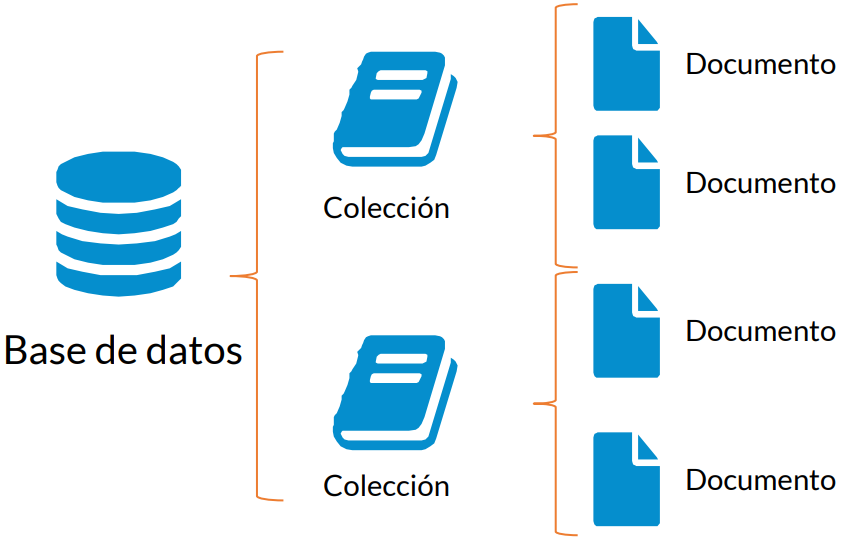

1. Base de datos: Va a contener toda la información que deseamos guardar.
2. Colección: Simplemente son contenedores de documentos.
3. Documento: Es la unidad de almacenamiento es el documento. Un documento es un registro liviano que contiene campos con valores asignados. Cada documento se identifica con un nombre.

## Modulo 7. Manejo de modelos de datos en bases de datos no relacionales
### Clase 42 *Top level collection con Firebase*

Una de las grandes ventajas que ofrece la base de datos no relacionales es justamente que el modelo de datos es un poco más cercano al mundo real, el modelo de la base de datos relacional era más intrincado y complejo.

Vamos a ver como transportar problemas o formas de datos de la vida real en documentos y colecciones, y vamos a empezar con el primer objeto de las bases de datos basadas en documentos:

- Top Level Collection (Colección de nivel más alto): Son las colecciones que vamos a tener de inmediato en nuestro proyecto.

**Firebase**

Es un servicio que tiene múltiples opciones y está pensado principalmente para aplicaciones móviles y web. A diferencia de otros servicios administrados no pide datos de pago, pero por defecto nos restringe ciertas cosas.

**Crear una base de datos en Firebase**

Ingresamos en la página (https://firebase.google.com/) y damos click en 'Añadir proyecto':

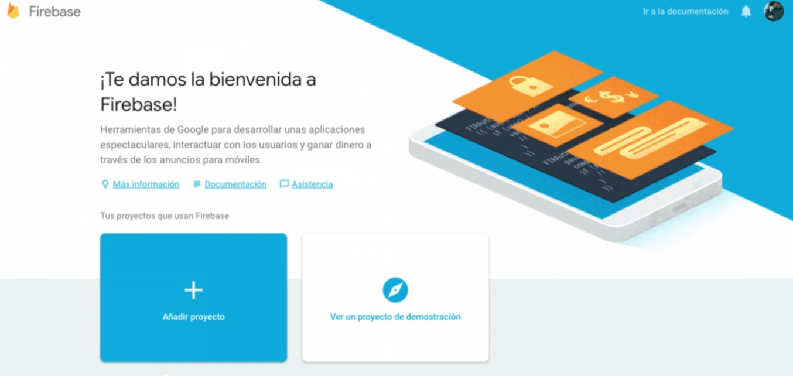

Nos saldrá una ventana que llenaremos con la información necesaria. Primero nos pide el nombre del proyecto, en este caso Platziblog, abajo no sale automáticamente un ID para Google (ese ID es único, si alguien tuviera el mismo ID nos saldría error ya que es a nivel mundial y se comparte la información), en ubicación nos muestra donde se almacenan los datos y en que instancia o zona se van a guardar los datos:

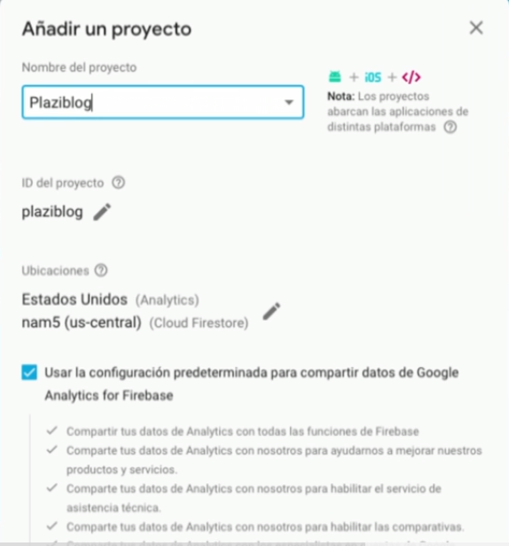

Más abajo tenemos las configuraciones predeterminadas (la puedes dejar así o sacarla y después nos dará una serie de opciones que le queramos dar o quitar), y por ultimo tenemos los términos y condiciones. Finalmente le damos click a 'Crear proyecto':

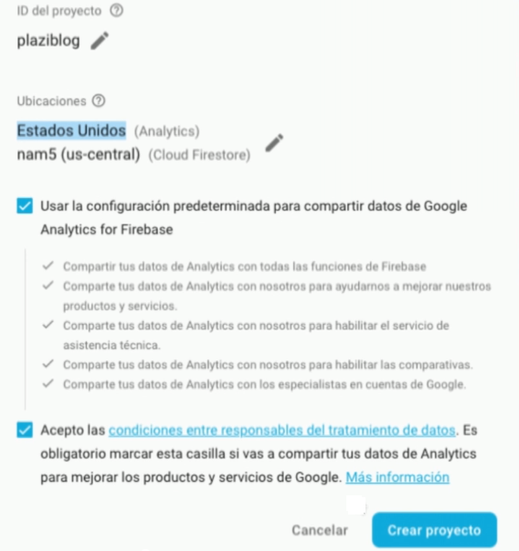

Esperamos unos momentos a que nos cree el proyecto, damos click en 'Continuar ' y después nos sale el pantalla del proyecto en Firebase. A un lado podemos ver varias opciones como autenticación, guardar archivos, hostear aplicaciones web, nosotros elegimos la opción para crear una base de datos:

En database nos presenta los detalles de una forma amigable y entretenida. Ahí damos click en 'Crear base de datos':

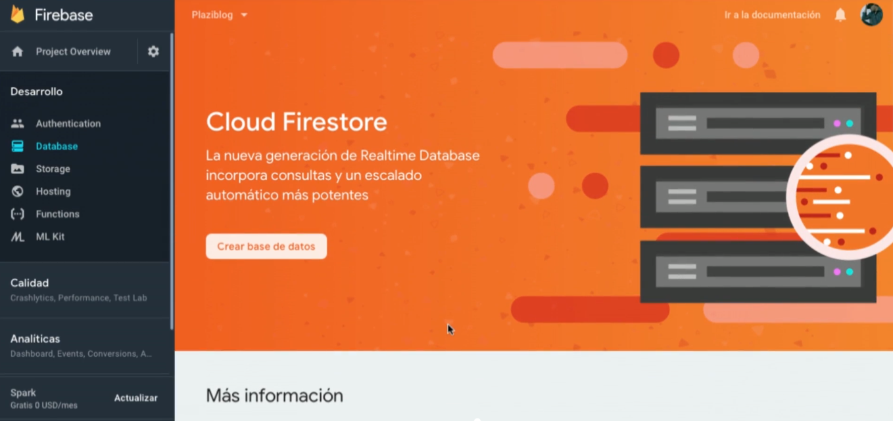

Antes de crear una base de datos, se nos presenta dos opciones: una es crear la base de datos con cierta protección y otra es crear una base de datos en modo de prueba. Por el momento elegimos el modo de bloqueo y le damos click en 'Habilitar':

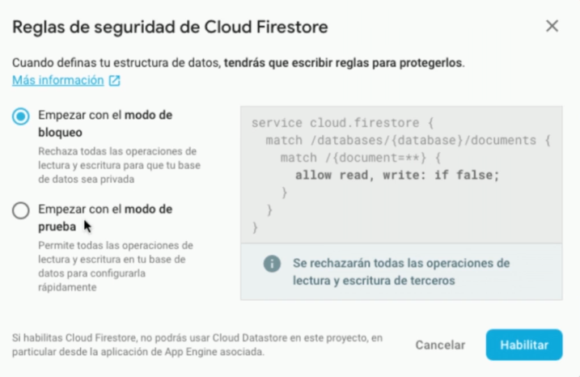

Se nos presenta el panel inicial que utilizaremos en los proyectos de Firebase. Si queremos iniciar una nueva colección (Top Level Collection) solo damos click en 'Añadir colección', si nos fijamos ya nombro platziblog a nuestra base de datos:

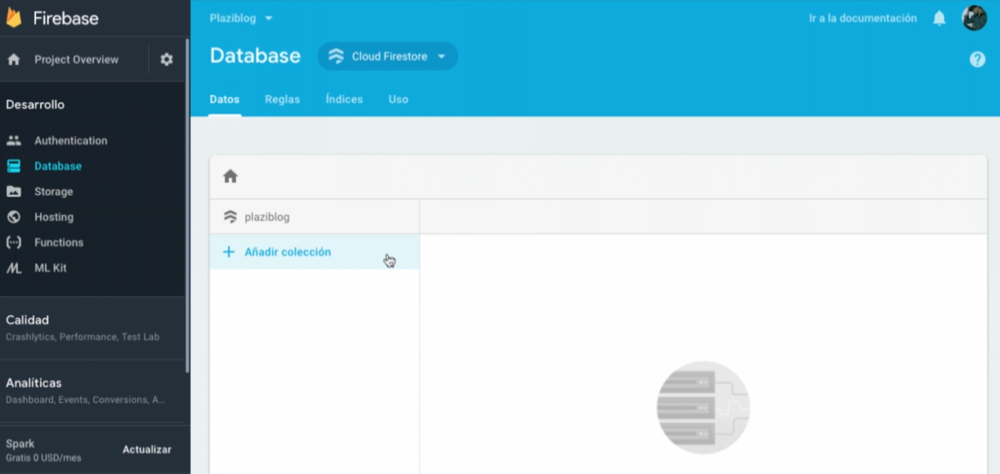

Vemos que nuestra colección está almacenada en la ruta principal, eso es lo que define una Top Level Collection son las colecciones que tenemos a nivel de la ruta principal. Y para crear una colección debemos darle una ID de inicio, en este caso creamos la colección 'people', y damos click en 'Siguiente':

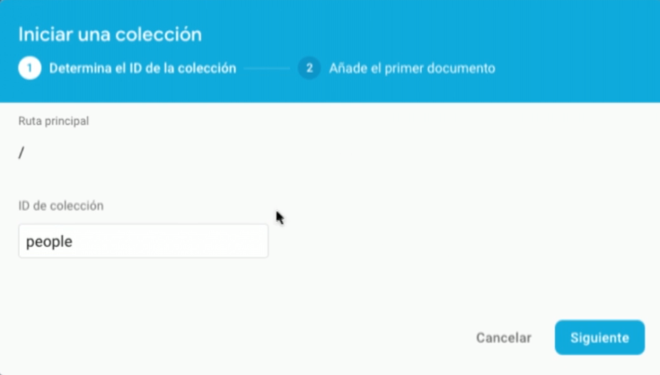

**RECUERDA: Las colecciones son muy similares a las entidades.**

Una colección no puede existir hasta que no creas un documento, entonces creamos un documento 'last_name' del tipo string con valor default vacío. Podemos ingresar una ID al documento o dejarlo así y automáticamente Google nos asigna uno, damos click en 'Guardar':

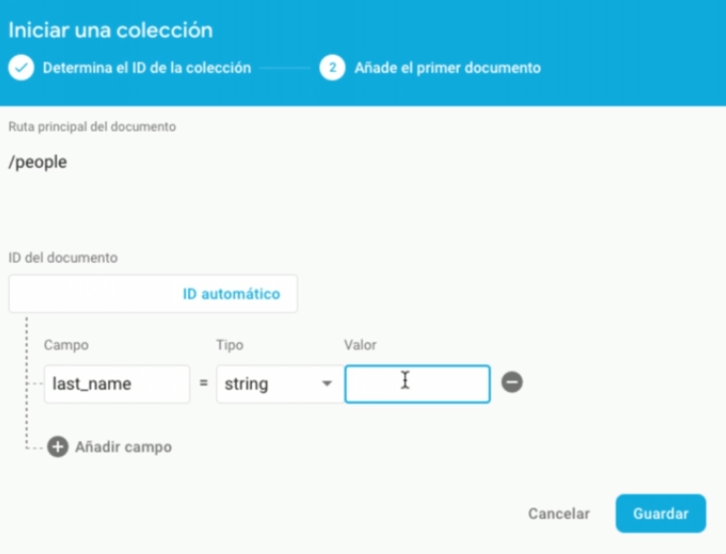

Al guardar el documento se crear la colección 'people', podemos ver la ID que fue asignado automáticamente y la data del documento que es 'last_name':

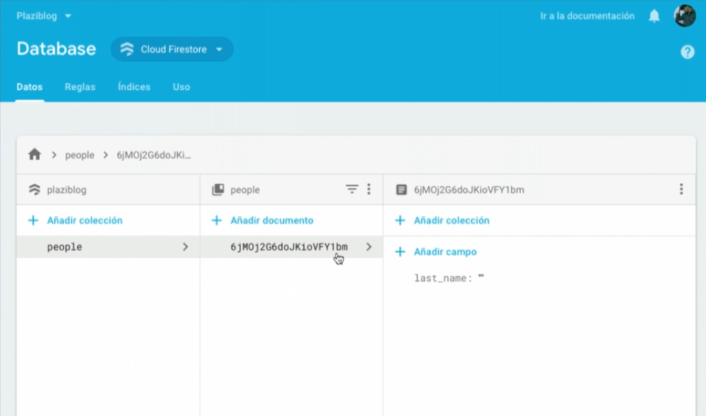

***NOTA: Aunque parezca un mundo diferente con colecciones y documentos, en el fondo sigue siendo el mismo concepto que hemos estado viendo a lo largo del curso, aunque cambiamos nuestras entidades por colecciones y las tuplas por documentos pero en el fondo sigue siendo igual.***

### Clase 43 *Creando y borrando documentos en Firestore*

Anteriormente vimos que en SQL teníamos tipos de datos para texto como char, varchar, tipos de datos numéricos como integer o numeric, teníamos tipos de datos boolean, algunos tipos de datos para fechas como time. Entonces, hoy vamos a ver cómo vamos a guardar ese mismo tipo de datos, esa misma información en Firestore.

**Documentos en Firestore**

Tenemos el documento ya hecho anteriormente para prueba. Vimos que tenemos la base de datos 'platziblog', una colección 'people' que almacena al documento con su ID único y el conjunto de campos.

Para agregar un nuevo documento a nuestra colección damos click en 'Añadir documento':

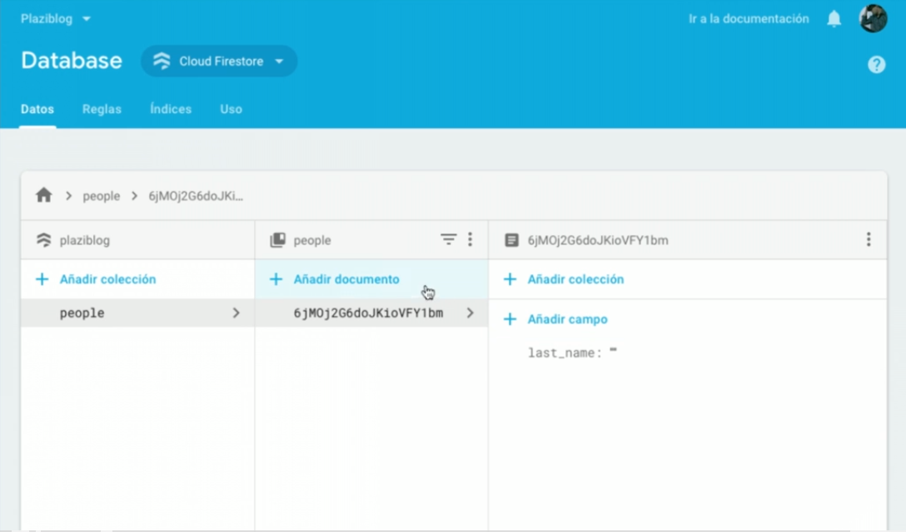

Nos sale esta ventana ya visto anteriormente:

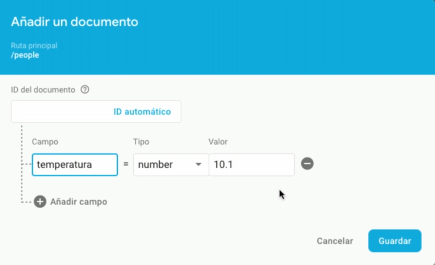

Tenemos el ID (la práctica común es dejar que Google nos asigne uno de forma automática), luego tenemos el nombre del campo, el tipo de datos y después un valor que podemos poner por defecto.

**Tipos de datos**

- String: Es el que aparece por defecto. Aquí los datos de tipo texto no se dividen en char, varchar o text.
- Number: Es un dato de tipo numérico (enteros o flotantes).
- Boolean: Son los valores true o false.
- Map: Permite agregar un documento dentro de otro, se ordenan por clave y se comparan con pares clave-valor.
- Array: Permite agregar un conjunto de datos sin tener en cuenta el orden.
- Null: Son las que indica que no se ha definido ningún valor.
- Timestamp: Es para los datos de fecha y hora, tiene una precisión máxima de microsegundos.
- Geopoint: Es para los datos de localización geográfica (coordenadas latitud-longitud).
- Reference: Referencia un documento, permite relacionar dos documentos sin importar su colección.

**Ejemplo**

Creamos un documento nuevo con todos los datos:

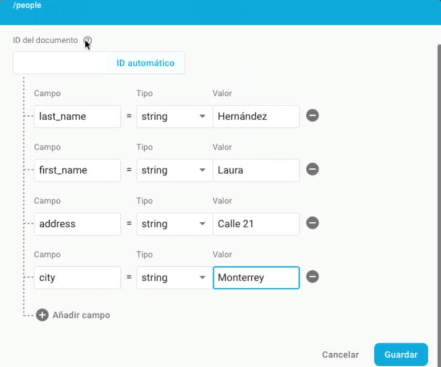

Al dar guardar ya podemos ver una colección 'people' con dos documentos:

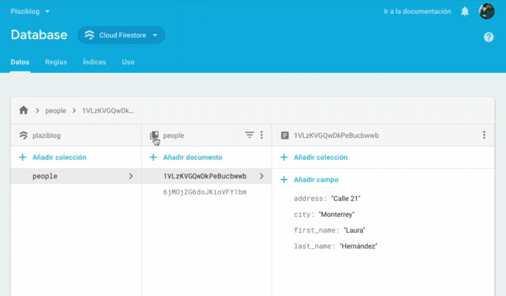

Si queremos borrar o modificar un campo, a un lado podemos ver el lápiz (modificar) o el basurero (borrar):

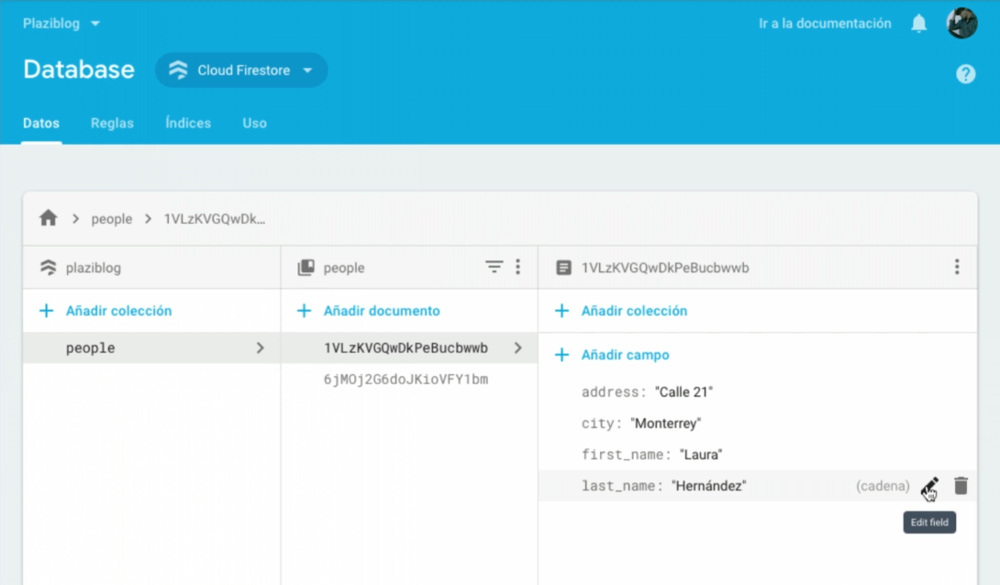

Nos salta un mensaje, damos click en 'Eliminar' y se borrar definitivamente:

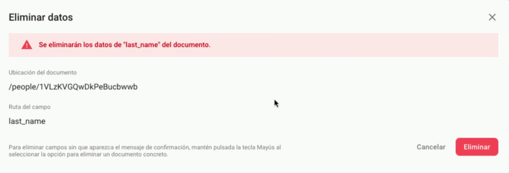

Si quieres borrar un documento, damos click a los tres puntos en la esquina derecha y nos da dos opciones; Eliminar campos de documento (eliminar uno por uno) o Eliminar documento (elimina completamente):

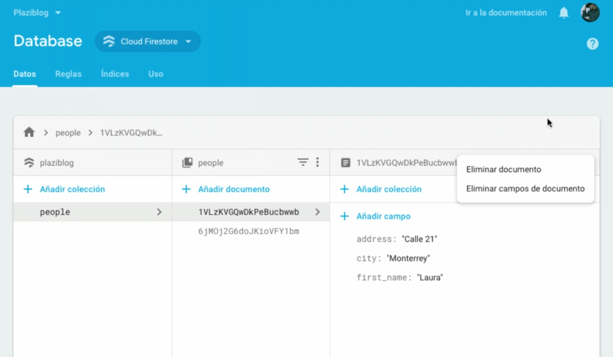

Si elegimos la opción de 'Eliminar documento', nos salta un aviso y solo debemos dar click en 'Eliminar':

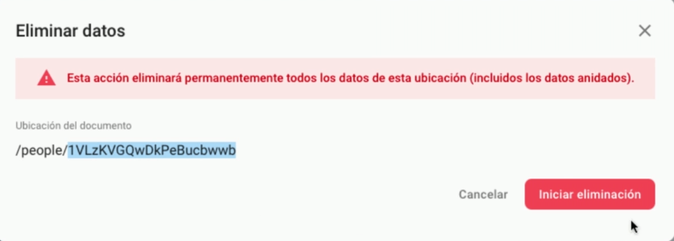

Si deseas eliminar una colección completa, solo es necesario repetir los pasos:

- Nos vamos en la esquina superior y presionamos los tres puntos.
- Damos click en 'Eliminar colección'.
- Nos salta un aviso en el que ponemos el ID de la colección (en este caso es people) y damos click en 'Eliminar'.

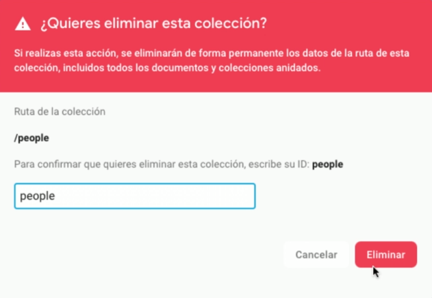

### Clase 44 *Colecciones vs subcolecciones*

Las colecciones tienen la particular de que existen de manera intrínseca a la base de datos, existen en el primer nivel. Hay un segundo tipo de colecciones llamado subcolecciones, en cambio no viven en el inicio de la base de datos.

**Diferencias entre bases de datos relaciones y bases de datos basadas en documentos**

Las bases de datos relacionales de inicio nos pedían que pensáramos bien la estructura, normalizar y definir desde un inicio que se guarda en cada tabla, y la estructura resultaba más complicada al modificar conforme pasa el tiempo.

Las bases de datos basadas en documentos son mucho más flexibles al respecto, nosotros podemos poner un blogpost con una noticia que tenga fecha de recuperación. Sin embargo, también se puede crear otros que no las tengan. La base de datos no nos dice no es inconsistente o que no está normalizada, nos permite perfectamente crear.

**Ejemplo**

Vamos nuevamente a nuestro panel de Firestore y añadiremos una nueva colección 'posts' con los campos de título, contenido y fecha de publicación:

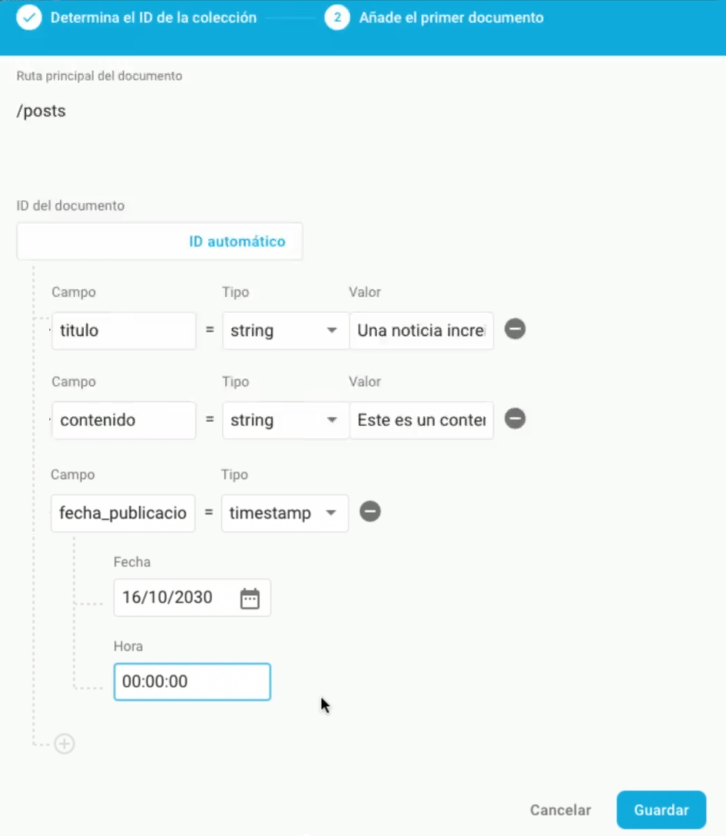

Ahora con nuestra colección creada, podemos ver las subcolecciones.

Tenemos una opción que no hemos visto todavía y es la de 'Añadir colección' que se encuentra dentro del documento (es decir esta intrínseca al documento). No se debe confundir con el 'Añadir colección' del nivel principal:

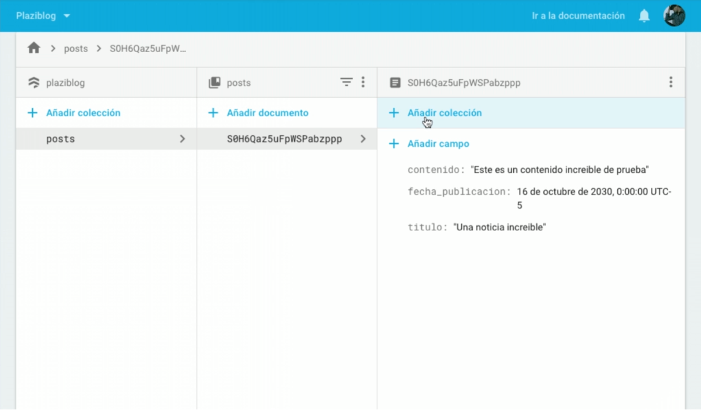

El proceso para crear una subcolección es la misma. Nos sale una ventana para ingresar el ID:

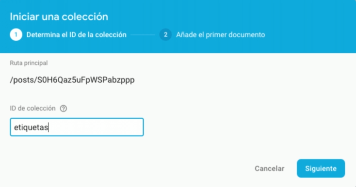

Recordemos que etiquetas era un atributo multivaluado, así que debemos repetir el proceso dos veces:

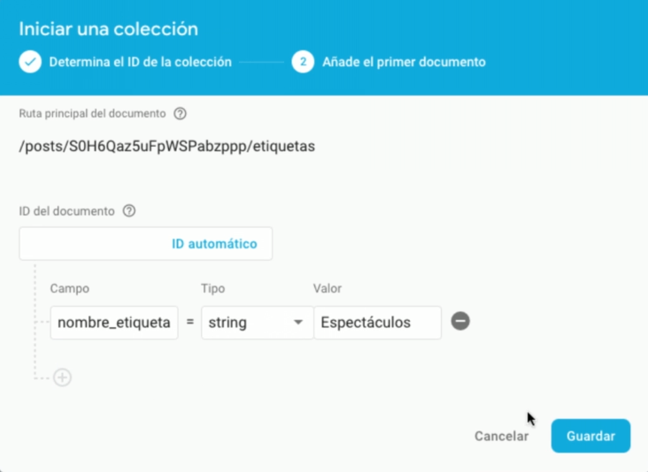

Segundo documento de la subcolección:

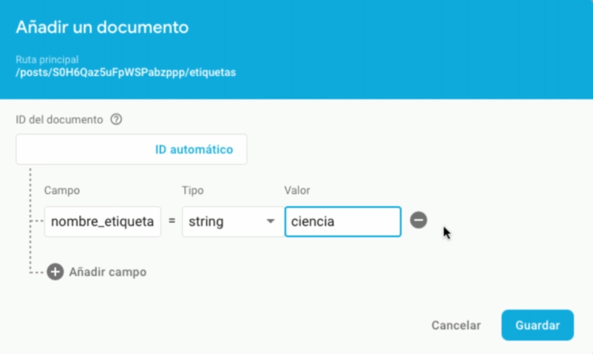

Ahora tenemos una colección 'posts' con un documento y ese mismo documento tiene otra colección llamada 'etiqueta':

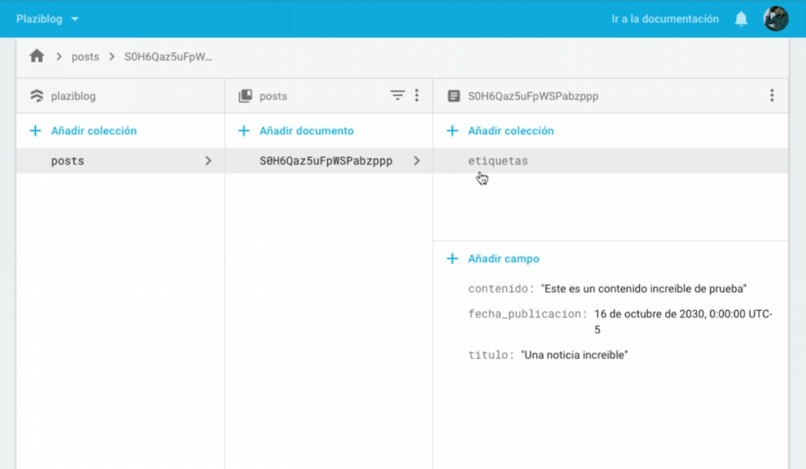

Y esa subcolección es una serie de etiquetas:

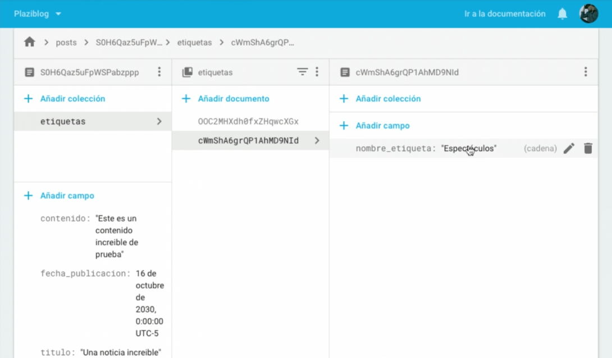

De esta manera tenemos una colección que no está relacionada con la base de datos, sino que solamente está relacionado con el blogpost.

**¿Qué diferencia hay y en qué casos se utiliza?**

Esto queda a conciencia del desarrollador y por eso es bueno desarrollar un buen criterio al igual que las buenas prácticas de SQL, nada es obligatorio pero las buenas prácticas nos ayudaran.

La regla que se ocupa generalmente es que si se ocupa los elementos de la colección de manera independiente, vale tenerla como una entidad separa y tenerla como una Top Level Collection, si en cambio solo tenemos colecciones como las que solo la vamos a usar dentro de la noticia entonces es cuando vale la pena guardarla como una subcolección.

### Clase 45 *Recreando Platziblog*

Ya tenemos todos los elementos que ocupa Firestore para hacer su estructura de datos; jerarquía, base de datos, colecciones, documentos y subcolecciones. Ahora el reto que nos vamos a enfrentar es convertir o traer los datos de Platziblog.

**Platziblog en Firestore**

1. Ver el diagrama físico con las entidades.
2. Debemos definir y analizar para ver cual entidad se convertirá en una Top Level Collection y cual es una subcolección. Tomemos como ejemplo la entidad usuario, puede ser tanto una Top Level Collection como una subcolección, depende de la planeación y como se desea consultar. Si es importante consultar una lista de usuarios a cada rato, entonces se convertirá en una Top Level Collection; en cambio, no tenemos ese problema y no necesitamos hacer una lista de usuarios entonces si vale la pena convertirlo en una subcolección.

### Clase 46 *Construyendo Platziblog en Firestore*

Ya tenemos definidas y revisamos las entidades de nuestro diagrama físico, ahora vamos a pasar directamente a la consola de Firebase que nos permitirá crear los mismos datos pero esta vez basados en documentos.

1. Creamos nuestras Top Level Collection

  - Categoría:

  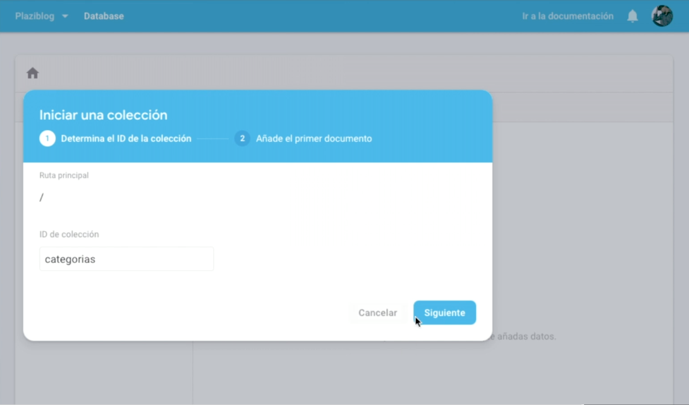

  Con su primer documento:

  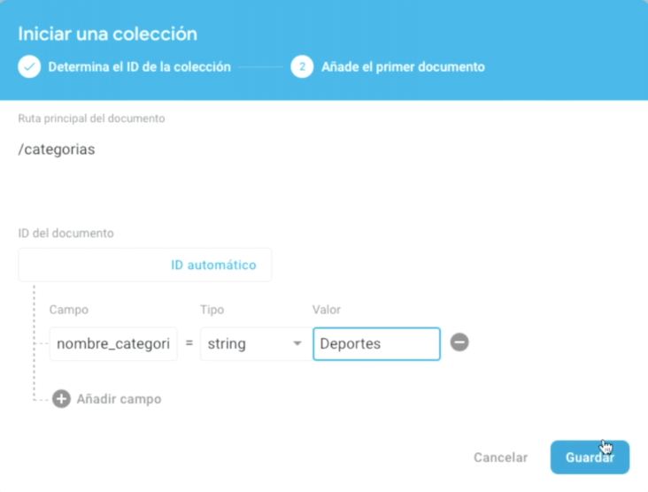

  Añadimos dos documentos más en la colección categoría: Ciencia y Espectáculos.

  - Usuario:

  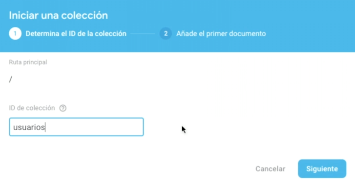

  Con su primer documento

  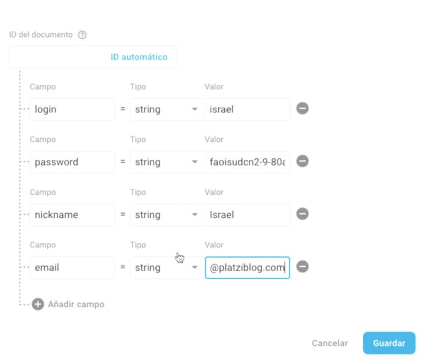

  - Posts:

  

  Con su primer documento

  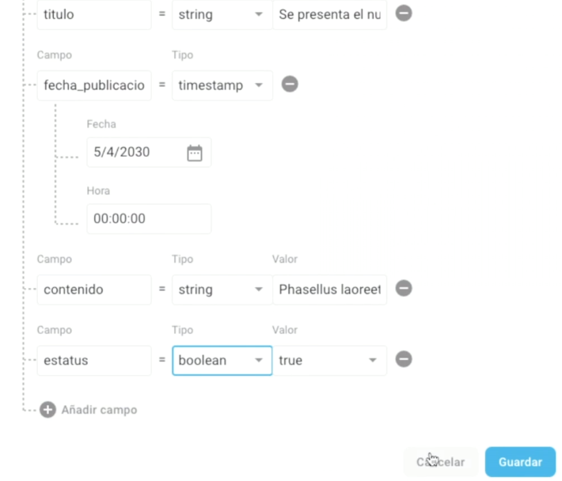

2. Ahora relacionamos nuestras Top Level Collection

  - Para ver las referencias es necesario ir a uno de los documentos y copiar los datos que se encuentra en la parte superior

  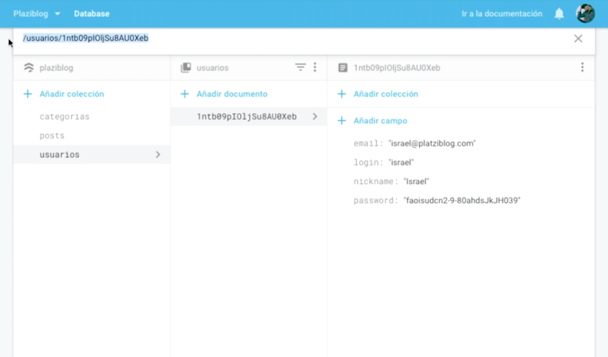

  - Para relacionar posts con usuarios vayamos al documento de posts y agregamos un nuevo campo de tipo reference llamado 'autor' con el vínculo anteriormente copiado

  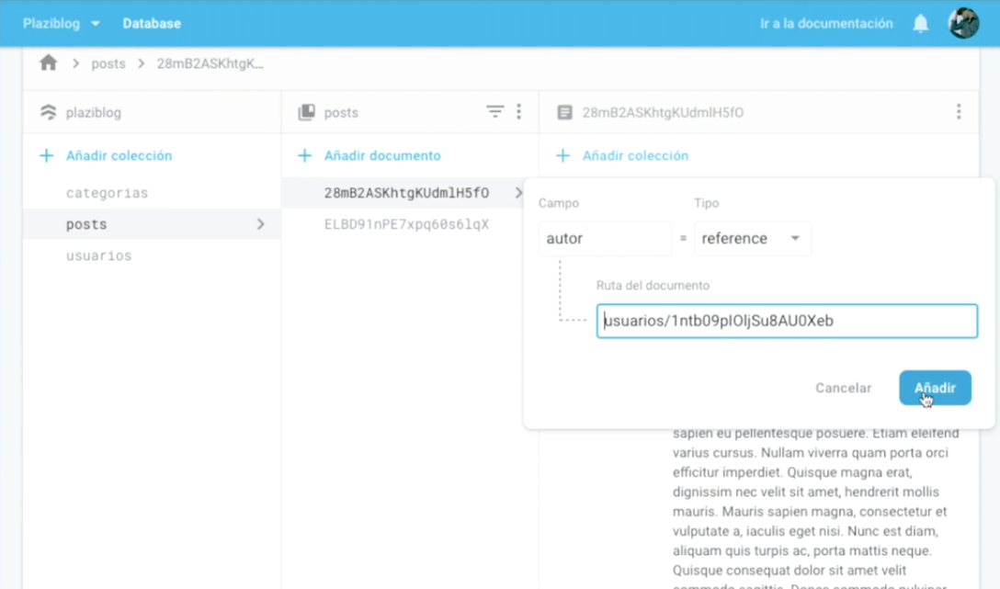

  Con esto ya podemos consultar el posts y saber quién fue el autor

  - También relacionamos las categorías con el posts siguiendo los mismos pasos:

  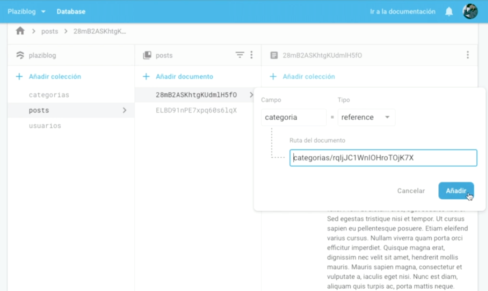

3. Ahora creamos nuestras subcolecciones:

  Creamos la subcolección 'etiqueta' dentro de uno de los documentos:

  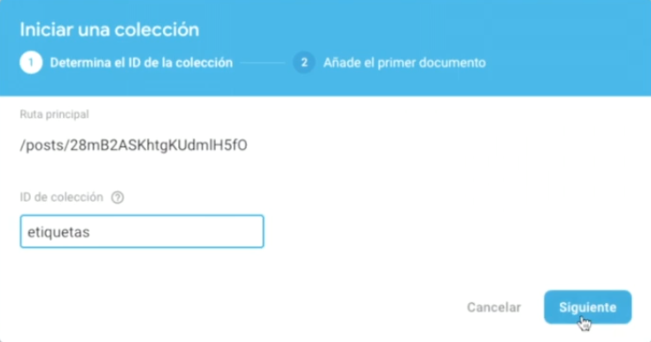

  Y añadimos los documentos:

  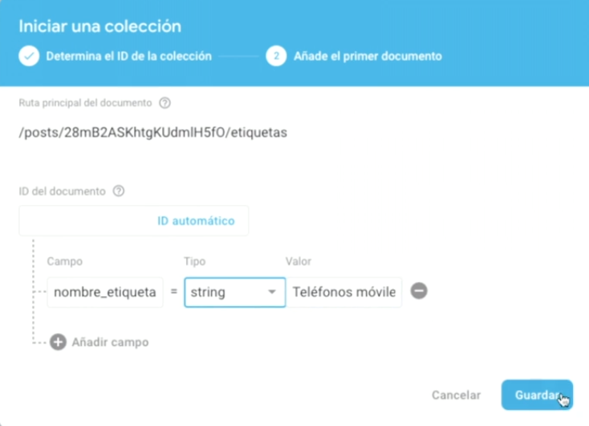

  Con esto ya tenemos la misma información de Platziblog, simplemente en otro formato

  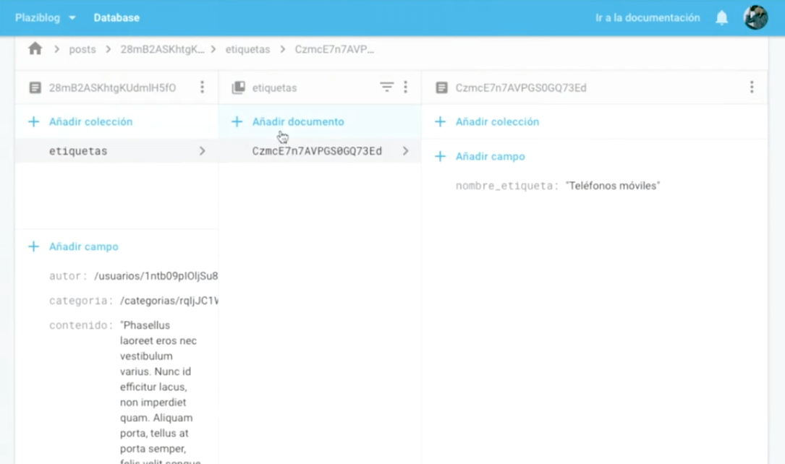

### Clase 47 *Proyecto final: transformando tu proyecto en una db no relacional*

Dentro de las bases de datos relacionales tenemos diferentes niveles de datos. En primer lugar tenemos las Bases de Datos o Esquemas como repositorios donde vivirán los datos que nos interesa guardar. Dentro del esquema existen las Tablas que provienen del concepto de entidades; y a su vez dentro de las tablas tenemos las tuplas o renglones.

Cuando trabajamos con bases de datos basadas en documentos como Firestore, aún existe la figura de la base de datos, sin embargo cambiaremos las tablas en favor de las colecciones y las tuplas en lugar de los documentos.

**Recuerda:**

Tabla -> Colección

Tupla -> Documento

Dentro de las Colecciones existen 2 grandes tipos. Las Top level collection o colecciones de nivel superior y las subcollections o subcolecciones. Estas últimas viven únicamente dentro de un documento padre.

**¿Cómo saber cuál escoger?**

Para determinar si tu colección debe ser top level o subcolección no hay una regla escrita en piedra y más bien tiene que ver con el caso de uso en particular y con la experiencia que hayas ganado como desarrollador.

Lo cierto es que no hay una sola forma de estructurar nuestra DB basada en documentos, y por tanto no existe una respuesta correcta, sin embargo a continuación te ofrezco un par de reglas guía que puedes utilizar para transformar tu proyecto que ya trabajaste en bases de datos relacionales en un proyecto no relacional.

**Regla 1. Piensa en la vista de tu aplicación**

La primera pista que te puedo dar es que pienses en un inicio en la manera en que los datos serán extraídos. En el caso de una aplicación, la mejor forma de pensarlo es en términos de las vistas que vas a mostrar a un momento determinado en la aplicación.

Es decir, al armar la estructura en la base de datos que sea un espejo o que al menos contenga todos los datos necesarios para llenar las necesidades que tiene nuestra parte visual en la aplicación.

En el caso de Platziblog por ejemplo si tienes una vista de un blog post individual, generalmente conviene mostrar además de los datos inherentes al post como el contenido, datos adicionales como las etiquetas que tiene o por ejemplo el autor (o autores si es colaborativo), en este caso tal vez convenga guardar estas dos “entidades” (autores y etiquetas) como subcolecciones de cada documento blog post.

**Regla 2. La colección tiene vida propia**

Esta regla se refiere a que la excepción a la regla 1 es cuando tenemos un caso en que la “entidad” que tiene necesidad de vivir y modificarse constantemente de manera independiente a las otras colecciones. Por ejemplo en Platziblog podemos en el ejemplo anterior hacer una excepción a autores porque nos conviene tenerlas como top level collection en el sentido que se añadan, borren, cambien o listen los usuarios sin depender del blog post.

Experimenta aplicando estas dos reglas a un proyecto que ya conozcas en una base de datos relacional y trata de convertirla en un proyecto de Firestore y comentanos los retos a los que te enfrentaste.

## Modulo 8. Bases de datos en la vida real
### Clase 48 *Bases de datos en la vida real*

En el mundo real no existe una base de datos que sea unitalla (one size fits all) aunque por mucho tiempo esa base de datos fue justamente las relacionales.

Las bases de datos relacionales de inicio nos ayudaban a tratar de solucionar todo; guardar datos, extraer datos, hacer joins, queries y tratar de hacer sentido toda la información, guardar el repositorio de datos por mucho tiempo, tener el esquema de los datos de nuestra aplicación, tener el archivo histórico, sacar reportes, todo eso trataba de hacerlo las bases de datos relacionales y lo hizo bien por un tiempo, tanto que Facebook tardo muchos años en separarse (justamente utilizaba MySQL) porque realmente servían para su propósito.

**¿Cuándo se rompe este paradigma?**

Se rompe en el momento en que las aplicaciones que utilizamos se masifican y esto da origen a lo que se conoce como Big Data.

Las bases de datos relaciones, aunque podían hacer de todo, cuando les metías una cantidad de datos del orden de millones o billones empezaban a tener muchos problemas; problemas de consistencia al traer la unión de una tabla con otra, hacer reportes se volvía algo que podía tomar horas y al final fallar, empezaban a tener problemas procesando los datos. De esto surge que ahora tenemos diversos tipos de base de datos dependiendo de la necesidad que quieras atacar.

Si trabajamos con datos históricos que no vas a estar consultando en todo momento, con gran cantidad de datos y deseas hacer queries complejos puedes usar BigQuery optimizado para datawherehouse. En cambio, si deseamos trabajar en datos actuales de manera simple podemos utilizar MongoDB o Firestore. También es posible hacer uso de dos bases de datos para un mismo proyecto, como por ejemplo: guardar datos con MongoDB, convertirlos y pasarlo a BigQuery para hacer un análisis de ellos.

### Clase 49 *Big Data*

Big Data es un concepto que nace de la necesidad de manejar grandes cantidades datos. Ya hemos oído que el reto que empezó a cerrarle las puertas a las bases de datos relacionales fue el manejo de volúmenes muy grandes de datos. Dicho de otro modo, el big data está formado por conjuntos de datos de mayor tamaño y más complejos, especialmente procedentes de nuevas fuentes de datos. Estos conjuntos de datos son tan voluminosos que el software de procesamiento de datos convencional sencillamente no puede gestionarlos. Sin embargo, estos volúmenes masivos de datos pueden utilizarse para abordar problemas empresariales que antes no hubiera sido posible solucionar.

**Historia de Big Data**

Si bien el concepto "big data" en sí mismo es relativamente nuevo, los orígenes de los grandes conjuntos de datos se remontan a las décadas de 1960 y 1970, cuando el mundo de los datos acababa de empezar con los primeros centros de datos y el desarrollo de las bases de datos relacionales.

Alrededor de 2005, la gente empezó a darse cuenta de la cantidad de datos que generaban los usuarios a través de Facebook, YouTube y otros servicios online. Ese mismo año, se desarrollaría Hadoop, un marco de código abierto creado específicamente para almacenar y analizar grandes conjuntos de datos. En esta época, también empezaría a adquirir popularidad NoSQL.

El desarrollo de marcos de código abierto tales como Hadoop (y, más recientemente, Spark) sería esencial para el crecimiento del big data, pues estos hacían que el big data resultase más fácil de usar y más barato de almacenar. En los años transcurridos desde entonces, el volumen de big data se ha disparado. Los usuarios continúan generando enormes cantidades de datos, pero ahora los humanos no son los únicos que lo hacen.

Con la llegada del Internet de las cosas (IoT), hay un mayor número de objetos y dispositivos conectados a Internet que generan datos sobre patrones de uso de los clientes y el rendimiento de los productos. El surgimiento del aprendizaje automático ha producido aún más datos.

Aunque el big data ha llegado lejos, su utilidad no ha hecho más que empezar. El Cloud Computing ha ampliado aún más las posibilidades del big data. La nube ofrece una escalabilidad realmente elástica, donde los desarrolladores pueden simplemente agilizar clústeres ad hoc para probar un subconjunto de datos.

**Concepto erróneo**

Hoy en día a Big Data se le confunde en muchos lugares con lo que es Business Intelligence, esto se debe a que mucha gente confunde la idea de la analítica y en la que te entregan datos digeridos de volumen de datos grandes resumidos en estadística o analítica.

**Las tres V**

- Volumen: La cantidad de datos importa. Con big data, tendrá que procesar grandes volúmenes de datos no estructurados de baja densidad. Puede tratarse de datos de valor desconocido, como feeds de datos de Twitter, flujos de clics de una página web o aplicación para móviles, o equipo con sensores. Para algunas organizaciones, esto puede suponer decenas de terabytes de datos. Para otras, incluso cientos de petabytes.
- Velocidad: La velocidad es el ritmo al que se reciben los datos y (posiblemente) al que se aplica alguna acción. La mayor velocidad de los datos normalmente se transmite directamente a la memoria, en vez de escribirse en un disco. Algunos productos inteligentes habilitados para Internet funcionan en tiempo real o prácticamente en tiempo real y requieren una evaluación y actuación en tiempo real.
- Variedad: La variedad hace referencia a los diversos tipos de datos disponibles. Los tipos de datos convencionales eran estructurados y podían organizarse claramente en una base de datos relacional. Con el auge del big data, los datos se presentan en nuevos tipos de datos no estructurados. Los tipos de datos no estructurados y semiestructurados, como el texto, audio o vídeo, requieren un preprocesamiento adicional para poder obtener significado y habilitar los metadatos.

**Cassandra**

Esta base de datos nace de la necesidad de Facebook de guardar mucha más información y sacar mucha más información por segundo. Sin embargo, también tiene algunas desventajas; las llaves están predefinidas, no hay manera de hacer ciertos joins, no podemos sacar todos los datos de una sola vez con una sola clave y otra serie de desventajas que no la hacen tan flexible, pero para el caso particular de meter y sacar datos de una manera rápida es una gran solución.

### Clase 50 *Data warehouse*

Un data warehouse es un almacén electrónico donde generalmente una empresa u organización mantiene una gran cantidad de información. Los datos de un data warehouse deben almacenarse de forma segura, fiable, fácil de recuperar y fácil de administrar.

El concepto de data warehouse se originó en 1988 con el trabajo de los investigadores de IBM, Barry Devlin y Paul Murphy aunque el término data warehouse fue acuñado por William H. Inmon, el cual es conocido como el padre de Data Warehousing. Inmon describió un data warehouse como una colección de datos orientada a un tema específico, integrado, variante en el tiempo y no volátil, que soporta el proceso de toma de decisiones.

**¿Qué es un Data Warehouse?**

Un data warehouse es un repositorio unificado para todos los datos que recogen los diversos sistemas de una empresa. El repositorio puede ser físico o lógico y hace hincapié en la captura de datos de diversas fuentes sobre todo para fines analíticos y de acceso.

Normalmente, un data warehouse se aloja en un servidor corporativo o cada vez más, en la nube. Los datos de diferentes aplicaciones de procesamiento de transacciones Online (OLTP) y otras fuentes se extraen selectivamente para su uso por aplicaciones analíticas y de consultas por usuarios.

Data Warehouse es una arquitectura de almacenamiento de datos que permite a los ejecutivos de negocios organizar, comprender y utilizar sus datos para tomar decisiones estratégicas. Un data warehouse es una arquitectura conocida ya en muchas empresas modernas.

**Pasado y presente del Data Warehouse**

Históricamente, los data warehouses se habían formado utilizando datos repetitivos estructurados que eran filtrados antes de entrar en el data warehouse. Sin embargo, en los últimos años, el data warehouse ha evolucionado debido a información contextual que ahora se puede adjuntar a los datos no estructurados y que también puede ser almacenada.

Aquellos primeros datos relacionales estructurados no podían ser mezclados y emparejados para temas analíticos con datos textuales no estructurados. Pero con el advenimiento de la contextualización, estos tipos de análisis ahora sí pueden hacerse de forma naturales y fácil.

En el data warehouse, datos no repetitivos, como los comentarios en una encuesta, correos electrónicos y conversaciones, se tratan de forma diferente a las ocurrencias repetitivas de datos, como el flujo de clics, mediciones o el procesamiento máquina o analógico. Los datos no repetitivos son datos basados en textos que fueron generados por la palabra escrita o hablada, leída y reformateada y, lo que es más importante, ahora puede ser contextualizada. Con el fin de extraer cualquier sentido de los datos no repetitivos para su uso en el data warehouse, deben tener el contexto de los datos establecidos.

En muchos casos, el contexto de los datos no repetitivos es más importante que los datos en sí. En cualquier caso, los datos no repetitivos no pueden utilizarse para la toma de decisiones hasta que se haya establecido el contexto.

**Características del Data Warehouse**

Bill Inmon fue uno de los pioneros en tratar el tema relativo al «Almacén de datos«, traducción literal de este término, y destacó las siguientes características del Data Warehouse:

- Orientación a temas: Solo los datos necesarios para el proceso de generación del conocimiento del negocio se integran desde el entorno operacional. Los datos se organizan por temas, con el fin de facilitar su acceso y entendimiento por parte de los usuarios.
- Variante en el tiempo: Los datos muestran el estado de la actividad del negocio en ese mismo momento. Por otra parte, la información almacenada en el Data Warehouse se utiliza para  realizar análisis de tendencias, debido a la posibilidad de realizar comparaciones entre los datos en él almacenados.
- No volátil: La información no se puede modificar ni eliminar una vez almacenado el dato. Sólo podrá ser usada como lectura o consulta en un futuro.
- Integrado: Los datos almacenados en el data warehouse deben estar formados por una estructura consistente. Esta información puede estructurarse en distintos niveles de detalles para adaptarse de mejor manera a las distintas necesidades de los usuarios.
- Metadatos: El data warehouse cuenta con metadatos, es decir, datos sobre datos. Los metadatos permiten simplificar y automatizar la obtención de la información de una manera precisa, ayudando a localizar los datos que nos interesan. El empleo de metadatos es análogo al empleo de índices. 

**¿Por qué es interesante hacer consultas sobre un data warehouse?**

Un data warehouse es el dato histórico o dato muerto de algo que no estamos utilizando actualmente pero que ha estado en nuestra aplicación desde hace mucho tiempo. Con estos datos podemos tener un mayor conocimiento del negocio, tomar mejores decisiones y ser más efectivos.

Por ejemplo, si deseamos saber la estadística de nuestro negocio durante las vacaciones de verano, los datos actuales no podrán ayudarnos. Debemos recurrir a nuestros datos antiguos para tener una mejor perspectiva del negocio durante ese periodo de tiempo y tomar decisiones en base a lo extraído.

**BigTable**

Es un sistema de gestión de base de datos creado por Google.

BigTable almacena la información en tablas multidimensionales cuyas celdas están, en su mayoría, sin utilizar. Además, estas celdas disponen de versiones temporales de sus valores, con lo que se puede hacer un seguimiento de los valores que han tomado históricamente. Para poder manejar la información, las tablas se dividen por columnas, y son almacenadas como 'tabletas' de unos 200 Mbytes cada una. Cada máquina almacena 100 tabletas, mediante el sistema 'Google File System'. La disposición permite un sistema de balanceo de carga (si una tableta está recibiendo un montón de peticiones, la máquina puede desprenderse del resto de las tabletas o trasladar la tableta en cuestión a otra máquina) y una rápida recomposición del sistema si una máquina 'se cae'.

**Data Warehouse vs Big Data vs BI: cuales son las diferencias**

En este apartado compararemos brevemente los conceptos Data Warehouse (DW), Big Data y Business Intelligence (BI). Los tres conceptos están interconectados y la perspectiva es que, cada vez más, la mayoría de empresas utilicen el análisis generado por este tipo de tecnologías para tener una visión más analítica de su negocio y así poder tomar las mejores decisiones para crecer.

Se trata de tres conceptos completamente diferentes que tienen en común una nueva manera de lidiar con los datos, siempre teniendo en cuenta la existencia de una gran volumen de información en varios formatos que contribuyen, de forma estructurada o no estructurada, a la toma de decisiones estratégicas. El objetivo final de cualquiera de estas tecnologías es ofrecer una ventaja competitiva a las empresas, pero la forma en que se utiliza es la que marcará la diferencia.

- Big Data: Llamamos big data a un gran volumen de datos con una variedad, complejidad y velocidad de crecimiento enorme y que además tienen la característica de no ser estructurados. Eso significa que no son relacionales, estando además fuera del entorno corporativo. Es un tipo de tecnología que te permite analizar los datos en tiempo real y puede provenir de diferentes fuentes y formas, tales como mensajería instantánea, redes sociales, registros de grabaciones, imágenes, mensajes de correo electrónico, etc.
- Data Warehouse: Por otro lado, un data warehouse almacena datos consolidados de diversas fuentes o sistemas de la empresa. Se trata de datos estructurados, que tiene como objetivo principal ser precisos y de alta calidad para de esta forma poder dar soporte a la toma de decisiones de la empresa. Se trata de conseguir tener todos los datos juntos para después poder dividirlos para hacer un análisis de determinados sectores o estrategias.
- Business Intelligence: Un Business Intelligence (BI) es una especie de “cuello de botella” de los datos recogidos del data warehouse, que llegan de forma exacta y útil para ayudar a la toma de decisiones. Business Intelligence transforma los datos en información útil para analizar no sólo los negocios, sino también las principales estrategias corporativas.

Los tres conceptos están interconectados y la perspectiva es que, cada vez más, la mayoría de empresas utilicen el análisis generado por este tipo de tecnologías para una visión más analítica de su negocio y así poder tomar las mejores decisiones para crecer.

### Clase 51 *Data mining*

El data mining (minería de datos), es el conjunto de técnicas y tecnologías que permiten explorar grandes bases de datos, de manera automática o semiautomática, con el objetivo de encontrar patrones repetitivos, tendencias o reglas que expliquen el comportamiento de los datos en un determinado contexto.

La minería de datos surgió con la intención o el objetivo de ayudar a comprender una enorme cantidad de datos, y que estos, pudieran ser utilizados para extraer conclusiones para contribuir en la mejora y crecimiento de las empresas, sobre todo, por lo que hace a las ventas o fidelización de clientes.

Su principal finalidad es explorar, mediante la utilización de distintas técnicas y tecnologías, bases de datos enormes de manera automática con el objetivo de encontrar patrones repetitivos, tendencias o reglas que expliquen el comportamiento de los datos que se han ido recopilando con el tiempo. Estos patrones pueden encontrarse utilizando estadísticas o algoritmos de búsqueda próximos a la Inteligencia Artificial y a las redes neuronales.

Por tanto, los datos son el medio o la base para llegar a conclusiones y transformar estos datos en información relevante, para que las empresas puedan abarcar mejoras y soluciones que les ayuden a conseguir sus objetivos.

Las personas que se dedican al análisis de datos a través de este sistema son conocidos como mineros o exploradores de datos, estos intentan descubrir patrones en medio de enormes cantidades de datos. Su intención es la de aportar información valiosa a las empresas para así, ayudarlas en la toma de decisiones futuras. Pero debemos tener claro que la elección del mejor algoritmo para una tarea analítica específica es un gran desafío, ya que podemos encontrar muchos patrones distintos, y además, dependerá de los problemas a resolver. Estos pueden ser la clasificación, regresión, segmentación, asociación y análisis de secuencias.

Los mineros o exploradores de datos a la hora de llevar a cabo un análisis de Data Mining, deberán realizar cuatro pasos distintos:

1. **Determinación de los objetivos:** El cliente determina qué objetivos quiere conseguir gracias al uso del Data Mining.
2. **Procesamiento de los datos:** Selección, limpieza, enriquecimiento, reducción y transformación de la base de datos.
3. **Determinación del modelo:** Primero se debe hacer un análisis estadístico de los datos y después visualización gráfica de los mismos.
4. **Análisis de los resultados:** En este paso se deberán verificar si los resultados obtenidos son coherentes.

**Carga de trabajo en las fases de un proyecto de datamining**

En resumen, el datamining se presenta como una tecnología emergente, con varias ventajas: por un lado, resulta un buen punto de encuentro entre los investigadores y las personas de negocios; por otro, ahorra grandes cantidades de dinero a una empresa y abre nuevas oportunidades de negocios. Además, no hay duda de que trabajar con esta tecnología implica cuidar un sinnúmero de detalles debido a que el producto final involucra "toma de decisiones".

En el artículo Data Mining: Torturando a los datos hasta que confiesen, Luis Carlos Molina proporciona una visión muy clarificadora sobre la minería de datos, incluyendo interesantes ejemplos de aplicaciones de la misma.

### Clase 52 *ETL*

ETL  es un tipo de integración de datos que hace referencia a los tres pasos (extraer, transformar, cargar) que se utilizan para mezclar datos de múltiples fuentes. Se utiliza a menudo para construir un almacén de datos. Durante este proceso, los datos se toman (extraen) de un sistema de origen, se convierten (transforman) en un formato que se puede almacenar y se almacenan (cargan) en un data warehouse u otro sistema. Extraer, cargar, transformar (ELT) es un enfoque alterno pero relacionado diseñado para canalizar el procesamiento a la base de datos para mejorar el desempeño.

**Historia de ETL**

ETL cobró popularidad en la década de 1970 cuando las organizaciones comenzaron a utilizar múltiples repositorios de datos, o bases de datos, para almacenar diferentes tipos de información de negocios. La necesidad de integrar datos que se diseminaran por estas bases de datos creció con rapidez. ETL se convirtió en el método estándar para extraer datos de diferentes fuentes y transformarlos antes de cargarlos en una fuente pretendida o destino.

A fines de la década de 1980 y principios de la década de 1990, los data warehouses aparecieron en escena. Siendo un tipo de base de datos diferente, los data warehouses proveían acceso integrado a datos de múltiples sistemas – computadoras mainframe, minicomputadoras, computadoras personales y hojas de cálculo. Pero diferentes departamentos a menudo elegían diferentes herramientas ETL para utilizarlas con almacenes de datos distintos. Junto con fusiones y adquisiciones, muchas organizaciones terminaban con diferentes soluciones ETL que no estaban integradas.

Con el tiempo, el número de formatos, fuentes y sistemas de datos ha aumentado enormemente. Extraer, transformar, cargar (ETL) es ahora sólo uno de varios métodos que utilizan las organizaciones para recopilar, importar y procesar datos. ETL y ELT son ambos partes importantes de una estrategia de integración de datos más amplia de una organización.

**Cómo funcionan los procesos de ETL y ELT**

Un proceso de ETL suele comprender 3 fases.  Cada vez es más habitual extraer datos de sus ubicaciones originales y luego cargarlos en un almacén de datos diana o transformarlos después de cargarlos.  Este proceso recibe el nombre de ELT, en lugar de ETL.

  **Fase 1: Extracción**

  El objetivo de un proceso ETL es producir datos limpios y accesibles que puedan utilizarse para analíticas u operaciones comerciales. Los datos en bruto deben extraerse de una variedad de fuentes. Los datos extraídos en ocasiones se transfieren a otro destino como por ejemplo un data lake o un almacén de datos.

  **Fase 2: Transformación**

		La fase de transformación de ETL es donde se produce la operación más crítica. El resultado más destacado de la transformación pasa por aplicar las normas necesarias del negocio a los datos para cumplir con los requisitos de notificación.  La transformación modifica los datos en bruto para que presenten los formatos de notificación correctos.  Si los datos no se limpian, resulta más complicado aplicar las normas comerciales de notificación.

		La transformación se efectúa mediante una serie de normas y reglamentos que se esbozan. Estas fases de transformación reducen lo que hasta ahora era un montaña de material sin utilidad posible a un producto de datos que puede presentar en la última fase del ETL: la fase de carga.

  **Fase 3: Carga**

		La última fase de un proceso de ETL típico es la carga de esos datos extraídos y transformados a su nuevo destino. Existen dos vías habituales de cargar los datos a un almacén de datos: la carga completa y la carga incremental.

		La ejecución de un ciclo aislado de ETL o de una serie de ellos programada puede realizarse ejecutando una tarea desde una línea de comando o una interfaz GUI. Sin embargo, debemos estar atentos a varios frentes. Gestionar las excepciones, por ejemplo, puede resultar un proceso muy farragoso.  Muchas veces las extracciones de datos pueden fallar cuando hay incidencias en uno o varios sistemas. La existencia de datos erróneos en un sistema puede afectar a datos que estén siendo extraídos de otro, por lo que el seguimiento y la gestión de errores son actividades fundamentales.

**¿Para qué se utiliza un proceso de ETL?**

En prácticamente cualquier operación empresarial los datos desempeñan un papel importante; para que tengan valor, deben trasladarse y prepararse para su uso, y para ello se necesitan procesos de ETL. Enumeramos algunos casos de aplicación de ETL:

- Migración de datos de una aplicación a otra
- Replicación de datos para copias de seguridad o análisis de redundancia
- Procesos operativos, como la migración de datos desde un CRM a un ODS (almacén de datos operativos) para potenciar o enriquecer los datos y luego devolverlos al CRM
- Depositar los datos en un almacén de datos para ingerir, clasificar y transformarlos en business intelligence
- Migración de aplicaciones de infraestructuras locales a cloud, cloud híbrida o multicloud
- Sincronización de sistemas clave

**Por qué es importante ETL**

Las empresas han confiado en el proceso ETL por muchos años para obtener una vista consolidada de los datos que dé lugar a mejores decisiones de negocios. Hoy día, este método de integración de datos de múltiples sistemas y fuentes sigue siendo un componente central de la caja de herramientas de integración de datos de una organización.

ETL se utiliza para mover y transformar datos de diferentes fuentes y cargarlos en diferentes destinos, como Hadoop.

Cuando se utiliza con un almacén de datos empresarial (datos en reposo), ETL provee profundo contenido histórico para la empresa. Proporcionando una vista consolidada, ETL facilita a los usuarios de negocios analizar y generar reportes sobre datos relevantes para sus iniciativas.

ETL puede mejorar la productividad de los profesionales de los datos porque codifica y reutiliza procesos que mueven datos sin requerir habilidades técnicas para escribir código o scripts.

ETL ha evolucionado para satisfacer requisitos de integración emergentes para cosas como los datos transmitidos por streaming. Las organizaciones necesitan ETL y ELT para conjuntar datos, mantener la precisión y proporcionar el recurso de auditoría que suele requerirse en los almacenes, reportes y análisis de datos. 

### Clase 53 *Business intelligence*

Business Intelligence es una parte muy importante de las carreras de datos ya que es el punto final del manejo de estos. El concepto se refiere a la utilización de datos en una empresa para facilitar la toma de decisiones dentro de la misma. Es un conjunto de estrategias y herramientas enfocadas al análisis de datos de una empresa mediante el análisis de datos existentes. En plena era digital, tomar decisiones bien informadas es uno de los principales factores de diferenciación de las empresas.

Business Intelligence son herramientas, aplicaciones y metodologías que permiten a las organizaciones recopilar datos de sus sistemas internos (por ejemplo, sus bases de datos, una web o redes sociales) y fuentes externas (por ejemplo, la tarjeta de descuentos de un supermercado), y ponerlos disponibles para la toma de decisiones. Esos datos se preparan para el análisis y se crean informes específicos de los mismos. De ese modo se ponen los resultados a disposición de los responsables de la toma de decisiones corporativas para lograr los objetivos de la empresa.

**¿Para qué sirve Business Intelligence?**

Algunos de los procesos empresariales en los que puede contribuir son:

- Gestión de proyectos: A partir de la información obtenida a través de una serie de datos relativos al project management, una persona experta en dicha área puede generar un conocimiento que permita gestionar proyectos de forma más eficaz y eficiente.
- Creación de presupuestos: A la hora de comenzar un proyecto, la elaboración de presupuestos puede beneficiarse de la Business Intelligence siempre y cuando exista una persona experta en el tema.
- Asignación de recursos: Si una persona experta dispone de información acerca de los recursos disponibles para un proyecto, podrá crear un conocimiento que permita asignarlos de la forma más eficaz posible.
 
**Herramientas y soluciones de Business Intelligence**

En cuanto a las herramientas y metodologías de Business Intelligence, tienen algunas características comunes:

- Accesibilidad a la información: Sin información, sin datos, no hay nada que estudiar. Estas herramientas y técnicas garantizan el acceso a los datos por parte de los usuarios.
- Apoyo en toma de decisiones: Acceso a herramientas de análisis que permitan a los usuarios seleccionar y manipular aquellos datos que les interesen.
- Orientación al usuario final: Se busca independencia entre los conocimientos técnicos de los usuarios y su capacidad para utilizar estas herramientas.

**El origen de las herramientas de Business Intelligence**

Según el artículo en inglés History of Business Intelligence, la primera mención al término Business Intelligence se encuentra en una enciclopedia publicada en EEUU en 1865. titulada Cyclopaedia of Commercial and Business Anecdotes.

Pero no será hasta el siglo XX, con el avance de la tecnología y, en concreto, con el desarrollo de los almacenes informáticos de datos, cuando podemos empezar a hablar del concepto de inteligencia de negocio tal y como lo entendemos ahora.

Algunas fechas de los inicios de las empresas de Business Intelligence:

- 1956: IBM inventa las unidades de disco duro, que llegaron a particulares y empresas de la mano de los PCs.
- 1958: el investigador de IBM Peter Luhn, utiliza el concepto Business Intelligence.

Sus investigaciones fueron cruciales para entender el potencial del análisis de datos para mejorar las decisiones de negocio. Se le considera el padre del término inteligencia de negocio.

- Década de 1970: SAP y otras empresas desarrollan aplicaciones de negocio que facilitaban la introducción de datos en bases de datos.
- Década de 1980: las bases de datos evolucionan y permiten almacenar datos de diversas fuentes en una única base de datos.

Es en la década de 1990 cuando se empiezan a desarrollar y comercializar más herramientas de inteligencia de negocios, debido a que algunas empresas pioneras empezaron a darse cuenta del potencial de este tipo de soluciones y empiezan a utilizarlas. El problema de las primeras herramientas de BI era que eran poco intuitivas y difíciles de usar. Además, para generar informes y acceder a la información, un usuario sin conocimiento específico debía recurrir a los servicios del departamento de IT.

A finales de los 90 y principios del año 2000 fue cuando realmente se empezó a entender el potencial del uso de los softwares de Business Intelligence. El mercado empezó a florecer y proliferaron los fabricantes y proveedores de este tipo de herramientas. Y además, estas soluciones empezaron a mejorar, haciéndose cada vez más usables para cualquier profesional, de forma que sin tener conocimientos informáticos se podía acceder, recopilar y analizar la información sin tener que recurrir al departamento de IT. El reto que surgió en ese momento fue el de combinar soluciones de Business Intelligence rápidas y fáciles de utilizar por usuarios no técnicos, y que al mismo tiempo fuesen capaces de proporcionar información segura y confiable.

Ha sido en los últimos años cuando tanto el desarrollo como el uso de este tipo de herramientas ha crecido de forma exponencial en las empresas. Teniendo en cuenta que las fuentes de datos se han multiplicado (Internet y redes sociales, dispositivos IoT, información de dispositivos móviles, y un largo etc.) también ha aumentado la complejidad para extraer conocimiento relevante de toda esa información. Por eso las herramientas de Business Intelligence también se han ido haciendo más sofisticadas y son hoy en día muy potentes, capaces de analizar y procesar infinidad de datos, de infinidad de fuentes y de ayudar a las empresas a extraer conclusiones para mejorar sus cifras de negocio.

**Ventajas de las herramientas de Business Intelligence**

Las cuatro grandes ventajas que ofrece el uso de herramientas de inteligencia de mercado son:

1. La capacidad de analizar de forma combinada información interna y externa procedente de distintas fuentes y sistemas.
2. Una mayor profundidad de análisis y una capacidad ampliada de reporting.
3. La posibilidad de remontar ese análisis atrás en el tiempo en base a series históricas.
4. La capacidad de realizar proyecciones y pronósticos de futuro en base a toda esa información.

**Tipos de herramientas de Business Intelligence**

A pesar de que se trata de una categoría muy amplia -podría discutirse por ejemplo si los servicios de monitorización de medios se consideran una herramienta de BI- podemos distribuir las soluciones de inteligencia de negocio en tres categorías:

1. Herramientas para la gestión de datos (data management tools): Permiten desde la depuración y estandarización de datos de procedencia diversa hasta su extracción, transformación y traslado a un determinado sistema.
2. Las aplicaciones para descubrir nuevos datos (data discovery applications): Permiten recopilar y evaluar nueva información (data mining o minería de datos), y aplicar sobre esa información nueva o sobre la ya disponible técnicas de análisis predictivo para realizar proyecciones de futuro.
3. Herramientas de reporting: Una vez recopilada y tratada toda esa información preexistente o nueva, ayudan a las empresas a visualizarla de manera gráfica e intuitiva. También sirven para integrarla en cuadros de mando que midan si se cumplen o no determinados KPIs, o pueden incluso generar todo tipo de informes de reporting.

**Cómo se interpretan los datos extraídos mediante el Business Intelligence**
La información puede presentarse de diversas formas gracias a los softwares de visualización de datos que incluye el sistema de Business Intelligence. Así pues, es fácil crear comparaciones de resultados, gráficos de barras, reportes, estadísticas, métricas o infografías de modo que lo volcado por el sistema sea fácil de entender.

Mediante los indicadores analizados se puede mejorar el rendimiento de una empresa. Así, modificar lo que no está funcionando bien para optimizar los esfuerzos y alcanzar mejores resultados.

### Clase 54 *Machine Learning*

A la hora de describir qué es Machine Learning es inevitable la relación con el concepto de la Inteligencia Artificial. Machine Learning o Aprendizaje Automático hace referencia a la capacidad de una máquina o software para aprender mediante la adaptación de ciertos algoritmos de su programación respecto a cierta entrada de datos en su sistema.

**¿Qué es Machine Learning?**

Consiste en una disciplina de las ciencias informáticas, relacionada con el desarrollo de la Inteligencia Artificial, y que sirve, como ya se ha dicho, para crear sistemas que pueden aprender por sí solos. Es una tecnología que permite hacer automáticas una serie de operaciones con el fin de reducir la necesidad de que intervengan los seres humanos. Esto puede suponer una gran ventaja a la hora de controlar una ingente cantidad de información de un modo mucho más efectivo. Como estas acciones se realizan de manera autónoma por el sistema, se dice que el aprendizaje es automático, sin intervención humana

Lo que se denomina aprendizaje consiste en la capacidad del sistema para identificar una gran serie de patrones complejos determinados por una gran cantidad de parámetros. Es decir, la máquina no aprende por sí misma, sino un algoritmo de su programación, que se modifica con la constante entrada de datos en la interfaz, y que puede, de ese modo, predecir escenarios futuros o tomar acciones de manera automática según ciertas condiciones. Como estas acciones se realizan de manera autónoma por el sistema, se dice que el aprendizaje es automático, sin intervención humana.

**¿Cómo funciona el Machine Learning?**

En la informática clásica, el único modo de conseguir que un sistema informático hiciera algo era escribiendo un algoritmo que definiera el contexto y detalles de cada acción.

En cambio, los algoritmos que se usan en el desarrollo del Machine Learning realizan buena parte de estas acciones por su cuenta. Obtienen sus propios cálculos según los datos que se recopilan en el sistema, y cuantos más datos obtienen, mejores y más precisas serán las acciones resultantes.

Las computadoras se programan a sí mismas, hasta cierto punto, usando dichos algoritmos. Estos funcionan como ingenieros que pueden diseñar nuevas respuestas informáticas, como respuesta a la información que se les suministra a través de su interfaz u otros medios. Todo nuevo dato se convierte en un nuevo algoritmo, y a más datos, mayor complejidad y efectividad de cálculo puede proporcionar el sistema informático. El mínimo que se recomienda es de 6 entradas de datos reales para cada respuesta nueva diseñada

La clave de la capacidad de un sistema de Aprendizaje Automático se encuentra en la construcción y adaptación de los árboles de decisiones en base a los datos previamente conocidos por el sistema. Pero también influye la aplicación de fórmulas heurísticas en los nodos que forman el árbol, para el que se elabora un sistema de inferencias.

El sistema de Machine Learning necesita contar con un volumen de datos de relevancia para poder suministrar respuestas realmente válidas. El mínimo que se recomienda es de 6 entradas de datos reales para cada respuesta nueva diseñada, y esto debe repetirse para cada variable que conforman el sistema de trabajo del sistema.

**Tipos de machine learning**

Un sistema informático de Aprendizaje Automático se sirve de experiencias y evidencias en forma de datos, con los que comprender por sí mismo patrones o comportamientos. De este modo, puede elaborar predicciones de escenarios o iniciar operaciones que son la solución para una tarea específica.

A partir de un gran número de ejemplos de una situación, puede elaborarse un modelo que puede deducir y generalizar un comportamiento ya observado, y a partir de él realizar predicciones para casos totalmente nuevos. Como ejemplo, se puede considerar la predicción del valor de unas acciones en el futuro según el comportamiento de las mismas en periodos previos.

Existen tres tipos principales de Aprendizaje Automático:

1. Aprendizaje supervisado: Este tipo de aprendizaje se basa en lo que se conoce como información de entrenamiento. Se entrena al sistema proporcionándole cierta cantidad de datos definiéndolos al detalle con etiquetas. Otro método de desarrollo del Aprendizaje Automático consiste en predecir un valor continuo, utilizando parámetros distintos que, combinados en la introducción de nuevos datos, permite predecir un resultado determinado. Este método se conoce como regresión.
2. Aprendizaje no supervisado: En este tipo de aprendizaje no se usan valores verdaderos o etiquetas. Estos sistemas tienen como finalidad la comprensión y abstracción de patrones de información de manera directa. Este es un modelo de problema que se conoce como clustering. Es un método de entrenamiento más parecido al modo en que los humanos procesan la información.
3. Aprendizaje por refuerzo: En la técnica de aprendizaje mediante refuerzo, los sistemas aprenden a partir de la experiencia. Es una técnica basada en la prueba y error, y en el uso de funciones de premio que optimizan el comportamiento del sistema. Es una de las maneras más interesantes de aprendizaje para sistemas de Inteligencia Artificial, pues no requiere de la introducción de gran cantidad de información.

**Ámbitos de aplicación del Machine Learning**

Muchas actividades actualmente ya se están aprovechando del Machine Learning. Sectores como el de las compras online, el online advertising o los filtros anti-spam llevan tiempo sacando partido a estas tecnologías.

El campo de aplicación práctica depende de la imaginación y de los datos que estén disponibles en la empresa. Estos son algunos ejemplos más:

- Detectar fraude en transacciones.
- Predecir de fallos en equipos tecnológicos.
- Prever qué empleados serán más rentables el año que viene (el sector de los Recursos Humanos está apostando seriamente por el Machine Learning).
- Seleccionar clientes potenciales basándose en comportamientos en las redes sociales, interacciones en la web…
- Predecir el tráfico urbano.
- Saber cuál es el mejor momento para publicar tuits, actualizaciones de Facebook o enviar las newsletter.
- Hacer prediagnósticos médicos basados en síntomas del paciente.
- Cambiar el comportamiento de una app móvil para adaptarse a las costumbres y necesidades de cada usuario.
- Detectar intrusiones en una red de comunicaciones de datos.
- Decidir cuál es la mejor hora para llamar a un cliente.

**¿Por qué es importante?**

El uso de algoritmos marcará la competitividad y la profesionalidad durante los próximos años.

La tecnología del aprendizaje automático está sirviendo para recopilar y modelar el conocimiento, con el fin de proporcionar información más específica y elaborar mejores herramientas de trabajo para las personas. El uso de algoritmos marcará la competitividad y la profesionalidad durante los próximos años.

Por ello, no son pocas las empresas que utilizan el machine learning en sus servicios y productos, aprovechando los beneficios que puede reportar su aplicación, tanto para los procesos de sus organizaciones como para mejorar la experiencia de trabajo y entretenimiento de sus clientes.

### Clase 55 *Data Science*

Desde hace ya unos años, no dejamos de escuchar alusiones a data science, big data, machine learning, inteligencia artificial… Y la verdad es que, entre tanto palabro, no es difícil perderse en este océano de términos, especialmente cuando hay un desconocimiento generalizado que hace que se usen indistintamente.

**¿Qué es Data Science?**

Data science, como su nombre indica, es la ciencia que estudia los datos. Se encarga de extraer información de grandes cantidades de datos. Data Science combina la estadística, las matemáticas y la informática para interpretar datos. El objetivo es tomar decisiones.

Estos datos se obtienen a través de diferentes canales. Los teléfonos móviles, las redes sociales, los e-commerce o las encuestas son solo algunas de las fuentes utilizadas. Nuestros gustos, rutinas o movimientos generan datos de gran valor para las empresas que quieren conocer a sus clientes al detalle. Sin embargo, la interpretación de los datos no estructurados no aporta valor a las compañías. De ahí surge la necesidad de contar con científicos de datos en sus equipos. Gracias al Data Science las empresas pueden anticiparse a la hora de tomar decisiones.

**¿De dónde proviene el término Data Science?**

El término 'Data Science' ha estado presente durante las últimas tres décadas. Pero no fue hasta la década de los 70 cuando el término se comenzó a usar para definir los métodos de procesamiento de datos. Finalmente, 2001 fue el año en el que la ciencia de datos se introdujo como una disciplina independiente.

**Conceptos clave en Data Science**

Existen una serie de conceptos básicos que forman de la ciencia de los datos y que a continuación te explicamos brevemente en qué consisten.

- Data Mining: Se define como un proceso utilizado para recolección y almacenamiento de datos útiles. Para ello es necesario analizar patrones de datos en grandes lotes usando uno o más softwares. Gracias a este proceso, las empresas pueden obtener más información sobre sus clientes y desarrollar estrategias más efectivas. Esto les ayuda a tomar mejores decisiones basadas en información. Para segmentar los datos y evaluarlos, el Data Mining utiliza algoritmos matemáticos.
- Deep Learning: El objetivo del Deep Learning es resolver problemas a través de redes neuronales que imitan el comportamiento del cerebro. Estas redes de neuronas artificiales se estructuran en capas. En la primera capa es donde se capta la información. Estos datos pasan a la siguiente capa, encargada de realizar cálculos. Y por último, la información recopilada se proyecta en la última de las capas. Algunas de las aplicaciones más usadas en Deep Learning son el procesamiento de textos y el reconocimiento de imagen, objetos o voz.
- Machine Learning: En primer lugar es necesario recalcar que Machine Learning no es sinónimo de inteligencia artificial. Sino que se trata de un concepto enmarcado dentro de ella. Fundamentalmente, Machine Learning se encarga de educar a la tecnología para que corrija errores por si sola. Se basa en la predicción y clasificación de datos para obtener información útil aplicable a diferentes áreas.
- Inteligencia artificial (IA): Se basa en algoritmos utilizados para la creación de máquinas que imitan el comportamiento humano. Hoy en día, la inteligencia emocional se aplica en el reconocimiento facial o en la creación de chatbots, entre otros.

**Principales beneficios del Data Science**

El principal beneficio del Data Science en una organización es la facilidad para tomar decisiones. Las organizaciones con Data Scientists pueden incluir evidencia cuantificable basada en datos en sus decisiones comerciales. Estas decisiones basadas en datos pueden, en última instancia, llevar a una mayor rentabilidad y una mejor eficiencia operativa, rendimiento comercial y flujos de trabajo. En las organizaciones orientadas al cliente, el Data Science ayuda a identificar y refinar las audiencias objetivo.

Por otra parte, el Data Science también puede ayudar al reclutamiento. El procesamiento interno de aplicaciones y las pruebas de aptitud basadas en datos y los juegos pueden ayudar al equipo de recursos humanos de una organización a realizar selecciones más rápidas y precisas durante el proceso de contratación.

Los beneficios específicos del Data Science varían según el objetivo de la empresa y la industria. Los departamentos de ventas y marketing, por ejemplo, pueden extraer datos de clientes para mejorar las tasas de conversión o crear campañas de marketing uno a uno. Las instituciones bancarias están extrayendo datos para mejorar la detección de fraudes. Las empresas de envío utilizan el Data Science para encontrar las mejores rutas, horarios y mejores modos de transporte.

Sin embargo, el Data Science todavía es un campo emergente dentro de la empresa. La identificación y el análisis de grandes cantidades de datos no estructurados pueden resultar demasiado complejos, costosos y lentos para las empresas.

**¿Cómo se llama a los profesionales que trabajan en estas disciplinas?**

Normalmente es el data engineer o ingeniero de datos el que se encarga de configurar y diseñar las bases de datos de forma óptima para el tipo de consultas que se le van a hacer. De hecho, el ingeniero de datos está detrás de toda la parte informática de un proyecto de data science; desde la recogida y almacenamiento de datos, programación del código que maneja los datos, hasta realizar las visualizaciones pertinentes.

Un perfil parecido, y que se suele confundir con el ingeniero de datos, es el científico de datos. Más conocido como data scientist, la profesión más sexy del momento.

Tanto un ingeniero de datos como un científico de datos tienen que tener conocimientos de informática y estadística y no es raro que de vez en cuando uno haga el trabajo del otro. Un data scientist tiene un perfil más matemático y menos informático que el data engineer y su trabajo es diseñar los algoritmos a utilizar. También, suele tener más conocimiento sobre de qué manera presentar los datos al público para que sean útiles y fácilmente interpretables.

Para que se entienda mejor: se podría decir que un data scientist y un data engineer son comparables a un médico y un enfermero: el data scientist sería el médico y el data engineer el enfermero. O, si se prefiere, se pueden comparar con un arquitecto y un ingeniero de edificación, donde el data scientist sería el arquitecto y el ingeniero de datos, el ingeniero de edificación.

### Clase 56 *¿Por qué aprender bases de datos hoy?*

¡Has concluido el curso! Ahora tienes potentes herramientas y posibilidades para ingresar en este apasionante campo.

Llevaste diagramas a bases de datos, exploraste un poco el mundo de las bases de datos no relacionales, hicimos un proyecto en firestore y transformamos Platzi blog de una base de datos relacional en una base de datos de documentos.

Dentro de las posibilidades que tienes hoy en día puedes hacer: Machine learning, ETL, Data Warehouse, Data mining, entre otros.

Recuerda practicar mucho con el proyecto. Te invito a que tomes el examen y verifiques tus conocimientos. ¡Exitos!
