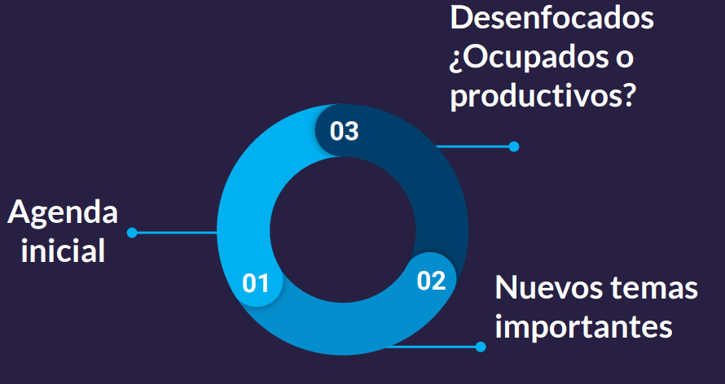
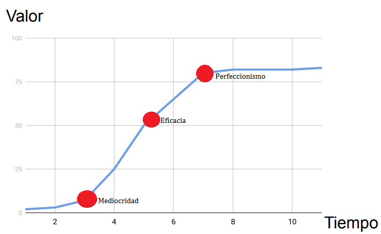
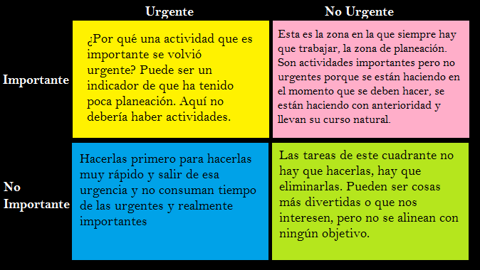

# Gestion Efectiva del Tiempo
### Modulo 1. Conocer los conceptos de la gestión del tiempo
#### Clase 1 *Expert Session: gestiona tu tiempo y resuelve tus dudas con Beatriz Ibañez*
#### Clase 2 *Por qué o para qué gestionar el tiempo*
De seguro más de una vez en la semana te sientes abrumado y no sabes por donde comenzar el trabajo que tienes.

En la actualidad hemos desarrollado una sensación de urgencia porque en las tendencias actuales, sentimos que todo va más rápido y que la velocidad aumenta, haciéndonos sentir que debemos cumplir más tareas y nos genera la necesidad de ser más efectivos.
**Tendencias actuales:**
- Desarrollo de tecnología
- Globalización
- Velocidad de los procesos

La gestión del tiempos nos ayuda a entender como comenzar el trabajo. Los procesos y flujos de trabajo han cambiado, pero el tiempo que tenemos es el mismo
Los procesos cambian, la gestión debe cambiar
- Tiempo: 24 horas, 7 días
- Flujos de trabajo: procesos y actividades en todos los aspectos de tu vida.
Debemos enfocarnos en mejorar y optimizar los flujos de trabajo y las tareas que debemos hacer, y así evitar sentirnos inefectivos. Es necesario tomar la decisión sobre que tareas vamos hacer y cuales no son necesarios realizarlas.

*Para tener una optimización eficaz de nuestro tiempo, debemos hacer que la tecnología trabaje a nuestro favor y no sea una fuente de inefectividad*

#### Clase 3 *Productividad*
Multitasking: Multitarea

En el punto uno tenemos una agenda inicial, donde anotamos las actividades que planeamos hacer en esta semana. Punto dos, a lo largo de la semana aparecen nuevas actividades o tareas a realizar. Punto 3, nos desenfocamos por completo y aparece la pregunta; ¿Estamos ocupados o somos productivos?

Ser multitasking nos hace perder el enfoque, nos ocupa y nos quita productividad y no sabemos por dónde debemos empezar. Lo importante es gestionar las distracciones y la perdida de enfoque de tu programación personal.

Producción vs Recursos
La producción son: productos, servicios, clientes, etc.
Los recursos son: mano de obra, materiales, energía, etc.

En términos de gestión personal, la producción son las culminaciones de tareas, proyectos, actividades, etc. Mientras que el recurso seria el tiempo, la salud o incluso tú mismo.

El enfoque de la gestión del tiempo cae en la calidad; al tiempo que tenemos sacarle el mejor provecho para cumplir nuestro compromisos con la mejor calidad y eficacia posible.

*Productividad: cantidad de tareas y resultados que podemos generar vs los recursos y tiempo que empleamos para lograrlo.*

¿Como llegamos al punto de calidad optimizando nuestro tiempo?
La grafica nos enseña tres puntos importantes:
- Mediocre: utilizamos poco tiempo para hacer una tarea y el resultado es de poca calidad
- Perfeccionista: utilizamos más tiempo del necesario para terminar una tarea
- Eficacia: es el tiempo que debemos tratar de lograr. Consiste en entregarle el tiempo necesario para lograr obtener un producto de calidad

***Recuerda: estar ocupado no es lo mismo que ser productivo***

#### Clase 4 *Entiéndete para organizarte*
Todos tenemos el mismo tiempo, pero todos los utilizamos de manera diferente.
***¿En qué utilizas tu tiempo actualmente?***
Sabes cuánto demoras o que proporción de tu tiempo utilizas para estudiar o pasar tiempo con tu familia.
Autoevaluarte te ayudara a ser consciente del tiempo, para que puedas organizarte mejor y crear un mapa para los áreas de tu vida.

***Autoevaluación***
- ¿Cómo es una semana típica en mi vida?
- ¿En qué cosas me comprometo?
- ¿Suelo decir que sí a todo?
- ¿Comienzo una semana reconociendo qué voy a hacer y saber qué es lo que quiero alcanzar?

***¿En qué aspecto de tu vida necesitas gestionar el tiempo?***
No es necesario centrarse en una sola área para gestionar tu tiempo, tu vida es una sola. Para ayudarte, puedes utilizar el mapa de áreas de vida en donde elijes de 3 a 5 áreas principales sobre las cuales quieres trabajar en un término de tiempo.

#### Clase 5 *Metas y áreas de mi vida*
Teniendo las áreas y las metas principales trazadas en nuestro mapa ya se consideran objetivos. Cualquier actividad fuera de nuestro mapa de prioridades no es productiva y nos desenfoca. Con las áreas y metas listas, debemos iniciar a definir las actividades específicas y una tiempo en el que lo vamos a hacer.
Si una meta no tiene unas actividades claras solo se quedará como una intensión.

Después de definir las áreas y metas que debemos abordar, es necesario que definamos unas actividades y tareas específicas. Al tener las tareas y un marco temporal hacemos que nuestras metas sean más realistas y construimos una ruta para ejecutarlas.
#### Clase 6 *Priorización de tareas*
Ya tenemos áreas en que te deseas enfocar, metas u objetivos y un listado de actividades. Pero para lograr ser productivo es necesario que definamos qué es lo importante y qué es lo urgente.
*Urgente:* requieren atención inmediata, desplaza nuestra atención y tiene fecha de entrega.
*Importante:* producen resultados tangibles, están alineadas a una meta o estrategia común y los efectos de no realizarlas son más graves.

- Urgente - Importante: Atender lo más pronto posible. Analizar porque una tarea llego a este cuadrante
- Urgente - No Importante: Atender lo más pronto posible. Analizar porque una tarea llego a este cuadrante
- No Urgente - Importante: Tratar de pasar la mayor cantidad de tiempo en este cuadrante. Idear, planear y ejecutar con tiempo tareas importantes
- No Urgente - No Importante: Eliminar estas tareas. Tareas que resultan atractivas, pero no contribuyen a nuestras metas

La matriz de criterios de priorización también se conoce como Matriz de gestión de tiempo. Esta matriz se popularizo por el libro de los 7 Hábitos de la gente altamente efectiva de Stephen R. Covey. Covey afirma que más que gestionar el tiempo debemos gestionar la atención.

***La productividad está ligada a la Regla de Pareto, el 20% de nuestras actividades producen el 80% de los resultado. Las actividades adicionales no generan impacto relevante.***

#### Clase 7 *Administración de tareas compartidas*
La administración de tareas compartidas difiere un poco de tienes un equipos y necesitas delegar tareas, y organizar las tareas de tu equipo. Nos enfocaremos en las tareas que tú puedes organizar y realizar

Tipos de tareas
- Individuales
- Otros dependen de mí
- Yo dependo de otros

Las tareas individuales depende únicamente de ti, tú te las propones y tú mismo las realizar. Si otros depende de mí, en general se encuentra en las oficinas, otros no pueden realizar una tarea sin tu parte. Lo contrario es si dependes de otro, significa que no puedes seguir sin las partes de otras personas.

Seguimiento
- Otros me hacen seguimiento
- Hago seguimiento a otros

El seguimiento es el espacio en donde buscamos a otras personas o que otra persona nos busca y esto quita tiempo, por lo cual es necesario reducir al máximo el espacio para esto. Debemos hacer el seguimiento algo efectivo, que pueda ser solucionado en el primer canal de comunicación y utilizando el menor tiempo posible. Cuando tenemos actividades de dependencia es vital que se genere un orden de actividades en un sistema definido, sencillo y que no requiera de mucho tiempo. Es importante tener un calendario general con actividades según prioridad, responsabilidades y fechas clave. Algunas estrategias que pueden servir son: crear recordatorios, tableros de trabajo y seguir herramientas colaborativas que simplifiquen el seguimiento y la ejecución.

#### Clase 8 *Estrategias para realizar seguimiento*
Adicional a estar atento a lo que debes entregar a otras personas y lo que tienes pendiente por recibir, es importante que estas actividades las hagas de una forma organizada e intencional. Que manejes algún sistema definido, que sea sencillo y que no tengas que dedicarle mucho tiempo extra, será clave para sacarle provecho a tu tiempo y el de otros.
Mi recomendación es, crear un calendario general a la hora de repartir responsabilidades y reflejar estas fechas clave en las agendas de todos. Tener claro la precedencia de las tareas, en que orden deben ser realizadas con prioridades y registrar en tu agenda tanto la fecha de entrega, como la fecha en que vas a realizar tu parte.

Algunos tips cuando alguien debe entregarte una tarea, son:
- Crear recordatorios para preguntar a otros sobre las entregas pendientes.
- Usar boards de trabajo conjunto con notificaciones.
- Seguir una herramienta colaborativa de trabajo que simplifique el seguimiento y la ejecución.

#### Clase 9 *Procrastinación e indecisión*
***¿Qué es procrastinación?***
La procrastinación hace que pospongamos actividades y desviar la atención en actividades más gratificantes que son ladrones del tiempo.

***¿Qué puedo hacer?***
- Precisa qué personas, actividades, gustos me distraen o me hacen dudar
- Eliminar interrupciones
- La mejor manera es afrontar las cosas
- ¿Ladrones del tiempo?

***Ladrones de tiempo***
- Pereza
- Videojuegos
- Internet
- Redes sociales
- Televisión
- Algunas personas

***GTD - Organízate con eficacia***
David Allen desarrolló la metodología GTD en su libro Organízate con eficacia. Evitar la procrastinación requiere de disciplina. Si identificamos una distracción es importante eliminarla. Todo lo de las listas GTD es importante y lo debe realizarse.

GTD
- Mayor productividad
- Descargar la memoria
- Listas de cosas a completar
- Disciplina
- Igualdad en importancia

La metodología de Getting Things Done (GTD) nos da cuatro preguntas para evaluar la lista
- ¿Puedo borrarlo sin hacer nada?
- ¿Es información que debo guardar como referencia?
- ¿Puedo delegarlo en alguien?
- ¿Puedo hacerlo inmediatamente en menos de 2 minutos?

También se enfoca en cinco fases de trabajo que son:
- Recopila
- Procesa
- Organiza
- Revisa
- Haz

***Procrastinación: Acción de aplazar tareas.
Ladrones de tiempo: Actividades, personas o cosas que te distraen. La única forma de salir de una tarea es afrontándola.***
