# Curso de Introducción a Java SE
## Modulo 1. Conocer a Java como lenguaje de programación
### Clase 1 *¿Qué es Java?*

¡Te damos la bienvenida al Curso Básico de Java SE!

La profesora será Anahí Salgado quien nos transmitirá en este curso la razón de ser del lenguaje, comprenderemos todos los problemas y veremos cómo Java ha tomado una posición de no quedarse atrás para dar una mejor propuesta como lenguaje de programación.

Este curso de introducción es tan solo el primer paso en toda una carrera que se necesita para entender Java Standar Edition, pero poco a poco iremos viendo cómo se compone ya que Java tiene dos categorías o versiones: la Categoría Standar y la categoría Enterprise.

**Ruta de aprendizaje para la categoría Standar Edition**

1. Curso Básico de Java SE
2. Curso de Java SE: Orientado a Objeto
3. Curso de Java SE: Programación Funcional

Java se compone de varias cosas y en este momento estamos aprendiendo el primer nivel de la categoría SE. Aquí veremos la sintaxis del lenguaje, como declarar una variable, trabajar con bucles y condiciones, las funciones, entre otras cosas. Básicamente todo lo que tenga que ver con los fundamentos del lenguaje en sí. Es más, si ya tenemos conocimiento sobre programar este curso es perfecto para aplicar lo aprendido, poner esos conocimientos en práctica en otro lenguaje, aprender un nuevo lenguaje este curso también funciona, o solo quieres afianzar más tus conocimiento sobre esos fundamentos que ya conoces. Además, estaremos viendo mucho sobre la lógica de programación, un poco de algoritmos y todo aplicado a Java.

Sabemos que Java por naturaleza es orientada a objeto y si no lo sabes no debes preocuparte porque lo estaremos viendo a detalle en la segunda parte de la ruta de aprendizaje Java Standar Edition. Será un curso puramente orientado a objetos donde veremos desde en cómo debemos pensar y hacia donde tenemos que ir, hasta como resolver problemas con esta filosofía orientada a objetos.

Y por si fuera poco, Java como tal no es un lenguaje funcional, pero tiene características de los lenguajes orientados a la programación funcional y eso lo estaremos viendo en la última parte de esta ruta. Profundizaremos todo en Java SE edición programación funcional donde veremos otra forma de pensar, otro paradigma y en como las reglas del juego cambian en programación funcional.

Recuerda, esto es tan solo el primer paso de todo lo que nos espera en nuestra travesía con Java. Pero…

**¿Qué es Java?**

Java es un lenguaje de programación que nos servir para aplicar algoritmos y resolver problemas. Fue creado en 1991 por James Gosling, quien en realidad es una persona bastante interesante.

James Gosling es uno de esos nerd vintage que tenían otra forma de pensamiento y que quería impulsar la programación para que fuera alcanzable, que todos pudieran hacerlo y que además sus programas pudieran llegar lo más lejos posible. Ese era su forma de pensamiento y por eso creo Java como un lenguaje de programación multiplataforma que pueden correrlo en sistemas operativos Windows, Mac, Linux e incluso sistemas operativos móviles.

Fue empleado de Sun Microsystems en donde empezó toda la magia, ahí creo Java y después James se convirtió en el vicepresidente de la compañía. Tenía una filosofía bastante interesante al querer alcanzar muchos dispositivos y poner la programación al alcance de todos. Luego, en 2009, Sun Microsystems es comprada por Oracle y es aquí donde las cosas comienzan a ponerse un poco confusas para Java en cuanto a su filosofía. Desde que Oracle compra Java vinieron una serie de cambio al que muchos programadores no estuvieron tan de acuerdo, sin embargo, tener el respaldo de una compañía tan grande aseguraba que Java sea mejor mantenido, que diera mejores soportes y se vuelva mucho más empresarial.

Mientras estuvo involucrado con Oracle, James Gosling realmente no se sintió tan a gusto ya que sus filosofías, sus paradigmas de vida y formas de pensamientos eran completamente distintas. Así fue como en 2010, James Gosling decidió salirse de Oracle, y declaro en su blog personal la siguiente frase:
«Casi cualquier cosa que pudiera decir es honesta y haría más daño que bien»

En realidad, James Gosling no quería decir nada más acerca de lo que estaba sucediendo ahí dentro, pero sabemos que este hecho y el hecho de que ahora Java le perteneciera a Oracle traía un antes y un después en la vida de este lenguaje.

Java además es un lenguaje de programación de alto nivel. ¿Qué significa que sea de alto nivel?

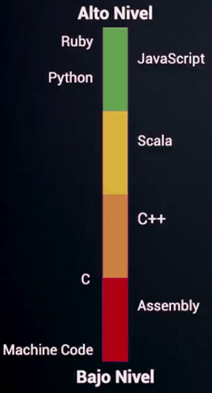

Teniendo en cuenta nuestra escala similar a un termómetro de colores podemos decir que un lenguaje de bajo nivel está compuesto por los lenguajes máquina (que es el sistema de códigos directamente interpretable por un circuito microprogramable) como ensamblador, de echo toda la zona roja le pertenece al ensamblador y un pedacito le pertenece al lenguaje C. Toda esa zona en rojo es considerada de bajo nivel y así se va subiendo hasta una zona de más alto que es un lugar donde es mucho más fácil programar, son los lenguajes de programación que mucho más modernos, fáciles de manipular en términos de memoria, optimización de recursos o en términos de simplemente declarar una variable es mucho más sencillo hacerlo en estos lenguajes que si lo hiciéramos en un lenguaje de bajo nivel.

Java se encuentra más o menos en la escala de amarillo, no es tan natural como un lenguaje de alto nivel como lo son Ruby o Python que son lenguajes bastante sencillo de entender. Entonces, podemos decir que un lenguaje de alto nivel es un lenguaje fácil para la comprensión humana, que facilitan el comunicarse con el humano y después hacer su magia para llegar hasta el bajo nivel.

**Categorías de Java**

Como ya lo hemos dicho, Java esencialmente tiene dos categorías: Java Standar Edition y Java Enterprise Edition. Ya vimos una ruta de aprendizaje para entender cómo funciona Java SE, pero lo que no sabes es que Java EE también cuenta con su propia ruta.

Es muy importante que aprendas primero muy bien la parte Standar de Java, toda la base del lenguaje y la sintaxis para desarrollar aplicaciones. En la parte Standar básicamente estaremos desarrollando aplicaciones de escritorio o consola, mientras en la parte de Enterprise las aplicaciones tendrán su lugar mucho mejor en la web, es mucho mejor en servidores ya que son aplicaciones mucho más distribuidas y cuya interacción con el usuario es mucho más amigables. Entonces digamos que la parte de Java Standar es como un primer nivel para llegar al siguiente que es Java Enterprise.

Nos enfocaremos mucho en el lenguaje, especialmente porque Java tiene la filosofía «Write Once, Run Anywhere» o WORA que significa que lo aprendido aquí en la versión estándar puede ser llevado a la versión enterprise. Es decir, lo que escribas en Java lo puedes correr en cualquier lugar y en cualquier sistema operativo, por eso Java es interoperable, multiplataforma.

### Clase 2 *Versiones de Java y JDK*

Cuando comenzamos a aprender Java la primera cosa rara con la que nos encontramos es el Java Development Kit o JDK que se compone de los tres elementos siguientes:

- Java Runtime Environment (JRE)
- Compilador de Java
- APIs de desarrollo

La parte más importante es la del JRE, es la máquina virtual que permite a Java ser multiplataforma, que al escribir el mismo código funcione igual en todos los dispositivos y sistemas operativos. Sin este elemento, la filosofía de «Write Once, Run Anywhere» no podría ser posible. Además, si bien decimos el JRE equivale a la máquina virtual, en realidad se compone de otros elementos más como algunas bibliotecas que hacen funcionar la máquina virtual entre otros. Sin embargo, JRE siempre estará asociado a la máquina virtual, quien es el que crea la magia multiplataforma.

El segundo elemento que trae consigo el JDK es el compilador de Java, el encargado de hacer que nuestro programa escrito en lenguaje Java sea traducido al lenguaje bytecode que finalmente es interpretado por la máquina virtual. Es decir, el compilador de Java toma el lenguaje de Java y lo traduce a algo que la máquina virtual si pueda ejecutar y leer.

Otro elemento también muy importante y el más interesante de todos son las API (Application Programming Interface) de desarrollo. Estas API de desarrollo son la base que nos proporciona el lenguaje de programación para nosotros crear nuestros propios lenguajes, es decir, cuando estamos programando con Java no vamos a partir de cero, si no que ya vamos a tener una base de elementos ya listo para que lo tomemos y creemos nuestros programas. Las API han ido evolucionando y se le fueron agregando elementos conforma va siendo las necesidades de la modernidad y la tecnología hoy en día.

**Tabla de versiones de Java**

Esta es una tabla con todas las versiones de Java que existen hasta hoy, puede ser que en el momento en que veas esta clase se hayan añadido algunas otras, pero en general estas son las versiones más importantes de Java.

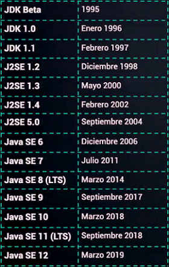

Notaremos que tenemos estos nombres particulares:

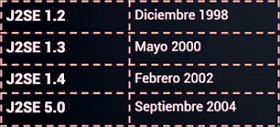

Y eso se debe a que esas versiones fueron llamadas Java 2 Platform Standar Edition, también existen en otras categorías como el Java 2 Platform Enterprise Edition. Fueron creadas hace mucho tiempo y existieron con ese nombre hasta el 2004.

Desde la versión Java SE 6 es cuando comenzó a llamarse Java Standar Edition acortando el nombre y también fue la primera versión que se promovía para ser una versión más robusta, para ambientes de producción, profesionales o de desarrollo. Además, a partir de esta versión comenzó a popularizarse Java ya que las compañías empezaron a adquirirlo como parte de su ambiente de desarrollo y fue aquí donde la oferta laboral para Java exploto y se necesitaba mucho programadores que supieran a partir de esa versión.

No es hasta a partir del año 2017 con la versión 9 que tenemos una versión muy interesante y controversial, pero también importante para la comunidad de Java porque en esta versión se anunció que las actualizaciones se estarían haciendo cada seis meses.

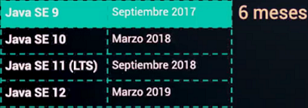

Esta noticia trajo sentimientos encontrados porque si analizamos el listado de fechas podemos fijarnos que desde la versión 8 en 2014 tuvieron que pasar aproximadamente tres años para que existiera una nueva actualización y así debíamos de esperar años para que saliera una nueva versión, y esto no le gustaba a los programadores porque sentían que el lenguaje se quedaba atrás con respecto a otros lenguajes de programación, así que este tipo de programadores fueron quienes se alegaron porque ahora tendrían cada seis meses una actualización del JDK. Pero esto traía más dolores de cabeza de lo que se pensaba ya que si existiera una actualización del lenguaje cada seis meses, esto iba a provocar algunas incompatibilidades entre las versiones anteriores y sería muy difícil darle soporte a las versiones anteriores porque cada seis meses tendrían que estar actualizadas, habría cambios en los códigos y estar dándole mantenimiento.

Para solucionar estos problemas Java creo la versión LTS o Long Term Support que son versiones que tendrían soporte por tres años.

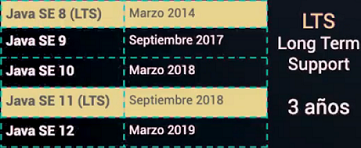

Sin embargo, se continuaría teniendo las versiones que salen de manera inmediata cada seis meses con pequeños detalles, porque en realidad no son tantos cambios, sino que son pequeños detalles al lenguajes los que se cambian. Pero tener una versión que cada tres años se le da soporte es muy común en lenguajes de programación o sistemas operativos que son precisamente del tipo open source. La última versión registrada del tipo Long Term Support, que son versiones en las que realmente podemos confiar precisamente porque tenemos más soporte, es la versión 11 y esto puede ser comprobado en la página de [Education Oracle](https://education.oracle.com/oracle-certification-path/product_267 "Education Oracle").

Pero no todo está bien con Java y es aquí donde comienza a ponerse duro y complicado pues la versión 11 es la primera versión de Java con licencia. Es aquí donde comienza a ponerse interesante, y es que Oracle comienza a cobrar una licencia por el uso de Java, aunque hay algunos detalles que si nos permite utilizarlo de forma free.

Solamente podemos usarlo Free (gratis) en ambientes de desarrollo y de testing, estas son las única forma, pero si es que nosotros queremos llevarlo a un ambiente de producción, porque este es el principal uso de Java en compañías grandes que lo manejan en producción, tendremos que pagar y estas son las [cifras registradas](http://www.oracle.com/us/corporate/pricing/price-lists/java-se-subscription-pricelist-5028356.pdf "cifras registradas"):

- 2.5 USD al mes por usuario de escritorio.
- 25 USD por procesador para aplicaciones de servidor.

Y es aquí donde la comunidad y el ideal del cual fue concebido Java tiene mucho más peso. La comunidad de Java había creado desde hace muchos años la versión open source del JDK, una versión realmente gratis donde podemos utilizar Java en ambientes de producción o de desarrollo. Básicamente [OpenJDK](https://openjdk.java.net/ "OpenJDK") es la versión open source de Java Standar Edition que existe desde hace mucho más tiempo del que creemos, pero que se ha comenzado a ser conocida por el cobro de licencia.

Existe desde la versión Java SE 6, lo ha impulsado Sun Microsystems en el año 2006 y esto es una ventaja y una desventaja porque ya no dependemos de una compañía como tal si no de una comunidad, pero una comunidad fuerte que está siendo apoyando mucho por la compañía Red Hat. Sin embargo, la comunidad es bastante madura y tiene mucha experiencia, y se están tomando muy enserio este proyecto.

Entonces, OpenJDK es un proyecto en el que podemos confiar, aportar si es que queremos aunque no es tan sencillo pues debemos pasar por dos ingenieros; uno es de Sun Microsystems y otro de Oracle que realizaran la revisión del código. Pero, en general, la comunidad está ahí aportando y las personas que están haciendo este JDK están muy comprometidas con esto y están dándole bastante soporte a este proyecto.

### Clase 3 *Las herramientas más usadas de Java*

Es importante que veamos cómo se encuentra Java en cuanto a su uso, las herramientas que existen para programar y como la gente está adoptando las nuevas versiones de JDK que existen, si es que las personas en los ambientes de producción lo están adoptando fácilmente.

No solo veremos las herramientas en el ambiente de escritorio con Java, sino que también veremos algunas con la parte distribuida de Java en los ambientes de servidores.

**¿Cuáles son las herramientas más usadas en Java?**

En cuanto a la adopción de versiones de Java tenemos la siguiente gráfica:

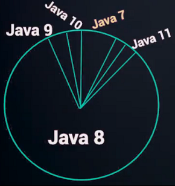

Estas son estadísticas recabadas hasta inicios del 2019 que fue donde obtuvimos la nueva versión, Java 12. En el gráfico podemos ver que la mayoría de los ambientes están definidos con Java 8, es decir, la mayoría de las compañías que están adoptando JDK en sus ambientes de desarrollo es con la versión 8 de Java la cual es la última versión LTS "gratuito", sin licencia. Sin embargo, esta versión solo tendrá soporte hasta diciembre del 2020, a partir de ahí el soporte se comenzara a adquirir con licencia como se hizo con Java 11.

Observando la gráfica podemos ver una adopción menor en la versión 11, que es la segunda LTS de Java. Además de una adopción nula con la versión 12 que de hecho ni siquiera aparece. La versión 7 también es bastante utilizada, pero en definitiva la versión Java 8 es la más querida y con esto anunciamos que durante el transcurso del curso estaremos hablando de las dos versiones, Java 8 y Java 11.

¿Por qué ambas versiones? Pues, porque desde la versión 10 de Java se trajeron algunos cambios interesantes que es algo que la comunidad e incluso desarrolladores cuyo fuerte no es Java ha empezado a demandar: la inferencia de los tipos de datos. En la versión 10 tenemos una modificación a la forma en como declaramos variables y es por esto que estaremos viendo las dos versiones. Estaremos utilizando principalmente de Java 8 para lo que necesitamos del curso, de hecho podríamos estar haciendo completamente el curso con esta versión, pero dado el cambio en la declaración de variables que tenemos a partir de Java 10 también estaremos viendo la versión 11 LTS. Por supuesto, estaremos usando OpenJDK y veremos su instalación.

En cuanto a servidores tenemos otro tipo de ambiente y solo será dejado como dato curioso. La versión más utilizada para construir proyectos web es Maven y la alternativa, como principal competidor esta Gradle. De hecho, Maven es bastante grande, casi el doble de Gradle, pero hasta el día de hoy ambos son usados en la construcción de proyectos web. 

- **Maven:** Es una de las herramientas más útiles a la hora de utilizar librerías de terceros. Maven se utiliza en la gestión y construcción de software. Posee la capacidad de realizar ciertas tareas claramente definidas, como la compilación del código y su empaquetado. Es decir, hace posible la creación de software con dependencias incluidas dentro de la estructura del JAR.
- **Gradle:** Es una herramienta de automatización de la construcción de nuestro código que bebe de las aportaciones que han realizado herramientas como ant y maven pero intenta llevarlo todo un paso más  allá. Para empezar se apoya en Groovy y en un DSL (Domain Specific Language) para trabajar con un lenguaje sencillo y claro a la hora de construir el build comparado con Maven. Por otro lado dispone de una gran flexibilidad que permite trabajar con ella utilizando otros lenguajes y no solo Java. Dispone por otro lado  de un sistema de gestión de dependencias sólido.

En cuanto a frameworks de trabajo en el tema de servidor con Java Enterprise es Spring. Es muy importante aprender Spring con Hibernate, y específicamente las versiones más utilizadas son la versión 2 y la versión 1.5.

- **Spring:** Es un framework de código abierto para la creación de aplicaciones empresariales Java, con soporte para Groovy y Kotlin. Tiene una estructura modular y una gran flexibilidad para implementar diferentes tipos de arquitectura según las necesidades de la aplicación.
- **Hibernate:** Es una herramienta de mapeo objeto-relacional (ORM)  que facilita el mapeo de atributos en una base de datos tradicional, y el modelo de objetos de un aplicación mediante archivos declarativos o anotaciones en los beans de las entidades que permiten establecer estas relaciones. Es decir, que agiliza la relación entre la aplicación y nuestra base de datos SQL, de un modo que optimiza nuestro flujo de trabajo evitando caer en código repetitivo.

**Entornos de Desarrollos Integramos**

Un entorno de desarrollo integrado (IDE del inglés Integrated Development Environment ) es un sistema de software para el diseño de aplicaciones que combina herramientas del desarrollador comunes en una sola interfaz gráfica de usuario.

Realmente no necesitamos de un IDE para programar con Java ya que podemos hacerlo simplemente usando el bloc de notas y guardando los archivos con la extensión .java, y utilizando la terminal de línea de comando. Pero las IDE's existen porque precisamente tienen integrado el editor de código, compilador, depurador y constructor de interfaz gráfica para aquellos programas que estén trabajando con la parte interfaz gráfica de Java.

Hay bastante competencia en cuanto a IDE, pero la "oficial" y la cual Oracle recomienda es NetBeans. En cambio, la comunidad apoya mucho a Eclipse, llego al punto de que era considerado el #1 entre los tres competidores. Sin embargo, IntelliJ IDEA se ha impulso mucho con un editor de código inteligente y es particularmente el favorito de todos los desarrolladores que trabajan con Java y necesitan una forma más fácil de programar, por lo que en cuestión de estadísticas es IntelliJ IDEA el ganador.

La adopción más sencilla para un IDE es con IntelliJ IDEA, además de que cuenta con una versión gratuita y una versión comercial. Aunque cabe mencionar que tanto Eclipse como NetBeans también cuentan con sus versiones gratuitas.

### Clase 4 *Creando un entorno de desarrollo en Java en Windows*

Es momento de crear un entorno de desarrollo en Windows. Para eso vamos al sitio oficial de [IntelliJ IDEA](https://www.jetbrains.com/idea/download/#section=windows "IntelliJ IDEA"):

Como podemos ver tenemos las dos versiones. Ultimate es la versión de paga, mientras que la versión gratis y la cual descargaremos es la Community. Damos click en Download para que comience la descarga.

Mientras esperamos que termine vamos a sitio de para descargar nuestro [JDK](https://adoptopenjdk.net/ "JDK") y ahí vamos a descargar las dos versiones del JDK que estaremos ocupando durante el curso:

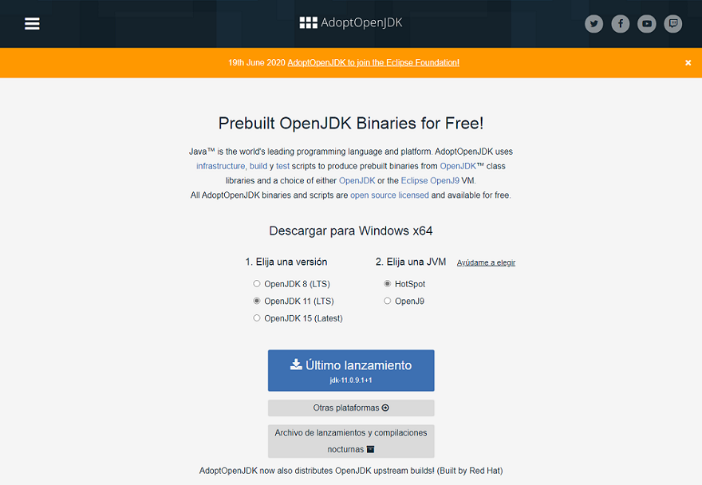

Seleccionamos la versión 8 LTS y damos click en el botón azul para empezar la descarga. Una vez finalizada la descarga, repetimos ese proceso para descargar la versión 11 LTS.

**Instalación de IntelliJ IDEA**

Vamos a la carpeta donde esta descargada el instalador, damos click derecho y "Ejecutar como administrador", o simplemente doble click sobre el archivo de instalación, después nos aparece una ventana que nos pide permiso para que la aplicación realice cambios en la computadora:

Aceptamos y nos aparece la ventana de instalación, damos click en Next:

Nos aparece el directorio donde se instalara el programa, damos click en Next nuevamente:

Usaremos la opción por defecto, así que Next:

Damos click en Install:

Y ya comienza la instalación:

Al terminar la instalación damos simplemente click en Finish:

**Instalación del JDK**

Damos doble click sobre el archivo y nos aparece la ventana de instalación, damos click en Siguiente:

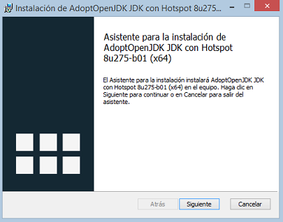

Aceptamos los términos de la licencia y después damos click en Siguiente:

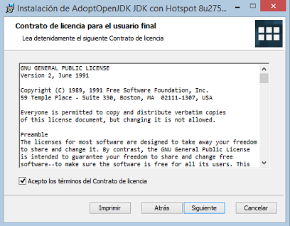

Damos click en Siguiente:

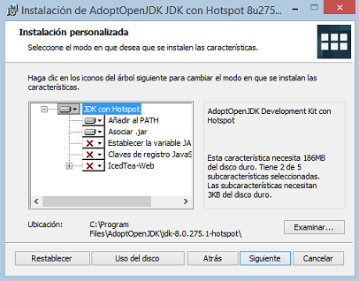

Damos click en Instalar:

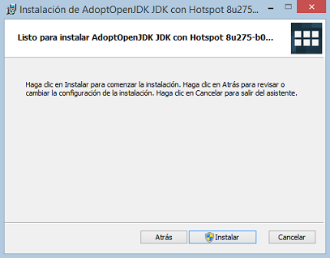

Nos saltara una ventana para pedirnos el permiso, aceptamos y ya comienza la instalación:

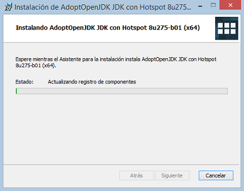

Y al terminar simplemente damos click en Finalizar:

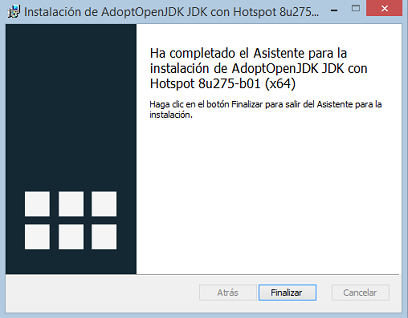

Ya tenemos el JDK versión 8 en nuestras computadoras. Repetimos este proceso para la versión 11.

**Utilizando IntelliJ IDEA**

Cuando ejecutamos el programa nos parece la licencia de JetBrains, aceptamos y damos click en Continue:

Después nos pregunta si queremos compartir datos, esto ya depende de cada persona en mi caso le doy a Don't Send para no compartir:

Una vez hecho todo eso, IntelliJ IDEA nos dará la bienvenida:

¿Qué significan los botones del costado?

- **Projects:** Podemos empezar un nuevo proyecto, abrir uno u obtener desde VCS que es un sistema de control de versiones.
- **Costume:** Aquí podemos realizar cambios en la apariencia, elegir un tema Light o Darcula dependiendo de los gusto, cambiar el tamaño de fuente y demás.
- **Plugins:** Los complementos que podemos instalar para ampliar nuestra funciones.
- **Learn IntelliJ IDEA:** Para aprender más sobre el programa.

**Creando proyecto con IntelliJ IDEA**

Ya podríamos crear nuestro primer proyecto con IntelliJ IDEA. Para eso damos click en New Project:

Seleccionaremos  nuestra SDK, para eso en la parte superior donde dice Project SDK, abrimos y elegimos Add JDK:

Vamos a la carpeta donde tenemos guardado nuestro JDK y elegimos la versión 8, y damos click en Ok:

Hacemos lo mismo con la versión 11 y ya está:

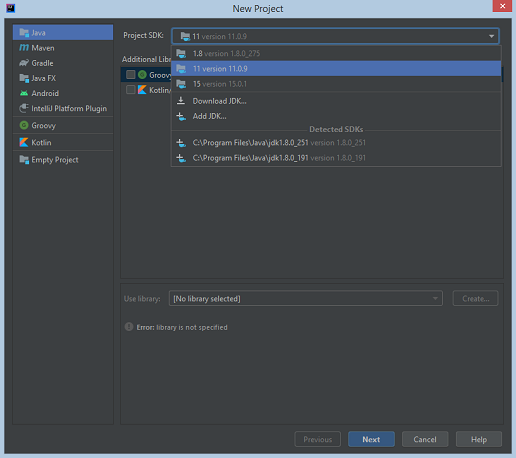

Tenemos las dos versiones del JDK para comenzar a trabajar en nuestros proyectos.

### Clase 5 *Creando un entorno de desarrollo en Java en Mac*

Es momento de instalar IntelliJ IDEA y OpenJDK en los sistemas operativos MacOS, para eso vamos a los mismo sitios web y descargamos los instaladores.

**Instalación de IntelliJ IDEA**

Damos click al instalador y nos saldrá una ventana:

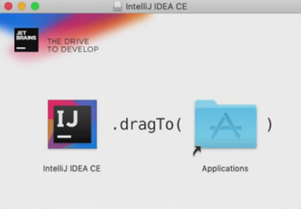

Lo único que debemos de realizar es arrastrar el icono a la ventana de aplicación:

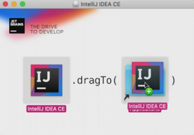

Esperamos a que nos copie todo:

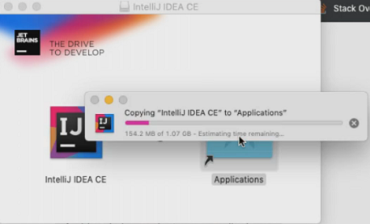
 
Una vez que se termine lo podemos encontrar entre las Aplicaciones y lo podemos abrir:

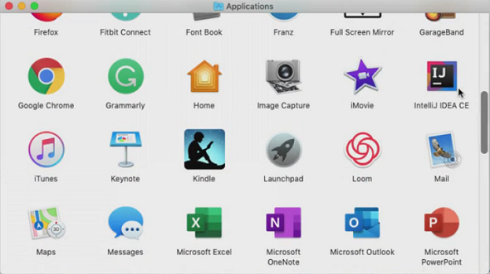

Nos saltara una ventana de mensaje y damos click en Open para que nos abra el programa:

**Instalación del JDK**

Damos click sobre el instalador y nos aparecerá una ventana de asistente. Hacemos click en Continue:

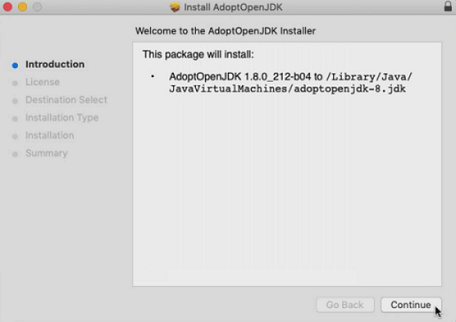

Click en Continue:

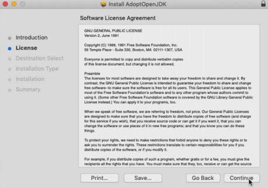

Click en Agree para aceptar la licencia:

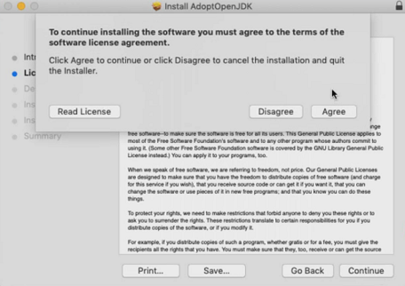

Click en Install y es ahora cuando comienza a instalarnos el JDK:

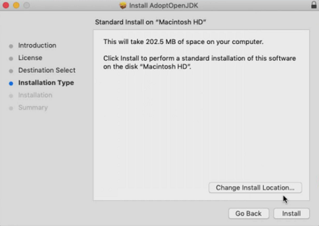

Tal vez en algún momento te pida la contraseña para que se pueda instalar un nuevo programa o no lo haga dependiendo de la configuración. Esperamos unos momentos y ya nos terminó de instalar por completo el JDK:

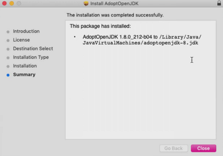

Finalizamos nuestra instalación del JDK versión 8 y repetimos el proceso para la versión 11.

**Utilizando IntelliJ IDEA**

Cuando abrimos el programa nos aparecerá una ventana con la licencia de JetBrains, aceptamos y damos click en Continue:

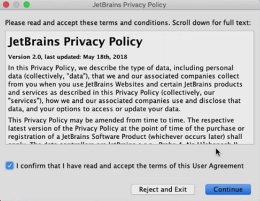

Después nos pregunta si queremos compartir datos, esto depende de cada quien, pero en nuestro caso damos click en Don't Send para rechazar:

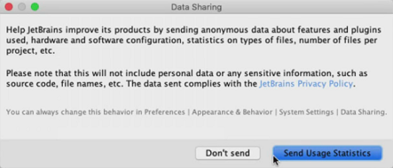

Lo siguiente que veremos es la ventana para elegir el tema que queremos. Elegimos uno de nuestra preferencia y damos click en Next:

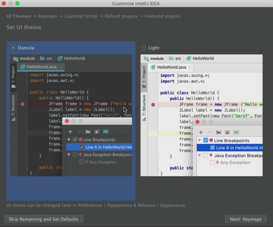

Damos click en Next a todas las siguientes ventanas:

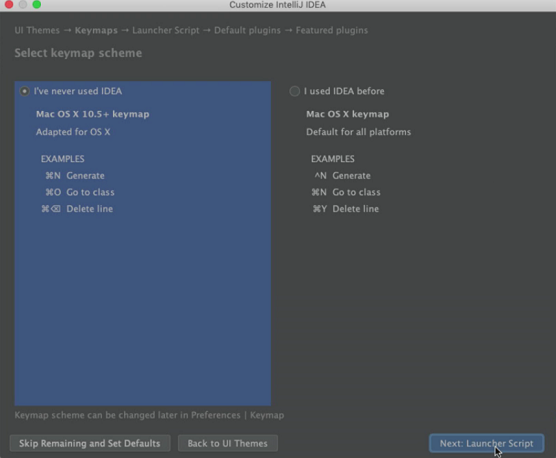

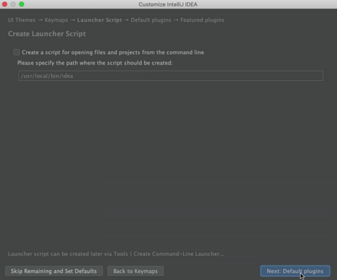

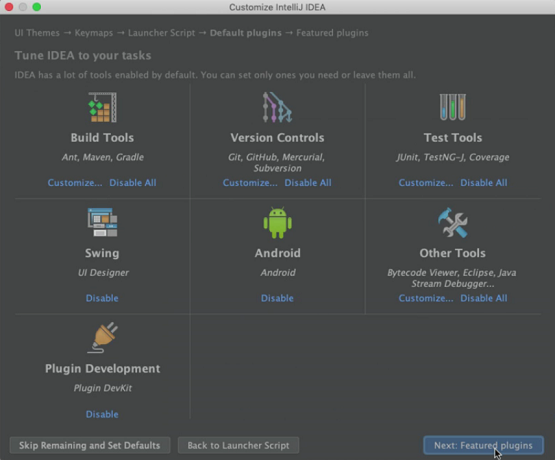

Aquí damos click en Start Using IntelliJ IDEA:

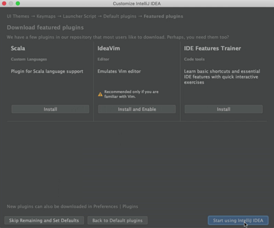

Con esto ya nos abrirá nuestro programa y ya tenemos listo nuestro entorno de desarrollo en Mac:

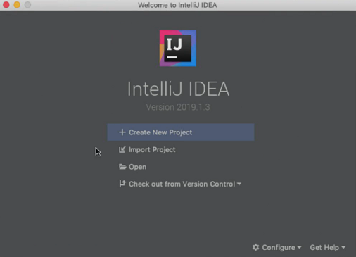

***NOTA: Dado que utilizaremos la configuración por defecto del programa todo fue Next y no tuvimos que hacer ningún cambio.***

### Clase 6 *Creando un entorno de desarrollo en Java en Linux*

Si tú eres usuario de Linux, a continuación aprenderemos a instalar Java OpenJDK en la versión Ubuntu.

Abre tu terminal de la siguiente forma:

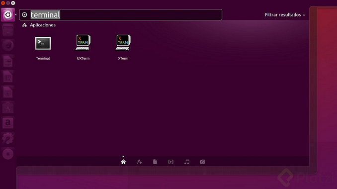

Selecciona el que dice: **Terminal**

Nota: A partir de ahora necesitarás tu contraseña de usuario **root**

Una vez abierta comenzaremos actualizando los paquetes del sistema para evitar cualquier error con los siguientes comandos:

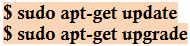

Esto puede demorar un poco.

**Instalando OpenJDK 8**

Simplemente corre el siguiente comando:

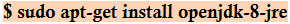

Listo te pediará algunas confirmaciones, responde S y a partir de ese momento quedará instalado.

**Instalando OpenJDK 11**

Como es una versión nueva debemos añadir un repositorio para poder descargar el paquete de ahí mismo. Lo hacemos de la siguiente forma:

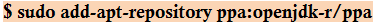

Actualiza con el siguiente comando:

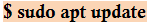

Ahora sí ya podemos descargar el paquete de la siguiente forma:

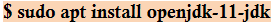

Cambia la versión de Java que desees en ese momento
Verifica la versión de Java que tienes instalada

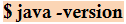

Para cambiarla escribe el siguiente comando

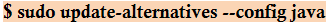

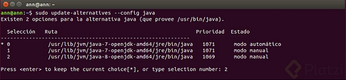

Solo como confirmación vuelve a revisar la versión para verificar que se haya cambiado.

### Clase 7 *Escribe tu primer Hola Mundo en Java*

Ahora que ya tenemos listo nuestro entorno de desarrollo ya sea en Windows, Linux o Mac es hora que hagamos nuestro primer 'Hola Mundo'. El «Hola Mundo», que se hace comúnmente en cualquier lenguaje de programación, es el primer programa y consiste en tan solo imprimir un texto y mostrarlo en la consola. Este programa sirve para entender y verificar que nuestro entorno de desarrollo está totalmente configurado y que además estamos aprendiendo un poco más las bases del lenguaje, para eso sirve un Hola Mundo.

Si queremos comenzar con un Hola Mundo debemos partir de los archivos van a ser reconocidos por tener la extensión **.java**. Los archivos de Java literalmente van a ser archivos con una extensión como esta, por lo tanto cuando creamos un archivo lo que deberíamos ver es un archivo como este:

Y para crearlo usaremos nuestro entorno de desarrollo, pero no está de más decirte que algunas veces podrías estar trabajando este HolaMundo así de simple y sencillo con un editor de código y tu consola de comandos. Podrías crear un archivo **HolaMundo.java**, escribir las líneas de código que veremos a continuación, compilarlo y entonces obtener el resultado. Pero nosotros tenemos listo nuestro IDE y lo haremos aquí.

Lo primero por lo que debemos partir antes de encontrarnos con palabras desconocidos es el Método Main. El **Método Main** es el punto de entrada en la aplicación Java, no es exclusivo del lenguaje ya que otros lo manejan como Kotlin (que está basado en Java), Dart y también en Python existe algo similar al método Main. En general, el método Main es una palabra que traducida significa principal y que ambos van a compartir un método que sirve para ser el método de entrada para la aplicación, es por donde comenzara el programa y lo primero que se ejecutara cuando el programa este corriendo.

Un método main en Java luce de la siguiente manera:

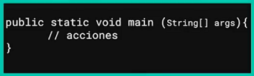

- **// acciones:** Son todas las acciones que queremos que nuestro programa realice, todo lo que deseamos que viva en el programa lo ponemos ahí dentro.

Entonces, si nosotros por alguna razón olvidáramos escribir este método main y corriéramos nuestro programa, lo que nos va a saltar es un error como este:

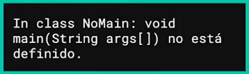

Por eso es importante que siempre tener en cualquier programa un método main.

**Nuestro primer código**

Abrimos el programa de IntelliJ IDEA y hacemos click New Projects:

Nos aparece una ventana cuya zona izquierda nos muestra todas las opciones que la versión Community nos da para trabajar:

Entonces, elegimos la versión de Java con la queremos trabajar. En este caso estaremos trabajando con la versión 8, damos click a Next.

Nos aparece esta ventana, también damos click a Next:

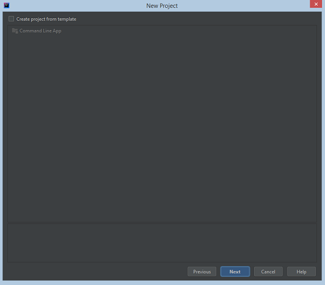

Escribimos el nombre del programa y damos click en Finish:

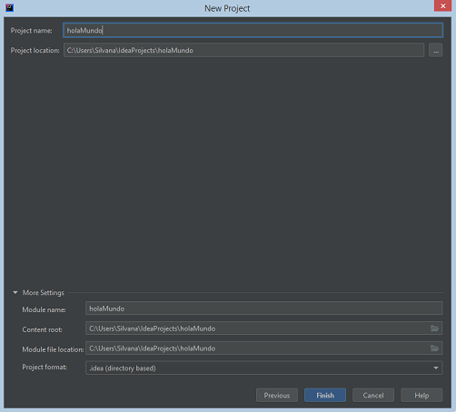

En este momento ya tenemos creado el archivo de nuestro programa, entendamos de que se compone:

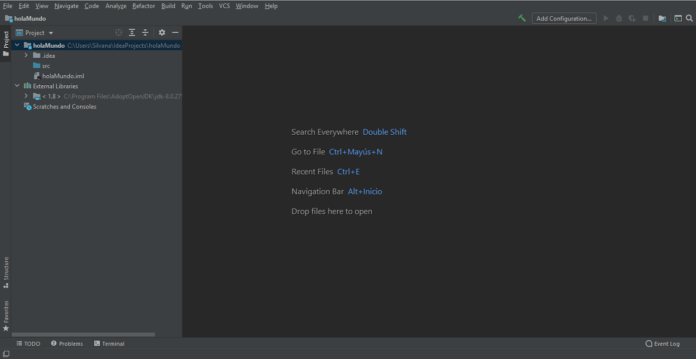

Tenemos:

- **holaMundo:** Es el sistema de archivos, la carpeta principal del archivo donde podemos encontrar algunos archivos que tienen que ver con el IDE.
- **External Libraries:** Es donde están configuradas todas las librerías externas y el JDK se le considera una librería externa.

Para crear nuestra primera clase en Java damos click derecho sobre la carpeta src, vamos a New y ahí seleccionamos Java Class:

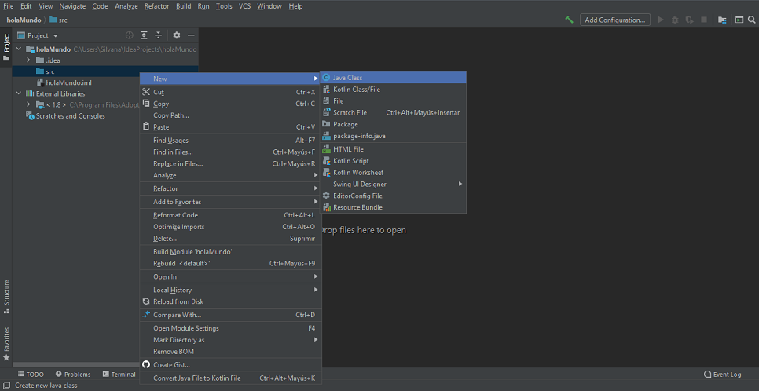

Nos aparece una ventana pequeña donde ponemos el nombre que tendrá nuestro archivo, no es necesario poner la extensión .java porque el programa IntelliJ IDEA lo hará automáticamente, y después presionamos Enter:

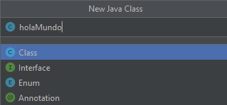

Ahora podemos ver que en la carpeta src nos parece el archivo de holaMundo.java y es momento de trabajar en nuestro código:

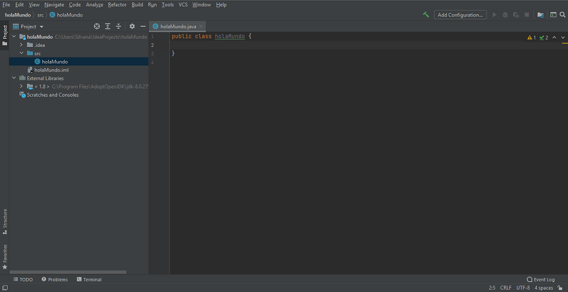

**Hola Mundo**

En la parte del editor de código escribimos nuestro método main y también vemos nuestro primer atajo. Cuando escribimos sou nos saldrá una serie de opciones para imprimir según nuestra necesidad:

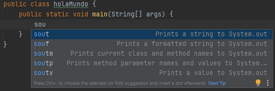

- **sout:** Es el atajo para imprimir una cadena.
- **souf:** Es el atajo para imprimir una cadena formateada.
- **soutm:** Es el atajo para imprimir la clase y el nombre del método actual.
- **soutp:** Es el atajo para imprimir los nombres y los valor del parámetros del método.
- **soutv:** Es el atajo para imprimir un valor.

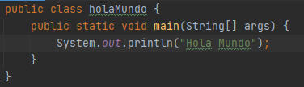

- **public class holaMundo**

	- La primera parte es el modificador de acceso a la clase, en este caso es **public**, es decir, publico y tendremos acceso a él desde cualquier clase o instancia sin importar el paquete o procedencia de ésta.
	- La segunda parte es donde utilizamos la palabra reservada **class** para definir una clase.
	- La tercera parte, **holaMundo**, es el nombre de nuestra clase.
  
- **public static void main(String[] args)**
  
	-  Lo que debes saber en primer lugar es que el método **main()** es el punto de entrada de la aplicación, es decir, es el punto en el que comienza la ejecución de esta. Es por ello que ha de ser **public** (accesible desde fuera de la clase) y **static** (se puede ejecutar sin una instancia de la clase).
	- La palabra **void** indica que el método no retorna ningún valor, solamente imprimirá en pantalla.
	- **String[] args:** Es el parámetro **args** es un array de **String** que debe aparecer obligatoriamente como argumento del método main en un programa Java. Aunque se le suele dar el nombre args, no es obligatorio que este parámetro se llame así, podemos darle el nombre que queramos.
	- **¿Para qué sirve el String[] args?** Es la definición de los argumentos que recibe el método main. En este caso se recibe un argumento. Los paréntesis [] indican que el argumentos es un arreglo y la palabra String es el tipo de los elementos del arreglo. Por lo tanto main recibe como argumento un arreglo de strings que corresponden a los argumentos con que se invoca el programa.
	- **System.out.println():** En Java hay algunos objetos que existen por defecto (como en cualquier entorno de desarrollo). Uno de ellos es el objeto denominado **System.out**. Este objeto dispone de un método llamado **println** que nos permite imprimir algo por pantalla en una ventana de consola.

Para ejecutar nuestro programa damos click derecho sobre el editor y elegimos Run o también podemos presionar, como vemos en la imagen, **Control + Mayúscula + F10**:

Finalmente, en la zona inferior que se conoce como la consola de Java,  podemos ver los mensajes que nos lanzan el compilador:

### Clase 8 *Etapas de la programación en Java*

Si tu primer «Hola Mundo» funciono es momento de celebrar porque todo salió muy bien. Pero la verdad es que lo hicimos todo rápido, trabajamos en el código, lo ejecutamos y nuestro maravillosos IDE nos sopló muchas palabras, ahora nos queda la duda… ¿Qué fue lo que paso realmente?

**Etapas de la programación**

Tenemos la siguiente que nos muestra el proceso por el que paso nuestro programa y es tiempo de analizarlo:

- Lo primero que hacemos es trabajar con nuestro archivo Java. Creamos un archivo con la extensión .java, en este caso holaMundo.java, que será el código fuente del programa. Recordemos que la única funcionalidad, el único objeto que tiene nuestro programa es imprimir un texto.
- Después, cuando nosotros damos click en Run, se activa el compilador. Este comando que se conoce también como javac, si lo estuviéramos utilizando en una terminal, en esta ocasión y gracias a nuestro IDE podemos usarlo simplemente presionando un botón.

	- Lo que sucede realmente es que cuando nosotros damos click a Run se activa el compilador que empieza a analizar nuestro código Java y lo traduce a un lenguaje que la computadora pueda leer para luego finalmente mostrarnos ese mensaje.
  
- Al compilar obtenemos códigos Bytecode y son archivos con extensión .class que contiene un montón de símbolos y cosas raras si es que lo abrimos, pero ese es el efecto del compilador; traducir el código fuente de Java a un lenguaje que pueda ser leído por nuestra computadora a través de la máquina virtual.
- La última fase es la JVM o la Java Virtual Machine que es la encargada de crearnos el efecto multiplataforma que tiene nuestro lenguaje.

Analicemos un poco más detalladamente lo que hicimos:

- Escribimos código fuente con extensión .java.
- Cuando el compilador actúa lo que en realidad hace es compilar el código, analizar y verificar que todo esté bien.
- Luego lo carga, como si esté preparando nuestro archivo .class, da una última verificación para analizar que el archivo .class se haya construido correctamente.
- Finalmente se lo manda al JVM para que lo interprete y, el JVM ejecuta y nos muestra el mensaje de «Hola Mundo».

**Compilado e Interpretado**

Una de las grandes controversias que existen en internet es sobre cómo funciona Java, si es compilado o interpretado, pero la verdad es que este lenguaje es ambos: compilado e interpretado.

Lo que nos da esa idea es eso que sucede dentro del compilador: compilar, cargar y verificar. Ya que existen lenguajes de programación que son únicamente interpretados, como JavaScript o PHP que cuando estamos escribiendo en uno de esos lenguajes y recargamos el sitio se empieza a interpretar línea por línea, y si ocurre un error o algo está mal escrito entonces va a dejar de interpretarse las siguientes líneas o simplemente no nos va a mostrar nada.

Para el caso de los lenguajes compilados lo que asegura la compilación es que esté bien hecha, que al menos no ocurra ningún error de sintaxis, y entonces, cuando la JVM interpreta ese compilado, nos genere la menor cantidad de errores posibles.

**Bytecode**

Volviendo a nuestro entorno de desarrollo, si observamos podemos ver que en el lado izquierdo tenemos la composición de carpetas y archivos que tiene nuestro proyecto, y nos aparece una carpeta nueva. Esta carpeta nueva de hecho está marcándose en rojo y dice "out", si lo abrimos y empezamos a ver lo que tiene dentro podemos encontrar el archivo holaMundo.class.

Si somos curiosos y queremos abrirlo podemos ir al lugar donde este guardado el proyecto, navegar un poco hasta encontrar el archivo, darle click derecho, "Abrir con" y elegimos un programa predeterminado para abrirlo, en mi caso lo abrí con el Bloc de notas. Este es el código que se nos creó a partir del código fuente:

Esto es precisamente el efecto del compilador, el bytecode que lee nuestra máquina virtual, y la capa de seguridad que Java agrega a nuestro programa. No expone el código fuente como en otros lenguajes de programación, lo que si se expone es un bytecode no entendible al ojo humano, pero que sin ser totalmente incorruptible. Si realizamos un poco de ingeniería inversa podemos conseguir el código fuente, por supuesto hay muchos hack para romper la seguridad, pero en general Java se cubre y nos da una capa de seguridad, y es trayendo nuestro archivo .class con el bytecode.

**DATO CURIOSO**

La palabra java (lenguaje de programación orientado a objetos, independiente del sistema operativo usado en aplicaciones de Internet) viene del topónimo Java, una isla de Indonesia, entre Sumatra, Borneo y Bali. Esta isla produce mucho café, de ahí que java, en inglés es sinónimo de café. Los programadores le dieron ese nombre, pues tomaron mucho café cunado crearon este lenguaje.

El nombre de la isla deriva del sánscrito Yavadvipa, compuesto con yava (cereal, cebada) y dvipa (isla).

### Clase 9 *La JShell de Java*

Sabías que Java tiene una herramienta interactiva en dónde puedes ir probando segmentos de código en vez de realizar todo el proceso de creación de un programa en Java. Escribir, compilar y correr.

Su nombre es ***jshell*** y está disponible desde la versión 9 de Java.

Abre tu consola de comandos o terminal, corre el siguiente comando:

**Ejercicio 1**

Investiga cómo cambiar la versión de Java desde tu consola de comandos o terminal y compártenos en la sección de discusiones los comandos que ejecutaste.

**Ejercicio 2**

Asegúrate de tener definida una versión superior a la 8.

Ahora desde tu terminal escribe el siguiente comando para abrir nuestra ***jshell***

Ahora escribe la línea de código para imprimir un texto (no olvides poner ; y dar enter).

## Modulo 2. Trabajar con Variables en Java
### Clase 10 *Variables en Java*

Empecemos por entender de qué se trata las variables porque, a partir de ahora, variable será lo que vamos a utilizar al por mayor y es importante que sepas, al menos de manera conceptual, de que se trata y cómo funcionan.

**Variables**

Son un espacio en memoria al que se le asigna un valor. El valor puede ser numérico, booleano, texto o datos más complejo.

Imaginemos que nuestra siguiente imagen es nuestra variable:

El espacio en memoria literalmente es la memoria RAM, es el tipo de memoria que utilizan las variables.

Supongamos que le asignamos el valor de 10 (es un dato numérico) y a ese dato lo identificamos a partir de un nombre, speed. De esta forma es como podemos entender que la manera de identificar esa localidad en memoria será a partir del nombre de la variable.

Entonces, en resumen, una variables es un espacio de memoria al que podemos asignarle un valor y una manera sencilla de localizar ese espacio es identificándolo mediante una nombre.

**Variables en Java**

Las variables en Java se componen de un nombre y un valor, siempre. En general, en cualquier lenguaje de programación siempre van identificarse a través de un nombre único y un valor asignado. Puedes tener variables sin valores asignados, pero a medida que los vayas utilizando vas a tener que estarle rellenándole con datos, de ahí el nombre de variable porque sus datos pueden estar cambiando, pero siempre con la composición nombre-valor.

**Ejercicio**

Tenemos el «Hola Mundo» que hemos hecho en la clase anterior, vamos sobre la carpeta src y creamos un nuevo archivo llamado **Variables**, ahí será donde concentraremos todos los ejercicios hechos en esta clase.

Dentro del archivo **Variables.java** creamos un método **main**, esencialmente en un programa podemos tener varios métodos main pero esto no debería pasar. En un programa formal de Java no debería existir varios métodos main, porque idealmente un programa debería tener un solo punto de entrada. Sin embargo, puedes tenerlo para definir cuál es el punto de entrada que queremos que nuestra aplicación tenga para tener múltiples opciones, ya sea para testear o desarrollar, entonces para correrlo simplemente nos posicionamos en la clase del cual queremos ejecutar el método main y ese será el que se ejecutara.

Entonces, escribimos el siguiente código:

- Declaración y asignación de una variable: Para declarar una variable es necesario poner el tipo de dato que deseamos, seguido de su nombre, y después poner nuevamente el nombre de la variable seguido del operador de asignación y el valor que le daremos.
	
	- En este ejemplo, declaramos un tipo de dato entero (int) de nombre speed.
		○ Luego a la variable speed le asignamos (=) el valor de 10.
	- Finalmente imprimimos el valor que contiene la variable speed.
- Inicialización de una variable: Para inicializar una variable ponemos primero el tipo de dato, seguido del nombre y finalmente el valor que contiene.
	
	- En el ejemplo declaramos una variable entera (int) de nombre salary y al instante le asignamos el valor de 1000.
	- También declaramos otra variable, esta vez una cadena (string), de nombre employeeName y le asignamos el nombre del empleado (en este caso, Cale Henituse).
	- Finalmente imprimimos el valor que contiene la variable employeeName.

**Diferencias entre inicializar y declarar**

Cuando declaramos una variable no le asignamos un valor inicial, en cambio cuando inicializamos una variables nosotros la estamos declarando y dándole un valor inicial.

**String**

Es una cadena de texto que no deja de ser más que la sucesión de un conjunto de caracteres alfanuméricos, signos de puntuación y espacios en blanco con más o menos sentido.

A la hora de asignarle un valor a una string siempre usamos comillas dobles (" "), porque de lo contrario Java podría confundirlo con el nombre de una variable.

***NOTA: No debemos confundir el operador de asignación (=) con el de comparación (==).***

### Clase 11 *Actualizando variables*

Las variables no solo pueden ser definidas y asignadas como vimos en la clase anterior, sino que también pueden ser alteradas, sus datos pueden ser redefinidos y se pueden agregar o quitar elementos de una variable dependiendo de las necesidades de la aplicación que estés construyendo.

Existe también en Java otros tipos de variables que no vamos a cubrir en este curso, como las variables de instancia que precisamente son esas variables definidas a partir de las clases, es decir, los objetos de Java. También tenemos variables estáticas, que también se las conocen como variables de clase, son variables que pueden ser accedidas a partir del nombre de una clase y su alcance es mucho global.

Miremos un poco de código para entender mejor como funciona:

Siguiendo con nuestro ejemplo de salario. Inicialmente el salario es de $1000, pero supongamos que consigue un bono de $200, esto significa que cuando calculemos su salario total ahora tendremos que agregarle ese bono al salario que normalmente gana. Es común que muchos calculen el nuevo salario de la siguiente forma:

Aunque teóricamente está bien, cuando en un futuro actualicemos el salario debemos recorrer por todo el programa para buscar donde más es utilizado para que no exista una incongruencia entre los datos. Otra forma común es declarando otra variable, pero esto tampoco está bien. Lo que debemos hacer es reutilizar variables para asignarles un nuevo valor, como es el caso de nuestro ejemplo.

Nuestra variable salary originalmente tiene el valor 1000, después hacemos la suma para agregarle al bono:

Es decir, a la variable salary le asignamos un nuevo valor al hacer una suma entre el salary original (1000) y el bono (200).

Después, supongamos que la persona deba pagar algunas obligaciones como lo es la pensión, entonces hacemos lo siguiente:

Al resultado anterior ahora le restamos la pensión que es $50. Es decir, de nuestra anterior operación nos queda 1200 y a ese valor le restamos 50.

Siguiendo con el ejemplo, la persona ha trabajado dos horas extras y la hora extra tiene un valor de $30 cada uno. Además, esa persona utilizo un cupón de comida que cuesta $45:

Como vemos, nosotros podemos realizar varios operaciones en una misma línea, en este caso al resultado anterior de salary le sumamos la multiplicación de 30 por 2 y encima le restamos 45.

Así es como nosotros podemos reutilizar variables y datos. Recordemos que nuestras variables viven específicamente en la memoria RAM, a medida que creemos nuevas variables serán espacios nuevos que se irán reservando para esos datos, para eso es importante utilizar y reutilizar variables para no desperdiciar o desaprovechar memoria RAM.

**Actualizando cadenas de texto**

Siguiendo también con el ejemplo anterior de nuestro empleado:

Supongamos que nuestro empleado tiene un nombre y apellido, pero es necesario agregarle su segundo apellido. Para concatenar o añadir una nueva cadena usamos el carácter de más (+), con el valor antes o después de la variable. También debemos agregar un espacio porque de lo contrario el nuevo texto quedara completamente pegado al anterior.

Además, como vemos en el ejemplo, podemos agregar valores directamente antes de imprimir.

### Clase 12 *Convención de Nombres en Java*

Ya que aprendimos a definir variables y actualizar datos, también que los nombre de las variables deben ser específicamente únicos y para hacerlos único tenemos una serie de trucos o más bien tenemos una convención de nombre. Java es bastante estricto en cuanto a los nombres que se usan para las variables, existe un estándar que deben seguir las variables para ser definidas que nos ayuda a mantener el código organizado, entendible y sin repetidos.

- El punto clave al seguir la convención es comprender que Java es sensible a mayúsculas y minúsculas.

	Por ejemplo, esto está completamente mal:

	

	Aunque el nombre de las variables sean iguales, el simple hecho de que una de las letras sea diferente provoca que Java los detecte como variables distintas y nos marca error.
	
	En cambio, esto está bien:

	
	
	Como vemos tenemos dos variables que parecen tener el mismo con el mismo nombre, pero sabemos que Java no las detectara de la misma forma. Para el lenguaje, esas dos variables son completamente diferentes y nos imprimirá valores distintos.

- Todas las variables deben empezar con una letra, el símbolo $ o guion bajo ( _ ).
  
	
	
	No es necesario que escribas unas con letras, otras con el símbolo de $ y otras con el guion bajo, sino que cualquiera de estas opciones está completamente bien y lo importante es que nunca comenzar el nombre de una variable con números.

- No debemos utilizar el guion ( - ) en ninguna parte.
	
	

	Poner el guion entre una variable compuesta por dos palabras provoca que Java las considere variables distintas y no una misma.
	
	Si lo que nosotros queremos es separar las palabras debemos hacerlo de la siguiente forma:
	
	

- El ejemplo anterior pertenece a la convención de que lo posterior al primer carácter pueden ser letras, números, el símbolo $ y el guion bajo. Ya después del primer carácter nos es permitido colocar números entre las palabras, así como el símbolo $ o el guion bajo. Además, tampoco es completamente necesario que el símbolo $ o el guion bajo este como primer carácter, depende de nosotros si va al principio, en medio o al final.

- En la cuestión de constante, y es que en Java podemos tener variables constantes cuyo valor nunca cambiaran, deben ser escritas en mayúsculas. Si el nombre de la variable está compuesto por dos palabras, en ese caso esas dos palabras deberían separadas por un guion bajo.	

	

### Clase 13 *Técnica de Naming: Camel Case*

Una convención de nombres muy popular en Java para nombras nuestras variables es la técnica del Camello, mejor conocida en inglés como Camel Case, en la cual básicamente tendremos dos formas de usarlas:

- Upper Camel Case
- Lower Camel Case

La diferencia entre ambos se encuentra en la primera letra de la variable. En el caso del Upper Camel Case siempre vamos a comenzar el nombre de la variable con mayúscula, mientras que en el caso del Lower Camel Case la comenzaremos con minúscula. En ambos caso, si el nombre de la variable está compuesta por dos palabras entonces las separaremos con la inicial consecutiva en mayúscula.

**¿En qué momento utilizo Upper Camel Case o Lower Camel Case?**

Bueno es bastante sencillo, utilizaremos Upper Camel Case en los nombres de las clases y archivos. Mientras que Lower Camel Case serán para los nombres de variables o métodos.

Tomemos en cuenta nuestro siguiente código como ejemplo:

En el caso del Upper Camel Case, el nombre de la clase NamingJava comienza con la letra mayúscula y al estar compuesta por más palabras es separada por la siguiente inicial en mayúscula.

***RECUERDA: Todas las clases siempre deben tener esta convención de nombres. Si nosotros por ejemplo cambiáramos el nombre de la clase y la escribiéramos como namingJava (con la primera letra en minúscula), estaríamos violando una de las reglas de Java que dice que el nombre de la clase debe ser idéntico al nombre del archivo.***

En el caso del Lower Camel Case, en el ejemplo tenemos una string llamada fullName. Podemos ver la primera letra está en minúscula mientras que, al ser compuesta por dos palabras, la siguiente tiene la inicial en mayúscula. Lo mismo ocurre con el segundo ejemplo, en el 'sizeInCentimeters' está compuesta por tres palabras: la primera inicial (size) es escrita en minúscula y las siguientes (In y Centimeters) son escritas en mayúsculas.

### Clase 14 *Tipos de datos numéricos*

Ahora que ya conocemos la convención de nombres que tiene Java estamos listos para crear todas la variables que queramos en nuestros programa, así que es tiempo de conocer los tipos de variables que tenemos. Hasta el momento solo vimos dos tipos de variables: **int** que es del tipo numérico y **string** que es una cadena de texto.

Creamos un nuevo proyecto, para eso vamos en File después New y finalmente seleccionamos Project:

El resto del procedimiento es normal para crear el nuevo proyecto, esta vez usaremos la versión 11 del JDK y eso es para ver un secreto que ocurre en esa versión. El nombre del proyecto será ***DataTypesJava***. También creamos una nueva clase llamada ***DataTypes***.

**Números Enteros**

Los números enteros son todos aquellos números que NO sean decimales, sin importar que sean positivos o negativos.

Ya hemos conocido un tipo de dato entero que es el int, pero algo que no sabíamos es que ese tipo de dato tiene un límite. No es que podamos almacenar la cantidad de números que deseemos en su interior, recordemos que los número son infinitos y por eso los tipos de dato tienen límites.

En Java existe cuatro tipos de datos destinados a almacenar números enteros. La única diferencia entre ellos es el número de bytes usados para su almacenamiento y, en consecuencia, el rango de valores que es posible representar con ellos. Todos ellos emplean una representación que permite el almacenamiento de números negativos y positivos.

- **byte:** Como su propio nombre denota, emplea un solo byte (8 bits) de almacenamiento. Esto permite almacenar valores en el rango [-128, 127].
- **short:** Usa el doble de almacenamiento que el anterior, lo cual hace posible representar cualquier valor en el rango [-32.768, 32.767].
- **int:** Es el tipo de dato comodín, usa 4 bytes de almacenamiento y es el tipo de dato entero más empleado. El rango de valores que puede representar [2,147,483,648 hasta 2,147,483,647].
- **long:** Es el tipo entero de mayor tamaño, 8 bytes (64 bits), con un rango de valores de [9,223,372,036,854,775,808 hasta 9,223,372,036,854,775,807].

Manejar números es muy delicado, cada tipo de dato va almacenando el doble que el anterior y por eso es importante definir el tipo de dato correcto para la cantidad de dígitos que deseamos que ocupe. Los más usuales a utilizar son los datos comodín que son datos ni tan grande ni tan pequeños como para desperdiciar memoria y sirven bien para operaciones matemáticas.

Veamos el siguiente ejemplo entre los tipos de datos int y long:

El tipo de dato comodín para enteros es el int, que nos permite almacenar hasta diez dígitos. Sin embargo, si lo que haremos es manipular una base de datos grande o somos conscientes de que el cálculo a realizar es muy grande, entonces debemos optar por un tipo de dato long que viene con una peculiaridad y es que a este tipo de dato debemos asignarle una 'L' al final para que el compilador pueda reconocerlo.

Si por ejemplo nosotros declaramos una variable long e ingresamos más de diez dígitos sin la 'L' nos marcara error, porque el compilador lo reconocerá como un tipo de dato int:

Lo mismo ocurre con el tipo de dato int, cuando ingresamos un número mayor a diez dígitos nos marca error:

**DATO CURIOSO**

Hay una historia interesante que es el caso de Twitter. Cuando comenzaron como un startup, ellos decidieron definir los identificadores de usuarios con tipos de datos int creyendo que sería lo más conveniente, pues pensaron que solo tendrían usuarios con una cantidad de diez dígitos.

Pero Twitter creció tanto que esto de repente sobrepaso el límite de espacio de memoria que podía almacenar esa variable por lo que tuvieron que migrar a otro tipo de dato que permita un almacenamiento mucho más grande y así puedan trabajar cantidades numéricas aún mayores que la cantidad de usuarios que tenían en esos momentos.

Es por eso importante definir adecuadamente el tipo de dato para que, si en algún futuro como el caso de Twitter debas migrar, puedas tomar esa opción.

**Números Flotantes**

Los números flotantes son aquellos que se representan con una coma y que tienen una parte entera(a la izquierda de la coma) y otra parte decimal (a la derecha de la coma).

Los tipos numéricos flotante permiten representar números tanto muy grandes como muy pequeños además de números decimales. Java dispone de 2 tipos concretos en esta categoría:

- **float:** Conocido como tipo de precisión simple, emplea un total de 4 bytes de memoria. Con este tipo de datos es posible representar números en el rango de [1.40129846432481707e-45 hasta 3.40282346638528860e+38]
- **double:** Sigue un esquema de almacenamiento similar al anterior, con la diferencia de que usando 8 bytes. Esto le permite representar valores en el rango de [4.94065645841246544e-324d hasta 1.79769313486231570e+308d]

En este caso, para los números flotantes nuestro tipo de dato comodín será el double porque requiere más precisión. Double es usado en cálculos matemáticos que requieran mucha precisión, a diferencia de float que es un tipo de dato simple usando para cuando nosotros entendamos que el elemento o el cálculo a realizar no va a ser tan preciso, esto se debe a que abarca menor cantidad de dígitos.

Observemos nuestro ejemplo:

Similar al tipo de dato long, float también requiere que pongamos una letra (en este caso 'F') al final. De no hacerlo:

El compilador automáticamente asumirá que es un tipo de dato double.

### Clase 15 *Tipos de datos char y boolean*

Ya conocemos la clasificación de datos numéricos, ahora aprenderemos un nuevo tipo de clasificación de datos específicamente para textos o, para ser más estrictos, para los caracteres.

**Lógicos y caracteres**

Aparte de los 6 tipos de datos que acabamos de ver, destinados a trabajar con números en distintos rangos, Java define otros dos tipos de datos primitivos:

- **char:** Utilizado para almacenar caracteres individuales (letras, para entendernos). En realidad está considerado también un tipo numérico, si bien su representación habitual es la del carácter cuyo código almacena. Su tamaño oscila en los 2 bytes y se usa la codificación UTF-16 de Unicode. A diferencia del string, el tipo de dato char se usa con comilla simple.
- **boolean:** Lo usamos para tomar decisiones que se representan con valores de "verdadero/falso"  o "true/false". Su tamaño también oscila entre los 2 bytes.

Como estos dos tipos de datos son bastantes pequeños lo podemos usar bastante, conforme tenga la necesidad nuestro programa.

**Cadenas de caracteres**

Aunque las cadenas de caracteres no son un tipo simple en Java, sino una instancia de la clase ***String***, el lenguaje otorga un tratamiento bastante especial a este tipo de dato, lo cual provoca que, en ocasiones, nos parezca estar trabajando con un tipo primitivo.

Aunque cuando declaramos una cadena estamos creando un objeto, su declaración no se diferencia de la de una variable de tipo primitivo.

Las cadenas de caracteres se delimitan entre comillas dobles, en lugar de simples como los caracteres individuales.

**Java 10**

Existe una peculiaridad muy interesante sobre los tipos de datos que se dan a partir de la versión 10 de Java y es que, como vimos hasta ahora, para declarar una variable anteponemos el tipo de dato a declarar seguido del nombre. Pero a partir de Java 10 ya podemos ignorar el keyword que nos dice el tipo de dato que será la variable y sustituirlo por uno mucho más genérico, que es la palabra clave ***var***.

Lo que haremos ahora para declarar variables será: primeramente poner var, a continuación el nombre que tendrá la variable e igualamos para asignarle un valor. Al hacer todo eso, Java automáticamente inferirá el tipo de dato que tendrá la variable, esto es una característica que comparten muchos lenguajes de programación como Kotlin, JavaScript y Python. Entonces, la inferencia de datos estará disponible desde Java 10 y fue algo que la comunidad estuvo solicitando mucho. 

**EJEMPLO**

Primeramente recordemos que para estos ejemplos estamos usando la versión 11 del JDK, ahora veremos cómo funciona los tipos de datos lógicos y de carácter:

Como vemos para declarar un tipo de dato char hacemos uso de las comillas simples, si por alguna razón usamos comillas dobles nos marcará error ya que Java lo detectara como un tipo de dato string. Mientras que los valores asignados a los tipos de datos booleanos son true (verdadero) o false (falso) sin necesidad de comillas.

Tampoco podemos poner más de un único carácter:

Aquí una diferencia entre char y string para que se nos quede más claro:

Ahora veremos cómo funciona esta nueva forma de declarar variables:

Supongamos que tenemos un salario que al declarar con ***var*** e igualar con un entero (en este caso 1000) automáticamente Java sabe que un tipo de dato int. Si, por ejemplo, del salario debemos realizar el cálculo para ver el 3% que sería nuestra pensión, igualmente podemos realizar la operación y el resultado asignado a la variable pension se convertirá en un double.

Y si queremos sacar el total de nuestro salario al realizar una resta, igualmente Java continuar aceptando hacer operaciones y entonces podemos ver que, de la resta entre un entero y un  con coma  flotante, nos saldrá otra variable con coma flotante.

Inclusive, si declaramos variables con ***var*** y lo igualamos a un string para que sea una cadena de caracteres, con la magia de la inferencia nosotros seremos capaces de concatenar una cadena de caracteres con un tipo de dato double.

***NOTA***

***Un dato que debemos recordar es que si el ambiente de producción tiene un JDK con la versión 8 de Java y el programa es hecho con la versión 11 no seremos capaces de ejecutarlo. Compilar si es algo que haremos porque ya estará completamente compilado, pero si la JDK, la máquina virtual, es de una versión menor a la que fue compilado no seremos capaces de correr el programa.***

***Es estrictamente necesario que la máquina virtual sea un versión similar o mayor en nuestro ambiente de trabajo. Por eso debemos tener mucho cuidado pues recordemos que la versión más utilizada es la de Java 8.***

### Clase 16 *Operadores de Asignación, Incremento y Decremento*

Conforme hemos avanzado vimos casi todo lo que podemos hacer con una variable: declararla, inicializarla, actualizarla, ponerle nombres únicos siguiendo la convención de Java y ya hasta hemos hecho un par de operaciones donde reutilizamos el valor de la variable para actualizarlas. A esas operaciones incluso podemos desglosarlas un poco más, además de que hablaremos de operadores especiales como lo son de incremento y decremento.

**Operadores de Asignación**

El operador de asignación (=) sirva para, tal como dice su nombre, asignar un valor a una variable. Combinado con otros operadores nos permite realizar asignaciones de operaciones de una forma más compacta.

Como podemos ver, es similar a como si estuviéramos reutilizando variables. Por ejemplo, si nosotros estuviéramos en nuestro ejemplo de salario y queremos darle un bono de 200, en vez de escribir salary = salary + 200**, podemos simplificar esa operación al escribirlo de la siguiente forma: **salary += 200**.

***NOTA: Recordemos que el operador % sirve para obtener el residuo de una división.***

**Operador de Incremento y Decremento**

Los operadores de incremento y decremento son operadores unarios que agregan o sustraen uno de sus operandos, respectivamente.

El operador de incremento aumenta su valor en 1, similarmente el operador de decremento disminuye en 1.

De estos operadores tenemos otra vez dos formas:

**EJEMPLO**

Para comprender mejor como funciona las operaciones prefijas y posfijas veremos un ejemplo, entonces abrimos nuestro proyecto con la versión 8 de Java y creamos una nueva clase. En realidad podemos seguir trabajando con Java 11, pero para fines convencionales usaremos Java 8.

- Si se utiliza como postfijo, entonces devuelve el valor antes de incrementar.
- Si se usa como un prefijo, entonces devuelve el valor después de incrementar.

Ahora veamos otro ejemplo más práctico:

Ahora imaginemos que estamos en un juego como Mario Bros y queremos llevar el countdown de vida que tiene Mario, él puede ganar o perder vidas dependiendo de lo que este sucediendo en esos momentos.

Entonces, primeramente creamos una variable lives con el valor de 5, será la vida llena de Mario. Después, por algún descuido, Mario pierde una vida, le restamos menos 1 para quitar esa vida, y ahora lives tiene el valor de 4. Seguimos, nuevamente perdemos una vida y ahí podemos ver cómo actúa el operador postfijo, lives se vuelve 3. Continuamos jugando y Mario gana una vida, nuevamente actúa el operador postfijo, y lives regresa a 4.

Pero ahora Mario está en un nivel donde obtiene un regalo por cada vida gana. Entonces el creamos la variable del regalo que es gift con un valor de 100, pero nosotros queremos que a esos 100 le sumemos la cantidad de vida que tiene, entonces es cuando entra el operador prefijo. Si Mario gana una vida y usamos el operador postfijo para hacer las cuentas, el valor que nos entregara será 104, es decir: los 100 del regalo y las 4 vida, no cuenta nuestra nueva vida. En cambio con el operador prefijo tendremos 105, lo que hará es primeramente aumentar en 1 nuestra vida (es decir, hará lives = lives + 1 o más bien, lives = 4 + 1) volviendo nuestra vida en 5, y ese valor de 5 es el que sumará a los 100 que recibimos del gift.

### Clase 17 *Operaciones matemáticas*

Si continuamos trabajando con números, con Java tenemos la posibilidad de generar operaciones matemáticas un poco más complejas, como por ejemplos las operaciones trigonométricas (seno, coseno, etc.), y para ayudarnos tenemos una clase especial que debemos ver en este curso por si estamos interesado en realizar alguna aplicación que deba realizar operaciones más científicas o matemáticas que simples sumas y restas.

**Math**

La clase Math representa la librería matemática de Java. El constructor de la clase es privado, por los que no se pueden crear instancias de la clase. Sin embargo, Math es public para que se pueda llamar desde cualquier sitio y static para que no haya que inicializarla.

Tiene muchos métodos, de cuales algunas son:

Y constantes como:

**EJEMPLO**

Veamos la clase Math en acción, para eso creamos una nueva clase.

En nuestro ejemplo tenemos dos variables, recordemos que si queremos realizar operaciones matemáticas u obtener una mejor precisión en nuestras operaciones entonces el tipo dato que más nos conviene manejar es el punto flotante double. Y realizamos algunas operaciones sencillas para poder ver cómo funcionan algunos métodos de la clase Math.

Pero también podemos realizar operaciones más complejas, como la de encontrar área o volumen:

### Clase 18 *Cast en variables: Estimación y Exactitud*

Mientras veíamos alguna de las operaciones que podemos realizar con la clase Math notamos en la consola que usamos bastante los números decimales y a veces no es necesario ver esa cantidad literal de número decimales a menos que tu programa requiera ser preciso, pero esto podemos solucionarlo con un concepto llamado Cast, también conocido casteo o casting de variables.

**Cast**

En la programación hay situaciones donde debamos cambiar el tipo de dato, a veces vemos una gran cantidad de números decimales que no son completamente necesario o puede que nuestros números sean enteros pero necesitamos ser más precisos, aquí es donde hacemos uso del casteo.

El casting es un procedimiento para transformar una variable primitiva de un tipo a otro. También se utiliza para transformar un objeto de una clase a otra clase siempre y cuando haya una relación de herencia entre ambas.

Dentro se distinguen dos clases:

- **Casting implícito**
	
	En este caso no se necesita escribir código para que la conversión se lleve a cabo. Ocurre cuando se realiza lo que se llama una conversión ancha, es decir, cuando se coloca un valor pequeño en un contenedor grande.

- **Casting explícito**
	
	En el casting explícito sí es necesario escribir código. Ocurre cuando se realiza una conversión estrecha, es decir, cuando se coloca un valor grande en un contenedor pequeño. Son susceptibles de pérdida de datos.

También, dependiendo de nuestra necesidad, podemos realizar un casting por:

- **Estimación**

	Lo usamos cuando no nos importa la cantidad de decimales que tiene un número, sino que simplemente queremos la parte entera.

- **Exactitud**

	Es para operaciones mucho más precisas en donde debemos saber el número exacto.

**¿Cómo podemos identificar un casting?**

Como hemos dicho anteriormente, en un casting implícito no es necesario escribir código para que la conversión se lleve a cabo.

En este caso tenemos una variable entera con valor de 100 y después una variable long al que asignamos el valor de la primera variables (es decir, el 100). No es necesario escribir nada más porque long no es nada más que un entero (int) con más espacio de memoria.

Para un casting explícito, en cambio, es necesario escribir código.

En este caso tenemos una variable double con un valor de 86.45, pero supongamos que no nos importa ser exacto y solo queramos tener la parte entera de ese número. Para hacer la conversión escribimos el tipo de dato entre paréntesis, eso es el cast.

Pero ¿cómo está siendo transformado? ¿qué le sucede a la parte decimal? ¿se redondea? ¿se trunca? Bueno vamos a verlo ahora en un ejercicio.

**EJEMPLO**

Primeramente creamos una nueva clase a la que llamaremos Casting.

Ahora imaginemos que nos dedicamos a ubicar a perritos en diferentes hogares y en el año hemos ubicado a 30 de esos perritos. Aquí nos queda la incógnita de saber cuántos perritos ubicamos al mes.

Para resolver esa incógnita declaramos una variable double, para hacerlo más preciso, en donde dividimos 30.0 (la cantidad de perritos) por 12.0 (los meses del año). Pero si imprimimos el resultado de esa división nos saldrá en decimales y es ilógico porque no podemos entregar 2.5 perritos, aquí es donde debemos hacer uso del casting y convertir nuestro decimal en un entero. Cuando hacemos la conversión vemos que nos sale un 2, esa es la cantidad de perritos entregados al mes.

Lo mismo podemos hacerlo para un casting con exactitud. En el segundo ejemplo tenemos dos variables enteras con los valores de 30 y 12, pero queremos ser precisos con nuestros cálculos y para eso lo volvemos un double.

**¿Qué sucede en el casting?**

Como vemos en el ejemplo de los perritos lo que en realidad hacemos es convertir un tipo de dato grande a uno más pequeño, es decir, truncamos el dato decimal. Si tuviéramos otro ejemplo como el área de una esfera:

Podemos ver que cuando realizamos la conversión esa parte decimal, lo que viene después del punto, es quitada y deja simplemente la parte entera del número.

### Clase 19 *Casteo entre tipos de datos*

La siguiente tabla resume las posibilidades de casting existentes:

Donde:

- **no:** indica que no hay posibilidad de conversión.
- **si:** indica que el casting es implícito.
- **si***: indica que el casting es implícito pero se puede producir pérdida de precisión.
- **cast:** indica que hay que hacer casting explícito.

**EJEMPLO**

En la clase anterior viste la importancia de definir en tus programas según prefieras la estimación o la exactitud, ahora veremos cómo son ejecutadas el casting de manera implícita y explicita.

Seguimos con el ejemplo de nuestras dos variables enteras cuya división entre sí convertimos en un tipo double. Ahora creamos una tercera variable, esta vez de tipo double, en el que meteremos la división entre a y b sin escribir el código. Si imprimimos podemos ver una diferencia entre ambas operaciones, aunque parezcan iguales en realidad si nosotros forzamos a un tipo entero transformarse en un double sin decirle exactamente eso al lenguaje entonces se pierde la precisión y ya no son exactos nuestros números. Por eso debemos tener cuidado a la hora de hacer estas conversiones.

Veamos otro ejemplo:

Tenemos dos variables, uno de tipo carácter o char y el otro un entero. Si nosotros convertimos ese char en un tipo int (entero) nos aceptara, pero a la hora de imprimirlo nos salen resultado completamente diferentes. ¿Qué significa el 49? El 49 es el equivalente en el código ASCII al número 1, si nosotros hacemos ALT + 49 conseguimos el número 1.

En cambio si lo que queremos es que char se transforme en un short, nos marcara error y eso se debe a que el tipo short es más pequeño el tipo char:

Para hacer esta transformación debemos necesariamente realizar el casting explícito y poner el código o comando:

### Clase 20 *Archivos .JAR*

Si estás trabajando con Java, algo que también debes de conocer son los archivo JAR: que son, como funcionan, como puedo crear uno y como puedo correr uno es algo que vamos a aprender.

**Archivos JAR**

Como hemos visto una aplicación en Java está compuesta por varios ficheros **.java**. Al compilarlos obtenemos varios ficheros **.class** (uno por fichero .java), y no un único fichero ejecutable como ocurre en otros lenguajes. Para colmo, a menudo la aplicación está formada no sólo por los ficheros .class sino que usa ficheros de sonido (usualmente **.au** en Java), iconos, etc., lo que multiplica la cantidad de ficheros que forman la aplicación compilada. Esto hace que "llevarse" la aplicación para ejecutarla en un ordenador diferente resulte un poco lioso: olvidar cualquiera de los ficheros que componen la aplicación significaría que ésta no va a funcionar correctamente. En el caso de un applet se añade el problema de la velocidad, al tener que viajar todos los ficheros a través de internet.

Los ficheros Jar (Java ARchives) permiten recopilar en un sólo fichero varios ficheros diferentes, almacenándolos en un formato comprimido para que ocupen menos espacio. Es por tanto, algo similar a un fichero **.zip** (de hecho están basados en ficheros .zip). Entonces, ¿dónde está la "gracia"? ¿No se podrían usar directamente ficheros .zip? La particularidad de los ficheros **.jar** es que no necesitan ser descomprimidos para ser usados, es decir que el intérprete de Java es capaz de ejecutar los archivos comprimidos en un archivo JAR directamente.

**EJEMPLO**

Para ver cómo funcionan abriremos dos proyectos que ya hemos hecho, el HolaMundo con la versión 8 y el DataTypes con la versión 11, y generaremos un archivo JAR para cada uno, así probaremos ejecutarlo en diferentes entornos.

**Archivo JAR en la versión 8**

Ingresamos en nuestro proyecto de HolaMundo.java. Vamos al menú de File y damos click en Project Structure:

Esto nos abre una nueva ventana, nos dirigimos a la opción Artifacts y la encontraremos completamente vacío ya que es la primera vez que creamos un archivo JAR. Damos click al símbolo de +, seleccionamos JAR y finalmente From modules with dependencies:

Esto nos crea otra ventana, en Main Class debemos elegir el método main que queremos incluir:

Cuando damos click en Main Class se nos abre una ventana con todas las clases que tengan método main, en este caso aparecen todos porque, recordemos, a cada clase íbamos incluyendo un método main. Seleccionado el HolaMundo y damos click en OK:

Click en OK:

Y ya tenemos un archivo JAR, damos click en OK:

Aunque parece que no ha ocurrido nada, en realidad se ha creado una nueva carpeta llamada META-INF que contiene las instrucciones de cómo funciona nuestro archivo JAR. Ahora vamos al menú de Build y damos click en Build Artifacts:

Nos aparece una pequeña ventana, seleccionamos Build:

Y en la parte inferior de nuestro IDE podemos notar como vuelve a correrse nuestro proyecto. En la carpeta out nos aparece una nueva carpeta llamada artifacts que contiene en su interior otra carpeta *_jar y finalmente podemos ver nuestro archivo .jar:

Para ejecutar un archivo .jar es necesario hacerlo directamente de la terminal. Para eso ingresamos a la terminal (en mi caso utilizo Windows), verificamos que nuestra versión de Java sea igual o mayor y después nos movemos a la carpeta donde se encuentra alojado el archivo JAR. Para correrlo usamos el comando:

**java -jar nombreArchivo.jar**

***NOTA: Para copiar la dirección completa del archivo JAR solamente debemos ir a nuestro IDE y darle click derecho la carpeta _jar, después hacemos click en Copy Path y Absolute Path.***

**Archivo JAR en la versión 11**

Crear un archivo en la versión es absolutamente similar a hacerlo con la versión 8, seguimos los mismos pasos y ya tenemos listo nuestro archivo JAR:

Y lo ejecutamos de la misma manera:

### Clase 21 *¡A practicar!*

**Variables**

**Ejercicio 1**

Ponte creativo y preséntanos a tu familia con variables, utiliza todos los tipos y cantidad de variables que puedas, no olvides las convenciones de nombres Camel Case.

**Casting**

**Ejercicio 2**

Usando los dos tipos de casting que aprendiste (implícito y explícito), resuelve los siguientes casteos indicando qué tipo es y si se está calculando estimación o exactitud.

***char c = ‘z’; conviertelo a int***

***int i = 250; conviertelo a long y luego de long a short***

***double d = 301.067; conviertelo a long***

***int i = 100; súmale 5000.66 y conviertelo a float***

***int i = 737; multiplícalo por 100 y conviertelo a byte***

***double d = 298.638; divídelo entre 25 y conviertelo a long***

**Archivos JAR**

**Ejercicio 3**

- Explica cómo distribuirías y crearías un ambiente de producción para un programa compilado con la versión 9 de Java.
- Incluye al menos dos Sistemas Operativos.

## Modulo 3. Aplicar condicionales en Java
### Clase 22 *Sentencia if*

Tomar decisiones es algo que nuestra computadora puede hacer, ya sabemos que los intérpretes ejecutan los códigos conforme aparecen en el programa de principio a fin, pero de seguro no sabías que puedes tener controles de flujos para ejecutar sentencias condicionales, repetir un conjunto de sentencias o, en general, cambiar el flujo secuencial de ejecución.

Un lenguaje de programación utiliza instrucciones de control para controlar el flujo de ejecución del programa en función de ciertas condiciones. Estos se utilizan para hacer que el flujo de ejecución avance y se ramifique en función de los cambios en el estado de un programa.

En esta ocasión veremos la estructura condicional más simple en Java llamada if que evalúa una condición y ejecuta cierto bloque de código cuando esa condición se cumple. La toma de decisiones en la programación es similar a la toma de decisiones en la vida real, tomamos las condiciones en cuestión de verdadero (true en inglés o 1 en binario) y falso (false o representado en binario como 0).

En código, la condicional if lo veremos de la siguiente forma:

**EJEMPLO**

Creemos una nueva clase y escribamos el siguiente ejemplo:

Ahora imaginemos que estamos en un dispositivo móvil cualquiera y deseamos enviar un archivo vía bluetooth. Para que ese archivo sea enviado primeramente necesitamos verificar que el bluetooth este habilitado o no, es ahí donde entra en juego la condicional If.

Escribimos una variables booleana con el valor de verdadero, que será nuestro que compruebe si nuestro bluetooth está habilitado y para eso le damos el valor de true o false. También creamos otra variable, esta vez entrera, que va aumentado a medida que los archivos son enviados. Entonces, la condición dice que SI la variable isBluetoothEnable es verdadera podrá entrar dentro y ejecutar el código de su interior (como vimos nuestra condición se cumplió y nos imprimió en pantalla el mensaje de «Archivo Enviado»), pero si la variable era falsa la condición no se cumpliría y el código dentro de la condicional no se ejecutaría.

Existe otra forma de escribir condicionales para cuando tengamos que realizar una acción alternativa y eso lo veremos en la siguiente clase.

### Clase 23 *Alcance de las variables y Sentencia ELSE*

Ahora que estamos en el tema de las condicionales, aprovecharemos para también aprender sobre el alcance de las variables.

El alcance define las secciones de código donde una variable está disponible. Las variables declaradas dentro de unas llaves {}, es decir, dentro de un bloque de condiciones solo pueden existir dentro de ese mismo bloque de código. Fuera de la sección, una variable no puede ser accedida (no existe).

Dos tipos de alcance más aplicado en las variables son:

- **Locales:** Son aquellas que sólo pueden ser accedidas desde el bloque de código en el que han sido declaradas.
- **Globales:** Son aquellas que pertenecen a cada instancia concreta de la clase donde han sido declaradas, y dependiendo del modificador de visibilidad usado podrían ser sólo accedidas desde la propia instancia a la que pertenecen.

Tenemos el siguiente ejemplo:

Tenemos dos variables, una llamada condicion y la otra i. La variable **condicion** puede ser accedida desde cualquier parte, su alcance es global y puede ser utilizada dentro o fuera de la condicional IF. En cambio, la variable **i**  únicamente puede ser utilizada dentro de la sentencia, si nosotros intentáramos hace algo con esa variable, como por ejemplo imprimir su valor, fuera de la sentencia IF nos marcara error.

**If… Else**

Cuando nos encontramos en la necesidad de realizar una acción alternativa por si una condición no se cumple podemos utilizar la condicional If - Else.

Con el if solo podemos hacer que se ejecute un fragmento de código o no, pero en el caso de que no se cumpla la condición no se hace nada (sigue el flujo normal de ejecución) por lo que si queremos que se ejecute otra cosa cuando no se cumpla la condición solo con el if tenemos que hacer otro con la condición inversa provocando que se tenga que comprobar la condición 2 veces mientras que si usamos el else solo necesitamos hacer la comprobación una sola vez.

En código veremos la sentencia de esta forma:

Tenemos una condición que SI se cumple ejecuta la primera instrucción y SINO, es decir, la condición no se cumple entonces ejecuta la instrucción 2.

**EJEMPLO**

Veremos cómo funciona el alcance de la variable con el siguiente código:

Declaramos una nueva variable " i " y como vemos si lo intentamos imprimir fuera de la condicional IF nos marca error, algo que no sucede con las demás variables. Esto se debe a que tanto la variable isBluetoothEnable y fileSended son declaras fuera, al principio del código, por lo que existe en todo el programa, a diferencia de la variable " i " que es declarada en la condicional y solo existe dentro de la misma.

Como ejemplo de la sentencia If-Else tenemos este código:

Aunque parezca que todo permaneció igual, ahora que agregamos else el programa nos imprimirá dos resultados completamente diferentes:

- Si isBluetoothEnable es verdadero (true) entonces la variable fileSended aumentara en uno y nos avisara que nuestro archivo fue enviado.
- Si isBluetoothEnable es falso (false) entonces como penitencia fileSended disminuirá y nos imprimirá un mensaje para que encendamos nuestro bluetooth.

### Clase 24 *Operadores Lógicos y Expresiones booleanas*

Ya vimos ejemplos de condicionales con variables booleanas, es decir, cuyo valor eran verdadero o falso. Pero hay momentos en los que necesitamos exigirle un poco más a nuestro programa, pedirle que genere una operación y que el resultado de esa operación sea verdadero o falso, y para hacer eso tenemos algunos operadores especiales.

- Operadores de Igualdad y Relacionales: Son aquellos que nos permiten comparar el contenido de una variable contra otra atendiendo a si son variables con un valor igual o distinto o bien si los valores son mayores o menores.

	- **==** (igual)
	- **!=** (desigual)
	- **<** (menor que)
	- **>** (mayor que)
	- **<=** (menor o igual que)
	- **>=** (mayor o igual que)

- Operadores Lógicos: Son los que nos permiten introducir nexos entre condiciones como “y se cumple también que” u, “o se cumple que”.

	- **&&** (AND)
	- **||** (OR)
	- **!** (NOT)

**EJEMPLO**

Tenemos el siguiente código:

Como vemos, podemos poner directamente los operadores para imprimir true o false dependiendo de si se cumplen o no.

Pero también podemos hacer las comparaciones mediante una escalera If-Else If:

En este ejemplo, tan pronto como cualquiera de las opciones se cumplan el resto dejara de ser ejecutada y nos imprimirá la respuesta.

Para comprender aún mejor como funciona los operadores de comparación tenemos el siguiente código:

Declaramos dos variables, A y B, y le asignamos los valores de 8 y 5, respectivamente. Con este ejemplo podemos ver cada uno de los operadores relacionales:

1. Evaluamos si el valor de A es igual al valor B.
2. Evaluamos si el valor de A es diferente de B.
3. Evaluamos si el valor de A es mayor al valor de B. Dado que el valor de A es 8 y el valor de B es 5, la condición es verdadera. ***Si por ejemplo, el valor de A sea igual al valor de B, entonces nos saldría falso porque la condición evalúa que el número sea estrictamente mayor para ser verdadera.**
4. Evaluamos si el valor de A es menor al valor de B. Dado que el valor de A es 8 y el valor de B es 5, la condición es falsa.
5. Evaluamos si el valor de A es mayor o igual al valor de B. Dado que el valor de A es 8 y el valor de B es 5, la condición es verdadera. ***Si por ejemplo, el valor de A sea igual al valor de B, entonces nos seguiría dando verdadero. Para que nos dé falso, el valor de A debe ser únicamente menor al valor de B.***
6. Evaluamos si el valor de A es menor o igual al valor de B. Dado que el valor de A es 8 y el valor de B es 5, la condición es verdadera.

Para los operadores lógicos, tenemos el siguiente ejemplo:

Evaluamos ciertas condiciones:

1. ¿A es mayor a B **Y** B es igual a C? Verdadero, porque ambas condiciones se cumplen. Si al menos una de las condiciones no se cumple, entonces toda la sentencia es falsa.
2. ¿A es diferente a B **O** A es menor o igual a C? Verdadero. Mientras una de las condiciones se cumpla nos seguirá dando verdadero, la única manera en que nos dé falso es que ambas condiciones NO se cumplan.
3. ¿B **NO** es igual a C? Falso. Recordemos que tanto el valor de B como C es de 5, por obviedad sus valores SI son iguales y no se cumple la condición.

**Diferencia entre If Anidados y Escaleras If-Else if**

Un if anidado es una declaración if que se deriva de otro if o else. Las declaraciones if anidadas significan una instrucción if dentro de una declaración if. Sí, Java nos permite anidar las declaraciones if con if, es decir, podemos colocar una instrucción if dentro de otra instrucción if.

Tiene la siguiente sintaxis:

En una escalera If-Else if, el usuario puede decidir entre múltiples opciones. Las sentencias if se ejecutan desde arriba hacia abajo. Tan pronto como una de las condiciones que controlan el if sea verdadera, se ejecuta la instrucción asociada con ese if, y el resto de la escalera se pasa por alto. Si ninguna de las condiciones es verdadera, se ejecutará la sentencia final else.

### Clase 25 *Sentencia Switch*

Otra manera de controlar el flujo de un programa, es con una sentencia switch.

La sentencia switch es una forma de expresión de un anidamiento múltiple de instrucciones if-else. Su uso no puede considerarse, por tanto, estrictamente necesario, puesto que siempre podrá ser sustituida por el uso de if-else complejas o excesivamente largas. No obstante, a veces nos resultará útil al introducir mayor claridad en el código.

En vez de usar una expresión boolean, switch usa una expresión byte, short, char, int o un tipo enumerado. A partir de la versión 7 de Java, también se puede usar Enum, la clase String y las clases Wrapper.

Mientras que su sintaxis básica hasta la versión 11 es la siguiente:

A partir de Java 12 tenemos una nueva forma para escribir:

Aunque solo puede encontrarse en beta y no lo puedes utilizar por defecto, sino que debemos descargarlo y hacer una serie de ajustes en el IDE ya que no está totalmente liberado.

**EJEMPLO**

Imaginemos que seleccionaremos los modos que puede tener una aplicación:

Para eso creamos una variable que tendrá como valor el modo que deseamos y con el switch vamos enlistando los modos que puede tener. Lo que pasa es que la variable entra al switch y recorre hasta encontrar el valor de colorModeSelected coincida con el valor de uno de los casos (case). La cláusula default es opcional, funciona por si el valor no se encuentra dentro de las opciones.
