## Modulo 1. Entender la Programación orientada a objetos
### Clase 1 *Programación orientada a objetos en Java*

Uno de los más grandes retos que tienen los programadores es analizar los problemas para posteriormente plasmarlos en código y es precisamente aquí donde la Orientación a Objetos es clave, pues surge a partir de los problemas que se tienen y de la necesidad de expresarlo en código.

Uno podría tener su propia metodología de análisis del problema para plasmarlo en un lenguaje de programación particular, pero en general la Orientación a Objetos ayuda a entender que está sucediendo con ese problema para poder reflejarlo en código de la mejor forma y de una manera más sostenible hacia el futuro. Para eso básicamente necesitaremos observar el problema o los elementos que están involucrados ahí en formas de objetos.

**¡Te damos la bienvenida al Curso de Java SE Orientado a Objetos!**

Porque Java es el campeón de la orientación a objetos ya que precisamente este lenguaje de programación surgió de este paradigma y es uno de los ganadores que ha marcado el rumbo de la orientación a objetos.

Nuestra profesora será Anahí Salgado y este es el segundo curso de la ruta para Java SE, por lo que es muy recomendable que antes de seguir hayas tomado el [Curso de Introducción a Java SE](https://platzi.com/clases/java-basico/ "Curso de Introducción a Java SE") y [Curso de Programación Orientada a Objetos: POO](https://platzi.com/cursos/oop/ "Curso de Programación Orientada a Objetos: POO"). Al terminar este curso puedes continuar con el Curso de Java SE: Programación Funcional.

**¿Qué es un paradigma?**

Es una teoría que nos suministra una base y modelo estandarizado para resolver problemas con nuestro código.

Recordemos que la orientación a objetos nos ayuda a analizar y entender todos estos problemas para resolverlos. Y es por eso que decimos es un paradigma, porque tiene un modelo para la resolución de problemas.

Este paradigma se compone de 4 elementos:

- Clases
- Propiedades
- Métodos
- Objetos

Además, se basa en los siguiente 4 pilares:

- Encapsulamiento
- Abstracción
- Herencia
- Polimorfismo

La orientación a objetos también está muy ligado a la UML (Unified Modeling Language o, en español, Lenguaje de Modelado Unificado). Parte de la orientación a objetos es analizar un problema, pero adicionalmente también observamos, graficamos y finalmente programamos. Y es en la parte de graficar donde el UML es un tema clave.

### Clase 2 *¿Qué es un Objeto?*

Los **objetos** son todas las cosas que tienen propiedades y comportamientos, estos pueden ser físicos o conceptuales, y siempre serán nombradas en sustantivos. Cuando decimos físico nos referimos a todo aquello que sea tangible, mientras que el objeto conceptual sería todo aquello que sea intangible, es decir, que no podemos tocar.

Por ejemplo, un objeto físico puede ser User (usuario) o Car (auto). Y un objeto conceptual sería Session (sesión).

**Propiedades**

También llamadas atributos, son la clave para cuando estemos identificando a los objetos y siempre serán escritas sustantivos.

Las Propiedades son las características de nuestros objetos y pueden tener diferentes valores que harán referencia a nombres, tamaños, formas, estados, etc.

Cuando estés analizando un objeto es un error común poner el resultado en lugar del atributo. Por ejemplo, puedes decir que tenemos un auto de color verde y cuando pensamos en la propiedad decimos que es verde, pero en realidad verde es el posible valor que tiene ese objeto auto. El verdadero atributo seria «color».

**Comportamiento**

Son todas las operaciones que puede hacer nuestro objeto y siempre serán en verbos o sustantivo y verbo. Por ejemplo, login(), logout(), makeReport().

### Clase 3 *Abstracción: ¿Qué es una Clase?*

La clase es el modelo sobre el cual se construirá nuestro objeto. Con las clases podremos generar más objetos, y eso es justamente lo que deseamos. Generamos un molde que nos permita obtener muchos más objetos. Para hacerlo analizamos nuestros objetos, traemos sus atributos y entonces generamos modelos llamada Clase.

Tomemos como un ejemplo una estrella:

Nosotros obtenemos el molde de esa estrella y así podemos obtener más estrellas de distintos colores. A esto se le llama abstracción.

**Abstracción**

Se trata básicamente de analizar objetos de forma independiente para abstraer su composición y generar un modelo, lo que traducimos a código como clases.

El primer paso en todo esto es analizar, una vez hecho todo eso continuamos el segundo paso de graficar y es aquí en donde hablamos del UML. Cuando tenemos una clase, un modelo lo suficientemente genérico, lo siguiente es plasmarlo en un diagrama UML:

En UML, una clase será representada como un rectángulo con tres zonas:

- **Superior:** Es donde colocaremos el nombre de la clase
- **Intermedio:** Aquí definiremos los atributos
- **Inferior:** Es donde estarán los comportamientos, es decir, los que serán las funcionalidades.

Con esto le daremos a nuestras clases en UML una identidad (nombre de la clase), estados (atributos o propiedades) y operaciones (comportamientos).

Para nuestro ejemplo, imaginemos que tenemos una clase **Person** cuyo atributo es **name** y su comportamiento sea **walk()**:

Las clases también nos ayudaran que es separar el código lo más posible para modularizarlo.

***RECUERDA: Las características o comportamientos que tendrán las clases son diferentes dependiendo del contexto en el que se encuentra.***

### Clase 4 *Modularidad*

La modularidad en Java se abarca en dos niveles:

- El nivel básico que estaremos viendo en el curso.
- El nivel avanzado que es para sistemas más grandes y lo veremos en Java SE: Programación Funcional.

**Modularidad**

Consiste en dividir nuestro programa en diferentes módulos de forma que puedan unirse o separarse sin romperse entre ellos o perder alguna funcionalidad.

La modularidad viene, aunque parezca extraño, del área del diseño que se dedican a las construcciones y la edificación.

Tomemos como ejemplo este sofá:

Este sofá fue divido y diseñado completamente módulos, cada asiento o lugar es un módulo que se pensó para robustecerla a medida que se van añadiendo más asientos.

Cada módulo (asiento) vive por sí mismo, y puede ser movido y unificado para crear un sistema entero.

La Modularidad en Programación Orientada a Objetos nos ayuda a:

- Reutilizar código
- Evitar colapsos
- Que nuestro código sea mantenible
- Mejorar la legibilidad
- Resolución rápida de problemas

En el curso anterior de Java SE empezamos a aplicar un poco de programación modular al separar código y delegarlo en diferentes módulos que fueron las funciones. Ahora podemos escalar a un nivel mayor y será a partir de las clases.

Las clases van a ser un elemento para manejar modularidad porque en vez de reorganizar el programa o archivo en muchas clases que al final sigue siguiendo la responsabilidad a un mismo archivo. Lo que haremos ahora es delegar la responsabilidad en diferentes archivos y cada archivo diremos que es un módulo, y cada módulo será una clase.

Imaginemos que la imagen representa nuestro programa. En una programación modular cada cuadro representa un archivo individual, nosotros podríamos fácilmente agregar o extraer un módulo y eso no afectara nuestro programa. Incluso, si por alguna razón tenemos un colapso, el error solamente ocurrirá dentro de ese módulo, así el detectar bugs o errores será más sencillo.

Idealmente cada clase va a tener su propio archivo, pero existe otros tipos de clases que son clases anidadas y estas también pueden vivir dentro del mismo archivo, pero en general son excepciones y no son tan común. Pero si partimos de la naturaleza de modularidad y queremos que nuestro proyecto sea mucho más fácil de mantener, lo más conveniente es trabajar con clases separadas por archivos.

## Modulo 2. Definir Clases y sus componentes
### Clase 5 *Creando nuestra primera Clase*

Ahora que tenemos claro lo básico de la programación orientada a objetos y entendemos lo importante de la modularidad y como es que funciona en combinación a las clases, vamos a empezar a trabajar en nuestro proyecto.

El proyecto en este curso es construir un sistema que nos permita listar y agendar nuestras citas médicas, además de poder ver las citas médicas ya definidas, por lo que debemos crear algunas clases para cada integrante del sistema: doctores, pacientes, entre otras.

Nuestro entorno de desarrollo será IntelliJ IDEA, creamos un nuevo proyecto **MyMedicalAppointments** y usaremos la versión 8 de Java:

***RECUERDA: La versión 8 es la más utilizada y, hasta diciembre del 2020, la que es totalmente gratuita.***

Ahora debemos crear nuestras clases, para eso damos click derecho sobre la carpeta src y después New > Java Class:

La primera clase que crearemos es la clase Main que contendrá nuestro método main. El método main() es el punto de entrada de la aplicación, es decir, es el punto en el que comienza la ejecución de esta:

La segunda clase a crear es la clase Doctor que contendrá la información sobre los médicos:

En la clase Doctor escribimos el siguiente código:

- **public:** Es el modificador de acceso. Public es el más permisivo de todos e indica que es un método accesible a través de una instancia del objeto
- **class Doctor:** Para declarar una clase utilizamos la palabra reservada **class**, seguido del nombre de la clase (en este caso el nombre es **Doctor**) y finalizamos con llaves.
- Dentro de las llaves definimos los atributos y los métodos.
  
	- **Atributos:** Para declarar un atributo es necesario poner el tipo de dato seguido del nombre. En este caso nosotros declaramos tres atributos; ***int id*** que es nuestro identificador, **String name** para el nombre del doctor y **String speciality** para especificar su especialidad.
	- **Métodos:** Para declarar un método ponemos el tipo seguido del nombre con dos paréntesis y finalizamos con llaves. Aquí solo tenemos un método; un método público (**public**), la palabra **void** indica que el método no retorna ningún valor y el nombre del método es **showName**.

- Dentro escribimos ***System.out.println()*** para imprimir el nombre (**name**).
  
	- En Java hay algunos objetos que existen por defecto (en cualquier entorno de desarrollo). Uno de ellos es el objeto denominado System.out. Este objeto dispone de un método llamado println que nos permite imprimir algo por pantalla en una ventana de consola.

En nuestro archivo Main escribimos el siguiente código:

- **main:** Es el punto de entrada por ello que ha de ser **public** (accesible desde fuera de la clase) y **static** (se puede ejecutar sin una instancia de la clase).
- Lo primero que hacemos es crear el objeto, para eso ponemos el nombre de la clase para la cual vamos a crear el objeto y segundo el constructor que dicha clase posee, es decir, si el constructor recibe o no parámetros. Para crear objetos en Java, el lenguaje nos proporciona el comando **new**, con este comando le decimos a Java que vamos a crear un nuevo objeto de una clase en específico y le enviamos los parámetros (en caso de ser necesario) según el constructor.

	- En nuestro caso, **Doctor** es el nombre de la clase que estaríamos usando, **myDoctor** es el nombre del objeto, **new** es la palabra reservada para la creación de objetos y **Doctor()** es como llamamos al método constructor.

- Después usamos el operador punto que nos permite acceder a los distintos atributos y métodos de la clase.
  
	- ***myDoctor.name*** es la forma en que accedemos al atributo **name** de la clase **Doctor**. Usamos el operador de asignación y le damos un valor (en este caso un string) con el nombre.
	- **myDoctor.showName()** es como llamamos al método **showName** de la clase **Doctor** para que nos imprima en pantalla el nombre.

### Clase 6 *Método constructor*

El Método Constructor es el primer método que se ejecuta por defecto cuando creamos una clase, nos permite crear nuevas instancias de una clase. Lo invocamos con la palabra reservada new seguida del nombre con el que inicializamos la clase y paréntesis.

**Método Constructor**

- El método constructor nos va ayudar a crear nuevas instancias. De hecho de ahí viene su nombre, constructor, porque construye una clase.
- Tiene el mismo nombre que la clase que inicializa
- Siempre vamos a utilizar la palabra reservada new para invocarlo.
- Puede tener cero o más argumentos contenidos dentro de los paréntesis que siguen al nombre.
- No regresa un valor

El compilador de Java crea un método constructor en caso de que no definamos uno, pero de todas formas es muy buena idea programarlo nosotros, ya que nos permite definir y/o configurar el comportamiento de nuestros objetos usando argumentos.

En este caso nosotros tenemos dos métodos constructores.

- El primero simplemente nos imprime un aviso de que se construye el objeto Doctor.
- El segundo método constructor sobrescribe el primer método haciendo que automáticamente el método vacío que teníamos se pierda. Además, recibe como parámetro una variable de tipo string y nos imprime lo que contenga esa variable.

***NOTA: El método constructor no debe regresar ningún valor (no necesitamos un return). Más adelante estudiaremos un poco más a fondo cómo funcionan la sobrecarga de métodos y sobrecarga de constructores.***

Ahora, en nuestro archivo Main, tenemos lo siguiente:

Nosotros enviamos de dos maneras el nombre del doctor y lo imprimimos de diferente manera. **¿Cuál es la diferencia?**
    
- Cuando es ***por valor***, la información de la variable se almacenan en una dirección de memoria diferente al recibirla en la función, por lo tanto si el valor de esa variable cambia NO afecta la variable original, solo se modifica dentro del contexto de la función.
- Cuando es ***por referencia***, la variable que se recibe como parámetro en la función apunta exactamente a la misma dirección de memoria que la variable original por lo que si dentro de la función se modifica su valor también se modifica la variable original.

***RECUERDA: Una clase NO es un objeto.***

### Clase 7 *Static: Variables y Métodos Estáticos*

Ya sabemos la diferencia entre clase y objeto:

- La clase es el molde donde dejamos la abstracción del objeto (en este caso, sus atributos y métodos).
- El objeto es como podemos definir datos a los atributos y métodos.

**Acceso a Métodos**

En esté siguiente código:

Podemos ver como utilizamos nuestro objeto myDoctor para invocar al método showName(). Pero existe otra forma de invocar a los métodos de una clase, si recordamos nuestro curso anterior, más precisamente en la clase Math, nosotros escribíamos esto:

Utilizamos métodos estáticos de la clase Math, incluso también llamamos a la variable estática PI. Y lo hacíamos simplemente poniendo el nombre de la clase, punto y seguido del método estático o la variable estática.

Con esto tenemos dos formas de llamar métodos en Java:

- El primero es a partir del objeto de la instancia que se creó (como vimos con myDoctor).
- El segundo es definir el método o variable como estático y llamarlos a partir del nombre de la clase.

**Métodos Static**

- Se pueden usar en toda la clase.
- Están definidas por la palabra reservada static.
- Pueden ser accesado indicando el nombre de la clase, la notación punto y el nombre del método.
- Se invoca en una clase que no tiene instancias de la clase.

***RECUERDA: Con los métodos static NO es necesario crear un objeto para luego llamarlo, sino que simplemente con el nombre de la clase podemos accederlos.***

**Miembros Static**

Tomemos como ejemplo el siguiente código:

Aquí tenemos una clase Calculadora con un método suma de tipo static que recibe dos parámetros y la forma en que lo llamamos, siendo del tipo estático, es: ***Calculadora.suma()***.

Ahora supongamos que nuestra clase Calculadora tuviera definidos variables de tipo static:

Y la forma en la llamamos sigue siendo a través del nombre de la clase, punto y el nombre del método.

**¿Cuál es el nivel de acceso de los miembros estáticos?**

Tomemos como ejemplo esta imagen con tres clases, ahora imaginemos que nuestra variable entera «valor» de tipo static vive dentro de la clase C. La variable valor está inicializada en cero, pero si accedemos desde la clase A e imprimimos… nos mostrara en pantalla 0. Ahora imaginemos que lo incrementamos en 1, después la accedemos desde la clase B, entonces el valor que nos imprimirá ya no será el 0, sino que mostrara en pantalla el 1.

¿Qué sucedió? Pues a pesar de que no fue alterada por la clase C (donde vivía originalmente) sino que fue modificada por la clase A, mientras el programa continúe corriendo la variable "valor" puede ser alterada por cualquiera de las tres clases y de igual forma también puede ser imprimida. Además, las alteraciones serán constantes para todas las clases.

**¿Podemos llamar a los miembros static de una forma más directa?**

Si podemos hacerlo y es de la siguiente forma:

En la parte superior, en el encabezado la clase donde deseamos invocar al método, hacemos uso del **import**.

Cuando estuvimos en el curso anterior y hacíamos uso de la clase Math pudimos notar que era necesario importar un par de librerías. Esto, por supuesto, no afecta para nada el desempeño del programa, es totalmente invisible para el tamaño del programa. Entonces, para que nosotros podamos poner miembros estáticos de una manera mucho más resumidas podemos usar la palabra reservada static junto al import, incluso si ponemos el nombre de la clase seguido del asterisco (como por ejemplo, **Math.*** o **Calculadora.***) nosotros importamos absolutamente todos los miembros que existen dentro de esa clase.

De esta forma es como nos ahorramos el escribir el nombre de la clase y ponemos simplemente el método. Para un caso especial, como lo es la variable PI que existen tanto en la clase Math como en la clase Calculadora, podemos hacer la diferencia poniendo la clase específica a la que pertenece.

### Clase 8 *Creando elementos estáticos*

Ahora que ya sabemos cómo funciona static, vamos a definirlo mucho mejor con el siguiente ejemplo:

En nuestra clase Doctor, el atributo ID debe tener un comportamiento de autoincremento y que vaya creciendo cada vez que creemos un nuevo objeto de tipo Doctor. Para eso, lo que haremos es que nuestro ID sea del tipo static, dentro del constructor agregamos el incremento y para vez como funciona creamos el método showId() que nos imprime el identificador de los objetos Doctor.

Si nosotros corriéramos el programa con la siguiente entrada:

Nos imprimiría el identificado 1 y el identificador 2. ¿Qué sucede? Lo que pasa es que cuando corremos el programa por primera vez, el atributo id permanece como 0, pero cuando instanciemos un objeto Doctor entrara al método constructor e ira incrementándose.

Esto no sucedería si nuestro atributo id no sea del estático, porque eso nos impediría llevar el control del autoincremento y cada vez que instanciemos un nuevo objeto Doctor el identificador tomara la inicialización del dato por defecto. Algo que si sucede cuando el atributo SI es del tipo estático, el dato prevalece más allá de la instanciación del objeto y de esta forma podemos tener diferentes identificadores.

**Métodos Estáticos**

En muchos casos nuestro código necesita ejecutar métodos que no necesariamente deben pertenecer a un objeto o instancia en concreto, ya que pueden ser muy generales (así como ***Math.Random***) o los valores que almacenamos deben ser los mismos, sin importar si los consumimos desde una o más clases.

Tomemos como ejemplo este siguiente código:

Creamos una clase que simbolizara nuestra interfaz gráfica y que tendrá en su interior dos menús. Además, para darle cierto orden y seguridad adicional, pondremos la clase UIMenu dentro de un package.

**Crear un package**

Lo que haremos es darle click derecho a «src» y después New > Package:

Para poner una clase dentro podemos darle click derecho a la carpeta package que creamos y después New > Java Class o movemos una de las clases ahí dentro.

Al hacer uso de paquetes en Java podemos darle orden y estructura a nuestros programas. Los paquetes en Java (packages) son la forma en la que Java nos permite agrupar de alguna manera lógica los componentes de nuestra aplicación que estén relacionados entre sí. También permiten poner en su interior casi cualquier cosa como: clases, interfaces, archivos de texto, entre otros. De este modo, los paquetes en Java ayudan a darle una buena organización a la aplicación ya que permiten modularizar o categorizar las diferentes estructuras que componen nuestro software.

Un paquete en Java queda declarado cuando se hace uso de la palabra reservada "package" seguido del "nombre" del paquete, como se muestra a continuación:

En el ejemplo tenemos:

**Hacer uso del paquete**

Para utilizar los elementos de un paquete es necesario importar este en el módulo principal, usando para ello la sentencia ***import***.

***RECUERDA: El import static nos permite invocar los diferentes métodos estáticos que pertenecen a ese paquete y que el asterisco significa que todos las clases dentro del paquete son importados.***

### Clase 9 *Final: Variables Constantes*

En la clase anterior ya aprendimos sobre las variables y los métodos estáticos, así que ahora seguiremos mejorando nuestro proyecto. Lo que haremos hoy es mostrar una lista de tres meses, cuando un paciente elija la opción de «Reservar una cita» el programa imprimirá en pantalla los tres meses disponibles que tiene para poder hacer su reserva, para eso creamos en primer lugar un arreglo de tipo string que contenga todos los meses:

Como sabemos que los meses no cambian, nuestro arreglo será una constante, es decir, su valor permanecerá inmutable a lo largo del programa. Para crear una constante usamos la palabra reservada **final** y su estructura será la siguiente:

En general una constante también será del tipo static, pero esta NO ES una regla. Aunque lo vemos más a menudo, esto se debe a la lógica ya que por lo general si tenemos una constante también queremos que su alcance sea global, pero existen excepciones como vimos anteriormente con el identificador. Además, si recordamos la convención de nombres, una constante SIEMPRE se escribirá en mayúscula.

Ahora crearemos el código que nos imprima la lista de tres meses:

Por el momento, y por el bien del ejemplo, usaremos el bucle for para imprimir los primeros tres meses año.

### Clase 10 *Variable vs. Objeto: Un vistazo a la memoria*

Otra diferencia con respecto a las variables y los objetos es su situación en memoria, las variables primitivas viven en una parte completamente distinta a los objetos y eso es porque existen dos tipos de memoria: Stack y Heap.

La memoria **Stack** es mucho más rápida y nos permite almacenar nuestra información de forma "ordenada". Aquí se guardan las variables y sus valores de tipos de datos primitivos (booleanos, números, strings, entre otros).

Los objetos también usan la memoria Stack, pero no para guardar su información, sino para guardar las coordenadas a la verdadera ubicación del objeto en la memoria **Heap**, una memoria que nos permite guardar grandes cantidades de información, pero con un poco menos de velocidad.

Ahora, imaginemos esto:

Tenemos una variable primitiva i y dos objetos de tipo Doctor llamados myDoctor y myDoctor2. Nosotros estamos acostumbrados a asignar valores de manera directa, sabemos que si por ejemplo tuviéramos otra variable entera b cuyo valor es 2 y le asignamos la variable i de la siguiente forma:

El nuevo valor de la variable b será el valor que tiene la variable i, es decir, ahora b vale 2.

Pero en el caso de los objeto es completamente distinto y eso se debe a la ubicación que tiene cada elemento. Miremos la siguiente imagen:

La zona verde que vemos representa la memoria Stack de nuestra computadora, cada vez que nosotros creemos una nueva variable, estas van y se almacenan directamente en la memoria como podemos ver que es el caso de la variable i. Pero para el caso de los objeto, cuando nosotros creamos un objeto lo que se almacena en la memoria Stack es la ubicación en memoria del lugar donde realmente están almacenadas los datos del objeto. Ese lugar en memoria se conoce como la memoria Heap que es una estructura en modo de árbol donde podemos tener varios datos y pueden crecer o decrecer.

Miremos unos ejemplos para entender mejor:

En primera tenemos nuestro ejemplo anteriormente dicho, dos variables primitivas i y b en el cual asignamos el valor de uno al otro. Después podemos ver un mejor ejemplo de cómo funciona la asignación en objetos.

En este caso tenemos dos objetos **Patient** (Paciente) con nombres y email distintos, incluso cuando imprimimos podemos ver que el resultado que nos dan son diferentes. Pero si nosotros realizamos la asignación y decimos que ahora **patient2** valdrá lo mismo que **patient** y volvemos a imprimir los datos, el resultado que nos darán será completamente iguales. Esto es porque ahora el objeto **patient2** tiene la dirección en memoria del objeto **patient**.

Por tanto, si nosotros realizáramos una modificación y cambiáramos el nombre en el objeto **patient2**, y nuevamente volviéramos a imprimir los datos el resultado seguirá permaneciendo igual. Recordemos que ahora **patient2** tiene la dirección en memoria de **patient** y toda alteración que se haga afectara a ambos objetos.

**NOTA**

Existieron algunas modificaciones al código, nuestra clase Doctor ahora tendrá esta forma:

Y creamos una nueva clase Patient (que estaremos viendo más adelante) para registrar a los pacientes:

### Clase 11 *¡Reto!*

***¡Has avanzado muy bien!***

Ahora estás listo para resolver tu primer reto que en realidad es muy sencillo de hacer.

Mira el siguiente diagrama y construye la clase Patient:

Patient

name: String

email:String

address: String

phoneNumber: String

birthday: String

weight: double

height: double

blood: String

Patient(name: String, email: String)

### Clase 12 *Sobrecarga de métodos y constructores*

La firma de un método es la combinación del nombre y los tipos de los parámetros o argumentos.

La sobrecarga (*overloading*) de métodos es la creación de varios métodos con el mismo nombre pero con diferente lista de tipos de parámetros. Java utiliza el número y tipo de parámetros para seleccionar cuál definición de método ejecutar.

Java diferencia los métodos sobrecargados con base en el número y tipo de parámetros o argumentos que tiene el método y no por el tipo que devuelve.

Las reglas para sobrecargar un método son las siguientes:

- Los métodos sobrecargados deben de cambiar la lista de argumentos.
- Pueden cambiar el tipo de retorno.
- Un método puede ser sobrecargado en la misma clase o en una subclase.

Por ejemplo:

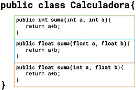

Tenemos una clase Calculadora con tres métodos del mismo nombre, **suma()**, aquí podemos ver la sobrecarga ya que reciben y devuelven distintos valores.

**Sobrecarga de Constructores**

Cuando en una clase existen constructores múltiples, se dice que hay sobrecarga de constructores.

Se utiliza para inicializar objetos, usando para definir los argumentos mínimos que son necesarios para construir un objeto.

Miremos como funciona con un ejemplo:

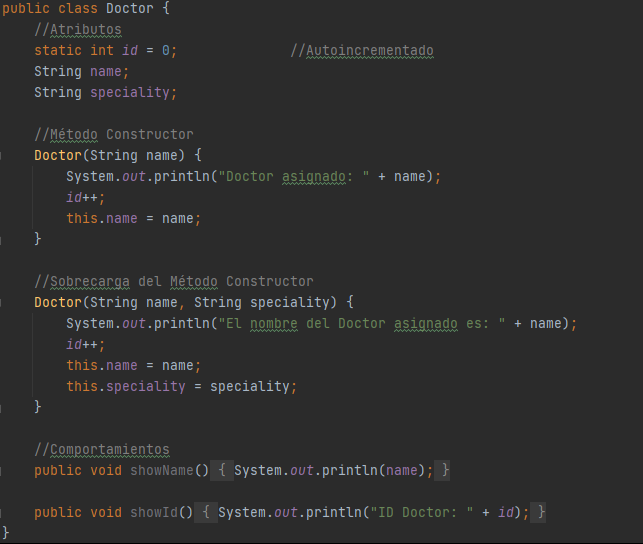

En la clase Doctor tenemos dos métodos constructores, el primero tiene como parámetro únicamente el nombre y el segundo acepta como parámetros tanto el nombre como también la especialidad.

Si nosotros imprimiéramos estos métodos constructores:

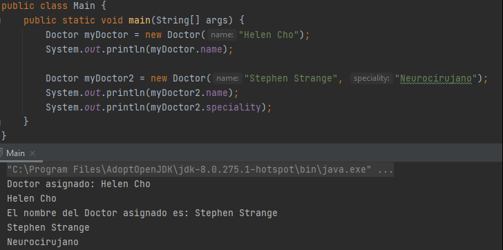

Tendremos dos impresiones correspondientes a los dos métodos constructores que hemos creado.

**Palabra clave this**

La palabra clave **this()** es un método miembro de un objeto está asociado al objeto. Cuando este se está ejecutando podemos usar this, para conseguir una referencia al objeto asociado. Usado para evitar conflictos de nombres en el método / constructor de su instancia / objeto.

Dentro del método, podemos usar ***this.nombre*** para acceder al nombre del objeto asociado.

La palabra clave this, funciona igual dentro de un constructor.

En nuestro ejemplo anterior tenemos un ***this.name = name*** donde:

- **this.name** hace referencia al atributo de la clase Doctor.
- Cuando escribimos simplemente **name**, el compilador entiende que nos referimos es el parámetro del método.

### Clase 13 *Encapsulamiento: Modificadores de acceso*

Anteriormente tuvimos un reto que básicamente eran crear la clase Patient:

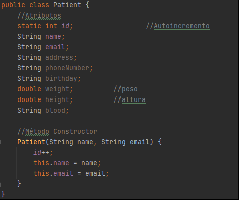

Si nosotros hiciéramos lo siguiente:

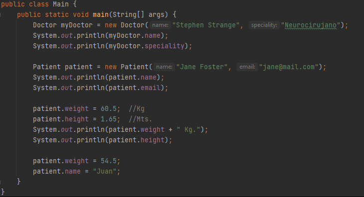

Creamos un objeto Patient con los datos mínimos para que exista y luego le agregamos la altura y el peso, e imprimiéramos todo funcionaria igual. Incluso podemos agregar que en la impresión del peso salga en kilogramo, pero si siguiéramos podemos modificar tal vez cambiar el peso por otro, que nuestro paciente ya no sea Jane sino que ahora sea un Juan e incluso en la impresión en vez de kilogramos sea en gramos.

Según la lógica de negocios esto no son cosas que deban ocurrir, que un paciente cambie el peso de kg a g es una inconsistencia que podemos prevenir al hacer que nadie pueda alterar ese parámetro. La única forma de hacerlo en Java, que no se altere un parámetro y que nadie más tenga acceso, será escondiendo ese parámetro, dejarlo invisible o al menos invalidado para los demás implementando la encapsulación.

**Encapsulamiento**

Este concepto consiste en la ocultación del estado o de los datos miembro de un objeto, de forma que sólo es posible modificar los mismos mediante los métodos definidos para dicho objeto. Es decir, limitamos el acceso a las variables de nuestras clases.

**¿Como se encapsulan los datos?**

Cuando realizamos un abstracción en una clase para luego instanciarla y crear un objeto no se necesita conocer a fondo la implementación solo se necesita poder instanciar esa clase tampoco necesita conocer todas las propiedades de un objeto o acceder a ellas de forma directa, por ello podemos crear diferentes métodos y forzar a utilizar métodos definidos para modificar estas propiedades.

Para realizar el proceso anterior se necesita conocer los **modificadores de acceso**. Los modificadores de acceso permiten dar un nivel de seguridad mayor a nuestras aplicaciones restringiendo el acceso a diferentes atributos, métodos, constructores asegurándonos que el usuario deba seguir una "ruta" especificada por nosotros para acceder a la información.

Tengamos en cuenta la siguiente imagen:

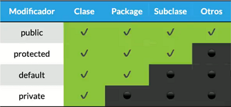

- **Public:** Es el más permisivo de todos. Si el componente de una clase es público tendremos acceso a él desde cualquier clase o instancia sin importar el paquete o procedencia de ésta.
- **Protected:** Nos permite acceso a los componentes con dicho modificador desde la misma clase, clases del mismo paquete y clases que hereden de ella (incluso en diferentes paquetes).
- **Default:**  Java nos da la opción de no usar un modificador de acceso y al no hacerlo, el elemento tendrá un acceso conocido como default, acceso por defecto, que permite que tanto la propia clase como las clases del mismo paquete accedan a dichos componentes (de aquí la importancia de declararle siempre un paquete a nuestras clases).
- **Private:** Es el más restrictivo de todos, básicamente cualquier elemento de una clase que sea privado puede ser accedido únicamente por la misma clase por nada más.

**Encapsulando atributos**

Ahora que ya entendemos sobre el encapsulamiento y conocemos los modificadores de acceso, vamos a encapsular los atributos de la clase Patient:

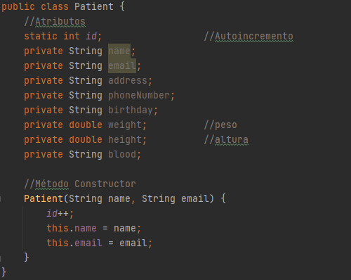

Una vez que todos nuestros atributos tengan el acceso private, automáticamente el archivo Main nos señalara varios errores:

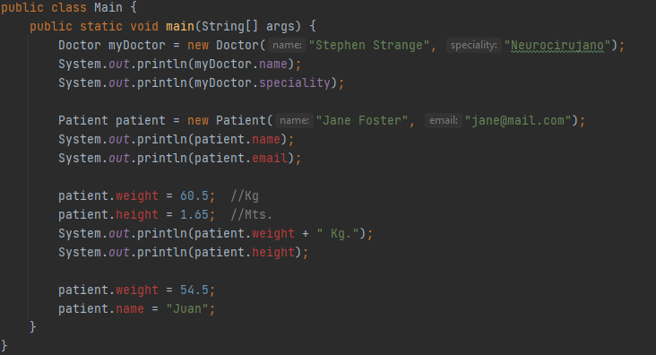

Y es que ya no podemos simplemente modificar o imprimir nuestros atributos fuera de la clase. Pero los atributos siguen siendo válidos para la clase:

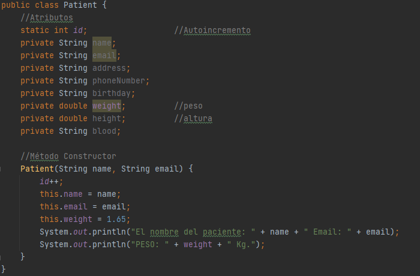

Nosotros podríamos incluso instanciar nuestra altura o peso y hacer las impresiones.

### Clase 14 *Getters y Setters*

En nuestra clase anterior dejamos encapsulados nuestros datos y quedaron invisibles para la capa de la clase Main, ya no podemos añadir datos a los demás atributos ni modificar lo que tenemos, pero tenemos una forma para seguir accediendo a los atributos sin tocarlos directamente y además también resuelve las validaciones de la lógica de negocio.

**Getters & Setters**

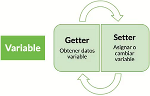

Los Getters y Setters nos permiten leer y escribir (respectivamente) los valores de nuestras variables privadas desde fuera de la clase donde fueron creadas. Con los Getters obtenemos los datos de las variables y con los Setters asignamos o cambiamos su valor.

Podemos crear los Getters o Setters manualmente:

Como vemos, el IDE ya nos sugiere los posibles nombres y eso se debe a que es una convención de nombres.

Pero también tenemos atajos para generar los métodos getters y setters de todas o algunas de tus variables. Una de las formas es dando click derecho y seleccionamos Generate:

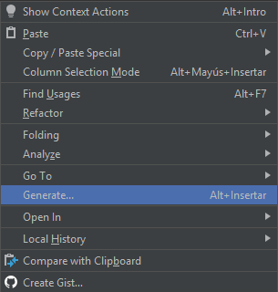

Después seleccionamos Getter and Setter, pero también podemos crearlos individualmente si elegimos solo Getter o Setter:

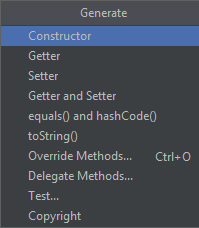

Nos aparece una ventaja con los atributos a seleccionar de los cuales crearemos los getter y setter:

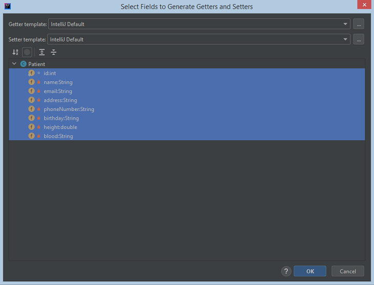

Y eso nos generara automáticamente todo:

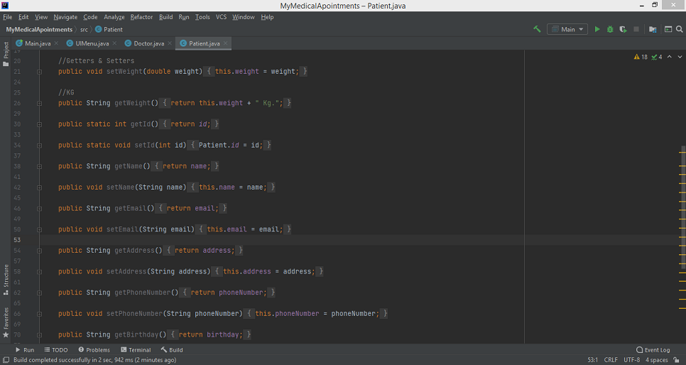

Ahora podemos realizar nuestras validaciones:

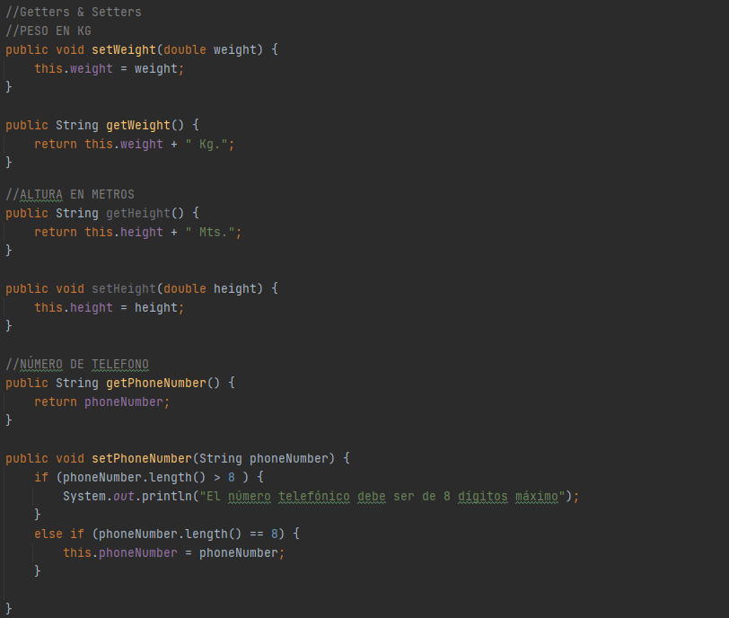

Podemos agregar directamente para que el peso se nos imprima en Kg o la altura en metros, también podemos validar que los números telefónicos sean exactamente de ocho dígitos.

Y la manera en cómo enviaremos o imprimiremos nuestros datos será de la siguiente forma:

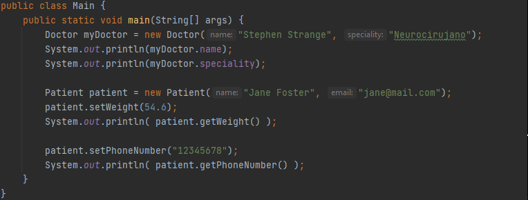

- **setNombre:** Enviamos por parámetros los datos para ser asignados o cambiados.
- **getNombre:** Obtenemos los datos para ser imprimidos.

### Clase 15 *Variable vs. Objeto*

En este punto ya debemos entender que las variables son diferentes a los objetos:

- Las **variables** son entidades elementales muy sencillas que pueden ser números, caracteres, booleanos, entre otras.
- Los **objetos** son entidades complejas que pueden estar formadas por la agrupación de diferentes variables y métodos.

Sin embargo, en el tema de los **arreglos** aprendimos que son elementos complejos y por esa razón eran tomadas como objetos. Su relación de una variable a muchos datos (relación uno a muchos) los obligaba a tener más operaciones para manipular esos datos.

Por eso si tenemos esto:

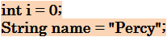

Decimos que tenemos una **variable** «i» del tipo primitivo int, y tenemos un **objeto** «name» del tipo string.

En ocasiones puede ser muy conveniente el poder tratar a los datos primitivos como objetos, pero los datos primitivos no son objetos, como bien ya sabemos, para resolver esta situación el API de Java incorpora las clases envoltorio (wrapper class), que no son más que dotar a los datos primitivos con un envoltorio que permita tratarlos como objetos.

**Wrapper Class**

La clase Wrapper o la clase de envoltura, son clases que representan un tipo primitivo de dato. Es decir, son un tipo de referencia que envuelve un tipo primitivo. Cada tipo de dato primitivo tiene un tipo de referencia que lo envuelve. Veamos a continuación la siguiente tabla:

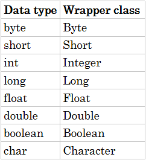

### Clase 16 *Clases Anidadas*

Otro tipo de datos con lo que podemos encontrarnos en el futuro, aunque no son tan utilizadas en general pero si podemos encontrarnos con ella cuando trabajamos con algún framework o SDK especifico que esté trabajando con Java, estas son las clases anidadas.

Las **clases anidadas**, llamadas también **Clases Helper**, son clases que viven una dentro de otra. Tiene esta sintaxis:

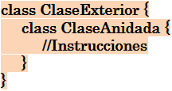

En donde la clase padre, la que está más afuera, es llamada **Clase Exterior** y la clase hija, la que se encuentra anidada, será conocida como **Clase Interior**. Pero esto no significa que dos clases vivan a la par, porque esto violaría uno de los principios que es la modularidad.

En el caso de las clases anidadas, estas deben vivir dentro de la clase exterior porque la lógica de su comportamiento esta directamente relacionada con la clase exterior. Aquí SI es válido y sigue cumpliendo con el principio de la modularidad, porque ambas están vinculadas directamente con la lógica y el comportamiento que van a tener.

**Tipos de Clases Anidadas**

Existen dos tipos de clases anidadas:

- **Clases internas:** De estas se derivan nuevamente dos tipos de clases internas.
	
	- **Clases locales a un método:** Aunque es un poco extraño de ver, podemos tener clases declaradas dentro de un método.
	- **Clases internas anónimas:** Son clases que profundizaremos en el curso de Java Funcional porque ahí es de donde precisamente nace su implementación.

- **Clases estáticas anidadas:** Son clases no necesitan ser instanciadas para poder ser llamadas y ejecutadas, aunque debes recordar que solo permiten llamar a los métodos estáticos de sus clases padre.

Esta es la sintaxis de las dos clases anidadas:

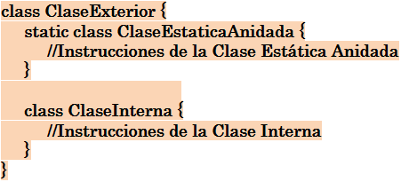

**Clases Anidadas Estáticas**

Al igual que con los métodos y variables de clase, una clase anidada estática está asociada a su clase externa. Y al igual que los métodos de clase estáticos, una clase anidada estática no puede hacer referencia directamente a variables de instancia o métodos definidos en su clase adjunta: solo puede usarlos a través de una referencia de objeto.

**Clases Anidadas Internas**

El anidamiento de una clase tiene por objetivo favorecer el encapsulamiento. Una clase anidada se dice que es interna si se la declara dentro de otra clase pero fuera de cualquier método de la clase contenedora.

Puede declararse con cualquiera de los modificadores: private, protected o public.

Una característica fundamental es que una clase interna tiene acceso a todos los atributos de la clase que la contiene, luego para que exista una clase anidada interna es necesario que exista un objeto de la clase contenedora.

Veamos un ejemplo para entender mejor las clases anidadas. Y es que de acuerdo a las reglas del negocio de nuestro proyecto, un doctor puede dejar disponible las citas de las cuales puede venir un paciente a agendar.

Sin utilizar una clase anidada podemos crear unos atributos como fecha y hora que en conjunto representan el tiempo que el doctor se encuentra disponible. Para diferenciarlos también debemos poner un identificador y, si siguiéramos tratando las variables por separados, deberíamos crear un arreglo que tuviera la colección de todos los elementos.

La mejor forma de trabajar con estos datos sería crear una clase con sus getters y setters de cada elementos, pero como estará vinculado con y únicamente con el doctor (obviamente el paciente no podrá poner la hora que está disponible el doctor). Y por esta razón, por compartir la lógica, es mejor ponerlo como una clase independiente.

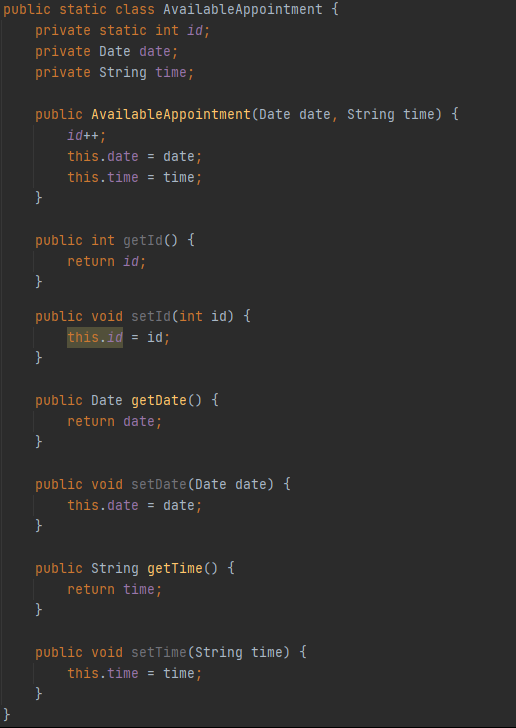

De esta forma es más sencillo manejar o añadir una cita para el doctor. También podemos crear un método, esta vez al nivel de la clase Doctor, que reciba la fecha y la hora:

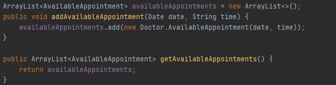

De esta forma vamos añadiendo una nueva cita disponible que se irán acumulando en el arreglo. Y si queremos ver las citas disponibles creamos un getters que simplemente nos devuelva el arreglo.

Entonces, en el archivo Main, tenemos lo siguiente:

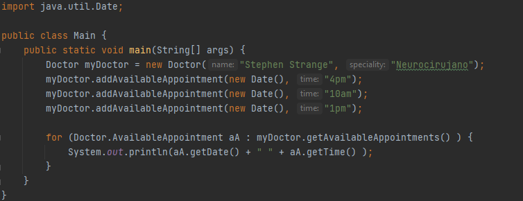

Creamos tres citas en el mismo día con diferentes horas. Y para imprimir las citas disponibles, por fines prácticos del ejemplo, lo haremos directamente con un forech.

**NOTA**

- **Clase Date:** Representa como su nombre indica a una fecha. La clase Date viene incluida en Java, localizada en el paquete java.util, por lo que para utilizarla debemos importarlo desde el principio con: import ***java.util.Date***;
	
	Para crear una fecha, debemos crear un objeto de esa clase.
	
	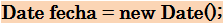

	Si no le enviamos ningún parámetro, automáticamente tomara la fecha de hoy. Pero también podemos crear una fecha propia, indicándoselo por parámetro de la siguiente manera:

	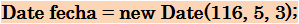
	
	En donde:
	
	- **116** es el año. Para poner el año debemos hacer las cuentas porque inicialmente empezamos desde 1900 y lo que se hace es restárselo al año que queremos (2016 - 1900 = 116. Si nosotros ponemos 2016 nos daría el año 3916).
	- **5** es el mes. Pero cuidado, el 5 no es mayo. El mes empieza en 0, como un arreglo, por lo que 5 es el sexto mes (Junio).
	- **3** es el día. Aquí sí, el día es tal cual pongamos.
	
	También podemos añadir la hora exacta:

	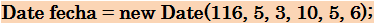	
	
	En donde los tres últimos parámetros (10, 5 y 6) representan la hora, minuto y segundo.
	
- **ArrayList:** Es una clase de Java localizada en java.util, por lo que debe ser importada para ser utilizada. El ArrayList es una clase que permite almacenar datos en memoria de forma similar a los Arrays, con la ventaja de que el número de elementos que almacena, lo hace de forma dinámica, es decir, que no es necesario declarar su tamaño como pasa con los Arrays.

### Clase 17 *Clases Internas y Locales a un método*

Profundizaremos más en los tipos de clases que te podes encontrar con Java, ya vimos la clase estática anidada y, como este es un curso de programación orientada a objetos, veremos todos los posibles casos hablando específicamente de las clases porque aún nos queda pendientes las clases internas anónimas y las locales a un método.

**Clases Internas Anónimas**

También conocidas en internet o en algunos libros como clases no estáticas. Una clase interna anónima es una forma de clase interna que se declara y crea una instancia con una sola declaración. Como consecuencia, no hay un nombre para la clase que pueda usarse en otra parte del programa, es decir, es anónimo.

Las clases anónimas se utilizan normalmente en situaciones en las que es necesario poder crear una clase de peso ligero que se pase como parámetro. Esto normalmente se hace con una interfaz.

Por ejemplo:

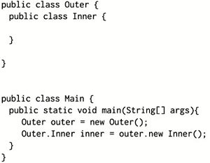	

Tenemos una clase externa **Outer** cuyo interior contiene una clase anidada **Inner**, lo curioso está en nuestro archivo **Main** ya que para llamar a la clase interna aquí si es necesario instanciarla. Para instanciar una clase interna lo que hacemos es crear un objeto de tipo Outer y después un objeto de tipo Inner poniendo la palabra reservada **new** antes del nombre de la clase interna.

**Clase Local a un Método**

Una clase escrita dentro de un método llamado método clase interna local . En ese caso, el alcance de la clase interna está restringido dentro del método.

Una clase interna de método local puede instanciarse solo dentro del método donde se define la clase interna.

Por ejemplo:

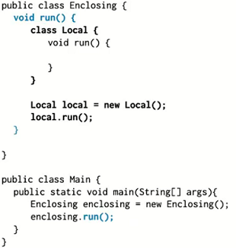	

Supongamos que tenemos una clase externa **Enclosing** dentro del cual tenemos un método y dentro de ese método creamos una clase **Local** que tiene sus propias propiedades y comportamientos.

**Diferencia entre clases estáticas e internas (anidadas no estáticas)**

- Las **clases anidadas estáticas** no tienen acceso directo a otros miembros (variables y métodos no estáticos) de la clase adjunta porque, como es estática, debe acceder a los miembros no estáticos de su clase adjunta a través de un objeto. Es decir, no puede hacer referencia directamente a los miembros no estáticos de su clase adjunta. Debido a esta restricción, las clases anidadas estáticas rara vez se utilizan.
- Las **clases anidadas no estáticas** (clases internas) tienen acceso a todos los miembros (variables y métodos estáticos y no estáticos, incluido el privado/private) de su clase externa y pueden referirse a ellos directamente de la misma manera que otros miembros no estáticos del exterior de la clase.

### Clase 18 *Enumerations*

Los enumerations son tipos de datos muy especiales pues este, es el único en su tipo que sirve para declarar una colección de constantes, al ser así estaremos obligados a escribirlos con mayúsculas.

Usaremos enum cada vez que necesitemos representar un conjunto fijo de constantes. Por ejemplo los días de la semana.

Así podemos declarar un enumeration usando la palabra reservada enum.

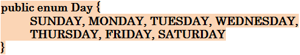	

Puedo crear referencias de enumerations de la siguiente forma:

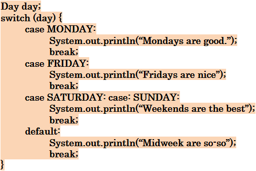

Y puedo llamar un valor del enumeration así:

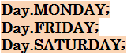

Los enumerations pueden tener atributos, métodos y constructores, como se muestra:

Y para utilizarlo lo podemos hacer así:

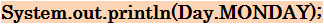

Imprimirá: **MONDAY**

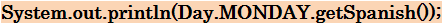

Imprimirá: **Lunes**

## Modulo 3. Reutilizar Código
### Clase 19 *¿Qué es la Herencia? Don't repeat Yourself*

Entramos a un nuevo módulo titulado "Reutilizar Código" en el que básicamente entenderemos porque es importante la reutilización de código porque, en primer lugar, esto es uno de los principios básicos de la programación orientada a objetos ya que en el momento en que detectemos que estamos copiando y pegando código es cuando debemos analizar para ver si ese código puede hacerse más abstracto o general para no estarlo escribiendo cada vez que lo necesitamos.

**«Don’t repeat yourself»** es una filosofía que consiste en detectar cuando estamos repitiendo el mismo código una y otra vez para crear algún método o función que nos ayude a evitar estos repetidos. Esta es una de las bases de la programación que siempre debemos tener en cuenta, ya que nos ayuda a reducir la dificultad de nuestro código para implementar cambios y/o mejoras en nuestra aplicación.

Y una de las piezas claves a la hora de reutilizar código a más no poder es la herencia.

**Herencia**

Básicamente consiste en crear nuevas clases a partir de otras clases, establecemos una relación padre e hijo entre nuestras clases. Es diferente a las clases anidadas, ya que, en vez de crear clases dentro de clases, le indicamos a nuestras subclases de qué superclase pueden heredar (extends) para reutilizar el código de algunos de sus métodos.

***RECUERDA: Las clases no pueden heredar de más de una clase.***

Ya que estamos hablando de herencia, podemos recordar que nuestras clases Doctor y Patient comparte algunos atributos, este es un claro ejemplo de que podemos agruparlos, abstraemos esos atributos en común, para que ambos puedan heredarlo de una clase padre y así evitamos estar repitiendo esos atributos.

### Clase 20 *Super y This*

Si analizamos nuestro proyecto podemos ver que, hasta donde tenemos, nuestras entidades Doctor y Patient comparten algunos atributos que pueden servir por sí mismos y podemos agruparlos gracias a la herencia.

Estos son los atributos que tenemos iguales:

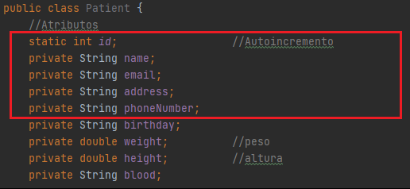

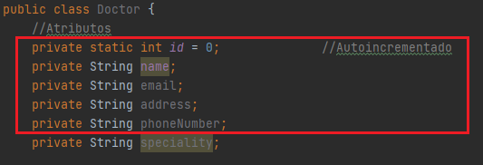

Lo que haremos es extraer esos atributos y ponerlos en una super clase llamada User. De acuerdo a nuestro sistema, nosotros podemos elegir si somos doctor o paciente y verificarlo según nuestro email, todo esto podemos hacerlo desde la super clase.

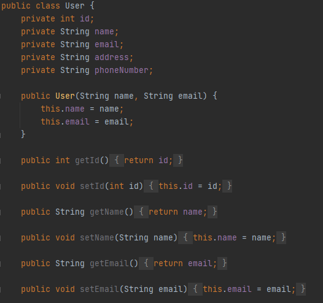

Ahora la clase User tiene los atributos que abstrajimos con sus propios constructores, getters y setters.

Para que nuestra clase Doctor o Patient pueda tener esos mismos atributos debemos heredarlos y la forma en que lo hacemos es usando la palabra reservada **extends**:

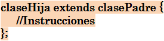

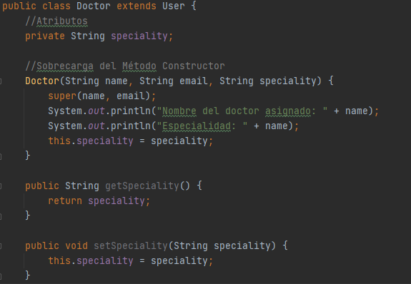

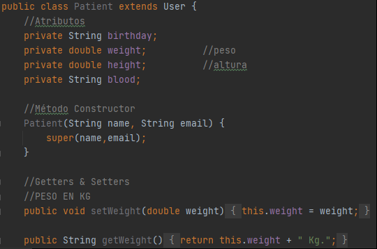

Ahora que hemos extendido desde nuestra clase padre podemos suprimir los atributos abstraídos, así como sus getters y setters, y ahora accederemos al constructor de la clase padre (que se convertirá en nuestro constructor por defecto) usando la palabra reservada **super()**. Una cosa más importante es que 'super' puede llamar constructores tanto con parámetros como sin parámetros dependiendo de la situación.

Si nosotros viéramos nuestro método Main, gracias a la reutilización de código, incluso después de todos nuestros cambios nada falla y nos seguiría funcionando todo perfectamente:

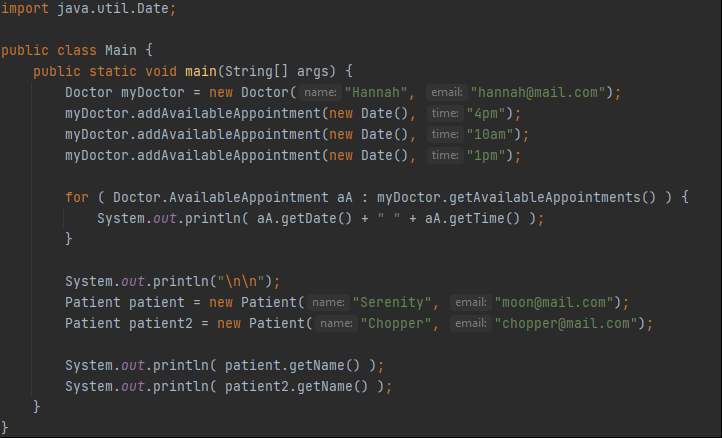

### Clase 21 *Polimorfismo: Sobreescritura de Métodos*

En java hay una clase de la cual heredan todas las clases que nosotros creamos y ese es el Object. Cuando nosotros creamos nuestras el objeto de nuestras clases vimos que de repente aparecían métodos, variables y cosas que no habíamos creado:

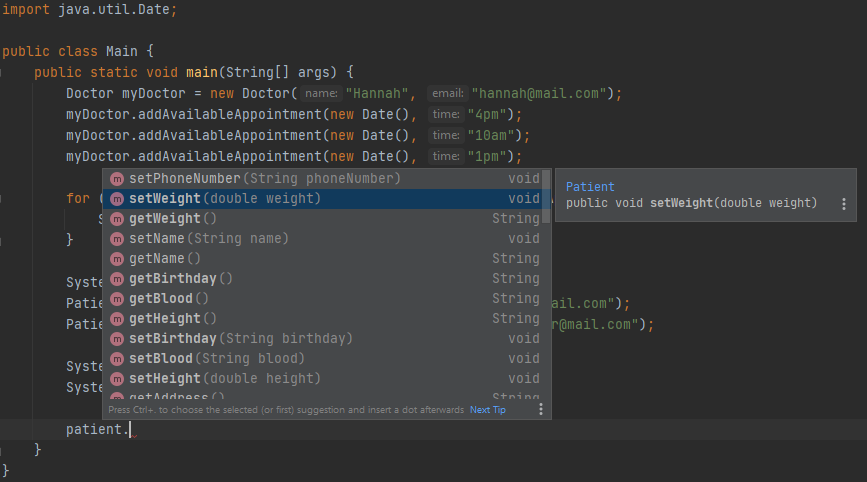

Como en este ejemplo, en donde usamos el objeto **patient** y llamábamos a los métodos o variables, podemos ver cómo nos resalta en negrita algunos métodos, esto es porque nosotros hicimos uso de la reutilización de código y esos métodos indican cuales son los propios de la clase **Patient**. Pero si continuamos bajando ya vemos cosas extrañas como los métodos .toString, hashCode, finalize, notify, entre otros, que son los que heredamos de la clase object.

Esos son métodos que podemos que podemos utilizar a pesar de que en ningún momento heredamos de Object, porque para nuestro IDE eso es una redundancia y lo hace automáticamente, sin obligarnos a hacer la herencia.

***RECUERDA: Algo importante que debemos saber es que, en el caso de Java, no se permite hacer la herencia múltiple. Esto es algo que no nos permite hacer la herencia múltiple. Todas las clases hijas solo tendrán una sola y única clase padre.***

Lo que haremos ahora será sobrescribir el método toString que está definido en la clase object, y para esto debemos comprender algunos conceptos.

**Polimorfismo**

Es una característica de la programación orientada a objetos que consiste en sobrescribir algunos métodos de la clase de la cual heredan nuestras subclases para asignar comportamientos diferentes.

**Sobreescritura**

Consiste en que, cuando tenemos una clase que hereda de otra, podemos redefinir un método para que tenga una implementación distinta.

***NOTA: Los métodos marcados como final o static no se pueden sobrescribir.***

**Sobreescritura de constructores**

Consiste en usar los miembros heredados de una superclase, pero con argumentos diferentes.

Ahora, sobrescribamos el método .toString y para eso vamos a la clase User que es donde trabajaremos:

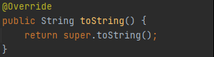

Cuando nosotros escribimos **toString** nuestro IDE ya nos ayuda a poder completar todo y nos deja en como se muestra en la imagen. La notación @**Override** nos indica que ese método no es propio de la clase User, sino que es está siendo llamado de la super clase, también por eso tenemos el **super** que invoca al método de la clase padre.

Si nosotros fueramos a ver que ocurre con el toString en la clase object podremos ver lo siguiente:

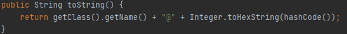

Lo que hace es el método es obtener el nombre de la clase y con ello consigue el hashCode que es como un identificador que saca la firma del objeto para hacer un par de validaciones y demás.

Entonces, lo que nosotros queremos hacer es cambiar ese método y que siempre que imprimamos cualquier dato, como por ejemplo la de un paciente, nos salga la sobreescritura:

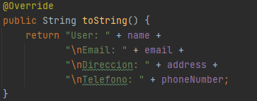

Es tan sencillo como cambiar y escribir lo que ahora querramos imprimir.

Ahora, cada que nosotros escribamos para imprimir el objeto tendremos el resultado de la sobreescritura que nos mostrara el nombre, email, dirección y telefono:

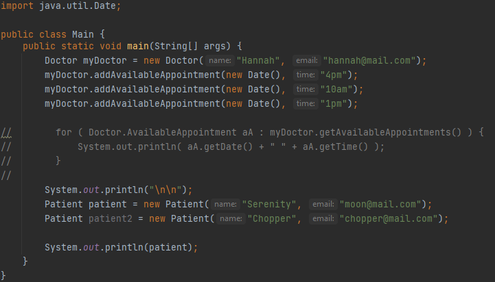

Pero nuestra clase Patient, que hereda de User, debe tener un comportamiento ligeramente diferente. Y es que tal vez nosotros debamos imprimir también la altura o el peso (ambos atributos existentes dentro la clase Patient), para lograr eso podemos nuevamente sobrescribir el método:

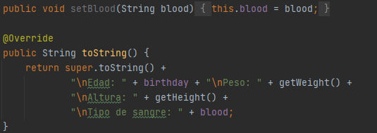

Para eso hacemos lo mismo. Vamos a la clase en la queremos tener la sobreescritura (en este caso es la clase Patient) y realizamos los cambios deseados, de esta forma le estamos dando otro comportamiento.

### Clase 22 *Polimorfismo: Sobreescribiendo el método toString*

En la clase anterior ya estuvimos sobrescribiendo el método toString que, debemos recordar bien, heredamos de la clase Object. Ahora continuaremos sobrescribiendo ese método para ver que algunas cosas podemos añadirle.

Sobrescribiremos el método en la clase Doctor, más precisamente en la clase interior, para imprimir las citas que tenemos disponibles:

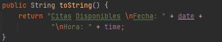

También, en la clase exterior de Doctor, sobrescribiremos el método.

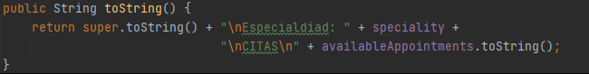

Como vemos, usamos super() para llamar al método padre y concatenamos el atributo Speciality (propia de la clase Doctor). Y, adicionalmente, llamamos el arrayList que tiene acumuladas nuestras citas y usamos el método toString() para tener una representación en cadena del contenido.

Si queremos imprimir un objeto por lo general debemos de escribir nombreObjeto.toString(), pero ese no es el caso de Java pues el método toString se llama implícitamente, no es necesario que lo pongamos y podemos imprimir el objeto mediante el nombre como lo vimos cuando imprimimos el objeto **patient**.

Si nosotros imprimimos nuestro objeto myDoctor tendremos lo siguiente:

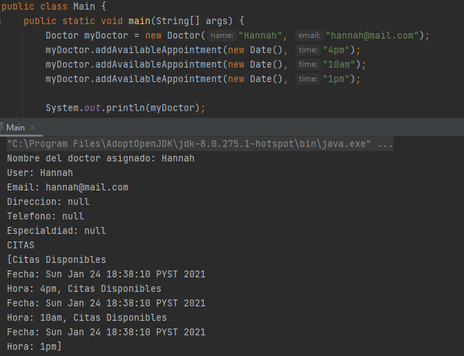

Esta forma de poder sobrescribir un método y añadirle comportamiento nos lleva a un concepto importante de la programación orientada a objetos, el Polimorfismo.

**Polimorfismo**

Es la posibilidad de sobrescribir un método asignándole comportamientos diferentes.

### Clase 23 *Interfaces*

Lo que vemos a continuación es el resumen de nuestro proyecto:

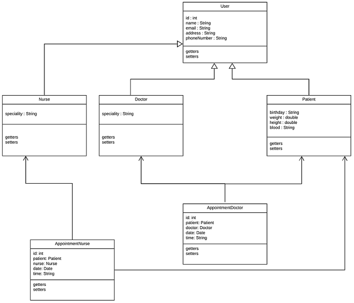

Tenemos nuestra clase padre (User) y las dos clases hijas: Doctor y Patient. Idealmente debemos partir de un diagrama para luego plasmarlo en un programa, pero igual la imagen nos sirve como el resumen de nuestro curso hasta ahora.

Hasta el momento hemos seguido las buenas prácticas de la programación orientada a objetos, dejando nuestro proyecto lo más modular posible. Tenemos completamente todo separados por capas, incluso separamos una capa para la interfaz de usuario que hasta el momento es todo modo consola, y ahora estamos construyendo una capa que encontraremos en algún momento, la capa de modelos.

La capa de modelos es precisamente esto que tenemos, todos los objetos moldeaos en clase y que posteriormente son mapeados en una fuente de datos. Básicamente preparamos el proyecto para seguir el principio de modularidad, tanto así que si nosotros queremos podemos agregar una nueva entidad Nurse y otra entidad que contenga las citas agendadas, y en general esto es algo común. En muchas ocasiones la lógica de negocio cambia y debemos estar agregando o suprimiendo entidades.

Entonces, ahora tenemos dos nuevas entidades y una de las cosas que necesitaremos es la acción de poder agendar una cita, para eso debemos detectar la acción entre dos clases. Esta acción de agendar una cita la debemos poner tanto en AppointmentDoctor como en AppointmentNurse y, si nosotros tuviéramos una tercera entidad, tendríamos que copiar y pegar.

Para evitar eso, y dado que seguimos en el módulo de reutilización de código, veremos lo que son las interfaces.

**Interfaz**

Las interfaces son un tipo de referencia similar a una clase con solo constantes y definiciones de métodos, son de gran ayuda para definir los comportamientos que son redundantes y queremos reutilizar un más de una clase, incluso cuando tenemos muchas clases y no todas pertenecen a la misma "familia".

Las interfaces establecen la forma de las clases que la implementan, así como sus nombres de métodos, listas de argumentos y listas de retorno, pero **NO sus bloques de código**, eso es responsabilidad de cada clase.

Siguiendo nuestro diagrama, el comportamiento de agendar una cita con una enfermera puede ser completamente diferente al comportamiento de agendar una cita con un doctor. Desde los requerimientos hasta el tipo de funciones que visualizaremos, pueden ser radicalmente una diferente a la otra.

El nombre de las interfaces van a estar totalmente ligadas a una actividad o acción. Las interfaces que terminen con **«able»** están enfocado a las actividades redundantes del programa, pero en otros casos también es común encontrarlas con la letra **«i»** al principio del nombre. Para implementarlo usaremos la palabra reservada **implements**:

NOTA:

- Una peculiaridad es que podemos implementar varias interfaces al mismo tiempo.
- El programa usado por la profesora para hacer el diagrama es [lucidchart](https://www.lucidchart.com/pages/es "lucidchart").

### Clase 24 *Creando una interfaz para definir si una fecha es agendable*

Vamos a trabajar con la implementación de la interfaz para agregarles comportamientos a una clase, a este concepto se le conoce como composición.

**Composición de Interfaces en Clases**

Básicamente es abstraer todos los métodos/comportamientos de una clase para modularizarlos (comprimirlos, encapsularlos) en una interfaz y reutilizar su código en diferentes clases.

Hoy en día, muchos aconsejan utilizar el concepto de composición en viceversa a la herencia. Con la herencia podemos traer los métodos y la reutilización de código es lineal, mientras que la diferencia y ventaja que tenemos con las interfaces es que podemos hacerlo a cualquier nivel de la clase, sin importa a que nivel este la clase o a que familia pertenezca siempre podemos implementar el comportamiento abstraído.

***RECUERDA:***

- ***Las interfaces se crean utilizando la palabra reservada interface y se implementan en nuestras clases con implements.***
- ***Podemos heredar (implementar) más de una interfaz, pero no podemos hacerlo de las clases padres o superclases.***

Viendo nuestro diagrama, nosotros tenemos las nuevas entidades AppointmentDoctor y AppointmentNurse además de la interfaz IShedulable. Lo que haremos es crear y ordenar todo:

Primeramente creamos un paquete «model» para manejar todo en capas, en su interior guardamos todas nuestras entidades y la interfaz. Ahora tenemos dos paquete, model y ui, y el punto de entrada a nuestra aplicación.

La interfaz Ischedulable con un único comportamiento que recibe como parámetro la fecha (date) y la hora (time):

Tenemos las clases AppointmentDoctor y AppointmentNurse, cada uno con sus atributos y sus getters & setters:

En ambas clases implementamos la interfaz mediante la palabra reservada implements. Cuando nos marca error es necesario que presionemos Alt + Enter y elegimos "Implement methods":

Nos saldrá una ventana con todos los métodos que podemos implementar, elegimos y damos click en Ok:

Se nos generara lo siguiente:

Y con eso ya tenemos la interfaz implementada en nuestra clase.

***NOTA: El error que nos marca en el método Main es porque debemos hacer público los métodos constructores. Eso es algo relacionado a los modificadores de acceso que como sabemos nos permite definir el nivel de restricción que tendrá el atributo o el método.***

### Clase 25 *Collections*

Otras interfaces que son muy importantes en Java son los llamados **Collections**.

Los Collections nos van a servir para trabajar con colecciones de datos, específicamente y **solamente con objetos**, para esto recuerda que tenemos disponibles nuestras clases Wrapper que nos ayudan a convertir datos primitivos a objetos.

Los collections se diferencian de los arrays en que su tamaño no es fijo y por el contrario es dinámico.

A continuación te muestro un diagrama de su composición:

Como podemos observar el elemento más alto es la interfaz **Collection**, para lo cual, partiendo de su naturalidad de interface, entendemos que tiene una serie de métodos “básicos” dónde su comportamiento será definido a medida que se vaya implementando en más elementos. De ella se desprenden principalmente las interfaces **Set** y **List**.

La interface Set tendrá las siguientes características:

- Almacena objetos únicos, no repetidos.
- La mayoría de las veces los objetos se almacenarán en desorden.
- No tenemos índice.

La interface List tiene éstas características:

- Puede almacenar objetos repetidos.
- Los objetos se almacenan en orden secuencial.
- Tenemos acceso al índice.

**Si seguimos analizando las familias tenemos que de Set se desprenden**

- Clase HashSet
- Interfaz SortedSet y de ella la clase TreeSet.

**HashSet** los elementos se guardan en desorden y gracias al mecanismo llamado hashing (obtiene un identificador del objeto) permite almacenar objetos únicos.

**TreeSet** almacena objetos únicos, y gracias a su estructura de árbol el acceso es sumamente rápido.

**Ahora si analizamos la familia List, de ella se desprenden**

- **Clase ArrayList** puede tener duplicados, no está sincronizada por lo tanto es más rápida
- **Clase Vector** es sincronizada, los datos están más seguros pero es más lento.
- **Clase LinkedList**, puede contener elementos duplicados, no está sincronizada (es más rápida) al ser una estructura de datos doblemente ligada podemos añadir datos por encima de la pila o por debajo.

**Sigamos con Map**

Lo primero que debes saber es que tiene tres implementaciones:

- HashTable
- LinkedHashMap
- HashMap
- SortedMap ➡️ TreeMap

La interfaz **Map** no hereda de la interfaz Collection porque representa una estructura de datos de Mapeo y no de colección simple de objetos. Esta estructura es más compleja, pues cada elemento deberá venir en pareja con otro dato que funcionará como la llave del elemento.

**Map**

Donde:

- K es el key o clave.
- V es el value o valor.

Podemos declarar un map de la siguiente forma:

Como observas solo se puede construir el objeto con tres elementos que implementan de ella: HashMap, TreeMap y LinkedHashMap dejando fuera HashTable y SortedMap. SortedMap estará fuera pues es una interfaz y HashTable ha quedado deprecada pues tiene métodos redundantes en otras clases. Mira la funcionalidad de cada uno.

Como te conté hace un momento Map tiene implementaciones:

- **HashMap:** Los elementos no se ordenan. No aceptan claves duplicadas ni valores nulos.
- **LinkedHashMap:** Ordena los elementos conforme se van insertando; provocando que las búsquedas sean más lentas que las demás clases.
- **TreeMap:** El Mapa lo ordena de forma “natural”. Por ejemplo, si la clave son valores enteros (como luego veremos), los ordena de menos a mayor.

Para iterar alguno de estos será necesario utilizar la interface **Iterator** y para recorrerlo lo haremos un bucle while así como se muestra:

- Para HashMap

	

- Para LinkedHashMap

	

- Para TreeMap

	

Ahora [lee esta lectura](https://docs.oracle.com/javase/tutorial/collections/interfaces/deque.html "lee esta lectura") y en la sección de tutoriales cuéntanos en tus palabras cómo funciona Deque.

## Modulo 4. Aplicar Abstracción
### Clase 26 *Clases Abstractas*

Hasta este momento hemos estado sobrescribiendo métodos a través de la herencia y las interfaces. Pero sucede que en algunos de estos casos, heredado comportamientos e una clase a otra o implementado el método de una interfaz a una clase, NO es necesario que implementemos todos los métodos. En casos anteriores el IDE nos subrayaba en rojo porque forzosamente nos pedía que implementemos todos los métodos, en ese ejemplo era solo un método pero si eran más, nuestra clase a fuerza tendría que componerse de todos los métodos declarados en la interfaz. Sin embargo, a veces, en nuestro código no necesitamos implementar todos esos métodos o, en el caso de la herencia, la clase podría no tener que heredar la implementación de un método. También, en el caso de la herencia, a veces no necesitamos crear instancias de una clases.

Todos esos problemas pueden ser solucionados con las clases abstractas.

**Clases Abstractas**

Es una combinación entre interfaces y herencia donde no implementaremos todos los métodos ni tampoco crearemos instancias.

Para crear una clase abstracta usamos la palabra reservada **abstract**, como en el siguiente ejemplo:

En este caso tenemos una clase abstracta llamada Figura de la cual pueden heredar una clase Triangulo:

Y otras clases más, como Cuadrados, Rectángulos, Hexágonos, etc. Pero según la lógica del programa, nosotros no tendríamos la necesidad de crear una instancia de la clase Figura o, tal vez, la clase Triangulo no necesaria heredar todos los comportamientos.

En el proyecto que hemos trabajado hasta ahora tenemos una clase que podemos volverla abstracta y esa es la clase User. Según la lógica de negocio, las relaciones son de Paciente-Doctor o Paciente-Enfermera, en ningún lugar estaríamos manipulando la clase User como tal y eso es porque User están general, tan abstracto, que no es necesario ocupar una instancia u objeto.

Ahora, si nosotros tratáramos de instanciar la clase User:

Tendríamos que dar click sobre la primera opción, que nos abrirá una ventana:

Esa ventana nos muestra todas las opciones para poder instanciar, si elegimos uno nos genera un código:

Ahora no sabemos que significan precisamente este código, pero más adelante lo iremos descubriendo. Pero también podemos hacer uso de una forma de polimorfismo:

### Clase 27 *Miembros abstractos*

Las clases abstractas y los métodos abstractos lo único que nos van a resolver, en general y de acuerdo a las reglas de nuestro negocio, la posibilidad de nunca más estar instanciando objetos de la clase padre.

**Método Abstracto**

Son los métodos que debemos implementar obligatoriamente cada vez que usemos nuestras clases abstractas, mientras que los métodos que no sean abstractos van a ser opcionales.

Para dejar más claro volvamos a nuestro ejemplo anterior de la clase abstracta Figura que ahora tendrá un método abstracto:

De esa clase padre Figura pueden heredar múltiples cases hijas, como Cuadrado, Circulo, Triangulo y demás que obligatoriamente tendrán que heredar los métodos abstractos:

Pero si queremos ser más precisos, más definidps, podemos tener una clase hija abstracta:

	
Y esa clase hija tendrá su propia subclase que heredara de ella:

**RECUERDA:**

- **Las clases abstractas por defecto siempre serán clases padres y que estas nunca podremos crear objetos, solamente lo podremos hacer de las clases hijas que, por supuesto, estarán heredando de la clase abstracta padre.**
- **Los métodos abstractos solo se pueden implementar en clases abstractas.**

Ahora, de acuerdo a nuestro proyecto, nosotros tenemos únicamente una clase abstracta que es User e incluso dejamos una línea de código que dijimos era un tipo de polimorfismo:

Nosotros podemos ir a nuestra clase User y crear un método abstracto:

Los métodos abstracto ya no llevaran llaves, solo tendrán paréntesis. Cuando nosotros creamos showDataUser, nuestras clases hijas obligatoriamente tendrán que implementarlas y nos subrayara en rojo hasta que lo hagamos.

El método showDataUser tendrá diferentes comportamientos dependiendo de la clase a la que pertenece. Por ejemplo, en la clase Doctor podemos imprimir el nombre del empleado, a que hospital pertenece y en qué departamento trabaja:

La clase Nurse podría imprimir el nombre del empleado, hospital al que pertenece y los departamentos asignados:

La clase Patient en cambio nos imprimirá el nombre del paciente y su historial completo, tal vez aquí podemos hacer que nos muestre su tipo de sangre o su fecha de nacimiento:

En cuanto a la línea que dejamos en el método Main lo que hace es que User adquiera la forma que otro objeto le está dando:

En este caso cree tres User que tomaran la forma del objeto Doctor, Nurse y Patient. Como podemos ver, cuando lo ejecutamos obtenemos tres distintas impresiones correspondientes a cada clase.

### Clase 28 *Clases Anónimas*

En este momento ya tenemos bastante claro que una de las reglas de las clases abstractas es no poder crear instancias, no poder crear objetos de ellas, pero digamos que hay un hack o una forma de instanciar una clase abstracta sin tener que utilizar sus clases hijas, aunque tienen algunas restricciones como que su ciclo de vida de la instanciación será corto, es decir, el cambio no será duradero y esto lo hacemos utilizando clases anónimas o dando una forma anónima a las clases abstractas.

Las clases anónimas va totalmente de la mano con las clases abstractas, de hecho se podría decir que son lo mismo simplemente que es una forma de instanciar una clase abstracta, pero de una forma anónima sin que tenga ninguna clase hija construyendo la clase padre.

En el método Main habíamos visto esté código:

Nosotros podemos hacer lo siguiente:

En donde tenemos un objeto User y es ahí mismo donde le damos el comportamiento que queremos que ese objeto tenga. Esto va a ser temporal, porque si nosotros vamos a la clase Doctor o Nurse y queremos reutilizar ese comportamiento ya no lo podemos hacer.

Para llamar al comportamiento de nuestro objeto **«user»** es sencillo: nombre del objeto (**user**) seguido del operador punto y llamamos al método (**showDataUser**). 

Las clases anónimas tienen muchas aplicaciones, como por ejemplo en Android con el método onclick de cuando tenemos un botón, texto o cualquier elemento que queremos sea clickable nosotros podemos hacer que automáticamente tenga el método OnClikcListener y darle el comportamiento que va a ser vigente únicamente para ese momento.

Es importante mencionar que también puede ser usado en interfaces:

Podemos crear un método anónimo o podemos hacer uso del polimorfismo con algunas de las clases que hemos creado.

Esto fue una de las molestias que causo la gran cantidad de código que estamos implementando que de hecho lo trae el IDE automáticamente y es una de las cosas que Java quiere mejorar por eso empezó a introducir características de la programación funcional y a partir de aquí fue el primer encuentro con Lambda.

### Clase 29 *Diferencias entre las Interfaces y las Clases Abstractas*

La diferencia es principalmente cuando podemos utilizar una clase abstracta y cuando utiliza una interfaz. Hablando de interfaces tenemos nuevos modificadores de acceso, default y private, esto significa que podemos añadir comportamientos a métodos de una interfaz. Entonces, una interfaz tendrá métodos con implementación y otros sin implementación exactamente igual a una clase abstracta.

Una **clase abstracta** únicamente se utiliza para definir subclases, es decir, siempre será heredada para poder ser reutilizada y rescribir métodos. Una restricción es que naturalmente no podemos crear instanciar u objetos, solamente podemos heredarla y la herencia de métodos se hará de manera lineal desde una clase padre a una clase hija. Podemos heredar métodos abstractos y no abstractos, por tanto, una clase abstracta solo servirá para redefinir nuevas clases sin necesidad de crear nuevos objetos.

Una **interfaz** tendrá una estructura similar de métodos abstractos y no abstractos, pero aquí la principal diferencia será en los métodos. Estos métodos podrán implementarse en muchas familias de clases, la implementación dejara de ser lineal como se hace en las clases abstractas.

**¿Cuándo utilizaremos una Clase Abstracta o una Interfaz?**

Las interfaces serán usadas para implementar métodos que se comparten entre familias, es decir, la relación va más allá de la herencia entre dos clases. En cambio, las clases abstractas serán usadas para evitar que los usuarios puedan crear objetos de la misma y nos ayuda a crear interfaces que luego pueden ser implementadas por las clases heredadas de la clase abstracta.

**Nombrar una clase abstracta vs Nombrar una interfaz**

Para nombrar una clase abstracta pensaremos en los objectos, en cambio, en la interfaz pensaremos en las acciones que pueden tener en común muchos objetos.

Es común encontrar interfaces con nombres como Drawable, Runnable, Callable, Visualizable. Mientras que las clases abstractas, como en nuestros proyecto, pueden tener nombres como Doctor, Nurse o Film, Publication, incluso puede haber una clase Figure de la cual heredan otras clases como Circle, Square, Triangle, etc.

**Buenas Prácticas**

Como vemos, la palabra que ambas compartes es **Abstracto**. 

Y algunas buenas prácticas para aplicar son:

  - Que los diseños de las aplicaciones siempre estén orientados a interfaces, no a la implementación de clases.
  - Concentrarse en crear buenas abstracciones.
  - Intentar encontrar el comportamiento común.
  - Enfocarse en la declaración de los métodos.

Si tratamos de manera homogénea y con independencia los módulos, los programas serán mucho más escalables y eficientes.

### Clase 30 *Interfaces en Java 8 y 9*

Hasta el momento hemos visto diferentes niveles para aplicar la abstracción. Vimos como analizar un objeto para obtener sus atributos y propiedades de las cuales luego generaremos una clase, también tenemos un nivel que consiste en abstraer la clase para poder crear una clase aún más general que sería la clase padre y poder heredar de ella comportamientos y atributos (recordemos que las herencia no puede ser múltiple. Una clase hija solo puede tener una y solo UNA clase padre). Quien sí puede tener múltiples padres es la interfaz, este es otro tipo de abstracción, y consiste en analizar los comportamientos de una clase y abstraerlos para definir nuestras interfaces.

Y esto es precisamente lo que busca la programación orientada a objetos, tener la posibilidad de estar agregando y quitando módulos, que ellos puedan vivir independientemente y que no tengamos problemas en crear nuevos. El objetivo del curso es eso, aprender a modularizar y fragmentar.

Algo que debemos contar de las interfaces que han sufrido algunos cambios a partir de la versión 8 y 9 de Java. Lo que sabemos de las interfaces es que deben tener métodos abstractos y sí, todos sus métodos son abstractos incluso si no llevan la palabra reservada **abstract**, el simple hecho de que un método no tenga comportamiento ya se considera conceptualmente como un método abstracto. Sabemos también que las interfaces pueden ser implementadas, podemos generar un comportamiento a partir de la clase en la que este implementada.

En Java, versión 8 y 9, vienen algunos cambios que son interesantes. El cambio está en que no todas las interfaces solamente contienen métodos abstractos, es decir, una interfaz ya no está compuesta únicamente por métodos abstractos sino que ahora podemos aplicarles modificadores de acceso (**default** para la versión 8 y **private** para la versión 9). Esto significa que ahora los métodos que viven dentro de nuestras interfaces pueden tener implementación y se les puede añadir un comportamiento, y al ser implementada esta interfaz en una clase, esa clase puede heredar el comportamiento y puede ser reutilizada.

**Niveles de Acceso**

Siguen las mismas reglas que hemos visto desde el comienzo del curso:

 
- **Modificador por defecto (default):** Es representado por el recuadro amarillo. Permite que tanto la propia clase como las clases del mismo paquete accedan a dichos componentes, es decir, puede traspasar un paquete o una carpeta (como lo son la carpeta model o ui de nuestro proyecto)
- **Modificador privado (private):** Es representado por el recuadro rojo. Es el más restrictivo de todos, básicamente cualquier elemento de una clase que sea privado puede ser accedido únicamente por la misma clase por nada más. Es decir, si por ejemplo, un atributo es privado solo puede ser accedido por lo métodos o constructores de la misma clase. Ninguna otra clase sin importar la relación que tengan podrá tener acceso a ellos.

**¿Como podemos ver esto en acción?**

Tenemos como ejemplo una interfaz genérica llamada **MyInterface** y en su interior contiene tres métodos; **defaultMethod** que es el método por defecto, **privateMehotd** que es el método privado y **normalMethod** el método abstracto.

El método privateMethod vivirá únicamente dentro de la interfaz y es por eso que lo llamamos en el método default justo como lo hacemos en nuestros atributos privados. En cambio, el método defaultMethod puede ser llamado en la clase Main y nos imprimirá un saludo. El método abstracto, normalMethod, es el único que será obligatorio su implementación

Y estos son los cambios que hay en las nuevas versiones. Más que cambios realmente cruciales lo que hace es abrirnos un poco el panorama y nos dice que podemos aprovecharlos o utilizarlos si queremos, pero sino también está bien. Lo que debemos hacer es usar lo que más se adapte a las reglas de nuestro negocio, de acuerdo a las abstracciones y los análisis que hayamos hecho de nuestro proyecto.

### Clase 31 *Herencia en interfaces*

Las interfaces pueden heredar de otras interfaces utilizando la palabra clave **extends**, el concepto de herencia se aplicará como naturalmente se practica en clases, es decir, la interfaz heredará y adquirirá los métodos de la interfaz padre.

Una cosa interesante que sucede en caso de herencia con interfaces es que, aquí sí es permitido la herencia múltiple como ves a continuación:

Además siguiendo las implementaciones de métodos default y private de las versiones Java 8 y 9 respectivamente podemos sobrescribir métodos y añadirles comportamiento, si es el caso.

