## Modulo 1. Entender la Programación orientada a objetos
### Clase 1 *Programación orientada a objetos en Java*

Uno de los más grandes retos que tienen los programadores es analizar los problemas para posteriormente plasmarlos en código y es precisamente aquí donde la Orientación a Objetos es clave, pues surge a partir de los problemas que se tienen y de la necesidad de expresarlo en código.

Uno podría tener su propia metodología de análisis del problema para plasmarlo en un lenguaje de programación particular, pero en general la Orientación a Objetos ayuda a entender que está sucediendo con ese problema para poder reflejarlo en código de la mejor forma y de una manera más sostenible hacia el futuro. Para eso básicamente necesitaremos observar el problema o los elementos que están involucrados ahí en formas de objetos.

**¡Te damos la bienvenida al Curso de Java SE Orientado a Objetos!**

Porque Java es el campeón de la orientación a objetos ya que precisamente este lenguaje de programación surgió de este paradigma y es uno de los ganadores que ha marcado el rumbo de la orientación a objetos.

Nuestra profesora será Anahí Salgado y este es el segundo curso de la ruta para Java SE, por lo que es muy recomendable que antes de seguir hayas tomado el [Curso de Introducción a Java SE](https://platzi.com/clases/java-basico/ "Curso de Introducción a Java SE") y [Curso de Programación Orientada a Objetos: POO](https://platzi.com/cursos/oop/ "Curso de Programación Orientada a Objetos: POO"). Al terminar este curso puedes continuar con el Curso de Java SE: Programación Funcional.

**¿Qué es un paradigma?**

Es una teoría que nos suministra una base y modelo estandarizado para resolver problemas con nuestro código.

Recordemos que la orientación a objetos nos ayuda a analizar y entender todos estos problemas para resolverlos. Y es por eso que decimos es un paradigma, porque tiene un modelo para la resolución de problemas.

Este paradigma se compone de 4 elementos:

- Clases
- Propiedades
- Métodos
- Objetos

Además, se basa en los siguiente 4 pilares:

- Encapsulamiento
- Abstracción
- Herencia
- Polimorfismo

La orientación a objetos también está muy ligado a la UML (Unified Modeling Language o, en español, Lenguaje de Modelado Unificado). Parte de la orientación a objetos es analizar un problema, pero adicionalmente también observamos, graficamos y finalmente programamos. Y es en la parte de graficar donde el UML es un tema clave.

### Clase 2 *¿Qué es un Objeto?*

Los **objetos** son todas las cosas que tienen propiedades y comportamientos, estos pueden ser físicos o conceptuales, y siempre serán nombradas en sustantivos. Cuando decimos físico nos referimos a todo aquello que sea tangible, mientras que el objeto conceptual sería todo aquello que sea intangible, es decir, que no podemos tocar.

Por ejemplo, un objeto físico puede ser User (usuario) o Car (auto). Y un objeto conceptual sería Session (sesión).

**Propiedades**

También llamadas atributos, son la clave para cuando estemos identificando a los objetos y siempre serán escritas sustantivos.

Las Propiedades son las características de nuestros objetos y pueden tener diferentes valores que harán referencia a nombres, tamaños, formas, estados, etc.

Cuando estés analizando un objeto es un error común poner el resultado en lugar del atributo. Por ejemplo, puedes decir que tenemos un auto de color verde y cuando pensamos en la propiedad decimos que es verde, pero en realidad verde es el posible valor que tiene ese objeto auto. El verdadero atributo seria «color».

**Comportamiento**

Son todas las operaciones que puede hacer nuestro objeto y siempre serán en verbos o sustantivo y verbo. Por ejemplo, login(), logout(), makeReport().

### Clase 3 *Abstracción: ¿Qué es una Clase?*

La clase es el modelo sobre el cual se construirá nuestro objeto. Con las clases podremos generar más objetos, y eso es justamente lo que deseamos. Generamos un molde que nos permita obtener muchos más objetos. Para hacerlo analizamos nuestros objetos, traemos sus atributos y entonces generamos modelos llamada Clase.

Tomemos como un ejemplo una estrella:

Nosotros obtenemos el molde de esa estrella y así podemos obtener más estrellas de distintos colores. A esto se le llama abstracción.

**Abstracción**

Se trata básicamente de analizar objetos de forma independiente para abstraer su composición y generar un modelo, lo que traducimos a código como clases.

El primer paso en todo esto es analizar, una vez hecho todo eso continuamos el segundo paso de graficar y es aquí en donde hablamos del UML. Cuando tenemos una clase, un modelo lo suficientemente genérico, lo siguiente es plasmarlo en un diagrama UML:

En UML, una clase será representada como un rectángulo con tres zonas:

- **Superior:** Es donde colocaremos el nombre de la clase
- **Intermedio:** Aquí definiremos los atributos
- **Inferior:** Es donde estarán los comportamientos, es decir, los que serán las funcionalidades.

Con esto le daremos a nuestras clases en UML una identidad (nombre de la clase), estados (atributos o propiedades) y operaciones (comportamientos).

Para nuestro ejemplo, imaginemos que tenemos una clase **Person** cuyo atributo es **name** y su comportamiento sea **walk()**:

Las clases también nos ayudaran que es separar el código lo más posible para modularizarlo.

***RECUERDA: Las características o comportamientos que tendrán las clases son diferentes dependiendo del contexto en el que se encuentra.***

### Clase 4 *Modularidad*

La modularidad en Java se abarca en dos niveles:

- El nivel básico que estaremos viendo en el curso.
- El nivel avanzado que es para sistemas más grandes y lo veremos en Java SE: Programación Funcional.

**Modularidad**

Consiste en dividir nuestro programa en diferentes módulos de forma que puedan unirse o separarse sin romperse entre ellos o perder alguna funcionalidad.

La modularidad viene, aunque parezca extraño, del área del diseño que se dedican a las construcciones y la edificación.

Tomemos como ejemplo este sofá:

Este sofá fue divido y diseñado completamente módulos, cada asiento o lugar es un módulo que se pensó para robustecerla a medida que se van añadiendo más asientos.

Cada módulo (asiento) vive por sí mismo, y puede ser movido y unificado para crear un sistema entero.

La Modularidad en Programación Orientada a Objetos nos ayuda a:

- Reutilizar código
- Evitar colapsos
- Que nuestro código sea mantenible
- Mejorar la legibilidad
- Resolución rápida de problemas

En el curso anterior de Java SE empezamos a aplicar un poco de programación modular al separar código y delegarlo en diferentes módulos que fueron las funciones. Ahora podemos escalar a un nivel mayor y será a partir de las clases.

Las clases van a ser un elemento para manejar modularidad porque en vez de reorganizar el programa o archivo en muchas clases que al final sigue siguiendo la responsabilidad a un mismo archivo. Lo que haremos ahora es delegar la responsabilidad en diferentes archivos y cada archivo diremos que es un módulo, y cada módulo será una clase.

Imaginemos que la imagen representa nuestro programa. En una programación modular cada cuadro representa un archivo individual, nosotros podríamos fácilmente agregar o extraer un módulo y eso no afectara nuestro programa. Incluso, si por alguna razón tenemos un colapso, el error solamente ocurrirá dentro de ese módulo, así el detectar bugs o errores será más sencillo.

Idealmente cada clase va a tener su propio archivo, pero existe otros tipos de clases que son clases anidadas y estas también pueden vivir dentro del mismo archivo, pero en general son excepciones y no son tan común. Pero si partimos de la naturaleza de modularidad y queremos que nuestro proyecto sea mucho más fácil de mantener, lo más conveniente es trabajar con clases separadas por archivos.

## Modulo 2. Definir Clases y sus componentes
### Clase 5 *Creando nuestra primera Clase*

Ahora que tenemos claro lo básico de la programación orientada a objetos y entendemos lo importante de la modularidad y como es que funciona en combinación a las clases, vamos a empezar a trabajar en nuestro proyecto.

El proyecto en este curso es construir un sistema que nos permita listar y agendar nuestras citas médicas, además de poder ver las citas médicas ya definidas, por lo que debemos crear algunas clases para cada integrante del sistema: doctores, pacientes, entre otras.

Nuestro entorno de desarrollo será IntelliJ IDEA, creamos un nuevo proyecto **MyMedicalAppointments** y usaremos la versión 8 de Java:

***RECUERDA: La versión 8 es la más utilizada y, hasta diciembre del 2020, la que es totalmente gratuita.***

Ahora debemos crear nuestras clases, para eso damos click derecho sobre la carpeta src y después New > Java Class:

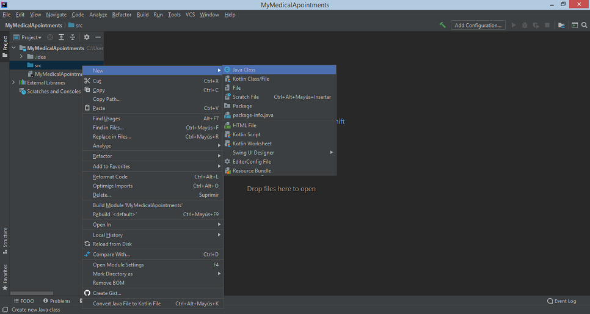

La primera clase que crearemos es la clase Main que contendrá nuestro método main. El método main() es el punto de entrada de la aplicación, es decir, es el punto en el que comienza la ejecución de esta:

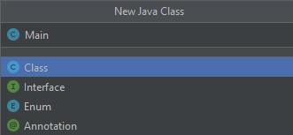

La segunda clase a crear es la clase Doctor que contendrá la información sobre los médicos:

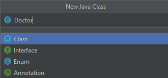

En la clase Doctor escribimos el siguiente código:

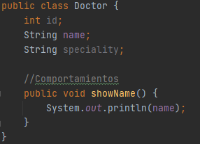

- **public:** Es el modificador de acceso. Public es el más permisivo de todos e indica que es un método accesible a través de una instancia del objeto
- **class Doctor:** Para declarar una clase utilizamos la palabra reservada **class**, seguido del nombre de la clase (en este caso el nombre es **Doctor**) y finalizamos con llaves.
- Dentro de las llaves definimos los atributos y los métodos.
  
	- **Atributos:** Para declarar un atributo es necesario poner el tipo de dato seguido del nombre. En este caso nosotros declaramos tres atributos; ***int id*** que es nuestro identificador, **String name** para el nombre del doctor y **String speciality** para especificar su especialidad.
	- **Métodos:** Para declarar un método ponemos el tipo seguido del nombre con dos paréntesis y finalizamos con llaves. Aquí solo tenemos un método; un método público (**public**), la palabra **void** indica que el método no retorna ningún valor y el nombre del método es **showName**.

- Dentro escribimos ***System.out.println()*** para imprimir el nombre (**name**).
  
	- En Java hay algunos objetos que existen por defecto (en cualquier entorno de desarrollo). Uno de ellos es el objeto denominado System.out. Este objeto dispone de un método llamado println que nos permite imprimir algo por pantalla en una ventana de consola.

En nuestro archivo Main escribimos el siguiente código:

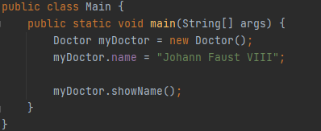

- **main:** Es el punto de entrada por ello que ha de ser **public** (accesible desde fuera de la clase) y **static** (se puede ejecutar sin una instancia de la clase).
- Lo primero que hacemos es crear el objeto, para eso ponemos el nombre de la clase para la cual vamos a crear el objeto y segundo el constructor que dicha clase posee, es decir, si el constructor recibe o no parámetros. Para crear objetos en Java, el lenguaje nos proporciona el comando **new**, con este comando le decimos a Java que vamos a crear un nuevo objeto de una clase en específico y le enviamos los parámetros (en caso de ser necesario) según el constructor.

	- En nuestro caso, **Doctor** es el nombre de la clase que estaríamos usando, **myDoctor** es el nombre del objeto, **new** es la palabra reservada para la creación de objetos y **Doctor()** es como llamamos al método constructor.

- Después usamos el operador punto que nos permite acceder a los distintos atributos y métodos de la clase.
  
	- ***myDoctor.name*** es la forma en que accedemos al atributo **name** de la clase **Doctor**. Usamos el operador de asignación y le damos un valor (en este caso un string) con el nombre.
	- **myDoctor.showName()** es como llamamos al método **showName** de la clase **Doctor** para que nos imprima en pantalla el nombre.

### Clase 6 *Método constructor*

El Método Constructor es el primer método que se ejecuta por defecto cuando creamos una clase, nos permite crear nuevas instancias de una clase. Lo invocamos con la palabra reservada new seguida del nombre con el que inicializamos la clase y paréntesis.

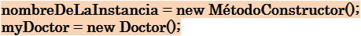

**Método Constructor**

- El método constructor nos va ayudar a crear nuevas instancias. De hecho de ahí viene su nombre, constructor, porque construye una clase.
- Tiene el mismo nombre que la clase que inicializa
- Siempre vamos a utilizar la palabra reservada new para invocarlo.
- Puede tener cero o más argumentos contenidos dentro de los paréntesis que siguen al nombre.
- No regresa un valor

El compilador de Java crea un método constructor en caso de que no definamos uno, pero de todas formas es muy buena idea programarlo nosotros, ya que nos permite definir y/o configurar el comportamiento de nuestros objetos usando argumentos.

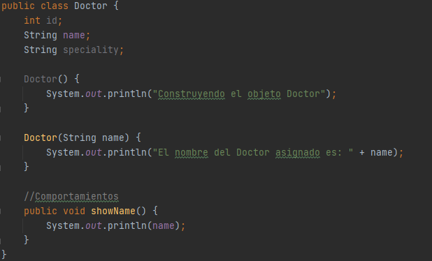

En este caso nosotros tenemos dos métodos constructores.

- El primero simplemente nos imprime un aviso de que se construye el objeto Doctor.
- El segundo método constructor sobrescribe el primer método haciendo que automáticamente el método vacío que teníamos se pierda. Además, recibe como parámetro una variable de tipo string y nos imprime lo que contenga esa variable.

***NOTA: El método constructor no debe regresar ningún valor (no necesitamos un return). Más adelante estudiaremos un poco más a fondo cómo funcionan la sobrecarga de métodos y sobrecarga de constructores.***

Ahora, en nuestro archivo Main, tenemos lo siguiente:

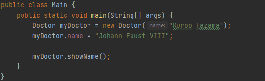

Nosotros enviamos de dos maneras el nombre del doctor y lo imprimimos de diferente manera. **¿Cuál es la diferencia?**
    
- Cuando es ***por valor***, la información de la variable se almacenan en una dirección de memoria diferente al recibirla en la función, por lo tanto si el valor de esa variable cambia NO afecta la variable original, solo se modifica dentro del contexto de la función.
- Cuando es ***por referencia***, la variable que se recibe como parámetro en la función apunta exactamente a la misma dirección de memoria que la variable original por lo que si dentro de la función se modifica su valor también se modifica la variable original.

***RECUERDA: Una clase NO es un objeto.***

### Clase 7 *Static: Variables y Métodos Estáticos*

Ya sabemos la diferencia entre clase y objeto:

- La clase es el molde donde dejamos la abstracción del objeto (en este caso, sus atributos y métodos).
- El objeto es como podemos definir datos a los atributos y métodos.

**Acceso a Métodos**

En esté siguiente código:

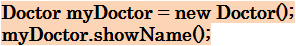

Podemos ver como utilizamos nuestro objeto myDoctor para invocar al método showName(). Pero existe otra forma de invocar a los métodos de una clase, si recordamos nuestro curso anterior, más precisamente en la clase Math, nosotros escribíamos esto:

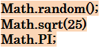

Utilizamos métodos estáticos de la clase Math, incluso también llamamos a la variable estática PI. Y lo hacíamos simplemente poniendo el nombre de la clase, punto y seguido del método estático o la variable estática.

Con esto tenemos dos formas de llamar métodos en Java:

- El primero es a partir del objeto de la instancia que se creó (como vimos con myDoctor).
- El segundo es definir el método o variable como estático y llamarlos a partir del nombre de la clase.

**Métodos Static**

- Se pueden usar en toda la clase.
- Están definidas por la palabra reservada static.
- Pueden ser accesado indicando el nombre de la clase, la notación punto y el nombre del método.
- Se invoca en una clase que no tiene instancias de la clase.

***RECUERDA: Con los métodos static NO es necesario crear un objeto para luego llamarlo, sino que simplemente con el nombre de la clase podemos accederlos.***

**Miembros Static**

Tomemos como ejemplo el siguiente código:

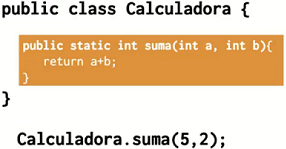

Aquí tenemos una clase Calculadora con un método suma de tipo static que recibe dos parámetros y la forma en que lo llamamos, siendo del tipo estático, es: ***Calculadora.suma()***.

Ahora supongamos que nuestra clase Calculadora tuviera definidos variables de tipo static:

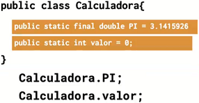

Y la forma en la llamamos sigue siendo a través del nombre de la clase, punto y el nombre del método.

**¿Cuál es el nivel de acceso de los miembros estáticos?**

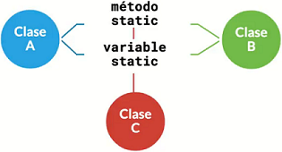

Tomemos como ejemplo esta imagen con tres clases, ahora imaginemos que nuestra variable entera «valor» de tipo static vive dentro de la clase C. La variable valor está inicializada en cero, pero si accedemos desde la clase A e imprimimos… nos mostrara en pantalla 0. Ahora imaginemos que lo incrementamos en 1, después la accedemos desde la clase B, entonces el valor que nos imprimirá ya no será el 0, sino que mostrara en pantalla el 1.

¿Qué sucedió? Pues a pesar de que no fue alterada por la clase C (donde vivía originalmente) sino que fue modificada por la clase A, mientras el programa continúe corriendo la variable "valor" puede ser alterada por cualquiera de las tres clases y de igual forma también puede ser imprimida. Además, las alteraciones serán constantes para todas las clases.

**¿Podemos llamar a los miembros static de una forma más directa?**

Si podemos hacerlo y es de la siguiente forma:

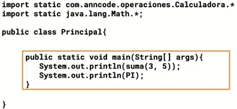

En la parte superior, en el encabezado la clase donde deseamos invocar al método, hacemos uso del **import**.

Cuando estuvimos en el curso anterior y hacíamos uso de la clase Math pudimos notar que era necesario importar un par de librerías. Esto, por supuesto, no afecta para nada el desempeño del programa, es totalmente invisible para el tamaño del programa. Entonces, para que nosotros podamos poner miembros estáticos de una manera mucho más resumidas podemos usar la palabra reservada static junto al import, incluso si ponemos el nombre de la clase seguido del asterisco (como por ejemplo, **Math.*** o **Calculadora.***) nosotros importamos absolutamente todos los miembros que existen dentro de esa clase.

De esta forma es como nos ahorramos el escribir el nombre de la clase y ponemos simplemente el método. Para un caso especial, como lo es la variable PI que existen tanto en la clase Math como en la clase Calculadora, podemos hacer la diferencia poniendo la clase específica a la que pertenece.

### Clase 8 *Creando elementos estáticos*

Ahora que ya sabemos cómo funciona static, vamos a definirlo mucho mejor con el siguiente ejemplo:

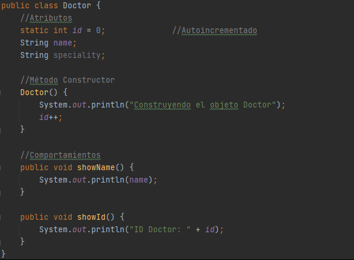

En nuestra clase Doctor, el atributo ID debe tener un comportamiento de autoincremento y que vaya creciendo cada vez que creemos un nuevo objeto de tipo Doctor. Para eso, lo que haremos es que nuestro ID sea del tipo static, dentro del constructor agregamos el incremento y para vez como funciona creamos el método showId() que nos imprime el identificador de los objetos Doctor.

Si nosotros corriéramos el programa con la siguiente entrada:

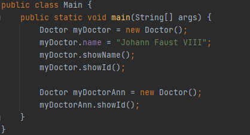

Nos imprimiría el identificado 1 y el identificador 2. ¿Qué sucede? Lo que pasa es que cuando corremos el programa por primera vez, el atributo id permanece como 0, pero cuando instanciemos un objeto Doctor entrara al método constructor e ira incrementándose.

Esto no sucedería si nuestro atributo id no sea del estático, porque eso nos impediría llevar el control del autoincremento y cada vez que instanciemos un nuevo objeto Doctor el identificador tomara la inicialización del dato por defecto. Algo que si sucede cuando el atributo SI es del tipo estático, el dato prevalece más allá de la instanciación del objeto y de esta forma podemos tener diferentes identificadores.

**Métodos Estáticos**

En muchos casos nuestro código necesita ejecutar métodos que no necesariamente deben pertenecer a un objeto o instancia en concreto, ya que pueden ser muy generales (así como ***Math.Random***) o los valores que almacenamos deben ser los mismos, sin importar si los consumimos desde una o más clases.

Tomemos como ejemplo este siguiente código:

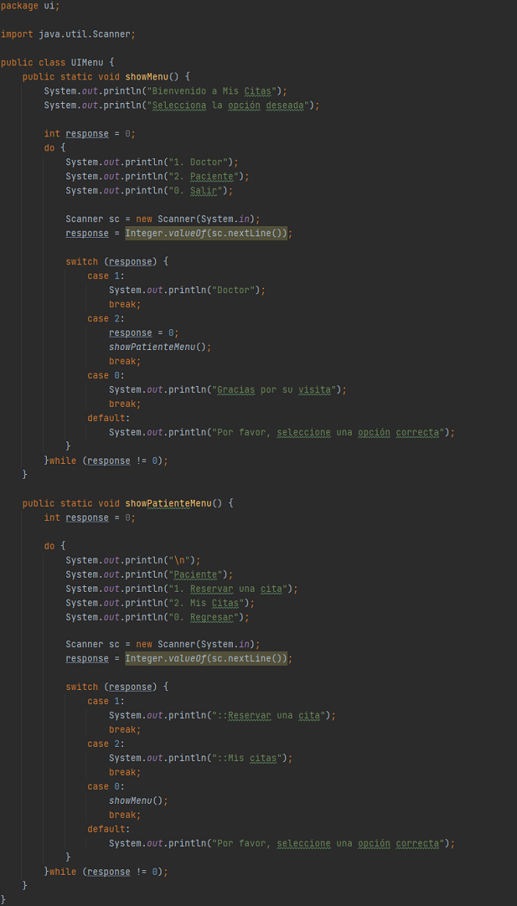

Creamos una clase que simbolizara nuestra interfaz gráfica y que tendrá en su interior dos menús. Además, para darle cierto orden y seguridad adicional, pondremos la clase UIMenu dentro de un package.

**Crear un package**

Lo que haremos es darle click derecho a «src» y después New > Package:

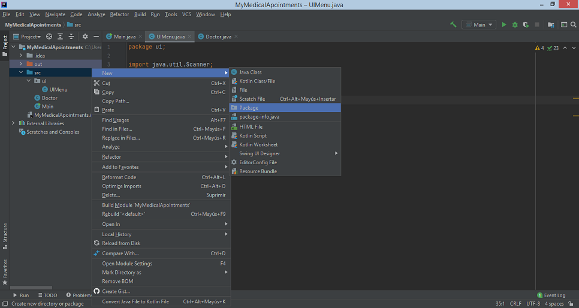

Para poner una clase dentro podemos darle click derecho a la carpeta package que creamos y después New > Java Class o movemos una de las clases ahí dentro.

Al hacer uso de paquetes en Java podemos darle orden y estructura a nuestros programas. Los paquetes en Java (packages) son la forma en la que Java nos permite agrupar de alguna manera lógica los componentes de nuestra aplicación que estén relacionados entre sí. También permiten poner en su interior casi cualquier cosa como: clases, interfaces, archivos de texto, entre otros. De este modo, los paquetes en Java ayudan a darle una buena organización a la aplicación ya que permiten modularizar o categorizar las diferentes estructuras que componen nuestro software.

Un paquete en Java queda declarado cuando se hace uso de la palabra reservada "package" seguido del "nombre" del paquete, como se muestra a continuación:

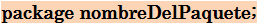

En el ejemplo tenemos:

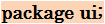

**Hacer uso del paquete**

Para utilizar los elementos de un paquete es necesario importar este en el módulo principal, usando para ello la sentencia ***import***.

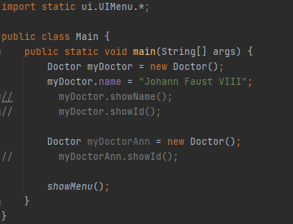

***RECUERDA: El import static nos permite invocar los diferentes métodos estáticos que pertenecen a ese paquete y que el asterisco significa que todos las clases dentro del paquete son importados.***

### Clase 9 *Final: Variables Constantes*

En la clase anterior ya aprendimos sobre las variables y los métodos estáticos, así que ahora seguiremos mejorando nuestro proyecto. Lo que haremos hoy es mostrar una lista de tres meses, cuando un paciente elija la opción de «Reservar una cita» el programa imprimirá en pantalla los tres meses disponibles que tiene para poder hacer su reserva, para eso creamos en primer lugar un arreglo de tipo string que contenga todos los meses:

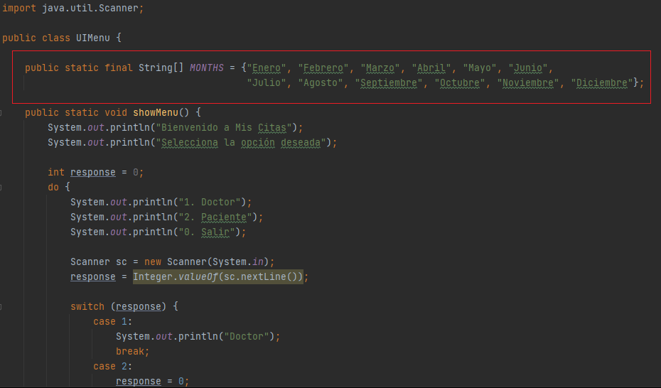

Como sabemos que los meses no cambian, nuestro arreglo será una constante, es decir, su valor permanecerá inmutable a lo largo del programa. Para crear una constante usamos la palabra reservada **final** y su estructura será la siguiente:

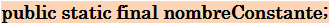

En general una constante también será del tipo static, pero esta NO ES una regla. Aunque lo vemos más a menudo, esto se debe a la lógica ya que por lo general si tenemos una constante también queremos que su alcance sea global, pero existen excepciones como vimos anteriormente con el identificador. Además, si recordamos la convención de nombres, una constante SIEMPRE se escribirá en mayúscula.

Ahora crearemos el código que nos imprima la lista de tres meses:

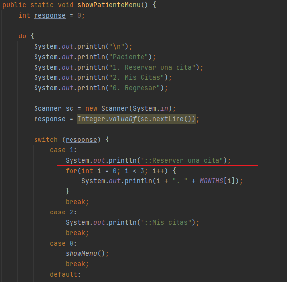

Por el momento, y por el bien del ejemplo, usaremos el bucle for para imprimir los primeros tres meses año.

### Clase 10 *Variable vs. Objeto: Un vistazo a la memoria*

Otra diferencia con respecto a las variables y los objetos es su situación en memoria, las variables primitivas viven en una parte completamente distinta a los objetos y eso es porque existen dos tipos de memoria: Stack y Heap.

La memoria **Stack** es mucho más rápida y nos permite almacenar nuestra información de forma "ordenada". Aquí se guardan las variables y sus valores de tipos de datos primitivos (booleanos, números, strings, entre otros).

Los objetos también usan la memoria Stack, pero no para guardar su información, sino para guardar las coordenadas a la verdadera ubicación del objeto en la memoria **Heap**, una memoria que nos permite guardar grandes cantidades de información, pero con un poco menos de velocidad.

Ahora, imaginemos esto:

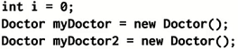

Tenemos una variable primitiva i y dos objetos de tipo Doctor llamados myDoctor y myDoctor2. Nosotros estamos acostumbrados a asignar valores de manera directa, sabemos que si por ejemplo tuviéramos otra variable entera b cuyo valor es 2 y le asignamos la variable i de la siguiente forma:

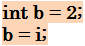

El nuevo valor de la variable b será el valor que tiene la variable i, es decir, ahora b vale 2.

Pero en el caso de los objeto es completamente distinto y eso se debe a la ubicación que tiene cada elemento. Miremos la siguiente imagen:

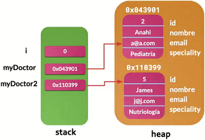

La zona verde que vemos representa la memoria Stack de nuestra computadora, cada vez que nosotros creemos una nueva variable, estas van y se almacenan directamente en la memoria como podemos ver que es el caso de la variable i. Pero para el caso de los objeto, cuando nosotros creamos un objeto lo que se almacena en la memoria Stack es la ubicación en memoria del lugar donde realmente están almacenadas los datos del objeto. Ese lugar en memoria se conoce como la memoria Heap que es una estructura en modo de árbol donde podemos tener varios datos y pueden crecer o decrecer.

Miremos unos ejemplos para entender mejor:

En primera tenemos nuestro ejemplo anteriormente dicho, dos variables primitivas i y b en el cual asignamos el valor de uno al otro. Después podemos ver un mejor ejemplo de cómo funciona la asignación en objetos.

En este caso tenemos dos objetos **Patient** (Paciente) con nombres y email distintos, incluso cuando imprimimos podemos ver que el resultado que nos dan son diferentes. Pero si nosotros realizamos la asignación y decimos que ahora **patient2** valdrá lo mismo que **patient** y volvemos a imprimir los datos, el resultado que nos darán será completamente iguales. Esto es porque ahora el objeto **patient2** tiene la dirección en memoria del objeto **patient**.

Por tanto, si nosotros realizáramos una modificación y cambiáramos el nombre en el objeto **patient2**, y nuevamente volviéramos a imprimir los datos el resultado seguirá permaneciendo igual. Recordemos que ahora **patient2** tiene la dirección en memoria de **patient** y toda alteración que se haga afectara a ambos objetos.

**NOTA**

Existieron algunas modificaciones al código, nuestra clase Doctor ahora tendrá esta forma:

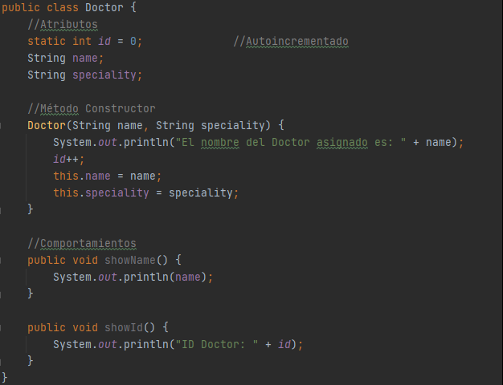

Y creamos una nueva clase Patient (que estaremos viendo más adelante) para registrar a los pacientes:

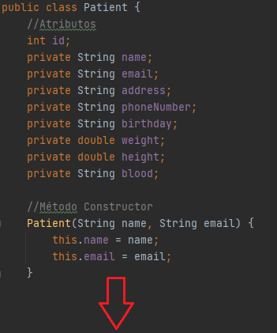

### Clase 11 *¡Reto!*

***¡Has avanzado muy bien!***

Ahora estás listo para resolver tu primer reto que en realidad es muy sencillo de hacer.

Mira el siguiente diagrama y construye la clase Patient:

Patient

name: String

email:String

address: String

phoneNumber: String

birthday: String

weight: double

height: double

blood: String

Patient(name: String, email: String)
