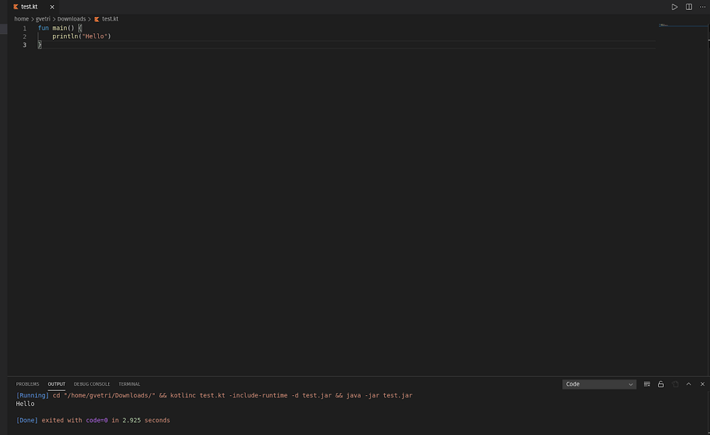
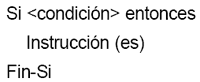
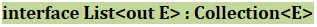
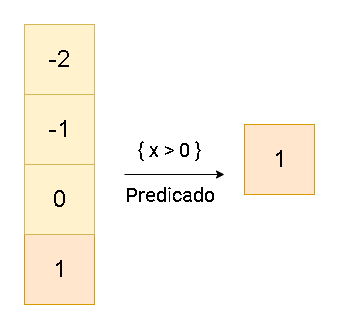
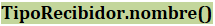
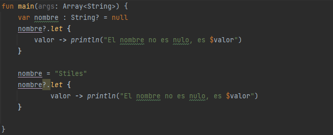
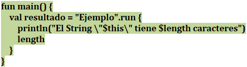
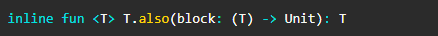
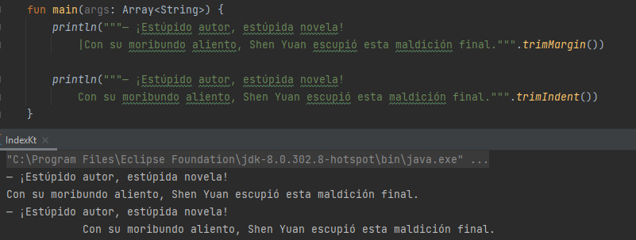

# Curso de Kotlin desde Cero
## Modulo 1. Introducción a Kotlin
### Clase 1 *Introducción al Curso de Kotlin*

¡Te damos la bienvenida al Curso de Kotlin desde Cero!

Nuestro profesor será **Giuseppe Vetri**, es un desarrollador Android con más de cuatro años de experiencia que gusta de Kotlin que le encanta la sintaxis y le gusta como lo puede utilizar para desarrollar aplicaciones o para escribir código, pero Kotlin no es solo para eso.

En este curso aprenderemos a cómo utilizar Kotlin para luego aplicarlo para desarrollar aplicaciones en backend, desarrollar aplicaciones Android y desarrollar aplicaciones multiplataforma. Este curso será la base para que podamos crear cosas increíbles con Kotlin.

### Clase 2 *Qué es Kotlin*

En esta clase hablaremos sobre que es Kotlin, como funciona y quien lo creo.

**Kotlin es desarrollado por JetBrains**

JetBrains es una compañía que se encarga de crear entornos de desarrollos como AppCode, WebStorm, IntelliJ IDEA, entre otros. Y es el entorno IntelliJ IDEA del cual se basaron para crear Android Studio, el entorno de desarrollo utilizado para crear aplicaciones en Android reemplazando a Eclipse como el IDE oficial.

**Nacimiento de Kotlin**

Kotlin nació en el 2010. Aunque no es tan viejo como Java es bastante robusto, amado por la comunidad y es la base del desarrollo Android hoy en día, pero no solo es utilizado para las aplicaciones Android.

Kotlin es usado en:

- **Backend Development:** Con frameworks como Spring, Micronaut o Ktor, para crear aplicaciones.
- **De forma nativa:** Se compila el código en una versión nativa, se crean ejecutables para Windows, Mac o Linux que después pueden ser corridos e instalados como una aplicación de escritorio.
- **Scripts:** Digamos que tenemos un código que se ejecuta varias veces y no queremos estar repitiendo este proceso manualmente, lo que podemos hacer es crear un script con Kotlin que automatice ese proceso.
- **Multiplataforma:** La versión multiplataforma no se enfoca en tener una UI igual para ambas plataformas, lo que hace es compilar el código en una librería y esa librería queda nativa para Android y iOS, se importa y tienes el mismo código en ambas plataformas.

**Surgimiento de Kotlin**

Kotlin surge de la necesidad de los programadores de JetBrains que buscaban reemplazar Java en los proyectos Android pues no siempre podían tener la última versión, lo cual los de dejaba un poco rezagados. Fue creado con la base de que fuese un lenguaje con las características de Scala, pero sin la penalización del tiempo de compilación de éste.

La interoperabilidad de Kotlin nos permite utilizar un poco de Java y un poco de Android, e ir migrando poco a poco hasta que nuestro proyecto sea completamente de Kotlin. Esto genera una gran adopción de Android porque nadie quería migrar toda su aplicación a un nuevo lenguaje de golpe o empezar de cero, sin embargo, Kotlin nos permite hacerlo poco a poco hasta el punto que quisiéramos y eso lo ha hecho un lenguaje muy popular entre los desarrolladores.

### Clase 3 *Qué es la Java Virtual Machine*

**¿Qué es una Java Virtual Machine?**

Una virtual machine es una virtualización o simulación de un sistema operativo o de los procesos que ocurren dentro de este. En nuestro caso, la Java Virtual Machine pertenece al segundo tipo y se encarga de simular los procesos que ocurren dentro de un sistema operativo. A este tipo de máquinas virtuales se les llama Process Virtual Machines.

**¿Qué ventaja nos da?**

Nos ayuda a manejar los punteros y las referencias de memoria que en otros tipos de lenguaje como C o C++ hay que manejar manualmente. Para esto se utiliza un proceso llamado garbage collection. Este proceso se encarga de revisar qué referencia de memoria no se está utilizando para eliminarla y así reducir la cantidad memoria que puede consumir un programa.

**¿Cómo funciona la JVM?**

La JVM funciona como un punto medio entre el código que nosotros escribimos y lo que entiende el sistema operativo del ordenador. Dependiendo del sistema operativo que uses puede variar. La JVM nos ayuda a que nuestro código se ejecute en Linux, Windows y MacOS. Nuestro código es convertido por la JVM a un lenguaje que puede entender el sistema operativo llamado Java Bytecode.

En palabras más simples, nosotros ingresamos código de Kotlin y se transforma en Bytecode. Este proceso puede ocurrir con otros lenguajes como Java, esto hace que nuestro código de Kotlin pueda ser utilizado desde Java y el código de Java pueda ser utilizado en Kotlin.

## Modulo 2. Configuración del entorno
### Clase 4 *Instalación de IntelliJ*

Es momento de crear un entorno de desarrollo en Windows. Para eso vamos al sitio oficial de [IntelliJ IDEA](https://www.jetbrains.com/idea/download/#section=windows "IntelliJ IDEA").

Como podemos ver tenemos las dos versiones. Ultimate es la versión de paga, mientras que la versión gratis y la cual descargaremos es la Community. Damos click en Download para que comience la descarga.

**Instalación de IntelliJ IDEA**

Vamos a la carpeta donde esta descargada el instalador, damos click derecho y "Ejecutar como administrador", o simplemente doble click sobre el archivo de instalación, después nos aparece una ventana que nos pide permiso para que la aplicación realice cambios en la computadora:

Aceptamos y nos aparece la ventana de instalación, damos click en Next:

Nos aparece el directorio donde se instalara el programa, damos click en Next nuevamente:

Usaremos la opción por defecto, así que Next:

Damos click en Install:

Y ya comienza la instalación:

Al terminar la instalación damos simplemente click en Finish:

**Utilizando IntelliJ IDEA**

Cuando ejecutamos el programa nos parece la licencia de JetBrains, aceptamos y damos click en Continue:

Después nos pregunta si queremos compartir datos, esto ya depende de cada persona en mi caso le doy a Don't Send para no compartir:

Una vez hecho todo eso, IntelliJ IDEA nos dará la bienvenida:

¿Qué significan los botones del costado?

- **Projects:** Podemos empezar un nuevo proyecto, abrir uno u obtener desde VCS que es un sistema de control de versiones.
- **Costume:** Aquí podemos realizar cambios en la apariencia, elegir un tema Light o Darcula dependiendo de los gusto, cambiar el tamaño de fuente y demás.
- **Plugins:** Los complementos que podemos instalar para ampliar nuestra funciones.
- **Learn IntelliJ IDEA:** Para aprender más sobre el programa.

**Creando proyecto con IntelliJ IDEA**

Ya podríamos crear nuestro primer proyecto con IntelliJ IDEA. Para eso damos click en New Project:

Seleccionaremos nuestra SDK, para eso en la parte superior donde dice Project SDK, abrimos y elegimos la versión del JDK:

Podemos ir en Add JDK para agregar una nueva versión:

Y al finalizar, ya tenemos completamente instalado nuestro entorno de desarrollo para comenzar a trabajar.

### Clase 5 *Instalación de IntelliJ en Linux*

La instalación de IntelliJ Idea Community en Linux es muy similar a la que hicimos en Windows, podemos descargar el programa directamente desde su [sitio web](https://www.jetbrains.com/es-es/idea/download/#section=linux "sitio web"), seleccionando la opción Descargar debajo del título de Community.

Después tenemos que extraer los archivos que se encuentran comprimidos dentro del archivo **.tar.gz**. Una vez descomprimidos, debemos buscar la carpeta bin, dentro habrá un archivo llamado **idea.sh**, el cual tendremos que ejecutar desde una terminal usando el comando **./idea**. Por último tendrás que crear los accesos directos manualmente dependiendo de la distribución de Linux que utilices.

Otra alternativa, y la que se recomienda, es descargar la **Toolbox App** de Jetbrains ya que esta gestionará las versiones que tengas instaladas, y también te ayudará a que tus iconos siempre estén funcionando de la manera adecuada. Al final es importante tener una linda estética en tu sistema operativo Linux, ¿no lo crees?

Esta la puedes descargar desde el [sitio web de Jetbrains](https://www.jetbrains.com/es-es/toolbox-app "sitio web de Jetbrains"), una vez que la descargues y ejecutes solo tendrás que seleccionar qué entorno de desarrollo quieres instalar. A menos que tengas una licencia de IntelliJ IDEA la opción que debes seleccionar es la de Community, ya que es la versión gratuita.

### Clase 6 *Kotlin con Visual Studio Code*

Aunque en este curso vayamos a trabajar con IntelliJ, ya que es el standard en la industria para trabajar con Kotlin, puede que si estás empezando a programar no tengas todavía un ordenador lo suficientemente potente para ejecutar IntelliJ o simplemente prefieras usar Visual Studio Code.

En esta guía podrás configurar tu Visual Studio Code para utilizar Kotlin.

**Descargar Visual Studio Code**

Para utilizar Visual Studio Code debes ir al siguiente enlace y descargar la versión dependiendo de tu sistema operativo: [Download Visual Studio Code](https://code.visualstudio.com/Download "Download Visual Studio Code") - Mac, Linux, Windows.

**Instalar el plugin de Kotlin y Code Runner**

Ahora que ya has descargado Visual Studio Code, tendrás que instalar el plugin de Kotlin y Code Runner para esto tienes que ir al marketplace y descargarlos.

- [Enlace del Marketplace](https://marketplace.visualstudio.com/items?itemName=mathiasfrohlich.Kotlin "Enlace del Marketplace") de visual studio code.
- [Enlace del Marketplace](https://marketplace.visualstudio.com/items?itemName=formulahendry.code-runner "Enlace del Marketplace") de visual studio code para instalar el code runner

Ahora puedes hacer clic derecho y ejecutar el código o presionar el botón de play en la esquina superior derecha.

Aquí te dejo un ejemplo de cómo se vería:

## Modulo 3. Hola mundo Kotlin
### Clase 7 *Hola mundo con Kotlin*

Ya tenemos instalado nuestro entorno de desarrollo y creamos nuestro primer proyecto, ahora veremos a profundidad que funcionalidad tiene cada archivo.

En el lado izquierdo tenemos todas las carpetas y archivos del proyecto:

- **.idea:** Contiene los archivos de configuración específicos del proyecto. Estos incluyen detalles del proyecto, mapeo VCS y configuraciones de ejecución y depuración, así como detalles del usuario, archivos abiertos actualmente, historial de navegación y configuración seleccionada actualmente. Algunos archivos pueden estar comprometidos con el control de código fuente, otros pueden excluirse.
- **out:** Contiene el resultado del proyecto después de ser compilado.
- **src:** Es la carpeta más importante. Contiene todo el código de nuestro proyecto.
	
    - **main.kt:** Es el archivo que contiene el código fuente escrito en Kotlin. El nombre ***main*** nos señala que es el punto por donde comienza a ser ejecutado el proyecto, y la extensión ***.kt*** que es un archivo de Kotlin.

- **MiPrimerProyecto.iml:** Es el módulo del proyecto. Un módulo se crea automáticamente junto con el proyecto, y nos permite combinar tecnologías y marcos en una aplicación.
- **External Libraries:** Son la colección de código externo que podemos agregar a nuestro proyecto. El proyecto le hace referencia, tal que no "pueda vivir sin él", pero no es "solo parte de este" proyecto.
- **Scratches and Consoles:** Son herramientas básicas que brinda una interacción más cómoda con el código fuente para el usuario. Los scratches son archivos que no están adjuntos a una fuente de datos especificas (como archivos temporales o un borrador del código fuera del contexto del proyecto). Consoles son archivos SQL ejecutables que se adjuntan a una fuente de datos especifica (como archivos que puedan ejecutar y compilar sentencias SQL).

**Método main**

- **fun:** Es la palabra reservada para declarar una función en Kotlin.
- **main:** Nombre de la función. La función Main sirve como punto de partida para la ejecución del programa.
- **(args: Array<String>):** Son los parámetros que reciben la función.
- **println:** Una variante de print que nos ayuda a imprimir un mensaje en pantalla. A diferencia de print, println ejecuta un salto de línea al final del mensaje.
- **"Hola mundo":** Es el mensaje que imprimiremos. Para declarar una cadena se utiliza comillas dobles, no se pueden declarar con las comillas simples.

### Clase 8 *Variables en Kotlin*

Todos los tipos de lenguajes de programación tienen las variables y Kotlin no es la opción. Una **variable** no es más que un espacio de memoria en el que podemos guardar información. Dependiendo del tipo de información disponemos de diferentes variables, lo que nos permitirá evitar problemas como por ejemplo intentar sumar un número con una letra, ya que al ser tipos de variables diferentes no nos lo permitirá.

**Variables mutables e inmutables**

Kotlin utiliza dos palabras clave diferentes para declarar variables: **val** y **var**.

- La palabra reservada ***«val»*** es para una variable cuyo valor no cambia nunca. No puedes volver a asignar un valor a una variable que se declaró mediante val.
- Utilizamos ***«var»*** para una variable cuyo valor puede cambiar.

La decisión de usar **var** o **val** depende del uso que queramos darle, pero resumiendo podríamos decir que si es para almacenar un valor único y garantizamos que no se modificaran debemos usar **val**. En cambio, si es una variable cuyo valor cambiara tantas veces como queramos utilizamos **var**.

**Declarar una variable**

Cuando declaramos una variable en Kotlin lo hacemos del siguiente modo:

En donde la palabra reservada **«var»** nos dice que es una variable mutable y **«dinero»** es el nombre de la variable. Para indicar el tipo de variable lo hacemos con dos puntos seguido del tipoVariable (en este caso, nuestra variables es del tipo **Int** indica que es del tipo numérico entero). Le asignamos el valor con el operador asignar (=) seguido del valor que tendrá nuestra variable (en este caso, la variable dinero tiene asignado el valor 10).

También podemos acortar nuestro código si lo escribimos de la siguiente forma:

Sigue siendo válido, incluso sin especificar el tipo de variable, esto se debe a que Kotlin es inteligente y puede inferir automáticamente el tipo. Esto nos permite tener un código más pequeño y legible a la hora de desarrollar software, aunque al final depende de nosotros y la convención que tengamos a la hora de escribir.

Del mismo modo, también podemos declarar una variable inmutable:

**Cambio de valor a la variable**

El valor asignado a nuestra variable **dinero** es de 10, pero si queremos cambiarlo lo que hacemos es escribir nuevamente el nombre de la variable seguido del operador asignar y el nuevo valor. En este caso, nuestra variable dinero pasa de tener 10 a 5.

Para verificar que asignamos correctamente los valores, podemos imprimirlos en pantalla con **println()**.

Esto obviamente no puede ser hecho con una variable de tipo val ya que es una variable inmutable, es decir, que no cambia de valor. En el caso de que intentemos modificar su valor, Kotlin nos indicara el error:

Y nos indicara que podemos cambiar el tipo de variable de **val** a **var**.

Del mismo modo, también podemos imprimir en pantalla el valor de las variables de tipo **val** mediante **println()**:

**Constante**

Una variante de las variables de solo lectura son las constantes. Una **constante** no puede cambiar durante la ejecución del programa (lo mismo hacen los valores), pero aparte de ello, su asignación debe ser constante. Además, solo puede ser declarada dentro de un objeto o en la parte superior de una función.

Para declarar una constante utilizamos ***const val***:

***NOTA: Las val y const son datos que se utilizaremos para definir valores unchangeables, pero esto es interesante y es porque son usadas en diferentes casos. En el caso de const, el valor se determina en tiempo de compilación, y en el caso de val, el valor se determina en tiempo de ejecución. En este caso vemos los elementos y en qué momento se le asigna un dato (en el caso de const es asignada cuando el programa se está compilado y en el caso de val es asignada cuando el programa ya fue ejecutado).***

### Clase 9 *Kotlin y sus tipos de variables*

En la clase anterior aprendimos a declarar variables y modificar su valor, ahora veremos qué tipos de variable. En Kotlin, el tipo de la variable se especifica después del nombre de la variable y es precedido de «**:**», los tipos básicos que tenemos son:

- **Numéricos:** Estas variables se usan para asignar números, calcular tamaños y realizar operaciones matemáticas entre otras. Dentro de ellas se dividen en dos grupos, las variables *enteras* y *reales*.
  
	- **Byte:** Es la más pequeña entre las variables numéricos, soporta solo un rango de -128 a 127.
	- **Short:** Soporta un rango mayor a Byte, pero menor a Int. Su rango va de -32,768 a 32,767.
	- **Int:** Es la más básica que usaremos, en la cual podremos insertar números naturales, pero hay una limitación. Con una variable de tipo Int no podemos pasar de -2,147,483,647 a 2,147,483,647. Este será el número máximo y mínimo que soportará.
    - **Long:** Básicamente es igual que Int, a diferencia de que soporta un rango mayor de números, de -9,223,372,036,854,775,807 a 9,223,372,036,854,775,807.
    - **Double:** Muy similar a float pero soporta hasta 14 decimales, pero también ocupa más memoria así que para un código óptimo deberemos pensar que tipo será el que más se adapte a nuestro proyecto.  Tampoco habrá que añadir ningún tipo de letra al final del valor.
    - **Float:** Llegamos a las variables reales. A diferencia de las anteriores, estas pueden almacenar decimales. Float soporta hasta 6 decimales, pero también puede trabajar con números enteros. Esta variable cambia un poco respecto a las demás, pues habrá que meter una «f» al final del valor.
	
	

- **Alfanuméricos:** Aunque los números sean muy útiles, hay veces que necesitaremos guardar cadenas de texto, o una mezcla de caracteres. Para ello tenemos las variables alfanuméricas.

	- **Char:** La variable Char nos permitirá guardar un carácter de cualquier tipo, lo único que debemos tener en cuenta es que va entre comillas simples.
	- **String:** La variable String será la que más usemos como norma general, nos permite almacenar cualquier tipo de caracteres pero a diferencia del Char, podemos añadir la cantidad que queramos. Para ser exactos, una String no es más que una cadena de Char. Las cadenas deberán ir entre comillas dobles.
	
    
	
- **Booleanas:** Son variables que solo pueden ser verdaderas o falsas (true o false). Su uso es muy amplio, cuando trabajemos con las condiciones veremos más a fondo este tema. Para asignar un valor basta con añadir true o false sin comillas.

    

**Concatenar cadenas de Textos**
Nosotros podemos combinar cadenas (string) de varios valores en uno solo. La forma más sencilla es usando el operador de adición (+) como herramienta de concatenación. Sin embargo, esto puede generar problemas cuando es necesario el espacio, pues debemos estar concatenando un string vacío (" ") para que las cadenas no estén pegadas.

Otra forma de concatenar es usando la interpolación de cadenas, también conocidas como la sintaxis de plantillas de Strings (String Templates). La interpolación te permite concatenar literales junto a fragmentos de expresiones antecedidas por el símbolo '$'. Hay dos formas de hacerlo:

- $id, donde id es un identificador simple
- ${e}, donde e es una expresión valida en Kotlin

    

**En Kotlin todo es un objeto**

Un ***objeto*** es un espacio en memoria más complejo que una simple variable. En el caso del objeto se compone de variables e incluso otros objetos, pero principalmente se compondrá de acciones, métodos y funcionalidades.

En Kotlin todo será un objeto, o al menos trataremos todos nuestros datos como uno, evitando los tipos de datos simples o sencillos (tipos primitivos). Nosotros tendremos dos tipos de datos (primitivos y objetos) y, aunque nosotros SI podremos declarar una variable, debemos evitar hacerlo. Son este tipo de cosas que podemos, pero no debemos de haber. Debemos procurar en tratar a los datos como si fueran objetos, y una característica que tiene Kotlin es que utiliza **wrappers** para los números y esto es llamado **boxing**.

Kotlin tiene características bastantes interesantes, como el hecho de no ser necesario poner punto y coma (;), incluso si lo ponemos el IDE nos señala que es algo redundante. Otra cosa interesante es que no necesitamos estar guardando los cambios, esto es porque ya automáticamente se están guardando.

Una característica para manejar los datos es que, si nosotros ponemos nuestra variable seguida del operador punto, Kotlin nos enseña una serie de métodos:

Esto es la clave donde, en ese momento, la variable está siendo tratada como objeto. Recordemos los objetos tendrán métodos y atributos, y las variables no.

Si nosotros quisiéramos poner un número seguido del operador punto:

Nos saldrán expresiones que pueden ser ejecutadas como convertir el número en un array o un list, pero no son métodos.

Entonces, para manejar nuestras operaciones, lo haremos del siguiente modo:

Tenemos **plus** para sumar, **minus** para restar, **times** para multiplicar y **div** para dividir. Y si queremos imprimir estas operaciones, solo es necesario encerrarlos dentro de un println. De esta forma es como nosotros ejecutamos las mismas operaciones del inicio, pero esta vez tratando los datos como objetos.

Y si observamos nuestro código, creamos directamente las variables, no las instanciamodefinimos para convertirlas en objetos, sino que Kotlin automáticamente ya lo asume como uno.

Entonces, tratas las variables es más conveniente y esto porque las sumas o métodos que están definidas en los objetos (esas variables que nosotros declaramos y Kotlin trata como objetos) están mucho más optimizadas, mejor organizadas en nuestro código, para manejar hilos, rutinas u operaciones en paralelo. Este tipo de operaciones que están definidas en los objetos es más adecuado utilizarlas porque nos permite preparar nuestro código para programación más robusta, concurrente, que sea a base de errores, etc.

### Clase 10 *Modificadores y tipos de datos en Kotlin*

Un **tipo de datos** es la propiedad de una variable que determina su dominio (qué valores puede tomar), qué operaciones se le pueden aplicar y cómo es representado internamente por el computador. Pueden ser ***números enteros***, ***cadenas de texto*** o ***booleanos***, y estos tres tipos de datos comparten algo en común; son datos ***primitivos***.

Los **tipos de datos primitivos** son asignaciones de memoria predefinidas para almacenar un dato, tales asignaciones de memoria son similares en los diversos lenguajes de programación, tanto para Java como Kotlin, y casi siempre lo único que los diferencia entre un lenguaje de programación y otro es su sintaxis, aunque en forma interna se manejan la misma cantidad de bits de memoria, así como su gestión de ésta. Con los tipos de datos primitivos nosotros somos capaces de crear ***objetos***.

**Todo es un objeto en Kotlin**

Como sabemos, un **objeto** es un espacio en memoria más complejo compuesto de variables e incluso otros objetos.

En Kotlin trataremos todos nuestros datos como un objeto, evitando los tipos de datos primitivos. Esto nos permitirá tener ventajas como un código más corto, conciso y directo, sin necesidad de estar repitiendo código constantemente. También podemos sobrescribir operadores como la suma para sumar dos objetos del mismo tipo.

**Retrocompatibilidad con Java**

Kotlin es compatible con todos los frameworks Java, teniendo soporte concreto en alguno de ellos como Spring tanto por parte del framework como con plugins específicos en IntelliJ. Es lo suficientemente para convertir el código de Kotlin a bytecode, esto es lo que permite que la migración de una aplicación Java existente a Kotlin se puede realizar de manera gradual, desarrollando el código nuevo, o cambiando gradualmente partes del código en Kotlin mientras se mantiene el código antiguo Java.

### Clase 11 *Operaciones con los tipos de datos en Kotlin*
Operaciones con los tipos de datos en Kotlin
En Kotlin las operaciones son traducidas a funciones interiormente por el compilador. La operación **val tercerValor = primerValor + segundoValor** es lo mismo que decir **tercerValor = primerValor.plus(segundoValor)**.

En la siguiente tabla te voy a dejar las operaciones que vas a poder realizar con los distintos tipos de datos y si te encuentras con alguno que no permita realizar esa operación puedes crearla por tu cuenta. Recuerda que Kotlin te permite extender el lenguaje para aprovechar estas funcionalidades.

**Operaciones más utilizadas**

Dependiendo del tipo de dato que tengas podrás utilizar todos o solamente algunas de estas operaciones, por ejemplo si tienes una variable del tipo de dato String no vas a poder dividirla, a menos que tú crees esa función. Sin embargo, sí vas a poder sumar dos variables del tipo de dato String para obtener el valor de dicha suma.

Con esto espero que hayas obtenido una idea sobre cómo funcionan las operaciones, queda de parte de ti si prefieres utilizar la versión larga del operator fun o el operador directamente.

Ten en cuenta que si las operator fun se inventaron para que puedas reducir tu código a operaciones con símbolos ¿por algo será, no?

### Clase 12 *Kotlin y la programación funcional*

Los lenguajes de programación comunes suelen permitir diferentes paradigmas de programación. Dentro de estos, se hace una distinción aproximada entre los paradigmas de **programación declarativa** y de **programación imperativa**. Simplificando mucho, estos paradigmas constituyen los métodos fundamentales de programación.

**Paradigma Imperativo**

Es el paradigma de programación más antiguo. Los programas consisten en una sucesión de instrucciones o conjunto de sentencias, como si el programador diera órdenes concretas. El desarrollador describe en el código paso por paso todo lo que hará su programa.

Ejemplos de programación imperativa más conocidos son: FORTRAN, PASCAL, COBOL, C, C#, C++, Ruby, etc.

**Paradigma Declarativo**

Este paradigma no necesita definir algoritmos puesto que describe el problema en lugar de encontrar una solución al mismo. Este paradigma utiliza el principio del razonamiento lógico para responder a las preguntas o cuestiones consultadas.

Este paradigma a su vez se divide en dos:

- **Programación Lógica:** Prolog
- **Programación funcional:** Lisp, Scala, Java, Kotlin

**Programación Funcional**

La programación funcional es un paradigma declarativo. Nos enfocaremos en "qué" estamos haciendo y no en "cómo" se está haciendo que sería el enfoque imperativo. Esto quiere decir que nosotros expresaremos nuestra lógica sin describir controles de flujo; no usaremos ciclos o condicionales.

Aunque Kotlin no es un lenguaje de programación funcional al 100% como Haskell o Scala, sigue teniendo muchos conceptos que, al entenderlas, nos ayudaran a sacar un mayor provecho del lenguaje, tales como:

- **Inmutable:** Un objeto inmutable es aquel que no puede ser modificado una vez haya sido creado. En la programación funcional la inmutabilidad es lo que hace que los demás conceptos funcionen. Si nuestra data fuera mutable la composición de funciones colapsaría y podríamos fallar en no tener estado compartido, que es otro de los pilares de la programación funcional.
- **Efectos secundarios:** En la programación funcional un efecto secundario es cualquier cambio en el estado/comportamiento de la aplicación observable fuera de la función en la que se ejecuta. En algunas ocasiones los efectos secundarios son evidentes y en otros un poco más sutiles.
- **Funciones puras:** Son funciones con la característica que generando una misma entrada retornaran a la misma salida, este no contiene efectos secundarios.
- **Composición de funciones:** Se refiere al proceso en que se fusionan dos o más funciones, esto para que sean ejecutadas en secuencia y generar un resultado concreto.
- **Recursividad:** Es una técnica muy usada en programación funcional porque nos evita el uso de iteraciones. Las funciones recursivas se invocan a sí mismas, permitiendo que una operación se realice una y otra vez hasta alcanzar el caso base.
- **Sistemas de Tipos:** Un sistema de inferencia de tipos permite inferir los tipos de las expresiones sin obligar al programador a su declaración explícita. En caso de que el programador los haya declarado, se comprueba que los tipos declarados encajan con los tipos inferidos por el sistema
- **Funciones de orden superior:** Son funciones que pueden tomar otras funciones como argumentos o devolverlos como resultados.

### Clase 13 *Estructuras de control: if*

Las **estructuras condicionales** comparan una variable contra otro(s) valor(es), para que en base al resultado de esta comparación, se siga un curso de acción dentro del programa. Cabe mencionar que la comparación se puede hacer contra otra variable o contra una constante, según se necesite. Existen tres tipos básicos, las simples, las dobles y las múltiples.

**Simples**
Las estructuras condicionales simples se les conoce como «Tomas de decisión». Estas tomas de decisión tienen la siguiente forma:

Donde:

- **Si:** Indica el comando de comparación
- **Condición:** Indica la condición a evaluar
- **Entonces:** Precede a las acciones a realizar cuando se cumple la condición
- **Instrucción(es):** Son las acciones a realizar cuando se cumple o no la condición

**Dobles**

Las estructuras condicionales dobles permiten elegir entre dos opciones o alternativas posibles en función del cumplimiento o no de una determinada condición. Se representa de la siguiente forma:

Donde:
- **Si:** Indica el comando de comparación
- **Condición:** Indica la condición a evaluar
- **Entonces:** Precede a las acciones a realizar cuando se cumple la condición
- **Instrucción(es):** Son las acciones a realizar cuando se cumple o no la condición
- **Si no:** Precede a las acciones a realizar cuando no se cumple la condición
	Dependiendo de si la comparación es cierta o falsa, se pueden realizar una o más acciones.

**Múltiples**

Las estructuras de comparación múltiples, son tomas de decisión especializadas que permiten comparar una variable contra distintos posibles resultados, ejecutando para cada caso una serie de instrucciones específicas. La forma común es la siguiente:

**Múltiples (En caso de)**

Las estructuras de comparación múltiples, es una toma de decisión especializada que permiten evaluar una variable con distintos posibles resultados, ejecutando para cada caso una serie de instrucciones específicas. La forma es la siguiente:

Hasta ahora solo hemos nuestros ejemplos solo han sido ejecutadas en el orden en que son formuladas. El orden de ejecución de las instrucciones es lo que se conoce como **Flujo del Programa**, y estas instrucciones pueden variar a voluntad utilizando las **sentencias de control de flujo**, con las que es muy fácil alterarlo para adecuarlo a nuestras necesidades. Esto es lo que hace potentes a los lenguajes de programación. Básicamente, existen tres tipos de sentencias; secuencial, condicional e iterativa, y con ellas se puede escribir cualquier programa.

**Sentencias Condicionales**

Existen dos formas de alterar el flujo dependiendo de una condición. La idea básica es la de encontrarnos ante una bifurcación de un camino, en la que seguiremos por uno u otro camino dependiendo de la respuesta a una pregunta que se halla escrita en la bifurcación. Una variante de esto es que en lugar de dos posibilidades, se nos presenten más caminos por los que poder seguir.

**Sentencia if**

La forma más elemental de control de flujo condicional y se emplea para tomar decisiones en función de una condición. Su sintaxis es la siguiente:

Si la condición se cumple (es decir, si su valor es **true**) se ejecutan todas las instrucciones que se encuentran dentro de {...}. Si la condición no se cumple (es decir, si su valor es **false**) no se ejecuta ninguna instrucción contenida en {...} y el programa continúa ejecutando el resto de instrucciones del script.

Ejemplo:

Tenemos una variable **«nombre»**. Usando **isNotEmpaty()** podemos comprobar si «nombre» es una cadena vacía o no. SI se cumple la condición, es decir, «nombre» efectivamente tiene guardado un cadena, entonces imprimimos la cantidad de caracteres con las que se compone.

En Kotlin, si la instrucción dentro de la condicional es de una simple línea, podemos ahorrarnos las llaves y acortar nuestro código de la siguiente forma:

**Estructura if-else**

En ocasiones, las decisiones que se deben realizar no son del tipo "si se cumple la condición, hazlo; si no se cumple, no hagas nada". Normalmente las condiciones suelen ser del tipo "si se cumple esta condición, hazlo; si no se cumple, haz esto otro".

Para este segundo tipo de decisiones, existe una variante de la estructura if llamada if-else. Su sintaxis es la siguiente:

Si la condición se cumple (es decir, si su valor es **true**) se ejecutan todas las instrucciones que se encuentran dentro del if(). Si la condición no se cumple (es decir, si su valor es **false**) se ejecutan todas las instrucciones contenidas en else{ }. Ejemplo:

Siguiendo nuestro ejemplo anterior. Tenemos una variable **«nombre»** el cual evaluaremos; SI se cumple la condición, es decir, la variable efectivamente tiene guardado un valor, entonces nos imprimirá la cantidad de caracteres con las que se compone. SI NO se cumple, es decir, tenemos un valor nulo (null), entonces nos imprimirá un mensaje para avisarnos.

Aunque no es la práctica más correcta y no deberíamos abusar, en determinadas ocasiones necesitamos más condiciones, y aunque podríamos recurrir a otras instrucciones, es posible construir una serie de comprobaciones uniendo un if a la cláusula else de un if anterior:

Si la primera condición se cumple (es decir, si su valor es **true** para la condicional_1) se ejecutan todas las instrucciones que se encuentran dentro del if(). Si la segunda condición  (es decir, su valor es **true** para la condicional_2) se ejecutan las instrucciones que contiene el else if(). Pero, si no se cumple ninguna (es decir, si su valor es **false** tanto para el primero como para el segundo) se ejecutan todas las instrucciones contenidas en else{ }. Ejemplo:

Tenemos dos variables, **«nombre»** y **«mensaje»**. Nosotros evaluaremos la variable «nombre»; SI nuestro nombre es mayor a 4, nos imprimirá el mensaje de que tenemos un nombre largo, pero SI nuestro nombre es nulo (es decir, está vacío) nos alertara imprimiendo un mensaje diferente, y si ninguna de las dos condiciones es cumple (es decir, no es nulo, pero tampoco mayor a 4) entonces nos imprimirá un mensaje para decirnos que tenemos un nombre corto.

Con nuestro IntelliJ podemos acortar aún más nuestro código, ya que el entorno nos aconsejara que creemos una condicional que asigne directamente el valor a una variable y también podemos optar por suprimir las llaves:

### Clase 14 *Estructuras de Control: when*

En lugar de la ampliamente utilizada declaración **switch**, Kotlin proporciona la expresión **when** que es mucho más flexible, concisa y poderoso.

**Expresión when**

Es una estructura de control para agilizar el flujo del programa en opciones múltiples. Se tiene una condición que se puede cumplir dependiendo de diferentes casos, cada caso nos lleva a un bloque de cumplimiento de la condición y ese bloque nos lleva a continuar el programa. Su sintaxis es la siguiente:

En comparación al switch, when es más conciso:

- No necesita agrupaciones complejas con case / break, solo la condición seguida de ->.
- Puede ser usada como expresión o declaración.
- Puede agrupar dos o más opciones equivalentes, separándolas con una coma.

Ejemplo:

Tenemos una variable **«nombreColor»**. Usando la expresión **when** evaluaremos esa variable y, dependiendo de cual valor cumple, el programa nos dará diferentes resultados.

Si la instrucción es de una sola línea, podemos ahorrarnos las llaves y acortar nuestro código. También, en lugar del default que tiene switch, la expresión when hace uso del else y, si tenemos varias opciones que devuelvan una misma respuesta, podemos agruparlas separándolos por una coma:

Pero la expresión when no solo funciona con cadenas de texto, también podemos evaluar números:

O podemos verificar el rango comprendido entre dos números. Para esto, creamos el rango utilizando el operador .. (punto doble) y el operador in sirve para verificar si un valor pertenece a un rango:

## Modulo 4. Conceptos básicos de Kotlin
### Clase 15 *Bucles: While y Do While*

Un **loop** es una estructura iterativa que permite repetir un bloque de instrucciones. Esta repetición es controlada por una condición booleana.

**While**
Es un bucle o sentencia repetitiva con una condición al principio. Se ejecuta una sentencia especificada mientras cierta condición se evalúe como verdadera. Dicha condición es evaluada antes de ejecutar la sentencia.

La sintaxis es:

Ejemplo:

Tenemos una variable **«contador»**. Con el bucle while evaluaremos el contador, mientras sea mayor a 0 imprimiremos el valor actual e iremos decrementando el valor de la variable en uno.

**NOTA:**

La evaluación se realiza antes de ejecutar el bloque. Si la expresión es **true** pasa a ejecutar de forma repetida el bloque de sentencias. Cada vez que termina de ejecutar el bloque de sentencias vuelve a evaluar la expresión. Si la expresión sigue siendo verdadera (true) vuelve a ejecutar el bloque. En el caso de que la expresión sea **falso** se saldrá del bucle.

Es por ello que dentro del bloque de sentencias deberán de existir sentencias que modifiquen la evaluación de la expresión, ya que de no hacerse se podría entrar en un bucle infinito.

***Los casos de uso de una sentencia repetitiva while son variados, pero principalmente se utiliza para recorrer estructuras de datos o tener contadores.***

**Do-While**

Es un bucle o sentencia repetitiva con una condición al final. Ejecuta una sentencia especificada, hasta que la condición de comprobación se evalúa como falsa. La condición se evalúa después de ejecutar la sentencia, dando como resultado que la sentencia especificada se ejecute al menos una vez.

La sintaxis es:

Ejemplo:

Creamos un bucle do-while, en su interior generaremos un número aleatorio. Primeramente indicaremos que generaremos un número aleatorio y para eso creamos la variable **«numeroAleatorio»**, especificamos que tiene que estar en un rango de 0 a 100 y hacemos uso de la función **random()** para obtener un número aleatorio dentro de ese mismo rango. Después imprimimos el resultado en pantalla. Si el número aleatorio es mayor a 50, volveremos al bucle, pero si el número es menor, entonces el bucle se detendrá.

**NOTA:**

El bucle do-while es prácticamente igual al while, pero con la diferencia de que el código del bucle se ejecutara al menos una vez ya que la comprobación se hace después de cada iteración y no antes como en el caso del while.
	
***Este tipo de bucle es el idóneo cuando necesitamos que un fragmento de código se ejecute al menos una vez y dependiendo de las circunstancias puede ser que se vuelva a repetir un número indeterminado de veces o ninguna. Un ejemplo claro del bucle do-while serían los menús de aplicaciones, los cuales mostraremos en forma de eco por pantalla, hasta que se introduzca la opción de salida.***

### Clase 16 *Ciclos*

El **bucle for** se utiliza para repetir una o más instrucciones un determinado número de veces, pero en Kotlin es un poco distinto a como es en otros lenguajes, aquí tenemos una variable que itera sobre rangos o datos estructurados y como tal en cada iteración toma el siguiente valor.

La sentencia se compone de una **declaración de variables**, una **expresión contenedora**, compuesta por el operador **in** y los datos estructurados (arreglos, listas, etc.), y el **cuerpo del bucle**:
	

Ejemplo:

Creamos una variable que contendrá nuestra lista de fruta compuesta por cuatro cadenas de textos (strings), para crear la lista hacemos uso de la función **listOf()**, y para poder imprimir su contenido usamos el **ciclo for**, donde **fruta** será la variable y **listaDeFrutas** nuestra estructura de datos.

Aunque usamos el cuerpo como un bloque de código, al ser una sola sentencia, puedes omitir las llaves:

**Lista**

Una lista es una colección genérica de elementos que se caracteriza por almacenarlos de forma ordenada, donde pueden existir duplicados (incluso un ítem null) y se indexan los elementos con base 0.

Su diseño es representado por la interfaz genérica **List< E >**, la cual hereda las operaciones base para colecciones de **Collection< E >**:

Si deseas crear una lista debes primero definir si será de solo lectura o mutable.

**Listas de solo lectura**

Similar a las variables de solo lectura, una lista de solo lectura (*read-only list*) puede ser consultada luego de ser inicializada, pero no te permite el uso de comandos para cambiar su estado.

Para crear una lista de solo lectura usa la función **listOf()**, la cual recibe como argumentos un grupo de ítems de un mismo tipo. Por ejemplo, crear nuestra lista de frutas:

Al inicializar una lista cuyo contenido sea claro, es posible omitir el tipo parametrizado. Por lo que en el caso anterior puedes remover a List< Int >.

**forEach**

El bucle forEach es una estructura especializada en recorrer los elementos que contiene una variable, es por eso que está especialmente indicado para ver o recorrer todos los elementos de una estructura de datos.

La sintaxis es similar a la de Java. Sin embargo, en Kotlin, el lambda acepta un solo parámetro:

Siguiendo con nuestro ejemplo anterior, en esta ocasión utilizamos **forEach** para recorrer nuestra lista de frutas y en su interior tenemos una función anónima cuyo parámetro es **fruta** y estará recibiendo los valores de nuestra estructura de datos.

Como vimos en nuestro ejemplo de lista mutable podemos utilizar **it** como el nombre del parámetro por defecto y no necesitamos nombrarlo explícitamente.

**for vs forEach**

- Usar forEach en lugar del bucle for hace que nuestro código sea más conciso e inteligente.
- ForEach se utilizan para realizar acciones en todos y cada uno de los elementos de la lista.
- Es como un enfoque de función hacia la forma tradicional de bucle for.
- Tanto los bucles for como los forEach son iguales cuando se generan resultados a partir de una matriz o lista
- ForEach puede ser más útil si usamos operadores más funcionales.

**Lambda**

Una función lambda es un literal de función que puede ser usado como expresión. Esto quiere decir, una función que no está ligada a un identificador y que puedes usar como valor.

Por ejemplo, si tenemos la función **f(s) = s + 2**, en Kotlin podemos expresarla como una declaración de función separada, así:

Al ser reescrita como lambda, tendrías lo siguiente:

Definir la función de esta forma te permitirá usarla como un valor en diferentes situaciones, como pasarla como argumento de una función o almacenarla en una variable.

La sintaxis de un literal lambda va al interior de dos llaves {}. Sus componentes son:

- **Lista de parámetros** — Cada parámetro es una declaración de variable, aunque esta lista es opcional
- **Operador de flecha ->** — Se omite si no usas lista de parámetros
- **Cuerpo del lambda** — Son las sentencias que van luego del operador de flecha

La anterior sintaxis de la imagen se puede leer como «para cada par de s y t corresponde el valor 2*(s+t).

**Función map**

La función de orden superior map { } nos permite aplicar una función sobre todos los elementos de una colección con el fin de una nueva colección con el cálculo final.

Por ejemplo, tenemos nuestra lista de frutas y quisiéramos obtener otra lista que tome cada elemento como argumento y nos entregue la cantidad de caracteres que compone ese elemento, es decir, cuantas letras tiene el nombre de cada fruta:

La solución consistió en pasar una función lambda que nos permita accede a la propiedad miembro **length** del string para poder obtener el tamaño de la secuencia de caracteres.

**Función filter()**

La función de extensión filter nos permite filtrar los ítems de una colección de elementos a partir de un predicado como argumento.

El predicado afirma o niega expresiones sobre el sujeto (cada elemento de la colección). Si un elemento satisface al predicado, entonces es incluido en el resultado final.

Este parámetro es representado por un tipo función cuyo único argumento es el sujeto y el cuerpo es Boolean. En la ilustración anterior veías que si se aplica el predicado x > 0 sobre la lista L = {-2 ,-1 ,0, 1} el resultado solo será el elemento 1.

Considerando nuestra lista de frutas, nosotros deseamos obtener aquellas cuyo tamaño de secuencia de caracteres sea mayor a 5. Usa la función filter y pasa una lambda que exprese este predicado:

Usa la condición **largoDeFruta > 5** para determinar si el tamaño de la secuencia de caracteres es mayor a 5. Efectivamente la salida será una lista List< Int > con 7, 8 y 7 que son los que satisfacen esta descripción.

### Clase 17 *Null-Safety en Kotlin*

La nada es un concepto ligado al lenguaje; en Kotlin, el pariente más cercano es el **null**. Para escribir código sólido, es importante comprender el concepto de nulo.

**¿Qué representa null?**

Null es un flag. Representa diferentes situaciones según el contexto en que se utiliza e invoca.

Esto produce el error más grave en desarrollo de software: Acoplar una decisión oculta en el contrato entre un objeto y quién lo utiliza.

Por si esto fuera poco rompe la biyección que era nuestra única regla de diseño, al representar múltiples elementos del dominio y obligando a tener interpretaciones contextuales.

Un buen principio de software nos reta a tener alta cohesión. Esto quiere decir que los objetos sean lo más específicos posible y tengan una única responsabilidad (La S de Solid). El objeto con menor cohesión de cualquier sistema es nuestro comodín: null.

**El error de los mil millones de dólares**

La creación de null ocurrió por un hecho fortuito en el año 1965.

Tony Hoare, el creador del algoritmo QuickSort y también ganador del premio Turing (el equivalente al Premio Nobel en Computación), lo agregó al lenguaje Algol porque le parecía práctico y fácil de hacer. Varias décadas después mostró su arrepentimiento:

*Esta excelente nota cuenta la historia en detalle
Lo llamo mi error de mil millones de dólares … En ese momento, estaba diseñando el primer sistema de tipos para referencias en un lenguaje orientado a objetos. Mi objetivo era asegurar que todo uso de referencias debería ser absolutamente seguro, con una verificación realizada automáticamente por el compilador. Pero no pude resistir la tentación de poner una referencia nula, simplemente porque era muy fácil de implementar. Esto ha llevado a innumerables errores, vulnerabilidades y fallas en el sistema, lo que probablemente ha causado miles de millones de dólares de dolor y daños en los últimos cuarenta años.* — Tony Hoare, inventor de ALGOL W.

**Null en Kotlin**

Uno de los errores más comunes en muchos lenguajes de programación es acceder a un miembro de referencia nula que dará como resultado una excepción de referencia nula. Esto sería el equivalente a un NullPointerException (NPE).

Kotlin tiene como objetivo eliminar el riesgo de los **NullPointerException**. Distingue entre referencias anulables y no anulables como parte de su sistema de tipos. En Kotlin, el sistema de tipos distingue entre referencia que pueden contener null (variables que aceptan el valor NULL) y aquellas que no pueden (variables del tipo no anulables). Es por eso que Kotlin es **Null Safety**, es decir, que gestiona los nulos de forma segura, de modo que puedes garantizar que tu código no va a producir NullPointerException.

Las únicas causas posibles de un NPE en Kotlin son:

- Una llamada explícita a throw NullPointerException().
- Uso del operador !!
- Inconsistencia de datos con respecto a la inicialización.
- Interoperación con Java, como por ejemplo problemas causados por el código Java externo o problemas de nulabilidad con tipos genéricos que se utilizan para la interoperación de Java.

**La excusa**

Los desarrolladores utilizan null porque es cómodo (de escribir) y porque creen que mejora la eficiencia del software. Al cometer este error ignoran que el código se lee hasta 10 veces más de las que se escribe.

Leer código con nulls es más arduo y dificultoso. Por lo tanto, solo están posponiendo el problema para más adelante. Con respecto a la eficiencia (que es la excusa más utilizada para generar acoplamiento), salvo en casos muy puntuales y críticos, esta pérdida en la performance es despreciable. Y solo se justifica en aquellos sistemas que privilegien la eficiencia sobre la legibilidad, adaptabilidad y mantenibilidad.

Este sesgo cognitivo se mantuvo en el tiempo a pesar de que, según el estado del arte actual las máquinas virtuales modernas optimizan el código por nosotros. Para utilizar evidencias en vez de opiniones, solo necesitamos empezar a hacer benchmarks en vez de continuar afirmando erróneamente que la eficiencia es más importante que la legibilidad.

***Benchmarks: Una prueba de rendimiento o comparativa es una técnica utilizada para medir el rendimiento de un sistema o uno de sus componentes.***

**Falla Rápido**

Null se (ab)usa para enmascarar situaciones inesperadas y propagar el error en el código muy lejos generando el tan temido efecto de onda.

Uno de los principios de un buen diseño consiste en fallar rápidamente.

Supongamos un formulario de ingreso de datos de un paciente donde se pide ingresar la fecha de nacimiento. En caso de existir un error en el componente visual y en la creación del objeto, este podría construirse con una fecha de nacimiento null. Al correr algún proceso nocturno a la noche que recolecte todas las fechas de los pacientes para calcular un promedio de edad el paciente ingresado va a generar un error.

El stack con información útil para el desarrollador va a estar muy lejos del lugar donde se está presente el defecto. Eventualmente podrían ser distintos sistemas con distintos lenguajes de programación o con transmisión de datos a través de una API, archivos etc.

La pesadilla del desarrollador es tener que depurar ese error a la madrugada y tratar de encontrar la causa raíz del problema.

**Trabajar con tipos que aceptan valores nulos**

- **Verificación igualdad a NULL**

	Podemos usar la expresión if-else para verificar explícitamente las variables que aceptan valores NULL . Sin embargo, esta opción solo funciona cuando la variable es inmutable. Dependiendo de la complejidad de las condiciones, esto también puede conducir a expresiones anidadas.

- **Operador de Acceso Seguro (?)**

	Kotlin tiene un operador  de acceso seguro, o Safe Call, para manejar referencias nulas. Este operador ejecuta cualquier acción solo cuando la referencia tiene un valor no nulo. De lo contrario, devuelve un valor nulo. El operador Safe Call combina una verificación nula junto con una llamada a un método en una sola expresión.

- **Método let()**

	Podemos hacer uso del método let() junto con el operador Safe Call para actuar sobre una variable que no acepta valores NULL.

- **Método also()**

	El método also() se utilizan para ejecutar operaciones adicionales como el registro y la impresión de las variables que no aceptan valores NULL. Además, este método puede ser utilizado en una cadena con let() o con el método run().

- **Método run()**

	El método run() es usado para ejecutar algunas operaciones en una referencia que no acepta valores NULL. Este método opera usando esta referencia y devuelve el valor del resultado lambda.

- **Operador Elvis ( ?: )**

	El operador Elvis nos devuelve un valor predeterminado solo si la variable original tiene un valor nulo. Si la expresión del lado izquierdo del operador de Elvis tiene un valor que no acepta valores NULL, se devuelve. De lo contrario, se devuelve la expresión del lado derecho.

- **Operador !!**

	Podemos usar el operador de aserción not null (!!) o not-null assertion operator para lanzar explícitamente una NullPointerException. Este operador convierte cualquier valor a un tipo no anulable. Si no se puede, se lanza una excepción del tipo NullPointerException.

### Clase 18 *Valores nulos, Double bang y cómo solucionarlos*

Los null no son malos, son incomprendidos. Como toda herramienta de programación, el null puede ser buena o mala dependiendo del uso que nosotros le estamos dando.

**Nullables**

Las variables de tipo nulo en Kotlin no existen mientras no se diga lo contrario. Es decir, a ningún objeto, por defecto, se le puede asignar null. Recuerda que en Kotlin todos los tipos son objetos.

Las variables nullables son aquellas que pueden aceptar valores null. Si necesitamos un tipo que acepte nulos, debemos definirlo como anulable, ubicando un signo de interrogación de cierre (?) al final del tipo.

Por ejemplo:

La variable **noAceptaNull** es de tipo no anulable, por lo que si intentas asignarle null tendremos el error:
***Null can not be a value of a non-null type String***

Por el otro lado **aceptaNull** que ha sido declarado anulable con String?, si permite la asignación del literal constante null (ausencia de valor).

**El compilador es tu amigo, no tu enemigo**

El compilador es capaz de interpretar estos tipos de variables nullables y advertirnos de lo que puede ocurrir al ejecutar nuestro programa. Por lo tanto, el compilador es nuestro amigo y si vemos que nos muestra un error no debemos buscar una forma rápida de saltarnos o ignorar ese error, sino que debemos buscar la manera de utilizar el lenguaje para sacarle provecho.

***RECUERDA: No programes pensando en complacer al compilador, programa para tener un código eficiente.***

**La regla del Boy Scout**

Imaginemos que ingresamos a una nueva empresa y comenzamos a crear código, pusimos código nullable en todos lados y no le hicimos caso al compilador e ignoramos los warning. Más adelante, en tal vez seis meses, cuando sigamos en esa misma empresa y nos toque ver nuevamente ese código no entenderemos lo que hicimos en el pasado y sufriremos cuando debamos mejorarlo.

Se bueno cuando compiles. No compiles para complacer al compilador, utiliza al compilador como amigo para crear mejor código.

Esto se llama la ***regla de los Boy Scout***. Deja siempre el código mejor que lo encontraste.

**Safe Calls**

El operador  de acceso seguro, o Safe Call, para manejar referencias nulas. Este operador ejecuta cualquier acción solo cuando la referencia tiene un valor no nulo. De lo contrario, devuelve un valor nulo. El operador Safe Call combina una verificación nula junto con una llamada a un método en una sola expresión.

Por ejemplo:
	

Si el miembro existe, entonces se retorna el contenido, de lo contrario se obtendrá null del recibidor.

**Double Bang**

El operador de aserción not null (!!) o not-null assertion operator evitará la necesidad de chequear null si estás completamente seguro de que una variable nunca será nula.

Hay muy pocos casos en los que este operador tiene sentido. Casi siempre hay una solución mejor.

***RECOMENDACIÓN: Utilizar este tipo de operador lo menos posible, porque no son considerado buenas prácticas.***

Por ejemplo, el siguiente código produce una NPE debido a que el contador nunca se reasigna con un valor entero:

Al intentar usar **dec()** para disminuir el valor, la excepción se disparará.

**Un gran poder conlleva una gran responsabilidad**

Digamos que somos una persona que ha probado mucho nuestro código, estamos 1000% seguros de que podemos usar el símbolo del Double Bang para saltarnos la prohibición de nullabilidad. Obviamente podemos hacerlo sin ningún problema, pero quedara bajo nuestra responsabilidad cuando el programa comience a fallar.

**Interoperabilidad con Java**

Cuando estamos trabajando con librerías Java, podemos encontrarnos ante diferentes situaciones con respecto al chequeo de nulos.

- **La librería está correctamente anotada**

	Si se están utilizando adecuadamente las anotaciones *@Nullable* y *@NotNull*, tanto las de Java como las propias de Android, Kotlin será capaz de trabajar sin problemas con ellas para deducir cuándo una variables es nula y cuándo no.
	Muchas partes del framework de Android ya están anotadas correctamente, así que esto es una ventaja enorme para trabajar con Kotlin.

- **La librería no tiene anotaciones**

	Sin embargo, si la librería no está anotada, los tipos serán marcados con un operador especial (una única !), lo que significa que queda en nuestra mano decidir si un parámetro o valor de retorno acepta nulo o no.
	
Con este tipo de casos tenemos dos recomendaciones:

- **Si tenemos acceso al código fuente, lo mejor es comprobar qué valores acepta el código en cuestión que estemos utilizando**

	Un ejemplo en Android que no está anotado es la librería de soporte de RecyclerView. Cuando creas un adapter y autogeneras los métodos, por defecto les añadirá una interrogación a los tipos.
	Pero si miras el código fuente, te darás cuenta de que nada puede ser null en los métodos que necesitas sobrescribir. Así que puedes deshacerte de todas las interrogaciones, y evitar chequeos de nulos innecesarios.

- **Si no tenemos acceso al código fuente, lo mejor será siempre tratarlos como del tipo nullable y mantener un ojo puesto en ellos**

	Por ejemplo, digamos que entramos a trabajar en una empresa que cuyo código de Java ha migrando a Kotlin, nosotros podemos encontrarnos con un tipo de dato raro que lleva un símbolo de exclamación al final (ejemplo, **Integer!**). Esto no significa que esa variable sea exactamente del tipo nullable, es solo la manera que tiene Kotlin de avisarte que NO puede asegurarse de que ese código no devuelve null.
	Solo nos queda asegurarnos de vigilar bien esas variables, porque en muchos casos pueden devolvernos valores nulos cuando menos lo esperamos y esto puede causar que nuestras aplicaciones se cierren inesperadamente.

### Clase 19 *Try Catch*

Las excepciones son problemas que ocurren en nuestro código durante la ejecución del programa e interrumpen el flujo convencional. Esto puede ocurrir debido a varias razones, como una operación aritmética no válida o una referencia nula.

**Manejo de Excepciones**

Es la capacidad de abordar (o manejar) la excepción que podría ocurrir. Si no manejamos cualquier excepción que ocurra, nuestro programa detendrá abruptamente la ejecución, cerrando nuestra aplicación inmediatamente.

El manejo de excepciones permite a nuestro programa continuar la ejecución incluso si hubo una excepción (aunque es altamente recomendable reportar tus excepciones usando una herramienta de reporteo de errores como Crashlytics).

**Excepciones de Kotlin**

En Kotlin, solo hay **excepciones no revisadas** que son arrojadas debido a fallas lógicos y se verifican en el tiempo de ejecución.

Los ejemplos de excepciones no revisadas incluyen:

- **ArithmeticException:** lanzada cuando divides entre cero.
- **ArrayIndexOutOfBoundExceptions:** arrojada cuando un arreglo ha sido accedido con un índice ilegal.
- **SecurityException:** Arrojada por el administrador de seguridad para indicar una violación de seguridad.
- **NullPointerException:** arrojada cuando se invoca un método o propiedad de un objeto nulo.

Aunque Kotlin hereda el concepto de excepción de Java, no admite ***excepciones revisadas***.

Las **excepciones revisadas** se consideran una característica controvertida en Java. Disminuye la productividad del desarrollador sin ningún aumento adicional en la calidad del código. Entre otros problemas, las excepciones revisadas también conducen a código repetitivo y dificulta el usar expresiones lambda.

Entonces, como muchos otros lenguajes de programación modernas, los desarrolladores de Kotlin también decidieron no incluir excepciones revisadas como una característica del lenguaje.

**Try-Catch**

Al igual que en Java, Kotlin nos permite capturar excepciones con la expresión ***try..catch..finally***.

En el bloque **try** ponemos el código que es propenso a lanzar excepciones y luego añade bloques **catch** que verifiquen la aplicabilidad de un subtipo de excepción.

Tomemos el siguiente código como ejemplo:

Tenemos dos variables, **«result1»** y **«result»**, en donde imprimiremos el resultado de dos divisiones. Dentro del bloque **try** están encerradas las divisiones porque pueden lanzarnos excepción, en la primera variable haremos la división y nos imprimirá el resultado **[ 10 / 2 = 5 ]**. En la segunda variable se detectara una excepción que será capturado por el bloque catch y se ejecutará el println() con la excepción.

El bloque **finally** se ejecuta luego de que se aplique o no algún bloque catch. Normalmente aquí liberamos los recursos que has tomado del sistema y limpiamos las referencias para evitar fugas de memoria.

**Lanzar excepciones en Kotlin**

Para lanzar objetos de excepción en Kotlin, usa la expresión **throw** seguido de la instanciación del tipo. Al igual que en Java, la declaración del tipo debe tener como supertipo a la interfaz **Throwable**.

### Clase 20 *Elvis operator*

**Elvis Operator ( ?: )** se usa para devolver un valor no nulo, incluso cuando la expresión condicional es nula. También se utiliza para comprobar la seguridad nula de los valores. En algunos casos, podemos declarar una variable que puede contener una referencia nula.

Tomemos el siguiente código como ejemplo:

Tenemos una variable **«nombre»** y deseamos imprimir el tamaño de caracteres, pero esa variable «nombre» también puede contener referencias nulas. Antes de conseguir el tamaño de caracteres, tenemos que verificar su nullabilidad. Para eso creamos una nueva variable, **«caracterNombre»**, que contendrá la longitud de caracteres y usamos el Operador Elvis.

SI nuestra variable «nombre» es nula, entonces se devolverá el valor por defecto que en este caso es 0. Pero si «nombre» NO es nula, entonces obtendremos el tamaño de caracteres.

## Modulo 15. Collections en Kotlin
### Clase 21 *Listas*

Una **lista** es una colección genérica de elementos que se caracteriza por almacenarlos de forma ordenada, donde pueden existir duplicados (incluso un ítem null) y se indexan los elementos con base 0.

Su diseño es representado por la interfaz genérica **List< E >**, la cual hereda las operaciones base para colecciones de **Collection< E >**:

Si deseas crear una lista debes primero definir si será de solo lectura o mutable.

**Lista de solo lectura**

Similar a las variables de solo lectura o inmutables, una **lista de solo lectura** (***read-only list***) puede ser consultada luego de ser inicializada, pero no te permite el uso de comandos para cambiar su estado. Es decir, en una lista de solo lectura no seremos capaces de eliminar ni modificar elementos, solo agregarlos.

Para crear una lista de solo lectura usa la función **listOf()**, la cual recibe como argumentos un grupo de ítems de un mismo tipo. Por ejemplo, crear una lista que contendrá nombres se vería así:

Al inicializar una lista cuyo contenido sea claro, es posible omitir el tipo parametrizado. Por lo que en el caso anterior puedes remover el **< String >**.

**Miembros de List**

Para acceder al estado de la lista puedes usar los siguientes miembros básicos:

- **size** para obtener la cantidad de elementos de la lista
- **lista[index]** para obtener el elemento ubicado en ***index***. Esta es la construcción para el operador de acceso posicional **get(index)**
- **indexOf(element)** para obtener el índice de la primera ocurrencia de ***element***. Si no se encuentra el elemento especificado dentro de la lista, nos devolverá un -1
- **lastIndexOf(element)** para obtener el índice de la última ocurrencia del ***element***
- **subList(fromIndex, toIndex)** para obtener una porción de la lista en el rango ***[fromIndex, toIndex)***

El tamaño de la lista es 5 como **size** lo indica. El operador **get(1)** retorna el nombre Mikey, pero nuestro IntelliJ IDEA nos recomendará usar la notación de corchetes como hicimos con **listaDeNombres[0]**.

El índice de **"Draken"** es 2, ya que usamos al 0 como base. **lastIndexOf("Chifuyu")** será 4, si por ejemplo el elemento **"Chifuyu"** no existiera dentro de la lista, entonces estaríamos recibiendo un -1. Y el **subList(0, 2)** obtiene los elementos "Takemichi" y "Mikey" debido a que el índice 2 se excluye de la obtención.

**Lista Mutable**

Una lista mutable es representada por la interfaz **MutableList< E >**. Como puedes intuir, este tipo de listas además ser consultadas como List< E >, te permiten añadir, cambiar y remover elementos.

Para crear una lista mutable usa la función **mutableListOf()** pasando el grupo de ítems de inicio. Y si deseas alterar el contenido usa los siguientes métodos:

- **add(element)** para añadir un nuevo ítem en la parte superior de la lista
- **add(index, element)** para insertar a ítem en un índice
- **removeAt(index)** para eliminar ítem en un índice
- **[index] = element**, para reemplazar un ítem en el índice. Esta construcción es equivalente al operador **set(index, element)**

Por ejemplo, supón que tenemos una lista de strings vacía. Si practicamos las operaciones anteriores podríamos moldear el contenido de la lista así:

Las operaciones anteriores muestra el estado de los elementos en la lista y como varía su orden en cada comando. Se inicializa la lista completamente vacía, sin ningún elemento y por lo cual especificamos el tipo, luego añadimos los elementos "Tormenta" y "Lluvia", en ese orden. Después, al inicio añadimos "Cielo", removemos a "Lluvia" de la posición 2 y cambiamos "Tormenta" por "Nube".

Al final usamos la función de extensión **sortDescending()** para ordenar en forma descendente a los ítems.

**Arreglos**

Si venimos de otros lenguajes de programación de seguro ya habremos conocido el concepto de arreglos. Los **arreglos** (***arrays***) es una estructura con valores de datos, que están almacenados de forma contigua en memoria. Todos los elementos son referenciados por un mismo nombre y tienen el mismo tipo de dato.

Los elementos estarán indexados tomando como base el 0 y el tamaño declarado del arreglo será fijo.

Kotlin usa la clase genérica **Array< T >** para representar arreglos. Crear instancias con un tipo parametrizado usa los siguientes métodos:

- **arrayOf(vararg elements : T):** recibe un argumento variables con elementos de tipo T y retorna el arreglo que los contiene.
- **arrayOfNulls(size : Int):** crea un arreglo de tamaño size con elementos de tipo T e inicializa los valores con null
- **emptyArray():** crear un arreglo vacío con el tipo T

Por ejemplo, supongamos que tenemos un arreglo que contiene cinco elementos números:

Si nosotros imprimiéramos ese arreglo como normalmente lo haríamos obtendremos algo un poco extraño. Esto se debe a que el arreglo es una estructura de datos muy básica a diferencia de las listas no nos permite obtener una visualización exacta, sino que nos muestra el código en **bytecode**. Es sencillo confundirse con este tipo de cosas, por eso Kotlin nos aconseja que utilicemos lista.

De todas formas, si nosotros quisiéramos imprimir el valor del arreglo lo que necesitaríamos hacer es convertirlo en lista con la función **toList()**.

### Clase 22 *Como ordenar listas con las funciones que tiene Kotlin*

En esta clase veremos algunas funciones de extensión que provee la librería entandar para ordenar nuestras listas en Kotlin. Esto con el fin de facilitar el manejo de las mismas en tus aplicaciones.

**Orden Natural**

El orden natural es el que se establece para aquellos tipos que implementan a la interfaz Comparable. La mayoría de tipos básicos de Kotlin tienen orden natural, por lo que son de gran utilidad al momento de usar funciones de ordenamiento.

A continuación veremos dos funciones que te permiten aplicar este concepto:

- **Función sorted():** Retorna una lista ordenada (en forma ascendente) de los elementos que se encuentran en la colección invocadora.
- **Función sortedDescending():** Como el nombre lo sugiere, **sortedDescending()** hace exactamente lo mismo que **sorted()**, solo que con un orden descendente en los elementos de la colección invocadora.

Considera la lista de número enteros para una lotería, **numerosDeLoteria = [27, 59, 80, 33, 18, 7, 69, 96]**, y la necesidad de ordenar a sus elementos en ordenes tanto ascendentes como descendentes según la recta numérica (orden natural). Aplicamos las funciones, sorted() y sortedDescending(), en Kotlin tendríamos el siguiente código:

**Orden Personalizado**

El orden personalizado se refiere a determinar particularmente la preponderancia de un elemento de cualquier tipo frente a otro. Esto quiere decir que cuando el orden natural no satisface tus necesidades, entonces defines por tu cuenta el criterio de ordenamiento. O si deseas establecer orden para objetos no comparables.

Las siguientes son funciones que materializan este mecanismo:

- **Función sortedBy():** Ordena en forma ascendente los elementos de una colección, basado en el orden natural del selector pasado como parámetro. Esta retorna en una lista de solo lectura con el ordenamiento final.
- **Función sortedByDescending():** **sortedByDescending()** es la versión de **sortedBy()** para en un ordenamiento descendente. Pasa como parámetro el selector que mapee a los elementos de una colección a instancias comparables y así retornar una lista de solo lectura.
- **Función sortedWith():** Retorna en una lista ordenada de acuerdo a la instancia Comparator pasada como argumento.

Siguiendo con nuestro ejemplo anterior, supongamos que deseamos ordenar nuestra lista de números de lotería según a aquellos números que son menores a 50:

**Función shuffled()**

La función de extensión **shuffled()** baraja los elementos de una colección y retorna una lista con el nuevo orden aleatorio.

Supongamos que tenemos una lista que contiene los números de lotería y deseamos ordenarlos aleatoriamente en una nueva lista, utilizando la función shuffled() tenemos el siguiente código:

**Función reversed()**

La función de extensión **reversed()** retorna una lista con los elementos en orden invertido de la colección invocadora. Puedes invocarla en varios tipos como arreglos, listas y strings.

Consideramos una lista que contiene a los números de lotería. Si deseamos invertir sus elementos escribimos el siguiente código:

**La Función map()**

La función de orden superior **map{ }** nos permite aplicar una función sobre todos los elementos de una colección con el fin de una nueva colección con el cálculo final.

Por ejemplo, tenemos la lista de números de enteros para una lotería, **numerosDeLoteria = [27, 59, 80, 33, 18, 7, 69, 96]**, y queremos generar una lista de mensajes con cada elemento:

**Función filter()**

La función de extensión **filter()** te permite filtrar los ítems de una colección de elementos a partir de un predicado como argumento. El predicado afirma o niega expresiones sobre el sujeto (cada elemento de la colección). Si un elemento satisface al predicado, entonces es incluido en el resultado final.

Teniendo en cuenta nuestra lista de números de lotería, supongamos que deseamos filtrar aquellos números que son mayores a 50:

### Clase 23 *Maps*

Un **maps** (***mapa***) es una colección que almacena sus elementos (entradas) en forma de pares clave-valor.

Esto quiere decir que a cada clave le corresponde un solo valor y será única como si se tratase de un identificador.

La ilustración anterior muestra la correspondencia entre una colección de claves a una de valores. Por ejemplo, la entrada **«Name» -> «Catrina»** sería un habitante del mapa.

***OBS.: Los mapas no tienen que ver con la función maps que hemos estado viendo en clases anteriores.***

**Mapas Mutables e Inmutables**

La interfaz que representa a los mapas inmutables en Kotlin es **Map< K, V >**. Donde los parámetros de tipo **K** y **V** representan a los tipos para claves (propiedad **keys**) y valores (propiedad **values**).

Esta definición solo te provee acceso de solo lectura, por lo que solo podrás usar comportamientos de consulta.

Para crear un mapa de solo lectura usa una de las formas de la función **mapOf()**.

Los mapas **mutables** te otorgan el poder de usar comandos de operaciones sobre los elementos como agregar, actualizar y remover entradas. El diseño de esta figura la encuentras en la interfaz **MutableMap< K, V >**, la cual extiende de **Map< K, V >**.

Crea una instancia de un mapa mutable con el método **mutableMapOf()**.

Por ejemplo, crearemos dos mapas que contengan las edades de varios superhéroes:

En donde los nombres (***Tony Stark, Peter Parker, Rhodey Rhodes***) son las **claves** y las edades (***46, 15, 48***) son los **valores**.

***RECUERDA: Las claves pueden tener múltiples valores, pero los valores solo pueden pertenecer a una única clave.***

**Operaciones de lectura**

Los siguientes son atributos y métodos que te permiten consultar el estado de tus mapas:

- **entries:** retorna un tipo Set< Entry< K, V > > de solo lectura de todos los pares clave-valor
- **keys:** retorna un Set< K > de solo lectura de todas las claves
- **size:** retorna el número de entradas en el mapa
- **values:** retornar una Collection< V > de solo lectura con los valores en el mapa

Si imprimes todas las propiedades del ejemplo anterior tendrás lo siguiente:

Por el lado de los métodos de lectura tienes a:

- **mapa[clave]:** Esta sintaxis permite obtener el valor a partir de la clave en el corchete. Es la construcción equivalente al operador get(clave)
- **getOrDefault(key, defaultValue):** Obtiene el valor correspondiente a la clave, de lo contrario retorna a defaultValue
- **isEmpty():** Retorna true si el mapa no contiene entradas y false en caso contrario
- **containsKey(key):** Retorna true si key existe en el mapa. Esto es equivalente a usar el operador in al comprar la clave frente al mapa
- **containsValue(value):** Retorna true si una o varias claves se relacionan con value

Observa algunos ejemplos:

El tipo de retorno del operador **get()** es anulable, por lo que si no encuentra el elemento obtendrás **null** como se muestra en la segunda impresión.

Tanto **containsKey()** como **containsValue()** pueden reemplazarse con el operador **in**.

**Añadir y actualizar entradas**

Usa el método **put(key, value)** para asociar la clave key con el valor value. Si la clave no existe la entrada es añadida al mapa, de lo contrario el valor es actualizado.

Sin embargo IntelliJ IDEA te recomendará usar al operador [ ] junto con la clave para añadir o actualizar.

**Remover entradas**

En este caso usa el método **remove(key)** para remover la entrada del mapa. Por ejemplo, eliminemos la entrada para "Rhodey Rhodes":

Otra variante del método es **remove(key, value)** donde se remueve el elemento con la clave key solo si su valor actual es value. El retorno será true si es eliminado o false en caso negativo.

**Recorrer un mapa**

Debido a la naturaleza de los mapas en Kotlin, es posible desestructurar las declaraciones que comprometan a sus entradas en valores individuales.

Un ejemplo claro de esto es recorrer sobre los elementos de un mapa en un **bucle for**:

Como ves, convertimos a la sintaxis (**hero**, **age**) cada entrada de **edadSuperHeroes**, con el fin de utilizar ambos elementos en el cuerpo del bucle.

Esto también es aplicable para la declaración de lambdas. Es posible expresar como lista de parámetros el par clave-valor. Por ejemplo, si usamos la función **forEach()** sobre el mapa para imprimir su contenido:

Pasamos como sección de parámetros el combinado (**hero**, **age**) para que el cuerpo del lambda imprima en cada iteración a la entrada.

### Clase 24 *Sets*

Un **conjunto** o **set** es una colección de elementos sin ordenar que no soporta duplicados. Puedes ver este diseño conceptual como el modelo de los conjuntos matemáticos.

**Sets de solo lectura**
La interfaz genérica **Set< E >** es la que representa a los conjuntos de solo lectura en el paquete **kotlin.collections**. Al igual que List, Set extiende de **Collection< E >**:
	

Para crear un conjunto de solo lectura usa la función **setOf()** y pasa como argumento la cantidad de elementos que albergará.

**Igualdad de conjuntos**

Dos conjuntos son iguales aunque sus elementos hayan sido incluidos en un orden diferente o la inicialización tenga copias.

El primer conjunto de números positivos contiene tres apariciones del número 4 al crear la instancia, sin embargo la construcción interna solo toma un valor.

Y también puedes comprobar que {1, 2, 3} = {2, 3, 1}.

**El Método contains()**

Para expresar la notación **«a pertenece a A»** usa el método **contains(element)** sobre el conjunto, para determinar si **element** pertenece. El operador **in** también cumple con esta evaluación.

Por ejemplo:

Ahora, si deseas comprobar si pertenece un subconjunto usa el método containsAll(elements):

**Sets mutables**

Si necesitas añadir y remover elementos de un set debes crear instancias que implementen la interfaz **MutableSet< E >** a través del método **mutableSetOf()**.

Al igual que **setOf()**, la función **mutableSetOf()** recibe los elementos que habitarán en el conjunto. También puedes optar por crear un conjunto vacío pero especificando el tipo parametrizado:

Si no especificas el argumento del tipo explícitamente para setVacio el compilador de Kotlin se quejará de la ausencia de información para la inferencia.

**Añadir elementos**

Agrega elementos al conjunto a través del método **add()** o usando los operadores de adición (**+**) o adición compuesta (**+=**) de las colecciones:

Recuerda que no se permiten los duplicados para los tipos Set, por lo que añadir un elemento existente no tendrá efecto.

**Remover elementos**

Como es normal usa el método **remove()** para remover elementos de un conjunto. O similar a la agregación, usa el operador de resta (**-**) o resta compuesta (**-=**) para conseguir el mismo resultado.

Tanto **add()** como **remove()** retornan un tipo Boolean, por lo que si las operaciones fueron exitosas tendrás true, de lo contrario false.

**Operaciones entre conjuntos**

- **La Función union()**
  
	La función infix **union()** toma como argumentos dos colecciones y retorna en un conjunto con todos los elementos que pertenezcan a ambas.

	

	La colección que actúa como operando izquierdo se ubica de primera en los índices.
		
- **La Función intersect()**
  
	Si deseas aislar solo los elementos que estén presentes en dos colecciones, entonces usa la función **intersect()**. El resultado será en conjunto intermedio de coincidencias:
	
	
	
- **La Función subtract()**
  
	Cuando necesites calcular la diferencia entre dos colecciones usa la función **subtract()**. El valor de retorno de A subtract B es el conjunto que resulta de eliminar de A cualquier elemento que esté en B.

	
	

## Modulo 6. Libera el potencial de las funciones
### Clase 25 *¿Qué son las funciones?*

En clases anteriores ya hemos visto cómo utilizar funciones como maps, list, y en enteros y cadenas de textos, pero estas funciones vienen con el lenguaje. Ahora aprenderemos a como crear nuestras propias funciones desde cero.

**¿Qué es una función?**

Kotlin es un lenguaje que te permite aplicar estilos de programación funcional en tus aplicaciones. Por ello la función es una herramienta indispensable.

Una **función** es un conjunto de instrucciones que realizan una tarea específica, empaquetadas como unidad. Esta puede ser llamada en el lugar donde sea que la necesites para ejecutar las sentencias.

**Sintaxis de una función**

El siguiente ejemplo muestra la sintaxis de declaración de una función en Kotlin:

La anterior función eleva al cuadrado un parámetro entero.

La declaración comienza con la palabra clave fun y se conforma de:

- **Nombre de la función:** Es el nombre que eliges para la función con el fin de esclarecer su propósito
- **Lista de parámetros:** Datos de entrada para la función. Defínelos como ***nombre:tipo*** y sepáralos por comas.
- **Tipo de retorno:** Tipo de dato de salida de la función. Una función con un cuerpo de bloque de código, siempre debe tener su tipo definido.
- **Cuerpo de la función:** Son todas las sentencias que realizan la tarea para llegar al resultado final de retorno. Usa la expresión ***return*** para devolver el valor.

**Todas las funciones en Kotlin devuelven un valor**

Ya sabemos que ***return*** es la expresión que utilizamos para que la función nos devuelva un valor, pero también tenemos ***unit***.

**Unit** es la palabra reservada análoga a **void** en Java. Esto determina que una función no retorna valor.

Por ejemplo, crear una función que imprima si un carácter es una vocal o no.

La solución propuesta, usa una expresión **when** para comprobar si el parámetro de tipo Char coincide con las vocales. Sin embargo, como no deseamos retornar un valor significativo hacia el exterior, usamos como tipo de retorno **Unit**.

**Omitir tipo Unit**

Aunque el compilador de Kotlin no puede realizar inferencias de tipos con funciones con cuerpo de bloques de código, el tipo Unit es una excepción, es posible omitirlo de la declaración debido a su naturaleza.

La anterior función la puedes reescribir sin él:

### Clase 26 *Funciones y funciones de extensión*

La forma de invocar a una función es escribir el nombre en el punto del flujo donde requieras ejecutar las instrucciones y pasarle los argumentos con que se declaró.

Por ejemplo, creamos una función llamada **randomCase()** que transformara nuestra frase para que sea completamente mayúscula o minúscula dependiendo de un número aleatorio, y lo llamaríamos de esta forma:

Por supuesto, si nosotros solamente llamáramos a ***randomCase(fraseAleatoria)*** no nos imprimiría la frase, por lo que encerramos nuestra función invocada dentro de un println(). Otra forma sería creando una nueva variable que contendría el valor que nos devolvió nuestra función:

E imprimiéramos esa variable.

Dependiendo de nuestro código, tendremos ocasiones en las que es mejor guardar el valor retornada de nuestra función en una variable o utilizarla directamente.

También, podemos acortar nuestro código y modificar nuestro retorno. Similar a cuando asignamos nuestro **if** a una variable, podemos utilizar **return** y el resultado de nuestro if será lo devuelto por la función:

Ahora, digamos que queremos imprimir nuestra función con la randomCase(), para eso creamos otra función esta vez llamada **impimirFrase()**:

**Función de Extensión**

Una **función de extensión** es una función que extiende las funcionalidades de una clase, con la introducción de un nuevo parámetro llamado: parámetro recibidor.

Este parámetro se incorpora a la sintaxis, declarando su tipo, seguido de un punto y luego el nombre de la función:
	

En otras palabras, una función de extensión es una función que puede ser llamada como miembro de una clase, pero está definida por fuera de ella.

Por ejemplo, utilizamos nuevamente nuestra función **randomCase()**, pero en este caso como una función de extensión:

La función de extensión **randomCase()** usa como tipo de recibidor a ***String***. En su cuerpo puede acceder a ***this*** para referirse al objeto recibidor. Este te permitirá acceder a los miembros de los objetos que usarán esta función.

Llamamos a la función de extensión mediante el operador punto (.), donde no será necesario pasar ningún parámetro a diferencia de las funciones regulares. Por ejemplo:

### Clase 27 *Tipos de parámetros en las funciones*

Hemos hablando sobre funciones y funciones de extensión, pero lo que no sabemos hasta ahora es que, dependiendo de la función que nosotros deseamos crear, podemos tener distintos tipos de parámetros. Como lo son los ***parámetros por defectos*** o los ***parámetros nombrados***.

**Argumentos nombrados**

Es posible especificar el nombre de los argumentos que deseas usar en la llamada de tu función.

Para ello usamos la sintaxis de argumentos nombrados:

Por ejemplo, tenemos una función que imprime el nombre y el apellido que nosotros pasamos por los parámetros:

Pero esa especificaciones que vemos pertenecen a nuestro IntelliJ, si compartiéramos este código y lo abrieran en otro entorno de desarrollo no se sabría a qué parámetros pertenecen los valores que pasamos.

Kotlin nos brinda la opción solucionar este problema, llamamos a **imprimirNombre()** pasando el valor de los parámetros con la sintaxis para argumentos nombrados:

Los argumentos nombrados pueden ser utilizados simplemente para que quede claro que es cada parámetro en una llamada a una función sin tener que mirar ni la definición ni la documentación. Pero también para pasar valores a los parámetros desordenados indicándolos por su nombre para no tener que utilizar la posición en la que están definidos.

**Argumentos por defecto**

Para declarar una función con valores por defecto en sus parámetros, usa el operador igual (=) seguido por el valor por defecto en la declaración.

Por ejemplo, supongamos que tenemos un arreglo con los nombres de unos clientes y deseamos crear una función que retorne un elemento de acuerdo al índice. Además de ello, deseamos que retorne el ítem de la posición cero, si el argumento no es proveído.

En el siguiente código ilustramos el caso:

Como vemos, al asignar el parámetro con un valor en su declaración, tienes la posibilidad de omitir el valor del argumento en la llamada de **loadCustomer()**.

### Clase 28 *Lambdas*

Una **función lambda** es un literal de función que puede ser usado como expresión. Esto quiere decir, una función que no está ligada a un identificador y que puedes usar como valor.

Por ejemplo, si tenemos la función ***f(s) = s + 2***, en Kotlin podemos expresarla como una declaración de función separada, así:

Al ser reescrita como lambda, tendrías lo siguiente:

Definir la función de esta forma te permitirá usarla como un valor en diferentes situaciones, como pasarla como argumento de una función o almacenarla en una variable.

La sintaxis de un literal lambda va al interior de dos llaves {}. Sus componentes son:

- **Lista de parámetros:** Cada parámetro es una declaración de variable, aunque esta lista es opcional
- **Operador de flecha ->:** Se omite si no usas lista de parámetros
- **Cuerpo del lambda:** Son las sentencias que van luego del operador de flecha

La anterior sintaxis de la imagen se puede leer como **«para cada par de s y t corresponde el valor 2 * ( s + t )­»**.

**Sintaxis de tipos función**

La declaración de un tipo función en su forma base, se compone de los tipos de los argumentos que toma en paréntesis, el operador -> y el tipo que retorna.

Por ejemplo, un tipo función cuyo par de argumentos String corresponde un resultado String:

Uno que toma un entero como parámetro pero no tiene retorno particular sería:

O si existe un tipo función sin parámetros que retorna un Double:

**Almacenar lambda en variable**

El tipo función nos abre un nuevo abanico de posibilidades. Y una de ellas es el almacenamiento de instancias tipo función en variables.

Como caso particular, veamos instancias escritas como funciones lambda .

Por ejemplo, si deseamos saber la cantidad caracteres que tiene una cadena de texto, podemos almacenar la lambda así y después imprimir su resultado en pantalla:

En este ejemplo pasamos un **String** como parámetro, pero retornamos un entero (**Int**).

Otro ejemplo sería el siguiente:

En el que tenemos una lista de saludos en diferentes idiomas y aplicamos **map()** para pasarle por parámetro nuestra función lambda. Esto crea una conexión entre el map() y la lambda, el código ejecutara nuestra función pasando como argumento del String cada elemento de la lista.

Nos resulta muy útil cuando queremos realizar una serie de operaciones para varias listas y, en lugar de estar repitiendo código, solo los estaremos definiéndolo una sola vez y devolviéndonos el resultado deseado.

**Lambda como argumento**

Tratar a la funciones como pequeñas piezas de código con lambdas, nos permite la flexibilidad de pasar funciones como argumentos de otras funciones (funciones de orden superior).

Por ejemplo, supongamos que se nos presenta el problema de contar la cantidad de caracteres 'e' dentro de "develou.com".

La solución más común sin refactorizar, sería recorrer en un bucle for la cadena, con un condicional en su interior. Sin embargo existe la función **CharSequence.count()**, a la cual podemos pasarle un lambda que represente el predicado propuesto en nuestro problema:

El predicado ***char -> char == 'e'*** se podría leer como «al parámetro char corresponde su resultado de igualdad con 'e'». Y el resultado de este código será la cantidad de 'e' que tiene la cadena de texto.

**Omitir paréntesis de función**

Si la expresión lambda es el último argumento en la función, puedes escribir las llaves por fuera del paréntesis:

Y si los paréntesis están vacíos, entonces puedes omitirlos completamente:

**Omitir tipo del parámetro**

Si el contexto permite la inferencia de tipo del parámetro en la lambda, entonces puedes omitirlo del bloque.

En nuestro ejemplo, el compilador puede llegar a determinar que el parámetro **char** es ***Char*** por la comparación de igualdad, por lo que podemos omitirlo:

**El identificador it**

Cuando tu lambda usa un único argumento y no piensas cambiar su nombre por cuestiones de legibilidad, puedes usar el identificador it.

Esta variable se deduce implícitamente con el tipo inferido por el compilador y puedes referirte a ella como tu parámetro.

Por ejemplo, si cambiamos el parámetro explicito **char** por **it** tendrías:

**Lambdas con múltiples líneas**

Es posible escribir una lambda con varias líneas en su cuerpo. Solo pon las expresiones dentro del paréntesis normalmente. La última línea será el resultado del lambda.

Por ejemplo, expandamos el predicado para **count()** y antepongamos una línea donde imprimas cada carácter procesado:

### Clase 29 *High Order functions*

Una **función de orden superior** (*High Order Function*), es una función que puede recibir como argumento una o más funciones y/o retornar una función como resultado.

Esto es posible gracias a los tipos función que Kotlin incluye en su gramática.

**Tomar funciones como argumentos**

Para recibir argumentos en una función, agrega a la firma uno o varios parámetros de tipo función.

El fin es ejecutar la función entrante, realizarle una llamada y hacer el uso correspondiente de su resultado.

Por ejemplo, supongamos que queremos obtener la longitud de una cadena de texto:

En este código creamos una función de orden superior cuyo primer parámetro es el valor (**valorInicial**) del String que será medido. El segundo parámetro **block** es una función del tipo **(String) -> Int**, es decir, que toma como parámetro un String y nos retorna un entero (Int).

Al llamar a **superFuncion()** en **main()**, pasamos por el primer parámetro la cadena de texto a ser medida y por el segundo parámetro un lambda que se encargara de calcular la cantidad de caracteres que tiene nuestra String.

Como en este ejemplo hemos pasado ***«Xiao, el guardián Yaksha»*** la impresión en pantalla será ***24***, su longitud total.

**Retornar funciones desde funciones**

Retornar un tipo función desde una función de orden superior tiene la misma sintaxis de un retorno regular.

Defines el tipo en la firma de la función y en el bloque de código de la misma, usas la expresión **return** para especificar el literal de función o referencia que será devuelto como valor.

Por ejemplo, tendremos una función al que enviaremos un nombre y nos ese mismo nombre junto a un saludo en pantalla:

Creamos una función de orden superior que recibe un parámetro **nombre**. Esta función nos devolverá una lambda del tipo **() -> String**, lo que significa que es una función sin parámetros que nos retorna una cadena de texto. En el **return** ponemos entre llaves **{ }** la cadena de texto que será devuelta.

Finalmente en **main()** declaramos una **lambda** en la cual llamaremos a la **funcionInception()**, pero como el retorno es una función lo que necesitaremos hacer es invocar el valor de la lambda para poder obtener nuestro resultado, para eso creamos una variable **valorLambda** e invocamos nuestra **lambda()**. Y finalmente imprimimos el valorLambda.

Como en este ejemplo el nombre que enviamos es ***«Hu Tao»***, en pantalla se imprimirá el mensaje de ***Hola desde la lambda, Hu Tao***.

## Modulo 7. Scope functions
### Clase 30 *Let*

La **función let** es una función que crea un alcance temporal para un objeto en el interior de un bloque de código. Esto quiere decir, que puedes referirte al objeto sin usar su nombre debido a que es el parámetro de la función lambda pasada a let.

	

Como vez en su declaración, let:

- Es una función genérica con argumentos **T** y **R**
- Es una **función inline**
- Es una función de extensión del tipo recibidor **T**
- Recibe como parámetro un tipo función **(T)-> (R)**
- Retorna como resultado a **R**
	
Ya que let ejecuta a block pasando la expresión this del objeto recibidor, es como si crearas un espacio de escritura para tus sentencias asociadas al objeto.

**Función let y tipos anulables**

La función let también es de utilidad para ejecutar sentencias sobre tipos anulables en conjunto con el operador de acceso seguro(.?).

Si el objeto recibidor no es null, entonces las sentencias del lambda que pasaste como bloque de código son ejecutadas, de lo contrario no habrá acción.

Por ejemplo, tenemos una variable nombre del tipo nullable que queremos imprimir en pantalla:

La función let tratará a la variable como si fuese no aceptara nulos en todo el alcance del lambda, de esta forma te evitas la comprobación de nulidad en cada línea del bloque de código.

Y si es null, entonces el parámetro block de let() no será ejecutado.

### Clase 31 *With*

La **función with** es otra de las funciones de alcance proveídas por la librería estándar de Kotlin. Su objetivo es ayudarte a simplificar el uso de múltiples operaciones sobre un objeto:

**with** toma como primer parámetro al objeto **receiver** y al tipo función **block**. De esta forma las sentencias de block son aplicadas sobre receiver y el resultado final será **R**.

Aunque la función provee un resultado, JetBrains recomienda ejecutarla para aislar las acciones sobre el contexto de un objeto y no tanto para especificar el resultado en la lambda pasada como argumento.

**Ejemplo con función with**

Para representar el uso de la función with en Kotlin, usaremos una lista llamada **colores**.

Como es costumbre, accederíamos a la propiedad con el punto después del nombre de la instancia. Sin embargo, con la función with es posible pasar a nuestra lista como objeto recibidor y aplicar cada asignación omitiendo el nombre.

De esta forma evitamos llamar a nuestra variable en varias listas.

Recuerda que podemos omitir los paréntesis del parámetro block de with y cambiarlo por la función lambda directamente, ya que es el último parámetro en la firma. Con eso en mente, el lambda con recibidor te permite acceder a la lista **colores** y obtener la cantidad de elementos. Esto mejora la legibilidad del bloque de código y acorta cada expresión.

Cabe resaltar que **with** es similar a ***run***, solo que run es una función de extensión. Esto permite usar el operador de acceso seguro en el caso de que la variable estuviese definido con el tipo anulable:

### Clase 32 *Run*

La **función run** hace parte de las funciones de alcance que Kotlin te provee para mejorar la legibilidad y hacer más conciso tu código.

Al igual que la función let, toma una función lambda como parámetro, ejecuta sus sentencias y retorna como resultado el valor computado desde R.

La única diferencia es que el parámetro block es un tipo función con recibidor, por lo que debes usar la expresión this para referirte al objeto recibidor.

En el ejemplo anterior podemos usar this para referirnos al contenido del String y acceder directamente a length, ya que el objeto recibidor de la lambda es el contexto del alcance en el bloque de código.

**Ejemplo con función run**

Para representar el uso de la función run en Kotlin, usaremos una lista llamada **moviles**.

Nuestra lista moviles contendrá una serie de elementos  (marcas y modelos de teléfonos móviles), y supongamos que nosotros deseamos eliminar de la lista todos los moviles con una marca especifica:

Como vemos, run nos permite una forma más sencilla y legible de sacar elementos no necesarios de nuestra lista. Esto resulta bastante útil cuando tengamos una llamada a servidor o librería, y de alguna forma lo hemos convertido en una lista y deseamos hacer alguna operación antes de utilizarla para algún otro propósito.

**La función run sin lambda con recibidor**

La **función run{}** tiene otra firma donde no está escrita como función de extensión, sino que simplemente ejecuta el bloque de código que le pasemos como lambda en el parámetro block:

Esta retorna el valor de la última línea en el cuerpo de la lambda proveída como argumento.

Por ejemplo, supongamos que deseamos escribir las sentencias para obtener el promedio de la lectura de dos temperaturas.

Ya que dicha expresión es asignable, podemos escribirlas al interior de run para verlas como un bloque asociado:

Como vemos, run nos permite empaquetar la asignación a computo, con el fin de comprender mejor la responsabilidad de la secuencia de pasos, a la hora de obtener el promedio.

### Clase 33 *Apply*

El propósito de la **función apply** es tomar como alcance al objeto recibidor T sobre el que es invocado, aplicar las sentencias del parámetro block que recibe sobre dicho contexto y retornar el mismo objeto modificado.

Como vemos, el cuerpo del tipo función a pasar es Unit, esto significa que no es necesario especificar un resultado en la última línea de la lambda con recibidor que pases como argumento.

Para referirte al recibidor, usa la expresión this y así tendrás acceso a los miembros.

La función apply trabaja similar a with, solo que apply es una función de extensión y retorna al objeto recibidor como resultado.

Esto te permite inicializar propiedades cuando creas u obtienes instancias de una clase e incluso encadenar operaciones subsecuentes.

**Ejemplo con la función apply**

Tomemos como ejemplo nuestra lista de móviles de la clase anterior:

Podemos ver que obtenemos el mismo resultado de la clase pasada y no tuvimos que poner el valor de this al final del lambda.

La función apply es de una manera similar al with, excepto que apply si acepta valores nullables.

Por ejemplo, tenemos una lista nullable llamada colores, con apply podemos acceder directamente a las propiedades:

Esto nos ayuda a evitar acceder a las propiedades y modificar variables, se recomienda que utilicemos apply para convertir tipos nullables a tipos no nullables.

**Función apply en Android**

La función apply es de gran utilidad cuando obtienes referencias de views en Android o las creamos desde el código.

Por ejemplo, supongamos que requerimos crear un CheckBox dinámicamente en un fragmento que maneja la creación de cuentas para tus usuarios.

Usando apply, puedes setear las propiedades necesarias para construcción:

Habrán propiedades cuyo mutador set() sea privado y no puedas acceder con el acceso de punto, por lo que debes usar directamente los métodos de asignación como setPadding().

### Clase 34 *Also*

La **función also** es otra función de alcance, cuyo objetivo es permitirte añadir acciones adicionales sobre un objeto, a través de una lambda regular como parámetro.

Su uso se traduce a «y también hacer lo siguiente con el objeto».

La declaración de su firma es la siguiente:

Al igual que apply, also retorna al objeto recibidor T como resultado y es una función de extensión. Salvo que block es un tipo función regular y usaremos la referencia it para T.

**Ejemplo con la función also**

Para ejemplificar el uso de la función also{} podemos tomar nuestra lista de móviles:

En este caso usamos also para imprimir los elementos de nuestra lista en su orden original y luego encadenamos nuestra lista a asReversed() para que invierta el orden. Finalmente imprimimos nuevamente nuestra lista, en este caso tendremos como resultado dos mensajes en pantalla; nuestra lista con sus elementos ordenamos tal cual ingresamos y otra lista ya con los elementos invertidos.

## Modulo 8. Proyecto: Bola 8 mágica
### Clase 35 *Creando el menú de nuestra bola mágica*
Creando el menú de nuestra bola mágica
Hemos llegado al momento de trabajar en el proyecto de este curso, nuestra Magic 8-Ball creada en Kotlin.

La **Magic 8-Ball** (en español, *Bola 8 Mágica*) se utiliza para adivinar o pedir consejo. Fue inventada en 1946 por Albert C. Carter y Abe Bookman. Consiste en que el usuario hace una pregunta sí-no a la bola para luego recibir una respuesta positiva, negativa o dudosa.

En nuestro proyecto, el siguiente código contiene las once posibles respuestas que el usuario puede obtener:

Primeramente tenemos tres variables constantes; **Afirmativo**, **Negativo** y **Dudoso** en el que se agruparan nuestras respuestas. Después creamos una variable **respuestas** que contendrá la colección de nuestras posibles respuestas, almacenadas en los pares clave-valor.

**Menú de nuestro proyecto**

Lo primero que crearemos será el menú que el usuario visualizara cuando inicie el programa:

Imprimimos en pantalla el mensaje de bienvenida, luego con **do-while** creamos el menú donde tendremos un mensaje con las opciones que podemos realizar. Usar do-while nos ayudara a que nuestro programa no se detenga y nos muestre continuamente el menú hasta que ingresemos la opción para salir.

Luego creamos una variable ***valorIngresado*** que contendrá el dato ingresado por el teclado del usuario a través de **readLine()**. Con el **when** realizamos algunas de las siguientes acciones dependiendo del valor ingresado por el usuario:

- La opción **1** llamara a la función ***realizarPregunta()***
- La opción **2** llamara a la función ***mostrarRespuestas()***
- La opción **3** nos imprimirá un mensaje de despedida y se detendrá el programa
- Por último, si ninguna de esas opciones es ingresada, el programa nos imprimirá un mensaje para selecciones una opción correcta.

**Leer entradas del usuario**

Para leer los datos desde el teclado del usuario, Kotlin utiliza la función ***readLine()***.

redLine() monitorea indefinidamente el flujo de entrada, hasta que se confirme la escritura de bytes con la tecla ENTRAR. El resultado retornado es un String anulable.

Si se quiere tomar el valor numérico del texto introducido, será necesario convertirlo (por ejemplo, usando **.toInt()**).

### Clase 36 *Contestando aleatoriamente*

**Haciendo las preguntas a nuestro proyecto**

Siguiendo con nuestro proyecto, crearemos la función ***realizarPregunta()***:

Lo que hace esta función es imprimirnos un mensaje donde le pida al usuario ingresar la pregunta que desea realizarle a la Bola 8 Mágica.

Después tenemos una variable **respuestaGenerada** que contendrá la respuesta aleatoriamente obtenida, para eso vamos a llamamos a nuestra colección **respuestas** con el método **keys** retornaremos una clave y la función de extensión **random()** nos aseguraremos de que sea un elemento aleatorio de la colección. Una vez obtenido la respuesta, lo imprimimos en pantalla con el **println()**.

***RECOMENDACIÓN: Un truco útil que nos ayudara a ahorrar tiempo es situarnos sobre la función a crear y presionar Alt + Enter, IntelliJ IDEA nos dará la opción de que cree la función y esto nos permitirá salvar unos segundos que podemos utilizar para ser más productivos a la hora de crear código.***

**Mostrando las respuestas que contiene el proyecto**

La segunda función en la que trabajaremos será ***mostrarRespuesta()***:

Al llamar a esta función lo primero que tendremos será un mensaje donde le pediremos al usuario que seleccione que tipo de respuestas desea revisar y creamos una variable opcionIngresada que contendrá el dato que el usuario ha ingresado por teclado.

Con **when** tendremos diferentes acciones dependiendo de la opción ingresada:

- La opción **1** nos imprimirá todas las respuestas que contiene nuestro programa
- La opción **2** nos imprimirá las respuestas afirmativas que contiene nuestro programa
- La opción **3** nos imprimirá las respuestas dudosas que contiene nuestro programa
- La opción **4** nos imprimirá las respuestas negativas que contiene nuestro programa
- Finalmente, si el usuario ingresa otro dato que no está entre las opciones, el programa imprimirá un mensaje de que la opción no es válida y regresaremos al menú principal.

Tal vez te preguntes por qué llamamos siempre a la misma función en diferentes opciones, y esto es porque, como vemos, enviamos a través del parámetro diferentes valores y esto provoca que el programa nos de diferentes respuestas.

Siguiendo con nuestra función, ahora trabajaremos en la función ***mostrarRespuestaPorTipo()***:

Esta función tendrá como parámetro **tipoDeRespuesta** cuyo valor por defecto será la cadena **"TODOS"**. Dentro de la función tendremos un when que será la encargada de darnos nuestras respuestas diferentes:

- En caso de que ningún valor sea proveído al parámetro, se utiliza el valor ***TODOS*** que llamara a la colección **respuesta** y con el método **keys** retornaremos las claves. Con el **forEach** recorreremos nuestra colección para imprimir las respuestas.
- Si el valor proveído al parámetro es **RESPUESTA_AFIRMATIVA**, llamaremos a la colección **respuesta** y con **filterValues** filtraremos únicamente las respuestas cuyo valor sea positivo, es decir, cuyo value dentro de la colección sea RESPUESTA_AFIRMATIVA. Finalmente con **also** imprimiremos los valores de esta colección.
- Si el valor proveído al parámetro es **RESPUESTA_NEGATIVA**, llamaremos a la colección **respuesta** y con **filterValues** filtraremos únicamente las respuestas cuyo valor sea negativo, es decir, cuyo value dentro de la colección sea RESPUESTA_NEGATIVA. Finalmente con **also** imprimiremos los valores de esta colección.
- Si el valor proveído al parámetro es **RESPUESTA_DUDOSA**, llamaremos a la colección **respuesta** y con **filterValues** filtraremos únicamente las respuestas cuyo valor sea dudoso, es decir, cuyo value dentro de la colección sea RESPUESTA_DUDOSA. Finalmente con **also** imprimiremos los valores de esta colección.

**Cadenas de líneas múltiples en Kotlin**

En ocasiones es necesario crear literales de String que posean múltiples líneas y que sean interpretadas en su forma plana (raw strings). Esto puedes lograrlo usando la sintaxis de triple doble comillas (""") para encerrar el conjunto de caracteres.

Una forma de ahorrarnos el llamar continuamente print() o println(), o incluso los "\n" que tenemos regados por todo nuestro código cuando queremos imprimir una cadena con múltiples líneas, es haciendo uso del **trimIndent()** o **trimMargin()**:

- **trimIndent()**
  
	Detecta un sangrado mínimo común de todas las líneas de entrada, lo elimina de cada línea y también elimina la primera y la última línea si están en blanco (note la diferencia entre blanco y vacío).
	
	Tengamos en cuenta que las líneas en blanco no afectan al nivel de sangría detectado.
	
	En caso de que haya líneas no en blanco sin caracteres de espacio en blanco (sin ninguna sangría), entonces la sangría común es 0, y por lo tanto esta función no cambia la sangría.
	
	No conserva las terminaciones de línea originales.

- **trimMargin()**
  
	Recorta los caracteres de espacio en blanco iniciales seguidos de marginPrefix de cada línea de una cadena de origen y elimina la primera y la última línea si están en blanco (observe la diferencia en blanco frente a vacío).
	
	No afecta a una línea si no contiene marginPrefix excepto la primera y la última línea en blanco.
	
	No conserva las terminaciones de línea originales.

Pongamos el siguiente código como ejemplo, tenemos dos cadenas de líneas múltiples que deseamos imprimir en pantalla:

Como vemos, el **trimMargin()** elimina todos espacios en blanco usando usa como referencia el prefijo '|' como delimitador de las márgenes. Mientras que el **trimIndent()** nos entrega una sangría después del salto de línea.

### Clase 37 *¿Cómo continuar tu camino en Kotlin?*

**FELICIDADES!!! FELICIDADES!!! FELICIDADES!!!**

Hasta aquí el curso de Kotlin desde Cero.

A lo largo hemos aprendido sobre Kotlin, como función y sus sintaxis.

Tal vez el proyecto no haya sido tan largo, pero nosotros seguiremos aprendiendo y utilizando este conocimiento para nuestros futuros proyectos de Backend o Android.
