# Curso de Programación Estructurada
## Modulo 1. Introducción
### Clase 1 *Introducción al curso*

¡Bienvenidos al curso de Programación Estructurada!

Te presentamos a la profesora de este curso: Daniela Coyotzi Borja, ella es programadora de juegos en el estudio HyperBeard, también es desarrolla certificada en Unity.

La programación estructurada es una técnica para escribir programas orientados a mejorar la claridad, calidad y tiempo de desarrollo de un programa de computadora recurriendo únicamente a subrutinas y tres estructuras básicas: secuencia, selección (if y switch) e iteración (bucles for y while).

## Modulo 2. Conceptos básicos
### Clase 2 *Set up de codeblocks y compilador*

Lo que vamos aprender antes de comenzar a programar es como hacer el set up de codeblocks y el compilador que vamos a utilizar.

Nosotros usaremos el IDE un programa llamado codeblocks. Un IDE (Integrated Development Environment, Entorno de Desarrollo Integrado o Entorno de Desarrollo Interactivo) es una aplicación informática que proporciona servicios integrales para facilitarle al desarrollador o programador el desarrollo de software.

Un compilador es un software que traduce un programa escrito en un lenguaje de programación de alto nivel (C / C ++, COBOL, etc.) en lenguaje de máquina. Un compilador generalmente genera lenguaje ensamblador primero y luego traduce el lenguaje ensamblador al lenguaje máquina. 

Code :: Blocks es un IDE multiplataforma gratuito y de código abierto que admite múltiples compiladores, incluidos GCC, Clang y Visual C ++.

Se desarrolla en C ++ usando wxWidgets como el kit de herramientas GUI.

**Instalación**

Vamos a la página de codeblocks (http://www.codeblocks.org/) y vamos a Descargar o Downloads:

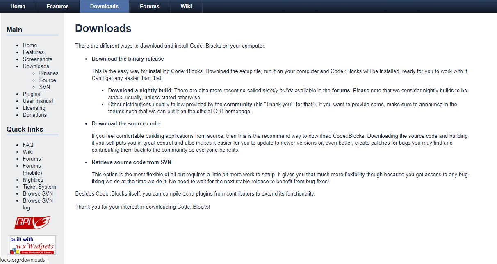

Damos click en «Download the binary release» y ahí elegimos el sistema operativo que cada uno tenga:

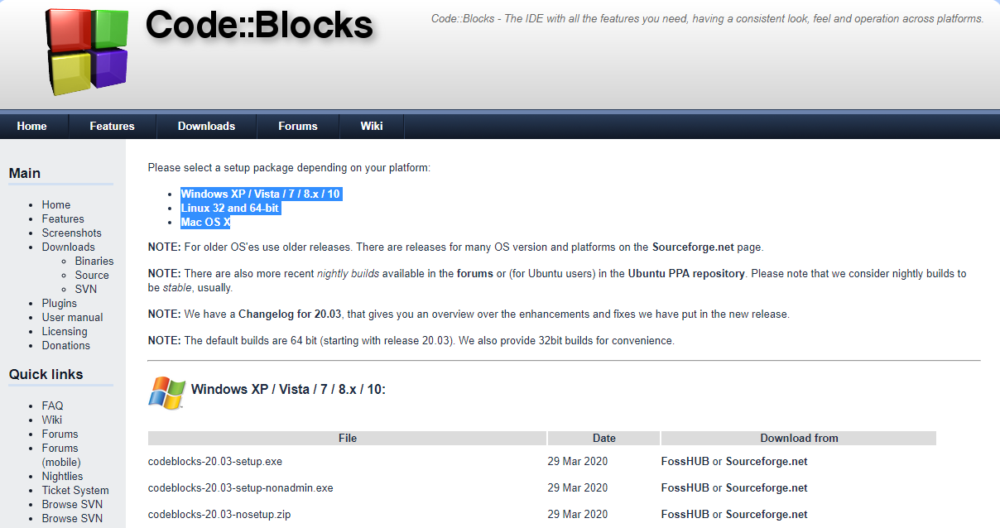

Tenemos varias opciones, nosotros seleccionaremos «codeblocks-20.03mingw-setup.exe» porque nos descarga automáticamente todo lo que necesitemos para poder instalar codeblocks:

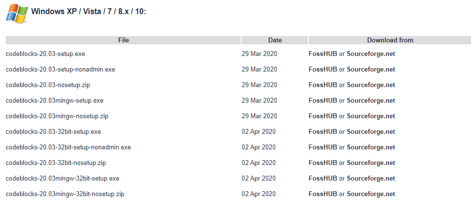

Una vez descargamos es simplemente una instalación estándar, damos doble click o ejecutamos como administrador el programa descargado y nos aparece una ventana:

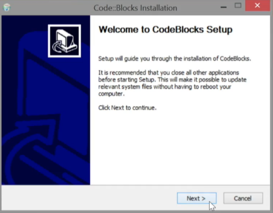

Damos click en Next, la siguiente es la ventana de licencia en la que damos click en I Agree:

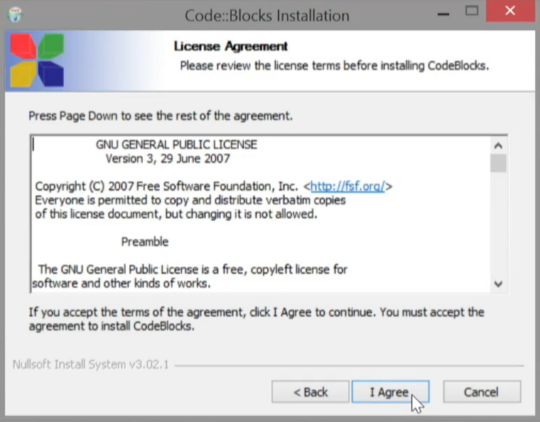

Verificamos que este palomeado todo la instalación por defecto y damos click en Next:

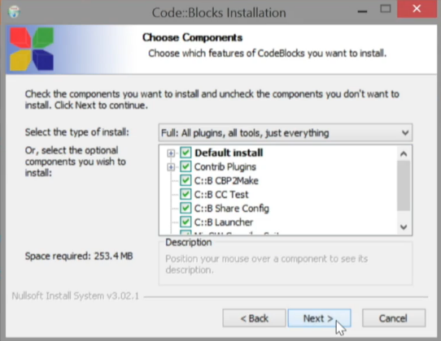

Nos muestra la carpeta en la que se guardara el programa, damos click en Install:

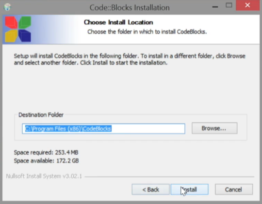

Y ya está, el programa será instalado en tu computadora o laptop.

### Clase 3 *Variables y tipos de datos (Asignación y clasificación)*

**Diseño de programas de software**

Los programas tienen una secuencia de secuencia de actividades (fases) que deben ser seguida para generar un conjunto coherente de productos.

Estas fases son:

- Análisis
- Diseño
- Programación
- Codificación
- Prueba
- Mantenimiento
- Documentación

En la fase de Análisis y Diseño nos concentramos en el concepto y diseño del programa, software, aplicación o juego estamos creando.

Las siguientes fases, Programación y Codificación, es la parte que creamos el código para el software en el que estemos trabajando. La fase de Prueba es una fase muy importante porque tenemos que probar que nuestro software funciona correctamente, es cuando compilamos el código, la programación, y vemos que funciona bien. También hacemos cambios si es necesario.

La fase de Mantenimiento cambia mucho dependiendo del tipo de programa que nosotros tengamos. Por ejemplo, en los juegos en línea pasan mucho tiempo en mantenimiento porque están constantemente expuestos a los usuarios, o los programas que tengan poco mantenimiento, programas pasan mucho tiempo en desarrollo y al momento son sacadas al público no tengan mantenimiento más allá de unos pequeños bugs.

Finalmente esta la fase de Documentación, es importante porque si estamos trabajando con otras personas necesitamos documentar nuestro trabajo para que ellos también puedan entender correctamente lo que estamos haciendo.

**¿Qué es un tipo de dato?**

Es una clasificación que el programador le da a la información almacenada para avisarle al compilador como va a ser interpretada.

Un tipo de dato es, en esencia, un espacio en memoria con restricciones.

**Tipos de datos primitivos**

- **Numérico:** Este tipo de datos se divide en enteros y reales.

  - **int:** Son los números enteros, es decir, aquellos que no tienen fracciones o decimales. Pueden ser negativos o positivos y el rango puede variar de un compilador a otro. Se almacenan internamente en 2 o 4 bytes de memoria y pueden ser: unsigned int, short int, int, unsigned long o long (cada uno de estos datos puede almacenar un rango diferente de valores). Cuando el rango de los tipos básicos no es suficientemente grande para sus necesidades, se consideran tipos enteros largos. Ambos tipos long requieren 4 bytes de memoria (32 bits) de almacenamiento.

    Algunos ejemplos de números enteros pueden ser: 3, 27, -18, 0

	- **float / double:** Son los números reales o de coma flotante. Los tipos de datos flotantes contienen una coma (un punto) decimal, pueden ser positivos y negativos formando el subconjunto de los números reales. Para representar números muy pequeños o muy grandes se emplea la notación de punto flotante, que es una generalización de la notación científica. El lenguaje C soporta tres formatos de coma flotante; el tipo float requiere 4 bytes de memoria, double 8 bytes, y long double 10 bytes.

    Algunos ejemplos de números flotantes o dobles pueden ser: 3.14, -0.01, 1.8, 0.27

- **Caracteres:** El almacenamiento de caracteres en el interior de la computadora se hace en “palabras” de 8 bits (1 byte). Este tipo representa valores enteros en el rango 2128 a 1127. El lenguaje C proporciona el tipo unsigned char para representar valores de 0 a 255 y así representar todos los caracteres ASCII.

  Una característica de la parte estándar del conjunto de caracteres (los 128 primeros) es que contiene las letras mayúsculas, las minúsculas y los dígitos, y que cada uno de estos tres subconjuntos está ordenado en su forma natural, por lo que podemos manejar rangos de caracteres bien definidos. Los caracteres se almacenan internamente como números y por lo tanto se pueden realizar operaciones aritméticas con datos tipo char. Existe también el dato tipo cadena (compuesto), que es una sucesión de caracteres que se encuentran delimitados por comillas; la longitud de una cadena es el número de caracteres comprendidos entre los  delimitadores "[long_cad]".

  - **char:** Una variable tipo char se representa como un solo carácter encerrado entre comillas simples.

    Algunos ejemplos son: 'P', 'L', 'A', 'T', 'Z', 'I'

- **Booleanos:** Hay lenguajes que sólo pueden tomar uno de dos valores: verdadero (true) o falso ( false ). En lenguaje C no existe el tipo lógico pero se puede implementar con un número entero, 0 es falso y cualquier número diferente de cero es verdadero. Algunos compiladores utilizan el bool.

  - **bool:** Tipo de dato que representa algo que puede ser verdadero o falso.

**¿Qué es una variable?**

Es un espacio reservado en memoria, definido por un tipo de dato y un nombre asignado, en el cual se puede guardar un valor y se puede modificar.

**Declaración y asignación de una variable en C**

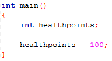

Para declarar una variable es necesario poner el tipo de dato que deseamos, seguido de su nombre. En este ejemplo, nuestro tipo de dato es un entero (int) de nombre healthpoints.

Para asignarle un valor es necesario el nombre de la variable (healthpoints) seguido del operador de asignación (=) y el valor que le daremos (100)

***NOTA: No debemos confundir el operador de asignación (=) con el de comparación (==).***

**Inicialización de una variable**

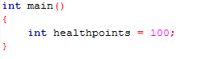

Para inicializar una variable ponemos primero el tipo de dato (int), el nombre (healthpoints) y el valor que deseamos (100).

**Diferencias entre inicializar y declarar**

Cuando declaramos una variable no le asignamos un valor inicial, en cambio cuando inicializamos una variables nosotros la estamos declarando y dándole un valor inicial.

**Usar codeblocks**

Para crear nuestro primer proyecto en codeblocks hacemos lo siguiente. Vamos en la pestaña de 'File', luego a 'New' y finalmente 'Project':

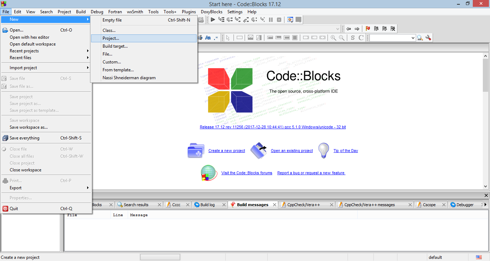

Se nos abrirá una nueva ventana en la que elegiremos 'Console application' y damos click en 'Go':

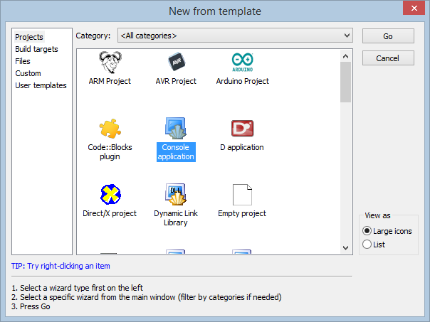

Damos click en 'Next':

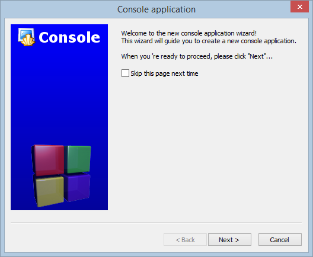

Elegimos C y después damos click en 'Next':

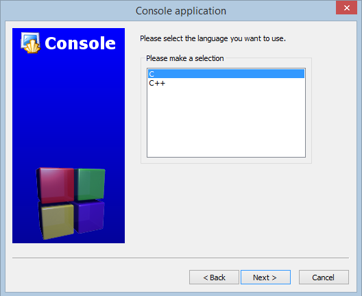

Le ponemos un nombre a nuestro proyecto, en 'Folder to create project in' podemos elegir donde deseamos guardar nuestro proyecto, y finalmente damos click en 'Next':

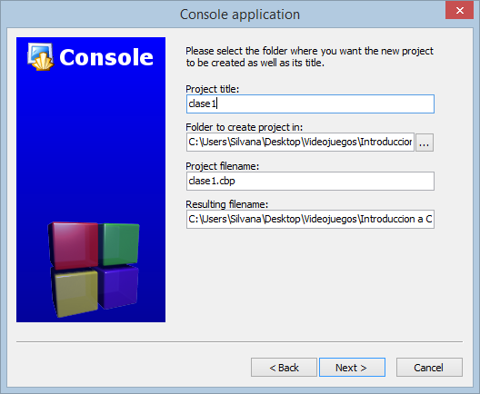

Y finalmente damos click en 'Finish':

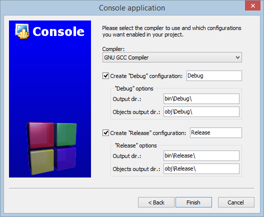

Ahora ya podemos trabajar en codeblocks, creando lo que deseemos en lenguaje C (o C++ si es lo que elegiste):

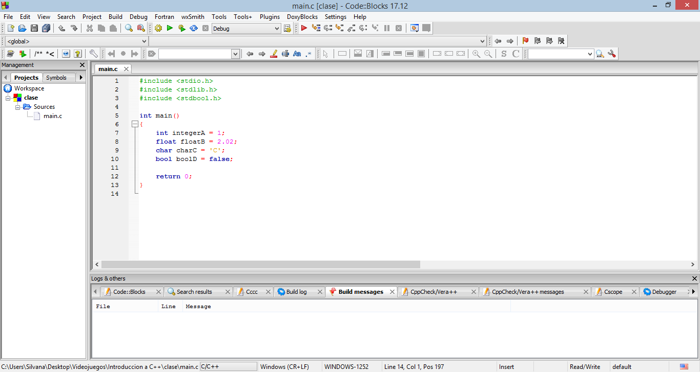

### Clase 4 *Entrada y salida de datos*

Aprenderemos como podemos tener información que entra y sale de nuestro programa, es decir, cuando nosotros usamos un input es una entrada que el usuario tiene con el programa y la información que visualizamos es la salida de los datos obtenidos. Por ejemplo, podemos obtener información mediante los teclados y posteriormente verlos en pantalla.

**¿Cómo imprimimos el valor de una variable?**

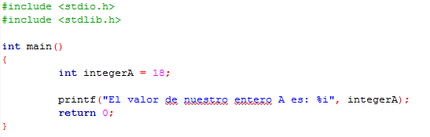

- #include<librería> usada para “incluir” las declaraciones de otro fichero en la compilación.
- stdio.h es el fichero que proporciona el núcleo de las capacidades de entrada/salida del lenguaje C (incluye la venerable función printf).
- stdlib.h es el fichero usado para realizar ciertas operaciones como conversión de tipos, generación de números pseudo-aleatorios, gestión de memoria dinámica, control de procesos, funciones de entorno, de señalización (??), de ordenación y búsqueda.
- main() sirve como punto de partida para la ejecución del programa. Normalmente, controla la ejecución del programa dirigiendo las llamadas a otras funciones del programa.
- Dentro de la función principal inicializamos un entero (int) de nombre integerA con el valor de 18, posteriormente usamos la función printf para imprimirlo en pantalla.
- La función printf (que deriva su nombre de “print formatted”) imprime un mensaje por pantalla utilizando una “cadena de formato” que incluye las instrucciones para mezclar múltiples cadenas en la cadena final a mostrar por pantalla.

**Formateadores**

Printf permite dar formato específicos a la salida de información.

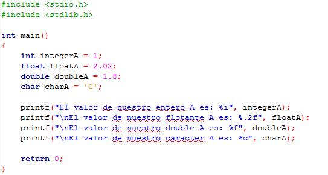

Printf es una función especial porque recibe un número variable de parámetros. El primer parámetro es fijo y es la cadena de formato. En ella se incluye texto a imprimir literalmente y marcas a reemplazar por texto que se obtiene de los parámetros adicionales. Por tanto, printf se llama con tantos parámetros como marcas haya en la cadena de formato más uno (la propia cadena de formato). El símbolo "%" denota el comienzo de la marca de formato. Y al final, después de la coma, se pone el nombre de la variable a imprimir.

En el ejemplo vemos que:

- %i imprime números enteros (int).
- %.2f imprime números coma flotante decimal de precisión simple (float) con un largo de 2 dígitos, justificados a la derecha.
- %f imprime números coma flotante decimal de precisión simple (float).
- %c imprime un carácter con el código ASCII.

**Imprimir todo en una línea**

Como sabemos, printf acepta tanto parámetros como marcas haya en la cadena de formato, es decir, podemos imprimir todo el ejemplo anterior en una línea completa.

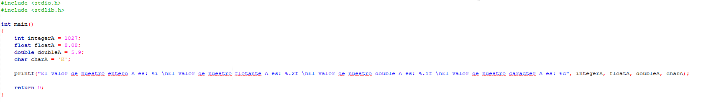

En el lenguaje C existen caracteres que no son imprimibles o visibles en la consola. También se les llama caracteres de escape, ya que siempre llevan una barra invertida "\" seguido del carácter. En el ejemplo vemos el uso de "\n" que nos proporciona un salto de línea.

**Entrada de datos**

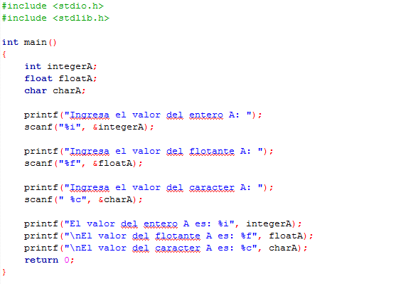

Mediante la función scanf podemos introducir cualquier combinación de valores numéricos, caracteres sueltos y cadenas de caracteres a través del teclado. En definitiva, scanf lee datos formateados de la entrada estándar. Cuando hablamos de datos formateados, nos referimos a que los datos se pueden presentar en distintos formatos. La función devolverá el número de datos que se han introducido correctamente.

En el ejemplo usamos la función printf para imprimir un mensaje al usuario y posteriormente la función scanf para que ese usuario pueda ingresar el valor que desea.

**RETO**

- Crear dos variables
- Ingresar y guardar el valor de ambas variables
- Intercambiar el valor de las variables con ayuda de una variable auxiliar
- Imprimir el valor de las variables ya intercambiadas

### Clase 5 *Operadores aritméticos*

Se llaman operadores aritméticos a aquellos que permiten realizar cálculos con valores numéricos para obtener un resultado. Los operadores aritméticos más habituales son la suma, resta, multiplicación y división. En C y en otros lenguajes disponemos de un operador adicional al que denominamos operador módulo (%), que nos permite obtener el resto de una división entre enteros.

La mayoría de estos operadores nos resultan conocidos, pues ya los hemos estudiado con el pseudocódigo. Las reglas de prioridad son las mismas que explicamos al hablar de pseudocódigo. Los paréntesis definen la prioridad principal. El siguiente orden de prioridad corresponde a las operaciones de multiplicación y división. Las operaciones de suma y resta tienen menor precedencia. Y en último lugar tendríamos la operación para obtener el módulo de una división entera.

C no reconoce el operador ^ para el cálculo de potencias de un número, ni el operador div o barra invertida para la obtención del cociente o división entera de una división. Existen otras alternativas que permiten realizar estas operaciones.

Existen otros operadores admitidos que constituyen formas de expresar abreviadamente una operación. Por ejemplo += se puede usar para indicar que la variable a la izquierda toma el valor resultante de sumarse a sí misma con la variable o expresión a la derecha. Si A=4 y se ejecuta A +=3; entonces A pasa a tomar el valor 7, equivalente a realizar la operación A = A + 3.

Los operadores aritméticos básicos en C son:

- Suma: +
- Resta: -
- Multiplicación: *
- División: /
- Módulo: %

En nuestro ejemplo pedimos que el usuario ingrese dos números enteros, después realizamos las operaciones aritméticas y finalmente imprimimos el resultado:

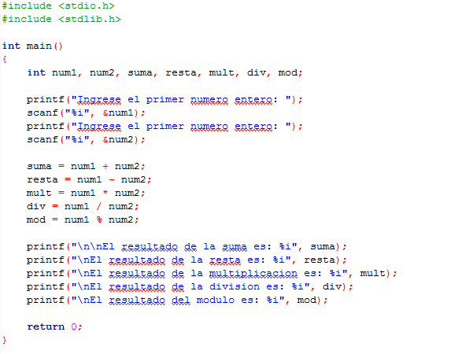

**PRIMER RETO**

- Ingresa los valores necesarios para calcular el área de un cilindro (radio y altura)
- Realiza la operación
- Imprime el resultado del área y el volumen

**SEGUNDO RETO**

- Ingresa la temperatura en grados Fahrenheit
- Realiza la operación para convertir de grados Fahrenheit a Celsius
- Imprimir el resultado de la conversión

### Clase 6 *Operadores de asignación, de incremento y decremento*

Un operador de asignación altera el valor de un objeto sin alterar su tipo. El operador usual de asignación (=), copia el valor del operando de la derecha en el operando de la izquierda, aplicando las conversiones de tipo usuales cuando es necesario.

Tenemos el siguiente ejemplo:

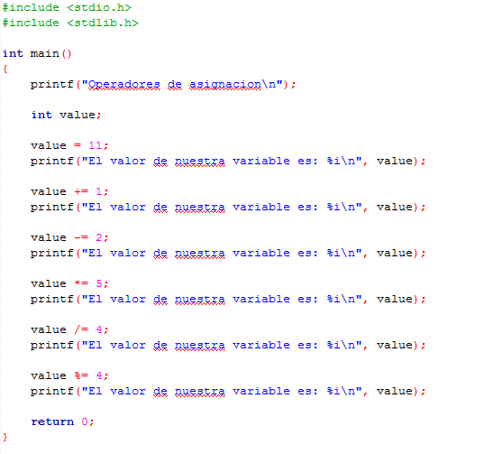

Declaramos una variable entera de nombre value y le asignamos (=) el valor 11.

1. Le asignamos la suma (+=) de 1, es decir, le sumamos 1 (value + 1 o 11 + 1)
2. Le asignamos la resta (-=) de 2, es decir, le restamos 2 (value - 2 o 12 - 2)
3. Le asignamos el producto (*=) de 5, es decir, lo multiplicamos por 5 (value * 5 o 10 * 5)
4. Le asignamos la división (/=) de 4, es decir, dividimos por 4 (value / 4 o 50 / 4)
5. Le asignamos el módulo (%=) de 4, es decir, tenemos el resto de la división por 4 (value % 4 o 50 % 4)

Los operadores unitarios ++ (incremento) y -- (decremento), suman y restan respectivamente una unidad al valor de la expresión. Existen dos variedades "Pre" y "Post" para cada uno de ellos.

**Pre y Post incremento**

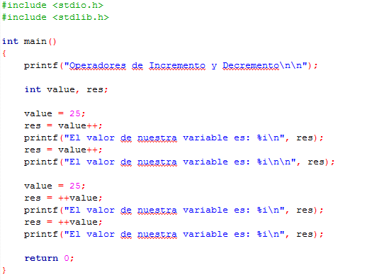

En este ejemplo podemos ver la diferencia entre el pre y el post incremento.

Mientras que el post incremento, value++, añade uno a la expresión después de que se ha evaluado, es decir, primero nos imprime el valor inicial (25) y después el incremento (26).

El pre incremento, ++value, añade uno antes de que sea evaluada la expresión, es decir, ya nos imprime el valor incrementado (26) y si lo volvemos a realizar nos imprime nuevamente el nuevo valor incrementado en más uno (27).

**Pre y post decremento**

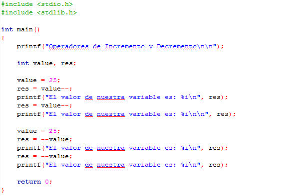

Similar al ejemplo anterior, podemos notar las diferencias entre el pre y el post decremento.

En el post decremento, value--, resta uno a la expresión después de que se ha evaluado, es decir, primero nos imprime el valor inicial (25) y después el decremento (24).

El pre decremento, --value, resta uno antes de que sea evaluada la expresión, es decir, ya nos imprime el valor decrementado (24) y si lo volvemos a realizar nos imprime nuevamente el nuevo valor decrementado en menos uno (23).

**PRIMER RETO**

- Crear una variable llamada x con valor de 10
- Utilizando operadores de asignación, que esta variable se sume a sí misma el doble de su valor.
- Imprime el resultado

**SEGUNDO RETO**

- Ingrese un valor entero
- Usando operadores de asignación realiza la operación de modulo del valor ingresado con 5
- Imprime el resultado más uno usando operadores de incremento

### Clase 7 *Recapitulación: Conceptos Básicos*

¡Hola bienvenido al curso de Programación Estructurada!

En esta lectura vamos a recapitular la primera sección del curso, los conceptos básicos de programación. Empecemos por tipo de datos.

Como lo hablamos en el curso un tipo de dato es una clasificación que el programador le da a la información almacenada para avisarle al compilador cómo va a ser interpretada.

Los tipos de dato que vimos en el curso son:

- int - Números enteros. p/e 0, -50, 1234
- float - Números decimales. p/e -0.45, 12.5, 3.1416
- char - Caracteres. p/e ‘C’ ‘a’ ‘z’
- bool - Valor lógica binaria. p/e true y false

Estos tipos de dato que representan información pueden ser almacenados en la computadora, para esto utilizamos variables.

Las variables son un espacio reservado en memoria, definido por un tipo de dato y un nombre asignado, en el cual se puede guardar un valor y se puede modificar.

Siempre que nosotros queremos utilizar datos necesitamos reservar espacio en nuestra memoria. Aunque durante el curso usamos la palabra crear para explicar cómo utilizar una variable, en realidad el término correcto sería reservar, porque no estamos creando es espacio en la memoria, estamos reservando espacio para guardar ahí información.

Para reservar espacio en memoria para nuestros datos nosotros podemos declarar una variable, que signifca solo reservar el espacio o inicializar la variable que significa reservar el espacio y darle un valor inicial también.

La sintaxis para estos diferentes casos son:

> int declarandoInt;
>
> int inicializandoInt = 10;

Para inicializar una variable nosotros usamos un operador de asignación, este es el operador =, con este indicamos que a la variable anterior le estamos asignando un valor específico.

Otros operadores de asignación pueden ser:

- +=
- -=
- *=
- /=
- %=

Que como vimos en el curso, teniendo en cuenta una variable a, son una versión abreviada de:

- a += 3 ------ a = a + 3
- a -= 3 ------ a = a - 3
- a *= 3 ------ a = a * 3
- a /= 3 ------ a = a / 3
- a %= 3 ------ a = a % 3

Estos operadores nos sirven para abreviar una operación y asignar el valor dentro de la misma variable.

Otros operadores que podemos utilizar son los operadores numéricos, estos son:

- (+) Suma
- (-) Resta
- (*) Multiplicación
- (/) División
- (%) Módulo

Estos los conocemos de matemáticas básicas y el único distinto es el operador de módulo.

Este operador realiza una división, pero en vez de darnos el resultado de la división nos da el residuo de la división.

Estos son los conceptos básicos que vimos en el curso, espero que estés aprendiendo mucho y ¡nos vemos en la siguiente clase!

## Modulo 3. Control de flujo
### Clase 8 *Condicional if e if - else*

Las condicionales son instrucciones que evalúan resultados booleanos (verdadero o falso), generalmente usados para alterar el flujo de un programa.

Una sentencia condicional es una instrucción o grupo de instrucciones que se pueden ejecutar o no en función del valor de una condición.

**Condicional if**

La sentencia solo se ejecuta si se cumple la condición. En caso contrario el programa sigue su curso sin ejecutar la sentencia.

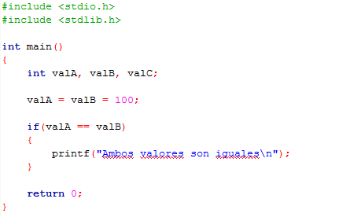

En este ejemplo declaramos tres variables enteras y asignamos a dos variables (A y B) el valor de 100. Usando la condicional, evaluamos si ambos valores son iguales, si esa condición se cumple nos imprime un mensaje en pantalla.

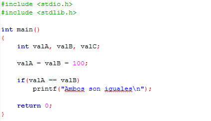

Hay que tener en cuenta que si la sentencia a ser ejecuta es simplemente una línea, podemos obviar las llaves y sigue siendo completamente valido.

En cambio, si la sentencia a ser ejecutada son varias líneas es obligatorio poner las llaves para que pueda ejecutarse el código. Esto es visto en el ejemplo, donde nos imprime un mensaje y posteriormente guardamos la suma de las variables A y B dentro de la variable C, para luego imprimirla en pantalla.

**Condicional if - else**

Se añade una instrucción else que ejecuta una segunda sentencia si la condición no se cumple. En cualquier caso, el programa continuará a partir de la sentencia2.

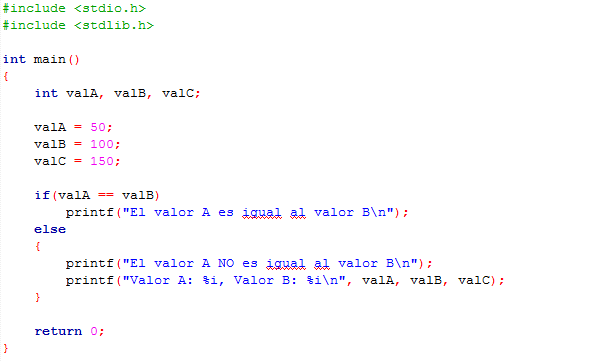

En nuestro ejemplo declaramos tres variables y le asignamos distintos valores. Si el valor de la variable A es igual a la variable B, entonces nos imprime un mensaje en pantalla. Si resulta ser falso, es decir, la variable A es distinto a la variable B, entonces se nos ejecutara la sentencia else que nos imprime un mensaje y nos muestra los valores de las variables.

**Condicional else if**

Nosotros podemos tener tantas condiciones como queremos. Usando else if podemos poner una segunda, tercera, cuarta o n condiciones como queremos. Si una de ellas se cumple, se ejecuta la sentencia correspondiente y salta hasta el final de la estructura para continuar con el programa.

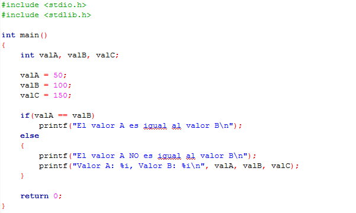

Seguimos con el ejemplo de tres variables con valores distintos. Tenemos una primera condición (if) que evalúa si el valor de la variable A es igual al valor de la variable B. Después, en la segunda condición (else if), se evalúa si el valor de la variable B es igual al valor de la variable C. Y si ninguna de esas condiciones se cumple, es decir, si A no es igual a B o B no es igual a C, nos ejecuta la última sentencia (else) que nos imprime un mensaje en pantalla y el valor de las tres variables.

**NOTA:**

  No debemos confundir = con el ==.

  Un solo igual (=) es asignación, asigna un valor a algo (ejemplo, valA = 50). En cambio, dos iguales (==) son para comparar, evalúan si un valor es igual otro valor (ejemplo, valA == valB).

**RETO**

Haremos un programa que adivine número de la computadora

- Define una variable cuyo valor es 5
- En otra variable ingresar un número con las instrucciones, entre el 1 y el 10
- Si el número ingresado es igual a la variable definida (5), imprimir "Adivinaste". Si no, imprimir "Ese no es, perdiste!".

### Clase 9 *Operadores relacionales y lógicos*

Se llaman operadores relacionales o de comparación a aquellos que permiten comparar dos valores evaluando si se relacionan cumpliendo el ser menor uno que otro, mayor uno que otro, igual uno que otro, etc. Los operadores lógicos permiten además introducir nexos entre condiciones como “y se cumple también que” u, “o se cumple que”.

**Operadores Relacionales**

- Menor que (<)
- Menor o igual que (<=)
- Mayor que (>)
- Mayor o igual que (>=)
- Igual que (==)
- No igual que (!=)

Tenemos el siguiente ejemplo:

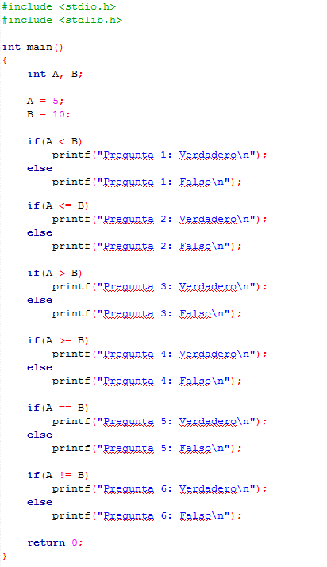

Declaramos dos variables, A y B, y le asignamos los valores de 5 y 10, respectivamente. Con este ejemplo podemos ver cada uno de los operadores relacionales:

1. Evaluamos si el valor de A es menor al valor de B. Dado que el valor de A es 5 y el valor de B es 10, la condición es verdadera. ***Si por ejemplo, el valor de A sea igual al valor de B, entonces nos saldría falso porque la condición evalúa que el número sea estrictamente menor para ser verdadera.***
2. Evaluamos si el valor de A es menor o igual al valor de B. Dado que el valor de A es 5 y el valor de B es 10, la condición es verdadera. ***Si por ejemplo, el valor de A sea igual al valor de B, entonces nos seguiría dando verdadero. Para que nos dé falso, el valor de A debe ser únicamente mayor al valor de B.***
3. Evaluamos si el valor de A es mayor al valor de B. Dado que el valor de A es 5 y el valor de B es 10, la condición es falsa.
4. Evaluamos si el valor de A es mayor o igual al valor de B. Dado que el valor de A es 5 y el valor de B es 10, la condición es falsa.
5. Evaluamos si el valor de A es igual al valor de B. Dado que el valor de A es 5 y el valor de B es 10, la condición es falsa.
6. Evaluamos si el valor de A es no es igual al valor de B. Dado que el valor de A es 5 y el valor de B es 10, la condición es verdadera.

**Operadores Lógicos**

- AND (&&) : Y
- OR (||) : O
- NOT (!) : No

Teniendo en cuenta el siguiente ejemplo:

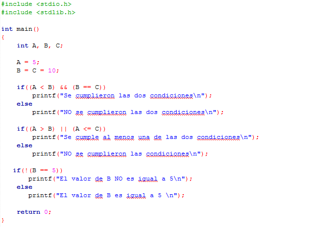

Hacemos uso de los operadores lógicos para evaluar ciertas condiciones.

1. ¿A es menor a B Y B es igual a C? Verdadero, porque ambas condiciones se cumplen. Si al menos una de las condiciones no se cumple, entonces toda la sentencia es falsa.
2. ¿A es menor a B O A es menor o igual a C? Verdadero. Mientras una de las condiciones se cumpla nos seguirá dando verdadero, la única manera en que nos dé falso es que ambas condiciones NO se cumplan.
3. ¿B NO es igual a 5? Verdadero. Recordemos que el valor de B es 10, por obviedad su valor NO es 5.

**PRIMER RETO**

- Imprime una instrucción
- Ingresa el numero en una variable
- Repite para una segunda variable
- Si el primer número es menor que el segundo, imprime el mensaje "El número menor es: " y el primer numero
- Si no, imprime el segundo numero

**SEGUNDO RETO**

- Hacer un programa que reciba la calificación de un alumno
- Si el alumno saco menos de 60, imprime que el alumno esta reprobado
- Si el alumno saco más de 60, imprime que el alumno está aprobado

Extra: Si el alumno saco más de 90, imprime que está aprobado y una carita feliz

### Clase 10 *Switch*

Switch es una estructura de control para agilizar el flujo del programa en opciones múltiples.

Se tiene una condición que se puede cumplir dependiendo de diferentes casos, cada caso nos lleva a un bloque de cumplimiento de la condición y ese bloque nos lleva a continuar el programa.

Tenemos el siguiente ejemplo:

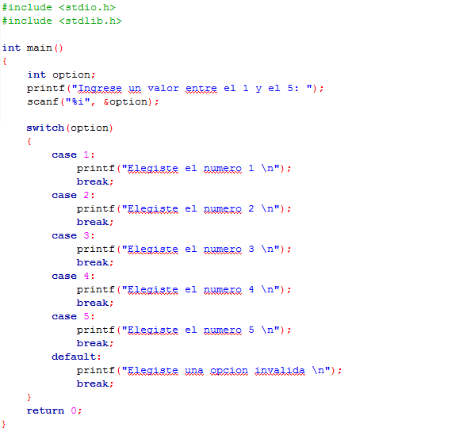

Declaramos una variable entera 'option' y esperamos que el usuario ingrese un número cualquiera entre el 1 y el 5. Si el número se encuentra dentro del rango, nos imprimirá un mensaje que nos diga el número elegido. Con default se ejecuta en caso de que el número ingresado no cumpla con ninguna de las condiciones, es decir, no se encuentra dentro del rango.

**NOTA**

Podemos ver que no usamos operadores relaciones o lógicos dentro del switch, eso es porque cada instancia case se encarga de realizar la comparación entre el valor del caso y la expresión. Por ejemplo, en la primera instancia (case 1) comparamos si el número ingresado en option es 1, si se cumple la declaración dentro de la instancia se ejecuta lo de adentro hasta que es interrumpida por el break. Si no se cumple, pasa a la siguiente instancia.

La instancia default es opcional, pero cuando se declarada es ejecutada si el valor de la expresión no coincide con cualquiera de las otras instancias case.

Las sentencias break hacen que, una vez verificado que se cumple una opción dentro del switch, se salga del mismo y se continúe la ejecución en la siguiente instrucción después del switch. El uso de break es opcional, pero es habitual incluir un break después de cada evaluación. En caso de no hacerlo, se ejecutarán todas las instrucciones dentro de cualquier case (incluso aunque no se verifique) después del que ha verificado la condición hasta encontrar una sentencia break; o terminar la ejecución del switch. Esto puede generar resultados contradictorios o no esperados, de ahí que en general siempre se incluyan sentencias break.

**RETO**

Vamos a hacer un pequeño juego de texto:

- Imprimir una pequeña introducción, con tres opciones a elegir, numerada del 1 al 3
- Cada una de ellas te debe de imprimir un resultado distinto en la historia

### Clase 11 *¿Qué es un iterador? - Ciclo While*

Un loop es una estructura iterativa que permite repetir un bloque de instrucciones. Esta repetición es controlada por una condición booleana.

Un iterador es utilizado por un algoritmo para recorrer los elementos almacenados en un contenedor. Dado que los distintos algoritmos necesitan recorrer los contenedores de diversas maneras para realizar diversas operaciones, y los contenedores deben ser accedidos de formas distintas, existen diferentes tipos de iteradores.

**While**

Es una estructura de control en la que la repetición se realizará tantas veces como se indique mientras se cumpla una condición.

Teniendo en cuenta el siguiente ejemplo:

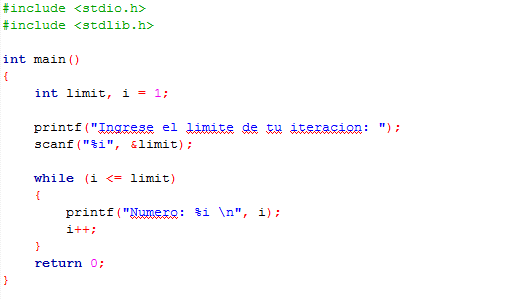

Nosotros tenemos dos variables: limit que permite al usuario ingresar el límite de la iteración e i que inicializa en uno. Con while repetiremos e imprimiremos los números según nuestro límite.

Por ejemplo, si nuestro límite es 5 entonces compara si la variable i es menor o igual a limit. Si la condición se cumple imprime el número, siendo la variable i inicialmente 1, se cumple y nos imprime en pantalla, y luego el programa vuelve dentro del while y se repetirá hasta que la condición ya no se cumpla.

**RETO**

- Hacer un programa que imprima el símbolo de # cinco veces.

Tip: Puedes usar operadores de incremento y decremento.

### Clase 12 *Ciclo For*

El ciclo for es una estructura de control que nos permite repetir un bloque de comandos un número de veces específico.

Este ciclo se compone de tres partes:

1. Inicialización: Se inicializa una variable (generalmente "i") al asignarle el valor 0.
2. Condición: Se indica la condición necesaria para que termine el ciclo.
3. Incremento: También puede ser decremento; este va a indicar los pasos en los que se moverá el ciclo, este número siempre debe ser entero, para ir de uno en uno se utiliza el i++.

Teniendo en cuenta el siguiente ejemplo:

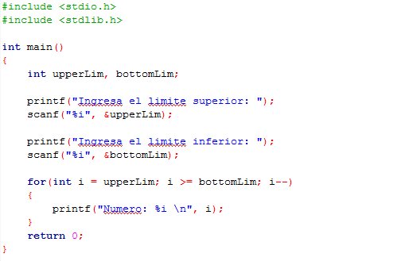

Nosotros declaramos dos variables que permiten al usuario ingresar el valor de los limites superior e inferior. Usamos for para imprimir los números en orden descendentes, en la primera parte inicializamos una variable 'i' con el valor del límite superior, en la segunda parte evaluamos si la variable i es mayor o igual al límite inferior, y en la tercera parte decrementamos la variable i.

**RETO**

- Usando for, imprime la secuencia Fibonacci hasta la novena vuelta

### Clase 13 *Ciclo Do-While*

El Do - While es una estructura de control donde la condición de continuación del ciclo se prueba al final del mismo.

Funciona de manera similar a la estructura while, la diferencia es que esta evalúa al final.

Teniendo en cuenta el siguiente ejemplo:

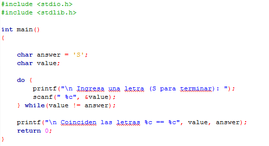

Inicializamos la variable de tipo carácter answer con el valor de 'S' y declaramos otra variable de tipo carácter, value. Usamos do while para que el usuario ingrese una letra, esto se podrá ir agregando infinitamente hasta que se ingrese el carácter S, obligatoriamente debe ser mayúscula para que se detenga el programa. Y, una vez finalizada el do while, el programa pasa a imprimir que los dos caracteres son iguales.

**RETO**

- Usando do while, imprime los primeros 100 números naturales

### Clase 14 *Arreglos unidimensionales*

Un arreglo o array es básicamente una estructura de datos almacenada como una sola variable. Hasta el momento habíamos visto variables y constantes, pero en este caso es una estructura algo más compleja, ya que se compone de varios elementos de un mismo tipo. Por ejemplo, podía ser una lista finita de números o de palabras que se almacenarían en celdas contiguas de memoria.

Cada uno de esos elementos se distinguen por un índice o subíndice al que se puede apuntar con un puntero para acceder a dicha posición del array. Además, también se podría escribir código para acceder de forma aleatoria a estos elementos de los que se compone el arreglo.

**Arreglo unidimensional**

Un array de tipo unidimensional es básicamente un vector de datos o lista. Dicho de otro modo, es un conjunto de variables del mismo tipo y tamaño que ocupan posiciones consecutivas en una memoria. El tamaño de la memoria ocupada por el array es siempre fijo y no se puede variar.

Debemos tener en cuenta que la posición de los arreglos siempre empiezan en cero y terminan en n-1, es decir, imaginemos que tenemos el siguiente arreglo de caracteres:

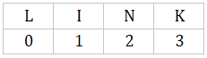

'L I N K' es un arreglo de tamaño cuatro (que acepta cuatro caracteres), pero vemos que la posición empieza en cero y va hasta el tres.

En nuestro siguiente ejemplo:

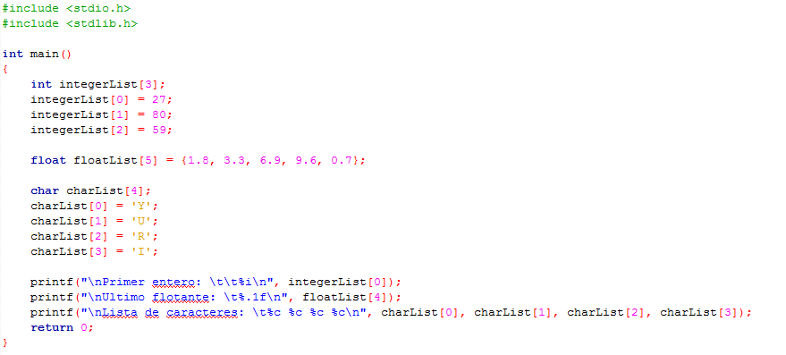

Tenemos tres variables de diferentes tipos. La primera variable es tipo entero llamado integerList de tamaño tres, el segundo es una variable de tipo flotante llamada floatList de tamaño cinco y el tercero es una variable de tipo carácter llamada charList de tamaño cuatro.

Asignamos los valores en las variables: integerList y charList son declaradas, y posteriormente ingresamos manualmente los valores. Mientras que floatList es inicializada.

Vemos que el número dentro de los corchetes [] son el tamaño que tendrá el arreglo, mientras que, si inicializamos con valores, podemos los valores dentro de llaves {} y separados por coma.

Finalmente imprimimos diferentes valores: Con integerList imprimimos el primer valor del arreglo, con floatList imprimimos el último valor del arreglo y charList imprime la totalidad de los valores que contiene el arreglo.

**NOTA:**

  Aparece un nuevo carácter no imprimible "\t" que nos da una tabulación de cuatro líneas.

**RETO**

- Ingresar valores a un arreglo con un tamaño de 5
- Multiplicar todos sus valores
- Imprimir sus resultados

### Clase 15 *Arreglos bidimensionales*

Los arreglos bidimensionales son también llamados tablas o matrices tienen varias filas y columnas. Tiene dos índices: el primero indica el número de fila y el segundo el número de columna en que se encuentra el elemento.

Un arreglo bidimensional es interpretado como un arreglo unidimensional con n número de filas (f), donde cada componente es un arreglo unidimensional de n número de columnas (c). Un arreglo de dos dimensiones contiene, pues, n número de f x c (números de filas x números de columnas) componentes.

Por ejemplo, digamos que tenemos un arreglo de 3 x 4 en donde:

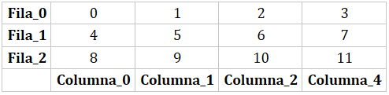

Siendo un arreglo bidimensional o matriz de 3 x 4 significa que 3 filas y 4 columnas (recordemos que las posiciones de los arreglos comienzan en cero).

En el siguiente ejemplo:

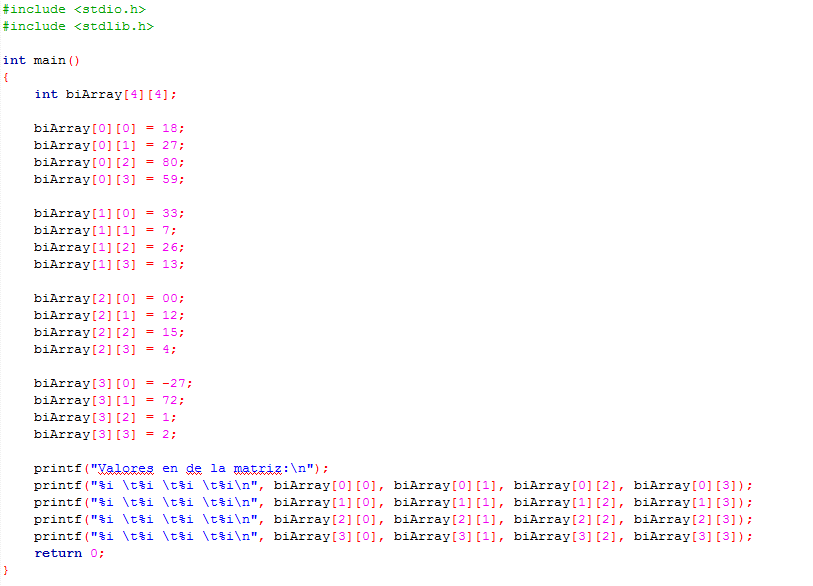

Declaramos una matriz de 4 x 4 de tipo entero y luego ingresamos manualmente los valores, finalmente imprimimos la matriz en pantalla.

Vemos que para declarar una matriz tenemos dos corchetes: el primer corchete simboliza el número de filas y el segundo corchete el número de columnas que tendrá nuestra matriz.

**RETO**

Crear un arreglo de 3 filas por 4 columnas en donde:

- Los elementos de la primera fila sumen un total de 4
- Los elementos de la segunda fila sumen un total de 10
- Los elementos de la tercera fila sumen un total de 26
- Imprime las sumatorias de cada fila

### Clase 16 *Arreglos e iteradores unidimensionales*

Ya vimos los arreglos unidimensionales y ya hemos guardado los datos de forma manual, pero una forma más fácil de usar arreglos, en especial cuando son arreglos grandes, son los iteradores.

**¿Por qué utilizar iteradores en arreglos unidimensionales?**

- Para manipular todos los elementos de un arreglo podemos utilizar una estructura repetitiva. La más usual es el ciclo for
- Cuando se desea imprimir el contenido del arreglo
- Cuando se suman todos los elementos
- También cuando se va a inicializar el arreglo.

En el siguiente ejemplo:

Declaramos un arreglo de tipo entero con un tamaño de 11 y usamos el ciclo for para imprimir el arreglo. Los datos guardados dentro del arreglo es el valor de 'i' multiplicado por sí mismo, es decir, i x i.

**RETO**

- Escribir un programa que nos diga el número más grande de un arreglo. Utilizando arreglos e iteradores.

### Clase 17 *Arreglos e iteradores bidimensionales*

Para poder utilizar el iterador for junto con un arreglo bidimensional es necesario entender el concepto de un for anidado.

**Bucle anidado**

Es un bucle que se encuentra incluido en el bloque de sentencias de otro bloque. Los bucles pueden tener cualquier nivel de anidamiento (un bucle dentro de otro bucle dentro de un tercero, etc.). Al bucle que se encuentra dentro del otro se le puede denominar bucle interior o bucle interno. El otro bucle sería el bucle exterior o bucle externo.

En los bucles anidados es importante utilizar variables de control distintas, para no obtener resultados inesperados.

**Bucles anidados con variables independientes**

Los bucles anidados con variables independientes son los bucles en los que ninguna de las variables de uno de los bucles interviene ni en la condición de continuación ni en la expresión de paso de los otros bucles.

**Bucles anidados con variables dependientes**

Los bucles anidados con variables dependientes son los bucles en los que la variable de uno de los bucles interviene en la condición de continuación o en la expresión de paso de los otros bucles.

En nuestro ejemplo:

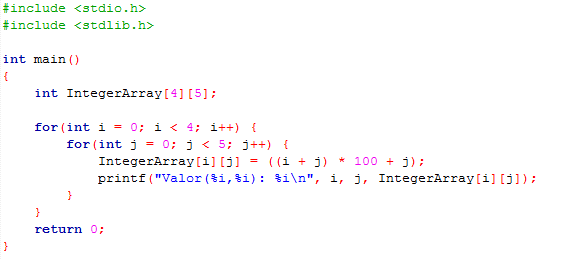

Declamaros una matriz de 4 x 5, es decir, tendrá 4 filas y 5 columnas, y usamos un bucle anidado con variables independientes. Nuestro primer bucle for representa las filas de la matriz y el segundo bucle for representa las columnas de la matriz.

Su forma de recorrer es la siguiente: nuestro programa inicial al ingresa al primer for y después pasa al segundo for, continua dando vueltas al segundo for hasta completar y sale para dar la vuelta al primer for. Continua sucesivamente de la misma manera hasta terminar ambos bucles.

**RETO**

Crear un arreglo de 5 filas por 6 columnas donde:

- Los primeros 5 elementos de cada fila tengan calificaciones aprobatorias de 6 y 10
- El sexto elemento de cada fila debe ser 0
- Calcula el promedio de los primeros 5 elementos de cada fila y asignarlo al sexto elemento
- Imprime el promedio de cada fila de calificaciones

### Clase 18 *Cadena de caracteres (string)*

En C no existe un tipo predefinido para manipular cadenas de caracteres (string). Sin embargo, el estándar de C define algunas funciones de biblioteca para tratamiento de cadenas. Una cadena en C es un array de caracteres de una dimensión (vector de caracteres) con la particularidad que tienen una marca en el fin del mismo (el caracter '\0'), además el lenguaje nos permite escribirlas como texto dentro de comillas dobles si son simples no.

Por ejemplo la cadena "Hola" en C se considera un array formado por los elementos 'H', 'o', 'l', 'a'.

Para comprender mejor como funciona una cadena de caracteres en C debemos saber algunos conceptos que usaremos como:

- gets: La función que lee una cadena de texto desde el teclado.
- puts: La función que muestra una cadena de texto en pantalla y avanza de línea.
- strlen: Se encarga de devolver la longitud de una cadena de texto

En nuestro siguiente ejemplo:

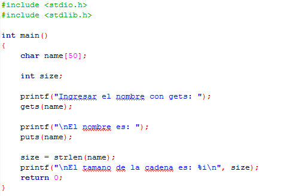

Declaramos un arreglo 'name' de tipo carácter con un tamaño de 50 y una variable 'size' de tipo entero. Imprimimos en pantalla un mensaje para que el usuario sepa cuando ingresar la cadena de nombre con gets, después imprimimos la cadena ingresada con puts y guardamos el tamaño de la cadena en size para posteriormente imprimirla.

**RETO**

- Haz un programa que reciba una cadena de caracteres e imprima de regreso la misma cadena de forma invertida.

### Clase 19 *Recapitulación: Control de Flujo*

En esta lectura vamos a recapitular los conceptos de control de flujo que aprendimos en el curso.

**If**

Empezamos con condicionales o sentencias condicionales. Estas son instrucciones que evalúan resultados booleanos, esto quiere decir que evalúan una condición que va a tener como resultado algo verdadero o falso. Dependiendo del resultados nosotros podemos usar estas condiciones para controlar el flujo de nuestro programa y los resultados que nosotros queremos que tenga.

La estructura para escribir una condición es la siguiente:

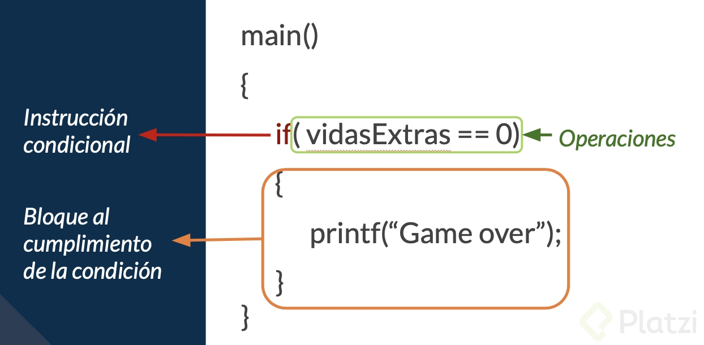

Dentro del paréntesis después de la instrucción if, escribimos la operación que va a ser la condición a revisar. Si esta se cumple entra al bloque de cumplimiento de la condición y podemos ejecutar instrucciones. Si no se cumple la condición, el programa continua y no entra al bloque de cumplimiento de la condición.

**Operadores relacionales y lógicos**

Al utilizar condiciones, para ayudarnos a evaluar las operaciones nosotros podemos utilizar operadores relacionales y operadores lógicos.

Los operadores relacionales son:

- (<) Menor que
- (- <)= Menor o igual que
- (>) Mayor que
- (>)= Mayor o igual que
- (==) Igual (Utilizado como comparación y NO como asignación)
- (!=) Diferente/No igual que

Los operadores lógicos son:

- && Y/And

Teniendo en cuenta más de una condición, el resultado será verdadero si ambas condiciones son verdaderas.
- || O/Or

Teniendo en cuenta más de una condición, el resultado será verdadero si alguna o ambas condiciones son verdaderas, solo una necesita cumplirse.

- ! No/Not

El resultado es inverso al operando.

**Switch**

Otra estructura de control de flujo que podemos utilizar es el switch. Esta es una estructura de control que nos permite agilizar el flujo es opciones múltiples.

Su estructura es la siguiente:

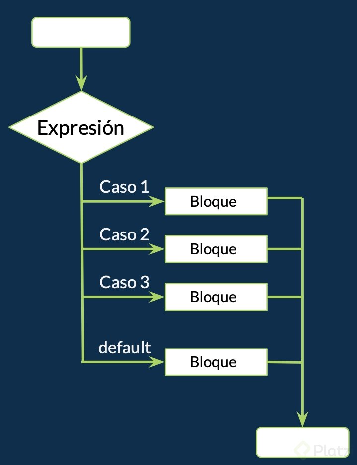

En esta estructura se evalúa una expresión y se evalúa cada caso potencial de resultado con respecto a esa instrucción, o sea, si en la expresión se evalúa una variable de tipo int, en los casos se evalúan valores de tipo int. Si en la expresión se evalúan variables de tipo char, en los casos se evalúan valores de tipo char, por ejemplo:

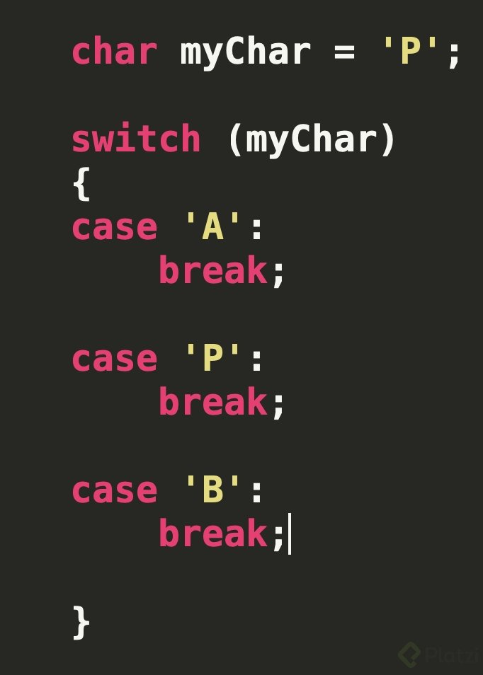

**Loops**

Un loop es una estructura iterativa que permite repetir un bloque de instrucciones. Esta repetición es controlada por una condición booleana.

**Loops - While**

El iterador While es una estructura de control donde el bloque de instrucciones se repetirá siempre que la condición se cumpla.

La sintaxis es la siguiente:

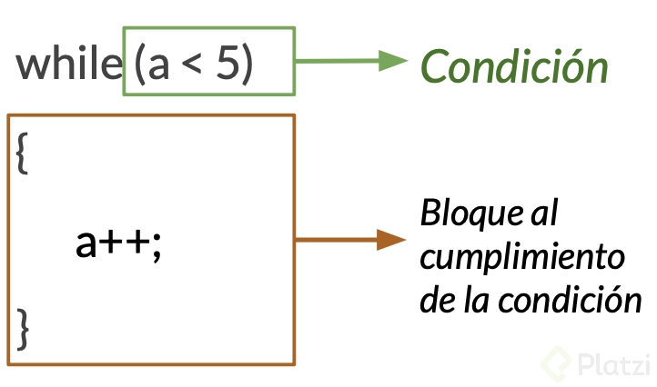

Después de la instrucción while dentro de los paréntesis tenemos la condición, siempre que esta se cumpla el bloque al cumplimiento de la condición se repetirá. Dentro de los corchetes se encuentra el bloque al cumplimiento de la condición, este es una serie de instrucciones que queramos que se repita. Al dejar de cumplirse la condición o no cumplirse en lo absoluto, el flujo del programa seguirá después de los corchetes.

**Loops - For**

El iterador for es una estructura de control que nos permite repetir un bloque de instrucciones un número de veces especifico.

La sintaxis de un for es la siguiente:

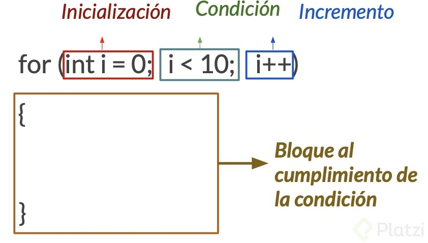

Después de la instrucción for, dentro de los paréntesis la estructura se divide en tres partes: inicialización, condición e incremento.

En la primera sección inicializamos una variable que utilizaremos para medir la cantidad de veces que se repetirá el bloque. En la condición definimos el número de veces que se repetirá, esta es una condición y siempre que se cumpla seguirá repitiéndose el bloque, entonces utilizamos una variable de tipo int y revisamos en la condición siempre que ese número sea menor o mayor que alguna variable o número que hayamos definido con anticipación. Finalmente en el incremento, que también puede ser decremento, sucede después del bloque al cumplimiento de la condición y modificamos la variable para eventualmente incumplir la condición y salir del iterador.

**Loops - Do While**

Este iterador es similar al while, con la diferencia de que la condición se prueba al final de la misma, se evalúa al final.

Su sintaxis es la siguiente:

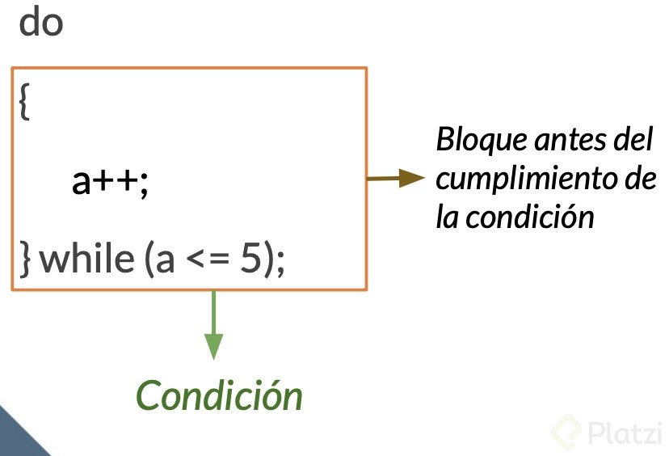

De manera similar el while, tenemos una condición y siempre que esta se cumpla un bloque se repetirá. La diferencia se encuentra con la instrucción do, en la que se cumplirá ese bloque antes de checar la condición y se repetirá.

**Arreglos**

Un arreglo es una serie de elementos del mismo tipo de dato y almacenados de manera consecutiva. Estos pueden tener de una a varias dimensiones, pero durante el curso vimos arreglos unidimensionales y bidimensionales, una y dos dimensiones respectivamente.

De la misma manera que una variable nosotros podemos declarar e inicializar un arreglo unidimensional, también llamados vectores, la sintaxis es la siguiente:

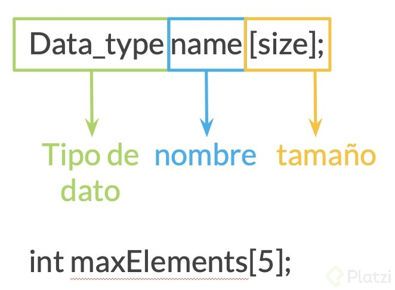

Para declarar un arreglo definimos al igual que una variable su tipo de dato y su nombre, seguido de esto dentro de corchetes cuadrados ingresamos el tamaño de nuestro arreglo. Con esto indicamos que va a ser un arreglo y su tamaño.

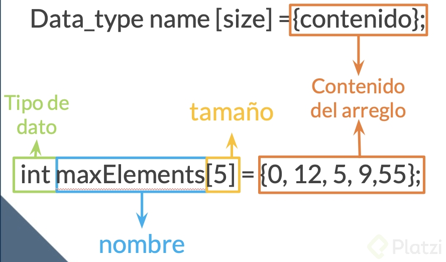

La estructura es similar a declarar una variable con la diferencia de que agregamos valores dentro del contenido del arreglo. Estos valores van dentro de corchetes separados por comas.

Los arreglos bidimensionales también llamados matrices son arreglos de dos dimensiones. Estos tienen dos índices, el primero indica el número de fila y el segundo el número de columna en que se encuentra el elemento.

La sintaxis para declarar e inicializar un arreglo bidimensional es la siguiente:

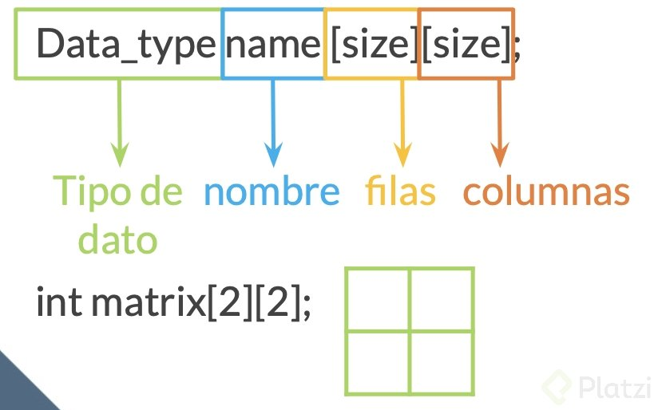

Para declarar dentro de la misma manera que unidimensional definimos el tipo de dato y nombre. Adicionalmente agregamos doble corchetes cuadrados, el primero para indicar el número de filas y el segundo para el número de columnas.

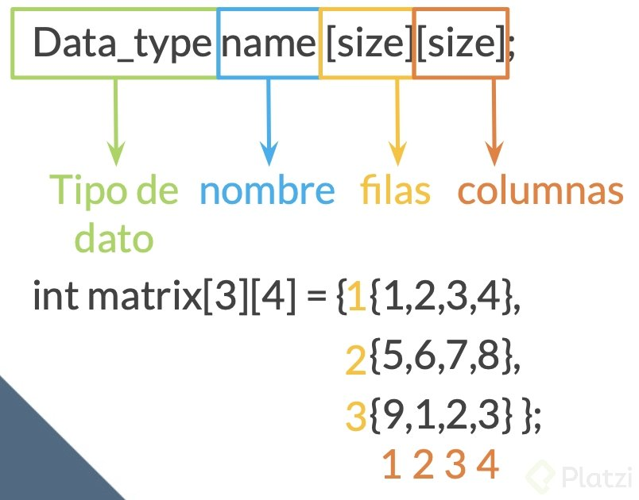

Para inicializar el arreglo, agregamos de igual manera entre corchetes los valores, separando cada fila en corchetes independientes, separados por comas. Y dentro de estos corchetes agregamos los valores también separados por comas.

**Arreglos e iteradores**

Una par de estructuras comúnmente utilizadas conjuntamente son los arreglos e iteradores. ¿Por qué utilizamos estas estructuras de manera conjunta?:

- Para manipular todos los elementos de un arreglo podemos utilizar una estructura repetitiva. La más usual es el ciclo for.
- Cuando desea imprimir el contenido del arreglo.
- Cuando se suman todos los elementos.
- También cuando se va a inicializar.

Para poder utilizar el iterador for junto con un arreglo bidimensional es necesario entender el concepto de un for anidado. Esto es un for dentro de un for, la sintaxis es la siguiente:

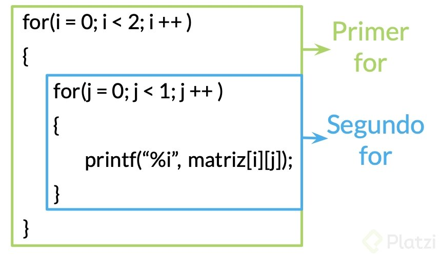

En esta estructura al inicial el for, se recorre vuelta por vuelta ambos fors, iniciando por la primera vuelta del primer for y continuando con todas las vueltas del segundo for. Siguiendo con la siguiente vuelta del primer for y continuando con todas las vueltas del segundo for, y así sucesivamente.

Esto es muy útil para recorrer arreglos bidimensionales.

Espero que estas recapitulaciones te sean útiles para repasar conceptos y revisar estructuras, ¡nos vemos en la siguiente clase!

## Modulo 4. Funciones
### Clase 20 *Funciones: Divide y vencerás*

La experiencia ha mostrado que la mejor forma de desarrollar y mantener un programa grande es construirlo a partir de piezas menores o módulos, siendo cada uno de ellos más fácil de manipular que el programa original. Esta técnica se conoce como divide y vencerás.

C fue diseñado para hacer funciones eficientes y fáciles de usar. Los programas C consisten generalmente de varias funciones pequeñas en vez de pocas grandes.

**Funciones**

Las funciones es un fragmento de código que realiza una tarea bien definida. Se invocan mediante una llamada de función, la llamada de función específica el nombre de la misma y proporciona información (en forma de argumentos) que la función llamada necesita a fin de llevar acabo su tarea. Por ejemplo, la función printf imprime por la salida estándar los argumentos que le pasamos.

Las funciones permiten a un programador modularizar un programa. Todas las variables declaradas en las definiciones de función son variables locales (son conocidas solo en la función en la cual están definidas).

La mayor parte de las funciones tienen una lista de parámetros. Los parámetros proporcionan la forma de comunicar información entre funciones. Los parámetros de función son también variables locales.

Existen varios intereses que dan motivo a la "funcionalización" de un programa. El enfoque de divide y vencerás hace que el desarrollo del programa sea más manipulable. Otra motivación es la reutilización del software - el uso de funciones existentes como bloques constructivos para crear nuevos programas.

Cada función debería limitarse a ejecutar una tarea sencilla y bien definida y el nombre de la función deberá expresar claramente dicha tarea.

Si no se puede elegir un nombre conciso es probable que la función esté intentando ejecutar demasiadas tareas diversas.

Se pueden utilizar para:

- Encapsulamiento
- Reusabilidad de código
- Separar tareas
- Cambios a futuro

Consideremos el siguiente código como ejemplo:

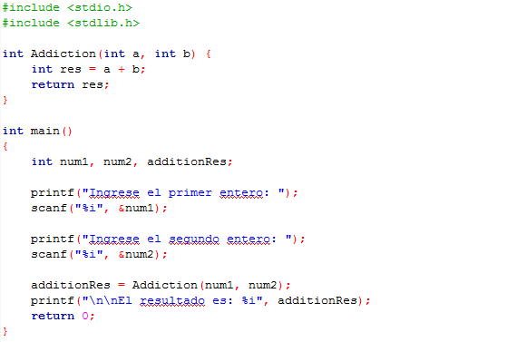

En donde tenemos dos funciones: la función principal main que hemos usado desde los principios de todo este curso y sirve como punto de partida para la ejecución del programa, y la función Addiction que recibe dos parámetros.

La función main tiene declarado tres variables enteras: dos variables (num1, num2) que reciben datos del usuario desde el teclado y la tercera variable (additionRes) se encarga de llamar a la función Addiction enviando los dos números enteros para posteriormente recibir el resultado de la suma. Al final, se imprime el resultado de la suma.

La función Addiction tiene dos parametros de tipo entero por donde recibe los datos, además declara una variable que guarda la suma y posteriormente utiliza la sentencia return para regresar la variable resultado. Aunque también podemos obviar la variable resultado, retornando directamente la suma escribiendo return a + b;.

**PRIMER RETO**

Vamos a calcular la potencia de un número:

- Ingresar un valor base
- Ingresar un valor de exponente
- Dentro de una función calcular el exponente del número base
- Imprime el resultado

**SEGUNDO RETO**

- Hacer un programa que cambie de dólares a tu moneda y de tu moneda a dólares
- Usa funciones

### Clase 21 *Variables locales y globales*

Las reglas de ámbito de un lenguaje son las reglas que controlan si un fragmento de código conoce o tiene acceso a otro fragmento de código o de datos.

**Variable Local**

Es aquella cuyo ámbito se restringe a la función que la ha declarado se dice entonces que la variable es local a esa función. Esto implica que esa variable sólo va a poder ser manipulada en dicha sección, y no se podrá hacer referencia fuera de dicha sección. Cualquier variable que se defina dentro de las llaves del cuerpo de una función se interpreta como una variable local a esa función.

**Variable Global**

Es aquella que se define fuera del cuerpo de cualquier función, normalmente al principio del programa, después de la definición de los archivos de biblioteca (#include), de la definición de constantes simbólicas y antes de cualquier función. El ámbito de una variable global son todas las funciones que componen el programa, cualquier función puede acceder a dichas variables para leer y escribir en ellas. Es decir, se puede hacer referencia a su dirección de memoria en cualquier parte del programa.

 El uso de variables globales no es aconsejable a pesar de que aparentemente nos parezca muy útil, esto se debe a varias razones fundamentales:

- Legibilidad menor
- Nos condiciona en muchos casos que el programa sólo sirva para un conjunto de casos determinados.
- El uso indiscriminado de variables globales produce efectos colaterales. Esto sucede cuando existe una alteración no deseada del contenido de una variable global dentro de una función, bien por invocación, bien por olvidar definir en la función una variable local o un parámetro formal con ese nombre. La corrección de dichos errores puede ser muy ardua.
- Atenta contra uno de los principios de la programación, la modularidad. El bajo acoplamiento supone no compartir espacios de memoria con otras funciones, y potenciar el paso de información (llamadas) para que la función trate la información localmente.
 
Las variables declaradas dentro de una función son automáticas por defecto, es decir, sólo existen mientras se ejecuta la función. Cuando se invoca la función se crean estas variables en la pila y se destruyen cuando la función termina. La única excepción la constituyen las variables locales declaradas como estáticas (static). En este caso, la variable mantiene su valor entre cada dos llamadas a la función aun cuando su visibilidad sigue siendo local a la función.
 
Una función siempre es conocida por todo el programa, excepto cuando se declara como estática, en cuyo caso sólo la podrán utilizar las funciones del mismo módulo de compilación. 
 
En C, todas las funciones están al mismo nivel de ámbito. Es decir, no se puede definir una función dentro de otra función. Esto es por lo que C no es técnicamente un lenguaje estructurado en bloques.
 
También puede suceder que en un mismo ámbito aparezcan variables  locales y globales con el mismo nombre. Cuando sucede esta situación, siempre son las variables locales y argumentos formales los que tienen prioridad sobre las globales.

Un ejemplo de variables locales y globales puede ser vista en nuestro siguiente ejemplo:

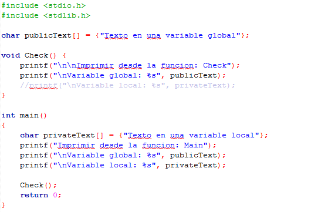

Nosotros declaramos al principio del programa una variable global llamada publicText mientras que en nuestra función principal main declaramos otra variable local llamada privateText, además de crear una función void que simplemente imprimirá nuestras variables al ser llamada al igual que en nuestro main.

Al hacer correr nuestro programa podemos observar que al principio nos imprime las variables locales y globales de la función main perfectamente, sin embargo, al llamar a la función Check nos marcara un error ya que la variable privateText se encuentra declarada únicamente en la función main. Pero, si nosotros comentamos a la variable local en la función Check, nuestro programa correra perfectamente imprimiendo las dos variables en la función main y únicamente la variable global en la función Check.

***NOTA: Aprendimos otra forma de declarar un arreglo de cadenas con un texto predeterminado. Además de imprimirlo en pantalla con %s.***

**RETO**

- Utilizando variables globales, ingresa el nombre de un alumno y su calificación
- En una función evalúa si el alumno ha aprobado o no
- La calificación mínima aprobatoria es 7
- Imprimir desde la función si el alumno aprobó

### Clase 22 *Recapitulación: Funciones*

En esta lectura vamos a hablar un poco sobre funciones y cómo utilizarlas.

Las funciones son bloques de código que realizan alguna operación o instrucciones. Estas al igual que en matemáticas pueden aceptar datos de entrada, a estos les llamamos parámetros o argumentos y datos de salida. La función ya creada que hemos estado utilizado hasta ahorita, es la función main(). La estructura sería similar a lo siguiente:

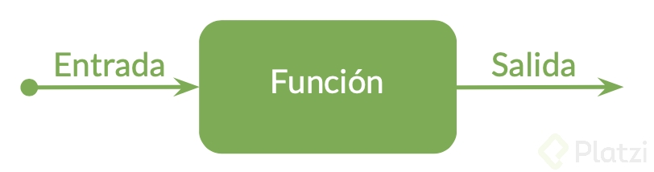

¿Con qué finalidad hacemos estas secciones de código?

- Encapsulamiento
- Reusabilidad
- Separar Tareas
- Cambios a futuro

La sintaxis para escribir una función es la siguiente:

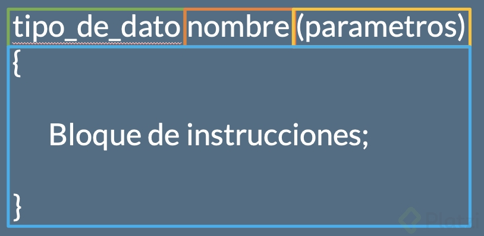

Primero se escribe el tipo de dato de la salida de datos, luego el nombre por el que se identificará la función y finalmente entre paréntesis los parámetros o entrada de datos.

Y entre paréntesis el bloque de instrucciones. No es necesario que una función tenga una entrada y salida de datos, puede tener una, otra, ambas o ninguna.

Pero si tiene salida de datos, el dato final necesita ser descrito con el comando return y el dato que vamos a regresar, que tiene que ser el mismo tipo de dato el cual indicamos inicialmente al crear la función. De la misma manera para los parámetros necesitamos declarar las variables dentro de los paréntesis que vayamos a necesitar, cada una es separada por una coma.

De no necesitar un dato de salida nuestra función puede ser de tipo void, esto quiere decir que no regresa ningún dato.

**Variables globales y locales**

Naturalmente al tener secciones de código, o sea funciones, creamos una necesidad de tener variables que puedan ser compartidas entre estas. Para esto creamos variables globales.

Hasta ahora las únicas variables que habíamos creado eran variables locales, esto quiere decir que son creadas dentro de una función y solo pueden ser utilizadas en esta función.

Para crear variables que usemos entre diferentes funciones lo hacemos con la misma sintaxis que hasta ahora hemos hecho, pero lo haremos fuera de cualquier función y lo haremos en la primera sección de nuestro código en la parte superior. Al hacerlo aquí nosotros estamos creando variables globales que podemos utilizar en cualquier función y será compartida.

Espero que esta última recapitulación te haya servido para reafirmar los conceptos que aprendimos, ¡nos vemos en la siguiente clase!
