# Curso de Redes de Internet
## Modulo 1. Introducción al Curso de Redes de Internet
### Clase 1 *Bienvenidos al Curso de Redes de Internet*

La profesora Yesica Cortés te da la bienvenida al curso.

En este curso vamos a hablar sobre cómo internet ha cambiado la forma en la que nos comunicamos. Además, vamos a ver cómo la economía y la política han cambiado gracias a las redes de internet. Hoy en día podemos comunicarnos sin importar en dónde nos encontramos. En este curso vamos a ver:

- Cómo funciona la comunicación en redes
- Modelos de referencia OSI y TCP/IP
- Diseño de redes y configuración

## Modulo 2. Introducción a Redes de Telecomunicaciones
### Clase 2 *Qué es la red, Internet, LAN, WAN y Topologías de Red*

Una red cumple tres características:
- Tiene un punto de partida y llegada
- Su objetivo es transportar algo de un lugar a otro
- Tiene puntos conectados por un medio

**¿Qué es la red informática?**

Según el libro de redes de computadora de Tanenbaum:

***Una red de computadoras es un conjunto de equipos informáticos y software conectados entre sí por medio de dispositivos físicos o inalámbricos que envían y reciben impulsos eléctricos, ondas electromagnéticas o cualquier otro medio para el transporte de datos, con la finalidad de compartir información, recursos y ofrecer servicios.***

**Tipos de redes**

Las redes son definidas según:
- El tamaño del área que cubre
- Cantidad de usuarios conectados
- Cantidad y tipo de servicio disponible
- El área de responsabilidad

**LAN - Local Area Network**

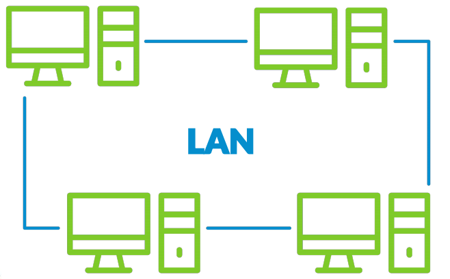

Son redes pequeñas, de área local, que son las que tenemos en casa, en las oficinas y en edificios pequeños.

Redes muy pequeñas interconectadas, generalmente, por cables aunque ahora contamos con dispositivos como los access point que nos permiten también hacer la conexión de estos dispositivos a través de wireless (red inalámbrica).

La cobertura es muy corta, las redes LAN están muy determinadas por el tamaño de área que cubre.

**WAN - Wide Area Network**

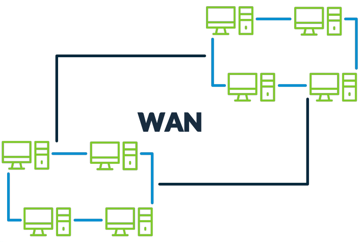

Cuando ampliamos el área de cobertura de las redes y la cantidad de usuarios conectados hablamos de redes WAN.

Las redes WAN interactúan con otros dispositivos como routers, que nos permite generar cobertura en rangos más amplios con cobertura inalámbrica porque no todo está conectado por cables.

Otra característica que tiene, a parte del área que cubre, es que son administradas por diferentes servicios de internet.

**MAN - Metropolitan Area Network**

Es la red existente entre la red LAN y la red WAN. Se encarga de conectar áreas más pequeñas, como barrio.

**¿Qué es internet?**

Es una red de redes interconectadas mundialmente.

Si tienes dos computadores conectados ya estás haciendo una red, si a esos dos computadores los conectas a otros edificios ya tienes una red más grande y si todos nos vamos conectando, ampliando cada vez más esa cobertura llegando a un nivel mundial, tenemos internet.

Internet es una conexión de redes LAN y redes WAN.

**Topologías de Red**

Una topología de redes es el diseño que le estamos dando a nuestra red, y podemos mostrar ese diseño de dos maneras.

**Diagrama de Topología Física**

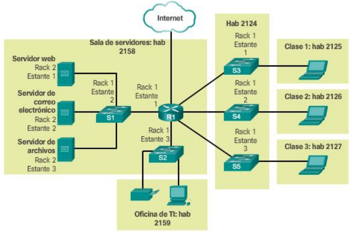

Cuando hablamos de topología física lo que hacemos es mostrar los dispositivos conectados. Hablamos de la ubicación física de los dispositivos y de físicamente cual va a ser el dispositivo que nos ayudara a llegar a la información.

**Diagrama de Topología Lógica**

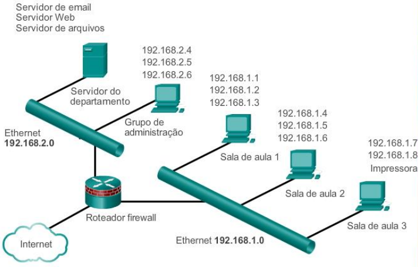

En este tipo de topología hablamos de cuáles serán las direcciones físicas y lógicas de los equipos, y cuáles son los puertos por los cuales llegara la información.

### Clase 3 *Intranet y Extranet*

En esta clase vamos a hablar de dos formas en las que podemos diseñar e implementar las redes de acuerdo con características de acceso que queremos dar a los usuarios.

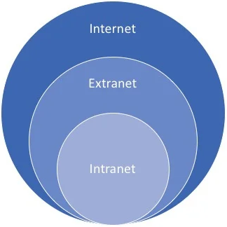

**Intranet**

Son aquellas redes internas en las que el acceso a la información está estrictamente limitada a personal de la compañía. Este tipo de redes se restringen con el uso de software y se usan en situaciones en las que la información a la que pueden acceder los usuarios es confidencial.

**Extranet**

El siguiente nivel de acceso sucede cuando las compañías requieren dar acceso seguro y bajo confidencialidad a usuarios externos incluso a organizaciones diferentes a la que posee la información.
Esto puede pasar por ejemplo cuando una compañía requiere compartir documentos o información con proveedores o contratistas.

### Clase 4 *Ejemplos de Topologías de Red y sus usos*

La topología de red nos permite identificar la forma en que los nodos están conectados. La información se envía a través de los medios y de los nodos para viajar de un lugar a otro.

Ya vimos las dos formas en que podemos mostrar estos diseños, física cuando queremos mostrar los equipos de red que conforman el diseño y lógica para mostrar el direccionamiento lógico de los dispositivos.

La topología más rápida de implementar y de ver es cuando tenemos dos nodos conectados por un medio para enviar información esta es llamada Punto a Punto, un punto envía información al otro.
Luego tenemos otras topologías, veamos algunas de sus características y ventajas.

**Topología de bus**

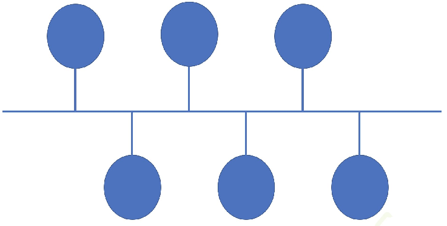

Este tipo de topología es el más usado en redes de tipo LAN. En esta topología los nodos están conectados a un mismo medio que transporta la información.

La ventaja de este tipo de red es que es fácil de implementar y puede crecer rápidamente sin tener que hacer cambios bruscos a la red.
Esto, aunque es una gran ventaja y seguro le facilita la vida al administrador de la red, presenta dos inconvenientes, uno es que el tráfico de todos los nodos puede ser visto por los otros y el segundo es que a medida que la red crezca se va a ver afectado el rendimiento.

**Topología de anillo**

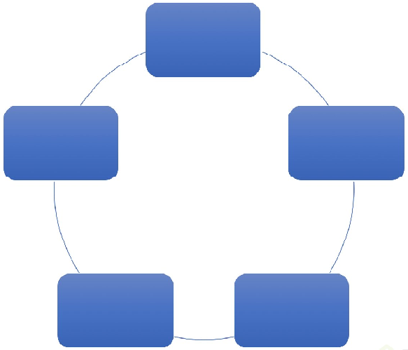

Este tipo de topología consiste en que cada nodo tiene una única conexión de entrada y una conexión de salida. Un token de confirmación viaja a través de cada nodo avisando que se envió y fue recibida correctamente.

Este tipo de topología aunque garantiza el envío de la información puede llegar a ser un poco lenta ya que ésta debe pasar por cada nodo intermedio antes de alcanzar su objetivo. En el caso de que uno de los nodos fallé esto puede afectar el funcionamiento de la red.

**Topología de estrella**

En esta topología todos los nodos están conectados a un punto central, esta implementación permite garantizar el funcionamiento de la red, de forma que si alguno de los nodos falla esto no va a afectar para nada el funcionamiento ni el rendimiento de la red.
Esta topología se usa mucho en redes LAN, por ejemplo en oficinas en las que hay un switch al que llegan todas las conexiones de los dispositivos a través de cable.

Es una topología que permite agregar nodos nuevos siempre que el dispositivo central lo permita, sin embargo en caso en que el nodo central falle toda la red dejará de funcionar.

**Topología de malla**

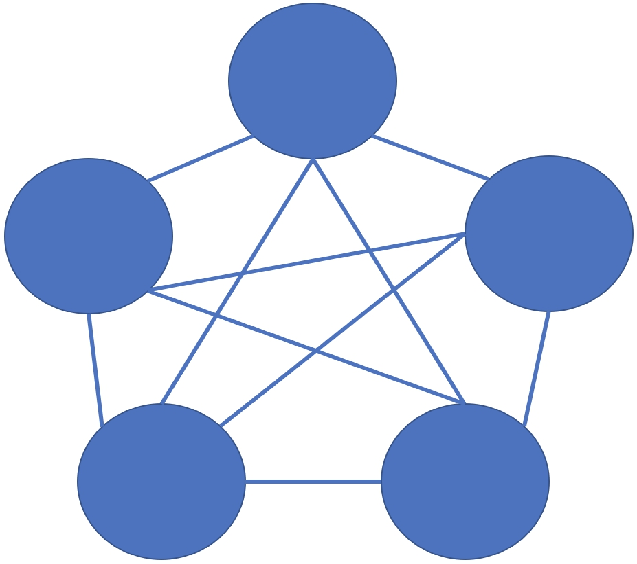

En las topologías de tipo malla todos los nodos están conectados entre sí, este tipo de conexión permite que cada nodo pueda actuar como servidor y como cliente.

Esta es una forma óptima de mantener la conexión entre dispositivos en una red, ya que se reduce a uno la cantidad de dispositivos por los que debe viajar la información y en caso de que un nodo de la red falle los datos pueden ser enviados por otro camino, lo que asegura disponibilidad.

**Topología de árbol**

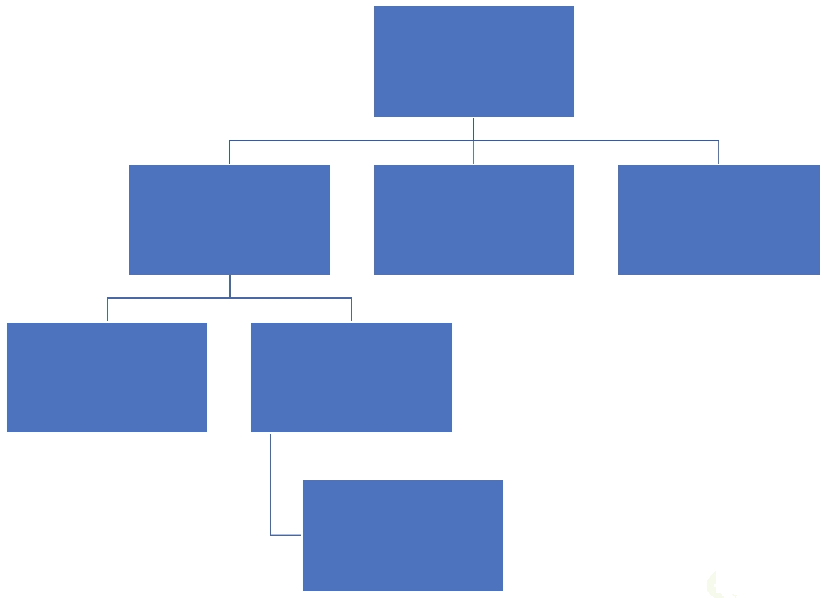

En esta topología contamos con varios dispositivos intermedios que permiten que otros nodos se conecten. Por ejemplo, podemos tener un punto inicial que recibe la conexión a Internet desde el ISP, de allí viaja por el medio a un switch que distribuye a otros dispositivos que pueden ser nodos u otros dispositivos intermedios, switches, routers etc. quienes a su vez envían los datos a otros dispositivos iguales.

La forma de la red se parece mucho a un árbol.

También podemos hacer combinaciones de estas topologías para realizar nuestras propias implementaciones de acuerdo con las necesidades de los usuarios.

### Clase 5 *Tecnologías de acceso a internet: Banda Ancha y velocidad de Internet*

Ya sabemos que internet es un conjunto de redes interconectadas a través de medios. Estos medios tienen diferentes medidas que podemos utilizar para calcular su rendimiento, una de esas medidas es el ancho de banda.

El ancho de banda corresponde a la capacidad máxima que tiene para pasar bytes.

Para poder calcular la velocidad de banda ancha que nos ofrece nuestro proveedor de servicio de internet (IPS), debemos saber primero que es un bit y que es un byte:
Bit: es un digito que forma parte del sistema binario, representado por uno de estos valores (0 o 1).
Byte: una unidad de información digital equivalente a ochos bits (ejemplo, 0 0 1 1 0 0 1 1)

También debemos saber que nuestro proveedor nos ofrece Mb/segundo, mientras que los archivos pesan en MB.

**Si tienes una velocidad de 50Mb/segundos y deseas descargar un archivo de 10MB, ¿Cuánto tiempo te tomaría?**

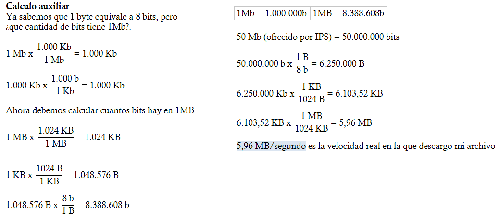

### Clase 6 *La Red Convergente*

***Las redes convergentes transportan múltiples servicios por la misma red.***

Las redes convergentes o redes de multiservicio hacen referencia a la integración de los servicios de voz, datos y video sobre una sola red basada en IP como protocolo de nivel de red. En este artículo se presenta la integración de servicios de voz sobre redes IP (VoIP) como ejemplo de red convergente. La arquitectura de esta red está constituida básicamente, por el media gateway, el controlador de media gateway, el gateway de señalización y el gatekeeper. Las redes de convergencia han tenido y tendrán aún dificultades técnicas qué superar ya que los distintos servicios por ofrecer tienen diferentes características y requerimientos de red, por tanto es importante hablar aquí de ingeniería de tráfico y mecanismos que garanticen calidades de servicio.

**Redes tradicionales separadas**

Piense en una escuela construida hace cuarenta años. En ese entonces, las aulas contaban con conexiones por cable para la red de datos, la red telefónica y la red de vídeo para los televisores. Estas redes separadas no podían comunicarse entre sí, como se muestra en la figura. Cada red utilizaba tecnologías diferentes para transportar la señal de comunicación. Cada red tenía su propio conjunto de reglas y estándares para asegurar una comunicación satisfactoria.

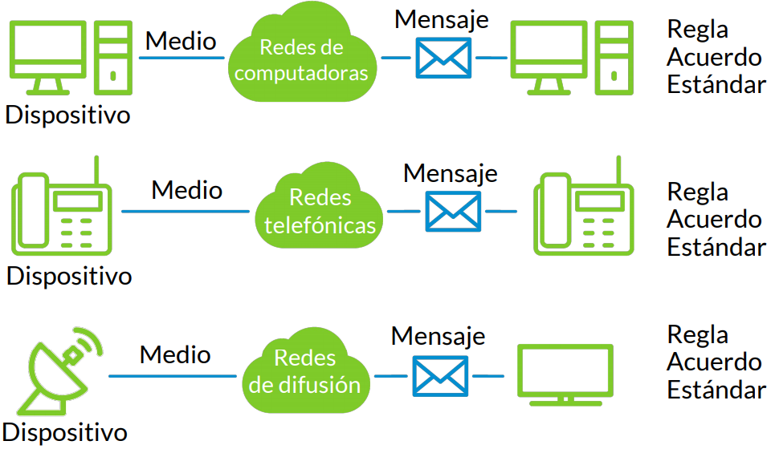

**Red convergente**

Hoy, las redes separadas de datos, telefonía y vídeo están convergiendo. A diferencia de las redes dedicadas, las redes convergentes pueden transmitir datos, voz y vídeo entre muchos tipos diferentes de dispositivos en la misma infraestructura de red, como se muestra en la figura. Esta infraestructura de red utiliza el mismo conjunto de reglas, acuerdos y estándares de implementación.

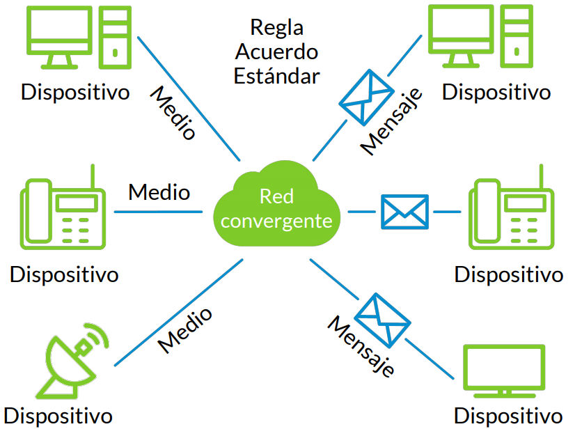

## Modulo 3. Configuración de dispositivos (IOS CISCO)
### Clase 7 *Métodos de acceso a los dispositivos*

Sistema operativo es la aplicación o la forma en que nosotros como usuarios podemos acceder al kernel y el kernel es el que accede físicamente al hardware.

Hay muchos sistemas operativos y cada marca tiene su forma de acceder a sus máquinas.

Las formas en que podemos conectarnos son:

**Acceso por consola**

Se puede tener acceso a la CLI a través de una sesión de consola, también denominada línea CTI. La consola usa una conexión serial de baja velocidad para conectar directamente un equipo o un terminal al puerto de consola en el router o switch.

El puerto de consola es un puerto de administración que provee acceso al router fuera de banda. Es posible acceder al puerto de consola aunque no se hayan configurado servicios de networking en el dispositivo. El puerto de consola se suele utilizar para tener acceso a un dispositivo cuando no se han iniciado o han fallado los servicios de networking.

Ejemplos del uso de la consola son:
- La configuración de inicio del dispositivo de red.
- Procedimientos de recuperación de desastres y resolución de problemas donde no es posible el acceso remoto.
- Procedimientos de recuperación de contraseña.

Cuando un router se pone en funcionamiento por primera vez, no se han configurado los parámetros de networking. Por lo tanto, el router no puede comunicarse a través de una red. Para preparar la puesta en marcha y configuración iniciales, se conecta un equipo que ejecuta un software de emulación de terminal al puerto de consola del dispositivo.

En el equipo conectado pueden ingresarse los comandos de configuración para iniciar el router.

Durante el funcionamiento, si no se puede acceder a un router en forma remota, una conexión a la consola puede permitir a un equipo determinar el estado del dispositivo. En forma predeterminada, la consola comunica el inicio del dispositivo, la depuración y los mensajes de error.

Para muchos dispositivos Cisco, el acceso de consola no requiere ningún tipo de seguridad, en forma predeterminada.

Sin embargo, la consola debe estar configurada con contraseñas para evitar el acceso no autorizado al dispositivo. En caso de que se pierda una contraseña, existe un conjunto especial de procedimientos para eludir la contraseña y acceder al dispositivo.

Debe colocarse el dispositivo en un cuarto cerrado con llave o en un bastidor de equipos para impedir el acceso físico.

**Acceso por SSH (Secure Shell) o Telnet (Teletype Network)**

Un método que sirve para acceder en forma remota a la sesión CLI es hacer telnet al router. A diferencia de la conexión de consola, las sesiones de Telnet requieren servicios de networking activos en el dispositivo. El dispositivo de red debe tener configurada por lo menos una interfaz activa con una dirección de Capa 3, como por ejemplo una dirección Ipv4.

Los dispositivos Cisco IOS incluyen un proceso de servidor Telnet que se activa cuando se inicia el dispositivo. El IOS también contiene un cliente Telnet.

Un host con un cliente Telnet puede acceder a las sesiones vty que se ejecutan en el dispositivo Cisco. Por razones de seguridad, el IOS requiere que la sesión Telnet use una contraseña, como método mínimo de autenticación. Los métodos para establecer las conexiones y contraseñas se analizarán en una sección posterior.

El Secure Shell protocol (SSH) es un método que ofrece más seguridad en el acceso al dispositivo remoto. Este protocolo provee la estructura para una conexión remota similar a Telnet, salvo que utiliza servicios de red más seguros.

El SSH proporciona autenticación de contraseña más potente que Telnet y usa encriptación cuando transporta datos de la sesión. La sesión SSH encripta todas las comunicaciones entre el cliente y el dispositivo IOS. De esta manera se mantienen en privado la ID del usuario, la contraseña y los detalles de la sesión de administración. Una mejor práctica es utilizar siempre SSH en lugar de Telnet, siempre que sea posible.

La mayoría de las versiones más recientes de IOS contienen un servidor SSH. En algunos dispositivos, este servicio se activa en forma predeterminada. Otros dispositivos requieren la activación del servidor SSH.

Los dispositivos IOS también incluyen un cliente SSH que puede utilizarse para establecer sesiones SSH con otros dispositivos. De manera similar, puede utilizarse un equipo remoto con un cliente SSH para iniciar una sesión de CLI segura. No se provee el software de cliente SSH de manera predeterminada en los sistemas operativos de todos los equipos. Es posible que deba adquirir, instalar y configurar el software de cliente SSH en su equipo.

**Acceso por Auxiliar**

Otra manera de establecer una sesión CLI en forma remota es a través de una conexión de marcado telefónico mediante un módem conectado al puerto auxiliar del router. De manera similar a la conexión de consola, este método no requiere ningún servicio de networking para configurarlo o activarlo en el dispositivo.

El puerto auxiliar también puede usarse en forma local, como el puerto de consola, con una conexión directa a un equipo que ejecute un programa de emulación de terminal. El puerto de consola es necesario para la configuración del router, pero no todos los routers tienen un puerto auxiliar. También se prefiere el puerto de consola antes que el puerto auxiliar para la resolución de problemas, ya que muestra de manera predeterminada la puesta en marcha del router, la depuración y los mensajes de error.

Generalmente, en la única oportunidad que el puerto auxiliar se usa en forma local en lugar del puerto de consola es cuando surgen problemas en el uso del puerto de consola, como por ejemplo cuando no se conocen ciertos parámetros de consola.

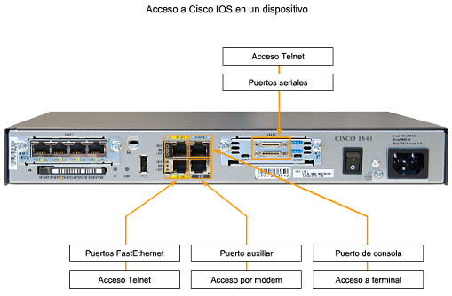

### Clase 8 *Instalación de Packet Tracer, emulador de redes*

Existe software que nos permite hacer simulación de redes, de forma que podamos probar todos los casos antes de hacer las implementaciones reales.

Para este curso vamos a estar usando Packet Tracer, este es un software que Cisco ofrece en versión de estudiante para que podamos aprender y practicar. Cisco es una de las empresas más grandes y quien manda la parada en cuanto a investigación y nuevos desarrollos en el tema de redes. Sus dispositivos son ampliamente usados en entornos empresariales y además ofrece a quien quiera aprender mucho contenido en su sitio www.netacad.com.

Uno de los contenidos que te recomiendo está aquí: [Packet Tracer](https://www.netacad.com/courses/packet-tracer "Packet Tracer"). Este es un curso gratuito que te va a abrir un mundo de oportunidades. Y ademas nos va a ayudar para que continuemos con nuestro curso de redes.

Entra al link que te dejé antes y enrólate al curso. De esta forma vamos a poder descargar e instalar Packet Tracer. La instalación es realmente sencilla, unas vez que hayas hecho el registro en Netacad vas a encontrar en los recursos del curso el instalador para tu sistema operativo, lo descargas y sigues las indicaciones del asistente.

Packet Tracer no está disponible para dispositivos con IOs por eso estaremos trabajando las simulaciones en Windows.

### Clase 9 *Práctica: Navegación por el sistema operativo, comandos y privilegios*

Ahora que tenemos Packet Tracer instalado, vamos hacer unas pequeñas configuraciones para empezar a familiarizarnos con los dispositivos.

Vamos a construir una red que consta de un switch (con dirección IP y máscara de red) y un PC de escritorio (también con su dirección IP y su máscara de red).

Para la practica ingresamos a Packet Tracer y, lo primero que podemos ver, es un gran tablero blanco en el que podemos asignar o colocar todos nuestro dispositivos para poder armar nuestra red. En la parte inferior tenemos unos iconos y accesos a diferentes dispositivos como los switch, routers, hots, etc. Y también encontramos dispositivos finales como PC de escritorio, laptops, servidores, telefonos y más. Aquí seleccionamos los dispositivos que estaremos configurando, en este caso usaremos una PC y una switch 2960.

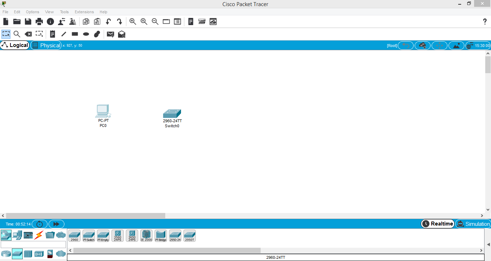

**Concepto que debemos saber antes:**

- **Switch:** es un dispositivo que permite que la conexión de computadoras y periféricos a la red para que puedan comunicarse entre sí y con otras redes.
- **IP (Internet Protocol, en español Protocolo de Internet):** es una serie de condiciones y reglas sobre las cuales se maneja todo el espectro comunicacional entre computadoras en la red.
- **Máscara de red:** combinación de bits que sirve para delimitar el ámbito de una red de computadoras. Su función es indicar a los dispositivos qué parte de la dirección IP es el número de la red, incluyendo la subred, y qué parte es la correspondiente al host.
- **Vlan:** es un método que permite crear redes que lógicamente son independientes, aunque estas se encuentren dentro de una misma red física.
- **Modo de usuario:** el modo usuario proporciona un limitado número de comandos que permiten al usuario ver información y verificar el estado del dispositivo. El modo usuario no permite ningún comando que pueda cambiar la configuración del dispositivo.
- **Modo privilegiado:** el modo privilegiado da acceso a todos los comandos del dispositivo. Los comandos de configuración y administración requieren que el administrador de red se encuentre en el modo privilegiado. Sólo usuarios autorizados deben tener acceso a los comandos de configuración deñ dispositivo.
- **Modo de configuración global:** todos los cambios de configuración hechos mediante la interfaz de línea de comando (CLI) en un router CISCO, se realizan desde el modo de configuración global. Los comandos del modo de configuración global afectan al sistema como un todo. Desde el modo de configuración global se puede acceder a otros submodos de operación más específicos dependiendo del cambio de configuración que se desea realizar.
- **Ping:** es un comando o una herramienta de diagnóstico que permite hacer una verificación del estado de una determinada conexión o host local.

**Configuración del switch**

Para configurarlo necesitamos dar doble click sobre el switch y nos abre otra ventana. Para configurarlo necesitamos dar doble click sobre el switch y nos abre otra ventana. Esta ventana nos muestra físicamente como se verá el switch, la cantidad de puertos con los que contamos y nos muestra los puertos de consola que nos permitirá acceder a través de cables.

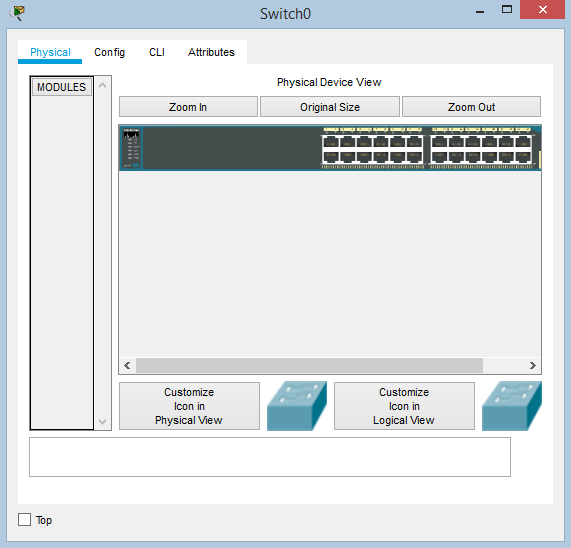

En la pestaña 'Config' es una pestaña que nos permite hacer las configuraciones de los puertos, podemos asignarles la vlan que queremos construir y podemos hacer la configuración normal.

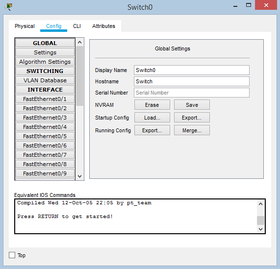

Sin embargo, nosotros vamos hacer las configuraciones con los comandos que nos ofrece el sistema operativo. Para eso vamos en la pestaña 'CLI', que es la consola de línea de comandos. Ahí podemos ver los parámetros iniciales del switch, nos muestra que sistema operativo tiene, la versión del sistema operativo, como se llama y desde que switch estamos accediendo.

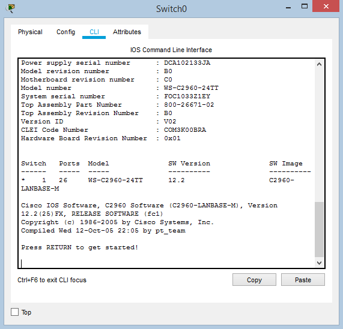

Presionamos la tecla ENTER y entramos en un modo de usuario, lo sabemos por el carácter > que esta al final del nombre del switch, para entrar al modo privilegiado ingresamos el comando 'enable' y nos debe salir el carácter # al final. Si usamos el comando 'configure terminal', ingresamos al modo de configuración global, escribiendo 'interface nombre_interfaz' nos permite hacer modificaciones al interfaz. Para salir de este modo presionamos Ctrl + Z, y después escribimos la palabra 'exit'.

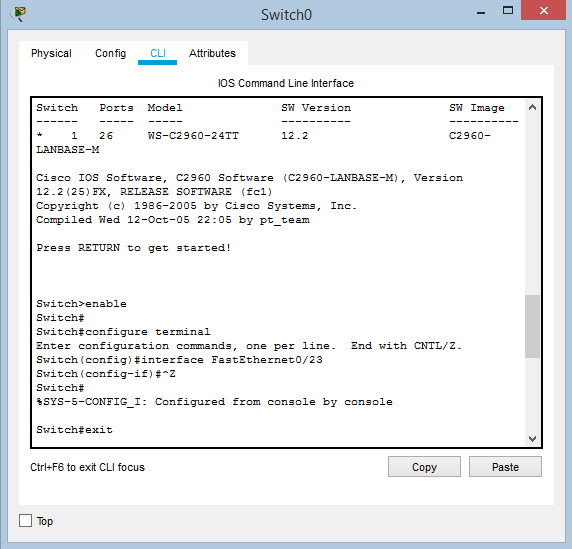

Hacer todo esto nos devuelve al inicio de la pantalla, en el modo usuario, volvemos a ingresar al modo de configuración con privilegios (escribimos la palabra 'enable') y luego usamos el comando 'show running-config', este comando nos permitirá ver las configuraciones del dispositivos, como su nombre.

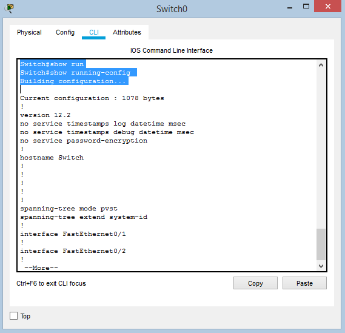

Ahora que vimos algunos comandos, es hora de configurar el switch. Lo primero que haremos será ingresar al modo de configuración global y asignarle un nombre al dispositivo, para eso usamos el comando 'hostname nombre_dispositivo' y vemos como su nombre cambia.

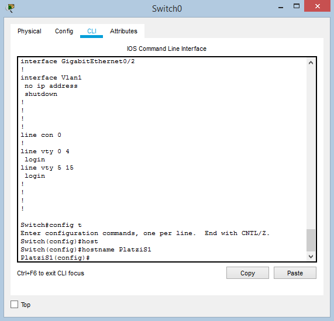

Para darle seguridad al dispositivo podemos darle una contraseña. En cada modo es posible habilitar una contraseña y darle diferentes niveles de seguridad, pero para esta práctica únicamente vamos a darle seguridad al modo de privilegios. Para dar una contraseña usamos el comando 'enable secret contraseña_dispositivo'.

A continuación le daremos un banner o aviso al dispositivo, esto nos dará un aviso que ayudara a ver cuando entramos, especialmente si no estamos cerca e ingresamos de manera remota (ya sea usando Telnet o SSH). Para configurar el aviso usamos el comando 'banner motd #mensaje#'. El carácter # señala el principio y final del mensaje.

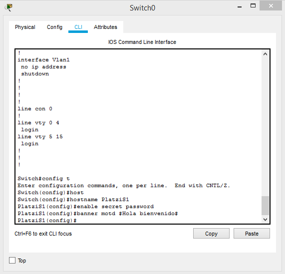

Salimos y volvemos a ingresar, de esta forma comprobamos la seguridad y el aviso.

Ingresamos al modo de configuración global y posteriormente al modo de configuración de interfaces (en este caso configuraremos el vlan). Le asignamos la dirección IP y la máscara de red con el comando 'ip addres dirección_IP dirección_máscara'. Activamos la interfaz y nos señala el cambio con el el comando 'no shutdown'.

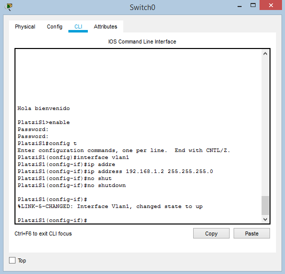

Antes de salir debemos guardar los cambios hechos en el switch, si no hacemos esto y solamente cerramos perderemos todas nuestras configuraciones. Para eso volvemos a ingresar al modo de privilegios y usamos el comando 'copy run startup-config', nos preguntara si deseamos guardar las configuraciones, presionamos la tecla ENTER y ya está.

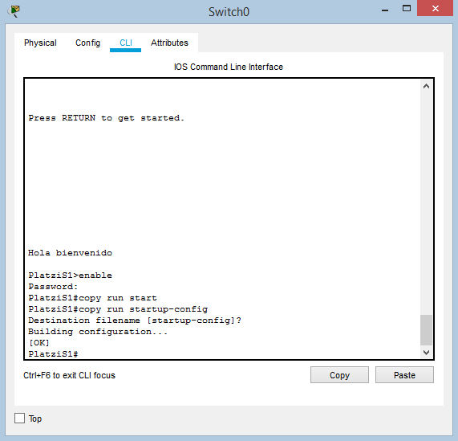

Si deseas comprobar que los cambios fuero debidamente guardados solamente debes correr el comando 'show running-config' y vemos como el nombre del switch ha sido modificado y la contraseña esta encriptada.

También podemos ver como la interfaz vlan tiene una dirección ip y una máscara de red, y que el aviso fue agregado.

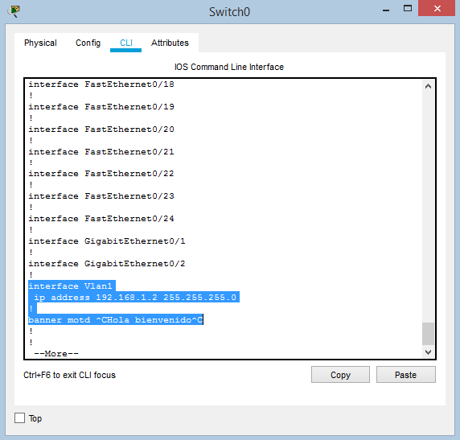

**Configuración de PC**

Hacer la configuración de la PC es un poco más sencillo. Damos doble click y nos abre una ventana, similar a la switch, esta ventana nos mostrara como se verá físicamente nuestra PC.

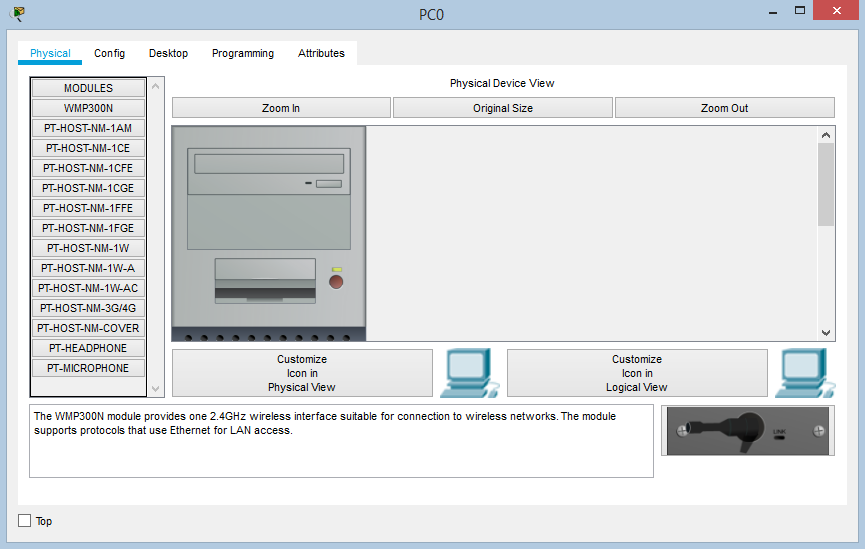

Vamos a la pestaña 'Config', después a FastEthernet0 y en la parte IP Configuration ingresamos la dirección IP y la máscara de red.

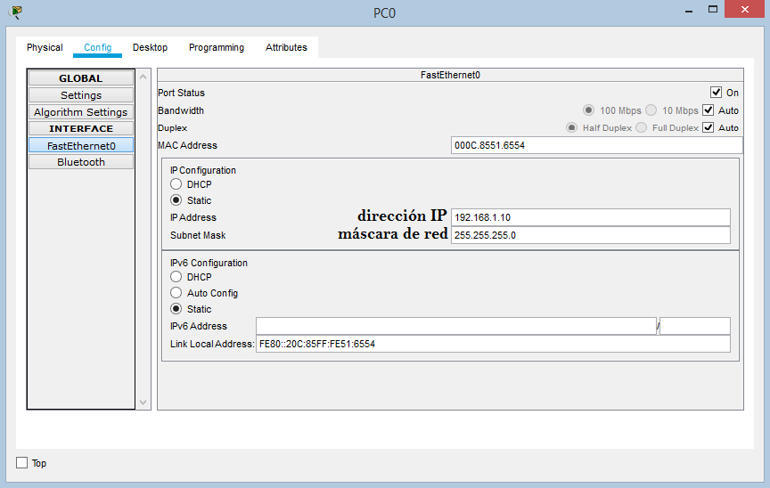

**Comprobar conexión**

La comprobación de conectividad se hace mediante un ping y para eso debemos tener un cable que conecte nuestra PC con la switch.

Elegimos un cable entre los iconos de la parte inferior y después elegimos que nuestra PC se conecte a través del FasEthernet0.

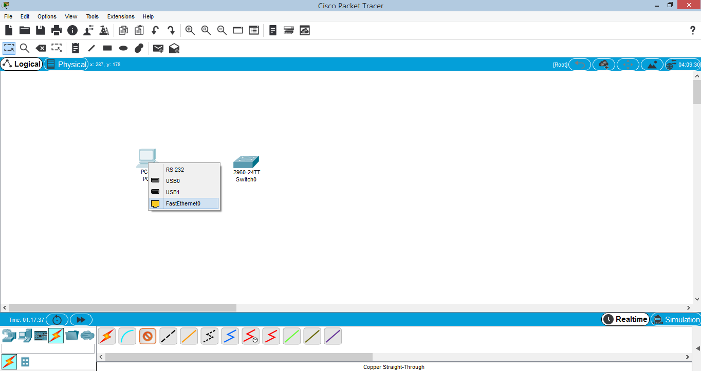

Y lo conectamos al switch a través de un FastEthernet.

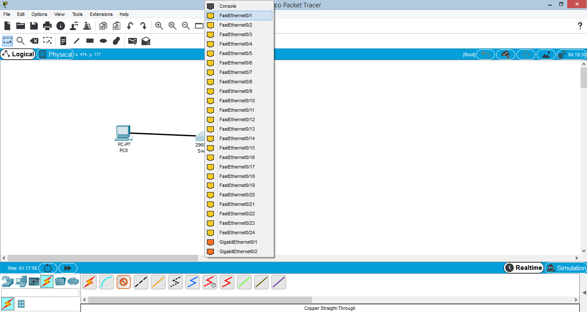

Esperamos a que ambos puntos (o triángulos) se pongan de color verde, esto nos indica que están en la misma red y tiene conexión.

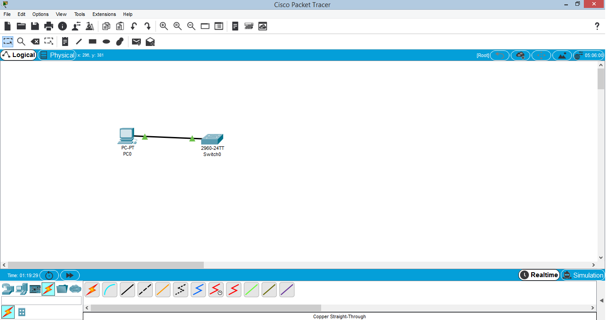

Volvemos a ingresar a la PC dando doble click, vamos a la pestaña 'Desktop' y después a 'Command Prompt' o 'Consola de comandos'.

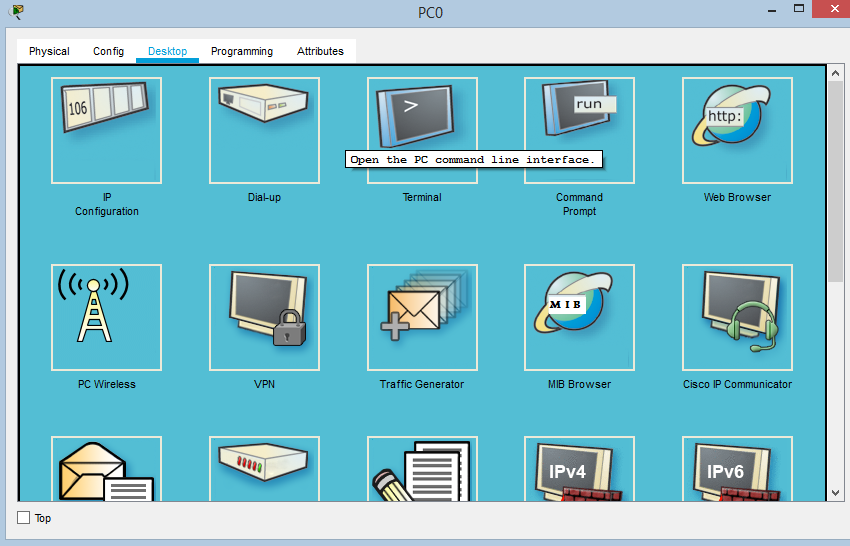

En la consola escribimos 'ping dirección_IP', en este caso la dirección IP del switch es 192.168.1.2. Esperamos unos momentos y vemos como el tiempo que tarda la conexión entre ambos dispositivos.

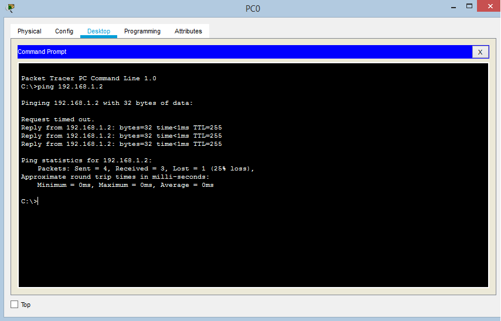

Y ya está, con esto fue comprobado que tu PC está conectada a una switch.

## Modulo 4. Protocolos y comunicaciones de red
### Clase 10 *Suites de protocolos*

Una suite de protocolos es un conjunto de protocolos que nos ayudan desde las diferentes capas y servicios de la red a garantizar que la información viaja de un lugar a otro, de forma segura y confiable, algunos de estos sirven para garantizar que la información es entregada o no como lo son TCP y UDP.

En la siguiente clase estaremos hablando de los modelos de referencia para la transmisión de datos en Internet, el modelo OSI y el modelo TCP/IP. Veremos que son similares y una de las cosas por las que esto es así es porque los protocolos que ambos usan en sus capas son protocolos abiertos, de uso libre, de forma que pueden estar implementados en cualquier dispositivo de hardware o a través de software.

A continuación listo algunos de los protocolos usados en las diferentes capas de red y su funcionamiento:

**De la capa de Acceso a la Red (TCP/IP) / Física + Enlace de Datos (OSI)**

**ARP**

Es el protocolo que permite hacer la asignación de direcciones físicas y direcciones lógicas en el modelo OSI funciona en la capa de Enlace a Datos en la capa lógica.

**Ethernet**

Es el protocolo que nos permite definir los estándares relacionados con los medios cableados y la señalización en la capa física.

**Controladores de NIC**

Corresponde a la definición de los algoritmos que llevan las instrucciones a la máquina para recibir y enviar datos a través de la tarjeta de acceso a Internet del dispositivo.

**Capa de Internet (TCP/IP) / Capa de Red (OSI)**

**IP**

Protocolo de Internet, es el protocolo encargado de la asignación de direcciones lógicas a los dispositivos, recibe los segmentos de la capa de transporte y los direcciona a través de la red.

**NAT**

Network Address Translation, este protocolo hace la traducción de direcciones IP privadas en direcciones IP públicas únicas globalmente.

Es un protocolo que permite a los routers enviar mensajes a través de Internet. Cada dispositivo en la red LAN sale a Internet a través de un dispositivo llamada Router que contiene un listado de direcciones IP privadas vs direcciones IP públicas.

Cuando un host quiere enviar un mensaje a un dispositivo externo el router determina a través de NAT a donde debe enviar.

Con el uso de direcciones IPv6 se espera que el uso de este protocolo no sea necesario ya que es posible asignar a cada host en en el mundo una dirección lógica única.

**ICMP**

Este protocolo apoya al protocolo IP proporcionando mensajes y notificaciones de error cuándo un mensaje no puede alcanzar su destino. Valida que el mensaje haya alcanzado su destino, valida también si la el tiempo de vida del mensaje ya ha sido superado entre otras cosas. Su labor es únicamente informar sobre el error sin ejecutar acción alguna para resolverlo.

**Capa de Transporte (TCP/IP) / Capa de Transporte (OSI)**

Los protocolos de esta capa son TCP y UDP, de ellos estaremos hablando mas adelante en el curso.

**Capa de Aplicación (TCP/IP) / Capa de sesión + Capa de Presentación + Capa de Aplicación (OSI)**

**DNS**

Domain Name System, es el protocolo encargado de hacer la traducción de direcciones IP (172.217.14.163) en textos que podamos leer y recordar fácilmente como www.google.com

**DHCP**

Es el protocolo encargado de asignar direcciones IP de forma dinámica a los dispositivos. Esta pendiente de liberar las direcciones cuando estás ya no están siendo usadas.

**SMTP**

Este es un protocolo de envío de correo, pongo en negrita la palabra porque este es precisamente su funcionamiento, tanto desde los hosts como desde los servidores, el protocolo SMTP es en encargado de enviar los mensajes.

**POP**

Junto con IMAP, POP es un protocolo encargado de la recepción de los mensajes en el dispositivo de destino. POP descarga los mensajes desde el servidor a tu pc y son eliminados del servidor. Si recibes un mensaje usando el protocolo POP ese mensaje puede ser consultado sin conexión a Internet luego de ser descargado al pc, pero si se borra de tu pc ya no hay manera de recuperarlo.

**IMAP**

El otro protocolo para recuperación de correo, en este caso los mails son revisados desde el servidor, de forma que se requiere conexión a Internet para leer los mensajes, puedes acceder a tus mails desde diferentes dispositivos y no tienes que preocuparte por la recuperación ya que el servidor realiza copias de seguridad para garantizar que el mail sigue disponible.

**FTP/TFTP**

Son protocolos para transferencia de archivos.

**HTTP/HTTPS**

Este es tal vez el protocolo que todos sabemos que es familiar, porque es el que usamos todo el tiempo siempre que estamos consultando información en internet. El protocolo HTTP es el conjunto de reglas que definen la forma en que son enviados los mensajes para el intercambio de texto a través de la red.

### Clase 11 *Aspectos básicos de comunicación*

**Elementos básicos de comunicación**

- **Origen o Emisor:** son personas o dispositivos electrónicos que necesitan enviar un mensaje a otras personas o dispositivos.
- **Mensaje:** contenido que se desea transmitir.
- **Canal o medio:** proporcionan la ruta por la que viaja el mensaje desde el origen hasta el destino.
- **Destino o Receptor:** recibe el mensaje y lo interpreta.

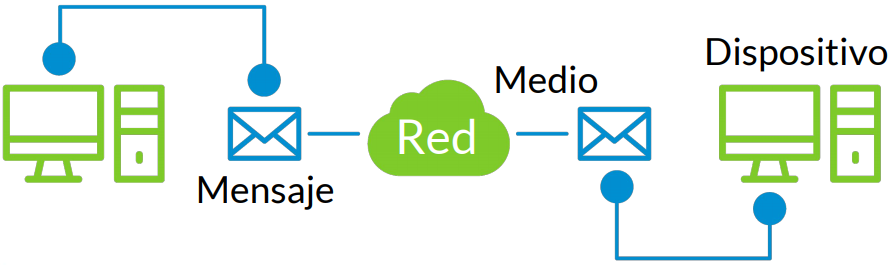

Los protocolos son las reglas que rigen la comunicación. Necesitamos establecer protocolos que nos ayuden a ver que la información pasen por todas las capas que tiene los procesos de comunicación.

**Característica de los protocolos de internet**

- **Codificación del mensaje:** es el proceso de convertir información en otra forma aceptable, para su transmisión. La decodificación invierte este proceso para interpretar la información.
- **Formato y encapsulamiento del mensaje:** los formatos de mensajes dependen del tipo de mensaje y del canal que se utiliza para entregar el mensaje. El proceso de colocar un formato de mensaje (la letra) dentro de otro formato de mensaje (el sobre) se denomina encapsulación. La desencapsulación ocurre cuando el destinatario invierte el proceso y la carta se retira del sobre.
- **Tamaño del mensaje:** cuando las personas se comunican entre sí, los mensajes que envían generalmente se dividen en partes u oraciones más pequeñas. Estas oraciones tienen un tamaño limitado a lo que la persona receptora puede procesar al mismo tiempo, como se muestra en la imagen. También facilita que el receptor lea y comprenda.
- **Sincronización:** imagina a dos personas hablando al mismo tiempo, luego se produce una "colisión de información", y es necesario que las dos retrocedan y comiencen de nuevo. Del mismo modo, cuando un dispositivo quiere transmitir en una LAN inalámbrica, es necesario que la tarjeta de interfaz de red WLAN (NIC) determine si el medio inalámbrico está disponible. Para impedir esa "colisión de información", esta la sincronización.
- **Opciones de entrega**
  - **Unicast / Unidifusión:** una persona quiere comunicar información a un solo individuo
  - **Muticast / Multidifusión:** una persona puede necesitar enviar información a un grupo de personas al mismo tiempo.
  - **Broadcasting / Difusión:** una persona envía información a todas las personas en la misma área.

### Clase 12 *Modelos de referencia; modelo OSI, modelo TCP/IP*

Los modelos de referencia nos ayudan a definir cuáles son los protocolos y los estándares que están en cada una de las capas por las que tiene que viajar un mensaje hasta ser llevado desde su emisor hasta su receptor a través de los medios.

**Modelo TCP/IP**

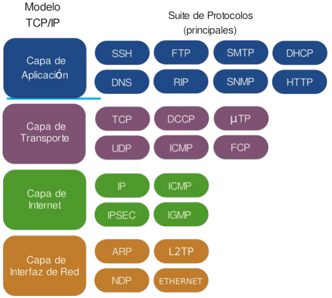

**Modelo OSI**

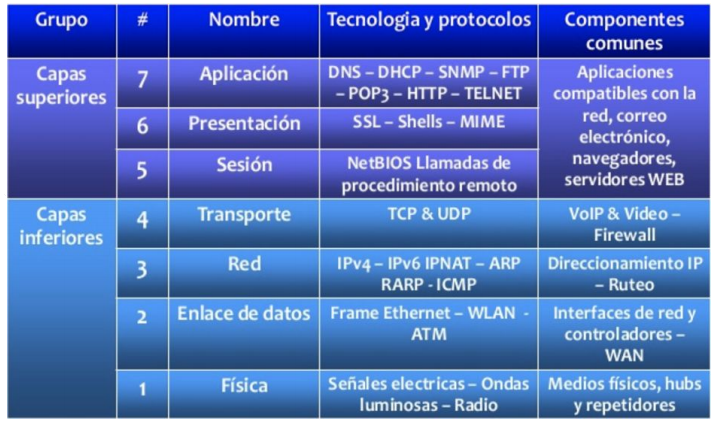

- Física: son los medios por los que se transportan las señales que llevan los mensajes. Son los cables que permiten transmitir los mensajes.
- Enlace de datos: son los equipos que hacen los direccionamientos. Son los dispositivos físicos que codifican y decodifican la información.
- Red: se encarga del direccionamiento lógico. Es la capa que se encarga del direccionamiento de IP.
- Transporte: conexión extremo a extremo y garantiza la fiabilidad de los datos. Son los protocolos que nos aseguran que el mensaje se envía y es recibido.
- Sesión: mantiene abierta la comunicación entre los dispositivos.
- Presentación: se refieren a la representación de los datos, tipos de archivos, etc.
- Aplicación: que acceden a información desde internet.

### Clase 13 *Segmentación de los mensajes y Unidades de Datos de Protocolo PDU*

La segmentación consiste en tomar un mensaje muy grande y dividirlo en pequeñas partes.

Si envío mensajes a través de la red, que están segmentados, y somos los únicos que enviamos esos mensajes porque llegaran todos uno detrás del otro. Pero qué pasa si ese mismo medio lo usar una o varias personas más, van a ver muchos fragmentos de mensajes que se estarán enviado por el medio, para ensamblar nuevamente los mensajes tenemos la multiplexación.

La multiplexación es el proceso que nos permite combinar dos canales por un mismo medio.

Para que ese mensaje que viaja a través de las diferentes capas de red llegue completo y no se pierda ninguna información (porque va segmentación), lo que hacemos es agregar pequeñas capas que nos ayudan a identificarlos (PDU).

**PDU (Protocol Data Unit):** unidad que nos permite identificar la información a medida que es transmitida a través de las capas.

### Clase 14 *Practica: Wireshark para ver el tráfico de red*

En esta clase vamos hacer una práctica en la que vamos a ver cuál es el formato que tiene un paquete cuando está viajando por la red, entonces vamos a poder identificar las diferentes capas del modelo TCP/IP y para esto vamos usar el programa Wireshark.

Wireshark es un capturador de paquetes que es muy usado en todo el entorno relacionado con las redes porque nos permite hacer tareas de análisis de datos y resolución de problemas.

**Práctica**

Ingresamos al sitio web de [Wireshark](https://www.wireshark.org/ "Wireshark") y damos click en Download.

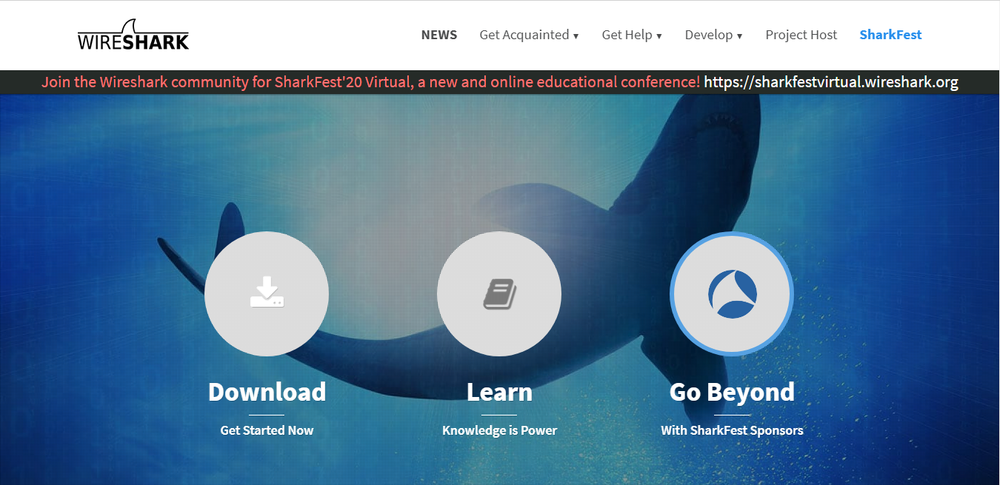

Luego seleccionas el instalador según su sistema operativo.

Wireshark está disponible para todos los sistemas operativos; Linux, Windows y Mac OS.

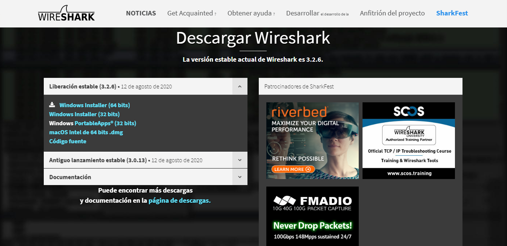

Una vez listo la descarga, abrimos el programa y la instalación es estándar siguiendo los pasos.

Ya instalado, abrimos el programa y lo primero que nos muestra es una pantalla con las diferentes interfaces que tiene el computador para conectarse a internet.

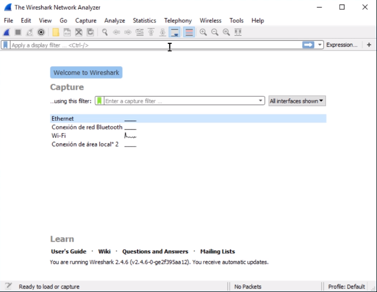

En este caso tenemos interfaz Ethernet, Conexión de red Bluetooth, Wi-Fi y Conexión de área local.

Seleccionaremos la red por la que deseamos capturar. Como el computador esta está conectado únicamente por el Wi-Fi, es esa la red que seleccionamos.

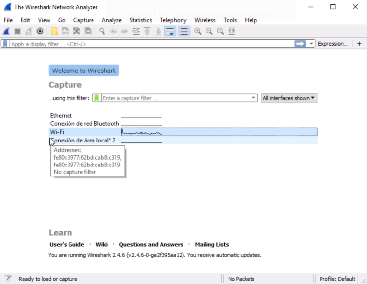

La ventana cambia mostrando las capturas de todo lo que viaja por la red. Vemos que viaja mucha información y lo que el Wireshark hace es mostrar paquete a paquete lo que se envía.

- No. (Orden de datos)
- Time (Tiempo de paquetes)
- Source (IP del dispositivo de origen)
- Destination (IP del dispositivo final)
- Protocol (Protocolo usado)
- Length (Longitud del paquete)
- Info (Información adicional)

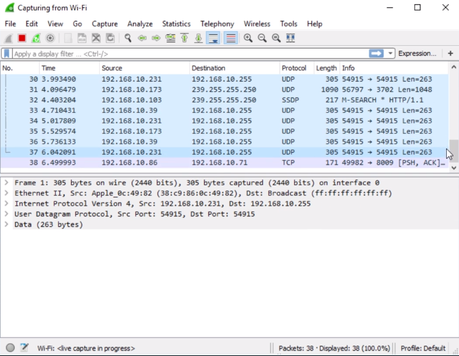

Como en la práctica vamos analizar un paquete que se envía por ping, en la parte superior en 'Apply a display filter' escribimos el filtro que queremos. En este caso ingresamos 'icmp'.

Esto hace que solo nos muestre los paquetes que son enviados únicamente por ese protocolo. También podemos seleccionar cada uno de los paquetes y en la parte inferior nos muestra los PDU de cada una de las capas.

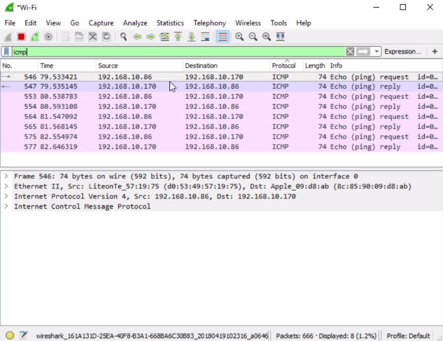

Wireshark captura toda la información que fue enviada por la red en ese paquete.

Por ejemplo, en la trama de Ethernet nos muestra la dirección mac de origen y la dirección mac de destino, el protocolo por el que fue enviado ese paquete y nos muestra las direcciones.

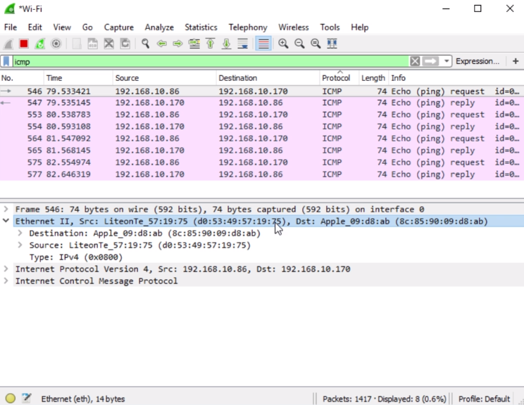

Wireshark además captura el paquete y nos puede mostrar cual fueron los datos que se enviaron.

Si damos doble click sobre el paquete, nos abre otra ventana en la que nos muestra cosa por cosa como está conformada esa trama que se envió.

Existen programas que pueden abrir un paquete, que viajo a través de un medio, toda la información de los datos. Por esos es importante que pasemos por todo un proceso de seguridad, para proteger toda nuestra información que viaja a través de los medios.

## Modulo 5. Capa Física y medios de Red
### Clase 15 *El switch y el AP*

Recordemos que la capa Física y de medios de red es la que se encarga de hacer conexión entre dispositivos usando interfaces y direcciones físicas.

En esta capa contamos con varios dispositivos y vamos a ver cuáles son y sus diferencias.

**El Switch**

Es el dispositivo que nos permite realizar conexiones físicas entre hosts, el switch se encarga de filtrar y direccionar los paquetes a través de la red de área local LAN.

El switch permite la conexión entre dispositivos a través del medio cableado.

Existe otros dispositivo que nos permite hacer la conexión de manera casi igual, es el Hub, incluso pueden verse iguales, pero yo te recomiendo no usar este dispositivo.

Mientras el switch toma los paquetes que llegan y analiza las direcciones físicas de los hosts conectados para reenviar el paquete únicamente a su destinatario el hub envía el mensaje por todos los canales, sin tener en cuenta el direccionamiento.

**El Access Point AP**

Otro dispositivo de la capa física es el Access Point, este dispositivo es el encargado de realizar el enlace entre las redes cableadas y las redes inalámbricas. Nos permite crear redes LAN haciendo uso de las ondas de radio.

### Clase 16 *Capa Física: Elementos, funciones, transferencia de datos, ancho de banda, rendimiento*

Para que haya una comunicación en red, necesariamente debe existir un medio. La capa física es quien se encarga de controlar ese medio por el que es transmitida la información, y el medio del que hablamos puede ser cable o pueden ser ondas de radio.

La capa física recibe las secuencias de 1 y 0, los bits, que llegan de la capa de enlace de datos. Esa trama la analiza, las convierte en ondas eléctricas o en ondas de radio que son enviadas físicamente a través de los medios, para esto contamos con algunos dispositivos.

- **Switch:** es un dispositivo que recibe la señal y físicamente la envía por cable. El switch es un dispositivo de capa 2 que distribuye por cable.
- **Access Point:** es un dispositivo que nos permite enviar la señal por ondas electromagnéticas. Es un dispositivo de capa 2 que nos sirve para hacer redes LAN.
- **Router:** es un dispositivo para áreas más amplias (WAN) que envía señales por ondas.

**Dispositivos y medios**

Un elemento necesario y que todos dispositivos que se conecte o tenga acceso a internet necesita tener es una interfaz de acceso a internet que es una NIC (Network Interface Card), es una tarjeta de red que tiene nuestro computador. Hay NIC que nos permite conectarnos por cables y hay las que nos permite hacer conexión inalámbrica.

El funcionamiento de la NIC es que se conecta a la tarjeta madre de nuestro computador, de nuestro teléfono o de cualquier dispositivo que tenga acceso a internet, y le proporciona los puertos y todas la parte física (circuito y los algoritmos de esos circuitos) que le permita conectarse con los medios.

En general, el proceso que debe pasar un dato desde su origen hasta que llegue a su destino es así:

- Los datos son generados en las capas superiores de aplicación y de sesión.
- Pasan a una capa de transporte en la que es segmentado. Aquí se agregan información como los puertos.
- Luego pasa a la capa de red en donde la información es empaquetada, se agregan unas cabeceras en las que nos van a indicar las direcciones lógicas (IP) desde donde va el mensaje hasta donde va a llegar.
- Finalmente pasa por la capa de enlace de datos en donde es organizado, convertido en frames, que ya contiene direcciones físicas e información que nos ayuda a hacer la gestión de errores, controlar los errores, el tamaño del mensaje y cosas así.
- De la capa de enlace de datos, la trama de bits pasa a la capa física. Esta capa toma los bits y los codifica de forma que define el tipo de señal a ser enviada, construye las señales y los envía a través del medio.
- Al otro lado, en el nodo receptor llega esa señal (impulsos eléctricos, luz u ondas electromagnéticas) y es de nuevo recibida por la capa física. La capa física transforma esas señales en 1 y 0, y vuelve a subir nuevamente hasta ser desencapsulada hasta que el receptor pueda ver cómo fue enviada.

**Funciones de la capa física**

1. Controlar los componentes físicos
2. Codificar / decodificar los datos
3. Señalización

**Medios por las que son enviadas las señales**

- **Cable de cobre:** viaja por impulsos eléctricos. Tenemos que tener cuidado cuando hagamos nuestras instalaciones pues podemos sobrecargar el equipo si lleva electricidad, en general no lo notamos porque no sentimos nada cuando lo tocamos.
- **Cable de fibra óptica:** viaja por impulsos de luz. Emite 1 y 0 en forma de luz, la ventaja de este cable es que tiene una interferencia mínima, casi nula, porque la señal viaja rápido.
- **Inalámbrico:** viaja por ondas electromagnéticas.

**Organizaciones que regulan los estándares de la capa física**

- **La Organización Internacional para la Estandarización (ISO):** define estándares en todo tipo de temas, sobre todo en el tema de redes. Definió el modelo OSI.
- **El Instituto de Ingenieros Eléctricos y Electrónicos (IEEE):** define algunos estándares y protocolos para la comunicación de las interfaces físicas.
- **El Instituto Nacional Estadounidense de Estándares (ANSI):** es una organización sin fines de lucro que supervisa el desarrollo de estándares para productos, servicios, procesos y sistemas en los Estados Unidos.
- **La Unión Internacional de Telecomunicaciones (ITU):** el organismo especializado en telecomunicaciones de la Organización de las Naciones Unidas (ONU), encargado de regular las telecomunicaciones a nivel internacional entre las distintas administraciones y empresas operadoras.
- **La Asociación de Industrias Electrónicas/Asociación de la Industria de las Telecomunicaciones (EIA/TIA):** regula el tema del cableado.
- Autoridades de las telecomunicaciones nacionales, como la Comisión Federal de Comunicaciones (FCC) en EE.UU.

**Medidas de rendimiento de los medios**
- **Ancho de banda:** capacidad máxima que tiene un medio para transportar datos.
- **Rendimiento:** es la taza de datos que fueron transmitidos. Varía mucho o depende mucho por el medio que transporta las señales.
- **Capacidad de transferencia útil:** capacidad de datos útiles que pueden ser enviados por la red

### Clase 17 *El cable de par trenzado*

En la clase anterior viste algunos de los elementos de la capa física y en esta lectura profundizaremos aún más en uno que es fundamental: el cable de par trenzado.

Este es el medio por el cual se transmite información entre dos dispositivos físicos de una red. Fue inventado en 1881 por Alexander Graham Bell y contiene dos conductores eléctricos que están fabricados normalmente de cobre.

Está diseñado para evitar la interferencia externa de señales y la diafonía de otros cables a su alrededor. Al ser un dispositivo físico este se ve limitado en sus propiedades de transmisión por la distancia. El rango en el cual se ve afectada la transmisión de información es de 100 metros. 

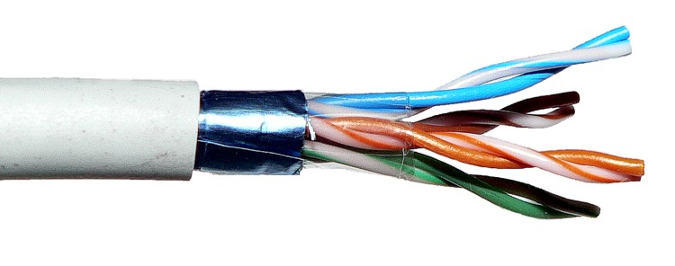

**Categorías del cable de par trenzado**

Existen diferentes categorías de cables de par trenzado. Estas categorías están divididas principalmente en las velocidades de transferencia que pueden realizar, su ancho de banda y el blindaje que posee alrededor el cable para asegurar una mejor comunicación. Puedes ver más información en la siguiente tabla:

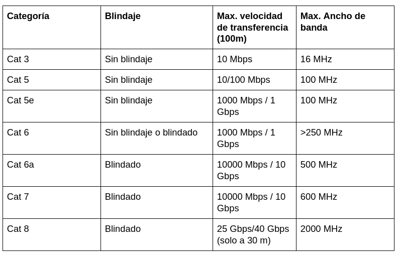

Las categorías que se usan normalmente para crear cables de red ethernet son de la categoría 5 a la categoría 6 por su costo y manipulación. Los cables de categorías superiores se usan en otro tipo de infraestructuras, además de que su costo es mucho más elevado.

Para conectar dos dispositivos físicos en la red es necesario que al final de estos cables se inserte un conector RJ-45. Este conector cubrirá los 4 pares trenzados de cables asignando un pin a cada filamento, en total 8 pines numerados de la siguiente forma:

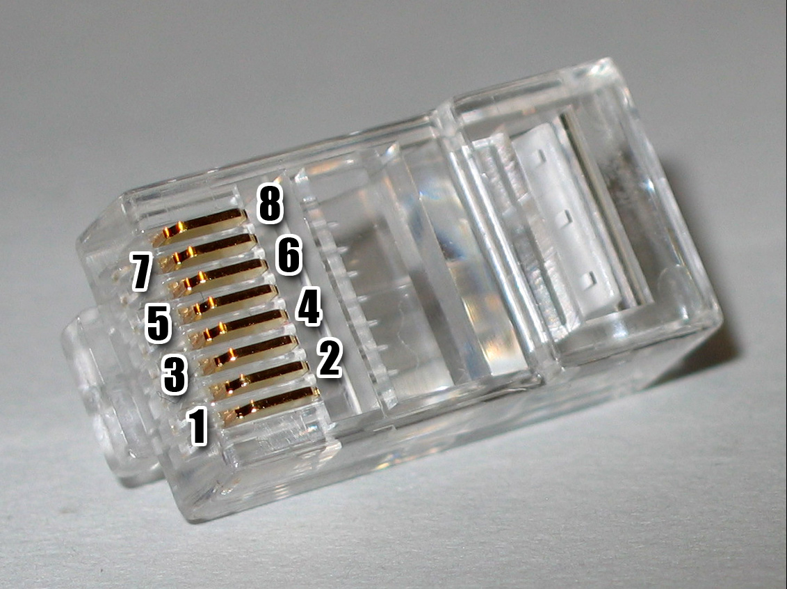

**Crear la conexión de pines en un conector RJ-45**

Existen diferentes estándares que se pueden seguir para configurar el orden de los cables dentro de un conector RJ-45, los más comunes son el estándar T568A y T568B, el estándar más común de usar es el T568A. La única diferencia entre estos dos estándares es la posición de los cables verdes y naranjas cómo se ve a continuación:

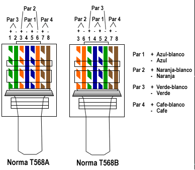

Una vez tienes configurados los pines dentro de tu conector, lo siguiente es sellar los cables con los pines a través de una herramienta especial llamada pinza ponchadora.

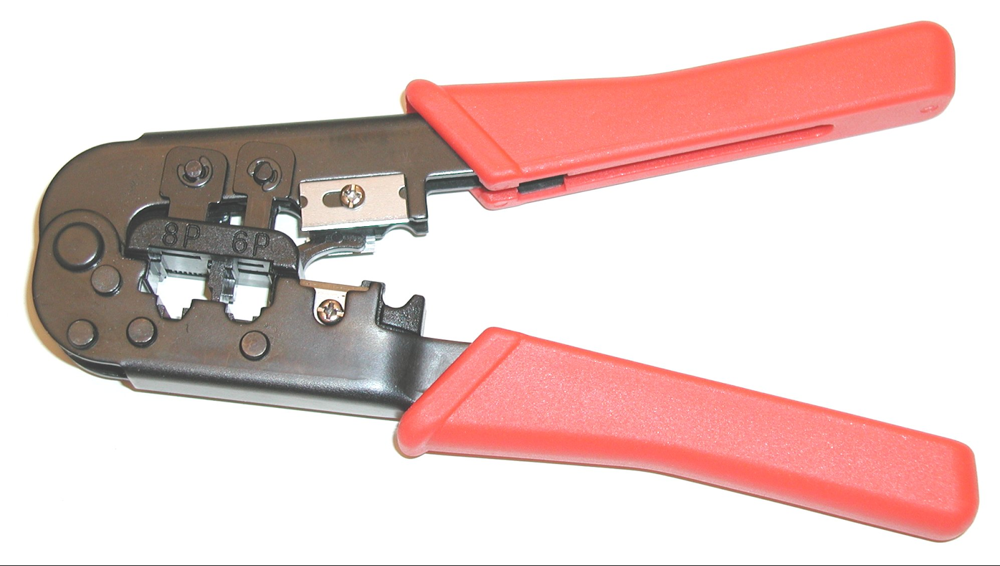

Pero esto no es todo para que nuestro cable de red funcione, para ello debemos saber si los dispositivos son del mismo tipo, por ejemplo de un PC a otro PC. Si estos son diferentes (de un PC a un router) se usa una configuración diferente en cada extremo. Dependiendo del caso usaremos un cable directo o un cable cruzado.

**Cable directo**

Este cable se utiliza cuando queremos conectar un dispositivo de la red a un dispositivo de enrutamiento, como puede ser el caso de nuestra computadora al router de nuestra casa. Como puedes notar ambos dispositivos son diferentes.

La configuración de pines debe ser la misma en ambos extremos del cable, por lo que su dirección no cambia, ya sea que uses el estándar T568A o el T568B. En la siguiente imagen puedes ver un ejemplo más claro:

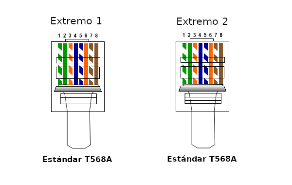

**Cable cruzado**

Este cable se utiliza cuando queremos conectar dos dispositivos similares, como dos computadoras, dos routers o dos hubs. Se llama cruzado pues la dirección cambia de un extremo a otro.

La configuración de pines debe ser diferente en ambos extremos del cable y es aquí donde vemos la utilidad de que existan dos estándares diferentes. En un extremo usaremos el estándar T568A y en el otro el T568B. En la siguiente imagen puedes ver un ejemplo más claro:

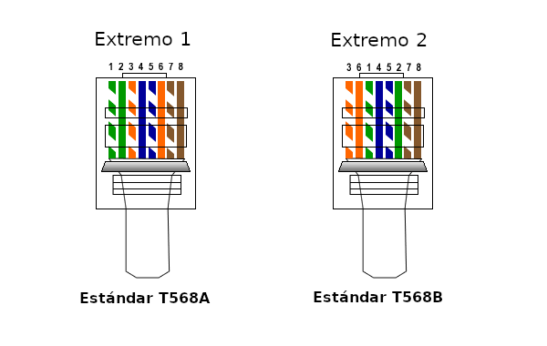

Con esto ya eres capaz de hacer un cable de red conociendo sus limitaciones y capacidades. Elige el cable que más le convenga al diseño de tu red y en la siguiente clase veremos cómo construirlo de manera física.

### Clase 18 *Práctica: Ponchado de cables de red*
### Clase 19 *Capa de enlace de datos: Elementos, funciones*

La capa de enlace de datos, en el modelo TCP/IP está formado por una sola casa, pero el modelo OSI son dos. Esto tiene sentido, porque esta capa es la que se encarga de hacer la comunicación entre la capa física y la capa de red. Entonces, la capa de enlace de datos es la capa que se encarga de comunicar la parte física con la parte lógica.

Para que esto pueda funcionar contamos con dos capas intermedias (subcapas).

- **MAC:** es la capa de acceso al medio físico. Esto es una dirección que identifica únicamente a cada una de las tarjetas de red que tienen nuestros dispositivos.
- **LLC:** es la capa de comunicación con la capa de red. Esta capa es la que nos permite pasar los datos de forma lógica, transformar la información de forma que la capa de red pueda recibirla y pueda seguir escalando en las siguientes capas del modelo.

**Funciones de la capa de enlace de datos**

- **Gestión del canal:** la capa va a contar con protocolos que le permiten a la señal decir si va en un solo, es dúplex (dos canales) o full dúplex.
- **Segmentación de la trama:** verifica que la trama del mensaje no sea muy larga o muy corta.
- **Control de errores:** proporciona detección y corrección de errores en el envío de tramas, y provee el control de la capa física
- **Control de flujo:** es necesario para no saturar al receptor de uno a más emisores.
- **Recuperación de fallos:** procedimiento para detectar situaciones y recuperar al nivel de situaciones anómalas como la ausencia de respuesta, recepción de tramas inválidas, etc. Las situaciones más típicas son la pérdida de tramas, aparición de tramas duplicadas y llegada de tramas fuera de secuencia.

### Clase 20 *Trama de enlace de datos y direcciones mac*

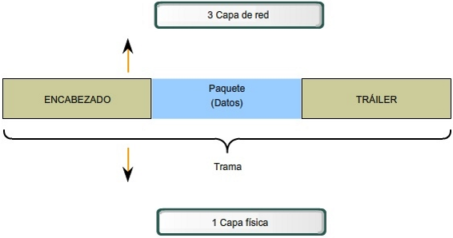

Entonces, la capa de enlace de datos es la que conecta la parte física con la parte lógica, para esto vamos a trabajar con el protocolo ethernet cuya función es conectar las dos capas.

El PDU de la capa de enlace de datos se llama trama o frame, y está conformada por tres partes principales.

- **Encabezado:** contiene información de control, como direccionamiento, y está ubicado al comienzo de la PDU.
- **Datos:** el paquete desde la capa de red.
- **Tráiler:** contiene información de control agregada al final de la PDU

**Dirección MAC**

Es una dirección única que tiene la tarjeta de red. Cada dispositivo tiene una única dirección porque se asigna cuando se manufactura esa tarjeta de red. Todos los dispositivos tienen dirección MAC, incluso existen dispositivos con más de una dirección MAC, porque tienen más de una tarjeta de acceso a internet.

La dirección MAC está compuesta por 6 bytes (48 bits) y están escritas en notación hexadecimal (12 dígitos). Hay diferentes formatos en los que se pueden mostrar, el uso de separadores como guiones o dos puntos entre dos bytes facilita la lectura.

Contiene los siguientes componentes:

- Destino (las direcciones MAC del ordenador de destino)
- Dirección de origen (la dirección MAC del remitente)
- Información de control para el control de flujo de datos
- Datos de usuario (el paquete de datos que se va a transmitir más tarde en la capa correspondiente)
- Sumas de control que garantizan la integridad de los datos

Sintaxis de la dirección MAC

- Bit 1: destinatario.
- Bit 2: oficina de emisión.
- Bits 3 - 24: identificación del fabricante.
- Bits 25 - 48: identificación del adaptador de red.

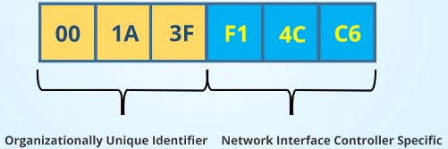

### Clase 21 *Procesamiento de tramas*

Ya sabemos que cada dispositivo conectado a la red, ya sea un celular o un computador o sean equipos de red (switch, router, etc.), tienen una dirección MAC vinculada a la tarjeta de internet y que es única. Entonces, vamos a ver como viaja una trama desde un dispositivo de origen hasta su llegada en el dispositivo de destino.

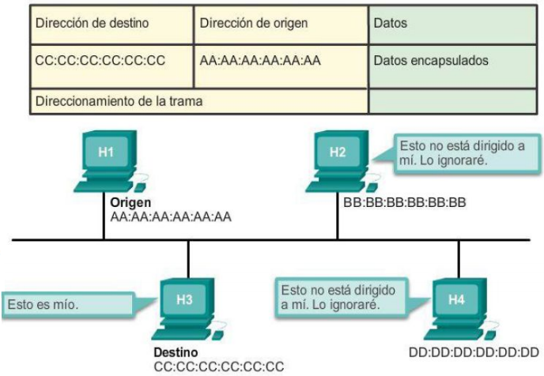

Lo primero que pasa, cuando uno prende el dispositivo, es que la dirección MAC se copia a la memoria RAM. Y luego, supongamos que deseamos enviar un mensaje del dispositivo origen (H1) al dispositivo destino (H3), lo que pasa es que asignamos una dirección de origen en la trama y le asignamos hacia donde deseamos ir. Entonces, se va a enviar el mensaje a través de los medios y se va ir, empezando a llegar y preguntar a todos los dispositivos conectados a la red hasta encontrar su destino.

La NIC del H3 detecta que esta es su dirección MAC, la que tiene almacenada en la RAM, la compara, verifica que tienen la misma dirección y recibe el mensaje, pasando por todo el proceso de des encapsulamiento.

El envío de estos datos a través de los medios, usando las direcciones MAC, y haciendo la combinación de las direcciones físicas con las direcciones lógicas (usa el protocolo ARP) se puede hacer de diferentes maneras.

- **Unicast:** significa que solo se le envía a un host.
- **Multicast:** hacemos envío a todo un grupo.
- **Broadcast:** envíos que se realiza a todos los que estén conectados a la red.

### Clase 22 *Protocolo de resolución de direcciones ARP*

Ya vimos que con una combinación entre dirección MAC y dirección IP tenemos diferentes formas de enviar paquetes por nuestra red, para esto contamos con el Protocolo de Resolución de Direcciones o ARP, este protocolo básicamente tiene dos funciones; la primera es que resuelve las direcciones MAC y direcciones IP, la segunda es mantener actualizada la tabla de cachet ARP.

¿Cómo mantiene actualizada la tabla ARP?

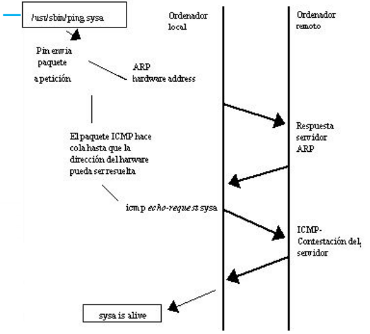

Básicamente lo que hace es hacer una solicitud de envía un paquete a todos los dispositivos conectados a la red, va 'preguntando' a cada host si tiene guardado su dirección  física, en caso de no hacer el host manda un paquete con la dirección física para ser guardada.

## Modulo 6. Capa de Red
### Clase 23 *Capa de Red*

Hasta aquí hemos visto como los datos viajan a través de los medios y como pasan por una capa de enlace que se encarga determinar las relaciones entre las direcciones lógicas y físicas de nuestros dispositivos. Ahora empecemos hablar de las direcciones lógicas, la capa de red.

La capa de red es la que se encarga de enrutar los datos a través de diferentes redes.

Los que vamos a ver en este módulo es un análisis de cuál es el proceso por el cual tiene que pasar un paquete para ser enviado desde un emisor hasta un receptor, que información es la que se agrega en el PDU de la capa de red, vamos hablar de un protocolo que permite esta comunicación (protocolo IP) y, finalmente ya entiendo cómo funciona este protocolo IP y como se construyen las IP, vamos a ver como se hace la segmentación de redes en subredes. También vamos hablar de un equipo muy importante para que todo este proceso de transmisión de datos entre diferentes redes se lleve a cabo, el router.

El router es el equipo de la capa de red que toma las señales y hace todo el procesamiento; desencapsula la trama, la abre, revisa las direcciones de destino y origen, y la vuelve a enrutar. Vuelve a encapsular la trama y la envía hacia el siguiente punto.

**Funciones de la capa de red?**

- Hacer el direccionamiento de los paquetes: se refiere a asignar las direcciones lógicas del paquete. Lo primero que pasa cuando un segmento de la capa de transporte llega a la capa de red es que se le asigna la dirección IP de origen y la dirección IP de destino.
- Encapsulamiento de los paquetes: pasa durante el proceso de que el router recibe una trama, la abre para saber sus direcciones lógicas y luego determina el siguiente salto, ya hecho ese enrutamiento lo vuelve a encapsular y envía la trama.
- Enrutamiento: función de buscar un camino entre todos los posibles en una red de paquetes cuyas topologías poseen una gran conectividad.
- Desencapsulamiento de los paquetes

**PDU de la capa de red**

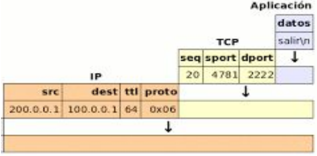

Tenemos datos generados desde la capa de aplicaciones, pasaron por la capa de transporte en la que se definió como iba a ser enviado ese paquete y llega a la capa de red donde se le asignan tres campos importantes:

1. Dirección de origen - ¿Quién envía este mensaje?
2. Dirección de destino - ¿Hacia dónde quieres enviar?
3. TTL

***ACLARACIÓN: Cada uno de los PDU tienen muchos más campos. Campos que nos ayudan a verificar la trama de los errores, identifica el medio por el que envía la señal, etc.***

**¿Qué es el TTL?**

TTL o Time To Live es un campo que nos indica la cantidad de saltos por los que debe pasar un mensaje hasta que nos diga que no llego a ningún lado. Generalmente está definido por un numero de 64, pero uno puede definir la cantidad de saltos que va a dar ese mensaje.

Por ejemplo, enviamos un mensaje que llega al router y desde ahí va dando saltos, pasando de dispositivo en dispositivo hasta que llegue a su destino, si este mensaje salto más que el número de TTL significa que no va a llegar y para evitar que los mensajes se queden dando vueltas en la red infinita. Cada salto reduce el número de Time To Live y cuando llegue a cero, el mensaje es descartado por el siguiente equipo.

### Clase 24 *Procesamiento de tramas*

El procesamiento de tramas trata sobre como un mensaje es enviado entre diferentes dispositivos.

La trama es el último PDU que es enviado por los medios. Es el PDU de la capa de enlace de datos, la cual se encarga de hacer la conexión de la parte lógica con la parte física. Entonces, la trama es un PDU que depende del medio. Este PDU va a cambiar, agregando o quitando datos, de acuerdo al  medio por el que va a ser enviado.

La trama llega con toda la información de la capa de aplicación, pasa por la capa de transporte donde se identifica como será enviado y luego, en la capa de red, se asignan las direcciones IP. De ahí, pasa por un proceso en el que la capa de enlace de datos identifica por cual medio lo envía y a partir de eso asigna direcciones MAC e información relacionada con ese medio, de ahí sale y se convierte en bits o el tipo de señal que vaya a ser enviado, el receptor hace el proceso inverso de transformar de nuevo las señales hasta que se vuelva a tener nuevamente los datos en el formato que la aplicación lo necesite.

Para que esa trama viaje de una red a otra debe pasar por diferentes router en el mundo, para que salga de nuestra red local o nuestra red metropolitana, va a tener que saltar por diferentes router en el mundo, por eso es importante definir el campo TTL en el PDU de la capa de red, para que el mensaje no se quede dando vueltas en la red eternamente.

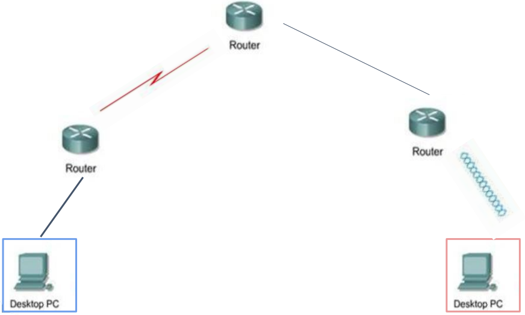

La trama va cambiando a medida que viaja y pasa por diferentes dispositivos, por diferentes medios, pero el paquete se mantiene igual, no cambia. Lo que hace es que, una vez el router identifica que el dispositivo está en la red local, envía a través de la capa de enlace de datos al dispositivo indicado.

Para que haya comunicación de capa 2 hay dos datos que son muy necesarios; IP y máscara de red. Y para que haya comunicación en capa 3 debemos contar con tres datos; la dirección IP, la máscara de red y el Gateway.

**Default Gateway o Puerta de Enlace Predeterminada**

Es la ruta predeterminada o ruta por defecto que se le asigna a un equipo y tiene como función enviar cualquier paquete del que no conozca por cuál interfaz enviarlo y no esté definido en las rutas del equipo.

El comando usado para trazar la ruta es traceroute o tracert, y se usa de la siguiente forma: ***tracert dominio o IP (tracert www.google.com)***

El comando Tracert se ejecuta en la consola de símbolo de sistema en los sistemas operativos Windows. Gracias a este comando, podremos seguir la pista a los paquetes que vienen desde un host. Cuando ejecutamos el comando «Tracert» obtenemos una estadística de la latencia de red de esos paquetes, lo que es una estimación de la distancia (en saltos) a la que están los extremos de la comunicación.

Aunque Windows lo denomina «tracert», en sistemas operativos basados en UNIX, el nombre de esta herramienta que viene por defecto se denomina «traceroute». La herramienta traceroute es exactamente la misma que el tracert, pero se denomina de otra forma, aunque internamente puede hacer uso de diferentes protocolos, ya que en algunos sistemas operativos se hace uso del protocolo ICMP Echo Request/reply, y en otros de hace uso de mensajes UDP directamente para comprobar cuántos saltos hay de un equipo a otro.

**Tabla de enrutamiento**

Una tabla de enrutamiento, también conocida como tabla de encaminamiento, es un documento electrónico que almacena las rutas a los diferentes nodos en una red informática. Los nodos pueden ser cualquier tipo de dispositivo electrónico conectado a la red. La tabla de enrutamiento generalmente se almacena en un router o en una red en forma de una base de datos o archivo. Cuando los datos deben ser enviados desde un nodo a otro de la red, se hace referencia a la tabla de enrutamiento con el fin de encontrar la mejor ruta para la transferencia de datos.

La tabla de enrutamiento de un router almacena información sobre lo siguiente:

- Rutas conectadas directamente: estas rutas provienen de las interfaces del router activas. Los routers agregan una ruta conectada directamente cuando se configura una interfaz con una dirección IP y se activa. Cada una de las interfaces del router se conecta a un segmento de red diferente. En la tabla de enrutamiento, los routers mantienen información acerca de los segmentos de red a los que están conectados.
- Rutas remotas: estas rutas provienen de las redes remotas conectadas a otros routers. El administrador de red puede configurar las rutas a estas redes de forma manual en el router local, o estas se pueden configurar de forma dinámica habilitando al router local para que intercambie información de enrutamiento con otros routers mediante protocolos de enrutamiento dinámico.

Componentes de una tabla de enrutamiento

- Red de destino: esto corresponde a la red de destino donde deberá ir el paquete de datos.
- Máscara de subred: es la que se utiliza para definir la máscara de subred de la red a la que debemos ir.
- Siguiente salto: es la dirección de IP de la interfaz de red por donde viajará el paquete de datos, para seguir con su camino hasta el final.
- Interfaz de salida: es la interfaz de red por donde deben salir los paquetes, para posteriormente llegar finalmente al destino.
- Métricas: tienen varias aplicaciones. Una de ellas consiste en indicar el número mínimo de saltos hasta la red de destino, o simplemente el «coste» para llegar hasta la red de destino, y sirve para dar prioridad.

### Clase 25 *Protocolo IP Asignación de direcciones IP, máscara de bits*

Ahora que ya sabemos cómo son enviados los mensajes a través de diferentes medios y a través de diferentes dispositivos que nos permiten conectarnos entre diferentes redes vamos hablar del protocolo IP.

El protocolo IP es el protocolo que básicamente nos permite hacer el direccionamiento y enrutamiento de los mensajes a través de la red. El protocolo IP, a través de diferentes algoritmos, se encarga de trazar la ruta más eficiente para que los mensajes lleguen de un destino a otro.

- Enrutamiento: consiste en encontrar un camino que conecte una red con otra.
- Direccionamiento: se refiere a la forma en que se asignan las direcciones IP a los diferentes dispositivos.

**Dirección IP**

Es un conjunto de números que identifica, de manera lógica y jerárquica, a una interfaz en la red de un dispositivo que utilice el protocolo que corresponde al nivel de red del modelo TCP/IP. La dirección IP no debe confundirse con la dirección MAC, que es un identificador de 48 bits expresado en código hexadecimal, para identificar de forma única la tarjeta de red y no depende del protocolo de conexión utilizado en la red.

La dirección IP puede cambiar a menudo debido a cambios en la red, o porque el dispositivo encargado dentro de la red de asignar las direcciones IP, decida asignar otra IP (por ejemplo, con el protocolo DHCP). A esta forma de asignación de dirección IP se le denomina también dirección IP dinámica (normalmente abreviado como IP dinámica). ​Los sitios de Internet que por su naturaleza necesitan estar permanentemente conectados, generalmente tienen la necesidad de una dirección IP fija (comúnmente, IP fija o IP estática). Esta no cambia con el tiempo. Los servidores de correo, DNS, FTP públicos y servidores de páginas web necesariamente deben contar con una dirección IP fija o estática, ya que de esta forma se permite su localización en la red.

Los dispositivos se conectan entre sí mediante sus respectivas direcciones IP. Sin embargo, para las personas es más fácil recordar un nombre de dominio que los números de la dirección IP. Los servidores de nombres de dominio DNS, "traducen" el nombre de dominio en una dirección IP. Si la dirección IP dinámica cambia, es suficiente actualizar la información en el servidor DNS. El resto de las personas seguirán accediendo al dispositivo por el nombre de dominio.

Hasta ahora, la mayor cantidad de direcciones IP que se encuentra asignadas están bajo el protocolo IPv4, que se expresan mediante un número binario de 32 bits permitiendo un espacio de direcciones de hasta 4.294.967.296 (2^32) direcciones posibles. Las direcciones IP se pueden expresar como números de notación decimal: se dividen los 32 bits de la dirección en cuatro octetos.

Las direcciones pueden ser separadas en diferentes clases y esta separación nos permite identificar más fácilmente cual es la máscara de subred.

- Clase A

  - El primer octeto identifica la red.
  - Tres últimos octetos (24 bits) pueden ser asignados a los hosts.
  - Cantidad máxima de hosts es 2^24 - 2
  - 16.777.214 hosts

- Clase B

	- Dos primeros octetos para identificar la red.
  - Dos octetos finales (16 bits) para que sean asignados a los hosts.
  - Cantidad máxima de hosts por cada red es 2^16 - 2.
  - 65.534 hosts.

- Clase C

  - Tres primeros octetos para identificar la red.
  - Octeto final (8 bits) para que sea asignado a los hosts.
  - Cantidad máxima de hosts por cada red es 2^8 - 2.
  - 254 hosts.

**Máscara de subred**

Es una combinación de bits que sirve para delimitar el ámbito de una red de ordenadores.​ Su función es indicar a los dispositivos qué parte de la dirección IP es el número de la red, incluyendo la subred, y qué parte es la correspondiente al host.

**Direcciones de uso especial**

El Grupo de Trabajo de Ingeniería de Internet (IETF) y la Autoridad de Números Asignados de Internet (IANA) han restringido el uso general de varias direcciones IP reservadas para fines especiales. En particular, estas direcciones se utilizan para el tráfico de multidifusión y para proporcionar espacio de direccionamiento para usos no restringidos en redes privadas.

- Direcciones privadas: las direcciones de paquetes en estos rangos no son enrutables en la Internet pública; son ignorados por todos los enrutadores públicos. Por lo tanto, los hosts privados no pueden comunicarse directamente con las redes públicas y requieren la traducción de direcciones de red en una puerta de enlace de enrutamiento para este propósito.

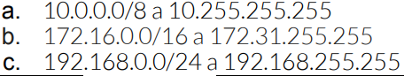

- Direcciones de loopback: es una dirección especial que los hosts utilizan para dirigir el tráfico hacia ellos mismos. La dirección de loopback crea un método de acceso directo para las aplicaciones y servicios TCP/IP que se ejecutan en el mismo dispositivo para comunicarse entre sí.

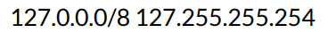

- Direcciones de Link Local: es una dirección IP creada únicamente para comunicaciones dentro de una subred local. Los routers no enrutan paquetes con direcciones de enlace local.

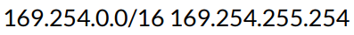

- Test: son direcciones que se reservan para fines de enseñanza y aprendizaje, y se utilizan en ejemplos de documentos y de redes.

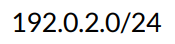

### Clase 26 *Práctica conversión de binario a decimal, decimal a binario*

Una de las actividades que vamos a estar realizando con mucha frecuencia cuando estemos trabajando en subnetting es convertir de números decimales a números binarios.

Para la conversión debemos recordar que cada bit tiene ocho posiciones y cada posición nos da la posibilidad de tener 0 o 1.

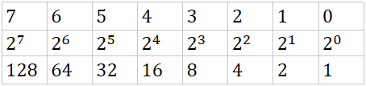

**Conversión de binario a decimal**

Lo que haremos es tomar el número binario ( ejemplo, 11000000) y poner cada número bajo nuestra escala. Se multiplican el número de la escala con el número binario y al final se suma.

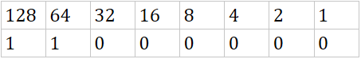

Vamos número por número:

128 x 1 = 128
64 x 1 = 64
32 x 0 = 0
16 x 0 = 0
8 x 0 = 0
4 x 0 = 0
2 x 0 = 0
1 x 0 = 0

Los números obtenidos sumamos:

128 + 64 + 0 = 192

El equivalente del número binario 11000000 en decimal es 192

**Conversión de decimal a binario**

La conversión es similar, tomamos el número (ejemplo, 27), buscamos el número más aproximado en la escala y ponemos un 1, restamos el número de la escala con el número que tenemos y repetimos los pasos hasta que el número sea 0.

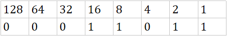

Buscamos en la escala y el número más aproximado a 27, sin que sea mayor, es 16:

27 - 16 = 11

Repetimos hasta que no tengamos más por usar.

11 - 8 = 3
3 - 2 = 1
1 - 1 = 0

Los números sobrantes las completamos con cero. Esto nos muestra que el equivalente del número decimal 27 en binario es 00011011

### Clase 27 *IPs Públicas y Privadas*

En las redes de área local se asignan direcciones a los dispositivos que permiten la conexión entre ellos. Las direcciones privadas son aquellas que no se pueden enrutar a través de Internet.

Las direcciones IP públicas son aquellas que permiten la conexión a Internet.
Todos los dispositivos que están atrás de un mismo router tienen diferentes direcciones IP privadas únicas en ese segmento de red y una dirección pública que permite la conexión entre diferentes redes alrededor del mundo, esta dirección ip pública es la dirección del router.

El segmento de direcciones privadas se encuentra entre **10.0.0.0/8** a **10.255.255.255** que usualmente se asigna para redes con conexión inalámbrica ya que el rango es muy amplio y **192.168.0.0/16** a **192.168.255.255** que usualmente se asigna para redes conectadas por medio cableado, es importante resaltar que esto no implica ningún tipo de obligación o reserva de rangos, tú puedes asignar direcciones IP basándote en tus reglas de negocio.
