# Introducción a la Terminal y Línea de Comandos
## Modulo 1. Comprender las ventajas del uso de la terminal
### Clase 1 *Introducción al curso: ¿Qué es y cómo funciona la terminal?*
Que aprenderás:
- Que es la terminal
- Porque usar la terminal
- Como usar la terminal
- Como aprovechar la terminal al máximo

La termina es un programa que recibe instrucciones de una forma medianamente cómoda, las traduce a un lenguaje que el computador comprende, las ejecuta y muestra los resultados. Utiliza un entorno 100% texto, por tanto, es muy eficiente y rápida, y a través de ella se puede automatizar tareas repetitivas.

Se compone de:
- **Prompt:** es un conjunto de caracteres al principio de cada línea y muestra información propia del sistema en que se esté utilizando.
- **Cursor:** es un 'underscore' que titila en la pantalla del terminal, y en conjunto con el prompt, indica que están a la espera de recibir órdenes.

En la terminal se ingresan instrucciones, también conocidas como 'comandos', los cuales están compuestos por:
- Nombre del programa
- Parámetros
- Modificadores

La terminal también cuenta con otras utilidades como:
- Comodines
- Combinación de teclas
- Sustitución de comandos

***Diferencia entre:
Parámetro: información adicional para la ejecución del programa.
Modificadores: alteración de lo que el programa va hacer.***

Algunos comandos son:
- date: muestra la fecha
- echo: permite imprimir en la terminal
- man <nombre de comando>: muestra información sobre los comandos
- history: historial de los comandos que hemos realizado en algún momento
- ! + número obtenido del history: ejecuta el comando con el número
### Clase 2 *Windows Subsystem for Linux (WSL): Cómo acceder a la terminal en Windows*
Para acceder a la terminal de Linux desde Windows es necesario que tengas instalado el Windows Subsystem for Linux.

Una vez instalado podrás colocar allí cualquier distribución de Linux que desees (si no conoces ninguna te recomiendo comenzar con Ubuntu).

Para continuar necesitarás tener acceso como administrador a tu computadora, asumiré que lo tienes para mostrarte el proceso de instalación.

Comencemos abriendo una terminal Window PowerShell (como administrador):

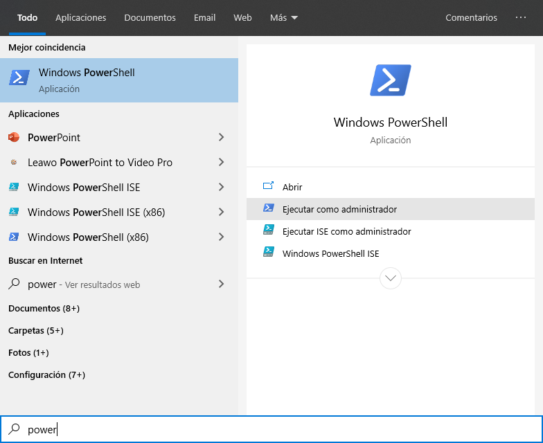

Una vez allí escribe el siguiente comando: *Enable-WindowsOptionalFeature -Online -FeatureName Microsoft-Windows-Subsystem-Linux.*

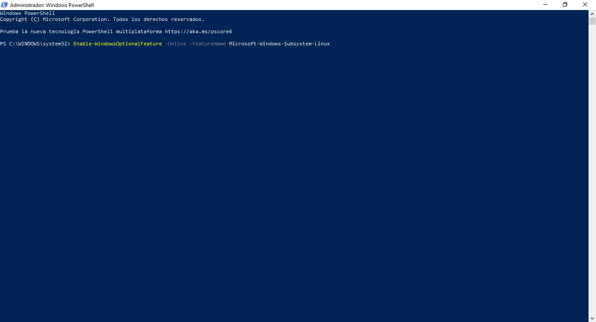

Deberías ver algo como:

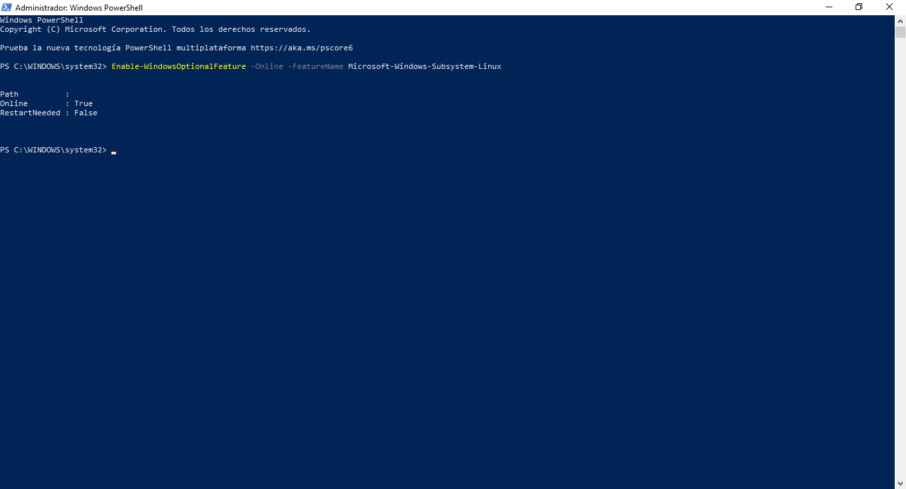

Alternativamente (dependiendo de tu versión de Windows) puedes encontrar un modo más simple:

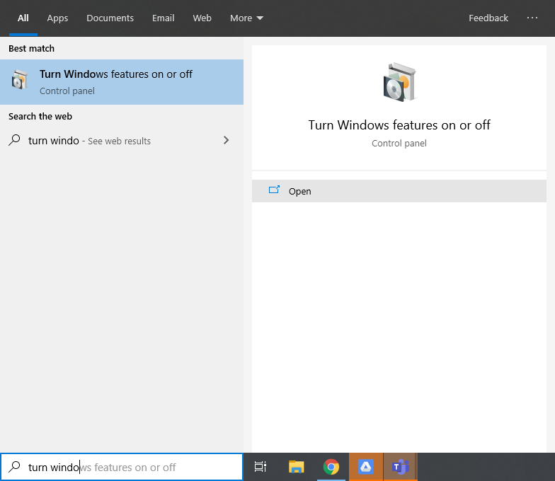

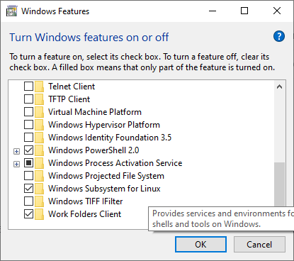

Cuando te sea requerido, reinicia tu computadora.

Al reiniciar estará todo listo para instalar tu distribución favorita.

Ingresa a la tienda de Windows:

Busca Linux:

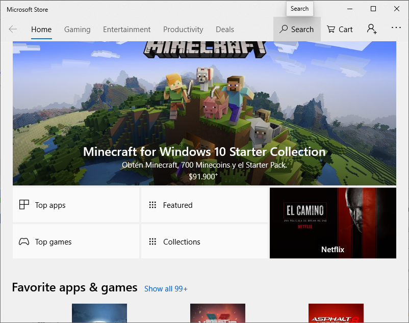

Selecciona tu distribución favorita:

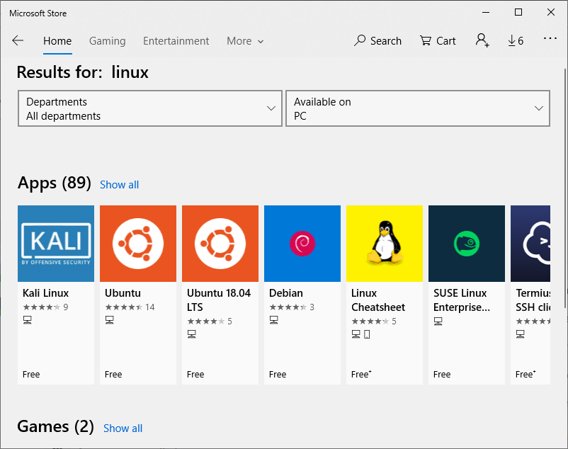

Da click en Obtener:

Selecciona instalar y, cuando haya terminado, “Lanzar”

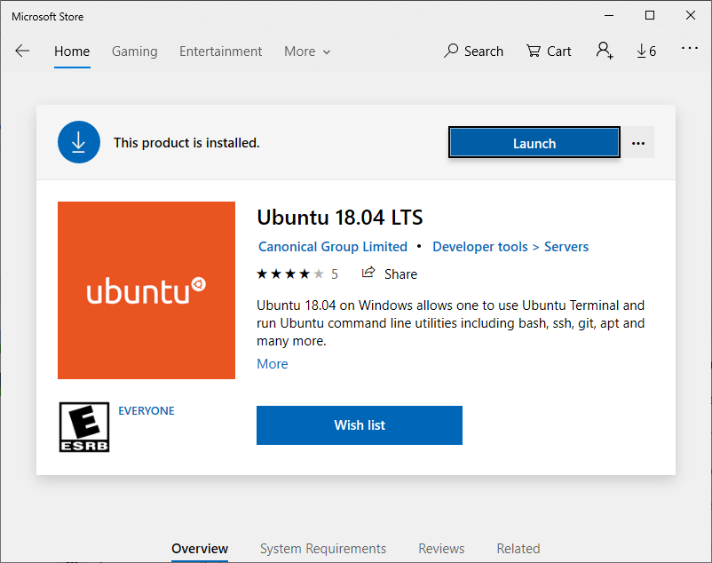

Allí comenzará el proceso de instalación/configuración (¡pero ya dentro de Linux!):

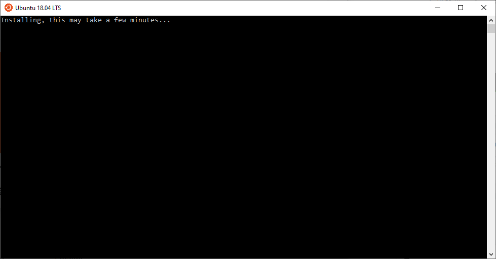

Ingresa tu nombre de usuario (el de Linux, que puede ser completamente diferente al de Windows):

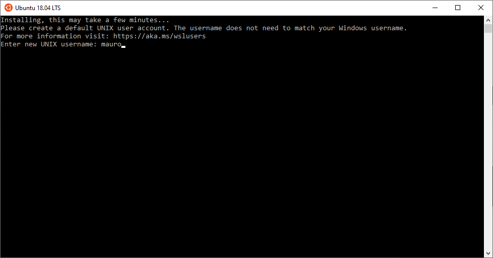

Y crea tu contraseña:

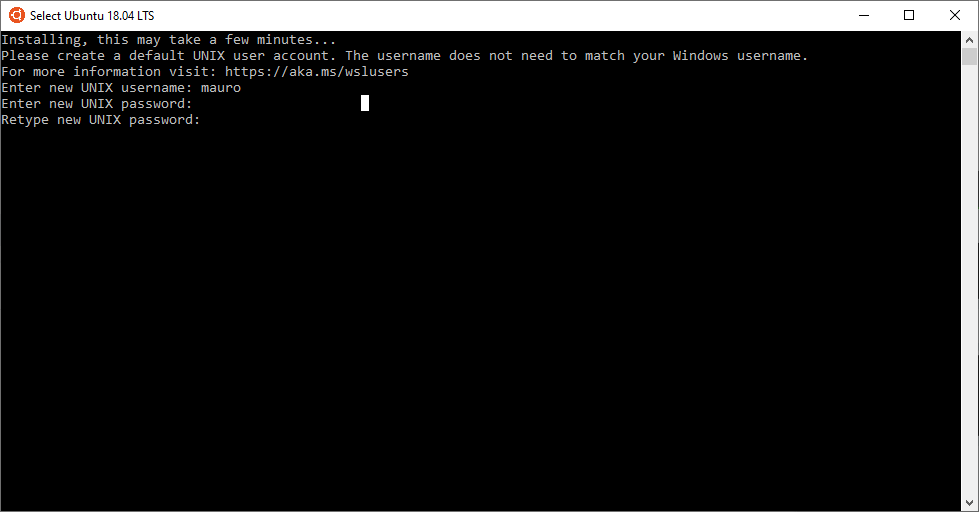

¡Y listo! Ya tienes una consola de Linux dentro de tu Windows!

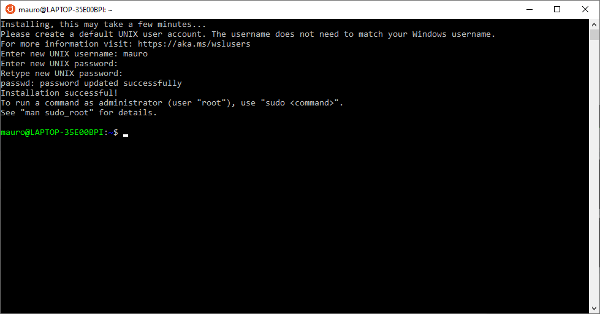

Para acceder nuevamente o crear una ventana paralela:

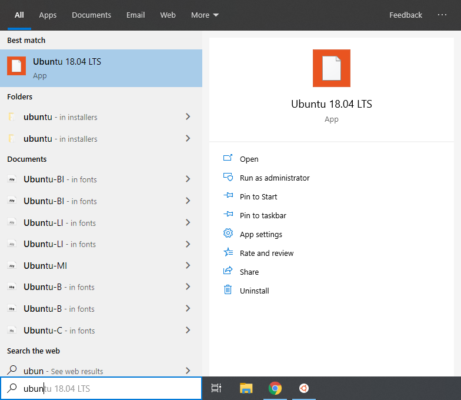

Tienes una nueva entrada en tu menú de inicio.

¡Felicitaciones! Ya puedes operar sobre la terminal de Linux sin problemas.

Un último detallito importante: los archivos que tienes en tu Linux le pertenecen… Para acceder a los archivos que tienes en Windows (o grabar nuevos archivos desde tu Linux) debes ingresar en /mnt/c/Users/TU_USUARIO, donde TU_USUARIO debe ser reemplazado por tu nombre de usuario de Windows.

Ahora sí, cualquier archivo que guardes en esa localización podrá ser accedido con las herramientas propias de Windows.

¡Diviértete!

***OBSERVACION: Esto no esta disponible para Windows 8 y 8.1***
## Modulo 2. Comprender las ventajas del uso de la terminal
### Clase 3 *¿Qué es y cómo funciona el sistema de archivos?*

**Organización de información**

Nuestras computadoras están llenas de información (imágenes, videos, archivos, etc.) y el almacenamiento de esta información supone dos preguntas: ¿Cómo vamos a lograr que esta información esté presente? ¿Cómo vamos a organizar esa información?

De cómo almacenamos la información se encarga la computadora y el sistema operativo.

Como organizamos esa información es algo que nosotros debemos resolver. Y para eso contamos de dos maneras:
- Archivo: todo lo que contiene información
- Directorio: una forma de agrupar archivos y otros directorios.
Todos los archivos, directorios y subdirectorios forma parte del «Árbol de directorio», en donde cada archivo tiene una ruta para llegar.

Identificación de archivos
- Nombre
- Ubicación

En un sistema de archivos no puede existir dos archivos o directorios que tengan el mismo nombre completo, si puede pasar que dos archivos tengan el mismo nombre que otros mientras vivan en diferentes directorios.

Comando para organizar archivos:
- ls: permite ver los archivos de una carpeta
	- ls -a: muestra los archivos, incluso los ocultos
	- ls -l: muestra los archivos en una lista
	- ls -al: muestra todos los archivos (incluido los ocultos) en una lista
- pwd: muestra la ruta de carpetas en la que te encuentras actualmente
- cd: permite navegar entre carpetas
	- cd ~: nos envía a la ruta del usuario
	- cd -: nos envía al último directorio visitado
	- cd /: nos envía a la ruta principal
	- cd carpeta/: navega entre carpetas
	- cd ..: nos devuelve una carpeta atrás

Como organizar los archivos
- mkdir nombre: nos permite crear carpetas
- cp archivo.txt carpeta/: copia un archivo
- rm: nos permite eliminar un archivo. CUIDADO, si realizas mal este comando puedes borrar tu disco duro
	- rmdir: nos permite borrar una carpeta
- mv: nos permite mover un archivo

### Clase 4 ***Práctica:** Comandos para organizar el Sistema de Archivos*

### Clase 5 *Manejo de archivos de texto y utilidades interactivas*
**Tipos de archivos**
- Texto
- Binario

**Archivos binarios**
- Programas ejecutables
- Archivos de datos

**Archivos de texto**
- Páginas web
- Código fuente

**Utilidades interactivas**

Programas que procesan texto en tiempo real

- vim
- nano

***Archivos binarios: son archivos que solo pueden ser entendibles por las computadoras
Archivos de texto: son todos los archivos legibles por humanos***

**vim**
- Creas o editas un archivo texto con «vim archivo.txt»
- Ingresar oprimiendo la tecla 'i' para insertar caracteres
- Con la tecla esc sales del modo editor
- Guardas los cambios del archivo con ':w'
- Sales del editor con ':q'
- Guardar y salir al mismo tiempo ':wq' o ':x'

**nano**
- Ingresas con nano archivo.txt
- Desde un inicio estas en modo edición
- En la parte inferior puedes encontrar ayudas

### Clase 3 *¿Qué es y cómo funciona el sistema de archivos?*

### Clase 3 *¿Qué es y cómo funciona el sistema de archivos?*

### Clase 3 *¿Qué es y cómo funciona el sistema de archivos?*

### Clase 3 *¿Qué es y cómo funciona el sistema de archivos?*

### Clase 3 *¿Qué es y cómo funciona el sistema de archivos?*
